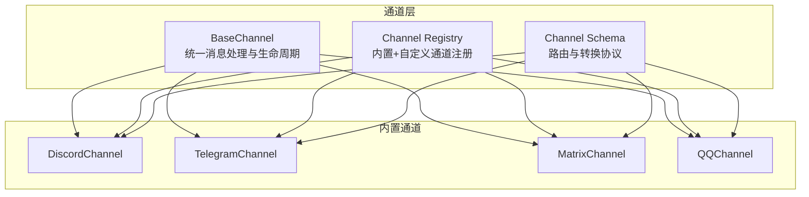
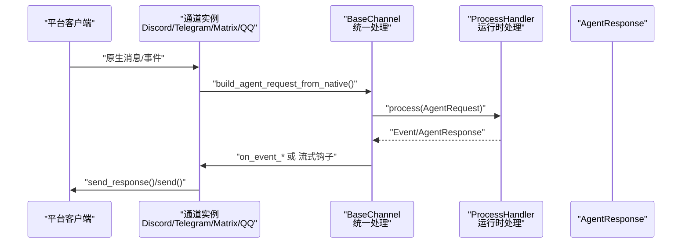
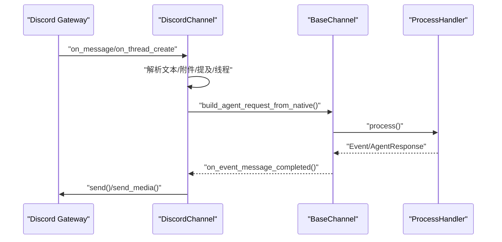
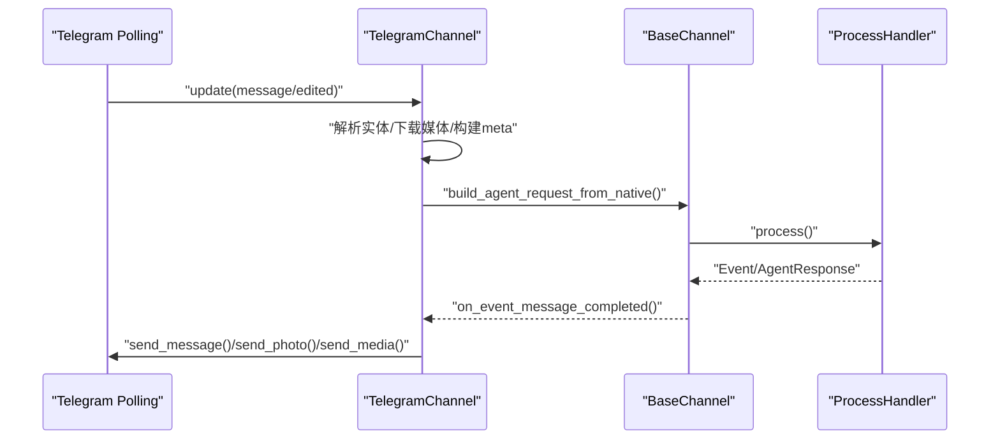
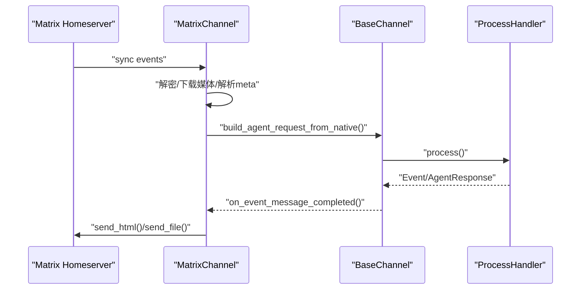
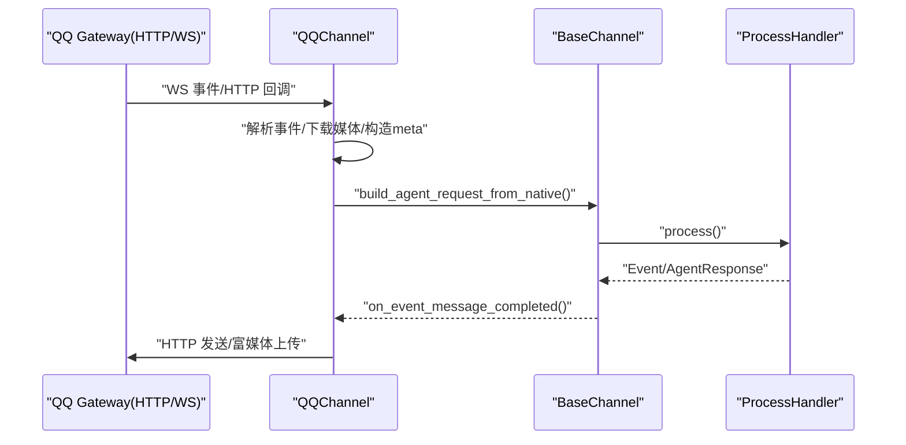
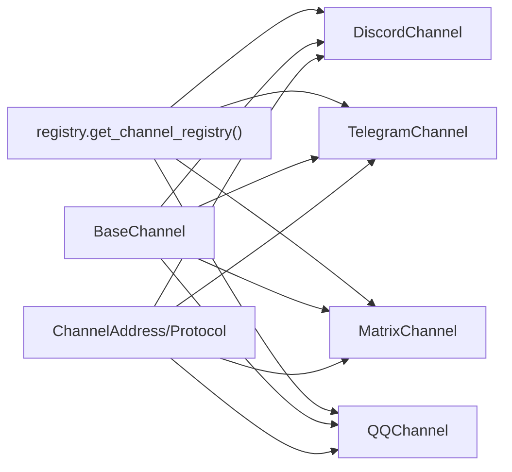

# 其他平台集成

<cite>
**本文引用的文件**
- [src/qwenpaw/app/channels/base.py](file://src/qwenpaw/app/channels/base.py)
- [src/qwenpaw/app/channels/registry.py](file://src/qwenpaw/app/channels/registry.py)
- [src/qwenpaw/app/channels/schema.py](file://src/qwenpaw/app/channels/schema.py)
- [src/qwenpaw/app/channels/discord_/channel.py](file://src/qwenpaw/app/channels/discord_/channel.py)
- [src/qwenpaw/app/channels/telegram/channel.py](file://src/qwenpaw/app/channels/telegram/channel.py)
- [src/qwenpaw/app/channels/matrix/channel.py](file://src/qwenpaw/app/channels/matrix/channel.py)
- [src/qwenpaw/app/channels/qq/channel.py](file://src/qwenpaw/app/channels/qq/channel.py)
- [src/qwenpaw/app/channels/discord_/__init__.py](file://src/qwenpaw/app/channels/discord_/__init__.py)
- [src/qwenpaw/app/channels/telegram/__init__.py](file://src/qwenpaw/app/channels/telegram/__init__.py)
- [src/qwenpaw/app/channels/matrix/__init__.py](file://src/qwenpaw/app/channels/matrix/__init__.py)
- [src/qwenpaw/app/channels/qq/__init__.py](file://src/qwenpaw/app/channels/qq/__init__.py)
</cite>

## 目录
1. [简介](#简介)
2. [项目结构](#项目结构)
3. [核心组件](#核心组件)
4. [架构总览](#架构总览)
5. [详细组件分析](#详细组件分析)
6. [依赖分析](#依赖分析)
7. [性能考虑](#性能考虑)
8. [故障排查指南](#故障排查指南)
9. [结论](#结论)
10. [附录：通用配置与差异对比](#附录通用配置与差异对比)

## 简介
本指南面向希望在 QwenPaw 中集成 Discord、Telegram、Matrix、QQ 等第三方通信平台的开发者与运维人员。文档覆盖以下内容：
- 各平台的认证机制与接入方式
- API 使用与消息格式处理
- 平台特有能力（如 Discord 嵌入消息、Telegram 内联键盘与流式编辑、Matrix 加密通信）
- 跨平台通用配置模式与差异对比
- 消息路由、会话管理与状态同步机制
- 最佳实践与性能优化建议

## 项目结构
QwenPaw 的通道系统以统一的基类与注册表为核心，内置多种通信平台通道，并通过统一的消息转换协议对接运行时。

图示来源
- [src/qwenpaw/app/channels/base.py](file://src/qwenpaw/app/channels/base.py)
- [src/qwenpaw/app/channels/registry.py](file://src/qwenpaw/app/channels/registry.py)
- [src/qwenpaw/app/channels/schema.py](file://src/qwenpaw/app/channels/schema.py)
- [src/qwenpaw/app/channels/discord_/channel.py](file://src/qwenpaw/app/channels/discord_/channel.py)
- [src/qwenpaw/app/channels/telegram/channel.py](file://src/qwenpaw/app/channels/telegram/channel.py)
- [src/qwenpaw/app/channels/matrix/channel.py](file://src/qwenpaw/app/channels/matrix/channel.py)
- [src/qwenpaw/app/channels/qq/channel.py](file://src/qwenpaw/app/channels/qq/channel.py)

章节来源
- [src/qwenpaw/app/channels/base.py](file://src/qwenpaw/app/channels/base.py)
- [src/qwenpaw/app/channels/registry.py](file://src/qwenpaw/app/channels/registry.py)
- [src/qwenpaw/app/channels/schema.py](file://src/qwenpaw/app/channels/schema.py)

## 核心组件
- 统一通道基类：负责消息请求/响应的构建、会话路由、去抖合并、流式事件分发、错误处理与健康检查。
- 通道注册表：集中管理内置通道与自定义通道，支持从工作目录动态发现自定义通道。
- 通道消息协议：定义统一的 ChannelAddress 与转换协议，确保不同平台消息能被标准化处理。

章节来源
- [src/qwenpaw/app/channels/base.py](file://src/qwenpaw/app/channels/base.py)
- [src/qwenpaw/app/channels/registry.py](file://src/qwenpaw/app/channels/registry.py)
- [src/qwenpaw/app/channels/schema.py](file://src/qwenpaw/app/channels/schema.py)

## 架构总览
下图展示 QwenPaw 通道系统的整体交互：通道从平台接收原生消息，转换为统一 AgentRequest，经运行时处理后，再由通道将 AgentResponse 转换为平台特定的回复。

图示来源
- [src/qwenpaw/app/channels/base.py](file://src/qwenpaw/app/channels/base.py)
- [src/qwenpaw/app/channels/discord_/channel.py](file://src/qwenpaw/app/channels/discord_/channel.py)
- [src/qwenpaw/app/channels/telegram/channel.py](file://src/qwenpaw/app/channels/telegram/channel.py)
- [src/qwenpaw/app/channels/matrix/channel.py](file://src/qwenpaw/app/channels/matrix/channel.py)
- [src/qwenpaw/app/channels/qq/channel.py](file://src/qwenpaw/app/channels/qq/channel.py)

## 详细组件分析

### Discord 集成
- 认证机制：基于 Bot Token 初始化客户端，支持代理与可选接受其他机器人消息。
- 接收流程：监听 on_message/on_thread_create，解析文本与附件，识别提及与角色提及，构建 content_parts，按频道/私聊/线程路由。
- 发送流程：支持按频道或用户 DM 发送；文本自动按长度切片；媒体通过本地文件或远程 URL 下载后上传。
- 特有能力：线程创建与首条消息并发到达的竞态处理；消息去重缓存；会话 ID 由频道/DM/线程决定。
- 安全与策略：支持白名单/黑名单、是否需要提及、拒答文案；支持语音消息（音频仅输入）。

图示来源
- [src/qwenpaw/app/channels/discord_/channel.py](file://src/qwenpaw/app/channels/discord_/channel.py)
- [src/qwenpaw/app/channels/base.py](file://src/qwenpaw/app/channels/base.py)

章节来源
- [src/qwenpaw/app/channels/discord_/channel.py](file://src/qwenpaw/app/channels/discord_/channel.py)

### Telegram 集成
- 认证机制：Bot Token，支持代理；轮询拉取更新，具备冲突与网络错误的自恢复策略。
- 接收流程：解析消息实体（命令/提及/文本），下载媒体到本地临时目录，构建 content_parts，按聊天/群组/话题路由。
- 发送流程：HTML 渲染优先，失败回退纯文本；支持分块发送；typing 输入指示器周期性发送。
- 特有能力：流式编辑限制（约每秒一次），占位符与最小间隔控制；媒体下载与本地缓存。
- 安全与策略：白名单/黑名单、是否需要提及、拒答文案；支持工作区专属媒体目录。

图示来源
- [src/qwenpaw/app/channels/telegram/channel.py](file://src/qwenpaw/app/channels/telegram/channel.py)
- [src/qwenpaw/app/channels/base.py](file://src/qwenpaw/app/channels/base.py)

章节来源
- [src/qwenpaw/app/channels/telegram/channel.py](file://src/qwenpaw/app/channels/telegram/channel.py)

### Matrix 集成
- 认证机制：支持 access_token 登录与密码登录；可启用端到端加密（E2EE），加载/上传设备密钥。
- 接收流程：长轮询同步（sync），事件回调处理明文/加密媒体与文本；支持房间成员缓存与 DM 判定。
- 发送流程：Markdown 转 HTML；支持明文/富文本；媒体下载与本地缓存；E2EE 维护（密钥上传/查询/认领）。
- 特有能力：历史缓冲（非提及消息）与上下文标记；房间级提及要求开关；多轮会话序列化（debounce key 基于 room_id）。
- 安全与策略：房间级 allowlist/requireMention；支持 per-room 配置覆盖。

图示来源
- [src/qwenpaw/app/channels/matrix/channel.py](file://src/qwenpaw/app/channels/matrix/channel.py)
- [src/qwenpaw/app/channels/base.py](file://src/qwenpaw/app/channels/base.py)

章节来源
- [src/qwenpaw/app/channels/matrix/channel.py](file://src/qwenpaw/app/channels/matrix/channel.py)

### QQ 集成
- 认证机制：App ID + Client Secret 获取 Access Token；WebSocket 接收事件；HTTP API 发送消息与富媒体。
- 接收流程：WebSocket 事件分派（C2C/AT/GROUP/DIRECT），解析消息类型与元数据，下载富媒体到本地。
- 发送流程：支持文本（含 Markdown 开关）、富媒体（图片/视频/音频/文件）；消息序号与类型控制；URL/裸域名清理策略。
- 特有能力：心跳控制器（线程定时器）；断线重连与指数退避；URL/Markdown 拒绝的两阶段容错。
- 安全与策略：白名单/黑名单、消息序号、速率限制与重试策略。

图示来源
- [src/qwenpaw/app/channels/qq/channel.py](file://src/qwenpaw/app/channels/qq/channel.py)
- [src/qwenpaw/app/channels/base.py](file://src/qwenpaw/app/channels/base.py)

章节来源
- [src/qwenpaw/app/channels/qq/channel.py](file://src/qwenpaw/app/channels/qq/channel.py)

## 依赖分析
- 通道注册：内置通道通过注册表集中管理，支持从工作目录动态发现自定义通道。
- 通道类型：统一的 ChannelType 与 ChannelAddress 提供路由与转换协议。
- 基类耦合：所有内置通道继承 BaseChannel，共享统一的处理逻辑、流式事件与去抖合并。

图示来源
- [src/qwenpaw/app/channels/registry.py](file://src/qwenpaw/app/channels/registry.py)
- [src/qwenpaw/app/channels/schema.py](file://src/qwenpaw/app/channels/schema.py)
- [src/qwenpaw/app/channels/base.py](file://src/qwenpaw/app/channels/base.py)

章节来源
- [src/qwenpaw/app/channels/registry.py](file://src/qwenpaw/app/channels/registry.py)
- [src/qwenpaw/app/channels/schema.py](file://src/qwenpaw/app/channels/schema.py)
- [src/qwenpaw/app/channels/base.py](file://src/qwenpaw/app/channels/base.py)

## 性能考虑
- 去抖与合并：BaseChannel 对无文本消息进行去抖合并，避免频繁往返；平台侧也实现相应合并策略（如 Discord 文本切片、Telegram 分块）。
- 流式输出：Telegram 支持流式编辑（带最小间隔），Matrix/Telegram 可显示 typing 指示，提升交互体验。
- I/O 优化：Matrix/Telegram/QQ 将媒体下载到本地临时目录复用；QQ 支持富媒体直传与本地文件上传。
- 连接稳定性：Telegram/Matrix/QQ 具备轮询/同步与断线重连策略；Discord/Telegram 支持代理与超时配置。
- 速率限制：QQ 对 URL/Markdown 有严格限制，提供两阶段容错；Telegram/Matrix 有各自的速率限制与重试策略。

## 故障排查指南
- 通道不可用
  - 检查 enabled 标志与必要凭据（Token/App ID/Secret）是否正确配置。
  - 查看通道健康检查返回状态与详细信息。
- 连接问题
  - Telegram：冲突/网络错误会触发指数退避重连；确认代理设置与超时参数。
  - Matrix：E2EE 需要设备 ID 与密钥上传；检查 whoami 返回与 store_path。
  - QQ：WebSocket 心跳与断线重连；关注 URL/Markdown 拒绝错误码。
- 消息未送达
  - 检查目标路由（to_handle/meta）是否正确；平台是否支持该目标类型（如 Discord 需要 channel_id 或 user_id）。
  - 确认媒体下载/上传是否成功，路径与权限是否正确。
- 安全策略
  - 白名单/黑名单与提及要求导致消息被忽略；调整策略或在 meta 中添加必要标识。

章节来源
- [src/qwenpaw/app/channels/discord_/channel.py](file://src/qwenpaw/app/channels/discord_/channel.py)
- [src/qwenpaw/app/channels/telegram/channel.py](file://src/qwenpaw/app/channels/telegram/channel.py)
- [src/qwenpaw/app/channels/matrix/channel.py](file://src/qwenpaw/app/channels/matrix/channel.py)
- [src/qwenpaw/app/channels/qq/channel.py](file://src/qwenpaw/app/channels/qq/channel.py)

## 结论
QwenPaw 的通道系统通过统一基类与注册表，实现了对 Discord、Telegram、Matrix、QQ 等平台的一致接入与扩展。开发者只需遵循统一的消息转换协议与路由规范，即可快速完成新平台的适配与上线。针对各平台特性（如 Discord 嵌入、Telegram 流式编辑、Matrix E2EE、QQ 富媒体与 URL 限制），可在配置与策略层面灵活调优，获得更稳定、更高效的跨平台通信体验。

## 附录：通用配置与差异对比

### 通用配置模式
- 通道启用与凭据
  - enabled：是否启用通道
  - token/app_id/client_secret/access_token：平台认证凭据
  - http_proxy/http_proxy_auth：网络代理
  - bot_prefix/show_typing/streaming_enabled：行为与显示选项
- 安全与访问控制
  - dm_policy/group_policy/allow_from/deny_message/require_mention：白名单/黑名单与提及要求
- 会话与路由
  - ChannelAddress.to_handle：统一路由键（kind:id）
  - resolve_session_id：按平台规则生成会话 ID（如 Discord:ch:/dm:，Matrix:room_id）

章节来源
- [src/qwenpaw/app/channels/base.py](file://src/qwenpaw/app/channels/base.py)
- [src/qwenpaw/app/channels/schema.py](file://src/qwenpaw/app/channels/schema.py)

### 平台差异对比
- 认证与连接
  - Discord：Bot Token + 客户端初始化，支持代理与可选接受其他机器人消息
  - Telegram：Bot Token + 轮询，冲突/网络错误自恢复
  - Matrix：access_token 或用户名/密码登录，支持 E2EE，长轮询同步
  - QQ：App ID/Client Secret 获取 Token，WebSocket 接收事件，HTTP API 发送
- 消息格式与富媒体
  - Discord：文本切片、媒体作为附件上传、线程场景特殊处理
  - Telegram：HTML 渲染优先、媒体下载到本地、typing 指示
  - Matrix：Markdown 转 HTML、媒体下载与本地缓存、E2EE 维护
  - QQ：富媒体直传/本地上传、URL/Markdown 严格限制与两阶段容错
- 会话与路由
  - Discord：按频道/DM/线程生成会话 ID
  - Telegram：按 chat_id 生成会话 ID
  - Matrix：按 room_id 生成会话 ID（含历史缓冲）
  - QQ：按 C2C/群组/频道/私聊生成会话 ID
- 特有能力
  - Discord：嵌入消息（需平台支持）、线程竞态处理
  - Telegram：流式编辑（限速）、内联键盘（需平台支持）
  - Matrix：端到端加密、房间级策略
  - QQ：富媒体上传、消息序号与类型控制

章节来源
- [src/qwenpaw/app/channels/discord_/channel.py](file://src/qwenpaw/app/channels/discord_/channel.py)
- [src/qwenpaw/app/channels/telegram/channel.py](file://src/qwenpaw/app/channels/telegram/channel.py)
- [src/qwenpaw/app/channels/matrix/channel.py](file://src/qwenpaw/app/channels/matrix/channel.py)
- [src/qwenpaw/app/channels/qq/channel.py](file://src/qwenpaw/app/channels/qq/channel.py)