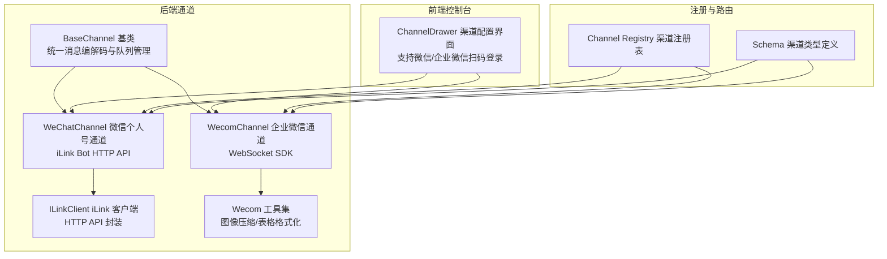
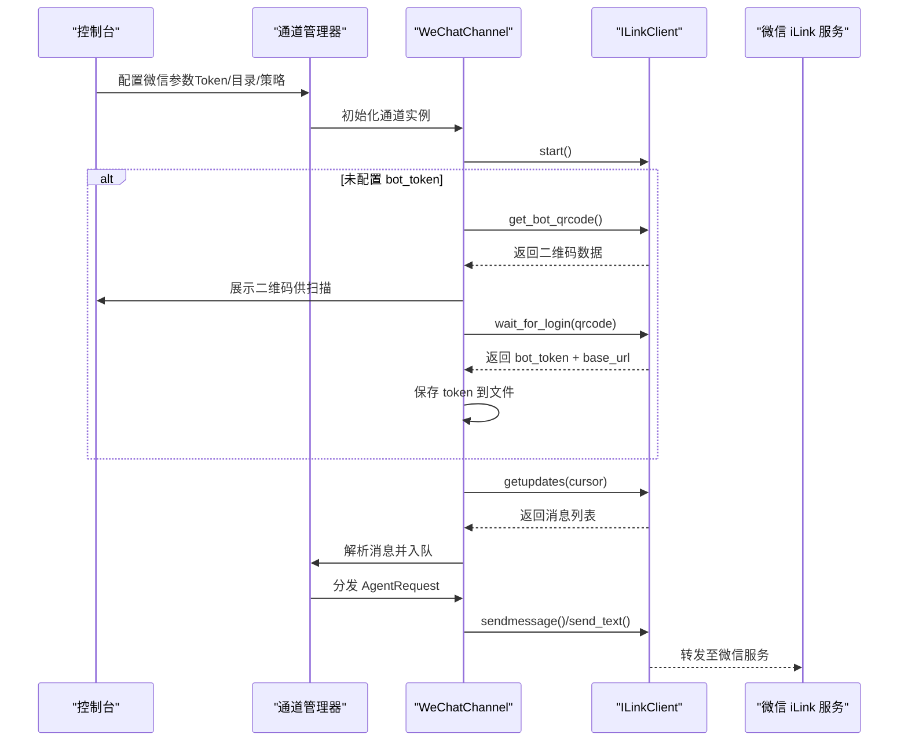
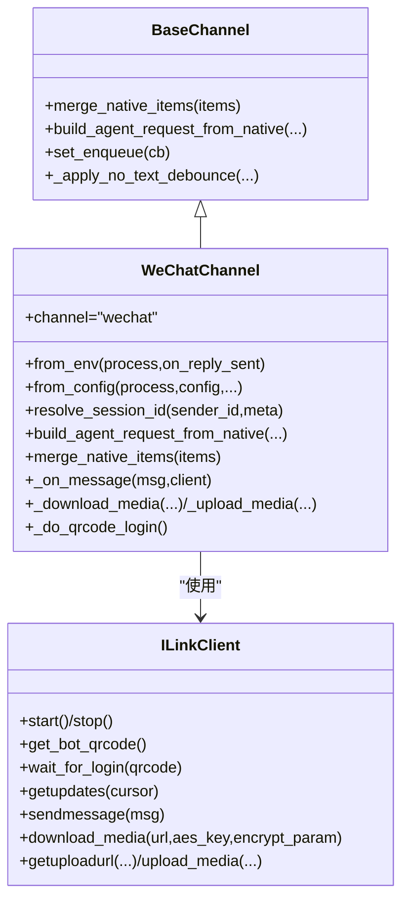
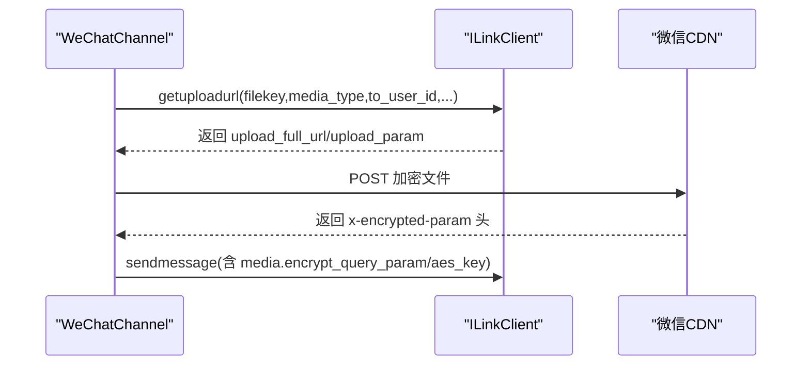
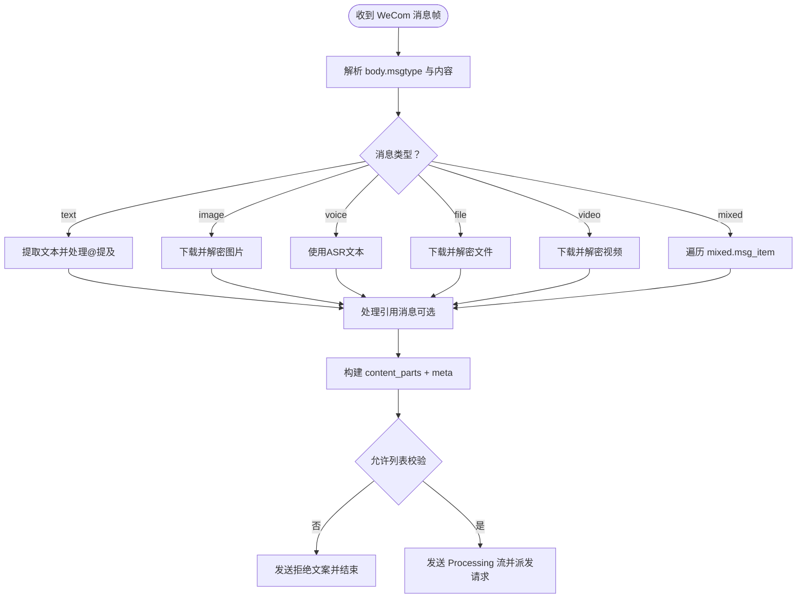
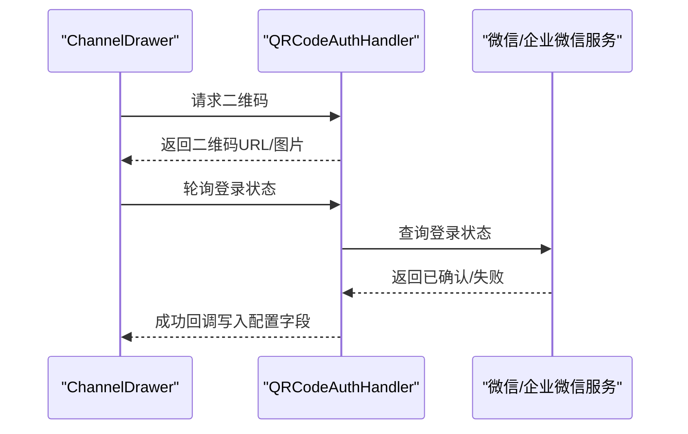
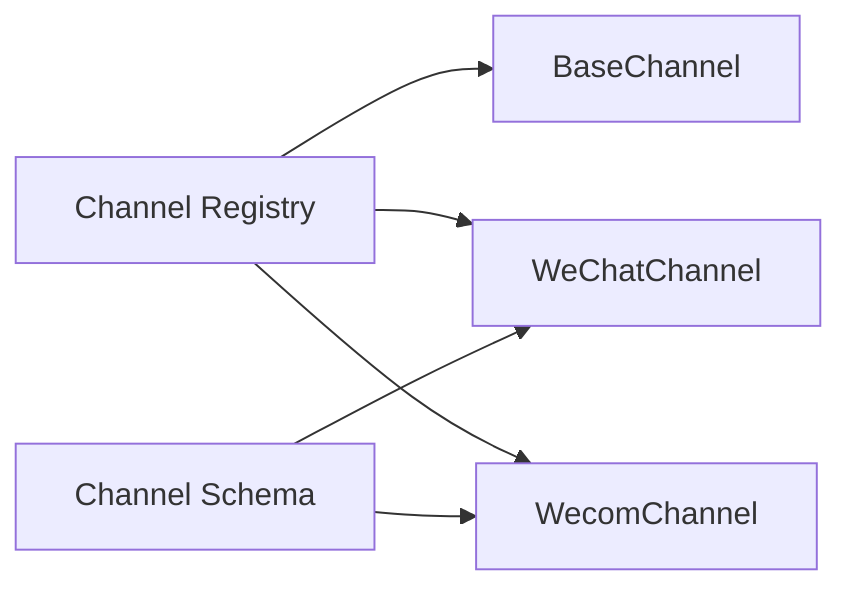

# 微信平台集成

<cite>
**本文档引用的文件**
- [src/qwenpaw/app/channels/wechat/channel.py](file://src/qwenpaw/app/channels/wechat/channel.py)
- [src/qwenpaw/app/channels/wechat/client.py](file://src/qwenpaw/app/channels/wechat/client.py)
- [src/qwenpaw/app/channels/wechat/utils.py](file://src/qwenpaw/app/channels/wechat/utils.py)
- [src/qwenpaw/app/channels/wecom/channel.py](file://src/qwenpaw/app/channels/wecom/channel.py)
- [src/qwenpaw/app/channels/wecom/utils.py](file://src/qwenpaw/app/channels/wecom/utils.py)
- [src/qwenpaw/app/channels/base.py](file://src/qwenpaw/app/channels/base.py)
- [src/qwenpaw/app/channels/registry.py](file://src/qwenpaw/app/channels/registry.py)
- [src/qwenpaw/app/channels/schema.py](file://src/qwenpaw/app/channels/schema.py)
- [src/qwenpaw/app/channels/qrcode_auth_handler.py](file://src/qwenpaw/app/channels/qrcode_auth_handler.py)
- [tests/unit/channels/test_wechat.py](file://tests/unit/channels/test_wechat.py)
- [tests/unit/channels/test_wecom.py](file://tests/unit/channels/test_wecom.py)
- [console/src/pages/Control/Channels/components/ChannelDrawer.tsx](file://console/src/pages/Control/Channels/components/ChannelDrawer.tsx)
</cite>

## 目录
1. [简介](#简介)
2. [项目结构](#项目结构)
3. [核心组件](#核心组件)
4. [架构总览](#架构总览)
5. [详细组件分析](#详细组件分析)
6. [依赖关系分析](#依赖关系分析)
7. [性能考虑](#性能考虑)
8. [故障排除指南](#故障排除指南)
9. [结论](#结论)
10. [附录](#附录)

## 简介
本指南面向在 QwenPaw 中集成微信平台（微信公众号与企业微信）的开发者，系统性说明从服务器配置、Token 验证、消息加解密到消息类型处理、OAuth 认证、微信支付与小程序集成、消息格式转换与表情处理、链接预览等完整流程。文档同时总结微信平台特有的限制与约束，并提供对应的解决方案与最佳实践。

## 项目结构
微信相关能力主要位于后端通道模块，前端控制台用于配置与扫码登录，单元测试覆盖关键路径。

**图表来源**
- [src/qwenpaw/app/channels/base.py:78-168](file://src/qwenpaw/app/channels/base.py#L78-L168)
- [src/qwenpaw/app/channels/wechat/channel.py:60-138](file://src/qwenpaw/app/channels/wechat/channel.py#L60-L138)
- [src/qwenpaw/app/channels/wecom/channel.py:123-183](file://src/qwenpaw/app/channels/wecom/channel.py#L123-L183)
- [src/qwenpaw/app/channels/wechat/client.py:46-128](file://src/qwenpaw/app/channels/wechat/client.py#L46-L128)
- [src/qwenpaw/app/channels/wecom/utils.py:119-222](file://src/qwenpaw/app/channels/wecom/utils.py#L119-L222)
- [console/src/pages/Control/Channels/components/ChannelDrawer.tsx:969-1040](file://console/src/pages/Control/Channels/components/ChannelDrawer.tsx#L969-L1040)
- [src/qwenpaw/app/channels/registry.py:20-37](file://src/qwenpaw/app/channels/registry.py#L20-L37)
- [src/qwenpaw/app/channels/schema.py:30-46](file://src/qwenpaw/app/channels/schema.py#L30-L46)

**章节来源**
- [src/qwenpaw/app/channels/registry.py:20-37](file://src/qwenpaw/app/channels/registry.py#L20-L37)
- [src/qwenpaw/app/channels/schema.py:30-46](file://src/qwenpaw/app/channels/schema.py#L30-L46)

## 核心组件
- BaseChannel：统一的消息编解码、会话路由、去重、时间合并、流式事件分发、工具输出过滤等。
- WeChatChannel：基于 iLink Bot 的 HTTP API，长轮询接收消息，支持文本、图片、语音（ASR）、文件、视频；支持二维码登录与 Token 持久化。
- WecomChannel：基于 aibot WebSocket SDK，接收/发送消息，支持文本、图片、语音（ASR）、文件、视频、混合消息；支持“思考中”流刷新与欢迎语。
- ILinkClient：封装 iLink Bot 的 HTTP API，包括二维码登录、消息拉取、发送、媒体下载上传、打字指示等。
- WeCom 工具集：图像压缩以满足企业微信上传限制、Markdown 表格对齐格式化。

**章节来源**
- [src/qwenpaw/app/channels/base.py:78-168](file://src/qwenpaw/app/channels/base.py#L78-L168)
- [src/qwenpaw/app/channels/wechat/channel.py:60-138](file://src/qwenpaw/app/channels/wechat/channel.py#L60-L138)
- [src/qwenpaw/app/channels/wecom/channel.py:123-183](file://src/qwenpaw/app/channels/wecom/channel.py#L123-L183)
- [src/qwenpaw/app/channels/wechat/client.py:46-128](file://src/qwenpaw/app/channels/wechat/client.py#L46-L128)
- [src/qwenpaw/app/channels/wecom/utils.py:119-222](file://src/qwenpaw/app/channels/wecom/utils.py#L119-L222)

## 架构总览
微信平台集成采用“通道（Channel）+ 客户端（Client）+ 工具（Utils）+ 控制台（Console）”的分层设计：

**图表来源**
- [src/qwenpaw/app/channels/wechat/channel.py:403-443](file://src/qwenpaw/app/channels/wechat/channel.py#L403-L443)
- [src/qwenpaw/app/channels/wechat/client.py:134-200](file://src/qwenpaw/app/channels/wechat/client.py#L134-L200)
- [src/qwenpaw/app/channels/wechat/client.py:205-246](file://src/qwenpaw/app/channels/wechat/client.py#L205-L246)

**章节来源**
- [src/qwenpaw/app/channels/wechat/channel.py:403-518](file://src/qwenpaw/app/channels/wechat/channel.py#L403-L518)
- [src/qwenpaw/app/channels/wechat/client.py:134-246](file://src/qwenpaw/app/channels/wechat/client.py#L134-L246)

## 详细组件分析

### WeChatChannel 组件分析
- 会话标识与路由：私聊使用 wechat:<from_user_id>，群聊使用 wechat:group:<group_id>。
- 长轮询接收：后台线程运行异步事件循环，周期性调用 getupdates，支持断线重试与游标维护。
- 去重与合并：基于 context_token 或组合键进行去重；支持消息合并与定时器触发。
- 允许列表与策略：支持开放、白名单、黑名单策略，可配置拒绝文案。
- 打字指示：根据配置获取 typing_ticket 并发送“正在输入”状态。
- 媒体处理：下载并解密 CDN 媒体（AES-128-ECB），支持图片、文件、视频；语音使用 ASR 文本。
- 发送方法：支持纯文本、图片、文件、视频消息发送，自动加密与上传参数生成。

**图表来源**
- [src/qwenpaw/app/channels/base.py:188-217](file://src/qwenpaw/app/channels/base.py#L188-L217)
- [src/qwenpaw/app/channels/wechat/channel.py:60-138](file://src/qwenpaw/app/channels/wechat/channel.py#L60-L138)
- [src/qwenpaw/app/channels/wechat/client.py:46-128](file://src/qwenpaw/app/channels/wechat/client.py#L46-L128)

**章节来源**
- [src/qwenpaw/app/channels/wechat/channel.py:239-295](file://src/qwenpaw/app/channels/wechat/channel.py#L239-L295)
- [src/qwenpaw/app/channels/wechat/channel.py:523-800](file://src/qwenpaw/app/channels/wechat/channel.py#L523-L800)
- [src/qwenpaw/app/channels/wechat/client.py:339-386](file://src/qwenpaw/app/channels/wechat/client.py#L339-L386)

### ILinkClient 组件分析
- 认证头生成：X-WECHAT-UIN（每请求随机）、Authorization Bearer。
- 二维码登录：获取二维码、轮询状态、等待确认、返回 bot_token 与 base_url。
- 消息收发：getupdates（长轮询）、sendmessage（文本/图片/文件/视频）。
- 媒体下载：支持通过 encrypt_query_param 构造 CDN 下载地址并解密。
- 媒体上传：自动生成 AES 密钥与 filekey，加密文件，获取上传 URL，返回下载参数。

**图表来源**
- [src/qwenpaw/app/channels/wechat/client.py:387-576](file://src/qwenpaw/app/channels/wechat/client.py#L387-L576)
- [src/qwenpaw/app/channels/wechat/client.py:625-724](file://src/qwenpaw/app/channels/wechat/client.py#L625-L724)

**章节来源**
- [src/qwenpaw/app/channels/wechat/client.py:11-44](file://src/qwenpaw/app/channels/wechat/client.py#L11-L44)
- [src/qwenpaw/app/channels/wechat/utils.py:11-26](file://src/qwenpaw/app/channels/wechat/utils.py#L11-L26)
- [src/qwenpaw/app/channels/wechat/utils.py:29-88](file://src/qwenpaw/app/channels/wechat/utils.py#L29-L88)

### WecomChannel 组件分析
- 会话与路由：单聊 wecom:<userid>，群聊 wecom:group:<chatid>；支持群内是否共享会话。
- WebSocket 接收：SDK 回调转异步事件，解析文本、图片、语音（ASR）、文件、视频、混合消息。
- 引用消息处理：支持回复引用的文本/媒体，自动拼接为内容块。
- “思考中”流：发送 Processing 文本并定时刷新，避免超时。
- 媒体处理：下载并解密，按需压缩图片以满足上传大小限制；表格格式化兼容企业微信渲染。
- 发送方法：支持文本、图片、语音、文件、视频与混合消息，统一映射为 msgtype。

**图表来源**
- [src/qwenpaw/app/channels/wecom/channel.py:412-736](file://src/qwenpaw/app/channels/wecom/channel.py#L412-L736)
- [src/qwenpaw/app/channels/wecom/utils.py:119-222](file://src/qwenpaw/app/channels/wecom/utils.py#L119-L222)

**章节来源**
- [src/qwenpaw/app/channels/wecom/channel.py:286-357](file://src/qwenpaw/app/channels/wecom/channel.py#L286-L357)
- [src/qwenpaw/app/channels/wecom/channel.py:412-736](file://src/qwenpaw/app/channels/wecom/channel.py#L412-L736)
- [src/qwenpaw/app/channels/wecom/utils.py:17-116](file://src/qwenpaw/app/channels/wecom/utils.py#L17-L116)

### 控制台配置与扫码登录
- 支持微信与企业微信两种渠道的配置项展示与扫码登录流程。
- 微信：展示二维码、轮询确认、成功后回填 bot_token。
- 企业微信：展示二维码、轮询确认、成功后回填 bot_id 与 secret。

**图表来源**
- [console/src/pages/Control/Channels/components/ChannelDrawer.tsx:986-1006](file://console/src/pages/Control/Channels/components/ChannelDrawer.tsx#L986-L1006)
- [console/src/pages/Control/Channels/components/ChannelDrawer.tsx:865-895](file://console/src/pages/Control/Channels/components/ChannelDrawer.tsx#L865-L895)
- [src/qwenpaw/app/channels/qrcode_auth_handler.py:84-104](file://src/qwenpaw/app/channels/qrcode_auth_handler.py#L84-L104)
- [src/qwenpaw/app/channels/qrcode_auth_handler.py:132-140](file://src/qwenpaw/app/channels/qrcode_auth_handler.py#L132-L140)

**章节来源**
- [console/src/pages/Control/Channels/components/ChannelDrawer.tsx:969-1040](file://console/src/pages/Control/Channels/components/ChannelDrawer.tsx#L969-L1040)
- [src/qwenpaw/app/channels/qrcode_auth_handler.py:84-104](file://src/qwenpaw/app/channels/qrcode_auth_handler.py#L84-L104)

## 依赖关系分析
- 渠道注册：内置渠道通过注册表映射到具体类，支持扩展自定义渠道。
- 类型定义：ChannelType 为字符串，便于插件扩展；内置集合包含 wechat 与 wecom。
- 基类依赖：所有内置通道继承 BaseChannel，复用统一的事件流、去重、合并与渲染逻辑。

**图表来源**
- [src/qwenpaw/app/channels/registry.py:20-37](file://src/qwenpaw/app/channels/registry.py#L20-L37)
- [src/qwenpaw/app/channels/schema.py:30-46](file://src/qwenpaw/app/channels/schema.py#L30-L46)

**章节来源**
- [src/qwenpaw/app/channels/registry.py:20-37](file://src/qwenpaw/app/channels/registry.py#L20-L37)
- [src/qwenpaw/app/channels/schema.py:30-46](file://src/qwenpaw/app/channels/schema.py#L30-L46)

## 性能考虑
- 长轮询与事件循环：WeChatChannel 在独立线程中运行事件循环，避免阻塞主线程；合理设置超时与重试间隔。
- 媒体下载与解密：CDN 下载与 AES 解密为 CPU 密集操作，建议在专用目录缓存并限制并发。
- 图像压缩：企业微信上传限制约 1.9MB，优先 JPEG 转换与质量压缩，再考虑缩放尺寸。
- 流式“思考中”刷新：避免服务端超时，及时清理过期任务，减少内存占用。
- 合并与去重：合理设置合并延迟与去重窗口，平衡实时性与上下文长度。

[本节为通用指导，无需特定文件引用]

## 故障排除指南
- 二维码登录失败或过期
  - 现象：等待确认超时或提示过期。
  - 排查：检查网络连通性、超时配置、日志中二维码状态轮询结果。
  - 参考实现：[src/qwenpaw/app/channels/wechat/client.py:157-200](file://src/qwenpaw/app/channels/wechat/client.py#L157-L200)
- 媒体下载为空或解密失败
  - 现象：图片/文件/视频无法显示或报错。
  - 排查：确认 encrypt_query_param 与 aes_key 是否正确传递；检查 pycryptodome 安装与密钥格式。
  - 参考实现：[src/qwenpaw/app/channels/wechat/client.py:339-386](file://src/qwenpaw/app/channels/wechat/client.py#L339-L386)，[src/qwenpaw/app/channels/wechat/utils.py:29-88](file://src/qwenpaw/app/channels/wechat/utils.py#L29-L88)
- 上传媒体失败且缺少加密参数
  - 现象：上传成功但返回空的 x-encrypted-param。
  - 排查：检查 CDN 响应头、上传 URL 构造逻辑；必要时使用 upload_param 手动拼接。
  - 参考实现：[src/qwenpaw/app/channels/wechat/client.py:521-575](file://src/qwenpaw/app/channels/wechat/client.py#L521-L575)
- 企业微信图像过大
  - 现象：上传被拒或显示异常。
  - 排查：启用图像压缩工具，确保小于 1.9MB。
  - 参考实现：[src/qwenpaw/app/channels/wecom/utils.py:119-222](file://src/qwenpaw/app/channels/wecom/utils.py#L119-L222)
- 允许列表拦截
  - 现象：非白名单用户消息被拒绝。
  - 排查：核对 allow_from 列表与策略配置，必要时调整 deny_message。
  - 参考实现：[src/qwenpaw/app/channels/base.py:324-346](file://src/qwenpaw/app/channels/base.py#L324-L346)

**章节来源**
- [src/qwenpaw/app/channels/wechat/client.py:157-200](file://src/qwenpaw/app/channels/wechat/client.py#L157-L200)
- [src/qwenpaw/app/channels/wechat/client.py:339-386](file://src/qwenpaw/app/channels/wechat/client.py#L339-L386)
- [src/qwenpaw/app/channels/wechat/client.py:521-575](file://src/qwenpaw/app/channels/wechat/client.py#L521-L575)
- [src/qwenpaw/app/channels/wecom/utils.py:119-222](file://src/qwenpaw/app/channels/wecom/utils.py#L119-L222)
- [src/qwenpaw/app/channels/base.py:324-346](file://src/qwenpaw/app/channels/base.py#L324-L346)

## 结论
QwenPaw 对微信平台的集成提供了完善的通道抽象与工具链：统一的 BaseChannel 负责消息编解码与事件流，WeChatChannel 与 ILinkClient 实现了 iLink Bot 的完整生命周期管理，WecomChannel 依托 WebSocket SDK 提供更丰富的消息类型与交互体验。配合控制台的扫码登录与配置界面，开发者可以快速完成微信公众号与企业微信的接入与运维。

[本节为总结，无需特定文件引用]

## 附录

### 微信公众号接入要点
- 服务器配置
  - 使用 ILinkClient 的 get_bot_qrcode 与 wait_for_login 完成一次性扫码登录，随后持久化 bot_token。
  - 参考实现：[src/qwenpaw/app/channels/wechat/client.py:134-200](file://src/qwenpaw/app/channels/wechat/client.py#L134-L200)
- Token 验证与请求头
  - 每次请求添加 X-WECHAT-UIN（随机）与 Authorization Bearer。
  - 参考实现：[src/qwenpaw/app/channels/wechat/utils.py:11-26](file://src/qwenpaw/app/channels/wechat/utils.py#L11-L26)
- 消息加解密
  - 媒体下载后使用 AES-128-ECB 解密；上传前加密并获取 CDN 参数。
  - 参考实现：[src/qwenpaw/app/channels/wechat/client.py:339-386](file://src/qwenpaw/app/channels/wechat/client.py#L339-L386)，[src/qwenpaw/app/channels/wechat/client.py:428-576](file://src/qwenpaw/app/channels/wechat/client.py#L428-L576)

**章节来源**
- [src/qwenpaw/app/channels/wechat/client.py:134-200](file://src/qwenpaw/app/channels/wechat/client.py#L134-L200)
- [src/qwenpaw/app/channels/wechat/utils.py:11-26](file://src/qwenpaw/app/channels/wechat/utils.py#L11-L26)
- [src/qwenpaw/app/channels/wechat/client.py:339-386](file://src/qwenpaw/app/channels/wechat/client.py#L339-L386)
- [src/qwenpaw/app/channels/wechat/client.py:428-576](file://src/qwenpaw/app/channels/wechat/client.py#L428-L576)

### 企业微信接入要点
- 通道选择与配置
  - 使用 WecomChannel，配置 bot_id 与 secret；可开启欢迎语与会话共享策略。
  - 参考实现：[src/qwenpaw/app/channels/wecom/channel.py:123-183](file://src/qwenpaw/app/channels/wecom/channel.py#L123-L183)
- 消息类型处理
  - 文本、图片、语音（ASR）、文件、视频、混合消息均支持；引用消息自动拼接。
  - 参考实现：[src/qwenpaw/app/channels/wecom/channel.py:412-736](file://src/qwenpaw/app/channels/wecom/channel.py#L412-L736)
- 媒体与格式优化
  - 下载并解密媒体；图像压缩至 1.9MB 以内；表格格式化提升渲染一致性。
  - 参考实现：[src/qwenpaw/app/channels/wecom/channel.py:761-795](file://src/qwenpaw/app/channels/wecom/channel.py#L761-L795)，[src/qwenpaw/app/channels/wecom/utils.py:119-222](file://src/qwenpaw/app/channels/wecom/utils.py#L119-L222)

**章节来源**
- [src/qwenpaw/app/channels/wecom/channel.py:123-183](file://src/qwenpaw/app/channels/wecom/channel.py#L123-L183)
- [src/qwenpaw/app/channels/wecom/channel.py:412-736](file://src/qwenpaw/app/channels/wecom/channel.py#L412-L736)
- [src/qwenpaw/app/channels/wecom/utils.py:119-222](file://src/qwenpaw/app/channels/wecom/utils.py#L119-L222)

### OAuth 认证流程（网页授权与用户信息）
- 控制台扫码登录
  - 通过 QRCodeAuthHandler 获取二维码并轮询状态，成功后写入配置字段。
  - 参考实现：[console/src/pages/Control/Channels/components/ChannelDrawer.tsx:986-1006](file://console/src/pages/Control/Channels/components/ChannelDrawer.tsx#L986-L1006)，[src/qwenpaw/app/channels/qrcode_auth_handler.py:84-104](file://src/qwenpaw/app/channels/qrcode_auth_handler.py#L84-L104)
- 用户信息获取
  - 企业微信场景下，消息帧包含 from.userid 等身份信息；可在业务侧结合企业微信 API 获取更详细的用户资料。
  - 参考实现：[src/qwenpaw/app/channels/wecom/channel.py:412-420](file://src/qwenpaw/app/channels/wecom/channel.py#L412-L420)

**章节来源**
- [console/src/pages/Control/Channels/components/ChannelDrawer.tsx:986-1006](file://console/src/pages/Control/Channels/components/ChannelDrawer.tsx#L986-L1006)
- [src/qwenpaw/app/channels/qrcode_auth_handler.py:84-104](file://src/qwenpaw/app/channels/qrcode_auth_handler.py#L84-L104)
- [src/qwenpaw/app/channels/wecom/channel.py:412-420](file://src/qwenpaw/app/channels/wecom/channel.py#L412-L420)

### 微信支付与小程序集成
- 微信支付
  - 本仓库未提供微信支付相关实现；如需集成，请在应用层通过微信支付官方 SDK 或服务端接口完成。
- 小程序
  - 本仓库未提供小程序相关实现；如需集成，请在应用层通过微信小程序官方 SDK 或服务端接口完成。

[本节为通用指导，无需特定文件引用]

### 消息格式转换、表情处理与链接预览
- 消息格式转换
  - BaseChannel 提供统一的 AgentRequest/AgentResponse 转换与渲染风格控制。
  - 参考实现：[src/qwenpaw/app/channels/base.py:119-167](file://src/qwenpaw/app/channels/base.py#L119-L167)
- 表情与特殊字符
  - 事件序列化包含 UTF-8 转换与替换策略，避免代理消息中的非法代理字符导致传输失败。
  - 参考实现：[src/qwenpaw/app/channels/base.py:750-776](file://src/qwenpaw/app/channels/base.py#L750-L776)
- 链接预览
  - 本仓库未提供链接预览功能；如需实现，请在应用层通过微信官方能力或第三方服务完成。

**章节来源**
- [src/qwenpaw/app/channels/base.py:750-776](file://src/qwenpaw/app/channels/base.py#L750-L776)

### 微信平台特有限制与最佳实践
- 限制
  - 企业微信图片上传大小约 1.9MB；建议在发送前压缩。
  - iLink Bot 长轮询最大保持约 35 秒；注意超时与重试策略。
  - 媒体下载需正确的 encrypt_query_param 与 aes_key，否则无法显示。
- 最佳实践
  - 使用 allow_from 白名单与 deny_message 控制访问。
  - 合理设置 message_merge_enabled 与合并延迟，缓解上下文长度限制。
  - 在专用媒体目录缓存下载文件，避免重复下载与解密。
  - 对于企业微信群聊，可选择共享会话或隔离成员，按业务需求配置。
  - 对于混合消息与引用消息，统一拼接为 content_parts，保证回复一致性。

**章节来源**
- [src/qwenpaw/app/channels/wecom/utils.py:13-14](file://src/qwenpaw/app/channels/wecom/utils.py#L13-L14)
- [src/qwenpaw/app/channels/wechat/client.py:38-43](file://src/qwenpaw/app/channels/wechat/client.py#L38-L43)
- [src/qwenpaw/app/channels/base.py:324-346](file://src/qwenpaw/app/channels/base.py#L324-L346)
- [src/qwenpaw/app/channels/wechat/channel.py:125-132](file://src/qwenpaw/app/channels/wechat/channel.py#L125-L132)