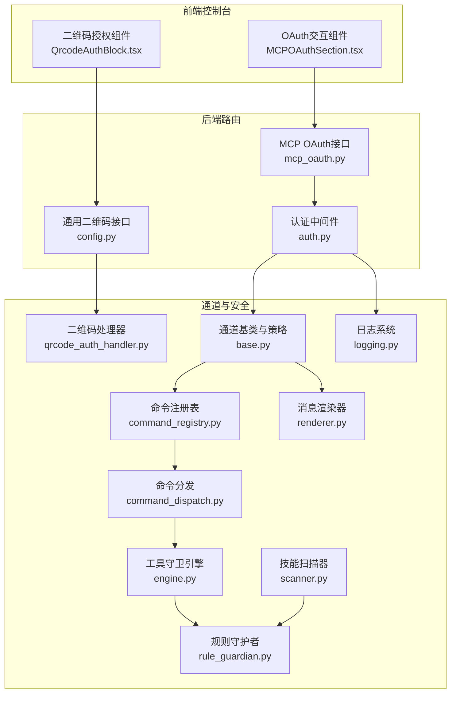
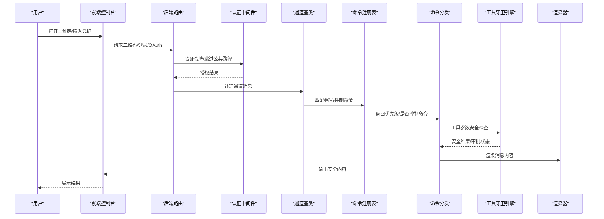
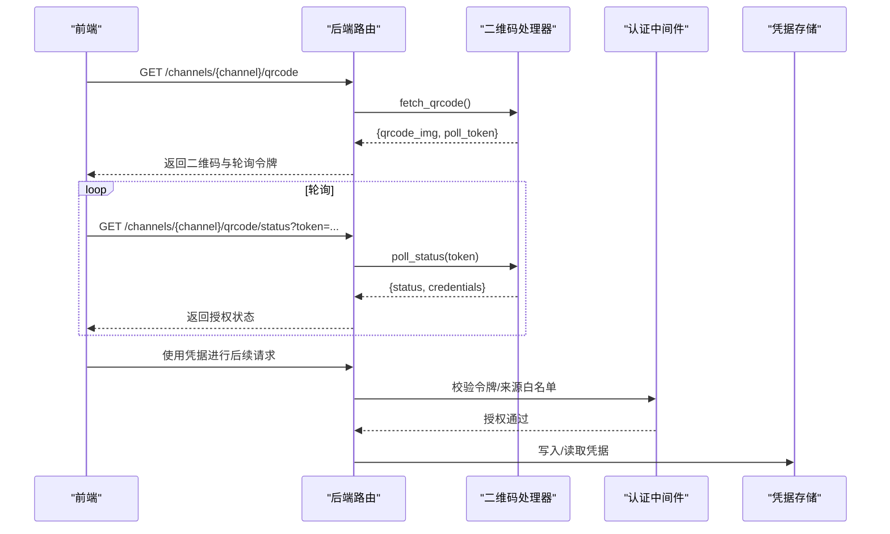
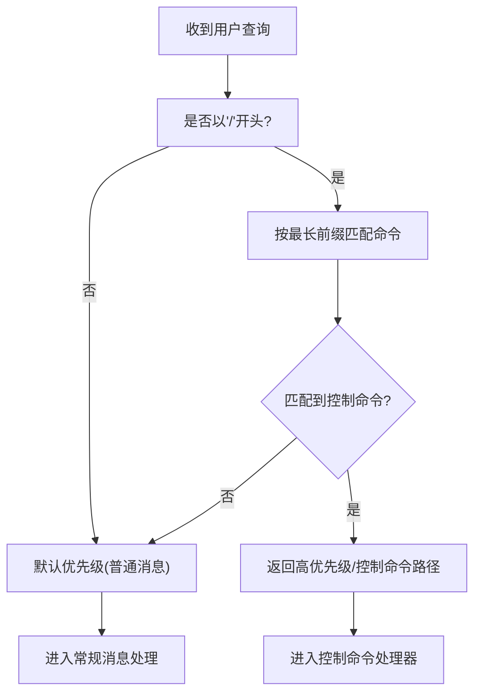
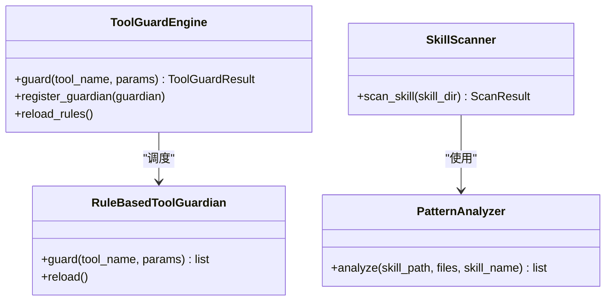
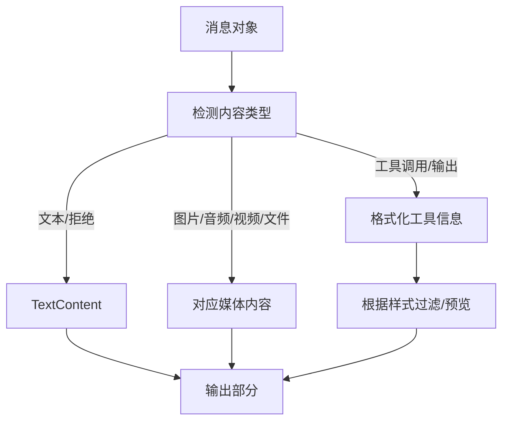
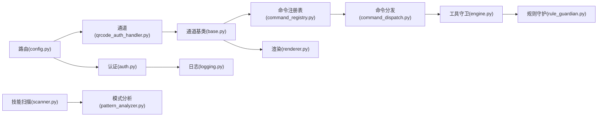

# 通道安全配置

<cite>
**本文档引用的文件**
- [qrcode_auth_handler.py](file://src/qwenpaw/app/channels/qrcode_auth_handler.py)
- [config.py](file://src/qwenpaw/app/routers/config.py)
- [useChannelQrcode.ts](file://console/src/pages/Control/Channels/components/useChannelQrcode.ts)
- [QrcodeAuthBlock.tsx](file://console/src/pages/Control/Channels/components/QrcodeAuthBlock.tsx)
- [auth.py](file://src/qwenpaw/app/auth.py)
- [mcp_oauth.py](file://src/qwenpaw/app/routers/mcp_oauth.py)
- [MCPOAuthSection.tsx](file://console/src/pages/Agent/MCP/components/MCPOAuthSection.tsx)
- [base.py](file://src/qwenpaw/app/channels/base.py)
- [command_registry.py](file://src/qwenpaw/app/channels/command_registry.py)
- [command_dispatch.py](file://src/qwenpaw/app/runner/command_dispatch.py)
- [permissions.py](file://src/qwenpaw/agents/acp/permissions.py)
- [engine.py](file://src/qwenpaw/security/tool_guard/engine.py)
- [rule_guardian.py](file://src/qwenpaw/security/tool_guard/guardians/rule_guardian.py)
- [scanner.py](file://src/qwenpaw/security/skill_scanner/scanner.py)
- [pattern_analyzer.py](file://src/qwenpaw/security/skill_scanner/analyzers/pattern_analyzer.py)
- [renderer.py](file://src/qwenpaw/app/channels/renderer.py)
- [format_html.py](file://src/qwenpaw/app/channels/telegram/format_html.py)
- [logging.py](file://src/qwenpaw/utils/logging.py)
- [SECURITY.md](file://SECURITY.md)
</cite>

## 目录
1. [简介](#简介)
2. [项目结构](#项目结构)
3. [核心组件](#核心组件)
4. [架构总览](#架构总览)
5. [详细组件分析](#详细组件分析)
6. [依赖分析](#依赖分析)
7. [性能考虑](#性能考虑)
8. [故障排查指南](#故障排查指南)
9. [结论](#结论)
10. [附录](#附录)

## 简介
本指南面向QwenPaw的通道安全配置，围绕以下目标展开：
- 通道认证机制：二维码认证（微信/企业微信/钉钉/飞书）、API密钥验证与OAuth流程
- 命令注册表安全策略：命令白名单、权限控制与执行限制
- 消息渲染安全：XSS防护、内容过滤与恶意链接检测
- 通道间数据隔离与访问控制
- 安全审计、日志记录与异常监控
- 常见安全威胁防护与应急响应流程

## 项目结构
QwenPaw在后端通过统一的通道管理器与路由层实现多通道接入；前端通过React组件提供二维码授权与OAuth交互界面；安全相关能力由认证中间件、工具守卫、技能扫描器与渲染器共同构成。

**图表来源**
- [config.py:252-292](file://src/qwenpaw/app/routers/config.py#L252-L292)
- [qrcode_auth_handler.py:1-589](file://src/qwenpaw/app/channels/qrcode_auth_handler.py#L1-L589)
- [auth.py:567-641](file://src/qwenpaw/app/auth.py#L567-L641)
- [base.py:78-800](file://src/qwenpaw/app/channels/base.py#L78-L800)
- [command_registry.py:1-291](file://src/qwenpaw/app/channels/command_registry.py#L1-L291)
- [command_dispatch.py:137-176](file://src/qwenpaw/app/runner/command_dispatch.py#L137-L176)
- [engine.py:1-269](file://src/qwenpaw/security/tool_guard/engine.py#L1-L269)
- [rule_guardian.py:1-758](file://src/qwenpaw/security/tool_guard/guardians/rule_guardian.py#L1-L758)
- [scanner.py:1-319](file://src/qwenpaw/security/skill_scanner/scanner.py#L1-L319)
- [renderer.py:1-384](file://src/qwenpaw/app/channels/renderer.py#L1-L384)
- [logging.py:1-226](file://src/qwenpaw/utils/logging.py#L1-L226)

**章节来源**
- [config.py:252-292](file://src/qwenpaw/app/routers/config.py#L252-L292)
- [qrcode_auth_handler.py:1-589](file://src/qwenpaw/app/channels/qrcode_auth_handler.py#L1-L589)
- [auth.py:567-641](file://src/qwenpaw/app/auth.py#L567-L641)
- [base.py:78-800](file://src/qwenpaw/app/channels/base.py#L78-L800)
- [command_registry.py:1-291](file://src/qwenpaw/app/channels/command_registry.py#L1-L291)
- [command_dispatch.py:137-176](file://src/qwenpaw/app/runner/command_dispatch.py#L137-L176)
- [engine.py:1-269](file://src/qwenpaw/security/tool_guard/engine.py#L1-L269)
- [rule_guardian.py:1-758](file://src/qwenpaw/security/tool_guard/guardians/rule_guardian.py#L1-L758)
- [scanner.py:1-319](file://src/qwenpaw/security/skill_scanner/scanner.py#L1-L319)
- [renderer.py:1-384](file://src/qwenpaw/app/channels/renderer.py#L1-L384)
- [logging.py:1-226](file://src/qwenpaw/utils/logging.py#L1-L226)

## 核心组件
- 通道认证与授权
  - 二维码授权：统一二维码接口与各渠道处理器，支持微信/企业微信/钉钉/飞书等
  - API密钥与OAuth：认证中间件与MCP OAuth端点
- 命令注册表与执行控制
  - 命令优先级与白名单匹配，控制命令执行路径
- 工具调用与技能安全
  - 工具守卫引擎与规则守护者，技能扫描器与模式分析器
- 消息渲染与内容安全
  - 渲染器与HTML转义/保护逻辑，防止XSS与恶意链接
- 日志与审计
  - 彩色终端输出、文件轮转、访问日志过滤与异常记录

**章节来源**
- [qrcode_auth_handler.py:1-589](file://src/qwenpaw/app/channels/qrcode_auth_handler.py#L1-L589)
- [config.py:252-292](file://src/qwenpaw/app/routers/config.py#L252-L292)
- [auth.py:567-641](file://src/qwenpaw/app/auth.py#L567-L641)
- [mcp_oauth.py:406-673](file://src/qwenpaw/app/routers/mcp_oauth.py#L406-L673)
- [command_registry.py:1-291](file://src/qwenpaw/app/channels/command_registry.py#L1-L291)
- [engine.py:1-269](file://src/qwenpaw/security/tool_guard/engine.py#L1-L269)
- [rule_guardian.py:1-758](file://src/qwenpaw/security/tool_guard/guardians/rule_guardian.py#L1-L758)
- [scanner.py:1-319](file://src/qwenpaw/security/skill_scanner/scanner.py#L1-L319)
- [pattern_analyzer.py:315-347](file://src/qwenpaw/security/skill_scanner/analyzers/pattern_analyzer.py#L315-L347)
- [renderer.py:1-384](file://src/qwenpaw/app/channels/renderer.py#L1-L384)
- [format_html.py:42-121](file://src/qwenpaw/app/channels/telegram/format_html.py#L42-L121)
- [logging.py:1-226](file://src/qwenpaw/utils/logging.py#L1-L226)

## 架构总览
下图展示从用户发起到消息渲染的关键安全路径，涵盖认证、授权、命令解析、工具调用与渲染输出。

**图表来源**
- [config.py:252-292](file://src/qwenpaw/app/routers/config.py#L252-L292)
- [auth.py:567-641](file://src/qwenpaw/app/auth.py#L567-L641)
- [base.py:78-800](file://src/qwenpaw/app/channels/base.py#L78-L800)
- [command_registry.py:140-222](file://src/qwenpaw/app/channels/command_registry.py#L140-L222)
- [command_dispatch.py:137-176](file://src/qwenpaw/app/runner/command_dispatch.py#L137-L176)
- [engine.py:200-257](file://src/qwenpaw/security/tool_guard/engine.py#L200-L257)
- [renderer.py:87-350](file://src/qwenpaw/app/channels/renderer.py#L87-L350)

## 详细组件分析

### 通道认证机制
- 二维码认证
  - 后端提供统一二维码接口与状态轮询，具体渠道由处理器实现
  - 前端使用自定义Hook处理二维码生成、轮询与成功回调
- API密钥验证
  - 认证中间件按路径白名单与来源主机策略放行或要求Bearer令牌
  - 支持单用户注册、密码哈希、JWT签名与撤销列表
- OAuth流程（MCP）
  - 动态发现OAuth元数据，生成PKCE参数，完成授权码交换并持久化令牌
  - 前端通过弹窗与轮询实现交互式授权

**图表来源**
- [config.py:252-292](file://src/qwenpaw/app/routers/config.py#L252-L292)
- [qrcode_auth_handler.py:1-589](file://src/qwenpaw/app/channels/qrcode_auth_handler.py#L1-L589)
- [useChannelQrcode.ts:1-43](file://console/src/pages/Control/Channels/components/useChannelQrcode.ts#L1-L43)
- [QrcodeAuthBlock.tsx:1-62](file://console/src/pages/Control/Channels/components/QrcodeAuthBlock.tsx#L1-L62)
- [auth.py:567-641](file://src/qwenpaw/app/auth.py#L567-L641)

**章节来源**
- [config.py:252-292](file://src/qwenpaw/app/routers/config.py#L252-L292)
- [qrcode_auth_handler.py:1-589](file://src/qwenpaw/app/channels/qrcode_auth_handler.py#L1-L589)
- [useChannelQrcode.ts:1-43](file://console/src/pages/Control/Channels/components/useChannelQrcode.ts#L1-L43)
- [QrcodeAuthBlock.tsx:1-62](file://console/src/pages/Control/Channels/components/QrcodeAuthBlock.tsx#L1-L62)
- [auth.py:567-641](file://src/qwenpaw/app/auth.py#L567-L641)
- [mcp_oauth.py:406-673](file://src/qwenpaw/app/routers/mcp_oauth.py#L406-L673)
- [MCPOAuthSection.tsx:41-270](file://console/src/pages/Agent/MCP/components/MCPOAuthSection.tsx#L41-L270)

### 命令注册表与权限控制
- 命令优先级与白名单
  - 通过命令前缀匹配与优先级映射，区分紧急控制命令与普通会话消息
  - 控制命令路径在运行时被拦截并进入专用处理器
- 通道访问控制
  - DM与群组策略独立配置，支持开放/受限模式与允许列表
  - 可配置提及要求，仅当机器人被@或携带命令时才处理

**图表来源**
- [command_registry.py:140-222](file://src/qwenpaw/app/channels/command_registry.py#L140-L222)
- [command_dispatch.py:137-176](file://src/qwenpaw/app/runner/command_dispatch.py#L137-L176)
- [base.py:324-346](file://src/qwenpaw/app/channels/base.py#L324-L346)

**章节来源**
- [command_registry.py:1-291](file://src/qwenpaw/app/channels/command_registry.py#L1-L291)
- [command_dispatch.py:137-176](file://src/qwenpaw/app/runner/command_dispatch.py#L137-L176)
- [base.py:324-346](file://src/qwenpaw/app/channels/base.py#L324-L346)

### 工具调用与技能安全
- 工具守卫引擎
  - 统一调度多个守护者（规则、路径、逃逸检测），聚合结果并支持自动拒绝
  - 支持启用开关、规则重载与受保护工具集
- 规则守护者
  - 基于YAML签名的正则匹配，覆盖危险命令注入、路径穿越、敏感文件访问等
  - 特别增强rm命令检测，识别工作区内/外路径并提示风险
- 技能扫描器
  - 遍历技能包文件，基于模式分析器识别敏感内容与硬编码凭证
  - 支持策略驱动的去重与扩展

**图表来源**
- [engine.py:54-269](file://src/qwenpaw/security/tool_guard/engine.py#L54-L269)
- [rule_guardian.py:559-758](file://src/qwenpaw/security/tool_guard/guardians/rule_guardian.py#L559-L758)
- [scanner.py:76-319](file://src/qwenpaw/security/skill_scanner/scanner.py#L76-L319)
- [pattern_analyzer.py:315-347](file://src/qwenpaw/security/skill_scanner/analyzers/pattern_analyzer.py#L315-L347)

**章节来源**
- [engine.py:1-269](file://src/qwenpaw/security/tool_guard/engine.py#L1-L269)
- [rule_guardian.py:1-758](file://src/qwenpaw/security/tool_guard/guardians/rule_guardian.py#L1-L758)
- [scanner.py:1-319](file://src/qwenpaw/security/skill_scanner/scanner.py#L1-L319)
- [pattern_analyzer.py:315-347](file://src/qwenpaw/security/skill_scanner/analyzers/pattern_analyzer.py#L315-L347)

### 消息渲染与内容安全
- 渲染器
  - 将消息转换为可发送的内容块，支持文本、图片、音频、视频与文件
  - 可配置隐藏工具细节、过滤思考内容与内部工具媒体
- HTML转义与保护
  - Telegram渲染器对代码块、行内代码与链接进行转义与保护，避免XSS
  - 链接URL二次转义，保留查询参数安全性

**图表来源**
- [renderer.py:87-350](file://src/qwenpaw/app/channels/renderer.py#L87-L350)
- [format_html.py:42-121](file://src/qwenpaw/app/channels/telegram/format_html.py#L42-L121)

**章节来源**
- [renderer.py:1-384](file://src/qwenpaw/app/channels/renderer.py#L1-L384)
- [format_html.py:42-121](file://src/qwenpaw/app/channels/telegram/format_html.py#L42-L121)

### 通道间数据隔离与访问控制
- 会话隔离
  - 通道基类通过会话ID与去抖缓冲实现消息合并与时间窗口合并，确保同一会话内的有序处理
- 访问控制
  - DM与群组策略独立，允许列表与拒绝消息可配置
  - 提及要求仅在群组场景生效，避免误触发
- ACP权限适配
  - 对工具调用构建暂停权限请求，包含目标、动作、摘要与命令路径等字段，便于审批

**章节来源**
- [base.py:169-346](file://src/qwenpaw/app/channels/base.py#L169-L346)
- [permissions.py:20-52](file://src/qwenpaw/agents/acp/permissions.py#L20-L52)

### 安全审计、日志记录与异常监控
- 日志配置
  - 彩色终端输出、文件轮转（5MiB/3份备份），Windows下容忍文件锁定导致的旋转失败
  - 过滤第三方库日志，仅输出项目命名空间日志
- 异常监控
  - 中间件捕获未认证与过期令牌，返回标准错误
  - 渲染器与通道处理中对序列化失败进行降级处理

**章节来源**
- [logging.py:1-226](file://src/qwenpaw/utils/logging.py#L1-L226)
- [auth.py:567-641](file://src/qwenpaw/app/auth.py#L567-L641)
- [base.py:778-800](file://src/qwenpaw/app/channels/base.py#L778-L800)

## 依赖分析
- 组件耦合
  - 路由层依赖认证中间件与通道处理器
  - 通道基类依赖命令注册表与渲染器
  - 工具守卫引擎依赖多个守护者实现
  - 技能扫描器依赖模式分析器与策略
- 外部依赖
  - FastAPI、Starlette中间件栈、httpx异步HTTP客户端
  - segno用于二维码生成

**图表来源**
- [config.py:252-292](file://src/qwenpaw/app/routers/config.py#L252-L292)
- [auth.py:567-641](file://src/qwenpaw/app/auth.py#L567-L641)
- [qrcode_auth_handler.py:1-589](file://src/qwenpaw/app/channels/qrcode_auth_handler.py#L1-L589)
- [base.py:78-800](file://src/qwenpaw/app/channels/base.py#L78-L800)
- [command_registry.py:1-291](file://src/qwenpaw/app/channels/command_registry.py#L1-L291)
- [command_dispatch.py:137-176](file://src/qwenpaw/app/runner/command_dispatch.py#L137-L176)
- [engine.py:1-269](file://src/qwenpaw/security/tool_guard/engine.py#L1-L269)
- [rule_guardian.py:1-758](file://src/qwenpaw/security/tool_guard/guardians/rule_guardian.py#L1-L758)
- [scanner.py:1-319](file://src/qwenpaw/security/skill_scanner/scanner.py#L1-L319)
- [pattern_analyzer.py:315-347](file://src/qwenpaw/security/skill_scanner/analyzers/pattern_analyzer.py#L315-L347)
- [renderer.py:1-384](file://src/qwenpaw/app/channels/renderer.py#L1-L384)
- [logging.py:1-226](file://src/qwenpaw/utils/logging.py#L1-L226)

**章节来源**
- [config.py:252-292](file://src/qwenpaw/app/routers/config.py#L252-L292)
- [auth.py:567-641](file://src/qwenpaw/app/auth.py#L567-L641)
- [qrcode_auth_handler.py:1-589](file://src/qwenpaw/app/channels/qrcode_auth_handler.py#L1-L589)
- [base.py:78-800](file://src/qwenpaw/app/channels/base.py#L78-L800)
- [command_registry.py:1-291](file://src/qwenpaw/app/channels/command_registry.py#L1-L291)
- [command_dispatch.py:137-176](file://src/qwenpaw/app/runner/command_dispatch.py#L137-L176)
- [engine.py:1-269](file://src/qwenpaw/security/tool_guard/engine.py#L1-L269)
- [rule_guardian.py:1-758](file://src/qwenpaw/security/tool_guard/guardians/rule_guardian.py#L1-L758)
- [scanner.py:1-319](file://src/qwenpaw/security/skill_scanner/scanner.py#L1-L319)
- [pattern_analyzer.py:315-347](file://src/qwenpaw/security/skill_scanner/analyzers/pattern_analyzer.py#L315-L347)
- [renderer.py:1-384](file://src/qwenpaw/app/channels/renderer.py#L1-L384)
- [logging.py:1-226](file://src/qwenpaw/utils/logging.py#L1-L226)

## 性能考虑
- 二维码生成与轮询
  - QR码图像生成采用内存流与PNG编码，建议控制轮询频率与超时
- 工具守卫与技能扫描
  - 规则加载与编译正则表达式，建议缓存与按需重载
  - 扫描器限制最大文件数与单文件大小，避免大包扫描阻塞
- 渲染与序列化
  - 渲染器对长文本与媒体内容进行预览截断，减少传输体积
  - 事件序列化失败时采用降级方案，保证稳定性

[本节为通用指导，无需特定文件引用]

## 故障排查指南
- 二维码授权失败
  - 检查渠道处理器返回的状态与凭据，确认轮询令牌有效且未过期
  - 前端轮询间隔与错误提示需正确处理“过期/失败”状态
- 认证失败
  - 确认令牌格式、签名与有效期；检查撤销列表是否包含当前令牌
  - 公共路径与来源主机白名单是否导致意外放行
- 命令未执行
  - 核对命令前缀匹配与优先级设置；确认是否命中控制命令路径
  - 检查通道策略（DM/群组）与允许列表
- 工具调用被拒绝
  - 查看工具守卫结果与严重级别；必要时调整规则或禁用自动拒绝
  - 技能扫描报告中的敏感项需清理或移除
- 渲染异常
  - 文本编码问题采用容错转码；媒体URL格式需符合通道要求

**章节来源**
- [qrcode_auth_handler.py:1-589](file://src/qwenpaw/app/channels/qrcode_auth_handler.py#L1-L589)
- [auth.py:567-641](file://src/qwenpaw/app/auth.py#L567-L641)
- [command_registry.py:140-222](file://src/qwenpaw/app/channels/command_registry.py#L140-L222)
- [engine.py:200-257](file://src/qwenpaw/security/tool_guard/engine.py#L200-L257)
- [scanner.py:148-242](file://src/qwenpaw/security/skill_scanner/scanner.py#L148-L242)
- [renderer.py:778-794](file://src/qwenpaw/app/channels/renderer.py#L778-L794)

## 结论
QwenPaw通过统一的通道管理、严格的认证与授权、完善的命令与工具安全策略、以及可审计的日志体系，构建了面向个人操作员的通道安全基线。建议在生产环境中：
- 严格限制通道与用户范围，启用二维码与令牌认证
- 配置命令白名单与高优先级控制命令，避免误触发
- 开启工具守卫与技能扫描，定期审查规则与扫描报告
- 加强日志轮转与访问控制，配合异常监控快速定位问题

[本节为总结性内容，无需特定文件引用]

## 附录
- 安全策略与信任模型
  - 单操作员边界、共享委托授权、通道与用户限制、最小权限与沙箱
  - 报告漏洞的流程与范围界定，遵循安全政策文档

**章节来源**
- [SECURITY.md:65-158](file://SECURITY.md#L65-L158)