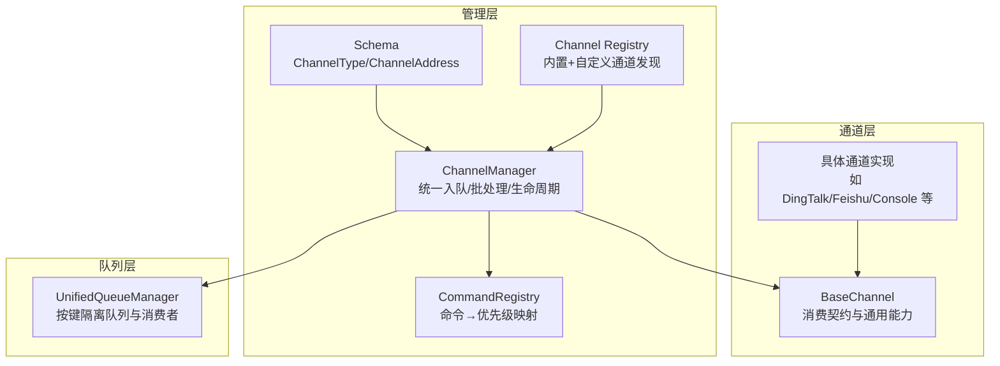
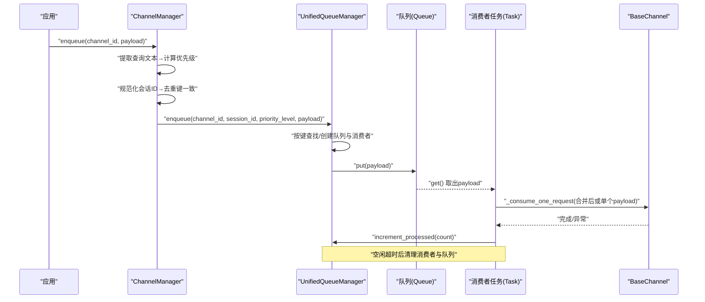
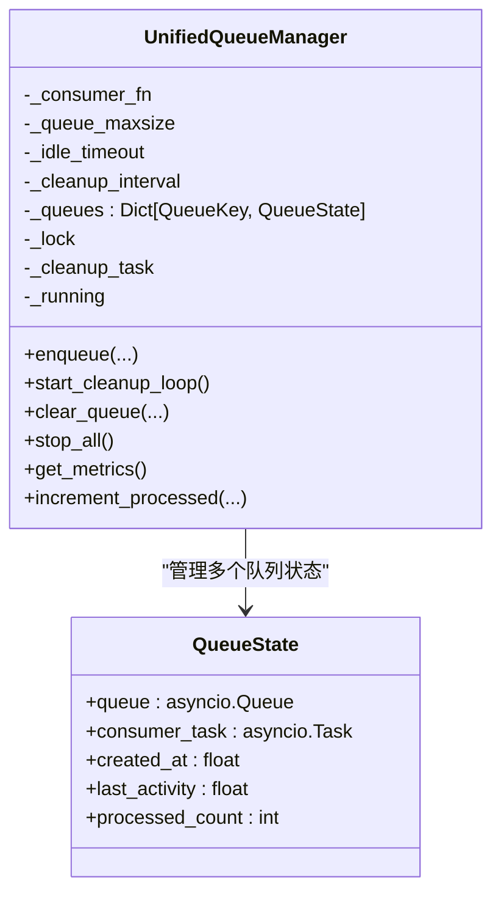
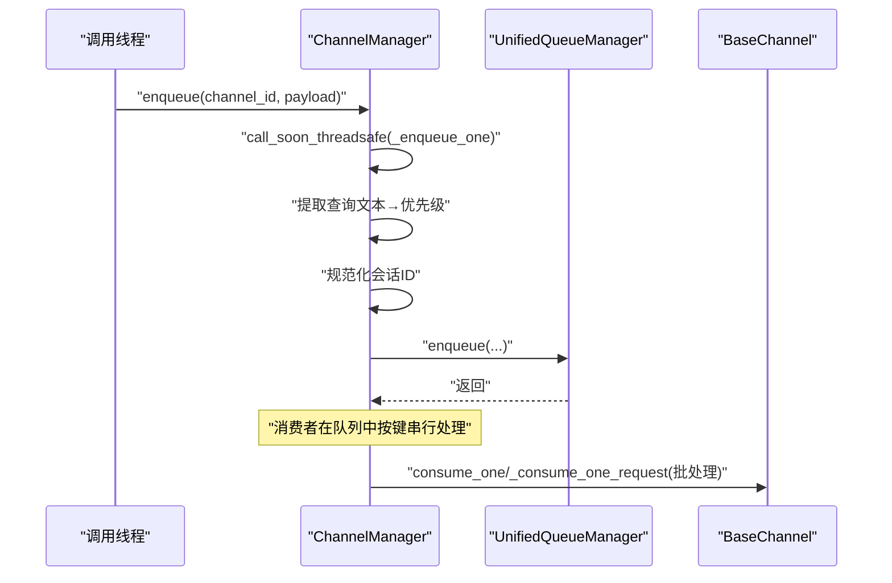
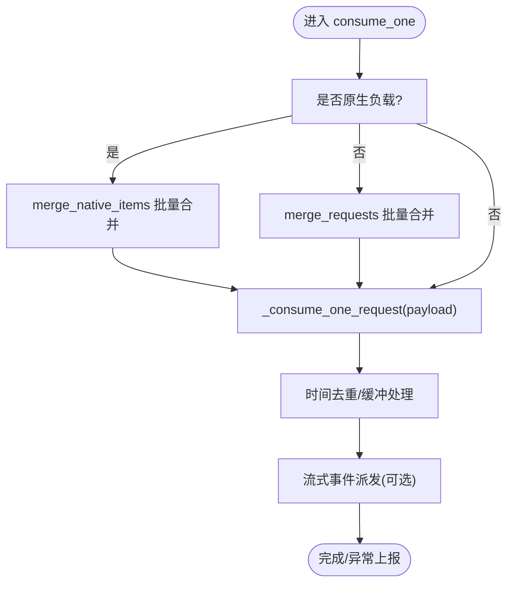
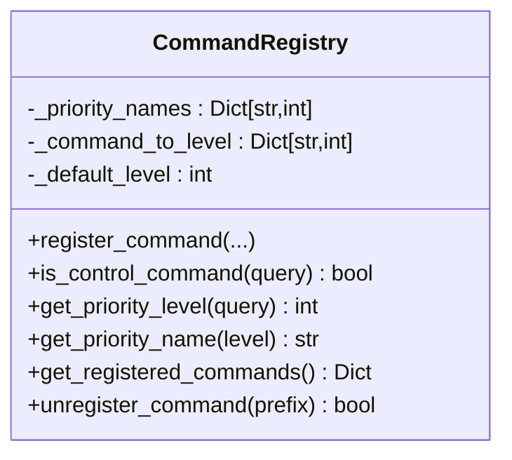
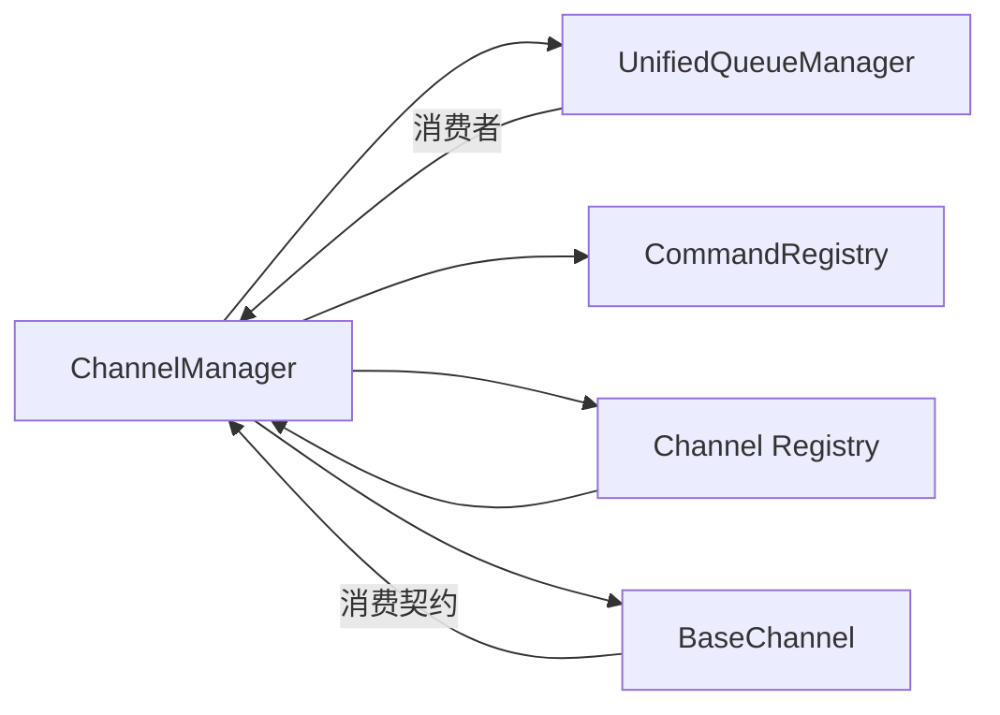

# 通道管理器架构

<cite>
**本文引用的文件**
- [src/qwenpaw/app/channels/manager.py](file://src/qwenpaw/app/channels/manager.py)
- [src/qwenpaw/app/channels/unified_queue_manager.py](file://src/qwenpaw/app/channels/unified_queue_manager.py)
- [src/qwenpaw/app/channels/base.py](file://src/qwenpaw/app/channels/base.py)
- [src/qwenpaw/app/channels/command_registry.py](file://src/qwenpaw/app/channels/command_registry.py)
- [src/qwenpaw/app/channels/registry.py](file://src/qwenpaw/app/channels/registry.py)
- [src/qwenpaw/app/channels/schema.py](file://src/qwenpaw/app/channels/schema.py)
- [src/qwenpaw/app/channels/utils.py](file://src/qwenpaw/app/channels/utils.py)
</cite>

## 目录
1. [引言](#引言)
2. [项目结构](#项目结构)
3. [核心组件](#核心组件)
4. [架构总览](#架构总览)
5. [详细组件分析](#详细组件分析)
6. [依赖关系分析](#依赖关系分析)
7. [性能考量](#性能考量)
8. [故障排查指南](#故障排查指南)
9. [结论](#结论)
10. [附录](#附录)

## 引言
本文件面向QwenPaw的通道管理器（ChannelManager）与统一队列管理器（UnifiedQueueManager），系统化阐述其设计理念、架构模式与关键实现细节。重点覆盖：
- 统一队列管理器的三元键隔离模型与按需消费者创建
- 消息路由机制：查询文本优先级分类、会话ID规范化与去重键生成
- 批量处理逻辑与通道实例生命周期管理、并发控制与资源清理
- 健康检查、重启与动态替换流程
- 性能优化策略、错误处理与监控告警最佳实践

## 项目结构
通道管理相关代码主要位于应用层通道子系统，采用“通道基类 + 管理器 + 统一队列”的分层设计：
- 通道基类定义消费契约与通用能力（合并、去重、流式事件派发等）
- 管理器负责通道实例生命周期、统一入队与批处理
- 统一队列管理器提供基于（通道ID、会话ID、优先级）的隔离队列与消费者
- 命令注册表用于将用户查询映射到优先级级别
- 注册表与模式定义支持内置与自定义通道扩展

图表来源
- [src/qwenpaw/app/channels/manager.py:68-844](file://src/qwenpaw/app/channels/manager.py#L68-L844)
- [src/qwenpaw/app/channels/unified_queue_manager.py:60-498](file://src/qwenpaw/app/channels/unified_queue_manager.py#L60-L498)
- [src/qwenpaw/app/channels/base.py:78-1616](file://src/qwenpaw/app/channels/base.py#L78-L1616)
- [src/qwenpaw/app/channels/command_registry.py:23-291](file://src/qwenpaw/app/channels/command_registry.py#L23-L291)
- [src/qwenpaw/app/channels/registry.py:191-196](file://src/qwenpaw/app/channels/registry.py#L191-L196)
- [src/qwenpaw/app/channels/schema.py:12-72](file://src/qwenpaw/app/channels/schema.py#L12-L72)

章节来源
- [src/qwenpaw/app/channels/manager.py:68-120](file://src/qwenpaw/app/channels/manager.py#L68-L120)
- [src/qwenpaw/app/channels/unified_queue_manager.py:60-118](file://src/qwenpaw/app/channels/unified_queue_manager.py#L60-L118)
- [src/qwenpaw/app/channels/base.py:78-120](file://src/qwenpaw/app/channels/base.py#L78-L120)
- [src/qwenpaw/app/channels/command_registry.py:23-63](file://src/qwenpaw/app/channels/command_registry.py#L23-L63)
- [src/qwenpaw/app/channels/registry.py:191-196](file://src/qwenpaw/app/channels/registry.py#L191-L196)
- [src/qwenpaw/app/channels/schema.py:12-50](file://src/qwenpaw/app/channels/schema.py#L12-L50)

## 核心组件
- ChannelManager：持有通道实例、注入统一进程处理器、提供统一入队接口、执行批处理、启动/停止所有通道、健康检查、重启与动态替换
- UnifiedQueueManager：以（通道ID, 会话ID, 优先级）为键的隔离队列，按需创建消费者任务，周期清理空闲队列，提供指标与计数
- BaseChannel：定义消费契约（consume_one/_consume_one_request）、消息合并（merge_native_items/merge_requests）、时间去重与会话键生成（get_debounce_key/resolve_session_id）、流式事件派发与SSE序列化
- CommandRegistry：命令前缀到优先级级别的映射，支持默认控制命令注册与灵活扩展
- Channel Registry：内置通道与自定义通道的发现与注册
- Schema：通道类型标识与统一发送地址模型
- Utils：通道侧通用工具（文本拆分、文件URL解析、进程工厂）

章节来源
- [src/qwenpaw/app/channels/manager.py:68-120](file://src/qwenpaw/app/channels/manager.py#L68-L120)
- [src/qwenpaw/app/channels/unified_queue_manager.py:60-118](file://src/qwenpaw/app/channels/unified_queue_manager.py#L60-L118)
- [src/qwenpaw/app/channels/base.py:78-120](file://src/qwenpaw/app/channels/base.py#L78-L120)
- [src/qwenpaw/app/channels/command_registry.py:23-63](file://src/qwenpaw/app/channels/command_registry.py#L23-L63)
- [src/qwenpaw/app/channels/registry.py:191-196](file://src/qwenpaw/app/channels/registry.py#L191-L196)
- [src/qwenpaw/app/channels/schema.py:12-50](file://src/qwenpaw/app/channels/schema.py#L12-L50)
- [src/qwenpaw/app/channels/utils.py:261-274](file://src/qwenpaw/app/channels/utils.py#L261-L274)

## 架构总览
统一队列管理器通过三元键（channel_id, session_id, priority_level）实现：
- 同一会话内严格串行（同一键队列）
- 不同会话并行（不同session_id键）
- 不同优先级并行（同一会话内不同priority_level键）
- 按需创建消费者，避免固定工作池开销
- 定期清理空闲队列，降低内存占用

图表来源
- [src/qwenpaw/app/channels/manager.py:258-351](file://src/qwenpaw/app/channels/manager.py#L258-L351)
- [src/qwenpaw/app/channels/unified_queue_manager.py:119-213](file://src/qwenpaw/app/channels/unified_queue_manager.py#L119-L213)
- [src/qwenpaw/app/channels/base.py:1037-1185](file://src/qwenpaw/app/channels/base.py#L1037-L1185)

## 详细组件分析

### 统一队列管理器（UnifiedQueueManager）
- 设计要点
  - 键模型：QueueKey = (channel_id, session_id, priority_level)，确保严格串行与细粒度并行
  - 按需消费者：首次入队时创建队列与消费者任务，避免固定池开销
  - 空闲清理：后台任务定期扫描空队列，取消对应消费者并释放资源
  - 活动追踪：记录创建时间、最后活动时间、已处理计数，便于监控
- 关键方法
  - enqueue：入队并等待超时保护
  - _get_or_create_queue：键不存在则创建队列与消费者
  - _run_consumer：委托外部消费者函数进行批处理
  - start_cleanup_loop/clear_queue/stop_all：生命周期与清理
  - get_metrics/increment_processed：监控与统计
- 复杂度与可扩展性
  - 入队/出队：O(1)
  - 清理周期扫描：O(N)（N为当前活跃队列数）
  - 通过调整idle_timeout与cleanup_interval平衡资源占用与延迟

图表来源
- [src/qwenpaw/app/channels/unified_queue_manager.py:60-118](file://src/qwenpaw/app/channels/unified_queue_manager.py#L60-L118)
- [src/qwenpaw/app/channels/unified_queue_manager.py:41-58](file://src/qwenpaw/app/channels/unified_queue_manager.py#L41-L58)

章节来源
- [src/qwenpaw/app/channels/unified_queue_manager.py:60-118](file://src/qwenpaw/app/channels/unified_queue_manager.py#L60-L118)
- [src/qwenpaw/app/channels/unified_queue_manager.py:119-213](file://src/qwenpaw/app/channels/unified_queue_manager.py#L119-L213)
- [src/qwenpaw/app/channels/unified_queue_manager.py:274-428](file://src/qwenpaw/app/channels/unified_queue_manager.py#L274-L428)
- [src/qwenpaw/app/channels/unified_queue_manager.py:430-498](file://src/qwenpaw/app/channels/unified_queue_manager.py#L430-L498)

### 通道管理器（ChannelManager）
- 设计要点
  - 从环境或配置创建通道实例，注入统一进程处理器
  - 将通道的enqueue回调指向管理器内部的统一入队逻辑
  - 提供统一批处理函数，兼容原生与请求两种负载的合并
  - 生命周期：start_all启动队列管理器与各通道；stop_all优雅关闭
  - 健康检查、重启与动态替换：通过get_channel_health/restart_channel/replace_channel实现
- 关键流程
  - 入队：线程安全地调度到事件循环，提取查询文本→优先级→会话ID→入队
  - 批处理：从队列drain同键批量，按原逻辑合并原生或请求负载
  - 动态替换：新通道预启动→交换并停止旧通道，保证无泄漏
- 并发与资源
  - per-channel锁防止并发重启导致资源泄漏
  - 队列最大长度与入队超时避免阻塞
  - 退出时取消待处理入队任务并等待

图表来源
- [src/qwenpaw/app/channels/manager.py:352-364](file://src/qwenpaw/app/channels/manager.py#L352-L364)
- [src/qwenpaw/app/channels/manager.py:258-351](file://src/qwenpaw/app/channels/manager.py#L258-L351)
- [src/qwenpaw/app/channels/manager.py:365-461](file://src/qwenpaw/app/channels/manager.py#L365-L461)

章节来源
- [src/qwenpaw/app/channels/manager.py:68-120](file://src/qwenpaw/app/channels/manager.py#L68-L120)
- [src/qwenpaw/app/channels/manager.py:218-304](file://src/qwenpaw/app/channels/manager.py#L218-L304)
- [src/qwenpaw/app/channels/manager.py:352-461](file://src/qwenpaw/app/channels/manager.py#L352-L461)
- [src/qwenpaw/app/channels/manager.py:462-541](file://src/qwenpaw/app/channels/manager.py#L462-L541)
- [src/qwenpaw/app/channels/manager.py:549-666](file://src/qwenpaw/app/channels/manager.py#L549-L666)
- [src/qwenpaw/app/channels/manager.py:704-791](file://src/qwenpaw/app/channels/manager.py#L704-L791)

### 通道基类（BaseChannel）
- 设计要点
  - 消费契约：consume_one对外入口，_consume_one_request内部处理（含去重、合并、流式事件）
  - 合并策略：原生负载merge_native_items、请求负载merge_requests
  - 会话键与去重：get_debounce_key基于resolve_session_id生成稳定键，支持时间窗口去重
  - 流式事件：_dispatch_streaming_event将推理与消息事件分派到实时钩子
  - SSE序列化：_serialize_event_for_sse输出SSE格式
- 关键方法
  - get_debounce_key/resolve_session_id：会话ID规范化与去重键生成
  - merge_native_items/merge_requests：批量合并
  - _consume_one_request/_stream_with_tracker：统一处理与流式派发
  - health_check/send_event：健康检查与事件发送

图表来源
- [src/qwenpaw/app/channels/base.py:937-1185](file://src/qwenpaw/app/channels/base.py#L937-L1185)
- [src/qwenpaw/app/channels/base.py:188-249](file://src/qwenpaw/app/channels/base.py#L188-L249)
- [src/qwenpaw/app/channels/base.py:172-187](file://src/qwenpaw/app/channels/base.py#L172-L187)

章节来源
- [src/qwenpaw/app/channels/base.py:78-120](file://src/qwenpaw/app/channels/base.py#L78-L120)
- [src/qwenpaw/app/channels/base.py:172-249](file://src/qwenpaw/app/channels/base.py#L172-L249)
- [src/qwenpaw/app/channels/base.py:415-748](file://src/qwenpaw/app/channels/base.py#L415-L748)
- [src/qwenpaw/app/channels/base.py:1546-1580](file://src/qwenpaw/app/channels/base.py#L1546-L1580)

### 命令注册表（CommandRegistry）
- 设计要点
  - 默认优先级：critical(0)/high(10)/normal(20)/low(30)
  - 快速查找：O(1)命令→优先级映射
  - 控制命令：内置大量控制命令（如/stop、/status、/restart等）
  - 可扩展：支持直接指定数字优先级插入中间级别
- 关键方法
  - register_command/get_priority_level/is_control_command
  - get_priority_name/get_registered_commands/unregister_command

图表来源
- [src/qwenpaw/app/channels/command_registry.py:23-63](file://src/qwenpaw/app/channels/command_registry.py#L23-L63)
- [src/qwenpaw/app/channels/command_registry.py:94-139](file://src/qwenpaw/app/channels/command_registry.py#L94-L139)

章节来源
- [src/qwenpaw/app/channels/command_registry.py:23-63](file://src/qwenpaw/app/channels/command_registry.py#L23-L63)
- [src/qwenpaw/app/channels/command_registry.py:179-222](file://src/qwenpaw/app/channels/command_registry.py#L179-L222)

### 通道注册表与模式（Registry & Schema）
- 通道注册表
  - 内置通道清单与加载策略，失败不影响启动（必要通道除外）
  - 自定义通道目录扫描与注册
- Schema
  - ChannelType：通道类型标识（字符串，允许插件通道）
  - ChannelAddress：统一路由目标（kind/id/extra），替代分散的meta键

章节来源
- [src/qwenpaw/app/channels/registry.py:191-196](file://src/qwenpaw/app/channels/registry.py#L191-L196)
- [src/qwenpaw/app/channels/schema.py:12-50](file://src/qwenpaw/app/channels/schema.py#L12-L50)

### 工具与进程桥接（Utils）
- 文本拆分：保持代码围栏与表格完整性，按行边界切分
- 文件URL解析：file://与本地路径互转
- 进程桥接：将runner.stream_query作为通道process处理器

章节来源
- [src/qwenpaw/app/channels/utils.py:163-212](file://src/qwenpaw/app/channels/utils.py#L163-L212)
- [src/qwenpaw/app/channels/utils.py:214-259](file://src/qwenpaw/app/channels/utils.py#L214-L259)
- [src/qwenpaw/app/channels/utils.py:261-274](file://src/qwenpaw/app/channels/utils.py#L261-L274)

## 依赖关系分析
- ChannelManager依赖
  - UnifiedQueueManager：统一入队与批处理
  - CommandRegistry：查询优先级分类
  - BaseChannel：消费契约与合并策略
  - Channel Registry：通道发现与实例化
- UnifiedQueueManager依赖
  - asyncio.Queue/Task：异步队列与消费者
  - 外部消费者函数：由ChannelManager提供
- BaseChannel依赖
  - MessageRenderer/RenderStyle：消息渲染与过滤
  - Workspace/TaskTracker：任务跟踪与聊天上下文
  - Channel Schema：统一路由与类型

图表来源
- [src/qwenpaw/app/channels/manager.py:68-120](file://src/qwenpaw/app/channels/manager.py#L68-L120)
- [src/qwenpaw/app/channels/unified_queue_manager.py:60-118](file://src/qwenpaw/app/channels/unified_queue_manager.py#L60-L118)
- [src/qwenpaw/app/channels/registry.py:191-196](file://src/qwenpaw/app/channels/registry.py#L191-L196)

章节来源
- [src/qwenpaw/app/channels/manager.py:68-120](file://src/qwenpaw/app/channels/manager.py#L68-L120)
- [src/qwenpaw/app/channels/unified_queue_manager.py:60-118](file://src/qwenpaw/app/channels/unified_queue_manager.py#L60-L118)
- [src/qwenpaw/app/channels/registry.py:191-196](file://src/qwenpaw/app/channels/registry.py#L191-L196)

## 性能考量
- 队列隔离与按需消费者
  - 通过三元键隔离，避免跨会话/跨优先级的串扰，提升吞吐
  - 按需创建消费者，减少空闲CPU与内存占用
- 批量合并
  - 对原生与请求负载分别合并，降低通道端处理次数
- 超时与背压
  - 入队超时与队列最大长度限制，避免无限阻塞
- 清理策略
  - 空闲超时与定期清理，防止僵尸队列与消费者堆积
- 监控指标
  - get_metrics提供队列数量、大小、处理计数、年龄与空闲时长，便于容量规划与告警

章节来源
- [src/qwenpaw/app/channels/unified_queue_manager.py:80-118](file://src/qwenpaw/app/channels/unified_queue_manager.py#L80-L118)
- [src/qwenpaw/app/channels/unified_queue_manager.py:376-428](file://src/qwenpaw/app/channels/unified_queue_manager.py#L376-L428)
- [src/qwenpaw/app/channels/unified_queue_manager.py:430-472](file://src/qwenpaw/app/channels/unified_queue_manager.py#L430-L472)
- [src/qwenpaw/app/channels/manager.py:352-461](file://src/qwenpaw/app/channels/manager.py#L352-L461)

## 故障排查指南
- 健康检查
  - get_channel_health：对指定通道调用其health_check，异常时返回unhealthy与详情
- 重启与替换
  - restart_channel：加载最新配置，克隆新实例，预启动后交换并停止旧实例，带per-channel锁避免并发重启资源泄漏
  - replace_channel：新通道先设置enqueue回调并启动，再在锁内交换并停止旧通道
- 错误处理
  - 入队超时与取消：记录警告/调试日志，避免阻塞
  - 消费者异常：捕获并记录，清理队列状态
  - 通道启动/停止异常：记录但不中断整体流程
- 监控与告警
  - 使用get_metrics观察队列积压与处理速率
  - 结合日志级别与异常堆栈定位问题

章节来源
- [src/qwenpaw/app/channels/manager.py:549-579](file://src/qwenpaw/app/channels/manager.py#L549-L579)
- [src/qwenpaw/app/channels/manager.py:580-666](file://src/qwenpaw/app/channels/manager.py#L580-L666)
- [src/qwenpaw/app/channels/manager.py:704-762](file://src/qwenpaw/app/channels/manager.py#L704-L762)
- [src/qwenpaw/app/channels/unified_queue_manager.py:376-428](file://src/qwenpaw/app/channels/unified_queue_manager.py#L376-L428)

## 结论
该架构通过“通道基类 + 管理器 + 统一队列”的分层设计，实现了：
- 明确的消息路由与优先级控制（命令注册表）
- 严格的会话与优先级隔离（统一队列键）
- 高效的批处理与按需消费者（避免固定池开销）
- 完整的生命周期管理与动态替换（健康检查、重启、替换）
- 可观测性与可扩展性（监控指标、内置/自定义通道）

该设计在保证高吞吐与低延迟的同时，兼顾了稳定性与运维友好性。

## 附录
- 术语
  - 通道：接入不同IM平台或终端的适配层
  - 会话ID：用于区分不同对话上下文的稳定键
  - 去重键：用于时间去重与合并的键，通常与会话ID一致
  - 优先级：数值越小优先级越高，用于队列调度
- 最佳实践
  - 合理设置队列最大长度与清理间隔
  - 使用命令注册表为关键控制命令分配高优先级
  - 在通道实现中正确覆盖合并与去重逻辑
  - 通过健康检查与指标建立告警体系