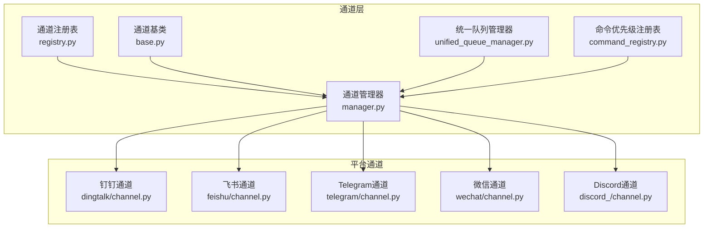
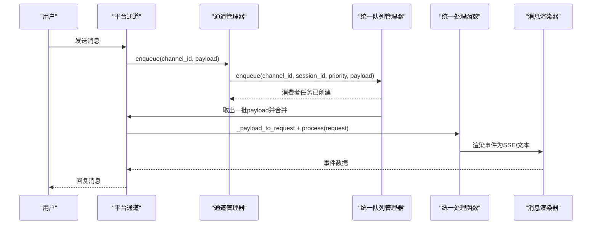
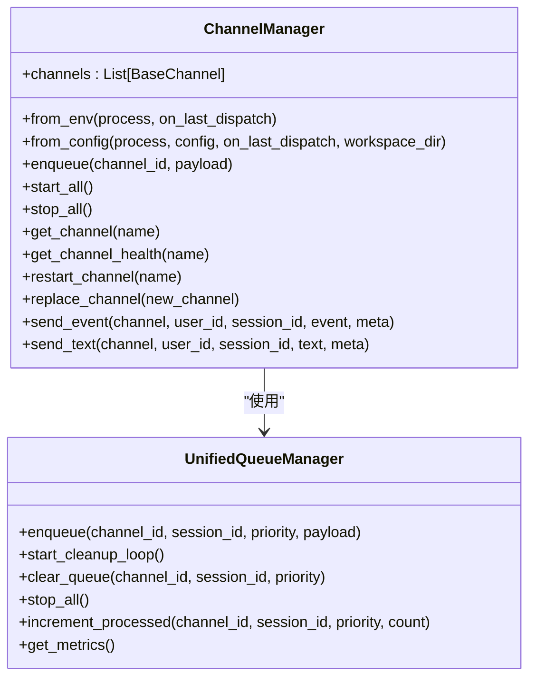
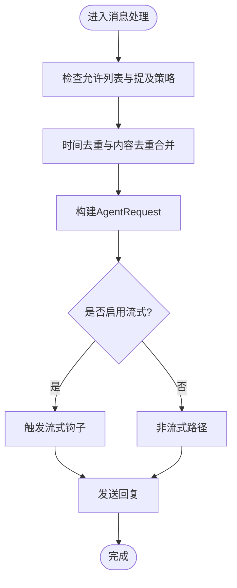
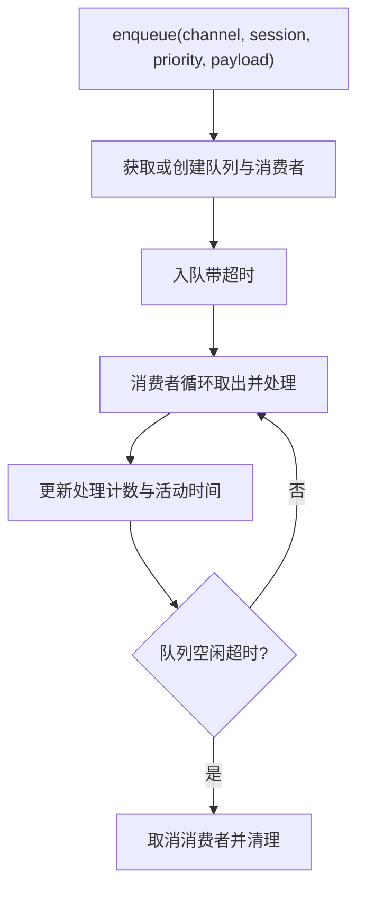
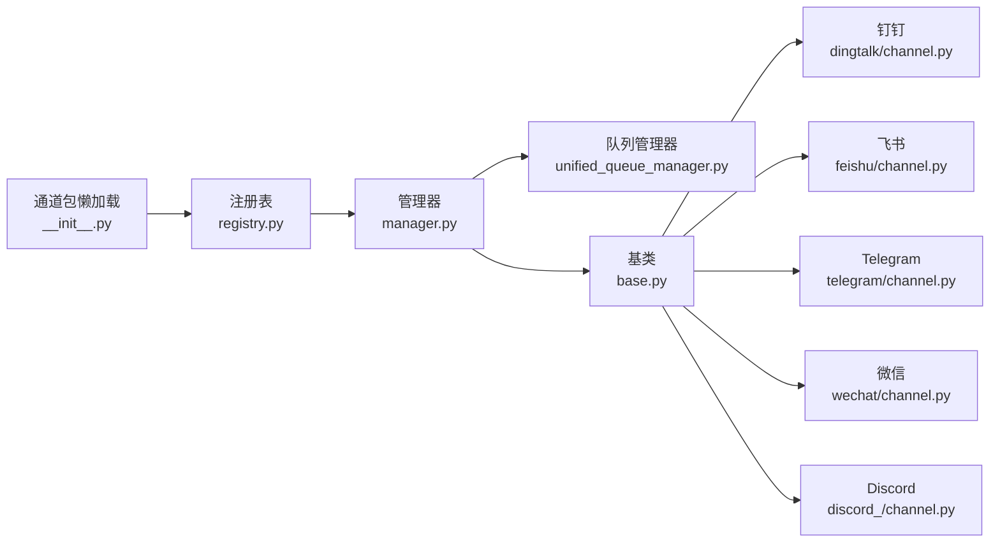

# 通道系统

<cite>
**本文引用的文件**
- [src/qwenpaw/app/channels/__init__.py](file://src/qwenpaw/app/channels/__init__.py)
- [src/qwenpaw/app/channels/manager.py](file://src/qwenpaw/app/channels/manager.py)
- [src/qwenpaw/app/channels/base.py](file://src/qwenpaw/app/channels/base.py)
- [src/qwenpaw/app/channels/registry.py](file://src/qwenpaw/app/channels/registry.py)
- [src/qwenpaw/app/channels/schema.py](file://src/qwenpaw/app/channels/schema.py)
- [src/qwenpaw/app/channels/unified_queue_manager.py](file://src/qwenpaw/app/channels/unified_queue_manager.py)
- [src/qwenpaw/app/channels/command_registry.py](file://src/qwenpaw/app/channels/command_registry.py)
- [src/qwenpaw/app/channels/dingtalk/channel.py](file://src/qwenpaw/app/channels/dingtalk/channel.py)
- [src/qwenpaw/app/channels/feishu/channel.py](file://src/qwenpaw/app/channels/feishu/channel.py)
- [src/qwenpaw/app/channels/telegram/channel.py](file://src/qwenpaw/app/channels/telegram/channel.py)
- [src/qwenpaw/app/channels/wechat/channel.py](file://src/qwenpaw/app/channels/wechat/channel.py)
- [src/qwenpaw/app/channels/discord_/channel.py](file://src/qwenpaw/app/channels/discord_/channel.py)
</cite>

## 目录
1. [简介](#简介)
2. [项目结构](#项目结构)
3. [核心组件](#核心组件)
4. [架构总览](#架构总览)
5. [详细组件分析](#详细组件分析)
6. [依赖关系分析](#依赖关系分析)
7. [性能考量](#性能考量)
8. [故障排除指南](#故障排除指南)
9. [结论](#结论)
10. [附录](#附录)

## 简介
本文件面向QwenPaw的通道系统，系统性阐述通道管理器的架构设计与消息路由机制，覆盖钉钉、飞书、微信、Discord、Telegram等主流平台的集成方式与实现要点；解释通道认证机制、消息格式转换、事件处理与错误恢复策略，并提供各平台的集成指南（含API密钥配置、回调地址设置、消息格式适配等），以及安全配置、性能优化与故障排除的最佳实践。

## 项目结构
通道系统位于后端应用模块中，采用“统一管理 + 平台适配”的分层设计：
- 统一入口与延迟加载：通过包级懒加载避免CLI启动时拉取可选依赖。
- 通道注册表：内置通道清单与自定义通道发现机制。
- 通道基类：统一消息模型、渲染器、去重与合并策略、流式事件钩子。
- 通道管理器：统一队列、优先级调度、批量合并、生命周期管理。
- 平台通道：各平台独立实现，遵循统一接口，完成认证、收发与格式转换。

图表来源
- [src/qwenpaw/app/channels/registry.py:19-37](file://src/qwenpaw/app/channels/registry.py#L19-L37)
- [src/qwenpaw/app/channels/base.py:78-168](file://src/qwenpaw/app/channels/base.py#L78-L168)
- [src/qwenpaw/app/channels/unified_queue_manager.py:60-118](file://src/qwenpaw/app/channels/unified_queue_manager.py#L60-L118)
- [src/qwenpaw/app/channels/manager.py:68-109](file://src/qwenpaw/app/channels/manager.py#L68-L109)
- [src/qwenpaw/app/channels/command_registry.py:23-62](file://src/qwenpaw/app/channels/command_registry.py#L23-L62)
- [src/qwenpaw/app/channels/dingtalk/channel.py:112-126](file://src/qwenpaw/app/channels/dingtalk/channel.py#L112-L126)
- [src/qwenpaw/app/channels/feishu/channel.py:174-183](file://src/qwenpaw/app/channels/feishu/channel.py#L174-L183)
- [src/qwenpaw/app/channels/telegram/channel.py:47-64](file://src/qwenpaw/app/channels/telegram/channel.py#L47-L64)
- [src/qwenpaw/app/channels/wechat/channel.py:60-68](file://src/qwenpaw/app/channels/wechat/channel.py#L60-L68)
- [src/qwenpaw/app/channels/discord_/channel.py:42-46](file://src/qwenpaw/app/channels/discord_/channel.py#L42-L46)

章节来源
- [src/qwenpaw/app/channels/__init__.py:7-13](file://src/qwenpaw/app/channels/__init__.py#L7-L13)
- [src/qwenpaw/app/channels/registry.py:19-37](file://src/qwenpaw/app/channels/registry.py#L19-L37)
- [src/qwenpaw/app/channels/manager.py:68-109](file://src/qwenpaw/app/channels/manager.py#L68-L109)

## 核心组件
- 通道注册表：内置通道键到类映射，支持自定义通道目录扫描与动态导入，保证启动时的健壮性与扩展性。
- 通道基类：统一消息模型、渲染器、会话去重、内容合并、流式事件钩子、工具输出过滤、策略控制（允许列表、提及要求）。
- 统一队列管理器：基于三元键（通道ID、会话ID、优先级）的按需消费者模型，支持自动清理空闲队列、并发隔离与度量指标。
- 命令优先级注册表：将控制命令映射到优先级级别，用于消息入队时的优先级分类。
- 通道管理器：负责从环境或配置创建通道实例、注入统一处理函数、启动/停止通道、替换通道、健康检查与重启。

章节来源
- [src/qwenpaw/app/channels/registry.py:46-79](file://src/qwenpaw/app/channels/registry.py#L46-L79)
- [src/qwenpaw/app/channels/base.py:78-168](file://src/qwenpaw/app/channels/base.py#L78-L168)
- [src/qwenpaw/app/channels/unified_queue_manager.py:60-118](file://src/qwenpaw/app/channels/unified_queue_manager.py#L60-L118)
- [src/qwenpaw/app/channels/command_registry.py:23-62](file://src/qwenpaw/app/channels/command_registry.py#L23-L62)
- [src/qwenpaw/app/channels/manager.py:68-109](file://src/qwenpaw/app/channels/manager.py#L68-L109)

## 架构总览
通道系统以“统一管理器 + 平台通道”为核心，消息在统一队列中按会话与优先级串行化处理，同时支持平台特定的批量合并与流式事件钩子，确保高吞吐与低冲突。

图表来源
- [src/qwenpaw/app/channels/manager.py:39-65](file://src/qwenpaw/app/channels/manager.py#L39-L65)
- [src/qwenpaw/app/channels/unified_queue_manager.py:119-163](file://src/qwenpaw/app/channels/unified_queue_manager.py#L119-L163)
- [src/qwenpaw/app/channels/base.py:630-747](file://src/qwenpaw/app/channels/base.py#L630-L747)

## 详细组件分析

### 通道管理器（ChannelManager）
- 职责：统一创建、启动、停止通道；注入统一处理函数；维护统一队列与消费者；提供健康检查与单通道重启。
- 关键能力：
  - 从环境或配置创建通道实例，按可用通道清单筛选。
  - 将通道的enqueue回调指向统一队列管理器，实现跨通道的统一调度。
  - 提供替换通道、清理队列、发送事件/文本等高级能力。
- 批量合并与优先级：
  - 对原生payload与AgentRequest分别进行合并策略，减少下游压力。
  - 使用命令优先级注册表对查询进行优先级分类，保障控制命令的及时响应。

图表来源
- [src/qwenpaw/app/channels/manager.py:68-109](file://src/qwenpaw/app/channels/manager.py#L68-L109)
- [src/qwenpaw/app/channels/unified_queue_manager.py:60-118](file://src/qwenpaw/app/channels/unified_queue_manager.py#L60-L118)

章节来源
- [src/qwenpaw/app/channels/manager.py:68-109](file://src/qwenpaw/app/channels/manager.py#L68-L109)
- [src/qwenpaw/app/channels/manager.py:352-364](file://src/qwenpaw/app/channels/manager.py#L352-L364)
- [src/qwenpaw/app/channels/manager.py:462-541](file://src/qwenpaw/app/channels/manager.py#L462-L541)
- [src/qwenpaw/app/channels/manager.py:580-665](file://src/qwenpaw/app/channels/manager.py#L580-L665)

### 通道基类（BaseChannel）
- 统一消息模型：使用运行时内容类型（文本、图片、音频、视频、文件、拒绝）与事件流。
- 渲染与过滤：支持工具输出过滤、思考内容过滤、内部工具可见性控制。
- 会话与去重：提供时间去重窗口与内容去重逻辑，支持语音消息的即时处理。
- 流式事件钩子：在推理与消息阶段提供开始/增量/结束的实时钩子，便于平台侧的流式展示。
- 权限与策略：支持私聊/群组白名单、是否需要提及机器人、拒绝文案等。

图表来源
- [src/qwenpaw/app/channels/base.py:324-358](file://src/qwenpaw/app/channels/base.py#L324-L358)
- [src/qwenpaw/app/channels/base.py:290-322](file://src/qwenpaw/app/channels/base.py#L290-L322)
- [src/qwenpaw/app/channels/base.py:488-628](file://src/qwenpaw/app/channels/base.py#L488-L628)

章节来源
- [src/qwenpaw/app/channels/base.py:78-168](file://src/qwenpaw/app/channels/base.py#L78-L168)
- [src/qwenpaw/app/channels/base.py:415-471](file://src/qwenpaw/app/channels/base.py#L415-L471)
- [src/qwenpaw/app/channels/base.py:630-747](file://src/qwenpaw/app/channels/base.py#L630-L747)

### 统一队列管理器（UnifiedQueueManager）
- 设计要点：以（通道ID、会话ID、优先级）为键的按需消费者模型，严格序列化同键消息，不同键并发执行。
- 自动清理：空闲超时后取消消费者任务并释放资源。
- 指标监控：提供队列数量、大小、处理计数、年龄与空闲时长等指标。
- 入队保护：带超时的入队操作，防止阻塞导致的资源泄漏。

图表来源
- [src/qwenpaw/app/channels/unified_queue_manager.py:119-163](file://src/qwenpaw/app/channels/unified_queue_manager.py#L119-L163)
- [src/qwenpaw/app/channels/unified_queue_manager.py:214-273](file://src/qwenpaw/app/channels/unified_queue_manager.py#L214-L273)
- [src/qwenpaw/app/channels/unified_queue_manager.py:376-428](file://src/qwenpaw/app/channels/unified_queue_manager.py#L376-L428)

章节来源
- [src/qwenpaw/app/channels/unified_queue_manager.py:60-118](file://src/qwenpaw/app/channels/unified_queue_manager.py#L60-L118)
- [src/qwenpaw/app/channels/unified_queue_manager.py:329-375](file://src/qwenpaw/app/channels/unified_queue_manager.py#L329-L375)

### 命令优先级注册表（CommandRegistry）
- 功能：将控制命令前缀映射到优先级级别（0/10/20/30），默认注册常见控制命令。
- 查询：根据输入查询匹配最长前缀，返回对应优先级；未知命令返回默认级别。
- 扩展：支持直接指定数字级别或预定义名称，便于灵活扩展。

章节来源
- [src/qwenpaw/app/channels/command_registry.py:23-62](file://src/qwenpaw/app/channels/command_registry.py#L23-L62)
- [src/qwenpaw/app/channels/command_registry.py:179-222](file://src/qwenpaw/app/channels/command_registry.py#L179-L222)

### 平台通道概览与差异
- 钉钉：支持卡片交互、会话Webhook、批量合并与流式最小间隔控制，具备AI卡片状态机与主动推送能力。
- 飞书：WebSocket长连接收事件，Open API发送消息，支持富媒体与群组上下文，具备WS重试与过期消息阈值。
- Telegram：Bot API轮询，支持Markdown/HTML渲染、文件上传限制、编辑速率限制与打字指示。
- 微信：iLink HTTP API长轮询接收，支持文本、图片、语音（ASR）、文件，具备消息合并与去重缓存。
- Discord：客户端事件监听，支持提及检测、线程消息去重、代理与鉴权。

章节来源
- [src/qwenpaw/app/channels/dingtalk/channel.py:112-126](file://src/qwenpaw/app/channels/dingtalk/channel.py#L112-L126)
- [src/qwenpaw/app/channels/feishu/channel.py:174-183](file://src/qwenpaw/app/channels/feishu/channel.py#L174-L183)
- [src/qwenpaw/app/channels/telegram/channel.py:47-64](file://src/qwenpaw/app/channels/telegram/channel.py#L47-L64)
- [src/qwenpaw/app/channels/wechat/channel.py:60-68](file://src/qwenpaw/app/channels/wechat/channel.py#L60-L68)
- [src/qwenpaw/app/channels/discord_/channel.py:42-46](file://src/qwenpaw/app/channels/discord_/channel.py#L42-L46)

## 依赖关系分析
- 包级懒加载：通道管理器通过包级__getattr__延迟导入，避免CLI场景加载可选依赖。
- 注册表与发现：内置通道清单与自定义通道目录扫描，统一注册与路由。
- 通道与队列：通道仅负责消费策略，队列与消费者由统一管理器注入与管理。
- 平台SDK：各平台通道按需引入第三方SDK，失败不影响其他通道。

图表来源
- [src/qwenpaw/app/channels/__init__.py:7-13](file://src/qwenpaw/app/channels/__init__.py#L7-L13)
- [src/qwenpaw/app/channels/registry.py:46-79](file://src/qwenpaw/app/channels/registry.py#L46-L79)
- [src/qwenpaw/app/channels/manager.py:68-109](file://src/qwenpaw/app/channels/manager.py#L68-L109)
- [src/qwenpaw/app/channels/unified_queue_manager.py:60-118](file://src/qwenpaw/app/channels/unified_queue_manager.py#L60-L118)
- [src/qwenpaw/app/channels/base.py:78-168](file://src/qwenpaw/app/channels/base.py#L78-L168)

章节来源
- [src/qwenpaw/app/channels/registry.py:98-131](file://src/qwenpaw/app/channels/registry.py#L98-L131)
- [src/qwenpaw/app/channels/registry.py:191-196](file://src/qwenpaw/app/channels/registry.py#L191-L196)

## 性能考量
- 队列与并发：按会话与优先级隔离，避免全局阻塞；空闲队列自动清理降低内存占用。
- 批量合并：对原生payload与AgentRequest进行合并，减少下游调用次数。
- 流式事件：平台侧可选择启用流式钩子，提升用户体验，但需注意平台速率限制。
- 资源保护：入队超时与任务取消保护，避免长时间阻塞；统一处理异常日志记录。
- 平台限制：Telegram编辑频率、Discord线程并发、飞书WS重试与过期阈值等均在通道内处理。

章节来源
- [src/qwenpaw/app/channels/unified_queue_manager.py:145-156](file://src/qwenpaw/app/channels/unified_queue_manager.py#L145-L156)
- [src/qwenpaw/app/channels/manager.py:39-65](file://src/qwenpaw/app/channels/manager.py#L39-L65)
- [src/qwenpaw/app/channels/telegram/channel.py:74-76](file://src/qwenpaw/app/channels/telegram/channel.py#L74-L76)
- [src/qwenpaw/app/channels/discord_/channel.py:42-46](file://src/qwenpaw/app/channels/discord_/channel.py#L42-L46)

## 故障排除指南
- 启动失败（可选依赖缺失）：注册表对内置通道加载失败进行降级处理，必要通道失败会抛出异常；自定义通道加载失败仅记录日志。
- 通道不可用：检查可用通道清单与配置中的enabled字段；确认平台凭证有效。
- 队列堆积：查看队列指标与清理日志；必要时清理特定队列或调整优先级。
- 流式异常：检查平台流式钩子启用状态与平台速率限制；关注异常日志定位具体事件。
- 单通道重启：通过管理器提供的重启接口，加载最新配置并替换通道实例，避免资源泄露。

章节来源
- [src/qwenpaw/app/channels/registry.py:64-77](file://src/qwenpaw/app/channels/registry.py#L64-L77)
- [src/qwenpaw/app/channels/manager.py:580-665](file://src/qwenpaw/app/channels/manager.py#L580-L665)
- [src/qwenpaw/app/channels/unified_queue_manager.py:329-375](file://src/qwenpaw/app/channels/unified_queue_manager.py#L329-L375)

## 结论
QwenPaw的通道系统通过统一管理器与队列模型实现了跨平台的一致性与高扩展性，平台通道专注于各自生态的认证与消息适配，结合统一的事件流与渲染机制，既满足多平台接入需求，又兼顾性能与稳定性。建议在生产环境中配合严格的权限策略、合理的优先级配置与监控告警，持续优化队列与流式体验。

## 附录

### 通道认证与配置要点（通用）
- 认证方式：各平台通常通过令牌（如AppID/AppSecret、Bot Token、ClientID/Secret）进行认证。
- 回调地址：部分平台（如钉钉、飞书）支持Webhook回调，需在平台后台配置并确保可达。
- 会话标识：统一使用（通道ID + 会话ID）进行去重与合并，平台侧需正确传递或生成会话ID。
- 工具输出与思考内容：可通过配置开关过滤工具输出与思考内容，减少冗余信息。

章节来源
- [src/qwenpaw/app/channels/base.py:132-158](file://src/qwenpaw/app/channels/base.py#L132-L158)
- [src/qwenpaw/app/channels/manager.py:218-224](file://src/qwenpaw/app/channels/manager.py#L218-L224)

### 平台集成指南（要点）
- 钉钉
  - 认证：企业内部应用的ClientID/Secret与机器人配置。
  - 会话：支持会话Webhook，适合主动推送与多消息回复。
  - 事件：流式最小间隔与卡片状态机，注意AI卡片刷新与恢复文本。
- 飞书
  - 认证：应用ID/Secret与加密Key、验证Token。
  - 连接：WebSocket长连接收事件，Open API发送消息。
  - 限制：WS重试退避、过期消息阈值、文件大小限制。
- Telegram
  - 认证：Bot Token。
  - 速率：编辑消息约1条/秒，需设置最小编辑间隔；文件上传上限50MB。
  - 渲染：Markdown/HTML混合，注意转义与长度限制。
- 微信
  - 认证：iLink Bot Token或二维码登录持久化。
  - 会话：私聊与群组会话ID格式区分；具备消息合并与去重缓存。
- Discord
  - 认证：Bot Token与Intents配置。
  - 安全：可选择接受或忽略其他Bot消息；线程消息并发与去重。

章节来源
- [src/qwenpaw/app/channels/dingtalk/channel.py:136-200](file://src/qwenpaw/app/channels/dingtalk/channel.py#L136-L200)
- [src/qwenpaw/app/channels/feishu/channel.py:185-210](file://src/qwenpaw/app/channels/feishu/channel.py#L185-L210)
- [src/qwenpaw/app/channels/telegram/channel.py:47-95](file://src/qwenpaw/app/channels/telegram/channel.py#L47-L95)
- [src/qwenpaw/app/channels/wechat/channel.py:70-140](file://src/qwenpaw/app/channels/wechat/channel.py#L70-L140)
- [src/qwenpaw/app/channels/discord_/channel.py:48-112](file://src/qwenpaw/app/channels/discord_/channel.py#L48-L112)