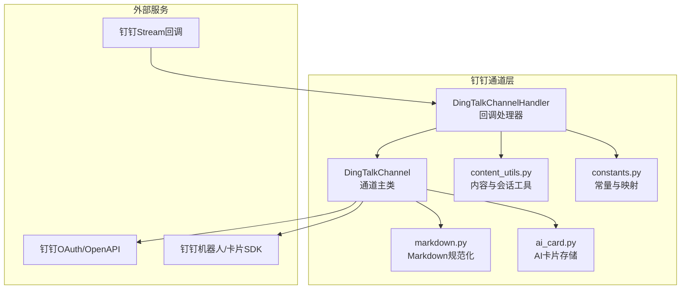
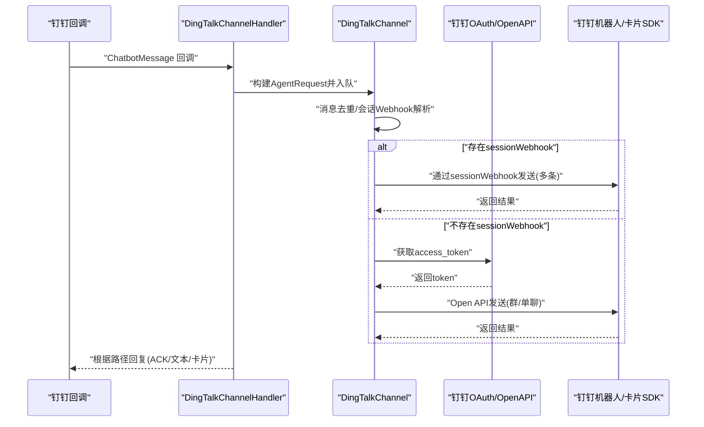
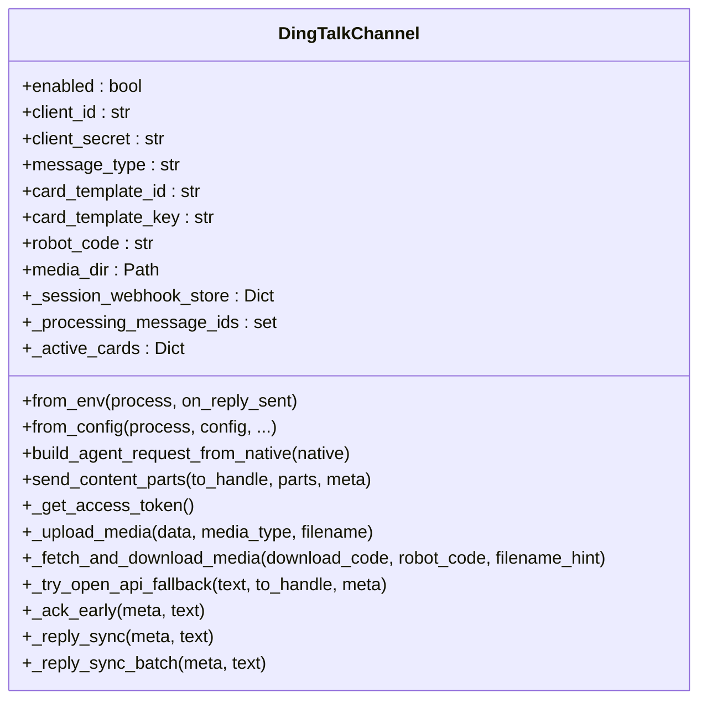
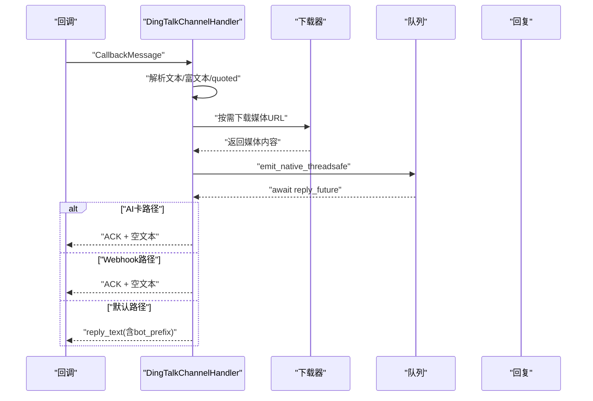
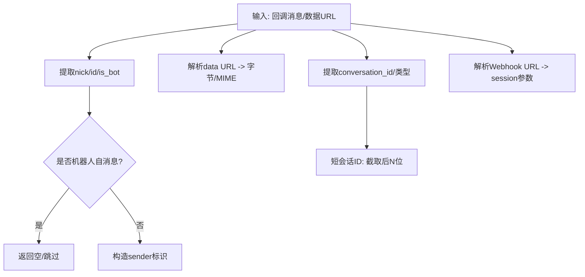
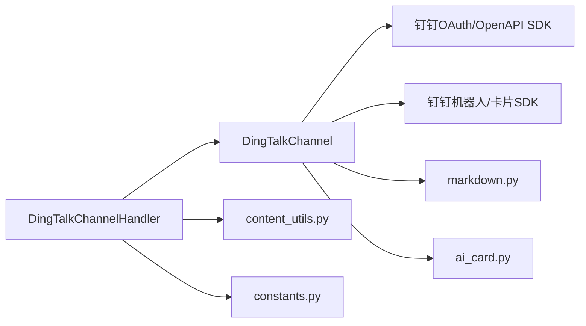

# 钉钉平台集成

<cite>
**本文档引用的文件**
- [channel.py](file://src/qwenpaw/app/channels/dingtalk/channel.py)
- [handler.py](file://src/qwenpaw/app/channels/dingtalk/handler.py)
- [content_utils.py](file://src/qwenpaw/app/channels/dingtalk/content_utils.py)
- [constants.py](file://src/qwenpaw/app/channels/dingtalk/constants.py)
- [markdown.py](file://src/qwenpaw/app/channels/dingtalk/markdown.py)
- [ai_card.py](file://src/qwenpaw/app/channels/dingtalk/ai_card.py)
- [channels.en.md](file://website/public/docs/channels.en.md)
- [test_dingtalk.py](file://tests/unit/channels/test_dingtalk.py)
- [config.py](file://src/qwenpaw/config/config.py)
</cite>

## 目录
1. [简介](#简介)
2. [项目结构](#项目结构)
3. [核心组件](#核心组件)
4. [架构总览](#架构总览)
5. [详细组件分析](#详细组件分析)
6. [依赖分析](#依赖分析)
7. [性能考虑](#性能考虑)
8. [故障排除指南](#故障排除指南)
9. [结论](#结论)
10. [附录](#附录)

## 简介
本指南面向在QwenPaw中集成钉钉平台的开发者与运维人员，系统性讲解如何完成钉钉机器人的配置与使用，涵盖以下关键主题：
- 钉钉机器人与企业内部应用的创建与配置
- 消息格式转换（Markdown渲染、富文本处理、交互卡片）
- 企业群聊与普通群聊的集成差异（群机器人与个人机器人）
- 认证流程、回调URL与消息签名验证
- 钉钉特有能力：@提醒、文件/语音上传与下载、消息去重与幂等
- 故障排除与性能优化建议

## 项目结构
钉钉集成位于后端通道模块中，采用“通道-处理器-内容工具-常量-Markdown辅助-卡片存储”的分层设计：
- 通道层负责生命周期管理、会话Webhook存储、消息去重、Open API回退、媒体上传与下载
- 处理器层负责从钉钉回调解析消息、构建运行时内容、排队并等待回复
- 内容工具层负责类型映射、数据URL解析、会话参数提取、发送者识别
- 常量层定义钉钉消息类型映射、会话ID截断长度、令牌缓存TTL等
- Markdown辅助层提供列表间距、代码块缩进、代码前缀等规范化
- 卡片存储层持久化活动卡片状态，用于崩溃恢复

图表来源
- [channel.py:112-326](file://src/qwenpaw/app/channels/dingtalk/channel.py#L112-L326)
- [handler.py:39-619](file://src/qwenpaw/app/channels/dingtalk/handler.py#L39-L619)
- [content_utils.py:1-146](file://src/qwenpaw/app/channels/dingtalk/content_utils.py#L1-L146)
- [constants.py:1-33](file://src/qwenpaw/app/channels/dingtalk/constants.py#L1-L33)
- [markdown.py:1-111](file://src/qwenpaw/app/channels/dingtalk/markdown.py#L1-L111)
- [ai_card.py:1-79](file://src/qwenpaw/app/channels/dingtalk/ai_card.py#L1-L79)

章节来源
- [channel.py:1-3649](file://src/qwenpaw/app/channels/dingtalk/channel.py#L1-L3649)
- [handler.py:1-619](file://src/qwenpaw/app/channels/dingtalk/handler.py#L1-L619)
- [content_utils.py:1-146](file://src/qwenpaw/app/channels/dingtalk/content_utils.py#L1-L146)
- [constants.py:1-33](file://src/qwenpaw/app/channels/dingtalk/constants.py#L1-L33)
- [markdown.py:1-111](file://src/qwenpaw/app/channels/dingtalk/markdown.py#L1-L111)
- [ai_card.py:1-79](file://src/qwenpaw/app/channels/dingtalk/ai_card.py#L1-L79)

## 核心组件
- DingTalkChannel：通道主类，负责初始化、环境变量注入、会话Webhook存储与加载、消息去重、Open API回退、媒体上传/下载、AI卡片状态管理
- DingTalkChannelHandler：回调处理器，负责从钉钉回调解析消息体、提取富文本与媒体、构建运行时内容、排队等待回复、按路径回复
- content_utils：内容与会话工具，负责类型映射、数据URL解析、会话参数提取、发送者识别
- constants：常量与映射，定义消息类型映射、会话ID截断长度、令牌缓存TTL、最小更新间隔等
- markdown：Markdown规范化，确保列表间距、代码块缩进、可选代码行前缀
- ai_card：AI卡片存储，持久化活动卡片状态，支持崩溃恢复

章节来源
- [channel.py:112-326](file://src/qwenpaw/app/channels/dingtalk/channel.py#L112-L326)
- [handler.py:39-619](file://src/qwenpaw/app/channels/dingtalk/handler.py#L39-L619)
- [content_utils.py:1-146](file://src/qwenpaw/app/channels/dingtalk/content_utils.py#L1-L146)
- [constants.py:1-33](file://src/qwenpaw/app/channels/dingtalk/constants.py#L1-L33)
- [markdown.py:1-111](file://src/qwenpaw/app/channels/dingtalk/markdown.py#L1-L111)
- [ai_card.py:1-79](file://src/qwenpaw/app/channels/dingtalk/ai_card.py#L1-L79)

## 架构总览
下图展示从钉钉回调到生成回复的关键流程，包括会话Webhook直发、Open API回退、媒体下载与上传、AI卡片流式更新等。

图表来源
- [handler.py:384-619](file://src/qwenpaw/app/channels/dingtalk/handler.py#L384-L619)
- [channel.py:776-800](file://src/qwenpaw/app/channels/dingtalk/channel.py#L776-L800)
- [channel.py:810-825](file://src/qwenpaw/app/channels/dingtalk/channel.py#L810-L825)

章节来源
- [handler.py:384-619](file://src/qwenpaw/app/channels/dingtalk/handler.py#L384-L619)
- [channel.py:776-825](file://src/qwenpaw/app/channels/dingtalk/channel.py#L776-L825)

## 详细组件分析

### 钉钉通道类（DingTalkChannel）
职责与特性：
- 初始化与配置注入：支持从环境变量与配置对象注入客户端ID/密钥、消息模式、卡片模板、机器人编码、媒体目录、@提醒策略等
- 会话Webhook管理：存储/加载/失效会话Webhook，支持磁盘持久化；区分短会话ID（conversation_id后缀）以便定时任务查找
- 消息去重：基于消息ID的线程安全集合，避免重复处理
- Open API回退：当Webhook失败或不可用时，依据meta或存储项提取会话参数，走Open API发送
- 媒体处理：封装媒体上传/下载、类型映射、文件名推断、HTTP错误处理
- AI卡片：维护活动卡片状态、持久化、流式更新控制

关键方法与行为：
- 令牌缓存与刷新：带锁的异步令牌获取，过期时间检查，异常处理
- Webhook路由与发送：支持直接URL、键值路由、会话键路由
- 合并原生消息：合并多个入站消息为单次回复，支持回复Future列表
- @提醒与策略：支持require_mention与at_sender_on_reply

图表来源
- [channel.py:136-326](file://src/qwenpaw/app/channels/dingtalk/channel.py#L136-L326)
- [channel.py:586-611](file://src/qwenpaw/app/channels/dingtalk/channel.py#L586-L611)
- [channel.py:776-800](file://src/qwenpaw/app/channels/dingtalk/channel.py#L776-L800)

章节来源
- [channel.py:136-326](file://src/qwenpaw/app/channels/dingtalk/channel.py#L136-L326)
- [channel.py:586-611](file://src/qwenpaw/app/channels/dingtalk/channel.py#L586-L611)
- [channel.py:776-800](file://src/qwenpaw/app/channels/dingtalk/channel.py#L776-L800)

### 钉钉回调处理器（DingTalkChannelHandler）
职责与特性：
- 解析回调：从ChatbotMessage提取文本、富文本、quoted消息、会话Webhook、消息ID、是否@机器人
- 下载媒体：根据downloadCode与robotCode获取媒体下载URL，优先语音识别文本
- 构建原生消息：组装content_parts（文本+媒体），填充meta（会话类型、发送者信息、消息ID等）
- 排队与回复：通过enqueue_callback进入主循环，等待reply_future，按路径回复（ACK/文本/卡片）

图表来源
- [handler.py:384-619](file://src/qwenpaw/app/channels/dingtalk/handler.py#L384-L619)

章节来源
- [handler.py:384-619](file://src/qwenpaw/app/channels/dingtalk/handler.py#L384-L619)

### 内容与会话工具（content_utils）
- 类型映射：将钉钉消息类型映射为运行时内容类型（图片/音频等）
- 数据URL解析：支持data URL与base64字符串，返回字节与MIME
- 发送者识别：从回调消息提取昵称与ID，跳过机器人自消息
- 会话参数：从Webhook URL提取session参数，从conversation_id提取短会话ID

图表来源
- [content_utils.py:63-91](file://src/qwenpaw/app/channels/dingtalk/content_utils.py#L63-L91)
- [content_utils.py:48-61](file://src/qwenpaw/app/channels/dingtalk/content_utils.py#L48-L61)
- [content_utils.py:121-127](file://src/qwenpaw/app/channels/dingtalk/content_utils.py#L121-L127)
- [content_utils.py:129-140](file://src/qwenpaw/app/channels/dingtalk/content_utils.py#L129-L140)

章节来源
- [content_utils.py:1-146](file://src/qwenpaw/app/channels/dingtalk/content_utils.py#L1-L146)

### 常量与映射（constants）
- 令牌缓存TTL、会话Webhook安全边界、最小AI卡片更新间隔、类型映射表、会话ID截断长度等

章节来源
- [constants.py:1-33](file://src/qwenpaw/app/channels/dingtalk/constants.py#L1-L33)

### Markdown规范化（markdown）
- 列表间距：确保编号列表前有空行，避免被钉钉合并
- 代码块缩进：移除围栏前多余缩进，修正渲染问题
- 可选代码行前缀：对围栏内非空行添加标记，适配特殊渲染场景

章节来源
- [markdown.py:7-111](file://src/qwenpaw/app/channels/dingtalk/markdown.py#L7-L111)

### AI卡片存储（ai_card）
- 活动卡片数据结构：实例ID、访问令牌、会话ID、账号ID、创建/更新时间、状态
- 持久化：以JSON保存未终止状态卡片，支持崩溃恢复

章节来源
- [ai_card.py:1-79](file://src/qwenpaw/app/channels/dingtalk/ai_card.py#L1-L79)

## 依赖分析
- 通道类依赖：
  - 外部SDK：钉钉OAuth/OpenAPI、机器人/卡片SDK
  - 工具模块：content_utils、markdown、constants、ai_card
  - 异步与并发：aiohttp、asyncio、线程锁
- 处理器类依赖：
  - 回调SDK：dingtalk_stream
  - 运行时内容类型：agentscope_runtime引擎的Audio/Video/File/ImageContent
  - 通道工具：content_utils、constants

图表来源
- [channel.py:38-56](file://src/qwenpaw/app/channels/dingtalk/channel.py#L38-L56)
- [handler.py:10-26](file://src/qwenpaw/app/channels/dingtalk/handler.py#L10-L26)

章节来源
- [channel.py:38-56](file://src/qwenpaw/app/channels/dingtalk/channel.py#L38-L56)
- [handler.py:10-26](file://src/qwenpaw/app/channels/dingtalk/handler.py#L10-L26)

## 性能考虑
- 令牌缓存：实例级令牌缓存与锁，减少频繁获取令牌的开销
- 会话Webhook：优先使用Webhook直发，避免Open API往返；Webhook过期前5分钟视为过期，降低无效发送
- 去重与批处理：基于消息ID去重，合并批量回复Future，减少回调线程阻塞
- 媒体处理：分块上传/下载、类型映射、文件名推断，避免不必要的网络与I/O
- AI卡片流：最小更新间隔限制，预取令牌，提升用户体验

章节来源
- [constants.py:8-33](file://src/qwenpaw/app/channels/dingtalk/constants.py#L8-L33)
- [channel.py:616-736](file://src/qwenpaw/app/channels/dingtalk/channel.py#L616-L736)

## 故障排除指南
常见问题与定位要点：
- 无法获取access_token
  - 现象：抛出通道错误，提示获取失败
  - 排查：检查客户端ID/密钥、网络连通性、SDK异常
  - 参考：[token获取与异常处理:561-595](file://src/qwenpaw/app/channels/dingtalk/channel.py#L561-L595)
- Webhook发送失败
  - 现象：返回非零errcode或HTTP错误
  - 排查：确认sessionWebhook有效、过期时间、网络状况；必要时启用Open API回退
  - 参考：[Webhook发送与回退:776-800](file://src/qwenpaw/app/channels/dingtalk/channel.py#L776-L800)
- 媒体上传/下载失败
  - 现象：上传返回errcode或HTTP错误；下载返回None
  - 排查：检查媒体类型映射、文件名与扩展名、网络与CDN可用性
  - 参考：[媒体上传/下载:1314-1360](file://src/qwenpaw/app/channels/dingtalk/channel.py#L1314-L1360)
- 语音消息未转写
  - 现象：语音消息未包含识别文本
  - 排查：确认钉钉语音识别能力开启；若无识别文本，按原始AMR处理
  - 参考：[语音识别优先策略:125-139](file://src/qwenpaw/app/channels/dingtalk/handler.py#L125-L139)
- 重复消息与去重
  - 现象：日志显示重复忽略
  - 排查：确认消息ID唯一性、去重集合状态
  - 参考：[消息去重:616-650](file://src/qwenpaw/app/channels/dingtalk/channel.py#L616-L650)
- AI卡片流式更新异常
  - 现象：卡片状态未更新或中断
  - 排查：检查最小更新间隔、令牌预取、持久化文件完整性
  - 参考：[AI卡片存储与更新:32-79](file://src/qwenpaw/app/channels/dingtalk/ai_card.py#L32-L79)

章节来源
- [channel.py:561-595](file://src/qwenpaw/app/channels/dingtalk/channel.py#L561-L595)
- [channel.py:776-800](file://src/qwenpaw/app/channels/dingtalk/channel.py#L776-L800)
- [channel.py:1314-1360](file://src/qwenpaw/app/channels/dingtalk/channel.py#L1314-L1360)
- [handler.py:125-139](file://src/qwenpaw/app/channels/dingtalk/handler.py#L125-L139)
- [channel.py:616-650](file://src/qwenpaw/app/channels/dingtalk/channel.py#L616-L650)
- [ai_card.py:32-79](file://src/qwenpaw/app/channels/dingtalk/ai_card.py#L32-L79)

## 结论
QwenPaw的钉钉集成通过“通道-处理器-工具-常量-Markdown-卡片存储”分层设计，提供了稳定的消息收发、媒体处理与AI卡片流式体验。结合会话Webhook优先与Open API回退策略，可在不同场景下实现高可靠与高性能的机器人服务。

## 附录

### 钉钉机器人配置步骤（概览）
- 创建企业内部应用与机器人
  - 在钉钉开发者后台创建企业内部应用，记录AppKey与AppSecret
  - 在应用中创建机器人，获取机器人编码（robot_code）
- 配置回调与安全
  - 设置回调URL与校验token，确保回调可达且签名验证通过
  - 开启必要的消息权限与媒体下载权限
- 配置消息模式与卡片
  - 选择消息模式：markdown 或 card（AI交互卡片）
  - 若使用卡片，配置模板ID与变量键
- 配置媒体目录
  - 指定媒体下载目录，便于本地缓存与调试

章节来源
- [channels.en.md:84-94](file://website/public/docs/channels.en.md#L84-L94)

### 消息格式转换机制
- Markdown渲染
  - 使用规范化函数确保列表间距、代码块缩进与可选前缀，提升渲染一致性
- 富文本处理
  - 解析richText中的文本与图片，优先使用识别文本（语音消息）
- 交互卡片
  - 通过卡片SDK创建与流式更新，结合持久化恢复机制

章节来源
- [markdown.py:7-111](file://src/qwenpaw/app/channels/dingtalk/markdown.py#L7-L111)
- [handler.py:148-212](file://src/qwenpaw/app/channels/dingtalk/handler.py#L148-L212)
- [ai_card.py:32-79](file://src/qwenpaw/app/channels/dingtalk/ai_card.py#L32-L79)

### 企业群聊与普通群聊的集成差异
- 会话Webhook
  - Webhook仅在最近对话用户间有效；对于非活跃用户，建议使用Open API
- Open API发送
  - 群聊：使用组织群发送接口
  - 单聊：使用批量发送接口
- 机器人编码
  - 群卡片投递建议显式配置robot_code，避免回退至client_id

章节来源
- [channel.py:116-124](file://src/qwenpaw/app/channels/dingtalk/channel.py#L116-L124)
- [channel.py:810-825](file://src/qwenpaw/app/channels/dingtalk/channel.py#L810-L825)

### 钉钉认证流程、回调URL与消息签名验证
- 认证流程
  - 通过OAuth SDK获取access_token，带过期时间与缓存
- 回调URL
  - 由钉钉回调服务器向应用回调，携带sessionWebhook与会话参数
- 消息签名验证
  - 由钉钉SDK负责回调签名验证，通道层无需额外签名逻辑

章节来源
- [channel.py:561-595](file://src/qwenpaw/app/channels/dingtalk/channel.py#L561-L595)
- [handler.py:384-410](file://src/qwenpaw/app/channels/dingtalk/handler.py#L384-L410)

### 钉钉特有能力实现
- @提醒
  - 支持require_mention与at_sender_on_reply策略，按需@发送者
- 文件上传与语音消息
  - 上传：按类型映射image/voice/video/file，分块上传
  - 下载：通过downloadCode与robotCode获取CDN URL，按类型映射解析
- 消息去重与幂等
  - 基于消息ID的去重集合，避免重复处理

章节来源
- [channel.py:158-161](file://src/qwenpaw/app/channels/dingtalk/channel.py#L158-L161)
- [channel.py:28-34](file://src/qwenpaw/app/channels/dingtalk/channel.py#L28-L34)
- [channel.py:2852-2876](file://src/qwenpaw/app/channels/dingtalk/channel.py#L2852-L2876)
- [channel.py:616-650](file://src/qwenpaw/app/channels/dingtalk/channel.py#L616-L650)