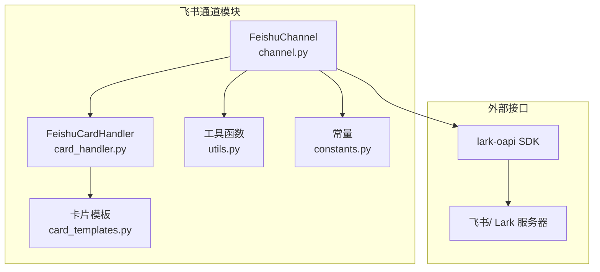
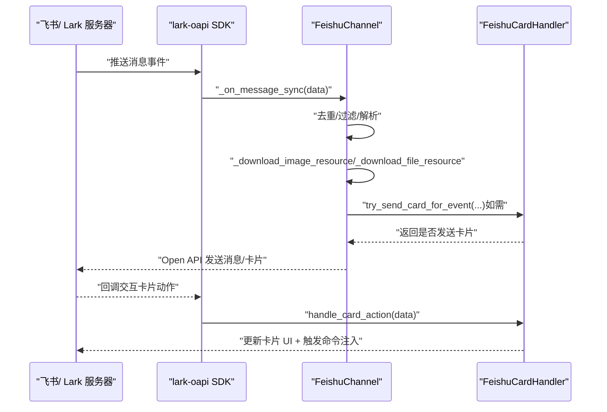
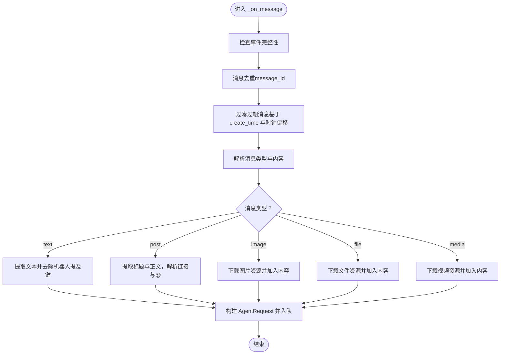
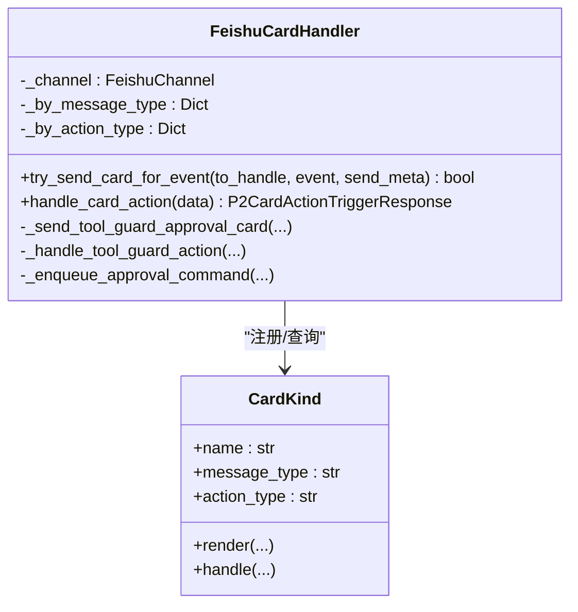
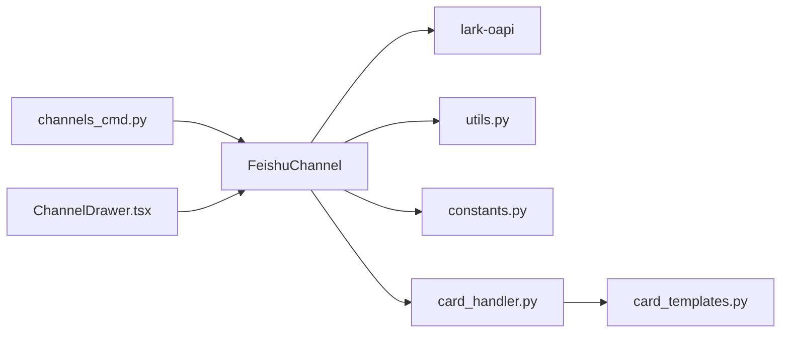

# 飞书平台集成

<cite>
**本文引用的文件**
- [channel.py](file://src/qwenpaw/app/channels/feishu/channel.py)
- [card_handler.py](file://src/qwenpaw/app/channels/feishu/card_handler.py)
- [utils.py](file://src/qwenpaw/app/channels/feishu/utils.py)
- [constants.py](file://src/qwenpaw/app/channels/feishu/constants.py)
- [card_templates.py](file://src/qwenpaw/app/channels/feishu/card_templates.py)
- [channels.en.md](file://website/public/docs/channels.en.md)
- [channels_cmd.py](file://src/qwenpaw/cli/channels_cmd.py)
- [ChannelDrawer.tsx](file://console/src/pages/Control/Channels/components/ChannelDrawer.tsx)
- [test_feishu.py](file://tests/unit/channels/test_feishu.py)
</cite>

## 目录
1. [简介](#简介)
2. [项目结构](#项目结构)
3. [核心组件](#核心组件)
4. [架构总览](#架构总览)
5. [详细组件分析](#详细组件分析)
6. [依赖关系分析](#依赖关系分析)
7. [性能考量](#性能考量)
8. [故障排查指南](#故障排查指南)
9. [结论](#结论)
10. [附录](#附录)

## 简介
本文件面向在飞书（含国际版 Lark）平台集成 QwenPaw 的工程与运维人员，系统性阐述飞书机器人的创建与配置流程、卡片消息处理机制、消息格式转换（Markdown、富文本、表格）、群聊与单聊的集成差异、认证与 Webhook 订阅、以及常见问题与最佳实践。文档基于仓库中飞书通道的源码与官方文档片段进行归纳总结，确保技术细节可追溯至具体实现。

## 项目结构
飞书通道位于后端服务的通道层，采用“长连接接收 + Open API 发送”的模式，核心文件组织如下：
- 通道主类：负责初始化、会话解析、消息去重、媒体下载、卡片处理与发送等
- 卡片处理器：集中管理交互式卡片的渲染与回调分发
- 工具函数：会话短 ID、显示名、JSON 键提取、文件扩展名检测、Markdown 正规化与表格转原生组件
- 常量定义：令牌刷新、文件大小限制、去重缓存、会话 ID 后缀长度、过期阈值、WS 重连参数等
- 卡片模板：纯数据构建器，生成工具审批等交互卡片 JSON
- 文档与控制台：官方文档步骤与前端控制台配置项映射

图表来源
- [channel.py:174-266](file://src/qwenpaw/app/channels/feishu/channel.py#L174-L266)
- [card_handler.py:98-114](file://src/qwenpaw/app/channels/feishu/card_handler.py#L98-L114)
- [utils.py:11-364](file://src/qwenpaw/app/channels/feishu/utils.py#L11-L364)
- [constants.py:1-33](file://src/qwenpaw/app/channels/feishu/constants.py#L1-L33)
- [card_templates.py:58-137](file://src/qwenpaw/app/channels/feishu/card_templates.py#L58-L137)

章节来源
- [channel.py:174-266](file://src/qwenpaw/app/channels/feishu/channel.py#L174-L266)
- [card_handler.py:98-114](file://src/qwenpaw/app/channels/feishu/card_handler.py#L98-L114)
- [utils.py:11-364](file://src/qwenpaw/app/channels/feishu/utils.py#L11-L364)
- [constants.py:1-33](file://src/qwenpaw/app/channels/feishu/constants.py#L1-L33)
- [card_templates.py:58-137](file://src/qwenpaw/app/channels/feishu/card_templates.py#L58-L137)

## 核心组件
- FeishuChannel：通道主类，负责长连接接收、消息解析、媒体下载、会话路由、去重、昵称缓存、卡片处理与发送等
- FeishuCardHandler：卡片处理中枢，注册卡片种类、按消息类型渲染卡片、按动作类型分发回调
- 工具函数：会话短 ID、显示名、JSON 键提取、文件扩展名识别、Markdown 正规化、表格解析与拆分
- 常量：令牌刷新提前时间、文件上传上限、去重与昵称缓存上限、会话 ID 后缀长度、消息过期阈值、WS 重连参数
- 卡片模板：构建工具审批卡片、解析动作值、生成 Toast 与状态卡

章节来源
- [channel.py:174-266](file://src/qwenpaw/app/channels/feishu/channel.py#L174-L266)
- [card_handler.py:98-114](file://src/qwenpaw/app/channels/feishu/card_handler.py#L98-L114)
- [utils.py:11-364](file://src/qwenpaw/app/channels/feishu/utils.py#L11-L364)
- [constants.py:1-33](file://src/qwenpaw/app/channels/feishu/constants.py#L1-L33)
- [card_templates.py:58-137](file://src/qwenpaw/app/channels/feishu/card_templates.py#L58-L137)

## 架构总览
飞书通道采用“长连接接收 + Open API 发送”的双通道模式：
- 接收：通过 lark-oapi 的 WebSocket 客户端建立持久连接，接收消息事件；对重复与过期消息进行过滤
- 发送：通过 Open API 发送消息，支持文本、图片、文件、视频等；卡片消息以交互式卡片形式发送
- 卡片：统一由 FeishuCardHandler 注册与分发，支持工具审批等内置卡片类型

图表来源
- [channel.py:570-614](file://src/qwenpaw/app/channels/feishu/channel.py#L570-L614)
- [channel.py:615-800](file://src/qwenpaw/app/channels/feishu/channel.py#L615-L800)
- [card_handler.py:154-214](file://src/qwenpaw/app/channels/feishu/card_handler.py#L154-L214)

章节来源
- [channel.py:570-614](file://src/qwenpaw/app/channels/feishu/channel.py#L570-L614)
- [channel.py:615-800](file://src/qwenpaw/app/channels/feishu/channel.py#L615-L800)
- [card_handler.py:154-214](file://src/qwenpaw/app/channels/feishu/card_handler.py#L154-L214)

## 详细组件分析

### 通道主类：FeishuChannel
- 初始化与配置
  - 支持从环境变量与配置对象加载参数，包括启用开关、App ID/Secret、前缀、加密密钥、校验令牌、媒体目录、策略与域（feishu/lark）
  - 域名默认为 feishu，非法值回退为 feishu
- 会话与路由
  - 会话 ID 由群聊 chat_id 或私聊 open_id 的后 N 位组成，便于定时任务查找
  - 提供 to_handle_from_target 与 _route_from_handle，支持按会话键或 open_id/chat_id 路由
- 消息接收与解析
  - 过滤来自其他实例的跨实例事件与过期消息（基于 header.create_time 与时钟偏移）
  - 解析文本、富文本（post）、图片、文件、媒体（视频）等消息类型
  - 富文本内容提取标题与正文，链接、@用户等元素转为纯文本
- 媒体处理
  - 图片与文件资源通过资源 API 下载，自动识别扩展名，保存到本地媒体目录
- 卡片处理
  - 交由 FeishuCardHandler 统一处理渲染与回调
- 发送与回复
  - 通过 Open API 发送文本、富文本、交互式卡片
  - 保存 receive_id 与 receive_id_type，支持后续主动发送与回复

图表来源
- [channel.py:615-800](file://src/qwenpaw/app/channels/feishu/channel.py#L615-L800)
- [utils.py:77-127](file://src/qwenpaw/app/channels/feishu/utils.py#L77-L127)

章节来源
- [channel.py:174-266](file://src/qwenpaw/app/channels/feishu/channel.py#L174-L266)
- [channel.py:332-440](file://src/qwenpaw/app/channels/feishu/channel.py#L332-L440)
- [channel.py:615-800](file://src/qwenpaw/app/channels/feishu/channel.py#L615-L800)
- [utils.py:77-127](file://src/qwenpaw/app/channels/feishu/utils.py#L77-L127)

### 卡片处理：FeishuCardHandler
- 注册机制
  - 通过 CardKind 将“消息类型”与“动作类型”分别映射到渲染与处理函数
  - 当前内置工具审批卡片（tool_guard_approval），动作类型为固定标记
- 出站渲染
  - 根据事件元数据匹配卡片种类，调用对应渲染函数，生成交互式卡片并发送
- 入站回调
  - 解析 card.action.trigger 的 action_value，重建会话上下文，注入 /approval 命令到通道队列
  - 返回 Toast 与状态卡，替换原始卡片 UI

图表来源
- [card_handler.py:98-114](file://src/qwenpaw/app/channels/feishu/card_handler.py#L98-L114)
- [card_handler.py:134-148](file://src/qwenpaw/app/channels/feishu/card_handler.py#L134-L148)
- [card_handler.py:220-272](file://src/qwenpaw/app/channels/feishu/card_handler.py#L220-L272)
- [card_handler.py:278-341](file://src/qwenpaw/app/channels/feishu/card_handler.py#L278-L341)

章节来源
- [card_handler.py:98-114](file://src/qwenpaw/app/channels/feishu/card_handler.py#L98-L114)
- [card_handler.py:134-148](file://src/qwenpaw/app/channels/feishu/card_handler.py#L134-L148)
- [card_handler.py:220-272](file://src/qwenpaw/app/channels/feishu/card_handler.py#L220-L272)
- [card_handler.py:278-341](file://src/qwenpaw/app/channels/feishu/card_handler.py#L278-L341)

### 工具函数与消息格式转换
- 会话短 ID 与显示名
  - short_session_id_from_full_id：取末 N 位作为会话 ID
  - sender_display_string：组合昵称与 ID 后缀
- JSON 键提取与文件扩展名
  - extract_json_key：从 JSON 字符串中提取首个存在的键值
  - detect_file_ext：根据魔数识别文件扩展名
- 富文本与表格
  - extract_post_text：从 post 内容中抽取标题与正文，链接与 @ 用户转为 Markdown
  - normalize_feishu_md：保证代码块前后换行，避免渲染异常
  - 表格解析：将 Markdown 表格转为飞书原生表格组件，支持对齐与分块
- 交互式内容构建
  - build_interactive_content / build_interactive_content_chunks：将混合 Markdown 与表格的内容拆分为多段卡片

章节来源
- [utils.py:11-26](file://src/qwenpaw/app/channels/feishu/utils.py#L11-L26)
- [utils.py:28-41](file://src/qwenpaw/app/channels/feishu/utils.py#L28-L41)
- [utils.py:58-75](file://src/qwenpaw/app/channels/feishu/utils.py#L58-L75)
- [utils.py:77-127](file://src/qwenpaw/app/channels/feishu/utils.py#L77-L127)
- [utils.py:169-178](file://src/qwenpaw/app/channels/feishu/utils.py#L169-L178)
- [utils.py:180-317](file://src/qwenpaw/app/channels/feishu/utils.py#L180-L317)
- [utils.py:350-364](file://src/qwenpaw/app/channels/feishu/utils.py#L350-L364)

### 常量与行为约束
- 令牌与网络
  - FEISHU_TOKEN_REFRESH_BEFORE_SECONDS：提前刷新令牌
  - FEISHU_WS_*：WS 初始延迟、最大延迟、回退因子与接收超时
- 存储与缓存
  - FEISHU_FILE_MAX_BYTES：文件上传上限
  - FEISHU_PROCESSED_IDS_MAX：消息去重缓存上限
  - FEISHU_NICKNAME_CACHE_MAX：昵称缓存上限
  - FEISHU_SESSION_ID_SUFFIX_LEN：会话 ID 后缀长度
  - FEISHU_STALE_MSG_THRESHOLD_MS：消息过期阈值（毫秒）

章节来源
- [constants.py:4-33](file://src/qwenpaw/app/channels/feishu/constants.py#L4-L33)

### 卡片模板：工具审批
- 构建审批卡片：包含标题、Markdown 内容、提示按钮不可用的引导、批准/拒绝按钮，按钮 value 中嵌入请求 ID、工具名、严重级别与会话上下文快照
- 处理动作：解析 action_value，注入 /approval 命令，返回 Toast 与状态卡（已批准/已拒绝/已过期）

章节来源
- [card_templates.py:58-137](file://src/qwenpaw/app/channels/feishu/card_templates.py#L58-L137)
- [card_templates.py:140-186](file://src/qwenpaw/app/channels/feishu/card_templates.py#L140-L186)
- [card_templates.py:189-214](file://src/qwenpaw/app/channels/feishu/card_templates.py#L189-L214)
- [card_templates.py:216-239](file://src/qwenpaw/app/channels/feishu/card_templates.py#L216-L239)

## 依赖关系分析
- 通道主类依赖 lark-oapi SDK 的事件模型与客户端，用于 WebSocket 接收与 Open API 发送
- 卡片处理器依赖通道提供的发送能力与会话上下文，不直接持有业务状态
- 工具函数与模板为纯数据处理，便于单元测试与复用
- 控制台与 CLI 提供配置入口，与通道配置字段一一对应

图表来源
- [channel.py:117-167](file://src/qwenpaw/app/channels/feishu/channel.py#L117-L167)
- [card_handler.py:42-58](file://src/qwenpaw/app/channels/feishu/card_handler.py#L42-L58)
- [channels_cmd.py:340-387](file://src/qwenpaw/cli/channels_cmd.py#L340-L387)
- [ChannelDrawer.tsx:384-458](file://console/src/pages/Control/Channels/components/ChannelDrawer.tsx#L384-L458)

章节来源
- [channel.py:117-167](file://src/qwenpaw/app/channels/feishu/channel.py#L117-L167)
- [card_handler.py:42-58](file://src/qwenpaw/app/channels/feishu/card_handler.py#L42-L58)
- [channels_cmd.py:340-387](file://src/qwenpaw/cli/channels_cmd.py#L340-L387)
- [ChannelDrawer.tsx:384-458](file://console/src/pages/Control/Channels/components/ChannelDrawer.tsx#L384-L458)

## 性能考量
- 去重与过期过滤：通过消息 ID 去重与过期阈值减少重复处理与无效消息
- 缓存与限流：昵称缓存与会话 ID 后缀长度控制内存占用；WS 重连参数避免频繁重试
- 文件处理：下载媒体资源时识别扩展名，避免错误 MIME 类型导致的渲染失败
- 卡片分块：当表格过多时拆分为多段卡片，避免单次卡片过大

章节来源
- [constants.py:10-33](file://src/qwenpaw/app/channels/feishu/constants.py#L10-L33)
- [utils.py:180-317](file://src/qwenpaw/app/channels/feishu/utils.py#L180-L317)

## 故障排查指南
- 配置顺序与依赖
  - 官方文档强调先配置 App ID/Secret，再启动服务，最后在飞书控制台配置长连接与事件/回调订阅
- 事件与回调订阅
  - 必须订阅“消息接收 v2.0”与“卡片回调交互”
  - 若按钮点击无响应，检查回调配置文档锚点指引
- 权限缺失
  - 昵称显示需要“联系人只读”权限；否则无法解析用户昵称
- 常见问题定位
  - 使用单元测试覆盖初始化、配置加载、会话解析、去重与昵称缓存等关键路径
  - 关注 WS 接收超时与重连逻辑，必要时调整网络环境或代理设置

章节来源
- [channels.en.md:184-210](file://website/public/docs/channels.en.md#L184-L210)
- [channels.en.md:256-276](file://website/public/docs/channels.en.md#L256-L276)
- [test_feishu.py:126-200](file://tests/unit/channels/test_feishu.py#L126-L200)
- [test_feishu.py:268-422](file://tests/unit/channels/test_feishu.py#L268-L422)

## 结论
QwenPaw 的飞书通道通过长连接与 Open API 实现稳定的消息收发，结合卡片处理中枢与富文本/表格转换能力，满足群聊与单聊场景下的多样化需求。遵循官方文档的配置顺序与权限要求，配合通道内的去重、过期过滤与缓存策略，可在生产环境中获得良好的稳定性与可维护性。

## 附录

### 飞书机器人创建与配置步骤（基于官方文档）
- 创建应用并获取 App ID/Secret
- 在“权限与作用域”批量导入以下作用域，授予应用级权限
- 在“事件与回调”中选择“通过持久连接接收事件”，订阅“消息接收 v2.0”
- 在“回调配置”中选择“通过持久连接接收事件”，订阅“卡片回调交互”
- 发布版本后生效

章节来源
- [channels.en.md:152-174](file://website/public/docs/channels.en.md#L152-L174)
- [channels.en.md:184-210](file://website/public/docs/channels.en.md#L184-L210)

### 群聊与单聊集成要点
- 会话 ID：群聊使用 chat_id 后缀，私聊使用 open_id 后缀
- 路由键：支持 feishu:sw:<short_id>、feishu:chat_id:<chat_id>、feishu:open_id:<open_id> 等多种形式
- 主动发送：通过保存的 receive_id 与 receive_id_type 实现

章节来源
- [channel.py:332-440](file://src/qwenpaw/app/channels/feishu/channel.py#L332-L440)

### 消息格式转换与富文本渲染
- 文本：提取并清理机器人提及键，保留正文
- 富文本：标题与正文抽取，链接与 @ 用户转为 Markdown
- 表格：将 Markdown 表格解析为飞书原生表格组件，超过上限自动拆分
- 代码块：确保前后换行，避免渲染异常

章节来源
- [utils.py:77-127](file://src/qwenpaw/app/channels/feishu/utils.py#L77-L127)
- [utils.py:169-178](file://src/qwenpaw/app/channels/feishu/utils.py#L169-L178)
- [utils.py:180-317](file://src/qwenpaw/app/channels/feishu/utils.py#L180-L317)
- [utils.py:350-364](file://src/qwenpaw/app/channels/feishu/utils.py#L350-L364)

### 交互式卡片与按钮点击事件
- 出站：根据事件元数据匹配卡片种类，渲染交互式卡片
- 入站：解析动作值，重建会话上下文，注入 /approval 命令，返回 Toast 与状态卡

章节来源
- [card_handler.py:154-214](file://src/qwenpaw/app/channels/feishu/card_handler.py#L154-L214)
- [card_handler.py:278-341](file://src/qwenpaw/app/channels/feishu/card_handler.py#L278-L341)
- [card_templates.py:58-137](file://src/qwenpaw/app/channels/feishu/card_templates.py#L58-L137)

### 认证机制与 Webhook/事件订阅
- 认证：通过 lark-oapi SDK 获取自填租户令牌，调用 Open API
- Webhook：使用持久连接接收事件与卡片回调，无需公网 IP
- 订阅：事件“消息接收 v2.0”与回调“卡片回调交互”

章节来源
- [channel.py:441-497](file://src/qwenpaw/app/channels/feishu/channel.py#L441-L497)
- [channels.en.md:184-210](file://website/public/docs/channels.en.md#L184-L210)

### 控制台与 CLI 配置映射
- 控制台：支持区域选择（feishu/lark）、App ID/Secret、加密密钥、校验令牌、媒体目录等
- CLI：交互式配置飞书通道，支持启用开关、区域、前缀、App ID/Secret

章节来源
- [ChannelDrawer.tsx:384-458](file://console/src/pages/Control/Channels/components/ChannelDrawer.tsx#L384-L458)
- [channels_cmd.py:340-387](file://src/qwenpaw/cli/channels_cmd.py#L340-L387)