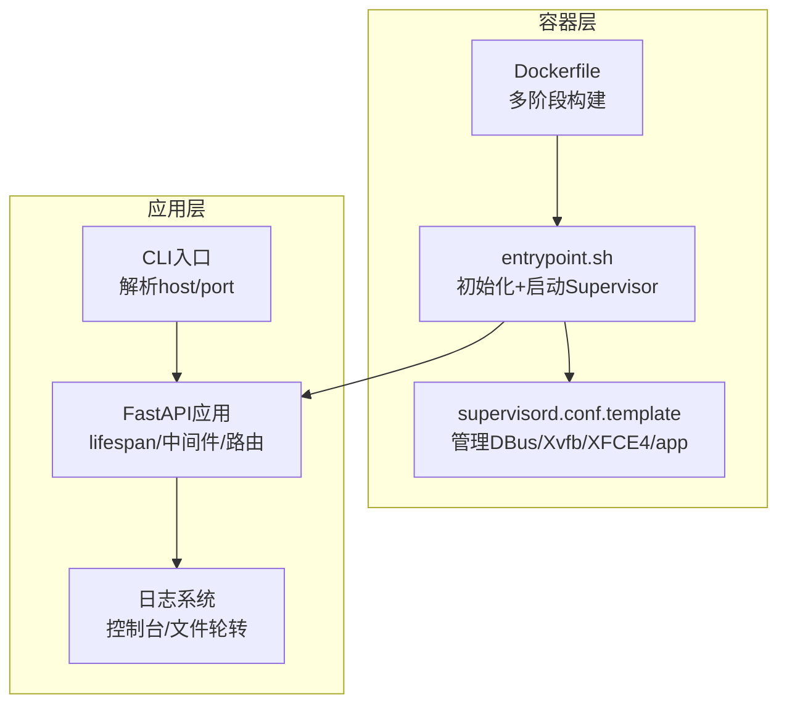
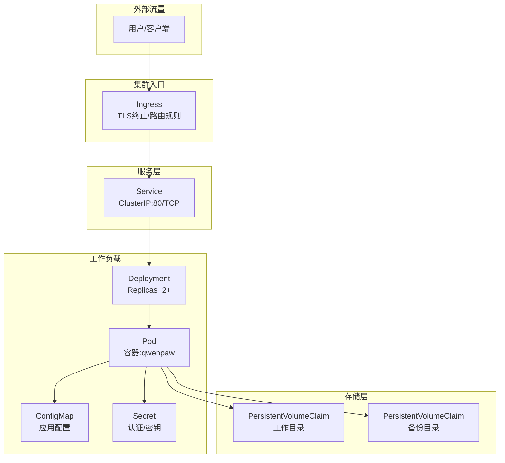
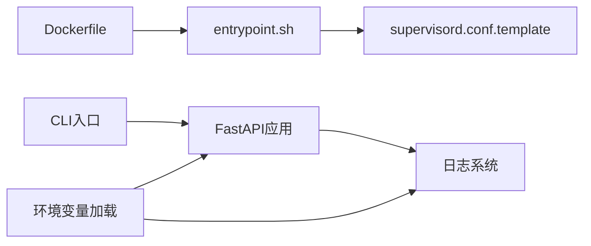

# Kubernetes部署

<cite>
**本文引用的文件**
- [deploy/Dockerfile](file://deploy/Dockerfile)
- [deploy/entrypoint.sh](file://deploy/entrypoint.sh)
- [deploy/config/supervisord.conf.template](file://deploy/config/supervisord.conf.template)
- [docker-compose.yml](file://docker-compose.yml)
- [scripts/docker_build.sh](file://scripts/docker_build.sh)
- [src/qwenpaw/cli/app_cmd.py](file://src/qwenpaw/cli/app_cmd.py)
- [src/qwenpaw/cli/main.py](file://src/qwenpaw/cli/main.py)
- [src/qwenpaw/constant.py](file://src/qwenpaw/constant.py)
- [src/qwenpaw/app/_app.py](file://src/qwenpaw/app/_app.py)
- [src/qwenpaw/utils/logging.py](file://src/qwenpaw/utils/logging.py)
- [website/public/docs/config.zh.md](file://website/public/docs/config.zh.md)
- [website/public/docs/config.en.md](file://website/public/docs/config.en.md)
</cite>

## 目录
1. [简介](#简介)
2. [项目结构](#项目结构)
3. [核心组件](#核心组件)
4. [架构总览](#架构总览)
5. [详细组件分析](#详细组件分析)
6. [依赖关系分析](#依赖关系分析)
7. [性能考虑](#性能考虑)
8. [故障排查指南](#故障排查指南)
9. [结论](#结论)
10. [附录](#附录)

## 简介
本指南面向在Kubernetes中部署QwenPaw的工程团队，提供从资源配置到滚动更新、健康检查、存储与持久化、Ingress与TLS、监控与日志、性能调优的完整实践。文档基于仓库中的容器镜像构建脚本、运行入口、应用启动参数与环境变量、以及Web控制台与API路由实现进行设计，确保部署过程可重复、可观测、可恢复。

## 项目结构
- 容器镜像与运行时
  - 多阶段Dockerfile：前端构建与Python运行时分离；安装Chromium与Supervisor以支持无头浏览器与桌面环境。
  - 运行入口脚本：初始化配置、注入端口、启动Supervisor。
  - Supervisor配置模板：管理DBus、Xvfb、XFCE4与应用进程。
- 应用启动与参数
  - CLI入口支持通过命令行或环境变量指定主机与端口；默认端口为8088。
  - FastAPI应用在生命周期内加载配置、插件、代理与本地模型管理器，并挂载控制台静态资源。
- 存储与目录
  - 工作目录与敏感目录通过环境变量可定制；默认位于用户主目录下；容器中默认指向工作区与秘密区。
  - 备份目录与媒体目录等也由环境变量控制。

图表来源
- [deploy/Dockerfile:1-105](file://deploy/Dockerfile#L1-L105)
- [deploy/entrypoint.sh:1-21](file://deploy/entrypoint.sh#L1-L21)
- [deploy/config/supervisord.conf.template:1-40](file://deploy/config/supervisord.conf.template#L1-L40)
- [src/qwenpaw/cli/main.py:148-173](file://src/qwenpaw/cli/main.py#L148-L173)
- [src/qwenpaw/app/_app.py:547-719](file://src/qwenpaw/app/_app.py#L547-L719)
- [src/qwenpaw/utils/logging.py:154-226](file://src/qwenpaw/utils/logging.py#L154-L226)

章节来源
- [deploy/Dockerfile:1-105](file://deploy/Dockerfile#L1-L105)
- [deploy/entrypoint.sh:1-21](file://deploy/entrypoint.sh#L1-L21)
- [deploy/config/supervisord.conf.template:1-40](file://deploy/config/supervisord.conf.template#L1-L40)
- [src/qwenpaw/cli/main.py:148-173](file://src/qwenpaw/cli/main.py#L148-L173)
- [src/qwenpaw/app/_app.py:547-719](file://src/qwenpaw/app/_app.py#L547-L719)
- [src/qwenpaw/utils/logging.py:154-226](file://src/qwenpaw/utils/logging.py#L154-L226)

## 核心组件
- 容器镜像与运行时
  - 多阶段构建：前端构建与Python运行时分离；安装Chromium与Supervisor。
  - 端口暴露与默认端口：容器暴露8088端口，可通过环境变量覆盖。
  - 初始化逻辑：若工作目录缺少配置文件，则自动初始化。
- 应用服务
  - CLI参数：支持host、port、日志级别、访问日志过滤等。
  - FastAPI应用：生命周期管理、CORS、认证中间件、控制台静态资源挂载。
  - 日志：控制台输出与文件轮转，支持按路径抑制特定访问日志。
- 存储与目录
  - 工作目录与敏感目录：通过环境变量可定制；容器中默认指向工作区与秘密区。
  - 备份与媒体目录：同样受环境变量控制。

章节来源
- [deploy/Dockerfile:96-105](file://deploy/Dockerfile#L96-L105)
- [deploy/entrypoint.sh:6-14](file://deploy/entrypoint.sh#L6-L14)
- [src/qwenpaw/cli/app_cmd.py:15-112](file://src/qwenpaw/cli/app_cmd.py#L15-L112)
- [src/qwenpaw/app/_app.py:547-719](file://src/qwenpaw/app/_app.py#L547-L719)
- [src/qwenpaw/constant.py:89-231](file://src/qwenpaw/constant.py#L89-L231)

## 架构总览
下图展示Kubernetes部署的典型拓扑：Ingress作为入口，Service暴露ClusterIP，Deployment管理副本，ConfigMap与Secret提供配置与密钥，PersistentVolume用于持久化工作目录与备份目录。

图表来源
- [src/qwenpaw/app/_app.py:547-719](file://src/qwenpaw/app/_app.py#L547-L719)
- [src/qwenpaw/constant.py:89-231](file://src/qwenpaw/constant.py#L89-L231)

## 详细组件分析

### Deployment配置要点
- Pod模板
  - 容器名称：qwenpaw
  - 镜像：使用仓库提供的镜像标签
  - 端口：容器端口8088
  - 环境变量：QWENPAW_PORT、QWENPAW_AUTH_ENABLED、QWENPAW_AUTH_USERNAME、QWENPAW_AUTH_PASSWORD等
  - 卷挂载：工作目录卷、秘密目录卷、备份目录卷
  - 资源请求与限制：建议根据并发与内存占用设定requests/limits
  - 启动探针与就绪探针：基于HTTP GET /api/version或/health（需自定义）
- 副本与调度
  - replicas≥2以满足高可用
  - 使用亲和性/反亲和性避免同Pod在同一节点
  - 使用PodDisruptionBudget保障最小可用副本
- 滚动更新策略
  - maxUnavailable=1 或 50%，maxSurge=1 或 50%
  - 结合ReadinessGate与探针确保平滑切换

章节来源
- [deploy/Dockerfile:96-105](file://deploy/Dockerfile#L96-L105)
- [src/qwenpaw/cli/main.py:148-173](file://src/qwenpaw/cli/main.py#L148-L173)
- [src/qwenpaw/constant.py:89-231](file://src/qwenpaw/constant.py#L89-L231)

### Service配置要点
- 类型：ClusterIP
- 端口：80/TCP
- 目标端口：8088（容器端口）
- 会话亲和性：可选，如需保持长连接或SSE场景
- 稳定地址：配合Ingress使用

章节来源
- [src/qwenpaw/app/_app.py:646-663](file://src/qwenpaw/app/_app.py#L646-L663)

### ConfigMap与Secret配置要点
- ConfigMap
  - 用途：存放非敏感配置（如CORS、日志级别、功能开关）
  - 键值：建议将QWENPAW_LOG_LEVEL、QWENPAW_CORS_ORIGINS等放入
- Secret
  - 用途：存放认证凭据（如QWENPAW_AUTH_USERNAME、QWENPAW_AUTH_PASSWORD）
  - 类型：Opaque
  - 注意：避免将API密钥硬编码在镜像或容器命令中

章节来源
- [website/public/docs/config.zh.md:79-87](file://website/public/docs/config.zh.md#L79-L87)
- [website/public/docs/config.en.md:84-98](file://website/public/docs/config.en.md#L84-L98)

### 存储与持久化
- 工作目录（工作区）
  - 默认路径：容器内默认为工作区根目录；可通过环境变量覆盖
  - 建议：使用ReadWriteMany的共享存储（如NFS、CSI），或为每个Pod分配独立PVC
- 秘密目录（敏感数据）
  - 默认路径：容器内默认为秘密区根目录；可通过环境变量覆盖
  - 建议：使用只读挂载，避免写入冲突
- 备份目录
  - 默认路径：容器内默认为备份区根目录；可通过环境变量覆盖
  - 建议：独立PVC，定期快照或归档

章节来源
- [src/qwenpaw/constant.py:89-231](file://src/qwenpaw/constant.py#L89-L231)
- [website/public/docs/config.zh.md:16-47](file://website/public/docs/config.zh.md#L16-L47)

### Ingress、TLS与负载均衡
- Ingress
  - 路由规则：将 / 与 /api 前缀转发至Service
  - TLS：启用TLS终止，证书由Ingress控制器管理
  - 会话亲和：如需SSE或长连接，可启用sessionAffinity
- 负载均衡
  - Service类型：ClusterIP
  - 外部LB：可结合云厂商LB或MetalLB
- 健康检查
  - 建议：使用HTTP GET /api/version作为存活/就绪探针
  - 探针参数：initialDelaySeconds、periodSeconds、timeoutSeconds、failureThreshold

章节来源
- [src/qwenpaw/app/_app.py:629-644](file://src/qwenpaw/app/_app.py#L629-L644)

### 滚动更新策略与故障恢复
- 滚动更新
  - 策略：RollingUpdate，maxUnavailable=1，maxSurge=1
  - 钩子：在lifespan中处理背景启动与优雅关闭，避免中断请求
- 故障恢复
  - Supervisor：管理DBus、Xvfb、XFCE4与应用进程，异常重启
  - 入口脚本：缺失配置时自动初始化，避免冷启动失败
  - 插件与代理：在lifespan中注册插件与代理，失败时记录日志并继续

章节来源
- [deploy/config/supervisord.conf.template:14-40](file://deploy/config/supervisord.conf.template#L14-L40)
- [deploy/entrypoint.sh:6-14](file://deploy/entrypoint.sh#L6-L14)
- [src/qwenpaw/app/_app.py:220-465](file://src/qwenpaw/app/_app.py#L220-L465)

### 健康检查与可观测性
- 健康端点
  - /api/version：返回版本信息，适合存活/就绪探针
  - /api/doctor/runtime：返回运行时诊断信息（仅认证用户）
- 日志
  - 控制台输出：彩色格式，便于终端查看
  - 文件轮转：最大5MiB，保留3个备份
  - 访问日志过滤：可抑制特定路径的访问日志
- 监控指标
  - 建议：结合Prometheus/Grafana采集应用指标与容器指标
  - 建议：使用OpenTelemetry采集链路追踪

章节来源
- [src/qwenpaw/app/_app.py:629-644](file://src/qwenpaw/app/_app.py#L629-L644)
- [src/qwenpaw/utils/logging.py:154-226](file://src/qwenpaw/utils/logging.py#L154-L226)

### Helm Chart使用与自定义
- Chart结构建议
  - templates/：Deployment、Service、Ingress、ConfigMap、Secret、PVC
  - values.yaml：默认参数（镜像、端口、副本数、资源、探针、Ingress TLS）
  - charts/：依赖Chart（如cert-manager）
- 自定义选项
  - 应用参数：QWENPAW_PORT、QWENPAW_LOG_LEVEL、QWENPAW_CORS_ORIGINS、QWENPAW_AUTH_ENABLED等
  - 存储：工作目录与备份目录的PVC大小与StorageClass
  - 调度：节点选择器、亲和性、容忍度
  - Ingress：域名、TLS配置、注解
- 安全
  - Secret使用：避免明文存储在values.yaml中
  - RBAC：为Ingress控制器与应用ServiceAccount授权

章节来源
- [website/public/docs/config.zh.md:79-87](file://website/public/docs/config.zh.md#L79-L87)
- [website/public/docs/config.en.md:84-98](file://website/public/docs/config.en.md#L84-L98)

## 依赖关系分析
- 容器镜像与运行时
  - Dockerfile依赖前端构建产物与Python运行时
  - entrypoint.sh依赖Supervisor配置模板
- 应用启动
  - CLI入口解析host/port，FastAPI应用在lifespan中完成初始化
  - 日志系统在模块导入时初始化
- 配置与环境变量
  - constant.py统一加载与解析环境变量，支持兼容旧键

图表来源
- [deploy/Dockerfile:1-105](file://deploy/Dockerfile#L1-L105)
- [deploy/entrypoint.sh:1-21](file://deploy/entrypoint.sh#L1-L21)
- [deploy/config/supervisord.conf.template:1-40](file://deploy/config/supervisord.conf.template#L1-L40)
- [src/qwenpaw/cli/main.py:148-173](file://src/qwenpaw/cli/main.py#L148-L173)
- [src/qwenpaw/app/_app.py:547-719](file://src/qwenpaw/app/_app.py#L547-L719)
- [src/qwenpaw/utils/logging.py:154-226](file://src/qwenpaw/utils/logging.py#L154-L226)
- [src/qwenpaw/constant.py:12-26](file://src/qwenpaw/constant.py#L12-L26)

章节来源
- [deploy/Dockerfile:1-105](file://deploy/Dockerfile#L1-L105)
- [deploy/entrypoint.sh:1-21](file://deploy/entrypoint.sh#L1-L21)
- [deploy/config/supervisord.conf.template:1-40](file://deploy/config/supervisord.conf.template#L1-L40)
- [src/qwenpaw/cli/main.py:148-173](file://src/qwenpaw/cli/main.py#L148-L173)
- [src/qwenpaw/app/_app.py:547-719](file://src/qwenpaw/app/_app.py#L547-L719)
- [src/qwenpaw/utils/logging.py:154-226](file://src/qwenpaw/utils/logging.py#L154-L226)
- [src/qwenpaw/constant.py:12-26](file://src/qwenpaw/constant.py#L12-L26)

## 性能考虑
- 并发与资源
  - 并发限制：通过环境变量控制LLM并发与QPM，避免触发上游限流
  - 资源请求：根据CPU与内存峰值设定requests/limits，避免被OOMKilled
- 浏览器与桌面
  - 无头模式：优先使用无头模式减少资源消耗
  - 桌面环境：仅在需要GUI时启用，注意Xvfb/XFCE4开销
- 存储IO
  - 工作目录与备份目录使用高性能存储类
  - 避免频繁小文件写入，合并写操作
- 网络
  - Ingress与Service的连接池与超时设置
  - 合理的探针间隔与超时，避免误判

章节来源
- [src/qwenpaw/constant.py:262-324](file://src/qwenpaw/constant.py#L262-L324)

## 故障排查指南
- 启动失败
  - 缺少配置：入口脚本会在工作目录缺失配置时自动初始化
  - Supervisor异常：检查DBus/Xvfb/XFCE4与应用进程日志
- 认证问题
  - 确认QWENPAW_AUTH_ENABLED与凭据是否正确
  - 检查认证中间件是否生效
- 日志定位
  - 控制台日志：彩色输出，便于快速定位
  - 文件日志：轮转文件，检查最近备份
- 探针失败
  - 确认/health或/version端点可达
  - 调整探针参数，避免过短的超时与间隔

章节来源
- [deploy/entrypoint.sh:6-14](file://deploy/entrypoint.sh#L6-L14)
- [deploy/config/supervisord.conf.template:14-40](file://deploy/config/supervisord.conf.template#L14-L40)
- [src/qwenpaw/app/_app.py:629-644](file://src/qwenpaw/app/_app.py#L629-L644)
- [src/qwenpaw/utils/logging.py:154-226](file://src/qwenpaw/utils/logging.py#L154-L226)

## 结论
通过将QwenPaw容器化并结合Kubernetes的Deployment、Service、Ingress、ConfigMap与Secret，可以实现高可用、可观测、可扩展的应用部署。遵循本文的资源配置、滚动更新、健康检查与存储持久化建议，可在生产环境中稳定运行QwenPaw，并具备良好的运维与故障恢复能力。

## 附录
- 端口与环境变量参考
  - 默认端口：8088（可通过QWENPAW_PORT覆盖）
  - 认证开关：QWENPAW_AUTH_ENABLED
  - 日志级别：QWENPAW_LOG_LEVEL
  - CORS：QWENPAW_CORS_ORIGINS
  - 工作目录与备份目录：QWENPAW_WORKING_DIR、QWENPAW_BACKUP_DIR
- 参考文档
  - 配置与目录结构说明（中文/英文）

章节来源
- [website/public/docs/config.zh.md:79-87](file://website/public/docs/config.zh.md#L79-L87)
- [website/public/docs/config.en.md:84-98](file://website/public/docs/config.en.md#L84-L98)