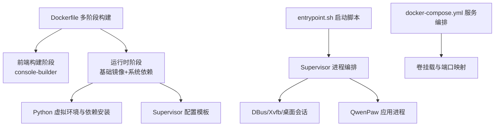
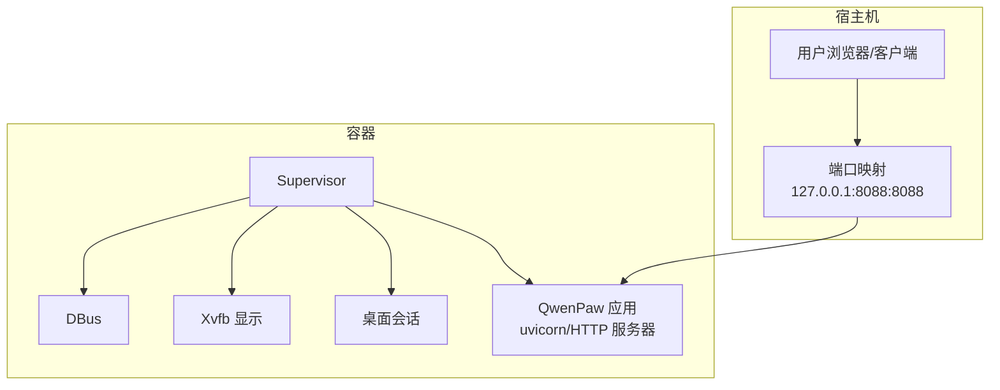
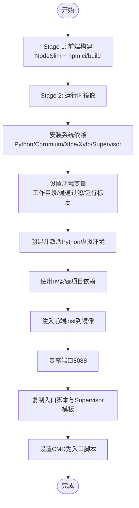
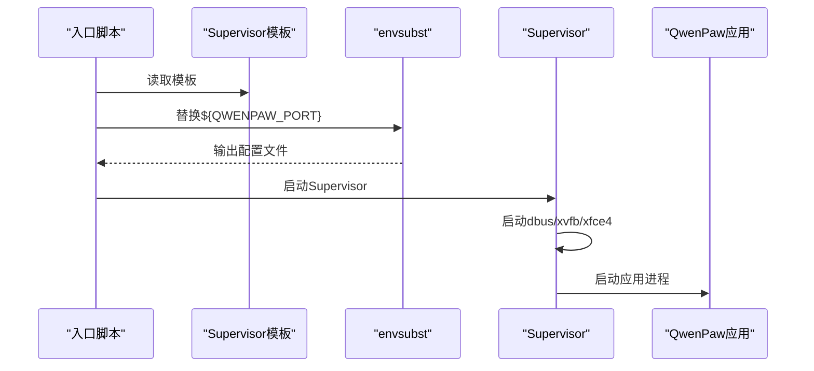
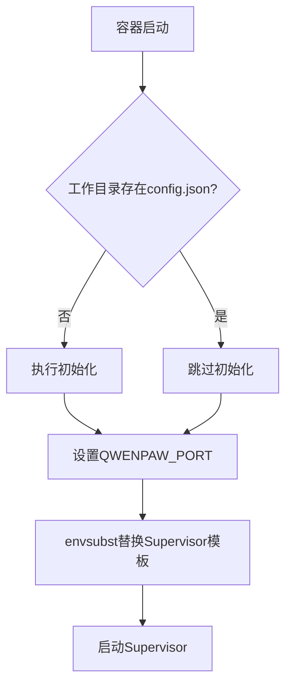
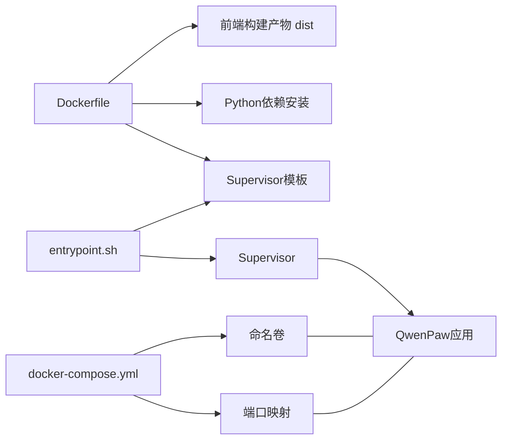

# 容器化部署

<cite>
**本文引用的文件**
- [deploy/Dockerfile](file://deploy/Dockerfile)
- [deploy/entrypoint.sh](file://deploy/entrypoint.sh)
- [deploy/config/supervisord.conf.template](file://deploy/config/supervisord.conf.template)
- [docker-compose.yml](file://docker-compose.yml)
- [.dockerignore](file://.dockerignore)
- [scripts/docker_build.sh](file://scripts/docker_build.sh)
- [pyproject.toml](file://pyproject.toml)
- [src/qwenpaw/cli/main.py](file://src/qwenpaw/cli/main.py)
- [src/qwenpaw/config/utils.py](file://src/qwenpaw/config/utils.py)
- [src/qwenpaw/cli/doctor_cmd.py](file://src/qwenpaw/cli/doctor_cmd.py)
- [src/qwenpaw/cli/doctor_fix_runner.py](file://src/qwenpaw/cli/doctor_fix_runner.py)
- [plugins/tool/qwen-image/requirements.txt](file://plugins/tool/qwen-image/requirements.txt)
- [plugins/tool/gpt-image2/requirements.txt](file://plugins/tool/gpt-image2/requirements.txt)
- [plugins/tool/wan27/requirements.txt](file://plugins/tool/wan27/requirements.txt)
</cite>

## 目录
1. [简介](#简介)
2. [项目结构](#项目结构)
3. [核心组件](#核心组件)
4. [架构总览](#架构总览)
5. [详细组件分析](#详细组件分析)
6. [依赖关系分析](#依赖关系分析)
7. [性能考虑](#性能考虑)
8. [故障排查指南](#故障排查指南)
9. [结论](#结论)
10. [附录](#附录)

## 简介
本文件面向运维与开发人员，提供QwenPaw项目的容器化部署完整指南。内容覆盖多阶段Docker镜像构建、前端构建优化、Python运行时与依赖安装、Supervisor进程编排、容器启动脚本功能与配置、docker-compose完整示例以及最佳实践与常见问题处理。目标是帮助你在生产环境中稳定、可扩展地运行QwenPaw。

## 项目结构
与容器化部署直接相关的关键文件与目录如下：
- 构建与运行时
  - deploy/Dockerfile：多阶段构建，前端构建与后端打包一体化
  - deploy/entrypoint.sh：容器启动入口，负责初始化与Supervisor编排
  - deploy/config/supervisord.conf.template：Supervisor模板，定义DBus、Xvfb、桌面会话与应用进程
  - docker-compose.yml：Compose服务定义、卷挂载、端口映射与默认环境变量注释
  - .dockerignore：排除构建上下文中的无关文件，加速构建并减小镜像体积
  - scripts/docker_build.sh：封装构建流程，支持通道过滤参数传递
- 运行时依赖与版本
  - pyproject.toml：Python包与依赖声明，含可选依赖分组
  - plugins/tool/*/requirements.txt：插件级Python依赖清单
- 工作目录与初始化
  - src/qwenpaw/cli/doctor_cmd.py、src/qwenpaw/cli/doctor_fix_runner.py：工作目录校验与修复逻辑
  - src/qwenpaw/config/utils.py：通道白名单/黑名单环境变量解析
  - src/qwenpaw/cli/main.py：默认监听端口与CLI入口

图表来源
- [deploy/Dockerfile:1-105](file://deploy/Dockerfile#L1-L105)
- [deploy/entrypoint.sh:1-21](file://deploy/entrypoint.sh#L1-L21)
- [deploy/config/supervisord.conf.template:1-40](file://deploy/config/supervisord.conf.template#L1-L40)
- [docker-compose.yml:1-26](file://docker-compose.yml#L1-L26)

章节来源
- [deploy/Dockerfile:1-105](file://deploy/Dockerfile#L1-L105)
- [deploy/entrypoint.sh:1-21](file://deploy/entrypoint.sh#L1-L21)
- [deploy/config/supervisord.conf.template:1-40](file://deploy/config/supervisord.conf.template#L1-L40)
- [docker-compose.yml:1-26](file://docker-compose.yml#L1-L26)
- [.dockerignore:1-63](file://.dockerignore#L1-L63)
- [scripts/docker_build.sh:1-32](file://scripts/docker_build.sh#L1-L32)

## 核心组件
- 多阶段Dockerfile
  - 前端构建阶段：使用NodeSlim镜像构建console前端产物，并在后续阶段注入到最终镜像中
  - 运行时阶段：安装系统依赖（Chromium、Xvfb、桌面环境、Supervisor等），创建Python虚拟环境，使用uv加速安装项目依赖，复制Supervisor模板与入口脚本，暴露端口并设置默认命令
- Supervisor进程编排
  - 启动DBus、Xvfb与桌面会话，确保Chromium无头渲染与桌面交互能力
  - 启动QwenPaw应用进程，监听0.0.0.0，端口由环境变量控制
- 容器启动脚本
  - 自动检测工作目录下的配置文件，缺失则执行初始化；随后通过envsubst替换Supervisor模板中的端口变量，再启动Supervisor
- docker-compose编排
  - 定义命名卷用于持久化工作目录、密钥目录与备份目录；默认仅本地回环绑定端口；提供环境变量注释示例（认证开关与凭据）

章节来源
- [deploy/Dockerfile:1-105](file://deploy/Dockerfile#L1-L105)
- [deploy/config/supervisord.conf.template:1-40](file://deploy/config/supervisord.conf.template#L1-L40)
- [deploy/entrypoint.sh:1-21](file://deploy/entrypoint.sh#L1-L21)
- [docker-compose.yml:1-26](file://docker-compose.yml#L1-L26)

## 架构总览
下图展示容器内进程与外部访问的关系：客户端通过宿主机端口访问容器内的QwenPaw应用，Supervisor统一管理DBus、Xvfb、桌面会话与应用进程。

图表来源
- [deploy/config/supervisord.conf.template:14-40](file://deploy/config/supervisord.conf.template#L14-L40)
- [deploy/entrypoint.sh:16-20](file://deploy/entrypoint.sh#L16-L20)
- [docker-compose.yml:16-17](file://docker-compose.yml#L16-L17)

## 详细组件分析

### Dockerfile 多阶段构建与关键配置
- 前端构建阶段
  - 使用NodeSlim镜像，复制console源码并执行安装与构建，产物输出至dist
  - 后续阶段将dist注入到最终镜像的指定位置，避免提交dist到仓库
- 运行时阶段
  - 设置环境变量：NODE_ENV、工作目录与三个关键子目录（工作区、密钥、备份）
  - 通道过滤参数：支持通过构建参数传入白名单或黑名单，默认排除imessage
  - 安装系统依赖：curl、Python3、pip、venv、build-essential、Supervisor、vim、gettext、Xfce/终端/Xvfb、Chromium及其依赖
  - 针对Chromium：启用无沙箱模式标志，设置Playwright使用系统Chromium并跳过下载
  - 创建Python虚拟环境并激活，使用uv加速安装项目依赖
  - 暴露端口8088，复制Supervisor模板与入口脚本，设置默认CMD为入口脚本

图表来源
- [deploy/Dockerfile:4-105](file://deploy/Dockerfile#L4-L105)

章节来源
- [deploy/Dockerfile:1-105](file://deploy/Dockerfile#L1-L105)

### Supervisor 配置模板与进程编排
- 进程定义
  - dbus：系统总线守护，autostart/autorestart
  - xvfb：虚拟显示设备，优先级高于桌面会话
  - xfce4：桌面会话，等待Xvfb可用后再启动
  - app：QwenPaw应用进程，监听0.0.0.0，端口来自环境变量，设置运行容器标志与Chromium路径
- 环境变量
  - DISPLAY、PLAYWRIGHT_CHROMIUM_EXECUTABLE_PATH、QWENPAW_RUNNING_IN_CONTAINER等

图表来源
- [deploy/entrypoint.sh:16-20](file://deploy/entrypoint.sh#L16-L20)
- [deploy/config/supervisord.conf.template:14-40](file://deploy/config/supervisord.conf.template#L14-L40)

章节来源
- [deploy/config/supervisord.conf.template:1-40](file://deploy/config/supervisord.conf.template#L1-L40)
- [deploy/entrypoint.sh:1-21](file://deploy/entrypoint.sh#L1-L21)

### 容器启动脚本功能与配置方法
- 功能要点
  - 若工作目录未发现配置文件，则自动执行初始化流程
  - 设置默认端口（若未显式设置），通过envsubst替换Supervisor模板中的端口变量
  - 启动Supervisor并接管所有子进程
- 配置方法
  - 端口：通过环境变量QWENPAW_PORT覆盖默认8088
  - 认证：可在compose中取消注释并设置用户名/密码（示例见compose文件注释）
  - 通道：通过构建参数或运行时环境变量控制启用/禁用特定渠道

图表来源
- [deploy/entrypoint.sh:7-14](file://deploy/entrypoint.sh#L7-L14)
- [deploy/entrypoint.sh:16-20](file://deploy/entrypoint.sh#L16-L20)

章节来源
- [deploy/entrypoint.sh:1-21](file://deploy/entrypoint.sh#L1-L21)

### docker-compose.yml 完整配置示例
- 服务定义
  - 镜像：agentscope/qwenpaw:latest
  - 容器名：qwenpaw
  - 重启策略：always
- 端口映射
  - 默认仅映射到127.0.0.1:8088:8088，可通过环境变量调整
- 卷挂载
  - qwenpaw-data：工作目录
  - qwenpaw-secrets：密钥目录
  - qwenpaw-backups：备份目录
- 环境变量管理
  - 提供认证相关注释示例，便于按需启用

章节来源
- [docker-compose.yml:1-26](file://docker-compose.yml#L1-L26)

### Python环境与依赖安装
- Python版本要求与依赖
  - pyproject.toml声明了主依赖集合，包含HTTP客户端、调度器、Playwright、多种渠道SDK、桌面与多媒体相关库等
  - 可选依赖分组：local、whisper、adbpg、sip、full等，按需启用
- 插件依赖
  - plugins/tool/*/requirements.txt列出插件所需的第三方库，随主包安装一并满足
- 安装方式
  - Dockerfile使用uv进行pip安装，提升安装速度并减少缓存占用

章节来源
- [pyproject.toml:1-152](file://pyproject.toml#L1-L152)
- [plugins/tool/qwen-image/requirements.txt:1-3](file://plugins/tool/qwen-image/requirements.txt#L1-L3)
- [plugins/tool/gpt-image2/requirements.txt:1-2](file://plugins/tool/gpt-image2/requirements.txt#L1-L2)
- [plugins/tool/wan27/requirements.txt:1-3](file://plugins/tool/wan27/requirements.txt#L1-L3)
- [deploy/Dockerfile:92-93](file://deploy/Dockerfile#L92-L93)

### 通道过滤与运行时配置
- 通道过滤机制
  - 支持白名单（QWENPAW_ENABLED_CHANNELS）与黑名单（QWENPAW_DISABLED_CHANNELS），二者同时存在时白名单优先
  - 过滤逻辑在运行时解析并返回可用渠道列表
- 默认与覆盖
  - 构建时可通过构建参数设置默认禁用渠道；运行时可通过环境变量覆盖

章节来源
- [src/qwenpaw/config/utils.py:359-382](file://src/qwenpaw/config/utils.py#L359-L382)
- [deploy/Dockerfile:21-26](file://deploy/Dockerfile#L21-L26)

### 初始化与工作目录校验
- 初始化触发条件
  - 当工作目录缺少配置文件时，入口脚本自动执行初始化流程
- 工作目录检查
  - CLI诊断命令会检查工作目录是否存在且可写
  - 修复流程可确保工作目录与相关子目录存在，必要时创建并备份

章节来源
- [deploy/entrypoint.sh:7-14](file://deploy/entrypoint.sh#L7-L14)
- [src/qwenpaw/cli/doctor_cmd.py:188-193](file://src/qwenpaw/cli/doctor_cmd.py#L188-L193)
- [src/qwenpaw/cli/doctor_fix_runner.py:775-810](file://src/qwenpaw/cli/doctor_fix_runner.py#L775-L810)

## 依赖关系分析
- 组件耦合
  - Dockerfile将前端构建与后端打包解耦，提升构建效率与可维护性
  - 入口脚本与Supervisor模板强关联，端口通过envsubst注入
  - Compose通过命名卷与环境变量实现配置与数据持久化
- 外部依赖
  - NodeSlim用于前端构建
  - Chromium与Xvfb用于无头渲染与桌面模拟
  - uv加速Python依赖安装

图表来源
- [deploy/Dockerfile:4-105](file://deploy/Dockerfile#L4-L105)
- [deploy/entrypoint.sh:16-20](file://deploy/entrypoint.sh#L16-L20)
- [docker-compose.yml:16-25](file://docker-compose.yml#L16-L25)

章节来源
- [deploy/Dockerfile:1-105](file://deploy/Dockerfile#L1-L105)
- [deploy/entrypoint.sh:1-21](file://deploy/entrypoint.sh#L1-L21)
- [docker-compose.yml:1-26](file://docker-compose.yml#L1-L26)

## 性能考虑
- 前端构建优化
  - 使用多阶段构建，仅在最终镜像中保留dist，避免携带node_modules与构建缓存
  - .dockerignore排除console/node_modules、dist与vite缓存，显著减小构建上下文
- Python安装加速
  - 使用uv替代pip，提升安装速度并减少缓存占用
- 运行时渲染
  - Chromium无沙箱模式与系统Chromium配合，降低Playwright下载开销
- 进程编排
  - Supervisor统一管理DBus/Xvfb/桌面会话与应用，避免多进程冲突与资源竞争

章节来源
- [.dockerignore:33-47](file://.dockerignore#L33-L47)
- [deploy/Dockerfile:92-93](file://deploy/Dockerfile#L92-L93)
- [deploy/Dockerfile:72-79](file://deploy/Dockerfile#L72-L79)
- [deploy/config/supervisord.conf.template:7-40](file://deploy/config/supervisord.conf.template#L7-L40)

## 故障排查指南
- 启动后无法访问
  - 检查端口映射是否正确（默认仅绑定127.0.0.1），确认QWENPAW_PORT是否被覆盖
  - 确认Supervisor已成功启动dbus/xvfb/桌面会话与应用进程
- 初始化失败或配置缺失
  - 入口脚本会在工作目录缺少配置时自动初始化；若失败，检查卷挂载权限与磁盘空间
- 渲染或桌面相关错误
  - 确认Chromium路径与无沙箱标志已正确设置
  - 检查Xvfb是否正常启动，DISPLAY变量是否正确
- 通道不可用
  - 检查通道过滤环境变量（白名单/黑名单）是否正确设置
- 工作目录权限问题
  - 使用CLI诊断命令检查工作目录是否存在且可写；必要时通过修复流程创建所需目录

章节来源
- [deploy/entrypoint.sh:7-14](file://deploy/entrypoint.sh#L7-L14)
- [deploy/config/supervisord.conf.template:14-40](file://deploy/config/supervisord.conf.template#L14-L40)
- [src/qwenpaw/config/utils.py:359-382](file://src/qwenpaw/config/utils.py#L359-L382)
- [src/qwenpaw/cli/doctor_cmd.py:188-193](file://src/qwenpaw/cli/doctor_cmd.py#L188-L193)
- [src/qwenpaw/cli/doctor_fix_runner.py:775-810](file://src/qwenpaw/cli/doctor_fix_runner.py#L775-L810)

## 结论
通过多阶段Dockerfile、Supervisor进程编排与完善的卷挂载策略，QwenPaw能够在容器中稳定运行并提供跨渠道的智能体服务。结合通道过滤、初始化自动化与诊断工具，可快速完成生产部署与日常运维。

## 附录
- 构建与运行建议
  - 使用scripts/docker_build.sh进行构建，支持通道过滤参数传递
  - 在生产中建议固定镜像标签，避免使用latest
  - 将工作目录、密钥与备份目录分别挂载到独立卷，便于备份与迁移
- 端口与安全
  - 默认仅绑定127.0.0.1，如需外网访问，请谨慎评估安全风险
  - 可通过环境变量启用认证（参考compose注释）

章节来源
- [scripts/docker_build.sh:1-32](file://scripts/docker_build.sh#L1-L32)
- [docker-compose.yml:18-21](file://docker-compose.yml#L18-L21)