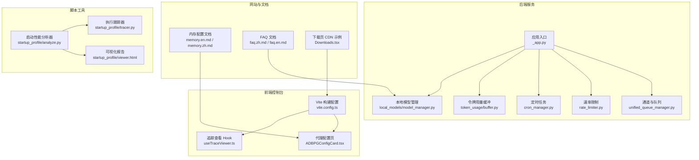
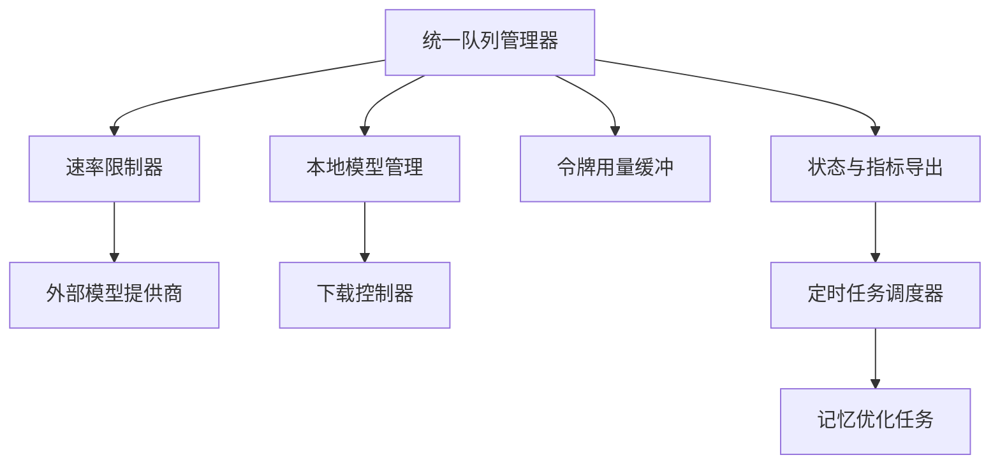
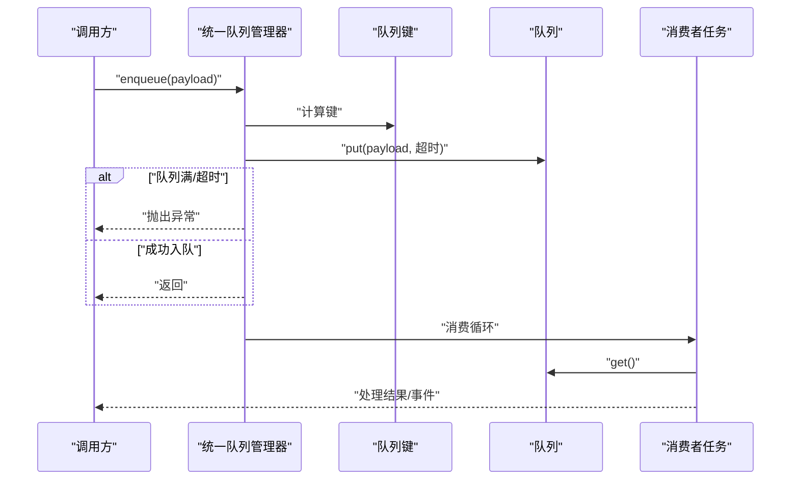
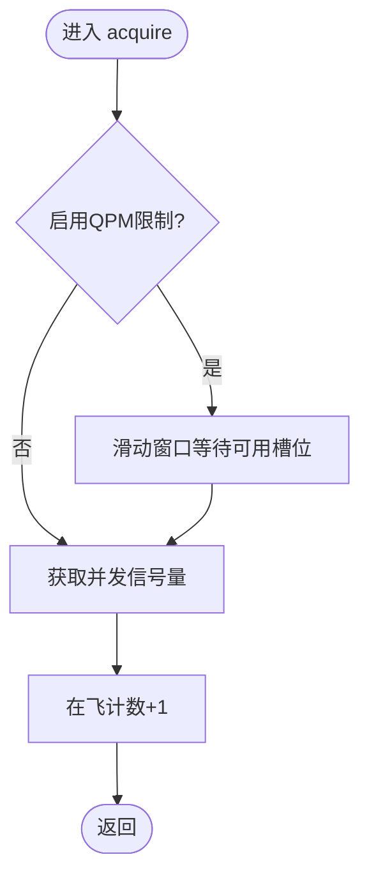
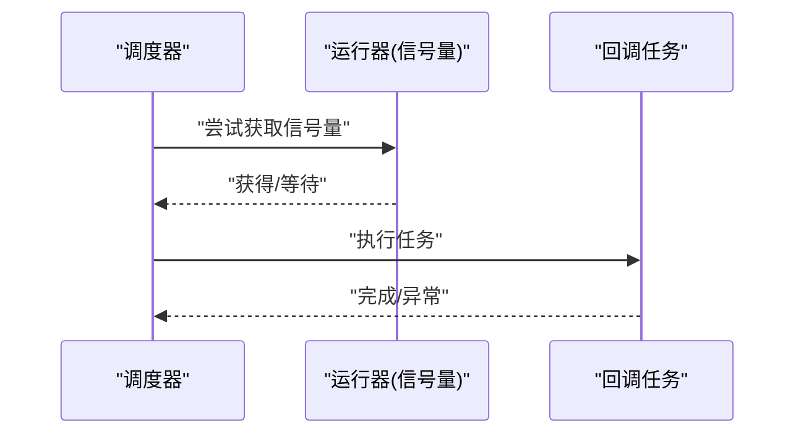
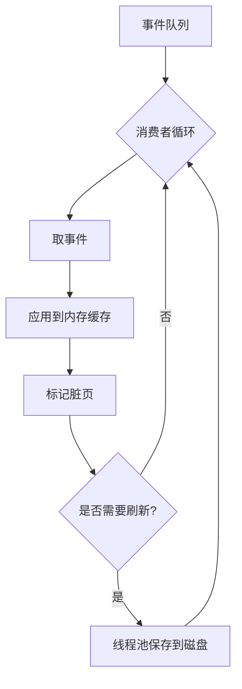
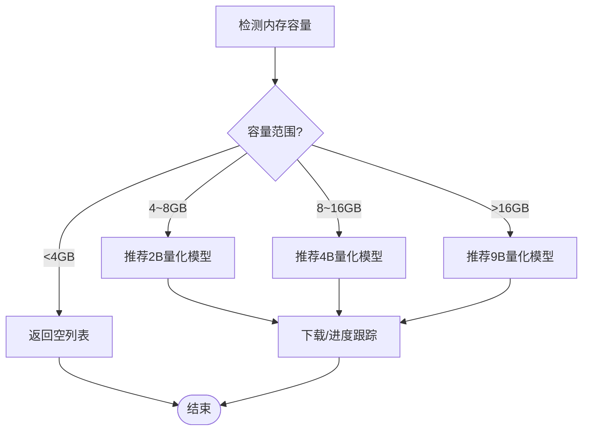
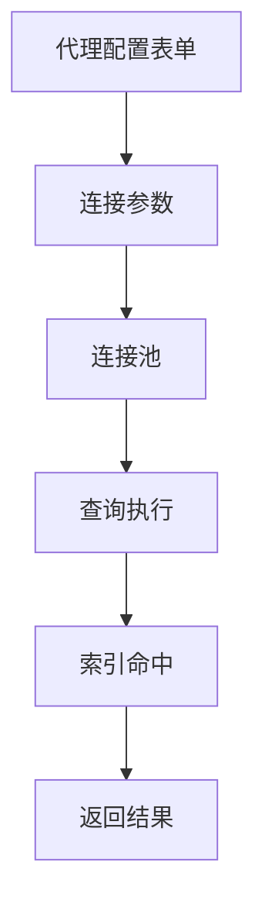
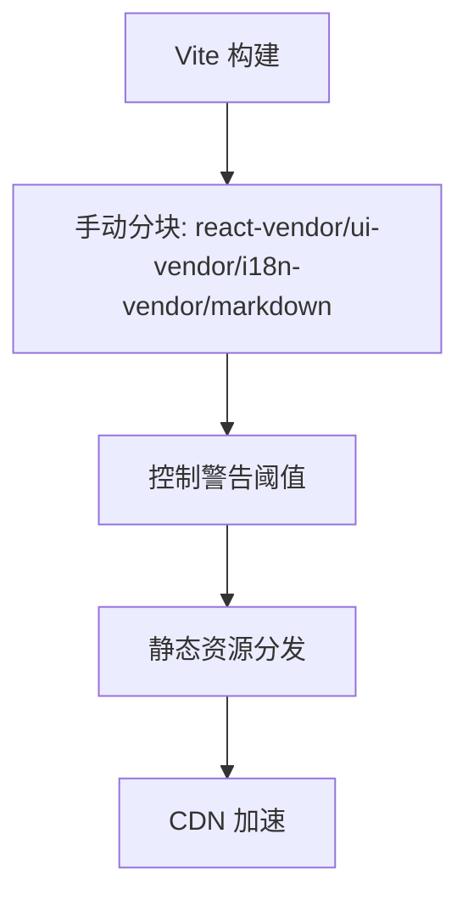
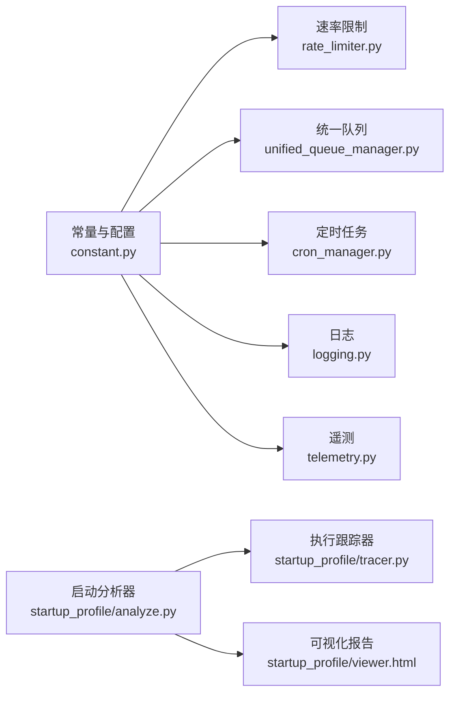

# 性能优化

<cite>
**本文引用的文件**
- [src/qwenpaw/constant.py](file://src/qwenpaw/constant.py)
- [src/qwenpaw/utils/telemetry.py](file://src/qwenpaw/utils/telemetry.py)
- [src/qwenpaw/utils/logging.py](file://src/qwenpaw/utils/logging.py)
- [src/qwenpaw/providers/rate_limiter.py](file://src/qwenpaw/providers/rate_limiter.py)
- [src/qwenpaw/app/channels/unified_queue_manager.py](file://src/qwenpaw/app/channels/unified_queue_manager.py)
- [src/qwenpaw/app/crons/manager.py](file://src/qwenpaw/app/crons/manager.py)
- [src/qwenpaw/token_usage/buffer.py](file://src/qwenpaw/token_usage/buffer.py)
- [src/qwenpaw/local_models/model_manager.py](file://src/qwenpaw/local_models/model_manager.py)
- [src/qwenpaw/app/routers/local_models.py](file://src/qwenpaw/app/routers/local_models.py)
- [console/src/pages/Agent/Config/components/ADBPGConfigCard.tsx](file://console/src/pages/Agent/Config/components/ADBPGConfigCard.tsx)
- [website/public/docs/memory.en.md](file://website/public/docs/memory.en.md)
- [website/public/docs/memory.zh.md](file://website/public/docs/memory.zh.md)
- [website/public/docs/faq.zh.md](file://website/public/docs/faq.zh.md)
- [website/public/docs/faq.en.md](file://website/public/docs/faq.en.md)
- [scripts/startup_profile/analyze.py](file://scripts/startup_profile/analyze.py)
- [scripts/startup_profile/tracer.py](file://scripts/startup_profile/tracer.py)
- [scripts/startup_profile/viewer.html](file://scripts/startup_profile/viewer.html)
- [console/vite.config.ts](file://console/vite.config.ts)
- [website/src/pages/Downloads.tsx](file://website/src/pages/Downloads.tsx)
- [src/qwenpaw/cli/providers_cmd.py](file://src/qwenpaw/cli/providers_cmd.py)
- [src/qwenpaw/app/inbox_trace_store.py](file://src/qwenpaw/app/inbox_trace_store.py)
- [console/src/pages/Inbox/hooks/useTraceViewer.ts](file://console/src/pages/Inbox/hooks/useTraceViewer.ts)
</cite>

## 目录
1. [简介](#简介)
2. [项目结构](#项目结构)
3. [核心组件](#核心组件)
4. [架构总览](#架构总览)
5. [详细组件分析](#详细组件分析)
6. [依赖关系分析](#依赖关系分析)
7. [性能考量与优化策略](#性能考量与优化策略)
8. [故障排查指南](#故障排查指南)
9. [结论](#结论)
10. [附录](#附录)

## 简介
本指南面向QwenPaw系统的性能优化实践，聚焦于CPU、内存、磁盘与网络四类关键指标的识别与分析；覆盖代理并发处理、缓存与资源调度策略；提供模型推理优化（量化、剪枝、蒸馏）参考；解释数据库查询优化、索引与连接池配置要点；并给出前端性能优化（打包分块、静态资源压缩与CDN）与性能测试、基准测试及容量规划的实施建议。

## 项目结构
QwenPaw由Python后端服务、React控制台前端、网站文档与脚本工具组成。后端以异步并发为核心，结合速率限制、队列管理、内存与磁盘缓存、本地模型下载与推理支持；前端通过Vite进行模块拆分与代码分割；网站文档提供内存与FAQ等性能相关配置参考；脚本工具提供启动性能分析与可视化报告。

**图表来源**
- [src/qwenpaw/app/_app.py](file://src/qwenpaw/app/_app.py)
- [src/qwenpaw/app/channels/unified_queue_manager.py](file://src/qwenpaw/app/channels/unified_queue_manager.py)
- [src/qwenpaw/providers/rate_limiter.py](file://src/qwenpaw/providers/rate_limiter.py)
- [src/qwenpaw/app/crons/manager.py](file://src/qwenpaw/app/crons/manager.py)
- [src/qwenpaw/token_usage/buffer.py](file://src/qwenpaw/token_usage/buffer.py)
- [src/qwenpaw/local_models/model_manager.py](file://src/qwenpaw/local_models/model_manager.py)
- [console/vite.config.ts](file://console/vite.config.ts)
- [console/src/pages/Agent/Config/components/ADBPGConfigCard.tsx](file://console/src/pages/Agent/Config/components/ADBPGConfigCard.tsx)
- [console/src/pages/Inbox/hooks/useTraceViewer.ts](file://console/src/pages/Inbox/hooks/useTraceViewer.ts)
- [website/public/docs/memory.en.md](file://website/public/docs/memory.en.md)
- [website/public/docs/memory.zh.md](file://website/public/docs/memory.zh.md)
- [website/public/docs/faq.zh.md](file://website/public/docs/faq.zh.md)
- [website/public/docs/faq.en.md](file://website/public/docs/faq.en.md)
- [website/src/pages/Downloads.tsx](file://website/src/pages/Downloads.tsx)
- [scripts/startup_profile/analyze.py](file://scripts/startup_profile/analyze.py)
- [scripts/startup_profile/tracer.py](file://scripts/startup_profile/tracer.py)
- [scripts/startup_profile/viewer.html](file://scripts/startup_profile/viewer.html)

**章节来源**
- [src/qwenpaw/constant.py](file://src/qwenpaw/constant.py)
- [console/vite.config.ts](file://console/vite.config.ts)

## 核心组件
- 异步并发与队列：统一队列管理器按通道/会话/优先级维护队列与消费者，支持空闲清理与指标导出，避免阻塞与资源浪费。
- 速率限制：基于并发信号量与QPM滑动窗口的双层限流，主动规避上游429，降低等待与重试成本。
- 定时任务：心跳与“梦境”记忆优化等周期性任务，通过调度器与并发控制保障稳定执行。
- 缓存与落盘：令牌用量缓冲采用队列消费+磁盘快照，减少频繁IO与竞争。
- 本地模型：根据机器内存推荐模型，支持下载进度跟踪与取消，降低推理延迟与资源占用。
- 日志与遥测：安全旋转日志与轻量遥测上传，便于定位性能瓶颈与评估环境特征。
- 前端构建：Vite按依赖拆分vendor包，控制chunk大小与警告阈值，提升首屏与增量加载性能。

**章节来源**
- [src/qwenpaw/app/channels/unified_queue_manager.py](file://src/qwenpaw/app/channels/unified_queue_manager.py)
- [src/qwenpaw/providers/rate_limiter.py](file://src/qwenpaw/providers/rate_limiter.py)
- [src/qwenpaw/app/crons/manager.py](file://src/qwenpaw/app/crons/manager.py)
- [src/qwenpaw/token_usage/buffer.py](file://src/qwenpaw/token_usage/buffer.py)
- [src/qwenpaw/local_models/model_manager.py](file://src/qwenpaw/local_models/model_manager.py)
- [src/qwenpaw/utils/logging.py](file://src/qwenpaw/utils/logging.py)
- [src/qwenpaw/utils/telemetry.py](file://src/qwenpaw/utils/telemetry.py)
- [console/vite.config.ts](file://console/vite.config.ts)

## 架构总览
下图展示后端关键子系统之间的交互关系与数据流，强调并发控制、限流与队列在整体性能中的作用。

**图表来源**
- [src/qwenpaw/app/channels/unified_queue_manager.py](file://src/qwenpaw/app/channels/unified_queue_manager.py)
- [src/qwenpaw/providers/rate_limiter.py](file://src/qwenpaw/providers/rate_limiter.py)
- [src/qwenpaw/app/crons/manager.py](file://src/qwenpaw/app/crons/manager.py)
- [src/qwenpaw/token_usage/buffer.py](file://src/qwenpaw/token_usage/buffer.py)
- [src/qwenpaw/local_models/model_manager.py](file://src/qwenpaw/local_models/model_manager.py)

## 详细组件分析

### 组件A：统一队列管理器（并发与资源调度）
- 功能要点
  - 按(channel_id, session_id, priority_level)键创建队列与消费者任务，支持动态创建与空闲清理。
  - 入队设置超时，避免无限阻塞；出队消费循环，事件落盘或处理。
  - 提供指标接口，统计队列总数、每个队列的长度、处理计数、存活与空闲时长。
- 性能影响
  - 通过有界队列与超时控制，防止内存膨胀与请求堆积。
  - 消费者任务独立，避免单点阻塞；空闲清理释放无用资源。
- 优化建议
  - 根据业务峰值调整队列最大长度与空闲超时。
  - 对高优先级会话设置独立队列，降低尾延迟。
  - 结合速率限制器，控制每通道并发与QPM，避免下游过载。

**图表来源**
- [src/qwenpaw/app/channels/unified_queue_manager.py](file://src/qwenpaw/app/channels/unified_queue_manager.py)

**章节来源**
- [src/qwenpaw/app/channels/unified_queue_manager.py](file://src/qwenpaw/app/channels/unified_queue_manager.py)

### 组件B：速率限制器（并发与QPM控制）
- 功能要点
  - 并发信号量限制同时请求数。
  - QPM滑动窗口记录最近60秒请求时间戳，超过上限则等待。
  - 支持暂停与抖动，避免多个等待者同时唤醒引发新突发。
- 性能影响
  - 主动节流，减少429错误与重试开销。
  - 通过暂停与抖动平滑流量，降低下游瞬时压力。
- 优化建议
  - 根据上游配额与平均响应时间设置max_concurrent与max_qpm。
  - 对不同提供商区分限流参数，避免“全局一刀切”。

**图表来源**
- [src/qwenpaw/providers/rate_limiter.py](file://src/qwenpaw/providers/rate_limiter.py)

**章节来源**
- [src/qwenpaw/providers/rate_limiter.py](file://src/qwenpaw/providers/rate_limiter.py)

### 组件C：定时任务与内存优化（资源调度）
- 功能要点
  - 心跳与“梦境”记忆优化任务按配置周期调度，使用信号量控制并发。
  - 回调函数内执行具体任务，异常捕获与日志记录。
- 性能影响
  - 定时任务避免阻塞主流程；并发控制防止任务叠加导致资源争用。
- 优化建议
  - 将耗时任务拆分为多步，必要时异步化；合理设置触发间隔。

**图表来源**
- [src/qwenpaw/app/crons/manager.py](file://src/qwenpaw/app/crons/manager.py)

**章节来源**
- [src/qwenpaw/app/crons/manager.py](file://src/qwenpaw/app/crons/manager.py)

### 组件D：令牌用量缓冲（缓存与落盘）
- 功能要点
  - 消费者循环从队列取事件，应用到内存缓存并标记脏页。
  - 触发条件写回磁盘，使用线程池执行同步保存，降低事件处理延迟。
- 性能影响
  - 队列解耦生产与落盘，避免高频IO阻塞事件循环。
- 优化建议
  - 调整刷新频率与批量大小，平衡吞吐与一致性。

**图表来源**
- [src/qwenpaw/token_usage/buffer.py](file://src/qwenpaw/token_usage/buffer.py)

**章节来源**
- [src/qwenpaw/token_usage/buffer.py](file://src/qwenpaw/token_usage/buffer.py)

### 组件E：本地模型管理（推理优化与下载）
- 功能要点
  - 根据可用内存推荐模型，避免小内存设备占用过多资源。
  - 下载进度跟踪与取消，CLI命令支持下载与查询进度。
- 性能影响
  - 选择合适模型可显著降低推理延迟与内存占用。
- 优化建议
  - 结合量化参数与硬件特性选择模型；在控制台提供可视化推荐。

**图表来源**
- [src/qwenpaw/local_models/model_manager.py](file://src/qwenpaw/local_models/model_manager.py)
- [src/qwenpaw/app/routers/local_models.py](file://src/qwenpaw/app/routers/local_models.py)
- [src/qwenpaw/cli/providers_cmd.py](file://src/qwenpaw/cli/providers_cmd.py)

**章节来源**
- [src/qwenpaw/local_models/model_manager.py](file://src/qwenpaw/local_models/model_manager.py)
- [src/qwenpaw/app/routers/local_models.py](file://src/qwenpaw/app/routers/local_models.py)
- [src/qwenpaw/cli/providers_cmd.py](file://src/qwenpaw/cli/providers_cmd.py)

### 组件F：数据库连接与内存配置（查询优化与连接池）
- 功能要点
  - 控制台表单提供数据库连接参数（主机、端口、用户、密码、库名），便于接入ApsaraDB PG。
  - 文档定义了搜索超时、最小/最大连接数等配置项，指导连接池与查询优化。
- 性能影响
  - 连接池大小直接影响并发查询能力与资源占用。
  - 查询超时与索引设计决定响应时间与吞吐。
- 优化建议
  - 根据QPM与并发查询数设置min/max连接数；开启连接复用与健康检查。
  - 为高频查询字段建立索引，避免全表扫描；使用EXPLAIN分析慢查询。

**图表来源**
- [console/src/pages/Agent/Config/components/ADBPGConfigCard.tsx](file://console/src/pages/Agent/Config/components/ADBPGConfigCard.tsx)
- [website/public/docs/memory.en.md](file://website/public/docs/memory.en.md)
- [website/public/docs/memory.zh.md](file://website/public/docs/memory.zh.md)

**章节来源**
- [console/src/pages/Agent/Config/components/ADBPGConfigCard.tsx](file://console/src/pages/Agent/Config/components/ADBPGConfigCard.tsx)
- [website/public/docs/memory.en.md](file://website/public/docs/memory.en.md)
- [website/public/docs/memory.zh.md](file://website/public/docs/memory.zh.md)

### 组件G：前端性能（打包、分块与CDN）
- 功能要点
  - Vite配置按依赖拆分vendor包，控制chunk大小与警告阈值，提升缓存命中与加载速度。
  - 下载页示例展示从CDN拉取索引与资源，减少主站负载。
- 性能影响
  - 合理的代码分割与缓存策略显著改善首屏与二次访问性能。
- 优化建议
  - 对第三方UI库与框架单独分块；开启压缩与预加载关键资源；CDN就近部署与缓存策略。

**图表来源**
- [console/vite.config.ts](file://console/vite.config.ts)
- [website/src/pages/Downloads.tsx](file://website/src/pages/Downloads.tsx)

**章节来源**
- [console/vite.config.ts](file://console/vite.config.ts)
- [website/src/pages/Downloads.tsx](file://website/src/pages/Downloads.tsx)

## 依赖关系分析
- 环境变量与配置
  - 通过常量模块集中定义日志级别、并发与QPM上限、重试与退避参数等，便于统一调优。
- 日志与遥测
  - 安全轮转日志避免文件锁冲突；遥测上传失败静默，不影响安装流程。
- 启动性能分析
  - 分析器采集import时间与执行轨迹，生成JSON并可视化，辅助定位启动瓶颈。

**图表来源**
- [src/qwenpaw/constant.py](file://src/qwenpaw/constant.py)
- [src/qwenpaw/providers/rate_limiter.py](file://src/qwenpaw/providers/rate_limiter.py)
- [src/qwenpaw/app/channels/unified_queue_manager.py](file://src/qwenpaw/app/channels/unified_queue_manager.py)
- [src/qwenpaw/app/crons/manager.py](file://src/qwenpaw/app/crons/manager.py)
- [src/qwenpaw/utils/logging.py](file://src/qwenpaw/utils/logging.py)
- [src/qwenpaw/utils/telemetry.py](file://src/qwenpaw/utils/telemetry.py)
- [scripts/startup_profile/analyze.py](file://scripts/startup_profile/analyze.py)
- [scripts/startup_profile/tracer.py](file://scripts/startup_profile/tracer.py)
- [scripts/startup_profile/viewer.html](file://scripts/startup_profile/viewer.html)

**章节来源**
- [src/qwenpaw/constant.py](file://src/qwenpaw/constant.py)
- [src/qwenpaw/utils/logging.py](file://src/qwenpaw/utils/logging.py)
- [src/qwenpaw/utils/telemetry.py](file://src/qwenpaw/utils/telemetry.py)
- [scripts/startup_profile/analyze.py](file://scripts/startup_profile/analyze.py)
- [scripts/startup_profile/tracer.py](file://scripts/startup_profile/tracer.py)
- [scripts/startup_profile/viewer.html](file://scripts/startup_profile/viewer.html)

## 性能考量与优化策略

### CPU性能
- 识别方法
  - 使用启动性能分析器采集import耗时与函数执行轨迹，定位CPU热点模块与调用链。
  - 结合队列与速率限制器的并发参数，观察CPU利用率与等待时间。
- 优化策略
  - 合理设置LLM并发与QPM上限，避免CPU过载与上下文切换开销。
  - 对热点函数进行缓存与批处理，减少重复计算。

**章节来源**
- [scripts/startup_profile/analyze.py](file://scripts/startup_profile/analyze.py)
- [scripts/startup_profile/tracer.py](file://scripts/startup_profile/tracer.py)
- [scripts/startup_profile/viewer.html](file://scripts/startup_profile/viewer.html)
- [src/qwenpaw/constant.py](file://src/qwenpaw/constant.py)

### 内存性能
- 识别方法
  - 通过本地模型管理器的内存检测与推荐逻辑，评估当前设备容量与可用内存。
  - 关注队列与消费者任务的内存占用，避免堆积导致OOM。
- 优化策略
  - 根据内存容量选择合适模型；对大模型采用量化参数（如Q4_K_M/Q8_0）。
  - 控制队列长度与空闲清理阈值，及时回收无用资源。

**章节来源**
- [src/qwenpaw/local_models/model_manager.py](file://src/qwenpaw/local_models/model_manager.py)
- [website/public/docs/faq.zh.md](file://website/public/docs/faq.zh.md)
- [website/public/docs/faq.en.md](file://website/public/docs/faq.en.md)
- [src/qwenpaw/app/channels/unified_queue_manager.py](file://src/qwenpaw/app/channels/unified_queue_manager.py)

### 磁盘性能
- 识别方法
  - 令牌用量缓冲的脏页标记与定期刷新，关注IO延迟与写放大。
  - 下载任务的临时目录与最终模型目录，避免跨盘符写入。
- 优化策略
  - 合理设置刷新频率与批量大小；将临时目录与模型目录置于同一磁盘。
  - 对频繁读取的索引与缓存文件启用SSD与合适的文件系统参数。

**章节来源**
- [src/qwenpaw/token_usage/buffer.py](file://src/qwenpaw/token_usage/buffer.py)
- [src/qwenpaw/local_models/model_manager.py](file://src/qwenpaw/local_models/model_manager.py)

### 网络性能
- 识别方法
  - 速率限制器的暂停与抖动参数，反映上游限流与网络RTT。
  - CDN拉取索引与资源，观察带宽与延迟。
- 优化策略
  - 为不同提供商设置差异化QPM与并发上限；启用CDN就近加速。
  - 对下载任务使用断点续传与多段并行（若后端支持）。

**章节来源**
- [src/qwenpaw/providers/rate_limiter.py](file://src/qwenpaw/providers/rate_limiter.py)
- [website/src/pages/Downloads.tsx](file://website/src/pages/Downloads.tsx)

### 代理性能优化
- 并发处理
  - 使用统一队列管理器的信号量与超时控制，避免请求堆积与阻塞。
  - 对高优先级会话与通道设置独立队列，降低尾延迟。
- 缓存机制
  - 令牌用量缓冲与本地模型进度缓存，减少重复IO与网络请求。
- 资源调度
  - 定时任务与心跳按配置调度，避免与高峰时段冲突。

**章节来源**
- [src/qwenpaw/app/channels/unified_queue_manager.py](file://src/qwenpaw/app/channels/unified_queue_manager.py)
- [src/qwenpaw/token_usage/buffer.py](file://src/qwenpaw/token_usage/buffer.py)
- [src/qwenpaw/app/crons/manager.py](file://src/qwenpaw/app/crons/manager.py)

### 模型推理优化
- 量化
  - 依据设备内存选择Q4_K_M/Q8_0等量化模型，降低显存与带宽占用。
- 剪枝与蒸馏
  - 在训练/微调阶段进行稀疏化与知识蒸馏，减少参数规模与计算量（参考文档与FAQ）。

**章节来源**
- [website/public/docs/faq.zh.md](file://website/public/docs/faq.zh.md)
- [website/public/docs/faq.en.md](file://website/public/docs/faq.en.md)

### 数据库查询优化与连接池
- 查询优化
  - 为高频字段建立索引；使用EXPLAIN分析慢查询；避免SELECT *与复杂JOIN。
- 索引设计
  - 结合业务查询模式设计复合索引；定期统计信息更新。
- 连接池配置
  - 参考文档中的pool_minconn/pool_maxconn与search_timeout，按QPM与并发查询数调优。

**章节来源**
- [console/src/pages/Agent/Config/components/ADBPGConfigCard.tsx](file://console/src/pages/Agent/Config/components/ADBPGConfigCard.tsx)
- [website/public/docs/memory.en.md](file://website/public/docs/memory.en.md)
- [website/public/docs/memory.zh.md](file://website/public/docs/memory.zh.md)

### 前端性能优化
- 打包与分块
  - 按依赖拆分vendor包，控制chunk大小与警告阈值，提升缓存命中。
- 静态资源压缩
  - 开启压缩与预加载关键资源，减少传输体积。
- CDN配置
  - 下载页示例展示从CDN拉取索引与资源，建议就近部署与缓存策略。

**章节来源**
- [console/vite.config.ts](file://console/vite.config.ts)
- [website/src/pages/Downloads.tsx](file://website/src/pages/Downloads.tsx)

### 性能测试、基准测试与容量规划
- 性能测试
  - 使用启动性能分析器生成import与执行轨迹报告，定位瓶颈模块。
- 基准测试
  - 建立端到端场景（消息入队、处理、落盘、查询），记录P95/P99延迟与吞吐。
- 容量规划
  - 基于QPM与并发参数，结合队列长度与空闲清理阈值，估算峰值资源需求。

**章节来源**
- [scripts/startup_profile/analyze.py](file://scripts/startup_profile/analyze.py)
- [scripts/startup_profile/tracer.py](file://scripts/startup_profile/tracer.py)
- [scripts/startup_profile/viewer.html](file://scripts/startup_profile/viewer.html)

## 故障排查指南
- 日志与遥测
  - 使用安全轮转日志定位异常；遥测上传失败静默，不影响安装流程。
- 队列异常
  - 关注入队超时与队列积压，检查并发与QPM配置；必要时增加消费者或调整阈值。
- 速率限制
  - 若频繁等待，检查QPM与并发上限；确认抖动与暂停参数是否合理。
- 令牌用量缓冲
  - 若落盘延迟高，检查刷新频率与磁盘IO；必要时降低刷新频率或提高批量大小。
- 本地模型下载
  - 若下载卡顿，检查网络与存储；使用CLI查询进度与取消任务。

**章节来源**
- [src/qwenpaw/utils/logging.py](file://src/qwenpaw/utils/logging.py)
- [src/qwenpaw/utils/telemetry.py](file://src/qwenpaw/utils/telemetry.py)
- [src/qwenpaw/app/channels/unified_queue_manager.py](file://src/qwenpaw/app/channels/unified_queue_manager.py)
- [src/qwenpaw/providers/rate_limiter.py](file://src/qwenpaw/providers/rate_limiter.py)
- [src/qwenpaw/token_usage/buffer.py](file://src/qwenpaw/token_usage/buffer.py)
- [src/qwenpaw/local_models/model_manager.py](file://src/qwenpaw/local_models/model_manager.py)

## 结论
通过对并发、限流、队列、缓存、模型与数据库等关键环节的系统性优化，QwenPaw可在多场景下实现更稳定的性能表现。建议以启动性能分析为起点，结合日志与遥测持续观测，并以容量规划与基准测试驱动迭代优化。

## 附录
- 相关文档与FAQ提供了模型量化、连接池配置与内存优化的参考示例，便于快速落地。

**章节来源**
- [website/public/docs/memory.en.md](file://website/public/docs/memory.en.md)
- [website/public/docs/memory.zh.md](file://website/public/docs/memory.zh.md)
- [website/public/docs/faq.zh.md](file://website/public/docs/faq.zh.md)
- [website/public/docs/faq.en.md](file://website/public/docs/faq.en.md)