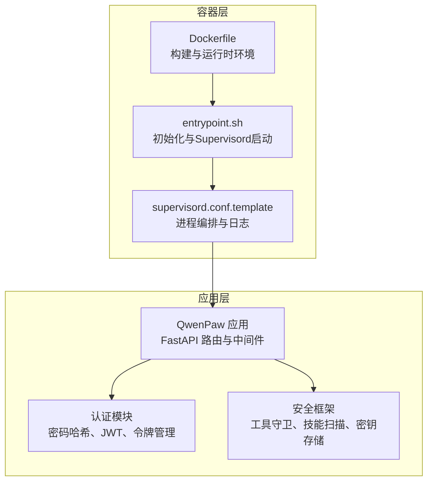
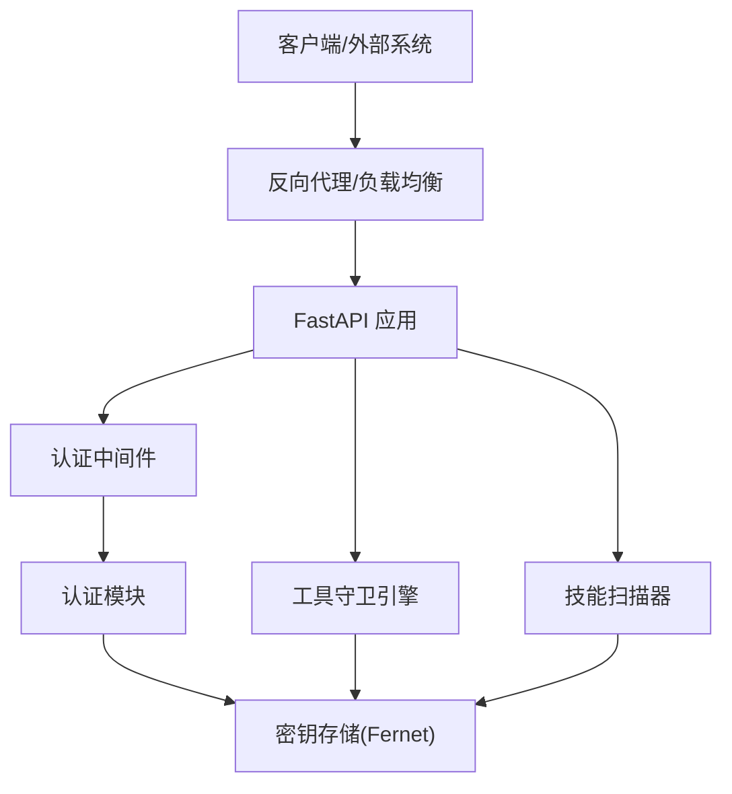
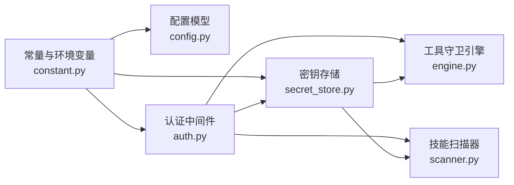

# 生产环境加固

<cite>
**本文引用的文件**
- [SECURITY.md](file://SECURITY.md)
- [Dockerfile](file://deploy/Dockerfile)
- [supervisord.conf.template](file://deploy/config/supervisord.conf.template)
- [entrypoint.sh](file://deploy/entrypoint.sh)
- [auth.py](file://src/qwenpaw/app/auth.py)
- [secret_store.py](file://src/qwenpaw/security/secret_store.py)
- [engine.py](file://src/qwenpaw/security/tool_guard/engine.py)
- [scanner.py](file://src/qwenpaw/security/skill_scanner/scanner.py)
- [default_policy.yaml](file://src/qwenpaw/security/skill_scanner/data/default_policy.yaml)
- [dangerous_shell_commands.yaml](file://src/qwenpaw/security/tool_guard/rules/dangerous_shell_commands.yaml)
- [config.py](file://src/qwenpaw/config/config.py)
- [constant.py](file://src/qwenpaw/constant.py)
- [docker-compose.yml](file://docker-compose.yml)
</cite>

## 目录
1. [引言](#引言)
2. [项目结构](#项目结构)
3. [核心组件](#核心组件)
4. [架构总览](#架构总览)
5. [详细组件分析](#详细组件分析)
6. [依赖关系分析](#依赖关系分析)
7. [性能考量](#性能考量)
8. [故障排查指南](#故障排查指南)
9. [结论](#结论)
10. [附录](#附录)

## 引言
本指南面向在生产环境中部署与运行 QwenPaw 的工程团队，聚焦容器安全、用户权限与文件系统权限、网络安全与访问控制、应用安全（认证授权、会话管理、敏感信息保护）、数据加密与密钥管理、安全传输、漏洞扫描与安全审计、合规检查以及安全事件响应与恢复策略。文档基于仓库中现有实现进行提炼，并给出可操作的加固建议与最佳实践。

## 项目结构
下图展示生产部署相关的关键文件与职责边界，帮助理解从容器镜像到运行时服务、再到安全机制的整体布局。

**图表来源**
- [Dockerfile:1-105](file://deploy/Dockerfile#L1-L105)
- [entrypoint.sh:1-21](file://deploy/entrypoint.sh#L1-L21)
- [supervisord.conf.template:1-40](file://deploy/config/supervisord.conf.template#L1-L40)
- [auth.py:1-641](file://src/qwenpaw/app/auth.py#L1-L641)
- [secret_store.py:1-414](file://src/qwenpaw/security/secret_store.py#L1-L414)
- [engine.py:1-269](file://src/qwenpaw/security/tool_guard/engine.py#L1-L269)
- [scanner.py:1-319](file://src/qwenpaw/security/skill_scanner/scanner.py#L1-L319)

**章节来源**
- [Dockerfile:1-105](file://deploy/Dockerfile#L1-L105)
- [entrypoint.sh:1-21](file://deploy/entrypoint.sh#L1-L21)
- [supervisord.conf.template:1-40](file://deploy/config/supervisord.conf.template#L1-L40)

## 核心组件
- 容器与运行时：使用多阶段构建与最小化运行时基础镜像；通过 Supervisord 管理应用主进程与桌面虚拟化依赖；入口脚本负责首次初始化与模板替换。
- 认证与会话：单用户注册、密码哈希（盐值 SHA-256）、HMAC-SHA256 签名的 JWT、令牌撤销清单与过期清理。
- 密钥与敏感信息：Fernet 对称加密（AES-128-CBC + HMAC-SHA256），主密钥优先存放在 OS Keychain，回退到只读机密目录中的文件。
- 工具调用防护：规则驱动的工具守卫引擎，对危险命令模式进行检测与阻断或审批流程触发。
- 技能包安全扫描：静态扫描技能目录，识别潜在高危签名与路径越界风险。
- 配置与常量：统一的环境变量加载器与工作目录、密钥目录、备份目录等路径解析。

**章节来源**
- [auth.py:1-641](file://src/qwenpaw/app/auth.py#L1-L641)
- [secret_store.py:1-414](file://src/qwenpaw/security/secret_store.py#L1-L414)
- [engine.py:1-269](file://src/qwenpaw/security/tool_guard/engine.py#L1-L269)
- [scanner.py:1-319](file://src/qwenpaw/security/skill_scanner/scanner.py#L1-L319)
- [constant.py:1-368](file://src/qwenpaw/constant.py#L1-L368)

## 架构总览
下图展示生产环境加固视角下的关键交互：容器层提供隔离与最小权限，应用层通过认证中间件与安全框架实现访问控制与数据保护，Supervisord 负责进程生命周期与日志聚合。

**图表来源**
- [auth.py:567-641](file://src/qwenpaw/app/auth.py#L567-L641)
- [engine.py:54-269](file://src/qwenpaw/security/tool_guard/engine.py#L54-L269)
- [scanner.py:76-319](file://src/qwenpaw/security/skill_scanner/scanner.py#L76-L319)
- [secret_store.py:279-322](file://src/qwenpaw/security/secret_store.py#L279-L322)

## 详细组件分析

### 容器安全配置
- 基础镜像与多阶段构建：前端构建与应用打包分离，减少攻击面。
- 运行时用户与权限：默认以 root 启动（见进程配置），建议在生产中改为非 root 用户并限制能力。
- 文件系统挂载：数据、密钥、备份目录独立卷，避免写入根文件系统；密钥目录权限严格。
- 端口绑定：默认仅本地回环绑定，避免直接暴露公网端口。
- 进程编排：Supervisord 管理应用、Xvfb、XFCE 桌面环境，便于日志集中与健康检查。

加固建议
- 在容器运行参数中指定非 root 用户与只读根文件系统，限制网络与设备能力。
- 使用只读挂载工作目录与密钥目录，仅对备份目录开放必要写权限。
- 在反向代理层启用 TLS 终止与强制 HTTPS。
- 限制容器资源配额，防止资源滥用。

**章节来源**
- [Dockerfile:1-105](file://deploy/Dockerfile#L1-L105)
- [supervisord.conf.template:1-40](file://deploy/config/supervisord.conf.template#L1-L40)
- [entrypoint.sh:1-21](file://deploy/entrypoint.sh#L1-L21)
- [docker-compose.yml:1-26](file://docker-compose.yml#L1-L26)

### 用户权限管理与文件系统权限
- 密钥目录与文件权限：密钥文件采用 0600 权限；父目录按需设置 0700。
- 机密文件写入：认证数据与密钥文件写入时强制最小权限位。
- 工作目录与备份目录：通过环境变量可定制，建议与密钥目录分离并独立挂载。

加固建议
- 将密钥目录与工作目录置于不同卷，密钥目录仅授予运行账户读写权限。
- 在容器启动前校验密钥目录权限，拒绝不安全权限组合。
- 对备份目录开启定期轮换与保留策略，避免无限增长。

**章节来源**
- [secret_store.py:219-227](file://src/qwenpaw/security/secret_store.py#L219-L227)
- [auth.py:244-254](file://src/qwenpaw/app/auth.py#L244-L254)
- [constant.py:102-111](file://src/qwenpaw/constant.py#L102-L111)

### 网络安全配置、防火墙与访问控制
- 端口暴露：默认仅映射到 127.0.0.1:8088，避免公网直连。
- 反向代理：建议在反向代理层启用 TLS、速率限制、CORS 控制与 IP 白名单。
- 允许免认证主机：可通过配置允许特定客户端主机免认证访问，谨慎使用。

加固建议
- 在反向代理层启用强制 HTTPS、HSTS、安全响应头。
- 限制来源 IP 与来源域名，结合速率限制与 WAF。
- 对 /docs、/redoc、/openapi.json 等开发接口在生产关闭。

**章节来源**
- [docker-compose.yml:16-18](file://docker-compose.yml#L16-L18)
- [auth.py:620-627](file://src/qwenpaw/app/auth.py#L620-L627)
- [constant.py:257-261](file://src/qwenpaw/constant.py#L257-L261)

### 应用安全：认证授权、会话管理与敏感信息保护
- 单用户注册：仅允许一个账户注册，忘记密码可通过删除认证文件后重启重注册。
- 密码存储：盐值 SHA-256 哈希，避免明文存储。
- JWT 签名：HMAC-SHA256，支持自定义有效期与永久令牌上限。
- 令牌撤销：基于 jti 的黑名单与过期清理，支持全量轮转。
- 敏感字段透明加解密：对 auth.json 中 jwt_secret 与 provider.json 中 api_key 等字段自动加密。

加固建议
- 默认禁用认证，按需启用并设置强口令策略。
- 限制令牌有效期，启用短期令牌与定期刷新。
- 对认证失败与令牌异常访问记录审计日志。

**章节来源**
- [auth.py:1-641](file://src/qwenpaw/app/auth.py#L1-L641)
- [secret_store.py:376-414](file://src/qwenpaw/security/secret_store.py#L376-L414)

### 数据加密、密钥管理与安全传输
- 加密算法：Fernet（AES-128-CBC + HMAC-SHA256）。
- 主密钥来源：优先 OS Keychain（如可用），回退到密钥目录文件（0600）。
- 双重缓存：进程内缓存与延迟加载，避免重复 IO。
- 自动迁移：检测明文并透明重加密。

加固建议
- 在容器环境中确保 OS Keychain 可用或明确回退策略。
- 备份恢复后显式重载主密钥，保证密钥一致性。
- 对传输通道启用 TLS，避免明文传输。

**章节来源**
- [secret_store.py:1-414](file://src/qwenpaw/security/secret_store.py#L1-L414)

### 工具调用与技能包安全
- 工具守卫：规则驱动的守护进程，覆盖破坏性命令、权限提升、网络隧道、混淆规避等场景。
- 技能扫描：静态扫描技能包，识别硬编码凭证、供应链风险、路径越界等。

加固建议
- 默认启用工具守卫与技能扫描，结合组织策略定制规则集。
- 对高危工具（如执行系统命令）强制审批流程。
- 定期更新规则库与扫描策略。

**章节来源**
- [engine.py:1-269](file://src/qwenpaw/security/tool_guard/engine.py#L1-L269)
- [scanner.py:1-319](file://src/qwenpaw/security/skill_scanner/scanner.py#L1-L319)
- [dangerous_shell_commands.yaml:1-310](file://src/qwenpaw/security/tool_guard/rules/dangerous_shell_commands.yaml#L1-L310)
- [default_policy.yaml:1-243](file://src/qwenpaw/security/skill_scanner/data/default_policy.yaml#L1-L243)

### 配置与信任模型
- 环境变量加载：支持 QWENPAW_* 与历史 COPAW_* 兼容键。
- 目录约定：工作目录、密钥目录、备份目录、插件目录等。
- 安全信任模型：单操作者边界、共享实例的已知用户信任、通道与用户白名单、最小权限与沙箱。

加固建议
- 严格区分生产与开发环境变量，避免误用。
- 定期审查配置与技能，移除不再使用的组件。

**章节来源**
- [constant.py:1-368](file://src/qwenpaw/constant.py#L1-L368)
- [SECURITY.md:65-158](file://SECURITY.md#L65-L158)

## 依赖关系分析
下图展示生产加固相关模块之间的依赖与耦合关系。

**图表来源**
- [constant.py:1-368](file://src/qwenpaw/constant.py#L1-L368)
- [config.py:1-800](file://src/qwenpaw/config/config.py#L1-L800)
- [auth.py:1-641](file://src/qwenpaw/app/auth.py#L1-L641)
- [secret_store.py:1-414](file://src/qwenpaw/security/secret_store.py#L1-L414)
- [engine.py:1-269](file://src/qwenpaw/security/tool_guard/engine.py#L1-L269)
- [scanner.py:1-319](file://src/qwenpaw/security/skill_scanner/scanner.py#L1-L319)

**章节来源**
- [constant.py:1-368](file://src/qwenpaw/constant.py#L1-L368)
- [config.py:1-800](file://src/qwenpaw/config/config.py#L1-L800)

## 性能考量
- 进程与日志：Supervisord 管理多个子进程，注意日志滚动与磁盘占用。
- 加密开销：Fernet 加解密与密钥缓存策略已在实现中优化，建议在高并发场景评估密钥缓存命中率。
- 扫描性能：技能扫描的文件数量与大小阈值可配置，建议在 CI/CD 中提前扫描，避免运行时阻塞。

[本节为通用指导，无需具体文件分析]

## 故障排查指南
常见问题与定位思路
- 认证失败：检查认证中间件是否启用、用户是否存在、令牌是否过期或被撤销。
- 密钥不可用：确认密钥目录权限、主密钥是否存在于 OS Keychain 或文件中，必要时重载主密钥。
- 工具调用被阻断：查看工具守卫结果与规则匹配情况，必要时调整规则或进入审批流程。
- 技能扫描告警：检查扫描策略与规则集，确认是否误报或真实风险。

**章节来源**
- [auth.py:567-641](file://src/qwenpaw/app/auth.py#L567-L641)
- [secret_store.py:329-370](file://src/qwenpaw/security/secret_store.py#L329-L370)
- [engine.py:200-258](file://src/qwenpaw/security/tool_guard/engine.py#L200-L258)
- [scanner.py:148-242](file://src/qwenpaw/security/skill_scanner/scanner.py#L148-L242)

## 结论
通过容器最小化、严格的文件系统权限、完善的认证与会话管理、透明的密钥与敏感信息保护、工具调用与技能包安全扫描，以及规范的网络安全与访问控制，QwenPaw 可在生产环境中达到较高安全基线。建议结合组织合规要求持续完善策略与流程，并建立自动化审计与应急响应机制。

[本节为总结，无需具体文件分析]

## 附录

### 生产部署清单
- 容器运行参数：非 root 用户、只读根文件系统、最小能力集
- 存储卷：工作目录、密钥目录、备份目录独立挂载
- 网络：反向代理启用 TLS、CORS 与来源控制
- 认证：启用认证并设置强口令，合理令牌有效期
- 审计：开启访问日志与错误日志，定期审计

[本节为通用指导，无需具体文件分析]