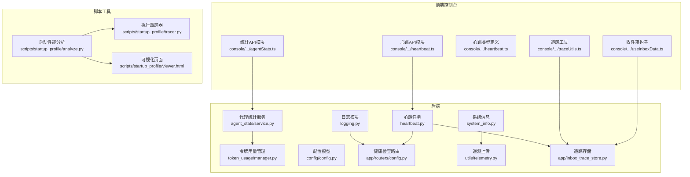
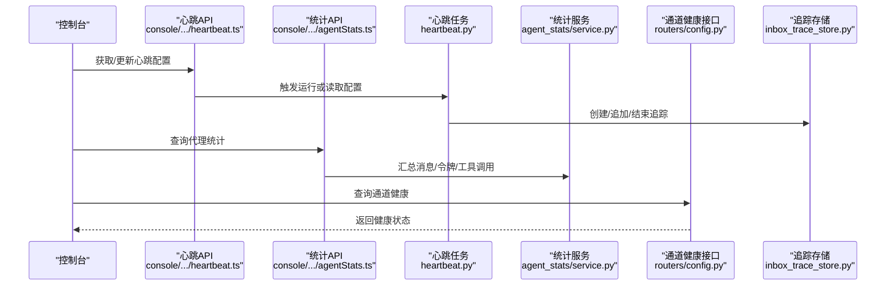
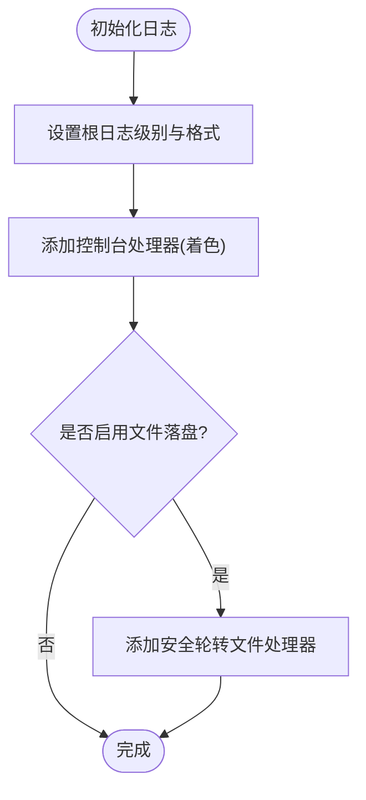
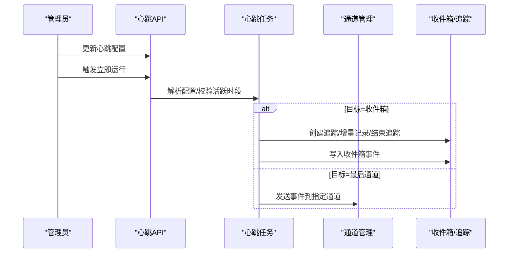
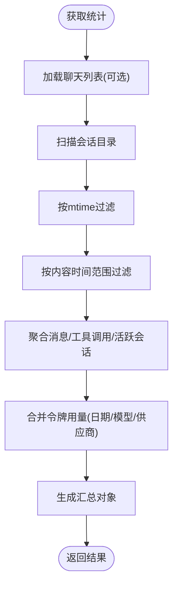
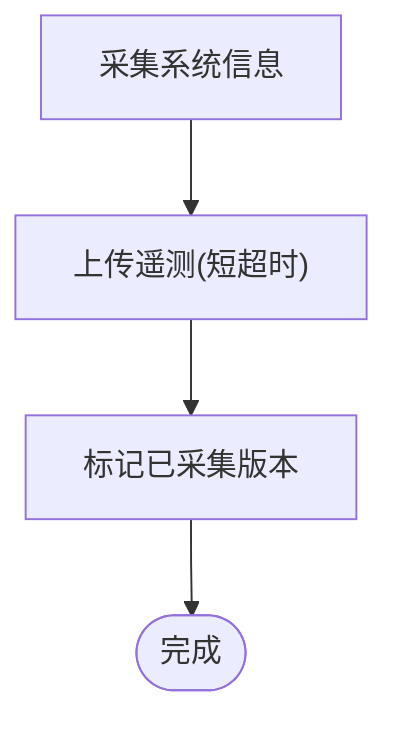
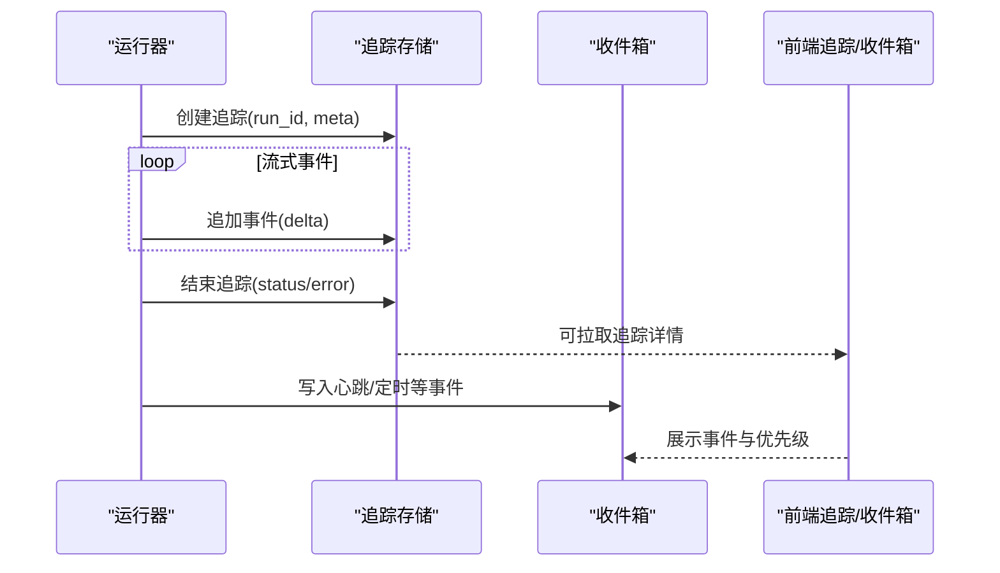
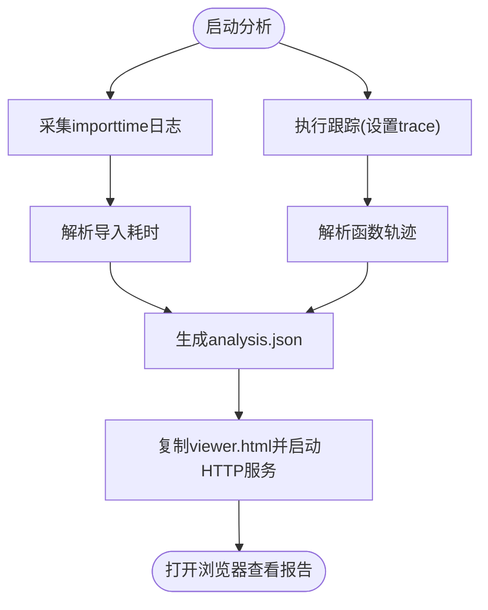
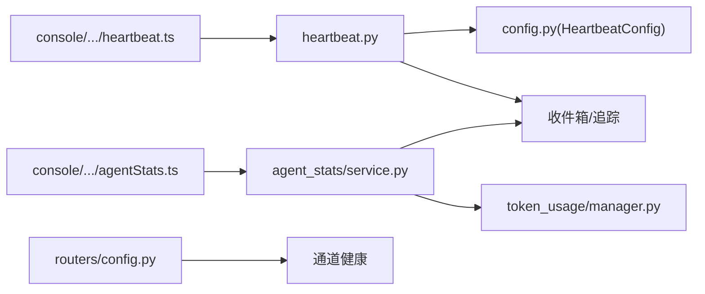

# 监控告警

<cite>
**本文引用的文件**
- [src/qwenpaw/utils/logging.py](file://src/qwenpaw/utils/logging.py)
- [src/qwenpaw/utils/system_info.py](file://src/qwenpaw/utils/system_info.py)
- [src/qwenpaw/app/crons/heartbeat.py](file://src/qwenpaw/app/crons/heartbeat.py)
- [src/qwenpaw/agent_stats/service.py](file://src/qwenpaw/agent_stats/service.py)
- [src/qwenpaw/token_usage/manager.py](file://src/qwenpaw/token_usage/manager.py)
- [src/qwenpaw/config/config.py](file://src/qwenpaw/config/config.py)
- [src/qwenpaw/app/routers/config.py](file://src/qwenpaw/app/routers/config.py)
- [console/src/api/modules/heartbeat.ts](file://console/src/api/modules/heartbeat.ts)
- [console/src/api/modules/agentStats.ts](file://console/src/api/modules/agentStats.ts)
- [console/src/api/types/heartbeat.ts](file://console/src/api/types/heartbeat.ts)
- [src/qwenpaw/utils/telemetry.py](file://src/qwenpaw/utils/telemetry.py)
- [src/qwenpaw/app/inbox_trace_store.py](file://src/qwenpaw/app/inbox_trace_store.py)
- [console/src/pages/Inbox/hooks/useInboxData.ts](file://console/src/pages/Inbox/hooks/useInboxData.ts)
- [console/src/pages/Inbox/utils/traceUtils.ts](file://console/src/pages/Inbox/utils/traceUtils.ts)
- [scripts/startup_profile/analyze.py](file://scripts/startup_profile/analyze.py)
- [scripts/startup_profile/tracer.py](file://scripts/startup_profile/tracer.py)
- [scripts/startup_profile/viewer.html](file://scripts/startup_profile/viewer.html)
- [src/qwenpaw/cli/doctor_connectivity.py](file://src/qwenpaw/cli/doctor_connectivity.py)
</cite>

## 目录
1. [简介](#简介)
2. [项目结构](#项目结构)
3. [核心组件](#核心组件)
4. [架构总览](#架构总览)
5. [详细组件分析](#详细组件分析)
6. [依赖分析](#依赖分析)
7. [性能考虑](#性能考虑)
8. [故障排查指南](#故障排查指南)
9. [结论](#结论)
10. [附录](#附录)

## 简介
本文件面向QwenPaw项目的监控与告警体系，覆盖日志系统架构与轮转策略、性能监控指标采集与展示、健康检查接口与自检机制、告警规则与通知渠道、故障自动恢复流程，以及与Prometheus/Grafana的集成建议、分布式追踪与性能分析、容量规划策略。文档以代码为依据，结合前端控制台API与类型定义，帮助运维与开发人员建立完善的可观测性能力。

## 项目结构
- 后端Python服务负责日志、心跳、统计、令牌用量、系统信息、健康检查、遥测上传等。
- 前端控制台通过API模块对接后端，提供心跳配置、统计查询、事件推送与追踪查看。
- 脚本工具提供启动性能分析与可视化报告，辅助定位性能瓶颈。

图表来源
- [src/qwenpaw/utils/logging.py:1-226](file://src/qwenpaw/utils/logging.py#L1-L226)
- [src/qwenpaw/utils/system_info.py:1-253](file://src/qwenpaw/utils/system_info.py#L1-L253)
- [src/qwenpaw/app/crons/heartbeat.py:1-379](file://src/qwenpaw/app/crons/heartbeat.py#L1-L379)
- [src/qwenpaw/agent_stats/service.py:1-375](file://src/qwenpaw/agent_stats/service.py#L1-L375)
- [src/qwenpaw/token_usage/manager.py:1-285](file://src/qwenpaw/token_usage/manager.py#L1-L285)
- [src/qwenpaw/config/config.py:483-495](file://src/qwenpaw/config/config.py#L483-L495)
- [src/qwenpaw/app/routers/config.py:187-213](file://src/qwenpaw/app/routers/config.py#L187-L213)
- [src/qwenpaw/utils/telemetry.py:1-305](file://src/qwenpaw/utils/telemetry.py#L1-L305)
- [src/qwenpaw/app/inbox_trace_store.py:150-204](file://src/qwenpaw/app/inbox_trace_store.py#L150-L204)
- [console/src/api/modules/heartbeat.ts:1-17](file://console/src/api/modules/heartbeat.ts#L1-L17)
- [console/src/api/modules/agentStats.ts:1-16](file://console/src/api/modules/agentStats.ts#L1-L16)
- [console/src/api/types/heartbeat.ts:1-11](file://console/src/api/types/heartbeat.ts#L1-L11)
- [console/src/pages/Inbox/hooks/useInboxData.ts:40-88](file://console/src/pages/Inbox/hooks/useInboxData.ts#L40-L88)
- [console/src/pages/Inbox/utils/traceUtils.ts:227-269](file://console/src/pages/Inbox/utils/traceUtils.ts#L227-L269)
- [scripts/startup_profile/analyze.py:1-323](file://scripts/startup_profile/analyze.py#L1-L323)
- [scripts/startup_profile/tracer.py:1-224](file://scripts/startup_profile/tracer.py#L1-L224)
- [scripts/startup_profile/viewer.html:736-1189](file://scripts/startup_profile/viewer.html#L736-L1189)

章节来源
- [src/qwenpaw/utils/logging.py:1-226](file://src/qwenpaw/utils/logging.py#L1-L226)
- [src/qwenpaw/app/crons/heartbeat.py:1-379](file://src/qwenpaw/app/crons/heartbeat.py#L1-L379)
- [src/qwenpaw/agent_stats/service.py:1-375](file://src/qwenpaw/agent_stats/service.py#L1-L375)
- [src/qwenpaw/token_usage/manager.py:1-285](file://src/qwenpaw/token_usage/manager.py#L1-L285)
- [src/qwenpaw/config/config.py:483-495](file://src/qwenpaw/config/config.py#L483-L495)
- [src/qwenpaw/app/routers/config.py:187-213](file://src/qwenpaw/app/routers/config.py#L187-L213)
- [console/src/api/modules/heartbeat.ts:1-17](file://console/src/api/modules/heartbeat.ts#L1-L17)
- [console/src/api/modules/agentStats.ts:1-16](file://console/src/api/modules/agentStats.ts#L1-L16)
- [console/src/api/types/heartbeat.ts:1-11](file://console/src/api/types/heartbeat.ts#L1-L11)
- [src/qwenpaw/utils/telemetry.py:1-305](file://src/qwenpaw/utils/telemetry.py#L1-L305)
- [src/qwenpaw/app/inbox_trace_store.py:150-204](file://src/qwenpaw/app/inbox_trace_store.py#L150-L204)
- [console/src/pages/Inbox/hooks/useInboxData.ts:40-88](file://console/src/pages/Inbox/hooks/useInboxData.ts#L40-L88)
- [console/src/pages/Inbox/utils/traceUtils.ts:227-269](file://console/src/pages/Inbox/utils/traceUtils.ts#L227-L269)
- [scripts/startup_profile/analyze.py:1-323](file://scripts/startup_profile/analyze.py#L1-L323)
- [scripts/startup_profile/tracer.py:1-224](file://scripts/startup_profile/tracer.py#L1-L224)
- [scripts/startup_profile/viewer.html:736-1189](file://scripts/startup_profile/viewer.html#L736-L1189)

## 核心组件
- 日志系统与轮转：统一日志格式、着色输出、安全轮转（兼容Windows锁文件）、按级别抑制第三方日志、可选文件落盘。
- 心跳与健康检查：定时任务运行预设查询，支持目标通道/收件箱、超时与错误上报；提供通道健康检查REST接口。
- 统计与指标：会话与聊天统计、消息计数、工具调用次数、令牌用量聚合与日期维度汇总。
- 遥测与系统信息：匿名化系统信息采集与上传，标记已采集版本避免重复触发。
- 分布式追踪：基于会话增量记录事件，支持状态标记、完成时间、错误信息，前端可展开查看。
- 启动性能分析：导入耗时与函数执行轨迹采集，生成可视化报告。

章节来源
- [src/qwenpaw/utils/logging.py:154-226](file://src/qwenpaw/utils/logging.py#L154-L226)
- [src/qwenpaw/app/crons/heartbeat.py:169-379](file://src/qwenpaw/app/crons/heartbeat.py#L169-L379)
- [src/qwenpaw/app/routers/config.py:187-213](file://src/qwenpaw/app/routers/config.py#L187-L213)
- [src/qwenpaw/agent_stats/service.py:180-375](file://src/qwenpaw/agent_stats/service.py#L180-L375)
- [src/qwenpaw/token_usage/manager.py:61-285](file://src/qwenpaw/token_usage/manager.py#L61-L285)
- [src/qwenpaw/utils/telemetry.py:42-305](file://src/qwenpaw/utils/telemetry.py#L42-L305)
- [src/qwenpaw/app/inbox_trace_store.py:150-204](file://src/qwenpaw/app/inbox_trace_store.py#L150-L204)
- [scripts/startup_profile/analyze.py:17-178](file://scripts/startup_profile/analyze.py#L17-L178)

## 架构总览
下图展示从控制台到后端服务的关键路径：心跳配置与执行、统计查询、健康检查、遥测与追踪。

图表来源
- [console/src/api/modules/heartbeat.ts:1-17](file://console/src/api/modules/heartbeat.ts#L1-L17)
- [console/src/api/modules/agentStats.ts:1-16](file://console/src/api/modules/agentStats.ts#L1-L16)
- [src/qwenpaw/app/crons/heartbeat.py:169-379](file://src/qwenpaw/app/crons/heartbeat.py#L169-L379)
- [src/qwenpaw/agent_stats/service.py:180-375](file://src/qwenpaw/agent_stats/service.py#L180-L375)
- [src/qwenpaw/app/routers/config.py:187-213](file://src/qwenpaw/app/routers/config.py#L187-L213)
- [src/qwenpaw/app/inbox_trace_store.py:150-204](file://src/qwenpaw/app/inbox_trace_store.py#L150-L204)

## 详细组件分析

### 日志系统与轮转
- 日志级别映射与着色：支持关键级别并注入终端颜色，非TTY环境自动降级。
- 安全轮转：在Windows上遇到文件锁定时优雅重启流并延迟轮转，避免数据丢失。
- 文件处理器：可按需添加旋转文件处理器，限制单文件大小与备份数量。
- 第三方日志过滤：可按路径片段抑制uvicorn访问日志噪声。

图表来源
- [src/qwenpaw/utils/logging.py:154-226](file://src/qwenpaw/utils/logging.py#L154-L226)

章节来源
- [src/qwenpaw/utils/logging.py:18-24](file://src/qwenpaw/utils/logging.py#L18-L24)
- [src/qwenpaw/utils/logging.py:88-106](file://src/qwenpaw/utils/logging.py#L88-L106)
- [src/qwenpaw/utils/logging.py:191-226](file://src/qwenpaw/utils/logging.py#L191-L226)
- [src/qwenpaw/utils/logging.py:132-152](file://src/qwenpaw/utils/logging.py#L132-L152)

### 心跳与健康检查
- 心跳配置：启用开关、间隔/表达式、目标（收件箱/最后通道）、活跃时段。
- 执行逻辑：读取工作区指定文件，构建请求，按目标分发或仅写入收件箱，超时与异常处理。
- 健康检查：通道健康接口返回运行时状态，未运行或未配置时返回404。

图表来源
- [src/qwenpaw/config/config.py:483-495](file://src/qwenpaw/config/config.py#L483-L495)
- [src/qwenpaw/app/crons/heartbeat.py:169-379](file://src/qwenpaw/app/crons/heartbeat.py#L169-L379)
- [src/qwenpaw/app/routers/config.py:187-213](file://src/qwenpaw/app/routers/config.py#L187-L213)
- [console/src/api/modules/heartbeat.ts:1-17](file://console/src/api/modules/heartbeat.ts#L1-L17)
- [console/src/api/types/heartbeat.ts:1-11](file://console/src/api/types/heartbeat.ts#L1-L11)

章节来源
- [src/qwenpaw/config/config.py:476-495](file://src/qwenpaw/config/config.py#L476-L495)
- [src/qwenpaw/app/crons/heartbeat.py:54-131](file://src/qwenpaw/app/crons/heartbeat.py#L54-L131)
- [src/qwenpaw/app/crons/heartbeat.py:169-379](file://src/qwenpaw/app/crons/heartbeat.py#L169-L379)
- [src/qwenpaw/app/routers/config.py:187-213](file://src/qwenpaw/app/routers/config.py#L187-L213)
- [console/src/api/modules/heartbeat.ts:1-17](file://console/src/api/modules/heartbeat.ts#L1-L17)
- [console/src/api/types/heartbeat.ts:1-11](file://console/src/api/types/heartbeat.ts#L1-L11)

### 统计与令牌用量
- 代理统计：按日期聚合用户/助手消息、活跃会话、工具调用、令牌用量（提示/补全/调用次数）。
- 令牌用量：缓冲区聚合、合并查询、按日期/模型/供应商汇总，支持异步停止与后台刷新。
- 统计服务：扫描会话目录，按修改时间与内容范围跳过，多任务并发处理，避免阻塞。

图表来源
- [src/qwenpaw/agent_stats/service.py:180-375](file://src/qwenpaw/agent_stats/service.py#L180-L375)
- [src/qwenpaw/token_usage/manager.py:61-285](file://src/qwenpaw/token_usage/manager.py#L61-L285)

章节来源
- [src/qwenpaw/agent_stats/service.py:27-95](file://src/qwenpaw/agent_stats/service.py#L27-L95)
- [src/qwenpaw/agent_stats/service.py:98-375](file://src/qwenpaw/agent_stats/service.py#L98-L375)
- [src/qwenpaw/token_usage/manager.py:173-285](file://src/qwenpaw/token_usage/manager.py#L173-L285)

### 遥测与系统信息
- 系统信息：安装方式、操作系统、架构、Python版本、GPU检测。
- 遥测上传：同步上传，失败静默，标记已采集版本，支持永久退出选项。

图表来源
- [src/qwenpaw/utils/telemetry.py:42-305](file://src/qwenpaw/utils/telemetry.py#L42-L305)

章节来源
- [src/qwenpaw/utils/system_info.py:42-144](file://src/qwenpaw/utils/system_info.py#L42-L144)
- [src/qwenpaw/utils/telemetry.py:157-305](file://src/qwenpaw/utils/telemetry.py#L157-L305)

### 分布式追踪与事件推送
- 追踪存储：创建/追加/结束追踪，记录状态、完成时间、错误信息。
- 收件箱事件：心跳/定时任务等事件写入收件箱，前端映射优先级与元数据。
- 追踪工具：将复杂事件拆分为块，过滤隐藏项，生成折叠标题。

图表来源
- [src/qwenpaw/app/inbox_trace_store.py:150-204](file://src/qwenpaw/app/inbox_trace_store.py#L150-L204)
- [console/src/pages/Inbox/hooks/useInboxData.ts:40-88](file://console/src/pages/Inbox/hooks/useInboxData.ts#L40-L88)
- [console/src/pages/Inbox/utils/traceUtils.ts:227-269](file://console/src/pages/Inbox/utils/traceUtils.ts#L227-L269)

章节来源
- [src/qwenpaw/app/inbox_trace_store.py:150-204](file://src/qwenpaw/app/inbox_trace_store.py#L150-L204)
- [console/src/pages/Inbox/hooks/useInboxData.ts:40-88](file://console/src/pages/Inbox/hooks/useInboxData.ts#L40-L88)
- [console/src/pages/Inbox/utils/traceUtils.ts:227-269](file://console/src/pages/Inbox/utils/traceUtils.ts#L227-L269)

### 启动性能分析与可视化
- 导入耗时：通过Python importtime参数采集模块导入耗时，解析并分类QwenPaw与第三方包。
- 函数执行轨迹：设置trace回调，记录函数进入/返回/异常，计算总时长与调用序列。
- 报告生成：输出JSON与HTML可视化页面，支持横向柱状图与交互细节面板。

图表来源
- [scripts/startup_profile/analyze.py:17-178](file://scripts/startup_profile/analyze.py#L17-L178)
- [scripts/startup_profile/tracer.py:10-155](file://scripts/startup_profile/tracer.py#L10-L155)
- [scripts/startup_profile/viewer.html:736-1189](file://scripts/startup_profile/viewer.html#L736-L1189)

章节来源
- [scripts/startup_profile/analyze.py:180-323](file://scripts/startup_profile/analyze.py#L180-L323)
- [scripts/startup_profile/tracer.py:198-224](file://scripts/startup_profile/tracer.py#L198-L224)
- [scripts/startup_profile/viewer.html:1152-1189](file://scripts/startup_profile/viewer.html#L1152-L1189)

## 依赖分析
- 心跳任务依赖配置模型与通道管理器，输出到收件箱或最后通道，并写入追踪。
- 统计服务依赖会话仓库与令牌用量管理器，聚合跨日期/模型/供应商的数据。
- 健康检查路由依赖通道管理器，返回通道运行状态。
- 控制台API模块与类型定义驱动前端交互，后端提供对应路由。

图表来源
- [src/qwenpaw/app/crons/heartbeat.py:169-379](file://src/qwenpaw/app/crons/heartbeat.py#L169-L379)
- [src/qwenpaw/config/config.py:483-495](file://src/qwenpaw/config/config.py#L483-L495)
- [src/qwenpaw/agent_stats/service.py:180-375](file://src/qwenpaw/agent_stats/service.py#L180-L375)
- [src/qwenpaw/token_usage/manager.py:61-285](file://src/qwenpaw/token_usage/manager.py#L61-L285)
- [src/qwenpaw/app/routers/config.py:187-213](file://src/qwenpaw/app/routers/config.py#L187-L213)
- [console/src/api/modules/heartbeat.ts:1-17](file://console/src/api/modules/heartbeat.ts#L1-L17)
- [console/src/api/modules/agentStats.ts:1-16](file://console/src/api/modules/agentStats.ts#L1-L16)

章节来源
- [src/qwenpaw/app/crons/heartbeat.py:169-379](file://src/qwenpaw/app/crons/heartbeat.py#L169-L379)
- [src/qwenpaw/agent_stats/service.py:180-375](file://src/qwenpaw/agent_stats/service.py#L180-L375)
- [src/qwenpaw/token_usage/manager.py:61-285](file://src/qwenpaw/token_usage/manager.py#L61-L285)
- [src/qwenpaw/app/routers/config.py:187-213](file://src/qwenpaw/app/routers/config.py#L187-L213)
- [console/src/api/modules/heartbeat.ts:1-17](file://console/src/api/modules/heartbeat.ts#L1-L17)
- [console/src/api/modules/agentStats.ts:1-16](file://console/src/api/modules/agentStats.ts#L1-L16)

## 性能考虑
- 日志轮转：单文件最大5MiB，保留3个备份，Windows下容忍锁导致的轮转失败并自动恢复。
- 统计聚合：使用信号量限制并发文件描述符，按修改时间与内容范围跳过无效会话，降低IO压力。
- 令牌用量：后台缓冲与定期刷新，避免频繁落盘；查询阶段按日期/模型/供应商合并。
- 启动分析：导入耗时与函数轨迹均采用轻量采集与解析，避免对生产环境造成显著影响。

章节来源
- [src/qwenpaw/utils/logging.py:14-15](file://src/qwenpaw/utils/logging.py#L14-L15)
- [src/qwenpaw/agent_stats/service.py:257-317](file://src/qwenpaw/agent_stats/service.py#L257-L317)
- [src/qwenpaw/token_usage/manager.py:72-86](file://src/qwenpaw/token_usage/manager.py#L72-L86)
- [scripts/startup_profile/analyze.py:17-178](file://scripts/startup_profile/analyze.py#L17-L178)

## 故障排查指南
- 心跳超时/失败：检查目标通道连通性与权限，确认活跃时段配置，查看收件箱中的心跳事件与错误摘要。
- 通道健康检查：若返回404，确认通道已启用且配置正确；使用通道健康接口验证运行状态。
- 日志轮转失败：在Windows环境下，若出现PermissionError，系统会自动重启流并延迟轮转，确保不丢日志。
- 自检连通性：内置连通性探测用于MQTT、Mattermost、Matrix、Telegram等通道，失败时返回具体错误信息。

章节来源
- [src/qwenpaw/app/crons/heartbeat.py:311-367](file://src/qwenpaw/app/crons/heartbeat.py#L311-L367)
- [src/qwenpaw/app/routers/config.py:187-213](file://src/qwenpaw/app/routers/config.py#L187-L213)
- [src/qwenpaw/utils/logging.py:99-106](file://src/qwenpaw/utils/logging.py#L99-L106)
- [src/qwenpaw/cli/doctor_connectivity.py:57-106](file://src/qwenpaw/cli/doctor_connectivity.py#L57-L106)

## 结论
QwenPaw提供了从日志、心跳、统计、令牌用量到健康检查与遥测的完整可观测性基础。通过控制台API与前端界面，用户可以便捷地配置与查看监控数据。建议在此基础上扩展Prometheus/Grafana集成与告警规则，完善自动化运维与容量规划流程。

## 附录
- Prometheus集成建议
  - 指标导出：将令牌用量、活跃会话、消息计数等指标暴露为文本格式或OpenMetrics，供Prometheus抓取。
  - Grafana仪表板：基于指标构建图表，如“每日消息趋势”、“令牌用量分布”、“通道健康状态”。
  - 告警规则：针对心跳超时、通道不可达、令牌用量异常增长、追踪错误率等设置阈值与静默窗口。
- 告警规则与通知
  - 规则示例：心跳连续失败超过阈值、收件箱错误事件数激增、追踪状态异常。
  - 通知渠道：邮件、IM群组、Webhook等，结合通道健康接口与收件箱事件进行联动。
- 故障自动恢复
  - 心跳重试：在超时或错误时自动重试并记录追踪，必要时切换到备用通道。
  - 通道降级：当通道不可用时，回退至收件箱或本地队列，待通道恢复后重放。
- 分布式追踪与性能分析
  - 使用追踪存储记录会话增量事件，前端可视化事件链路与耗时。
  - 启动性能分析脚本持续优化导入与函数调用开销，定期生成报告。
- 容量规划
  - 基于令牌用量与消息趋势预测资源需求，结合系统信息（内存/CPU/GPU）评估扩缩容策略。