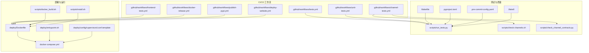
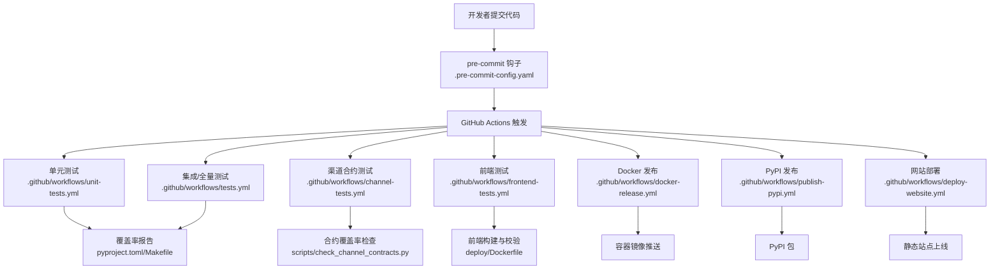
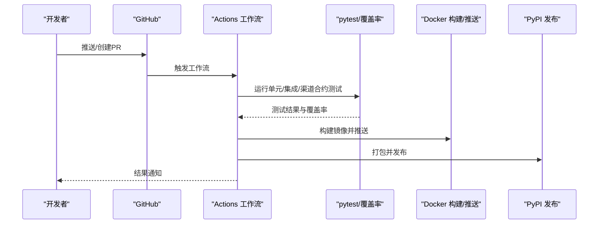
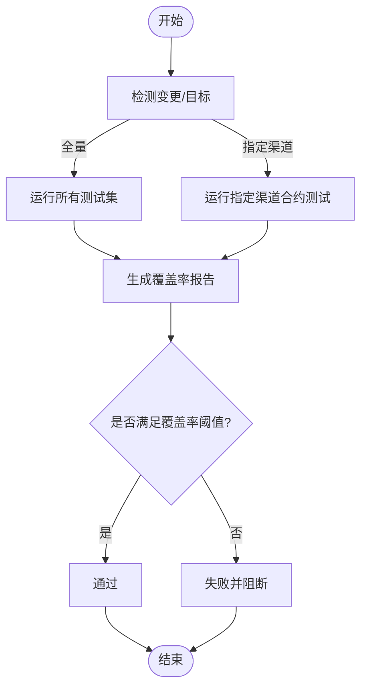
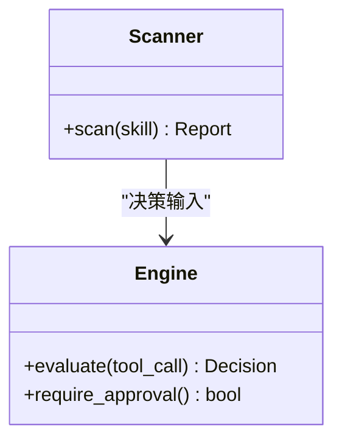
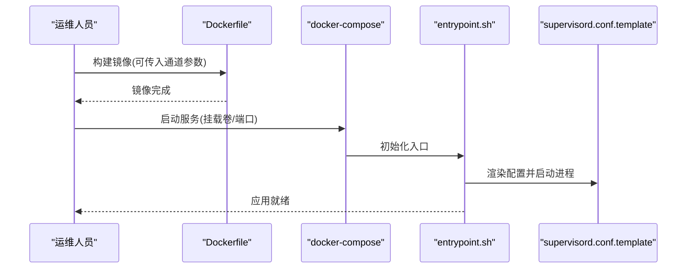
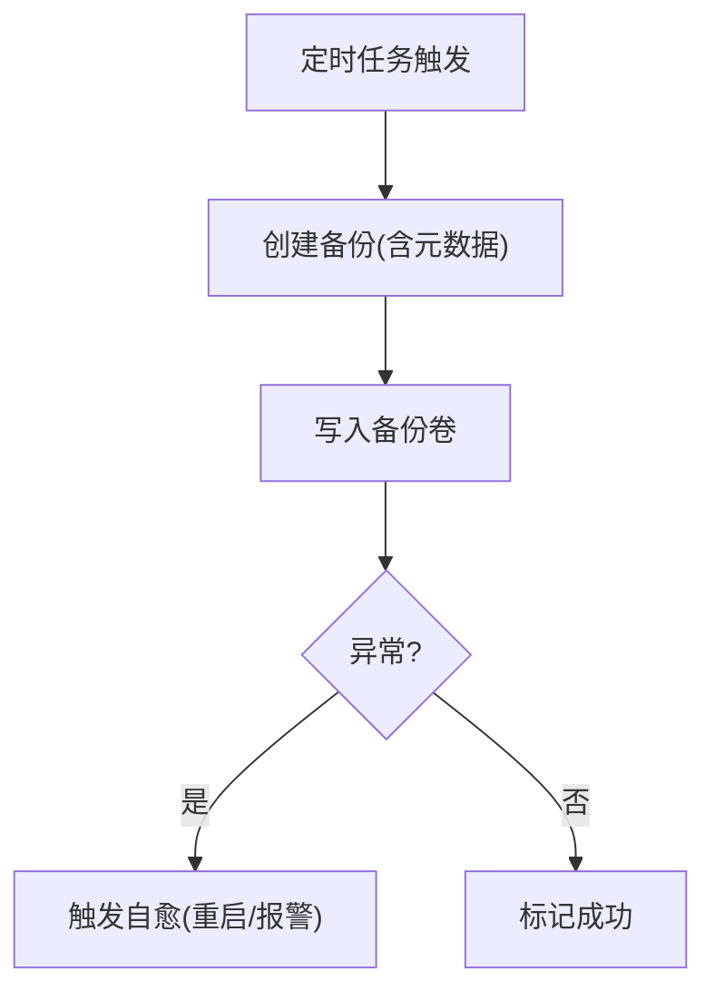
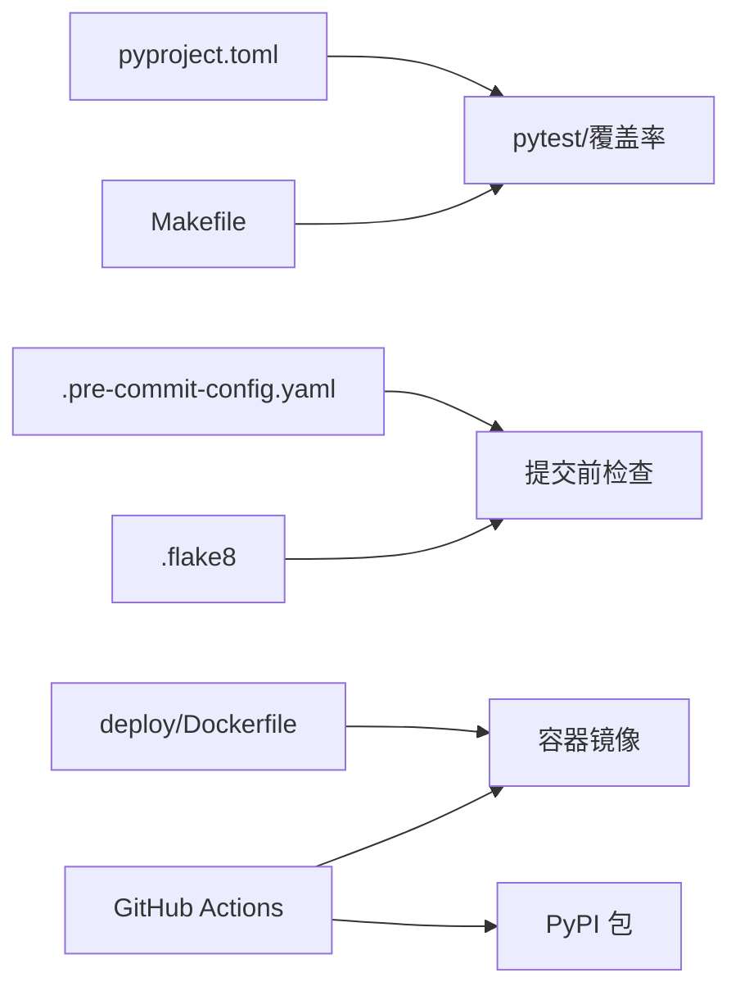

# 自动化运维

<cite>
**本文引用的文件**
- [Makefile](file://Makefile)
- [pyproject.toml](file://pyproject.toml)
- [.pre-commit-config.yaml](file://.pre-commit-config.yaml)
- [.flake8](file://.flake8)
- [scripts/run_tests.py](file://scripts/run_tests.py)
- [scripts/check-channels.sh](file://scripts/check-channels.sh)
- [scripts/check_channel_contracts.py](file://scripts/check_channel_contracts.py)
- [scripts/docker_build.sh](file://scripts/docker_build.sh)
- [deploy/Dockerfile](file://deploy/Dockerfile)
- [docker-compose.yml](file://docker-compose.yml)
- [scripts/install.sh](file://scripts/install.sh)
- [.github/workflows/tests.yml](file://.github/workflows/tests.yml)
- [.github/workflows/unit-tests.yml](file://.github/workflows/unit-tests.yml)
- [.github/workflows/channel-tests.yml](file://.github/workflows/channel-tests.yml)
- [.github/workflows/frontend-tests.yml](file://.github/workflows/frontend-tests.yml)
- [.github/workflows/docker-release.yml](file://.github/workflows/docker-release.yml)
- [.github/workflows/publish-pypi.yml](file://.github/workflows/publish-pypi.yml)
- [.github/workflows/deploy-website.yml](file://.github/workflows/deploy-website.yml)
- [deploy/config/supervisord.conf.template](file://deploy/config/supervisord.conf.template)
- [deploy/entrypoint.sh](file://deploy/entrypoint.sh)
- [src/qwenpaw/backup/orchestration.py](file://src/qwenpaw/backup/orchestration.py)
- [src/qwenpaw/backup/_ops/create.py](file://src/qwenpaw/backup/_ops/create.py)
- [src/qwenpaw/backup/_ops/restore.py](file://src/qwenpaw/backup/_ops/restore.py)
- [src/qwenpaw/security/skill_scanner/scanner.py](file://src/qwenpaw/security/skill_scanner/scanner.py)
- [src/qwenpaw/security/tool_guard/engine.py](file://src/qwenpaw/security/tool_guard/engine.py)
</cite>

## 目录
1. [简介](#简介)
2. [项目结构](#项目结构)
3. [核心组件](#核心组件)
4. [架构总览](#架构总览)
5. [详细组件分析](#详细组件分析)
6. [依赖关系分析](#依赖关系分析)
7. [性能考量](#性能考量)
8. [故障排查指南](#故障排查指南)
9. [结论](#结论)
10. [附录](#附录)

## 简介
本指南面向QwenPaw项目的自动化运维团队与平台工程师，系统性阐述CI/CD流水线、自动化测试与质量保障、安全扫描、部署与回滚、配置与基础设施即代码（IaC）、备份与监控告警、故障自愈以及工具链选型与配置建议。文档以仓库现有脚本、配置与工作流为基础，结合实际可执行路径，帮助快速落地并持续改进自动化能力。

## 项目结构
QwenPaw采用“后端Python主工程 + 前端控制台 + 多语言插件 + 部署与安装脚本”的分层组织方式。自动化相关的关键位置如下：
- CI/CD：位于 .github/workflows，覆盖单元测试、集成测试、前端测试、渠道合约测试、Docker发布、PyPI发布与网站部署。
- 测试与覆盖率：Makefile、pyproject.toml、scripts/run_tests.py、scripts/check-channels.sh、scripts/check_channel_contracts.py。
- 安装与打包：scripts/install.sh、scripts/docker_build.sh、deploy/Dockerfile、docker-compose.yml。
- 质量门禁：.pre-commit-config.yaml、.flake8。
- 运维脚本：deploy/entrypoint.sh、deploy/config/supervisord.conf.template。

图表来源
- [.github/workflows/tests.yml](file://.github/workflows/tests.yml)
- [.github/workflows/unit-tests.yml](file://.github/workflows/unit-tests.yml)
- [.github/workflows/channel-tests.yml](file://.github/workflows/channel-tests.yml)
- [.github/workflows/frontend-tests.yml](file://.github/workflows/frontend-tests.yml)
- [.github/workflows/docker-release.yml](file://.github/workflows/docker-release.yml)
- [.github/workflows/publish-pypi.yml](file://.github/workflows/publish-pypi.yml)
- [.github/workflows/deploy-website.yml](file://.github/workflows/deploy-website.yml)
- [Makefile](file://Makefile)
- [pyproject.toml](file://pyproject.toml)
- [scripts/run_tests.py](file://scripts/run_tests.py)
- [scripts/check-channels.sh](file://scripts/check-channels.sh)
- [scripts/check_channel_contracts.py](file://scripts/check_channel_contracts.py)
- [deploy/Dockerfile](file://deploy/Dockerfile)
- [docker-compose.yml](file://docker-compose.yml)
- [scripts/docker_build.sh](file://scripts/docker_build.sh)
- [scripts/install.sh](file://scripts/install.sh)
- [deploy/entrypoint.sh](file://deploy/entrypoint.sh)
- [deploy/config/supervisord.conf.template](file://deploy/config/supervisord.conf.template)

章节来源
- [Makefile:1-57](file://Makefile#L1-L57)
- [pyproject.toml:1-152](file://pyproject.toml#L1-L152)
- [.pre-commit-config.yaml:1-121](file://.pre-commit-config.yaml#L1-L121)
- [.flake8:1-12](file://.flake8#L1-L12)
- [scripts/run_tests.py:1-282](file://scripts/run_tests.py#L1-L282)
- [scripts/check-channels.sh:1-187](file://scripts/check-channels.sh#L1-L187)
- [scripts/check_channel_contracts.py:1-107](file://scripts/check_channel_contracts.py#L1-L107)
- [scripts/docker_build.sh:1-32](file://scripts/docker_build.sh#L1-L32)
- [deploy/Dockerfile:1-105](file://deploy/Dockerfile#L1-L105)
- [docker-compose.yml:1-26](file://docker-compose.yml#L1-L26)
- [scripts/install.sh:1-368](file://scripts/install.sh#L1-L368)
- [deploy/entrypoint.sh](file://deploy/entrypoint.sh)
- [deploy/config/supervisord.conf.template](file://deploy/config/supervisord.conf.template)

## 核心组件
- CI/CD流水线：通过多套GitHub Actions工作流分别覆盖后端测试、前端测试、渠道合约测试、Docker镜像发布、PyPI包发布与网站部署。
- 测试与覆盖率：提供统一的本地测试脚本与Makefile目标，支持并行、覆盖率生成与子目录测试。
- 质量门禁：pre-commit钩子与flake8规则在提交阶段拦截常见问题。
- 安装与打包：一键安装脚本与Docker构建脚本，支持从源码或PyPI安装，并可定制通道启用/禁用。
- 运行时与编排：Dockerfile多阶段构建，Supervisor入口脚本与模板配置，docker-compose定义持久卷与端口映射。
- 安全扫描：技能扫描器与工具守卫引擎提供规则驱动的安全评估与审批流程。
- 备份与恢复：备份编排模块与创建/恢复操作辅助运维回滚与数据保护。

章节来源
- [Makefile:1-57](file://Makefile#L1-L57)
- [pyproject.toml:116-152](file://pyproject.toml#L116-L152)
- [scripts/run_tests.py:175-282](file://scripts/run_tests.py#L175-L282)
- [scripts/check-channels.sh:103-166](file://scripts/check-channels.sh#L103-L166)
- [scripts/check_channel_contracts.py:71-107](file://scripts/check_channel_contracts.py#L71-L107)
- [.pre-commit-config.yaml:1-121](file://.pre-commit-config.yaml#L1-L121)
- [.flake8:1-12](file://.flake8#L1-L12)
- [scripts/install.sh:1-368](file://scripts/install.sh#L1-L368)
- [scripts/docker_build.sh:1-32](file://scripts/docker_build.sh#L1-L32)
- [deploy/Dockerfile:1-105](file://deploy/Dockerfile#L1-L105)
- [docker-compose.yml:1-26](file://docker-compose.yml#L1-L26)
- [deploy/entrypoint.sh](file://deploy/entrypoint.sh)
- [deploy/config/supervisord.conf.template](file://deploy/config/supervisord.conf.template)
- [src/qwenpaw/backup/orchestration.py](file://src/qwenpaw/backup/orchestration.py)
- [src/qwenpaw/backup/_ops/create.py](file://src/qwenpaw/backup/_ops/create.py)
- [src/qwenpaw/backup/_ops/restore.py](file://src/qwenpaw/backup/_ops/restore.py)
- [src/qwenpaw/security/skill_scanner/scanner.py](file://src/qwenpaw/security/skill_scanner/scanner.py)
- [src/qwenpaw/security/tool_guard/engine.py](file://src/qwenpaw/security/tool_guard/engine.py)

## 架构总览
下图展示从代码提交到产物发布的自动化路径，涵盖测试、质量门禁、容器镜像与包发布：

图表来源
- [.pre-commit-config.yaml:1-121](file://.pre-commit-config.yaml#L1-L121)
- [.github/workflows/unit-tests.yml](file://.github/workflows/unit-tests.yml)
- [.github/workflows/tests.yml](file://.github/workflows/tests.yml)
- [.github/workflows/channel-tests.yml](file://.github/workflows/channel-tests.yml)
- [.github/workflows/frontend-tests.yml](file://.github/workflows/frontend-tests.yml)
- [.github/workflows/docker-release.yml](file://.github/workflows/docker-release.yml)
- [.github/workflows/publish-pypi.yml](file://.github/workflows/publish-pypi.yml)
- [.github/workflows/deploy-website.yml](file://.github/workflows/deploy-website.yml)
- [pyproject.toml:116-152](file://pyproject.toml#L116-L152)
- [Makefile:1-57](file://Makefile#L1-L57)
- [scripts/check_channel_contracts.py:71-107](file://scripts/check_channel_contracts.py#L71-L107)
- [deploy/Dockerfile:1-105](file://deploy/Dockerfile#L1-L105)

## 详细组件分析

### CI/CD流水线与触发条件
- 单元测试与全量测试：通过工作流分别运行，支持并行与覆盖率输出；可按PR或推送触发。
- 渠道合约测试：针对渠道接口契约进行强制性验证，确保新增/修改渠道具备对应测试。
- 前端测试：在容器内构建并校验前端产物，保证控制台可用性。
- Docker发布：基于多阶段Dockerfile构建镜像并推送至镜像仓库。
- PyPI发布：打包Python主工程并发布至PyPI。
- 网站部署：构建网站并部署至托管平台。

图表来源
- [.github/workflows/unit-tests.yml](file://.github/workflows/unit-tests.yml)
- [.github/workflows/tests.yml](file://.github/workflows/tests.yml)
- [.github/workflows/channel-tests.yml](file://.github/workflows/channel-tests.yml)
- [.github/workflows/frontend-tests.yml](file://.github/workflows/frontend-tests.yml)
- [.github/workflows/docker-release.yml](file://.github/workflows/docker-release.yml)
- [.github/workflows/publish-pypi.yml](file://.github/workflows/publish-pypi.yml)
- [pyproject.toml:116-152](file://pyproject.toml#L116-L152)

章节来源
- [.github/workflows/unit-tests.yml](file://.github/workflows/unit-tests.yml)
- [.github/workflows/tests.yml](file://.github/workflows/tests.yml)
- [.github/workflows/channel-tests.yml](file://.github/workflows/channel-tests.yml)
- [.github/workflows/frontend-tests.yml](file://.github/workflows/frontend-tests.yml)
- [.github/workflows/docker-release.yml](file://.github/workflows/docker-release.yml)
- [.github/workflows/publish-pypi.yml](file://.github/workflows/publish-pypi.yml)
- [.github/workflows/deploy-website.yml](file://.github/workflows/deploy-website.yml)

### 自动化测试流程与质量门禁
- 本地测试脚本：支持按子目录运行单元测试、集成测试、并行执行与覆盖率生成。
- Makefile目标：提供统一入口，覆盖全量测试、单元/集成测试、覆盖率、快速检查与渠道合约检查。
- 合约覆盖率检查：扫描源码中的渠道类并比对测试覆盖情况，缺失时给出文件名建议。
- 提交前检查：脚本检测已变更渠道，优先运行相关合约测试，必要时全量运行基础渠道测试。
- 质量规则：flake8与pre-commit配置在提交阶段执行语法、格式与敏感信息检查。

图表来源
- [scripts/run_tests.py:175-282](file://scripts/run_tests.py#L175-L282)
- [Makefile:10-57](file://Makefile#L10-L57)
- [scripts/check-channels.sh:103-166](file://scripts/check-channels.sh#L103-L166)
- [scripts/check_channel_contracts.py:71-107](file://scripts/check_channel_contracts.py#L71-L107)
- [pyproject.toml:129-152](file://pyproject.toml#L129-L152)

章节来源
- [scripts/run_tests.py:1-282](file://scripts/run_tests.py#L1-L282)
- [Makefile:1-57](file://Makefile#L1-L57)
- [scripts/check-channels.sh:1-187](file://scripts/check-channels.sh#L1-L187)
- [scripts/check_channel_contracts.py:1-107](file://scripts/check_channel_contracts.py#L1-L107)
- [pyproject.toml:116-152](file://pyproject.toml#L116-L152)
- [.pre-commit-config.yaml:1-121](file://.pre-commit-config.yaml#L1-L121)
- [.flake8:1-12](file://.flake8#L1-L12)

### 安全扫描与工具治理
- 技能扫描器：基于规则签名对技能进行静态扫描，识别潜在风险。
- 工具守卫引擎：根据规则与执行级别对工具调用进行审批与拦截。
- 配置与规则：规则文件与数据由项目资源打包，运行时加载。

图表来源
- [src/qwenpaw/security/skill_scanner/scanner.py](file://src/qwenpaw/security/skill_scanner/scanner.py)
- [src/qwenpaw/security/tool_guard/engine.py](file://src/qwenpaw/security/tool_guard/engine.py)

章节来源
- [src/qwenpaw/security/skill_scanner/scanner.py](file://src/qwenpaw/security/skill_scanner/scanner.py)
- [src/qwenpaw/security/tool_guard/engine.py](file://src/qwenpaw/security/tool_guard/engine.py)

### 部署脚本与一键部署
- Docker构建：多阶段构建前端产物并注入Python运行时，支持通道白名单/黑名单参数。
- docker-compose：定义持久卷与端口映射，便于本地开发与演示。
- 容器入口：Supervisor模板与入口脚本负责进程编排与环境变量注入。
- 一键安装：支持从PyPI或源码安装，自动准备虚拟环境与CLI包装脚本。

图表来源
- [scripts/docker_build.sh:1-32](file://scripts/docker_build.sh#L1-32)
- [deploy/Dockerfile:1-105](file://deploy/Dockerfile#L1-L105)
- [docker-compose.yml:1-26](file://docker-compose.yml#L1-L26)
- [deploy/entrypoint.sh](file://deploy/entrypoint.sh)
- [deploy/config/supervisord.conf.template](file://deploy/config/supervisord.conf.template)

章节来源
- [scripts/docker_build.sh:1-32](file://scripts/docker_build.sh#L1-L32)
- [deploy/Dockerfile:1-105](file://deploy/Dockerfile#L1-L105)
- [docker-compose.yml:1-26](file://docker-compose.yml#L1-L26)
- [scripts/install.sh:1-368](file://scripts/install.sh#L1-L368)
- [deploy/entrypoint.sh](file://deploy/entrypoint.sh)
- [deploy/config/supervisord.conf.template](file://deploy/config/supervisord.conf.template)

### 回滚与环境切换
- 持久卷：数据、密钥与备份卷分离，便于切换与回滚。
- 回滚策略：通过停止当前容器、切换镜像标签并重新启动实现版本回退。
- 环境切换：通过环境变量与卷挂载实现不同环境隔离（开发/测试/生产）。

章节来源
- [docker-compose.yml:1-26](file://docker-compose.yml#L1-L26)
- [deploy/Dockerfile:14-26](file://deploy/Dockerfile#L14-L26)

### 自动化配置管理与变更管理
- 配置注入：Dockerfile中设置工作目录与环境变量，入口脚本渲染Supervisor配置。
- 变更管理：pre-commit钩子与flake8规则在提交阶段拦截不合规变更；渠道合约测试作为接口契约变更的强制门。

章节来源
- [deploy/Dockerfile:14-26](file://deploy/Dockerfile#L14-L26)
- [deploy/config/supervisord.conf.template](file://deploy/config/supervisord.conf.template)
- [.pre-commit-config.yaml:1-121](file://.pre-commit-config.yaml#L1-L121)
- [.flake8:1-12](file://.flake8#L1-L12)
- [scripts/check-channels.sh:103-166](file://scripts/check-channels.sh#L103-L166)

### 自动化备份、监控告警与故障自愈
- 备份编排：提供备份创建、恢复与存储抽象，支持安全交换与元数据管理。
- 监控告警：建议在容器外部部署Prometheus/Grafana或云监控，采集应用指标与日志。
- 故障自愈：结合Supervisor进程守护与健康检查，实现异常重启与状态上报。

图表来源
- [src/qwenpaw/backup/orchestration.py](file://src/qwenpaw/backup/orchestration.py)
- [src/qwenpaw/backup/_ops/create.py](file://src/qwenpaw/backup/_ops/create.py)
- [src/qwenpaw/backup/_ops/restore.py](file://src/qwenpaw/backup/_ops/restore.py)

章节来源
- [src/qwenpaw/backup/orchestration.py](file://src/qwenpaw/backup/orchestration.py)
- [src/qwenpaw/backup/_ops/create.py](file://src/qwenpaw/backup/_ops/create.py)
- [src/qwenpaw/backup/_ops/restore.py](file://src/qwenpaw/backup/_ops/restore.py)

## 依赖关系分析
- 测试与覆盖率：pytest配置与覆盖率阈值在pyproject.toml中集中管理；Makefile提供便捷目标。
- 质量门禁：pre-commit与flake8规则在提交阶段生效，减少CI负担。
- 构建与发布：Dockerfile多阶段构建，GitHub Actions负责镜像与包发布。

图表来源
- [pyproject.toml:116-152](file://pyproject.toml#L116-L152)
- [Makefile:1-57](file://Makefile#L1-L57)
- [.pre-commit-config.yaml:1-121](file://.pre-commit-config.yaml#L1-L121)
- [.flake8:1-12](file://.flake8#L1-L12)
- [deploy/Dockerfile:1-105](file://deploy/Dockerfile#L1-L105)

章节来源
- [pyproject.toml:116-152](file://pyproject.toml#L116-L152)
- [Makefile:1-57](file://Makefile#L1-L57)
- [.pre-commit-config.yaml:1-121](file://.pre-commit-config.yaml#L1-L121)
- [.flake8:1-12](file://.flake8#L1-L12)
- [deploy/Dockerfile:1-105](file://deploy/Dockerfile#L1-L105)

## 性能考量
- 并行测试：本地测试脚本支持并行执行，缩短反馈周期；建议在CI中按测试类型拆分作业以并行加速。
- 覆盖率阈值：pyproject.toml设置最低覆盖率阈值，避免覆盖率下降导致回归。
- 构建优化：Dockerfile使用uv加速Python包安装，多阶段构建减少镜像体积。
- 前端构建：容器内一次性构建，避免重复下载依赖。

章节来源
- [scripts/run_tests.py:165-173](file://scripts/run_tests.py#L165-L173)
- [pyproject.toml:147-152](file://pyproject.toml#L147-L152)
- [deploy/Dockerfile:92-93](file://deploy/Dockerfile#L92-L93)

## 故障排查指南
- 测试失败定位：使用本地测试脚本按子目录运行，结合覆盖率报告定位未覆盖路径。
- 合约测试缺失：使用合约覆盖率检查脚本生成缺失测试清单，参考现有模板补齐。
- 提交前检查：若pre-commit或flake8报错，先在本地修复再重试。
- 容器启动问题：检查入口脚本与Supervisor模板渲染结果，确认环境变量与端口映射正确。
- 安装失败：确认uv与Python版本满足要求，必要时清理旧虚拟环境后重试。

章节来源
- [scripts/run_tests.py:175-282](file://scripts/run_tests.py#L175-L282)
- [scripts/check_channel_contracts.py:71-107](file://scripts/check_channel_contracts.py#L71-L107)
- [.pre-commit-config.yaml:1-121](file://.pre-commit-config.yaml#L1-L121)
- [.flake8:1-12](file://.flake8#L1-L12)
- [deploy/entrypoint.sh](file://deploy/entrypoint.sh)
- [deploy/config/supervisord.conf.template](file://deploy/config/supervisord.conf.template)
- [scripts/install.sh:105-134](file://scripts/install.sh#L105-L134)

## 结论
QwenPaw的自动化运维体系以“提交即测试、测试即质量门禁、发布即产物交付”为核心，结合Docker容器化与Supervisor进程编排，形成可复现、可观测、可回滚的交付闭环。建议在现有基础上完善监控告警与故障自愈机制，并在CI中引入更多并行作业与缓存策略，进一步提升效率与稳定性。

## 附录
- 工具链选型与配置建议
  - 测试与覆盖率：pytest + pytest-cov；阈值与报告目录在pyproject.toml中集中配置。
  - 代码风格与静态检查：black + flake8；pre-commit在提交阶段强制执行。
  - 容器化：Docker多阶段构建，配合docker-compose进行本地编排。
  - 发布：GitHub Actions工作流负责Docker镜像与PyPI包发布。
  - 监控告警：建议在容器外部部署Prometheus/Grafana或云监控，采集应用指标与日志。
  - 故障自愈：结合Supervisor进程守护与健康检查，实现异常重启与状态上报。

章节来源
- [pyproject.toml:116-152](file://pyproject.toml#L116-L152)
- [.pre-commit-config.yaml:1-121](file://.pre-commit-config.yaml#L1-L121)
- [.flake8:1-12](file://.flake8#L1-L12)
- [deploy/Dockerfile:1-105](file://deploy/Dockerfile#L1-L105)
- [.github/workflows/docker-release.yml](file://.github/workflows/docker-release.yml)
- [.github/workflows/publish-pypi.yml](file://.github/workflows/publish-pypi.yml)