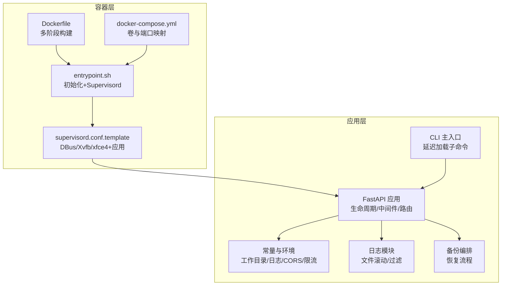
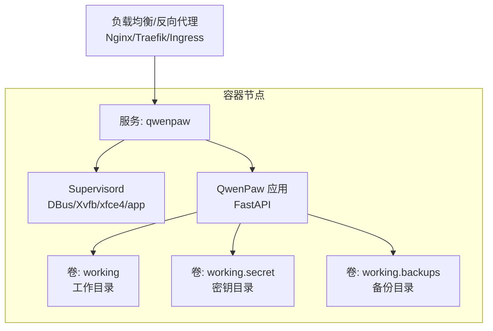
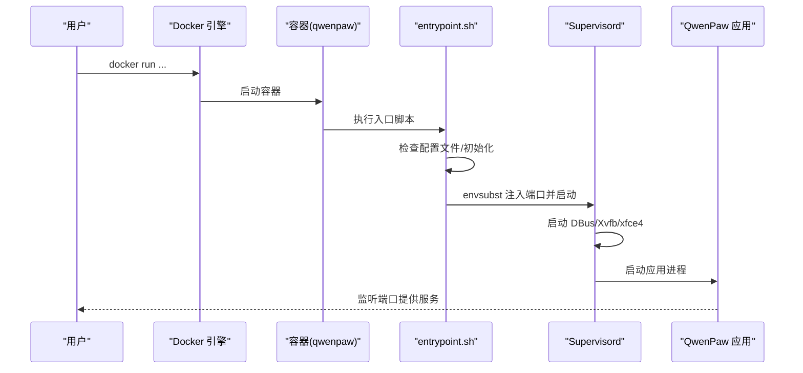
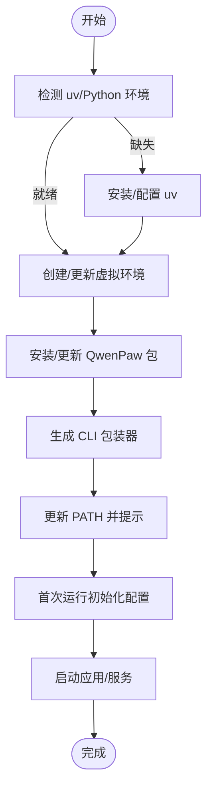
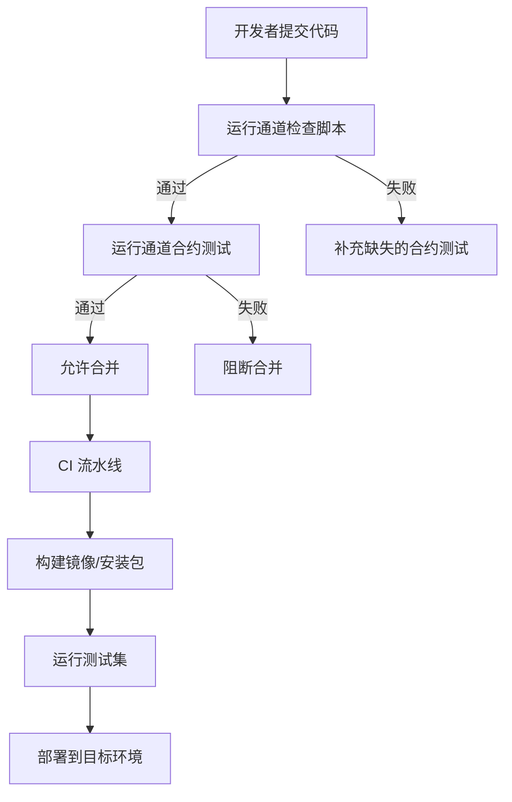
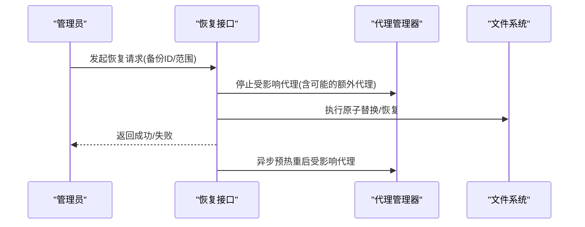
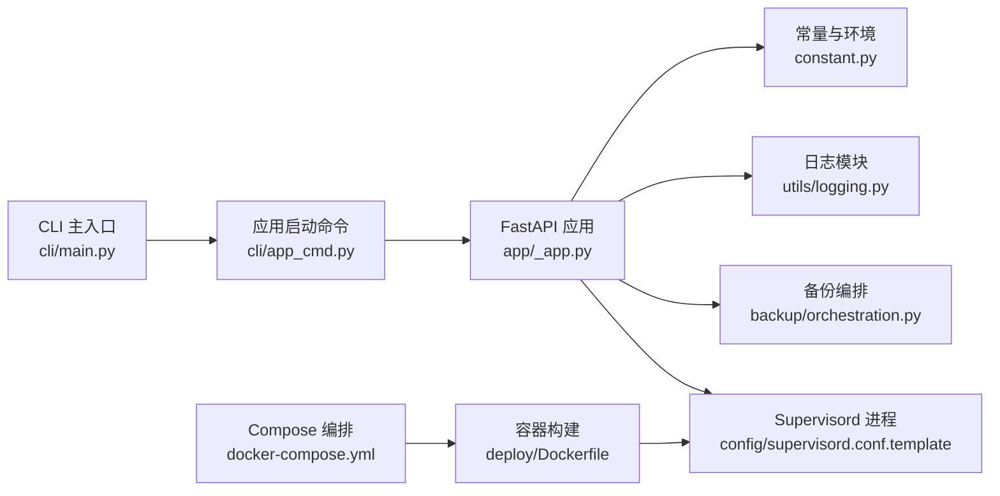

# 部署运维

<cite>
**本文引用的文件**
- [deploy/Dockerfile](file://deploy/Dockerfile)
- [deploy/entrypoint.sh](file://deploy/entrypoint.sh)
- [deploy/config/supervisord.conf.template](file://deploy/config/supervisord.conf.template)
- [docker-compose.yml](file://docker-compose.yml)
- [scripts/docker_build.sh](file://scripts/docker_build.sh)
- [scripts/install.sh](file://scripts/install.sh)
- [scripts/install.bat](file://scripts/install.bat)
- [scripts/install.ps1](file://scripts/install.ps1)
- [src/qwenpaw/cli/main.py](file://src/qwenpaw/cli/main.py)
- [src/qwenpaw/cli/app_cmd.py](file://src/qwenpaw/cli/app_cmd.py)
- [src/qwenpaw/app/_app.py](file://src/qwenpaw/app/_app.py)
- [src/qwenpaw/constant.py](file://src/qwenpaw/constant.py)
- [src/qwenpaw/utils/logging.py](file://src/qwenpaw/utils/logging.py)
- [src/qwenpaw/backup/orchestration.py](file://src/qwenpaw/backup/orchestration.py)
- [scripts/check-channels.sh](file://scripts/check-channels.sh)
- [scripts/check_channel_contracts.py](file://scripts/check_channel_contracts.py)
</cite>

## 目录
1. [简介](#简介)
2. [项目结构](#项目结构)
3. [核心组件](#核心组件)
4. [架构总览](#架构总览)
5. [详细组件分析](#详细组件分析)
6. [依赖关系分析](#依赖关系分析)
7. [性能考虑](#性能考虑)
8. [故障排查指南](#故障排查指南)
9. [结论](#结论)
10. [附录](#附录)

## 简介
本指南面向运维与平台工程团队，提供 QwenPaw 的端到端部署与运维方案，覆盖容器化部署、Kubernetes 部署、传统服务器部署三大模式；涵盖负载均衡配置、监控告警、自动化运维；给出生产环境配置、安全加固与性能优化最佳实践；并提供部署脚本使用、环境准备与系统集成操作指引，以及灾难恢复、备份与故障切换流程。

## 项目结构
- 部署层
  - 容器镜像构建：多阶段 Dockerfile，前端构建注入，运行时安装 Python 与 Chromium，Supervisord 管理应用与桌面虚拟化环境。
  - 启动入口：入口脚本负责初始化配置、端口模板替换与启动 Supervisord。
  - Compose 编排：单服务示例，挂载工作目录、密钥目录与备份目录。
- 应用层
  - CLI 入口与子命令：延迟加载子命令，支持 app 子命令启动 FastAPI 应用。
  - FastAPI 应用：生命周期管理、中间件、路由注册、静态资源与 SPA 回退。
  - 常量与环境：统一读取环境变量、工作目录、日志级别、CORS、LLM 限流等。
  - 日志：控制台彩色输出与安全滚动文件处理器。
  - 备份与恢复：恢复编排，按需停止/重启代理以保证文件操作一致性。
- 自动化与质量保障
  - 通道合约测试脚本：预提交检查通道变更，确保合约测试完备。
  - 安装器：跨平台自动安装 uv、Python 虚拟环境与包，生成 CLI 包装器并更新 PATH。

**图表来源**
- [deploy/Dockerfile:1-105](file://deploy/Dockerfile#L1-L105)
- [deploy/entrypoint.sh:1-21](file://deploy/entrypoint.sh#L1-L21)
- [deploy/config/supervisord.conf.template:1-40](file://deploy/config/supervisord.conf.template#L1-L40)
- [docker-compose.yml:1-26](file://docker-compose.yml#L1-L26)
- [src/qwenpaw/cli/main.py:58-173](file://src/qwenpaw/cli/main.py#L58-L173)
- [src/qwenpaw/app/_app.py:547-719](file://src/qwenpaw/app/_app.py#L547-L719)
- [src/qwenpaw/constant.py:89-368](file://src/qwenpaw/constant.py#L89-L368)
- [src/qwenpaw/utils/logging.py:154-226](file://src/qwenpaw/utils/logging.py#L154-L226)
- [src/qwenpaw/backup/orchestration.py:44-147](file://src/qwenpaw/backup/orchestration.py#L44-L147)

**章节来源**
- [deploy/Dockerfile:1-105](file://deploy/Dockerfile#L1-L105)
- [deploy/entrypoint.sh:1-21](file://deploy/entrypoint.sh#L1-L21)
- [deploy/config/supervisord.conf.template:1-40](file://deploy/config/supervisord.conf.template#L1-L40)
- [docker-compose.yml:1-26](file://docker-compose.yml#L1-L26)
- [src/qwenpaw/cli/main.py:58-173](file://src/qwenpaw/cli/main.py#L58-L173)
- [src/qwenpaw/cli/app_cmd.py:15-112](file://src/qwenpaw/cli/app_cmd.py#L15-L112)
- [src/qwenpaw/app/_app.py:547-719](file://src/qwenpaw/app/_app.py#L547-L719)
- [src/qwenpaw/constant.py:89-368](file://src/qwenpaw/constant.py#L89-L368)
- [src/qwenpaw/utils/logging.py:154-226](file://src/qwenpaw/utils/logging.py#L154-L226)
- [src/qwenpaw/backup/orchestration.py:44-147](file://src/qwenpaw/backup/orchestration.py#L44-L147)

## 核心组件
- 容器镜像与运行时
  - 多阶段构建：前端构建产物注入，运行时安装 Python、Chromium 与桌面虚拟化依赖，启用无沙箱浏览器标志，注入 Playwright 可执行路径与运行标记。
  - 环境变量：工作目录、密钥目录、备份目录、端口、通道白名单/黑名单等。
  - Supervisord：守护 DBus、Xvfb、xfce4 桌面会话与应用进程，统一日志输出。
- 应用启动与生命周期
  - CLI：延迟加载子命令，支持主机、端口、日志级别、访问日志路径过滤、弃用参数提示。
  - FastAPI：生命周期内完成清理、迁移、后台任务启动、插件系统初始化、关闭钩子执行与资源回收。
  - 静态资源与 SPA：优先返回 Web 控制台静态文件，否则回退到 SPA 回退路由。
- 配置与环境
  - 统一读取环境变量，兼容历史前缀，解析布尔/整数/浮点类型，支持默认值与边界约束。
  - 工作目录、密钥目录、备份目录、媒体目录、插件目录、模型目录等路径解析。
- 日志与可观测性
  - 控制台彩色输出与安全滚动文件处理器，支持 Windows ANSI 支持与路径相对化。
  - 访问日志过滤器可屏蔽特定路径片段，降低噪音。
- 备份与恢复
  - 恢复编排：在文件操作前停止可能持有句柄的代理，恢复后异步预热重启，保证一致性与可用性。

**章节来源**
- [deploy/Dockerfile:14-104](file://deploy/Dockerfile#L14-L104)
- [deploy/config/supervisord.conf.template:14-39](file://deploy/config/supervisord.conf.template#L14-L39)
- [src/qwenpaw/cli/app_cmd.py:15-112](file://src/qwenpaw/cli/app_cmd.py#L15-L112)
- [src/qwenpaw/app/_app.py:220-545](file://src/qwenpaw/app/_app.py#L220-L545)
- [src/qwenpaw/constant.py:12-368](file://src/qwenpaw/constant.py#L12-L368)
- [src/qwenpaw/utils/logging.py:154-226](file://src/qwenpaw/utils/logging.py#L154-L226)
- [src/qwenpaw/backup/orchestration.py:44-147](file://src/qwenpaw/backup/orchestration.py#L44-L147)

## 架构总览
下图展示容器化部署下的典型拓扑：客户端通过反向代理或负载均衡访问应用；应用内部由 Supervisord 管理桌面虚拟化与业务进程；数据持久化通过卷挂载至工作目录、密钥目录与备份目录。

**图表来源**
- [docker-compose.yml:11-26](file://docker-compose.yml#L11-L26)
- [deploy/config/supervisord.conf.template:7-39](file://deploy/config/supervisord.conf.template#L7-L39)
- [src/qwenpaw/app/_app.py:668-719](file://src/qwenpaw/app/_app.py#L668-L719)

## 详细组件分析

### 容器化部署（Docker）
- 构建流程
  - 使用多阶段构建，先在独立节点构建前端，再复制到运行时镜像，减少最终镜像体积。
  - 运行时安装 Python、Chromium 与桌面虚拟化依赖，并设置无沙箱标志与 Playwright 可执行路径。
  - 注入工作目录、密钥目录、备份目录与端口等环境变量。
- 启动流程
  - 入口脚本在首次启动时检测配置文件是否存在，不存在则自动初始化；随后将端口注入 Supervisord 模板并启动守护进程。
  - Supervisord 启动 DBus、Xvfb、xfce4 桌面会话与应用进程，统一输出日志。
- Compose 示例
  - 提供单服务示例，绑定本地回环地址与端口映射，挂载三类卷用于持久化。

**图表来源**
- [deploy/entrypoint.sh:6-20](file://deploy/entrypoint.sh#L6-L20)
- [deploy/config/supervisord.conf.template:14-21](file://deploy/config/supervisord.conf.template#L14-L21)
- [src/qwenpaw/app/_app.py:547-552](file://src/qwenpaw/app/_app.py#L547-L552)

**章节来源**
- [deploy/Dockerfile:1-105](file://deploy/Dockerfile#L1-L105)
- [deploy/entrypoint.sh:1-21](file://deploy/entrypoint.sh#L1-L21)
- [deploy/config/supervisord.conf.template:1-40](file://deploy/config/supervisord.conf.template#L1-L40)
- [docker-compose.yml:1-26](file://docker-compose.yml#L1-L26)

### Kubernetes 部署（推荐模式）
- Pod 规划
  - 单副本或主备高可用副本，使用 Deployment/StatefulSet 根据需求选择。
  - 使用 ConfigMap 注入环境变量（如端口、通道白名单/黑名单、CORS、日志级别等）。
  - 使用 PersistentVolumeClaim 挂载工作目录、密钥目录与备份目录。
- 服务暴露
  - ClusterIP/NodePort/LoadBalancer 或 Ingress，结合 TLS 与证书管理。
  - 如需桌面功能，可在 Pod 中启用 Xvfb/桌面会话（注意资源开销与 GPU/外设限制）。
- 健康检查
  - HTTP 探针访问健康端点（如根路径或版本接口），探活成功后再对外提供服务。
- 滚动升级
  - 设置合理的最大不可用与滚动窗口，配合优雅停机与后台任务回收。

[本节为概念性说明，未直接分析具体源码文件]

### 传统服务器部署（非容器）
- 安装器
  - Linux/macOS：自动检测/安装 uv，创建 Python 虚拟环境，安装包并生成 CLI 包装器，自动更新 PATH。
  - Windows：PowerShell 与批处理两种安装方式，自动下载/安装 uv，创建虚拟环境，安装包并生成包装器。
- 初始化与启动
  - 首次运行执行初始化流程，生成默认配置；后续通过 CLI 启动应用，支持主机、端口、日志级别与访问日志过滤。
- 系统集成
  - 将 CLI 包装器加入系统 PATH，便于在任意终端直接调用。
  - 结合 systemd 或 Windows 服务实现开机自启与崩溃重启。

**图表来源**
- [scripts/install.sh:104-132](file://scripts/install.sh#L104-L132)
- [scripts/install.bat:162-225](file://scripts/install.bat#L162-L225)
- [scripts/install.ps1:121-191](file://scripts/install.ps1#L121-L191)

**章节来源**
- [scripts/install.sh:1-368](file://scripts/install.sh#L1-L368)
- [scripts/install.bat:1-557](file://scripts/install.bat#L1-L557)
- [scripts/install.ps1:1-477](file://scripts/install.ps1#L1-L477)
- [src/qwenpaw/cli/app_cmd.py:55-112](file://src/qwenpaw/cli/app_cmd.py#L55-L112)

### 负载均衡与高可用
- 反向代理
  - Nginx/Traefik/Envoy/Ingress 控制器，开启 Gzip/缓存与健康检查。
  - 将静态资源与 API 请求分流，配置超时、缓冲与速率限制。
- 会话与状态
  - 无状态应用适合水平扩展；如需桌面会话，建议使用会话亲和或共享存储。
- 故障切换
  - 多副本部署，结合探活与自动重启；升级采用滚动策略，避免中断。

[本节为通用运维建议，未直接分析具体源码文件]

### 监控告警与可观测性
- 指标采集
  - 应用内置日志，结合文件滚动与访问日志过滤；可接入 Prometheus/Grafana。
- 告警规则
  - CPU/内存/磁盘/IO 上限，进程存活，健康检查失败，异常日志阈值。
- 追踪与审计
  - 为关键请求打点，记录耗时与错误；对敏感操作进行审计。

[本节为通用运维建议，未直接分析具体源码文件]

### 自动化运维
- 预提交与质量门禁
  - 通道合约测试脚本：检测变更通道并运行对应合约测试，缺失合约测试将阻断合并。
  - 静态扫描：检查所有通道类与合约测试覆盖率，缺失时输出建议文件名。
- CI/CD 集成
  - 在流水线中执行安装器、构建镜像、运行合约测试与单元测试，确保发布质量。

**图表来源**
- [scripts/check-channels.sh:103-166](file://scripts/check-channels.sh#L103-L166)
- [scripts/check_channel_contracts.py:71-102](file://scripts/check_channel_contracts.py#L71-L102)

**章节来源**
- [scripts/check-channels.sh:1-187](file://scripts/check-channels.sh#L1-L187)
- [scripts/check_channel_contracts.py:1-107](file://scripts/check_channel_contracts.py#L1-L107)

### 生产环境配置与安全加固
- 环境隔离
  - 使用独立工作目录、密钥目录与备份目录，严格权限控制。
  - 通过环境变量控制 CORS、日志级别、LLM 限流与并发。
- 端口与网络
  - 默认仅监听本地回环地址，通过反向代理暴露公网；限制入站端口与来源 IP。
- 传输安全
  - 强制 HTTPS，启用 HSTS；TLS 版本与套件遵循安全基线。
- 访问控制
  - 启用认证中间件与访问控制列表；对敏感路由增加鉴权。
- 通道安全
  - 使用白名单/黑名单控制通道；对第三方通道配置凭据轮换与最小权限。

**章节来源**
- [src/qwenpaw/constant.py:257-368](file://src/qwenpaw/constant.py#L257-L368)
- [src/qwenpaw/app/_app.py:557-569](file://src/qwenpaw/app/_app.py#L557-L569)

### 性能优化
- 并发与限流
  - 合理设置 LLM 最大并发与 QPM，避免触发上游限流；启用随机抖动降低突发。
- 日志与 IO
  - 使用安全滚动文件处理器，避免 Windows 文件锁导致的旋转失败；合理设置日志级别。
- 前端与静态资源
  - 前端构建产物注入镜像，减少运行时构建；静态资源走 CDN 或反代缓存。
- 桌面与浏览器
  - 在容器中启用无沙箱模式，避免权限问题；根据实际需求启用桌面会话。

**章节来源**
- [src/qwenpaw/constant.py:262-324](file://src/qwenpaw/constant.py#L262-L324)
- [src/qwenpaw/utils/logging.py:88-106](file://src/qwenpaw/utils/logging.py#L88-L106)
- [deploy/Dockerfile:72-79](file://deploy/Dockerfile#L72-L79)

### 部署脚本使用与环境准备
- 容器镜像构建
  - 使用脚本传入镜像标签与构建参数，支持通道白名单/黑名单定制，默认排除 imessage。
- 传统服务器安装
  - Linux/macOS：一键安装 uv 与 Python 环境，安装包并生成包装器；支持指定版本与额外特性。
  - Windows：PowerShell 与批处理两种安装方式，自动处理 uv 下载与 PATH 更新。

**章节来源**
- [scripts/docker_build.sh:1-32](file://scripts/docker_build.sh#L1-L32)
- [scripts/install.sh:57-93](file://scripts/install.sh#L57-L93)
- [scripts/install.bat:36-74](file://scripts/install.bat#L36-L74)
- [scripts/install.ps1:18-62](file://scripts/install.ps1#L18-L62)

### 系统集成
- 服务化
  - Linux：systemd 单位文件，设置用户/组、工作目录、环境变量与重启策略。
  - Windows：服务计划任务或 NSSM，设置登录凭据与自动重启。
- 启动顺序
  - 先启动依赖服务（数据库/消息队列/外部通道），再启动应用；应用健康检查通过后再对外提供服务。

[本节为通用集成建议，未直接分析具体源码文件]

### 灾难恢复、备份与故障切换
- 备份策略
  - 定期备份工作目录、密钥目录与备份目录；对重要配置与技能池进行快照。
- 恢复流程
  - 通过恢复编排：在文件操作前停止可能持有句柄的代理，执行原子替换，最后异步预热重启。
  - 对于涉及密钥与技能池的恢复，扩大停止范围以释放文件句柄，确保恢复一致性。
- 故障切换
  - 多副本部署，结合探活与自动切换；升级采用滚动策略，避免中断。

**图表来源**
- [src/qwenpaw/backup/orchestration.py:44-147](file://src/qwenpaw/backup/orchestration.py#L44-L147)

**章节来源**
- [src/qwenpaw/backup/orchestration.py:44-147](file://src/qwenpaw/backup/orchestration.py#L44-L147)

## 依赖关系分析

**图表来源**
- [src/qwenpaw/cli/main.py:58-173](file://src/qwenpaw/cli/main.py#L58-L173)
- [src/qwenpaw/cli/app_cmd.py:15-112](file://src/qwenpaw/cli/app_cmd.py#L15-L112)
- [src/qwenpaw/app/_app.py:547-719](file://src/qwenpaw/app/_app.py#L547-L719)
- [src/qwenpaw/constant.py:89-368](file://src/qwenpaw/constant.py#L89-L368)
- [src/qwenpaw/utils/logging.py:154-226](file://src/qwenpaw/utils/logging.py#L154-L226)
- [src/qwenpaw/backup/orchestration.py:44-147](file://src/qwenpaw/backup/orchestration.py#L44-L147)
- [deploy/config/supervisord.conf.template:1-40](file://deploy/config/supervisord.conf.template#L1-L40)
- [deploy/Dockerfile:1-105](file://deploy/Dockerfile#L1-L105)
- [docker-compose.yml:1-26](file://docker-compose.yml#L1-L26)

**章节来源**
- [src/qwenpaw/cli/main.py:58-173](file://src/qwenpaw/cli/main.py#L58-L173)
- [src/qwenpaw/cli/app_cmd.py:15-112](file://src/qwenpaw/cli/app_cmd.py#L15-L112)
- [src/qwenpaw/app/_app.py:547-719](file://src/qwenpaw/app/_app.py#L547-L719)
- [src/qwenpaw/constant.py:89-368](file://src/qwenpaw/constant.py#L89-L368)
- [src/qwenpaw/utils/logging.py:154-226](file://src/qwenpaw/utils/logging.py#L154-L226)
- [src/qwenpaw/backup/orchestration.py:44-147](file://src/qwenpaw/backup/orchestration.py#L44-L147)
- [deploy/config/supervisord.conf.template:1-40](file://deploy/config/supervisord.conf.template#L1-L40)
- [deploy/Dockerfile:1-105](file://deploy/Dockerfile#L1-L105)
- [docker-compose.yml:1-26](file://docker-compose.yml#L1-L26)

## 性能考虑
- 并发与限流
  - 合理设置 LLM 最大并发与 QPM，避免触发上游限流；启用随机抖动降低突发。
- 日志与 IO
  - 使用安全滚动文件处理器，避免 Windows 文件锁导致的旋转失败；合理设置日志级别。
- 前端与静态资源
  - 前端构建产物注入镜像，减少运行时构建；静态资源走 CDN 或反代缓存。
- 桌面与浏览器
  - 在容器中启用无沙箱模式，避免权限问题；根据实际需求启用桌面会话。

**章节来源**
- [src/qwenpaw/constant.py:262-324](file://src/qwenpaw/constant.py#L262-L324)
- [src/qwenpaw/utils/logging.py:88-106](file://src/qwenpaw/utils/logging.py#L88-L106)
- [deploy/Dockerfile:72-79](file://deploy/Dockerfile#L72-L79)

## 故障排查指南
- 启动失败
  - 检查容器日志与 Supervisord 输出；确认配置文件是否存在且可读。
  - 核对端口占用与反向代理配置；验证卷挂载权限。
- 日志定位
  - 使用访问日志过滤器屏蔽高频路径；关注项目命名空间日志与文件滚动日志。
- 恢复异常
  - 检查恢复编排是否正确停止了相关代理；确认文件句柄是否被其他进程占用。
- 通道问题
  - 使用通道检查脚本快速定位缺失的合约测试；确保通道配置与凭据正确。

**章节来源**
- [deploy/entrypoint.sh:6-20](file://deploy/entrypoint.sh#L6-L20)
- [src/qwenpaw/utils/logging.py:132-152](file://src/qwenpaw/utils/logging.py#L132-L152)
- [src/qwenpaw/backup/orchestration.py:118-147](file://src/qwenpaw/backup/orchestration.py#L118-L147)
- [scripts/check-channels.sh:103-166](file://scripts/check-channels.sh#L103-L166)

## 结论
通过容器化部署与 Compose 编排，QwenPaw 可在多种环境中快速上线；结合 Kubernetes 实现弹性与高可用；借助安装器与自动化脚本提升交付效率与质量。生产环境应强化安全与性能配置，建立完善的监控告警与灾备体系，确保稳定可靠的服务能力。

## 附录
- 快速参考
  - 容器构建：使用脚本传入镜像标签与构建参数，支持通道白名单/黑名单定制。
  - 传统服务器：一键安装 uv 与 Python 环境，安装包并生成包装器；支持指定版本与额外特性。
  - 启动应用：CLI 支持主机、端口、日志级别与访问日志过滤；应用启动后提供健康检查端点。

**章节来源**
- [scripts/docker_build.sh:1-32](file://scripts/docker_build.sh#L1-L32)
- [scripts/install.sh:57-93](file://scripts/install.sh#L57-L93)
- [scripts/install.bat:36-74](file://scripts/install.bat#L36-L74)
- [scripts/install.ps1:18-62](file://scripts/install.ps1#L18-L62)
- [src/qwenpaw/cli/app_cmd.py:55-112](file://src/qwenpaw/cli/app_cmd.py#L55-L112)
- [src/qwenpaw/app/_app.py:629-643](file://src/qwenpaw/app/_app.py#L629-L643)