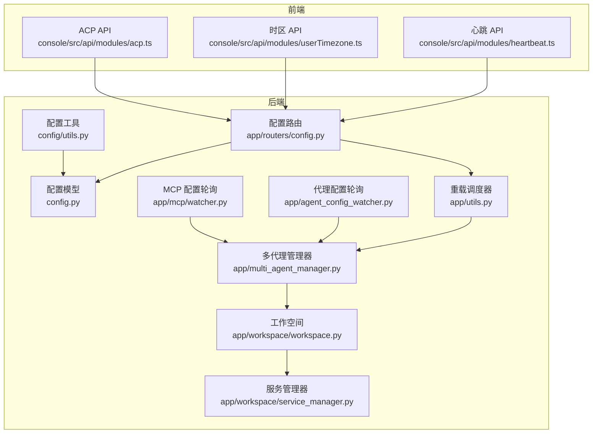
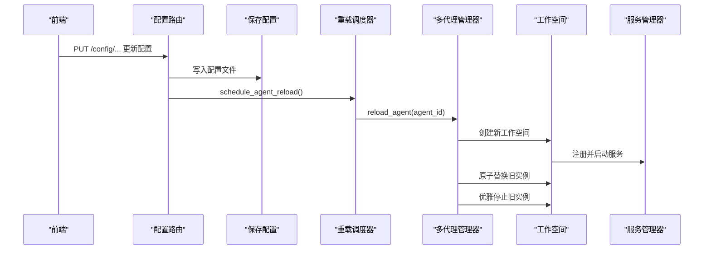
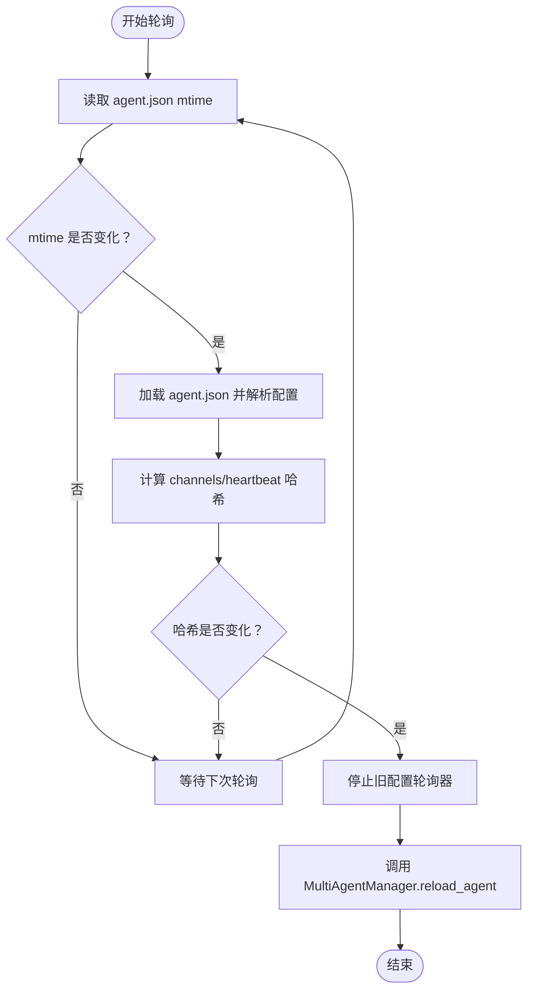
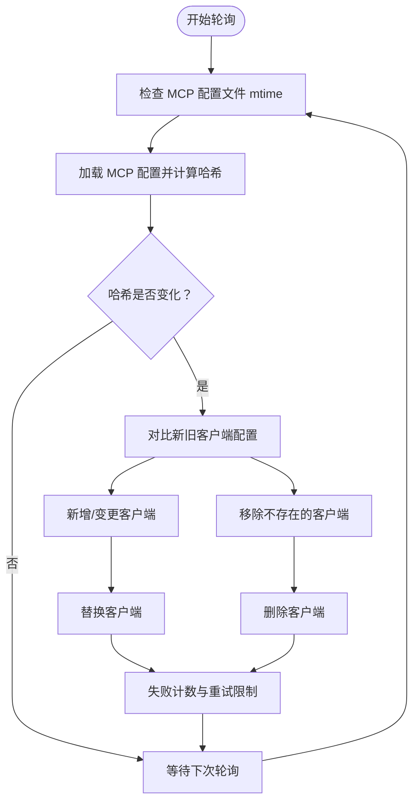
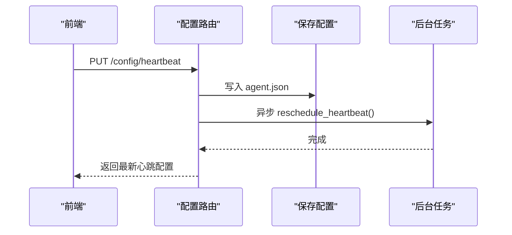
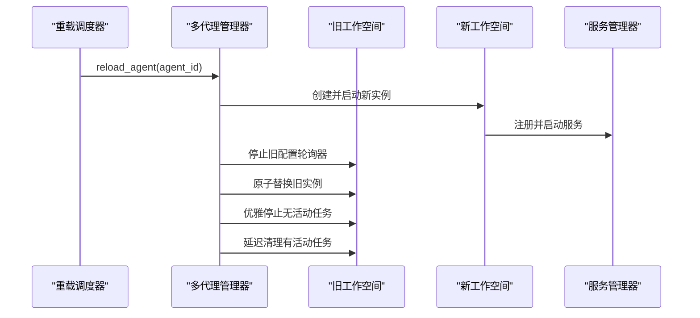
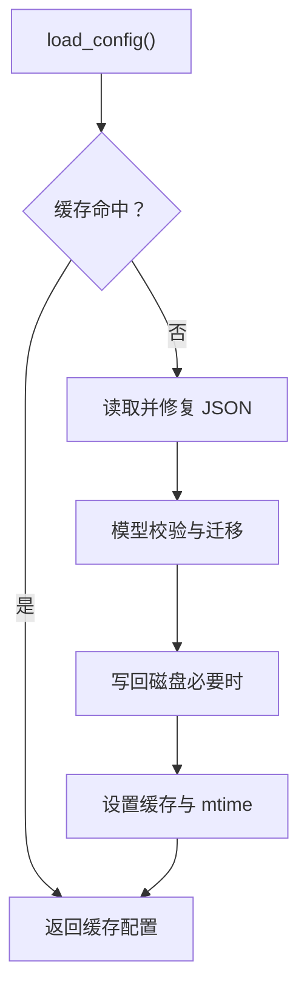
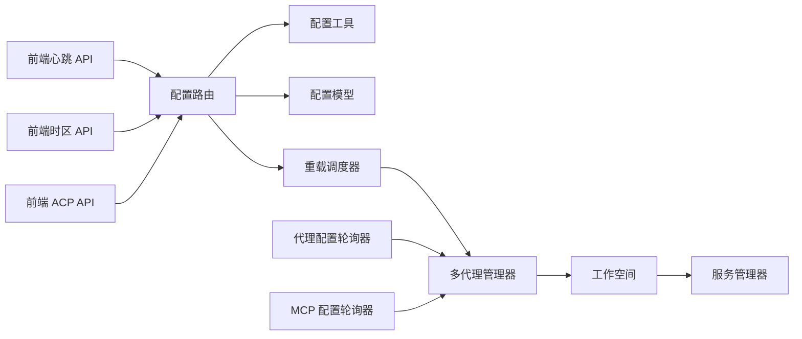

# 动态配置更新

<cite>
**本文档引用的文件**
- [agent_config_watcher.py](file://src/qwenpaw/app/agent_config_watcher.py)
- [config.py](file://src/qwenpaw/config/config.py)
- [config.py](file://src/qwenpaw/app/routers/config.py)
- [watcher.py](file://src/qwenpaw/app/mcp/watcher.py)
- [utils.py](file://src/qwenpaw/app/utils.py)
- [service_manager.py](file://src/qwenpaw/app/workspace/service_manager.py)
- [workspace.py](file://src/qwenpaw/app/workspace/workspace.py)
- [utils.py](file://src/qwenpaw/config/utils.py)
- [multi_agent_manager.py](file://src/qwenpaw/app/multi_agent_manager.py)
- [heartbeat.ts](file://console/src/api/modules/heartbeat.ts)
- [userTimezone.ts](file://console/src/api/modules/userTimezone.ts)
- [acp.ts](file://console/src/api/modules/acp.ts)
</cite>

## 目录
1. [简介](#简介)
2. [项目结构](#项目结构)
3. [核心组件](#核心组件)
4. [架构总览](#架构总览)
5. [详细组件分析](#详细组件分析)
6. [依赖分析](#依赖分析)
7. [性能考虑](#性能考虑)
8. [故障排查指南](#故障排查指南)
9. [结论](#结论)

## 简介
本文件系统性阐述 QwenPaw 的动态配置更新机制，覆盖热重载、实时更新与状态同步的实现原理；详解配置变更检测、更新流程与回滚策略；说明全局配置、代理配置与通道配置的动态调整方式；给出配置更新的 API 接口、事件通知与状态查询方法，并提供最佳实践、性能优化与故障处理建议，以及配置一致性与并发更新的解决方案。

## 项目结构
动态配置更新涉及后端配置模型与加载、前端 API 模块、后台轮询与热重载调度、工作空间服务管理与零停机重载等模块。下图展示关键文件之间的关系：

**图表来源**
- [config.py](file://src/qwenpaw/config/config.py)
- [utils.py](file://src/qwenpaw/config/utils.py)
- [config.py](file://src/qwenpaw/app/routers/config.py)
- [agent_config_watcher.py](file://src/qwenpaw/app/agent_config_watcher.py)
- [watcher.py](file://src/qwenpaw/app/mcp/watcher.py)
- [utils.py](file://src/qwenpaw/app/utils.py)
- [service_manager.py](file://src/qwenpaw/app/workspace/service_manager.py)
- [workspace.py](file://src/qwenpaw/app/workspace/workspace.py)
- [multi_agent_manager.py](file://src/qwenpaw/app/multi_agent_manager.py)
- [heartbeat.ts](file://console/src/api/modules/heartbeat.ts)
- [userTimezone.ts](file://console/src/api/modules/userTimezone.ts)
- [acp.ts](file://console/src/api/modules/acp.ts)

**章节来源**
- [config.py](file://src/qwenpaw/config/config.py)
- [utils.py](file://src/qwenpaw/config/utils.py)
- [config.py](file://src/qwenpaw/app/routers/config.py)
- [agent_config_watcher.py](file://src/qwenpaw/app/agent_config_watcher.py)
- [watcher.py](file://src/qwenpaw/app/mcp/watcher.py)
- [utils.py](file://src/qwenpaw/app/utils.py)
- [service_manager.py](file://src/qwenpaw/app/workspace/service_manager.py)
- [workspace.py](file://src/qwenpaw/app/workspace/workspace.py)
- [multi_agent_manager.py](file://src/qwenpaw/app/multi_agent_manager.py)
- [heartbeat.ts](file://console/src/api/modules/heartbeat.ts)
- [userTimezone.ts](file://console/src/api/modules/userTimezone.ts)
- [acp.ts](file://console/src/api/modules/acp.ts)

## 核心组件
- 配置模型与加载：定义并校验各类配置（通道、心跳、ACP、安全规则等），提供缓存与容错加载能力。
- 配置路由与 API：提供统一的配置读取/写入接口，支持热重载调度与后台任务触发。
- 代理配置轮询：基于文件时间戳与哈希的变更检测，触发代理级零停机重载。
- MCP 配置轮询：独立于主轮询器的 MCP 客户端配置监控，按客户端粒度增量更新。
- 重载调度器：在请求上下文外提取必要信息，异步触发多代理管理器执行重载。
- 工作空间与服务管理：声明式服务注册、生命周期管理与可复用服务的迁移，支撑零停机切换。
- 多代理管理器：原子替换旧实例、优雅停止旧实例、后台清理未完成任务，确保零停机。

**章节来源**
- [config.py](file://src/qwenpaw/config/config.py)
- [utils.py](file://src/qwenpaw/config/utils.py)
- [config.py](file://src/qwenpaw/app/routers/config.py)
- [agent_config_watcher.py](file://src/qwenpaw/app/agent_config_watcher.py)
- [watcher.py](file://src/qwenpaw/app/mcp/watcher.py)
- [utils.py](file://src/qwenpaw/app/utils.py)
- [service_manager.py](file://src/qwenpaw/app/workspace/service_manager.py)
- [workspace.py](file://src/qwenpaw/app/workspace/workspace.py)
- [multi_agent_manager.py](file://src/qwenpaw/app/multi_agent_manager.py)

## 架构总览
动态配置更新的整体流程如下：
- 前端通过 API 路由提交配置变更；
- 后端保存配置并调度后台重载；
- 代理配置轮询器检测 agent.json 变更并触发重载；
- MCP 配置轮询器检测 MCP 客户端配置变更并按需替换；
- 多代理管理器执行零停机重载，原子替换实例并优雅停止旧实例；
- 工作空间服务管理器负责服务的启动/停止与可复用服务迁移。

**图表来源**
- [config.py](file://src/qwenpaw/app/routers/config.py)
- [utils.py](file://src/qwenpaw/app/utils.py)
- [multi_agent_manager.py](file://src/qwenpaw/app/multi_agent_manager.py)
- [workspace.py](file://src/qwenpaw/app/workspace/workspace.py)
- [service_manager.py](file://src/qwenpaw/app/workspace/service_manager.py)

## 详细组件分析

### 代理配置轮询器（AgentConfigWatcher）
- 变更检测：轮询 agent.json 修改时间，解析配置并计算 channels 与 heartbeat 的哈希值，仅当哈希变化才触发重载。
- 触发重载：解析到变更后，调用多代理管理器执行零停机重载。
- 并发与稳定性：内部使用禁用标志避免重复触发；异常被记录但不中断轮询循环。

**图表来源**
- [agent_config_watcher.py](file://src/qwenpaw/app/agent_config_watcher.py)
- [utils.py](file://src/qwenpaw/app/utils.py)
- [multi_agent_manager.py](file://src/qwenpaw/app/multi_agent_manager.py)

**章节来源**
- [agent_config_watcher.py](file://src/qwenpaw/app/agent_config_watcher.py)
- [utils.py](file://src/qwenpaw/app/utils.py)
- [multi_agent_manager.py](file://src/qwenpaw/app/multi_agent_manager.py)

### MCP 配置轮询器（MCPConfigWatcher）
- 独立轮询：可独立于主轮询器运行，支持按客户端粒度的增量更新。
- 变更检测：比较 MCP 配置哈希，识别新增、修改或移除的客户端。
- 客户端级重载：对启用且变更的客户端执行替换，失败则跟踪重试次数并限制最大重试，避免无限重试。
- 并发控制：避免同时进行多次重载，等待上次重载完成后才进行下一次。

**图表来源**
- [watcher.py](file://src/qwenpaw/app/mcp/watcher.py)

**章节来源**
- [watcher.py](file://src/qwenpaw/app/mcp/watcher.py)

### 配置路由与 API（FastAPI）
- 通道配置：支持列出、获取、更新全部通道与单个通道配置；更新后调度后台重载。
- 心跳配置：支持获取、更新心跳配置并异步重新调度心跳任务；提供立即执行一次心跳的接口。
- 用户时区：支持获取与更新用户 IANA 时区。
- ACP 配置：支持获取/更新 ACP 总体配置与单个 ACP 代理配置。
- 安全与扫描：提供工具守卫、文件守卫与技能扫描器配置的读取与更新。

**图表来源**
- [config.py](file://src/qwenpaw/app/routers/config.py)

**章节来源**
- [config.py](file://src/qwenpaw/app/routers/config.py)

### 重载调度器与零停机重载
- 调度器：从请求上下文中提取多代理管理器与 agent_id，在后台任务中执行重载，避免阻塞响应。
- 零停机重载：先创建并启动新的工作空间实例，再原子替换旧实例；旧实例在无活动任务时立即停止，否则延迟清理。

**图表来源**
- [utils.py](file://src/qwenpaw/app/utils.py)
- [multi_agent_manager.py](file://src/qwenpaw/app/multi_agent_manager.py)
- [service_manager.py](file://src/qwenpaw/app/workspace/service_manager.py)

**章节来源**
- [utils.py](file://src/qwenpaw/app/utils.py)
- [multi_agent_manager.py](file://src/qwenpaw/app/multi_agent_manager.py)
- [service_manager.py](file://src/qwenpaw/app/workspace/service_manager.py)

### 配置模型与加载（Pydantic）
- 配置模型：定义通道、心跳、ACP、安全等配置类，支持默认值合并与字段迁移。
- 加载与缓存：基于文件 mtime 的缓存减少磁盘 IO；自动修复 JSON 语法问题并备份损坏文件；严格验证模式用于诊断。
- 保存与回退：保存配置后失效缓存；遇到不可修复错误时回退到默认配置并生成备份。

**图表来源**
- [utils.py](file://src/qwenpaw/config/utils.py)
- [config.py](file://src/qwenpaw/config/config.py)

**章节来源**
- [utils.py](file://src/qwenpaw/config/utils.py)
- [config.py](file://src/qwenpaw/config/config.py)

## 依赖分析
- 组件耦合：配置路由依赖配置工具与模型；重载调度器依赖多代理管理器；代理配置轮询器与 MCP 轮询器均依赖多代理管理器；工作空间与服务管理器负责服务生命周期。
- 外部依赖：前端通过 API 模块调用后端路由；后端通过文件系统读写配置；心跳与 MCP 客户端通过各自管理器进行调度与更新。
- 循环依赖：未发现直接循环依赖；轮询器与管理器通过回调与服务注册间接交互。

**图表来源**
- [config.py](file://src/qwenpaw/app/routers/config.py)
- [utils.py](file://src/qwenpaw/config/utils.py)
- [config.py](file://src/qwenpaw/config/config.py)
- [utils.py](file://src/qwenpaw/app/utils.py)
- [multi_agent_manager.py](file://src/qwenpaw/app/multi_agent_manager.py)
- [workspace.py](file://src/qwenpaw/app/workspace/workspace.py)
- [service_manager.py](file://src/qwenpaw/app/workspace/service_manager.py)
- [agent_config_watcher.py](file://src/qwenpaw/app/agent_config_watcher.py)
- [watcher.py](file://src/qwenpaw/app/mcp/watcher.py)
- [heartbeat.ts](file://console/src/api/modules/heartbeat.ts)
- [userTimezone.ts](file://console/src/api/modules/userTimezone.ts)
- [acp.ts](file://console/src/api/modules/acp.ts)

**章节来源**
- [config.py](file://src/qwenpaw/app/routers/config.py)
- [utils.py](file://src/qwenpaw/config/utils.py)
- [config.py](file://src/qwenpaw/config/config.py)
- [utils.py](file://src/qwenpaw/app/utils.py)
- [multi_agent_manager.py](file://src/qwenpaw/app/multi_agent_manager.py)
- [workspace.py](file://src/qwenpaw/app/workspace/workspace.py)
- [service_manager.py](file://src/qwenpaw/app/workspace/service_manager.py)
- [agent_config_watcher.py](file://src/qwenpaw/app/agent_config_watcher.py)
- [watcher.py](file://src/qwenpaw/app/mcp/watcher.py)
- [heartbeat.ts](file://console/src/api/modules/heartbeat.ts)
- [userTimezone.ts](file://console/src/api/modules/userTimezone.ts)
- [acp.ts](file://console/src/api/modules/acp.ts)

## 性能考虑
- 文件系统轮询：轮询间隔默认 2 秒，可在不同场景下调参以平衡实时性与 CPU 占用。
- 缓存与磁盘 IO：配置加载采用 mtime 缓存，避免频繁磁盘读取；JSON 自动修复与备份策略降低异常影响。
- 异步重载：所有重载通过后台任务执行，API 响应非阻塞；心跳与 MCP 客户端更新也采用异步重排/替换。
- 零停机重载：仅在原子替换阶段短暂持有锁，其余时间最小化阻塞，保障高并发下的可用性。

[本节为通用性能讨论，无需特定文件来源]

## 故障排查指南
- 配置文件损坏：加载器会尝试修复 JSON 并备份原始文件；若无法修复则回退默认配置。可通过严格验证接口定位问题。
- 重载失败：重载调度器记录警告日志；代理配置轮询器与 MCP 轮询器在异常情况下不会崩溃，但会记录错误并继续轮询。
- MCP 客户端重试：MCP 轮询器对失败客户端进行重试计数并在达到上限后停止自动重试，需手动修改配置以解除锁定。
- 通道健康检查：路由提供通道健康检查与重启接口，便于快速定位通道异常。

**章节来源**
- [utils.py](file://src/qwenpaw/config/utils.py)
- [config.py](file://src/qwenpaw/app/routers/config.py)
- [watcher.py](file://src/qwenpaw/app/mcp/watcher.py)
- [utils.py](file://src/qwenpaw/app/utils.py)

## 结论
QwenPaw 的动态配置更新机制通过“文件变更检测 + 异步重载 + 零停机替换”的组合，实现了全局配置、代理配置与通道配置的热重载与实时更新。代理配置轮询器与 MCP 轮询器分别针对不同粒度的配置提供了稳健的变更检测与增量更新能力；后端路由与调度器确保了非阻塞的用户体验；工作空间与服务管理器保障了服务生命周期与可复用性的统一管理。配合完善的错误处理与重试策略，系统在复杂场景下仍能保持稳定与一致。