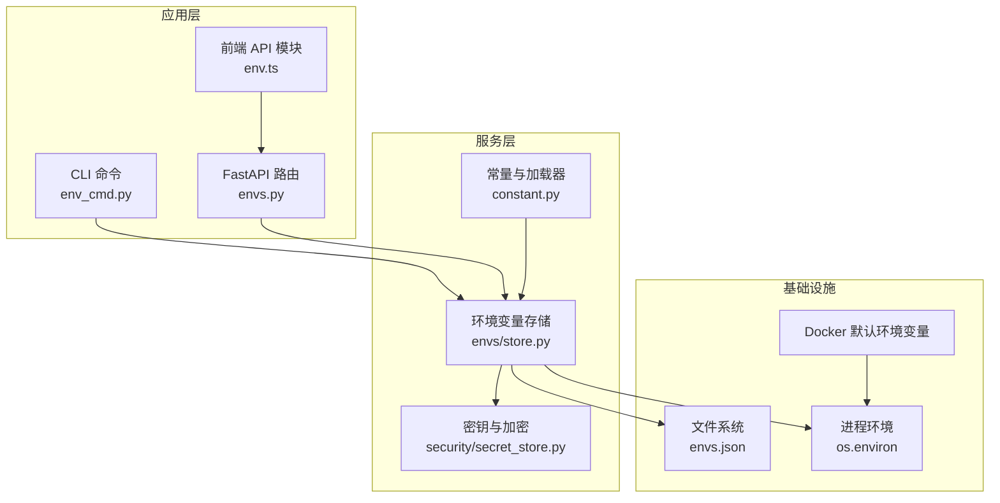
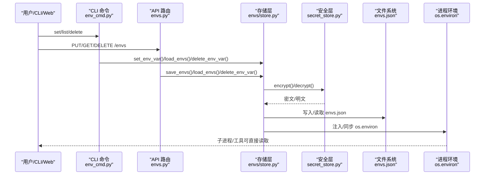
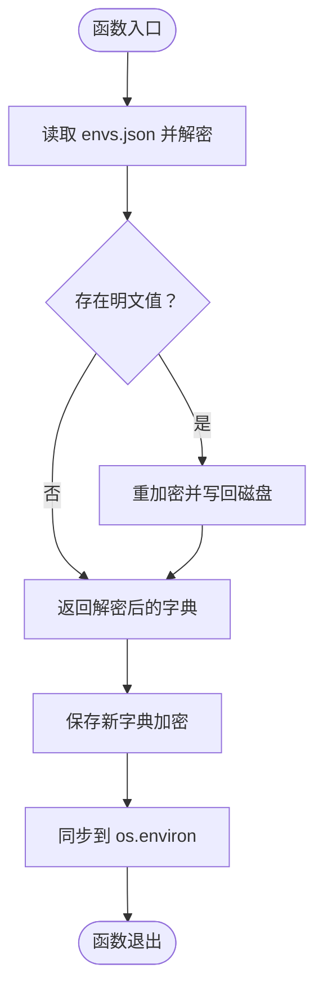
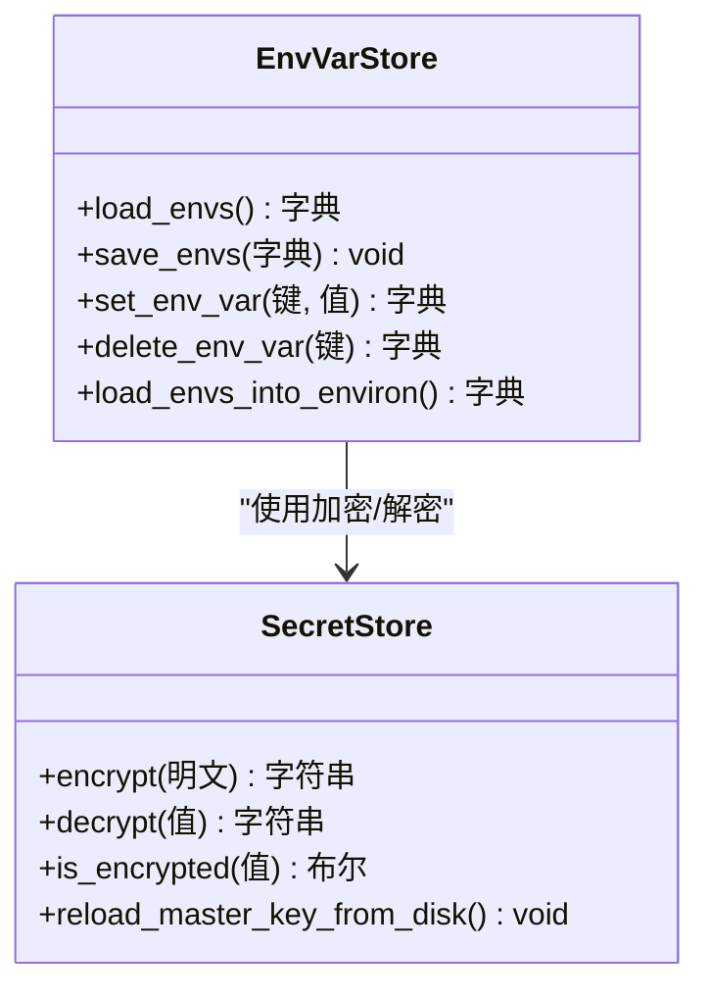
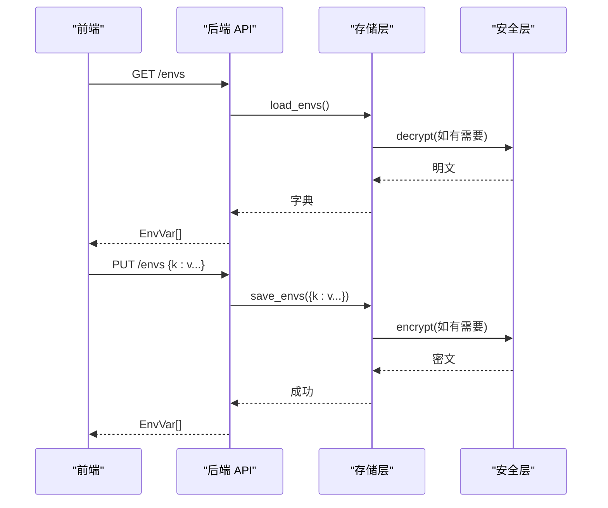
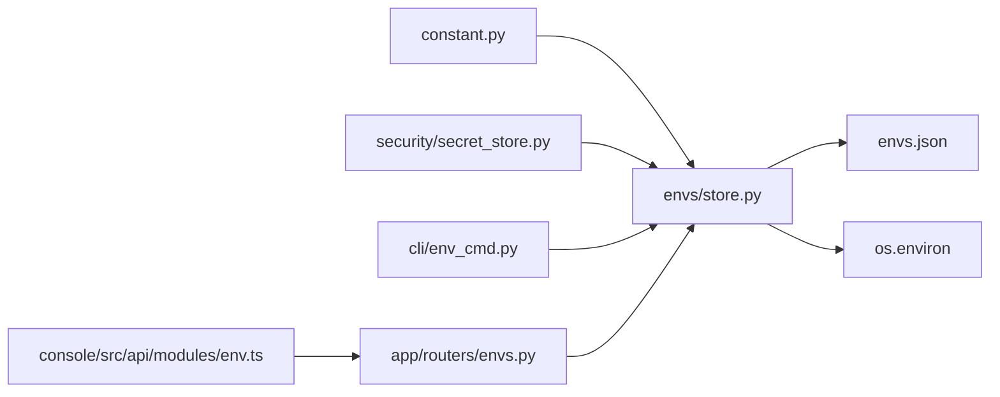

# 环境变量管理

<cite>
**本文引用的文件**
- [src/qwenpaw/envs/store.py](file://src/qwenpaw/envs/store.py)
- [src/qwenpaw/cli/env_cmd.py](file://src/qwenpaw/cli/env_cmd.py)
- [src/qwenpaw/app/routers/envs.py](file://src/qwenpaw/app/routers/envs.py)
- [console/src/api/modules/env.ts](file://console/src/api/modules/env.ts)
- [console/src/api/types/env.ts](file://console/src/api/types/env.ts)
- [src/qwenpaw/constant.py](file://src/qwenpaw/constant.py)
- [src/qwenpaw/security/secret_store.py](file://src/qwenpaw/security/secret_store.py)
- [src/qwenpaw/app/auth.py](file://src/qwenpaw/app/auth.py)
- [deploy/Dockerfile](file://deploy/Dockerfile)
</cite>

## 目录
1. [简介](#简介)
2. [项目结构](#项目结构)
3. [核心组件](#核心组件)
4. [架构总览](#架构总览)
5. [详细组件分析](#详细组件分析)
6. [依赖关系分析](#依赖关系分析)
7. [性能考虑](#性能考虑)
8. [故障排除指南](#故障排除指南)
9. [结论](#结论)
10. [附录](#附录)

## 简介
本文件系统性阐述 QwenPaw 的环境变量管理系统：从定义、读取、验证到持久化与注入；从 CLI 与 Web API 的统一入口到与配置文件的交互与覆盖策略；从安全存储（加密）到不同部署环境的最佳实践与动态更新机制。目标是帮助开发者与运维人员在不重启服务的前提下安全地管理敏感与非敏感配置。

## 项目结构
围绕环境变量管理的关键模块分布如下：
- 存储层：负责 envs.json 的读写、加解密与进程注入
- 安全层：主密钥管理、Fernet 加解密、密文前缀识别
- 常量与加载器：统一的环境变量读取与类型解析、默认值与兼容性
- 接口层：CLI 命令、Web API 路由、前端调用
- 部署层：容器镜像中预置的默认环境变量与运行时覆盖

**图表来源**
- [src/qwenpaw/envs/store.py:142-269](file://src/qwenpaw/envs/store.py#L142-L269)
- [src/qwenpaw/security/secret_store.py:293-327](file://src/qwenpaw/security/secret_store.py#L293-L327)
- [src/qwenpaw/constant.py:12-111](file://src/qwenpaw/constant.py#L12-L111)
- [src/qwenpaw/cli/env_cmd.py:10-99](file://src/qwenpaw/cli/env_cmd.py#L10-L99)
- [src/qwenpaw/app/routers/envs.py:12-81](file://src/qwenpaw/app/routers/envs.py#L12-L81)
- [console/src/api/modules/env.ts:1-19](file://console/src/api/modules/env.ts#L1-L19)
- [deploy/Dockerfile:14-26](file://deploy/Dockerfile#L14-L26)

**章节来源**
- [src/qwenpaw/envs/store.py:1-270](file://src/qwenpaw/envs/store.py#L1-L270)
- [src/qwenpaw/security/secret_store.py:1-414](file://src/qwenpaw/security/secret_store.py#L1-L414)
- [src/qwenpaw/constant.py:1-368](file://src/qwenpaw/constant.py#L1-L368)
- [src/qwenpaw/cli/env_cmd.py:1-99](file://src/qwenpaw/cli/env_cmd.py#L1-L99)
- [src/qwenpaw/app/routers/envs.py:1-81](file://src/qwenpaw/app/routers/envs.py#L1-L81)
- [console/src/api/modules/env.ts:1-19](file://console/src/api/modules/env.ts#L1-L19)
- [deploy/Dockerfile:1-105](file://deploy/Dockerfile#L1-L105)

## 核心组件
- 环境变量存储与同步
  - 两层持久化：envs.json（磁盘）+ os.environ（进程）
  - 启动时仅注入“安全”的持久化键，保护关键目录等受控键不被注入
  - 写入时先加密再落盘，并同步到当前进程环境
- 安全与加密
  - 主密钥来源：OS keychain 优先，回退到 SECRET_DIR/.master_key
  - 密文前缀：ENC: 用于透明识别与迁移
  - 敏感字段自动加密：如 provider.api_key、auth.jwt_secret
- 统一加载器
  - 类型安全读取：布尔、整数、浮点、字符串
  - 兼容旧版前缀：QWENPAW_ 自动回退到 COPAW_ 以兼容历史部署
  - 默认路径与行为：工作目录、密钥目录、备份目录等
- 接口与前端
  - CLI：list/set/delete
  - API：GET / PUT / DELETE
  - 前端：封装请求方法，返回标准化 EnvVar 列表

**章节来源**
- [src/qwenpaw/envs/store.py:104-269](file://src/qwenpaw/envs/store.py#L104-L269)
- [src/qwenpaw/security/secret_store.py:293-327](file://src/qwenpaw/security/secret_store.py#L293-L327)
- [src/qwenpaw/constant.py:28-87](file://src/qwenpaw/constant.py#L28-L87)
- [src/qwenpaw/cli/env_cmd.py:10-99](file://src/qwenpaw/cli/env_cmd.py#L10-L99)
- [src/qwenpaw/app/routers/envs.py:12-81](file://src/qwenpaw/app/routers/envs.py#L12-L81)
- [console/src/api/modules/env.ts:1-19](file://console/src/api/modules/env.ts#L1-L19)
- [console/src/api/types/env.ts:1-4](file://console/src/api/types/env.ts#L1-L4)

## 架构总览
下图展示从用户操作到持久化与进程注入的完整流程，以及与安全层的交互。

**图表来源**
- [src/qwenpaw/cli/env_cmd.py:10-99](file://src/qwenpaw/cli/env_cmd.py#L10-L99)
- [src/qwenpaw/app/routers/envs.py:12-81](file://src/qwenpaw/app/routers/envs.py#L12-L81)
- [src/qwenpaw/envs/store.py:142-269](file://src/qwenpaw/envs/store.py#L142-L269)
- [src/qwenpaw/security/secret_store.py:293-327](file://src/qwenpaw/security/secret_store.py#L293-L327)

## 详细组件分析

### 存储与同步组件（envs/store.py）
- 关键职责
  - 从 envs.json 加载并解密所有键值
  - 将新值加密后写回 envs.json，并设置权限
  - 启动时仅注入“安全”的持久化键到 os.environ，避免覆盖系统/运行时已存在的键
  - 提供单键 set/delete 与批量 save 的便捷接口
- 数据流
  - 读取：磁盘 -> 解密 -> 返回字典
  - 写入：输入字典 -> 加密 -> 写磁盘 -> 同步 os.environ
  - 注入：过滤受保护键 -> 不覆盖现有键 -> 注入新值
- 容错与迁移
  - 自动迁移旧版 envs.json 到 SECRET_DIR
  - 发现明文自动重加密
  - 文件异常记录日志并降级为空字典

**图表来源**
- [src/qwenpaw/envs/store.py:142-220](file://src/qwenpaw/envs/store.py#L142-L220)

**章节来源**
- [src/qwenpaw/envs/store.py:104-269](file://src/qwenpaw/envs/store.py#L104-L269)

### 安全与加密组件（security/secret_store.py）
- 主密钥管理
  - 顺序：内存缓存 -> OS keychain -> 文件 .master_key -> 生成新密钥
  - 在容器/无桌面环境自动降级，避免阻塞
  - 支持从磁盘重载主密钥，用于备份恢复后的一致性
- 加解密
  - ENC: 前缀标识密文
  - 失败时返回原文，保证降级可用
- 字段级加密
  - provider.api_key、auth.jwt_secret 等敏感字段自动加密

**图表来源**
- [src/qwenpaw/security/secret_store.py:293-327](file://src/qwenpaw/security/secret_store.py#L293-L327)
- [src/qwenpaw/envs/store.py:142-220](file://src/qwenpaw/envs/store.py#L142-L220)

**章节来源**
- [src/qwenpaw/security/secret_store.py:1-414](file://src/qwenpaw/security/secret_store.py#L1-L414)

### 常量与加载器（constant.py）
- 统一读取与类型转换
  - get_bool/get_int/get_float/get_str
  - 自动回退 COPAW_ 前缀，兼容历史部署
- 默认路径与行为
  - 工作目录、密钥目录、备份目录、配置文件名、聊天/心跳/令牌用量文件名等
  - 运行容器标志、CORS 允许来源、LLM 限流与并发参数等
- .env 文件加载
  - 应用启动前加载根目录 .env，确保后续读取优先于系统环境

**章节来源**
- [src/qwenpaw/constant.py:1-368](file://src/qwenpaw/constant.py#L1-L368)

### 接口与前端（CLI/API/FE）
- CLI
  - env list：列出所有持久化的键值
  - env set：设置单个键值
  - env delete：删除单个键
  - 交互式配置助手
- API
  - GET /envs：返回 EnvVar 列表
  - PUT /envs：全量替换（未出现的键将被移除）
  - DELETE /envs/{key}：删除单个键
- 前端
  - 封装 list/save/delete 请求
  - 返回标准化 EnvVar 数组

**图表来源**
- [src/qwenpaw/app/routers/envs.py:32-81](file://src/qwenpaw/app/routers/envs.py#L32-L81)
- [src/qwenpaw/envs/store.py:198-220](file://src/qwenpaw/envs/store.py#L198-L220)
- [src/qwenpaw/security/secret_store.py:293-327](file://src/qwenpaw/security/secret_store.py#L293-L327)
- [console/src/api/modules/env.ts:4-18](file://console/src/api/modules/env.ts#L4-L18)

**章节来源**
- [src/qwenpaw/cli/env_cmd.py:10-99](file://src/qwenpaw/cli/env_cmd.py#L10-L99)
- [src/qwenpaw/app/routers/envs.py:12-81](file://src/qwenpaw/app/routers/envs.py#L12-L81)
- [console/src/api/modules/env.ts:1-19](file://console/src/api/modules/env.ts#L1-L19)
- [console/src/api/types/env.ts:1-4](file://console/src/api/types/env.ts#L1-L4)

### 认证与环境变量联动（app/auth.py）
- 自动注册管理员账户
  - 当启用认证且未注册用户时，若提供用户名/密码环境变量，则自动注册
- 登录开关
  - 通过布尔环境变量控制是否启用认证

**章节来源**
- [src/qwenpaw/app/auth.py:330-418](file://src/qwenpaw/app/auth.py#L330-L418)

### 部署与默认环境变量（deploy/Dockerfile）
- 预设默认环境变量
  - 工作目录、密钥目录、备份目录
  - 禁用/启用通道列表（支持运行时覆盖）
  - Playwright 使用系统 Chromium、指示容器运行
- 运行时覆盖
  - 通过 -e 或外部配置覆盖上述默认值

**章节来源**
- [deploy/Dockerfile:14-26](file://deploy/Dockerfile#L14-L26)
- [deploy/Dockerfile:74-80](file://deploy/Dockerfile#L74-L80)

## 依赖关系分析
- 存储层依赖安全层进行加解密，依赖常量层确定默认路径
- CLI/API/前端均通过存储层访问 envs.json，避免直接耦合安全细节
- 进程注入遵循“不覆盖现有值”的策略，确保系统/容器环境优先

**图表来源**
- [src/qwenpaw/constant.py:12-111](file://src/qwenpaw/constant.py#L12-L111)
- [src/qwenpaw/envs/store.py:198-220](file://src/qwenpaw/envs/store.py#L198-L220)
- [src/qwenpaw/security/secret_store.py:293-327](file://src/qwenpaw/security/secret_store.py#L293-L327)
- [src/qwenpaw/cli/env_cmd.py:7-7](file://src/qwenpaw/cli/env_cmd.py#L7-L7)
- [src/qwenpaw/app/routers/envs.py:10-10](file://src/qwenpaw/app/routers/envs.py#L10-L10)
- [console/src/api/modules/env.ts:1-1](file://console/src/api/modules/env.ts#L1-L1)

**章节来源**
- [src/qwenpaw/envs/store.py:1-270](file://src/qwenpaw/envs/store.py#L1-L270)
- [src/qwenpaw/security/secret_store.py:1-414](file://src/qwenpaw/security/secret_store.py#L1-L414)
- [src/qwenpaw/constant.py:1-368](file://src/qwenpaw/constant.py#L1-L368)
- [src/qwenpaw/cli/env_cmd.py:1-99](file://src/qwenpaw/cli/env_cmd.py#L1-L99)
- [src/qwenpaw/app/routers/envs.py:1-81](file://src/qwenpaw/app/routers/envs.py#L1-L81)
- [console/src/api/modules/env.ts:1-19](file://console/src/api/modules/env.ts#L1-L19)

## 性能考虑
- 加密/解密成本
  - 采用缓存主密钥与 Fernet 实例，减少重复初始化开销
- I/O 优化
  - 批量写入（PUT）一次性完成磁盘写入与权限设置
  - 仅在明文检测到时触发重加密，避免不必要的二次写入
- 进程注入
  - 同步阶段仅对新增/变更键进行注入，减少 os.environ 变更次数

[本节为通用建议，无需特定文件引用]

## 故障排除指南
- 无法读取 envs.json
  - 检查文件是否存在、是否为常规文件、权限是否正确
  - 查看日志中的 OS 错误提示
- 解密失败或返回原文
  - 可能为主密钥变更或数据损坏；确认主密钥一致性或重新设置
- 写入后子进程读不到新值
  - 确认是否在当前进程内注入成功；注意受保护键不会注入
  - 检查是否被系统/容器环境变量覆盖
- 容器内运行
  - 确认已设置容器运行标志与系统浏览器路径
  - 通道白名单/黑名单按需调整

**章节来源**
- [src/qwenpaw/envs/store.py:152-179](file://src/qwenpaw/envs/store.py#L152-L179)
- [src/qwenpaw/security/secret_store.py:310-321](file://src/qwenpaw/security/secret_store.py#L310-L321)
- [deploy/Dockerfile:74-80](file://deploy/Dockerfile#L74-L80)

## 结论
QwenPaw 的环境变量管理以“磁盘持久化 + 进程注入”为核心，结合“主密钥 + Fernet 加密”，在保证安全性的同时提供了统一的 CLI、API 与前端操作入口。通过严格的覆盖与注入策略、默认路径与兼容性设计，以及容器化默认值，系统能够在多环境中稳定运行并支持动态更新。

[本节为总结，无需特定文件引用]

## 附录

### 支持的环境变量清单与命名规范
- 命名规范
  - 建议使用 QWENPAW_ 前缀，保持与历史 COPAW_ 的兼容
  - 键名区分大小写，建议使用大写与下划线
- 关键目录与文件
  - QWENPAW_WORKING_DIR：工作目录（默认 ~/.qwenpaw，可回退至 ~/.copaw）
  - QWENPAW_SECRET_DIR：密钥目录（默认 WORKING_DIR/.secret）
  - QWENPAW_CONFIG_FILE：配置文件名（默认 config.json）
  - QWENPAW_CHATS_FILE / QWENPAW_TOKEN_USAGE_FILE / QWENPAW_HEARTBEAT_FILE：相关数据文件名
  - QWENPAW_BACKUP_DIR：备份目录（默认 WORKING_DIR.backups）
- 运行与调试
  - QWENPAW_LOG_LEVEL：日志级别
  - QWENPAW_RUNNING_IN_CONTAINER：容器运行标记
  - QWENPAW_OPENAPI_DOCS：开发模式下是否暴露 OpenAPI 文档
- CORS 与通道
  - QWENPAW_CORS_ORIGINS：开发模式允许的跨域来源
  - QWENPAW_ENABLED_CHANNELS / QWENPAW_DISABLED_CHANNELS：通道白名单/黑名单
- 浏览器与 Playwright
  - PLAYWRIGHT_CHROMIUM_EXECUTABLE_PATH：系统 Chromium 路径
- 认证
  - QWENPAW_AUTH_ENABLED：启用认证
  - QWENPAW_AUTH_USERNAME / QWENPAW_AUTH_PASSWORD：自动注册管理员凭据
- LLM 速率限制与并发
  - QWENPAW_LLM_MAX_RETRIES / QWENPAW_LLM_BACKOFF_BASE / QWENPAW_LLM_BACKOFF_CAP
  - QWENPAW_LLM_MAX_CONCURRENT / QWENPAW_LLM_MAX_QPM / QWENPAW_LLM_RATE_LIMIT_PAUSE / QWENPAW_LLM_RATE_LIMIT_JITTER / QWENPAW_LLM_ACQUIRE_TIMEOUT
- 工具守卫超时
  - QWENPAW_TOOL_GUARD_APPROVAL_TIMEOUT_SECONDS / QWENPAW_TOOL_GUARD_APPROVAL_HEARTBEAT_INTERVAL
- 技能系统与网络
  - QWENPAW_GITHUB_CACHE_TTL / QWENPAW_SKILLS_HUB_*（HTTP 超时、重试、回退参数、基础 URL、搜索/版本/详情/文件路径）

**章节来源**
- [src/qwenpaw/constant.py:93-368](file://src/qwenpaw/constant.py#L93-L368)
- [src/qwenpaw/app/auth.py:330-418](file://src/qwenpaw/app/auth.py#L330-L418)
- [deploy/Dockerfile:14-26](file://deploy/Dockerfile#L14-L26)

### 优先级与覆盖规则
- 优先级（从高到低）
  1) 运行时/系统环境变量（不被注入受保护键）
  2) CLI/Web 设置的持久化键（envs.json）
  3) 默认值（来自常量与加载器）
- 注入策略
  - 启动时仅注入“安全”的持久化键，且不覆盖已存在的运行时键
  - 受保护键（如工作目录、密钥目录）不注入进程环境
- 覆盖策略
  - PUT /envs 为全量替换，未显式提供的键会被移除
  - 单键 set/delete 仅影响该键

**章节来源**
- [src/qwenpaw/envs/store.py:242-269](file://src/qwenpaw/envs/store.py#L242-L269)
- [src/qwenpaw/envs/store.py:198-220](file://src/qwenpaw/envs/store.py#L198-L220)
- [src/qwenpaw/app/routers/envs.py:43-63](file://src/qwenpaw/app/routers/envs.py#L43-L63)

### 与配置文件的交互关系
- 配置文件（config.json）与环境变量的关系
  - 配置文件本身不直接存储敏感信息；敏感字段通过安全层加密后持久化
  - 环境变量用于控制运行时行为（如通道、CORS、LLM 参数等），与配置文件互补
- 启动流程
  - 先加载 .env（项目根目录），再读取常量与加载器，最后注入安全的持久化键

**章节来源**
- [src/qwenpaw/constant.py:6-9](file://src/qwenpaw/constant.py#L6-L9)
- [src/qwenpaw/envs/store.py:242-269](file://src/qwenpaw/envs/store.py#L242-L269)

### 安全管理指南
- 敏感信息处理
  - 所有敏感值在磁盘上以 ENC: 前缀密文形式存储
  - 主密钥优先存储于 OS keychain，容器/无桌面环境回退至 SECRET_DIR/.master_key
  - 更新凭据会旋转密钥以使旧会话失效
- 最佳实践
  - 仅在必要时将敏感信息放入 envs.json；优先使用系统/容器机密管理
  - 定期轮换主密钥与 JWT 秘钥
  - 严格控制 envs.json 权限（0600），避免共享主机上的泄露风险
  - 使用受保护键策略，确保关键目录不受注入

**章节来源**
- [src/qwenpaw/security/secret_store.py:293-327](file://src/qwenpaw/security/secret_store.py#L293-L327)
- [src/qwenpaw/envs/store.py:183-196](file://src/qwenpaw/envs/store.py#L183-L196)
- [src/qwenpaw/app/auth.py:455-457](file://src/qwenpaw/app/auth.py#L455-L457)

### 动态更新与热重载
- 动态更新
  - 通过 CLI 或 API 修改 envs.json 后立即同步到 os.environ
  - 受保护键不会被注入，避免破坏关键目录
- 热重载
  - 对于需要感知新值的服务（如 LLM 参数、通道开关），应在应用层面监听变化或重启相应组件
  - 容器场景可通过重新注入环境变量或重启容器实现热更新

**章节来源**
- [src/qwenpaw/envs/store.py:104-135](file://src/qwenpaw/envs/store.py#L104-L135)
- [src/qwenpaw/envs/store.py:242-269](file://src/qwenpaw/envs/store.py#L242-L269)

### 不同部署环境下的配置示例
- 开发环境
  - 使用 .env 文件设置 QWENPAW_* 变量，启用 CORS 允许来源
- 容器环境（Docker）
  - 预设工作目录、密钥目录、备份目录与通道白/黑名单
  - 通过 -e 覆盖默认值，或挂载外部卷存放 envs.json 与密钥
- 生产环境
  - 使用系统/平台机密管理（如 Kubernetes Secret、Vault）注入敏感变量
  - 严格最小权限原则，避免将密钥写入镜像或配置文件

**章节来源**
- [deploy/Dockerfile:14-26](file://deploy/Dockerfile#L14-L26)
- [deploy/Dockerfile:74-80](file://deploy/Dockerfile#L74-L80)