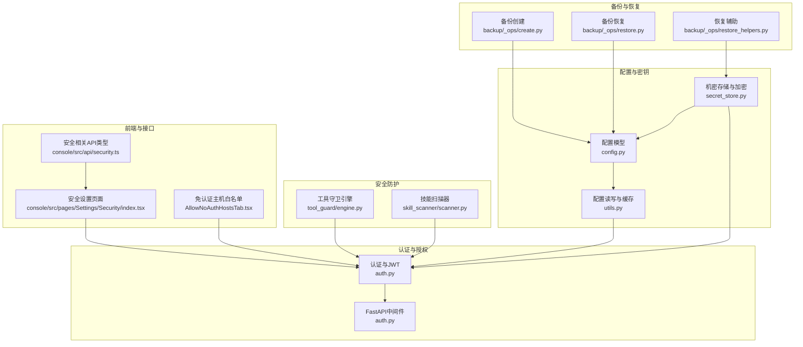
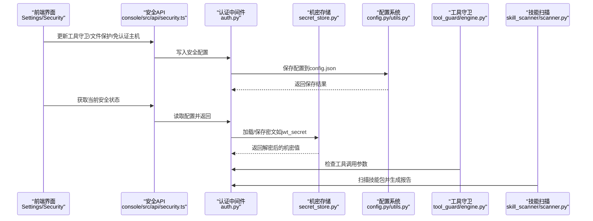
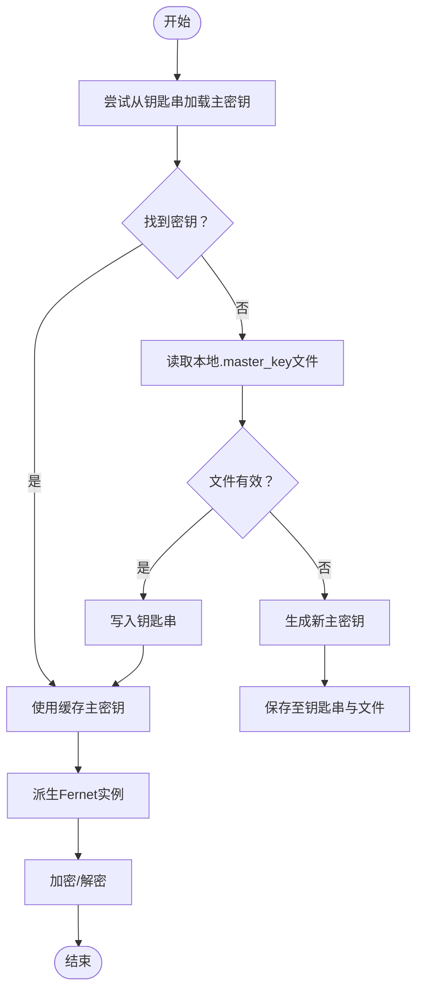
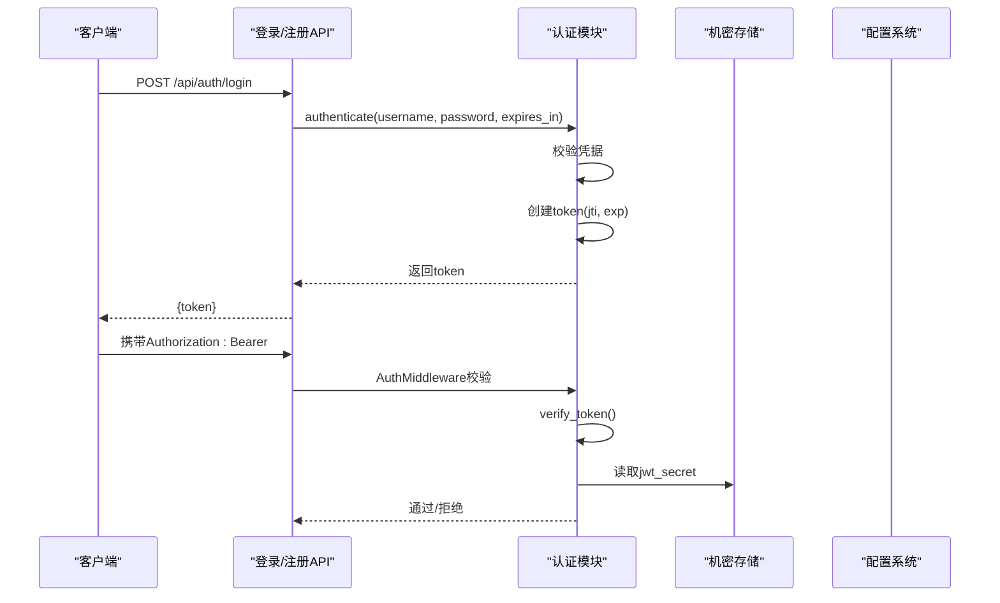
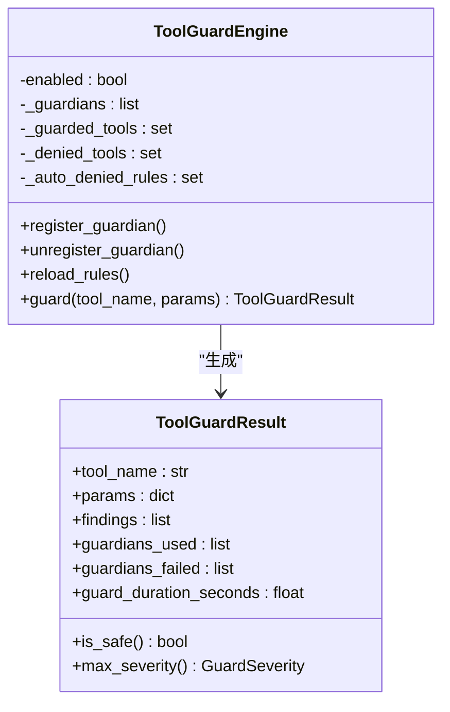
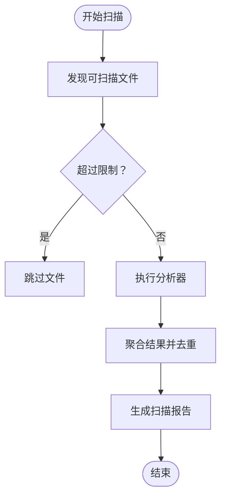
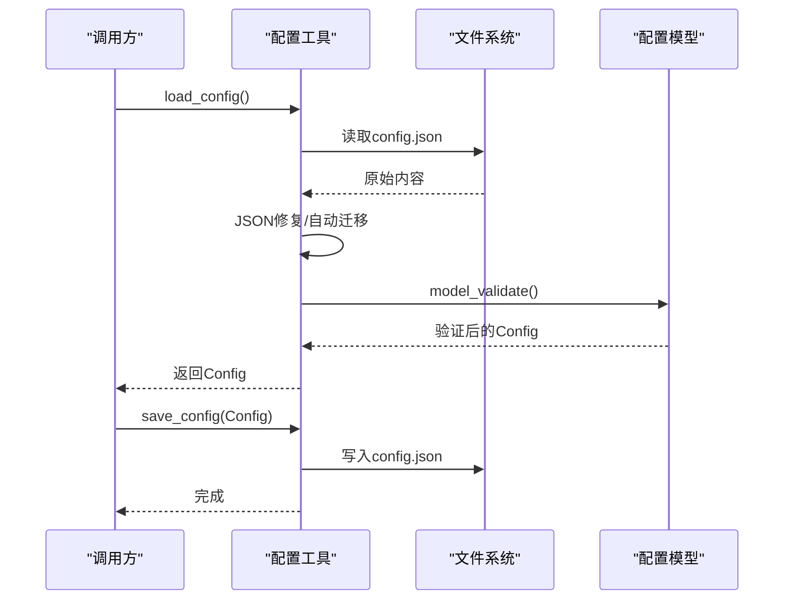
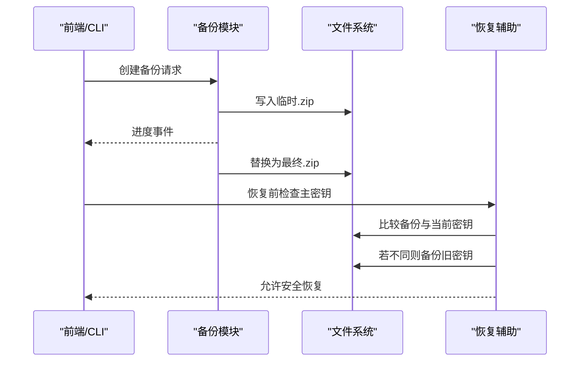
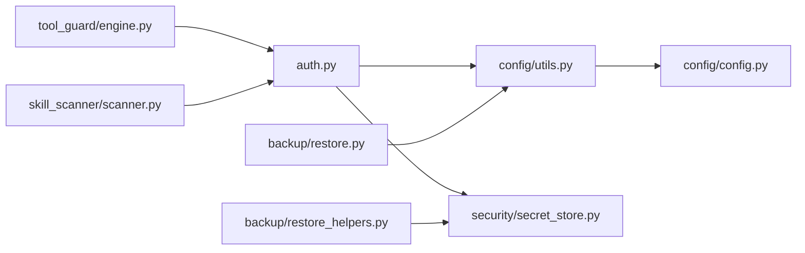

# 配置安全与权限

<cite>
**本文档引用的文件**
- [secret_store.py](file://src/qwenpaw/security/secret_store.py)
- [auth.py](file://src/qwenpaw/app/auth.py)
- [engine.py](file://src/qwenpaw/security/tool_guard/engine.py)
- [scanner.py](file://src/qwenpaw/security/skill_scanner/scanner.py)
- [config.py](file://src/qwenpaw/config/config.py)
- [utils.py](file://src/qwenpaw/config/utils.py)
- [security.ts](file://console/src/api/modules/security.ts)
- [index.tsx](file://console/src/pages/Settings/Security/index.tsx)
- [AllowNoAuthHostsTab.tsx](file://console/src/pages/Settings/Security/components/AllowNoAuthHostsTab.tsx)
- [create.py](file://src/qwenpaw/backup/_ops/create.py)
- [restore.py](file://src/qwenpaw/backup/_ops/restore.py)
- [restore_helpers.py](file://src/qwenpaw/backup/_ops/restore_helpers.py)
- [SECURITY.md](file://SECURITY.md)
</cite>

## 目录
1. [简介](#简介)
2. [项目结构](#项目结构)
3. [核心组件](#核心组件)
4. [架构总览](#架构总览)
5. [详细组件分析](#详细组件分析)
6. [依赖关系分析](#依赖关系分析)
7. [性能考虑](#性能考虑)
8. [故障排查指南](#故障排查指南)
9. [结论](#结论)
10. [附录](#附录)

## 简介
本文件面向QwenPaw的配置安全与权限控制系统，系统性阐述配置文件的安全存储、访问控制与权限管理机制，覆盖敏感配置项的加密存储、密钥管理与安全传输，以及配置访问的权限控制、身份认证与审计日志。同时提供配置安全最佳实践、威胁分析与防护措施，包含配置泄露检测方法、应急响应与恢复策略，以及配置备份的安全性保障与跨环境安全传输方案。

## 项目结构
围绕配置安全与权限控制的关键模块包括：
- 密钥与机密存储：基于对称加密的机密存储层，支持主密钥在操作系统钥匙串与本地文件之间的双路径持久化。
- 认证与授权：基于JWT的令牌签发与校验，支持令牌撤销与密码轮换；中间件实现API访问控制。
- 工具调用安全：工具守卫引擎与规则集，阻断高危参数与路径访问。
- 技能扫描：对技能包进行静态扫描，识别潜在风险。
- 配置管理：配置模型与加载/保存流程，含缓存与容错修复。
- 备份与恢复：备份时可选择包含/排除敏感信息，恢复时处理主密钥冲突与一致性。

**图表来源**
- [config.py:1-200](file://src/qwenpaw/config/config.py#L1-L200)
- [utils.py:586-686](file://src/qwenpaw/config/utils.py#L586-L686)
- [secret_store.py:234-268](file://src/qwenpaw/security/secret_store.py#L234-L268)
- [auth.py:115-164](file://src/qwenpaw/app/auth.py#L115-L164)
- [engine.py:54-110](file://src/qwenpaw/security/tool_guard/engine.py#L54-L110)
- [scanner.py:76-110](file://src/qwenpaw/security/skill_scanner/scanner.py#L76-L110)
- [security.ts:1-172](file://console/src/api/modules/security.ts#L1-L172)
- [index.tsx:124-168](file://console/src/pages/Settings/Security/index.tsx#L124-L168)
- [AllowNoAuthHostsTab.tsx:26-48](file://console/src/pages/Settings/Security/components/AllowNoAuthHostsTab.tsx#L26-L48)
- [create.py:21-81](file://src/qwenpaw/backup/_ops/create.py#L21-L81)
- [restore.py:468-518](file://src/qwenpaw/backup/_ops/restore.py#L468-L518)
- [restore_helpers.py:111-146](file://src/qwenpaw/backup/_ops/restore_helpers.py#L111-L146)

**章节来源**
- [config.py:1-200](file://src/qwenpaw/config/config.py#L1-L200)
- [utils.py:586-686](file://src/qwenpaw/config/utils.py#L586-L686)

## 核心组件
- 机密存储与加密（secret_store.py）
  - 提供透明的加密/解密能力，使用带前缀的密文标识，支持从OS钥匙串或本地文件读取主密钥，确保密文在磁盘上不可读。
  - 支持主密钥热重载与恢复后同步，避免因备份恢复导致的密钥不一致。
- 认证与授权（auth.py）
  - 基于HMAC-SHA256的JWT签名与校验，支持自定义有效期与永久令牌；令牌撤销采用jti黑名单；密码轮换触发JWT密钥旋转。
  - 中间件按路径与来源主机白名单跳过认证，其余/API路由统一鉴权。
- 工具守卫引擎（tool_guard/engine.py）
  - 组织并执行多种守护器（路径检查、规则匹配、Shell规避检测），支持动态启用/禁用与规则重载。
- 技能扫描器（skill_scanner/scanner.py）
  - 对技能目录进行静态扫描，去重与聚合结果，限制文件数量与大小，防止路径穿越与大文件滥用。
- 配置管理（config.py, utils.py）
  - 使用Pydantic模型定义配置结构，提供读写缓存、自动修复与迁移、路径归一化等能力。
- 备份与恢复（backup/_ops）
  - 备份可选择包含/排除敏感数据；恢复时处理主密钥冲突并保留旧密钥以便解密历史密文。

**章节来源**
- [secret_store.py:234-370](file://src/qwenpaw/security/secret_store.py#L234-L370)
- [auth.py:115-164](file://src/qwenpaw/app/auth.py#L115-L164)
- [engine.py:54-110](file://src/qwenpaw/security/tool_guard/engine.py#L54-L110)
- [scanner.py:76-110](file://src/qwenpaw/security/skill_scanner/scanner.py#L76-L110)
- [config.py:1-200](file://src/qwenpaw/config/config.py#L1-L200)
- [utils.py:586-686](file://src/qwenpaw/config/utils.py#L586-L686)
- [create.py:21-81](file://src/qwenpaw/backup/_ops/create.py#L21-L81)
- [restore.py:468-518](file://src/qwenpaw/backup/_ops/restore.py#L468-L518)
- [restore_helpers.py:111-146](file://src/qwenpaw/backup/_ops/restore_helpers.py#L111-L146)

## 架构总览
下图展示配置安全与权限控制的整体交互：前端通过API调整安全策略，后端在认证中间件、机密存储、工具守卫与技能扫描之间形成闭环，配置文件与备份系统贯穿始终。

**图表来源**
- [security.ts:89-171](file://console/src/api/modules/security.ts#L89-L171)
- [index.tsx:124-168](file://console/src/pages/Settings/Security/index.tsx#L124-L168)
- [auth.py:567-641](file://src/qwenpaw/app/auth.py#L567-L641)
- [secret_store.py:234-370](file://src/qwenpaw/security/secret_store.py#L234-L370)
- [config.py:1-200](file://src/qwenpaw/config/config.py#L1-L200)
- [engine.py:200-258](file://src/qwenpaw/security/tool_guard/engine.py#L200-L258)
- [scanner.py:148-242](file://src/qwenpaw/security/skill_scanner/scanner.py#L148-L242)

## 详细组件分析

### 机密存储与加密（secret_store.py）
- 主密钥管理
  - 优先从OS钥匙串读取，失败则回退到本地文件（仅限受控环境）。
  - 双重缓存：进程内缓存与Fernet实例缓存，减少重复解密开销。
  - 支持容器/无桌面环境的降级策略，避免阻塞。
- 加密/解密
  - 使用带前缀的密文标识，解密失败时优雅降级返回原文，避免崩溃。
  - 支持批量字段加密/解密，用于配置文件中的敏感字段。
- 主密钥恢复同步
  - 备份恢复后可强制刷新缓存并同步钥匙串，确保新旧密钥一致。

**图表来源**
- [secret_store.py:234-370](file://src/qwenpaw/security/secret_store.py#L234-L370)

**章节来源**
- [secret_store.py:234-370](file://src/qwenpaw/security/secret_store.py#L234-L370)

### 认证与授权（auth.py）
- 登录与令牌
  - 支持自定义有效期与永久令牌；默认7天，最大100年。
  - 使用HMAC-SHA256签名，jti用于撤销控制。
- 令牌撤销
  - 采用jti黑名单；定期清理过期条目，避免无限增长。
  - 支持单个令牌撤销与全量撤销（密码轮换触发）。
- 中间件
  - 跳过公共路径与静态资源；仅对/API路由生效。
  - 支持免认证主机白名单，按客户端IP判断。
- 凭据更新
  - 密码变更会旋转JWT密钥，使旧令牌全部失效。

**图表来源**
- [auth.py:469-495](file://src/qwenpaw/app/auth.py#L469-L495)
- [auth.py:567-641](file://src/qwenpaw/app/auth.py#L567-L641)
- [secret_store.py:234-268](file://src/qwenpaw/security/secret_store.py#L234-L268)

**章节来源**
- [auth.py:115-164](file://src/qwenpaw/app/auth.py#L115-L164)
- [auth.py:469-495](file://src/qwenpaw/app/auth.py#L469-L495)
- [auth.py:567-641](file://src/qwenpaw/app/auth.py#L567-L641)

### 工具守卫引擎（tool_guard/engine.py）
- 规则与守护器
  - 默认包含路径检查、规则匹配与Shell规避检测三类守护器。
  - 支持动态注册/注销守护器与规则重载。
- 生效范围
  - 受配置控制：受保护工具集合、明确禁止工具、自动拒绝规则集。
- 结果聚合
  - 将各守护器发现的问题汇总为统一结果，记录耗时与失败守护器。

**图表来源**
- [engine.py:54-110](file://src/qwenpaw/security/tool_guard/engine.py#L54-L110)
- [engine.py:200-258](file://src/qwenpaw/security/tool_guard/engine.py#L200-L258)

**章节来源**
- [engine.py:54-110](file://src/qwenpaw/security/tool_guard/engine.py#L54-L110)
- [engine.py:200-258](file://src/qwenpaw/security/tool_guard/engine.py#L200-L258)

### 技能扫描器（skill_scanner/scanner.py）
- 文件发现与限制
  - 递归遍历技能目录，跳过符号链接与非文件；限制文件数量与大小，防止路径穿越与资源滥用。
- 分析器执行
  - 并行运行多个分析器，聚合结果并去重；记录失败分析器与耗时。
- 安全策略
  - 通过策略文件控制规则范围、严重级别与允许列表。

**图表来源**
- [scanner.py:248-299](file://src/qwenpaw/security/skill_scanner/scanner.py#L248-L299)
- [scanner.py:148-242](file://src/qwenpaw/security/skill_scanner/scanner.py#L148-L242)

**章节来源**
- [scanner.py:76-110](file://src/qwenpaw/security/skill_scanner/scanner.py#L76-L110)
- [scanner.py:148-242](file://src/qwenpaw/security/skill_scanner/scanner.py#L148-L242)
- [scanner.py:248-299](file://src/qwenpaw/security/skill_scanner/scanner.py#L248-L299)

### 配置管理（config.py, utils.py）
- 模型与验证
  - 使用Pydantic模型定义配置结构，支持字段迁移与自动修复。
- 缓存与容错
  - 基于mtime的缓存减少IO；读取时自动修复常见JSON问题并备份异常文件。
- 路径归一化
  - 将旧版工作目录绑定路径迁移到当前工作目录，保持兼容性。

**图表来源**
- [utils.py:586-686](file://src/qwenpaw/config/utils.py#L586-L686)
- [config.py:1-200](file://src/qwenpaw/config/config.py#L1-L200)

**章节来源**
- [utils.py:586-686](file://src/qwenpaw/config/utils.py#L586-L686)
- [config.py:1-200](file://src/qwenpaw/config/config.py#L1-L200)

### 备份与恢复（backup/_ops）
- 备份创建
  - 异步流式压缩，进度事件通过队列传递；原子写入临时文件后替换目标。
- 恢复策略
  - 支持全量与自定义模式；合并全局配置但保留本地代理档案。
  - 当备份中的主密钥与当前不一致时，将旧密钥备份到独立目录，避免解密失败。
- 安全提示
  - 备份文件可能包含敏感凭证，需妥善保管并避免共享。

**图表来源**
- [create.py:21-81](file://src/qwenpaw/backup/_ops/create.py#L21-L81)
- [restore.py:468-518](file://src/qwenpaw/backup/_ops/restore.py#L468-L518)
- [restore_helpers.py:111-146](file://src/qwenpaw/backup/_ops/restore_helpers.py#L111-L146)

**章节来源**
- [create.py:21-81](file://src/qwenpaw/backup/_ops/create.py#L21-L81)
- [restore.py:468-518](file://src/qwenpaw/backup/_ops/restore.py#L468-L518)
- [restore_helpers.py:111-146](file://src/qwenpaw/backup/_ops/restore_helpers.py#L111-L146)

## 依赖关系分析
- 组件耦合
  - 认证中间件依赖配置系统以读取免认证主机白名单；依赖机密存储以获取JWT密钥。
  - 工具守卫与技能扫描器通过配置系统加载规则与策略，不直接依赖认证层。
  - 备份/恢复模块与配置系统紧密耦合，确保恢复后配置一致性。
- 外部依赖
  - OS钥匙串（keyring）、Fernet对称加密库、FastAPI中间件栈。
- 循环依赖规避
  - 机密存储通过延迟导入避免与常量模块循环；配置工具通过函数式接口降低耦合。

**图表来源**
- [auth.py:621-626](file://src/qwenpaw/app/auth.py#L621-L626)
- [engine.py:46-51](file://src/qwenpaw/security/tool_guard/engine.py#L46-L51)
- [scanner.py:24-27](file://src/qwenpaw/security/skill_scanner/scanner.py#L24-L27)
- [utils.py:30-37](file://src/qwenpaw/config/utils.py#L30-L37)
- [create.py:14-16](file://src/qwenpaw/backup/_ops/create.py#L14-L16)
- [restore_helpers.py:129-130](file://src/qwenpaw/backup/_ops/restore_helpers.py#L129-L130)

**章节来源**
- [auth.py:621-626](file://src/qwenpaw/app/auth.py#L621-L626)
- [engine.py:46-51](file://src/qwenpaw/security/tool_guard/engine.py#L46-L51)
- [scanner.py:24-27](file://src/qwenpaw/security/skill_scanner/scanner.py#L24-L27)
- [utils.py:30-37](file://src/qwenpaw/config/utils.py#L30-L37)
- [create.py:14-16](file://src/qwenpaw/backup/_ops/create.py#L14-L16)
- [restore_helpers.py:129-130](file://src/qwenpaw/backup/_ops/restore_helpers.py#L129-L130)

## 性能考虑
- 解密缓存
  - 机密存储对主密钥与Fernet实例进行缓存，显著降低重复解密成本。
- 配置缓存
  - 基于mtime的内存缓存减少频繁读取磁盘的开销。
- 异步备份
  - 备份压缩在后台线程执行并通过异步队列传递事件，避免阻塞事件循环。
- 扫描限制
  - 技能扫描限制文件数量与大小，防止资源滥用与长时间扫描。

[本节为通用指导，无需具体文件分析]

## 故障排查指南
- 机密存储解密失败
  - 现象：解密抛出异常时返回原文，避免服务崩溃。
  - 排查：确认主密钥是否被更改或损坏；必要时通过恢复流程同步钥匙串。
- 认证失败或令牌无效
  - 现象：401未认证或令牌过期/被撤销。
  - 排查：检查令牌有效期、jti是否在黑名单、JWT密钥是否被轮换。
- 工具调用被阻断
  - 现象：工具守卫返回高危发现并阻断。
  - 排查：查看守护器结果与规则配置，调整工具范围或自定义规则。
- 技能扫描阻断
  - 现象：扫描器报告高危发现并阻止安装。
  - 排查：检查扫描策略、白名单与告警历史。
- 备份/恢复异常
  - 现象：主密钥不一致导致无法解密。
  - 排查：使用恢复辅助模块备份旧密钥并重新同步。

**章节来源**
- [secret_store.py:302-321](file://src/qwenpaw/security/secret_store.py#L302-L321)
- [auth.py:166-198](file://src/qwenpaw/app/auth.py#L166-L198)
- [engine.py:200-258](file://src/qwenpaw/security/tool_guard/engine.py#L200-L258)
- [scanner.py:148-242](file://src/qwenpaw/security/skill_scanner/scanner.py#L148-L242)
- [restore_helpers.py:111-146](file://src/qwenpaw/backup/_ops/restore_helpers.py#L111-L146)

## 结论
QwenPaw通过“机密存储+认证授权+工具守卫+技能扫描+配置管理+备份恢复”的多层安全体系，实现了对敏感配置与运行时数据的全面保护。系统在可用性与安全性之间取得平衡：既提供便捷的钥匙串集成与自动修复能力，又通过令牌撤销、规则化工具守卫与扫描策略强化边界控制。建议在生产环境中结合最小权限原则、严格通道与用户白名单、定期审查配置与技能，并妥善保管备份文件以满足合规与审计要求。

[本节为总结性内容，无需具体文件分析]

## 附录

### 最佳实践清单
- 密钥与机密
  - 使用OS钥匙串存储主密钥；若无钥匙串，确保.master_key文件权限为0o600。
  - 定期轮换JWT密钥与密码，触发全量令牌撤销。
- 认证与授权
  - 启用认证并限制公共路径；合理配置免认证主机白名单。
  - 为令牌设置合理有效期，避免长期有效令牌。
- 工具与技能
  - 启用工具守卫并审慎配置规则；对高危工具采取更严格策略。
  - 使用技能扫描器，建立白名单与阻断历史管理。
- 配置与备份
  - 将敏感信息置于机密存储中；避免将密钥放入工作目录或技能可访问路径。
  - 备份时根据需要选择包含/排除敏感数据；恢复前检查主密钥一致性。

[本节为通用指导，无需具体文件分析]

### 威胁分析与防护
- 威胁场景
  - 机密泄露：主密钥丢失或被窃取；令牌持久化不当。
  - 权限绕过：未认证访问、通道白名单滥用。
  - 工具滥用：命令注入、路径穿越、资源滥用。
  - 技能风险：恶意代码执行、敏感文件读取。
- 防护措施
  - 机密加密与最小暴露面；令牌撤销与密钥轮换。
  - 中间件与白名单双重控制；工具参数与路径规则化。
  - 技能扫描与白名单；配置自动修复与备份恢复一致性。

[本节为通用指导，无需具体文件分析]

### 应急响应与恢复
- 发现泄露
  - 立即轮换相关密钥与密码；撤销受影响令牌；检查工具守卫与扫描告警。
- 恢复操作
  - 使用备份恢复配置与机密；若主密钥不一致，按恢复辅助流程备份旧密钥并同步。
  - 恢复后验证机密解密与服务功能正常。

**章节来源**
- [SECURITY.md:65-118](file://SECURITY.md#L65-L118)
- [restore_helpers.py:111-146](file://src/qwenpaw/backup/_ops/restore_helpers.py#L111-L146)