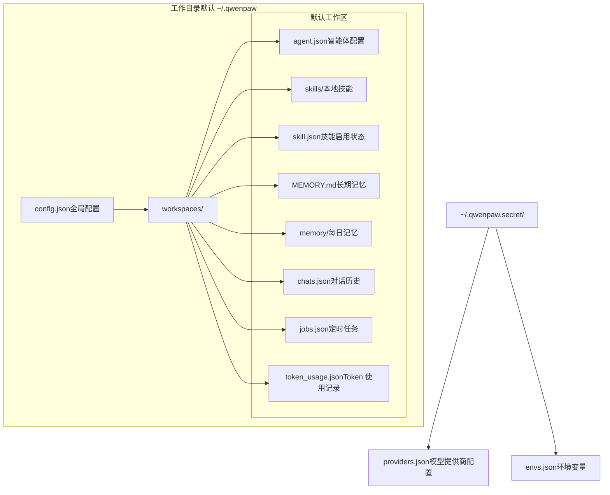
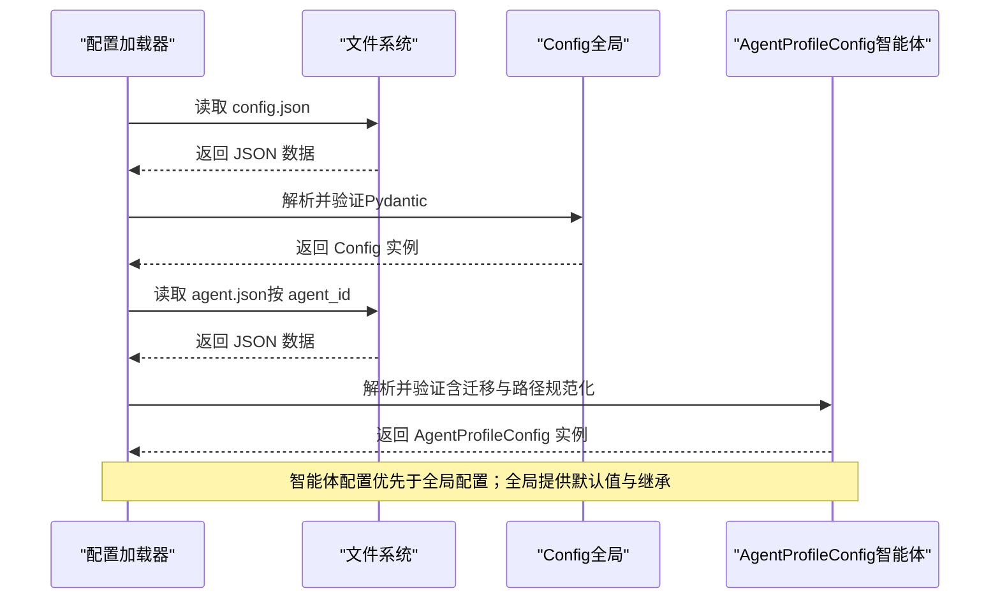
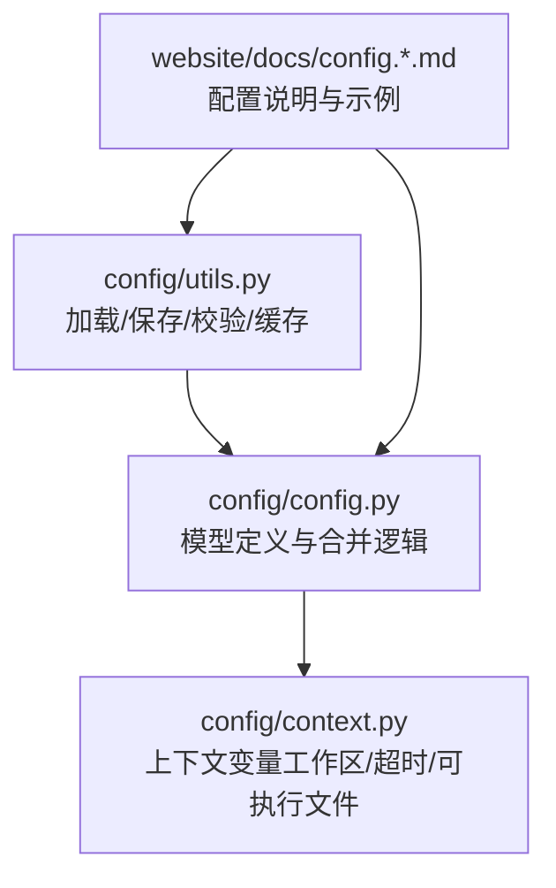

# 配置文件结构

<cite>
**本文引用的文件**
- [src/qwenpaw/config/config.py](file://src/qwenpaw/config/config.py)
- [src/qwenpaw/config/utils.py](file://src/qwenpaw/config/utils.py)
- [src/qwenpaw/config/context.py](file://src/qwenpaw/config/context.py)
- [website/public/docs/config.zh.md](file://website/public/docs/config.zh.md)
- [website/public/docs/config.en.md](file://website/public/docs/config.en.md)
</cite>

## 目录
1. [简介](#简介)
2. [项目结构](#项目结构)
3. [核心组件](#核心组件)
4. [架构总览](#架构总览)
5. [详细组件分析](#详细组件分析)
6. [依赖分析](#依赖分析)
7. [性能考虑](#性能考虑)
8. [故障排查指南](#故障排查指南)
9. [结论](#结论)
10. [附录](#附录)

## 简介
本文件面向 QwenPaw 的配置体系，系统化梳理全局配置文件 config.json 的结构与字段定义，涵盖全局配置、代理配置、通道配置、内存配置、运行时配置、安全配置、工具与 MCP 配置、计划模式、ACP 配置等关键层级，并解释字段的数据类型、默认值、取值范围与作用域。同时说明配置的层次结构、嵌套关系与继承机制，提供配置示例与最佳实践，以及版本兼容性与迁移指南。

## 项目结构
QwenPaw 的配置采用“全局配置 + 智能体配置”的双层结构：
- 全局配置：位于工作目录根下的 config.json，包含全局共享的模型提供商、智能体列表、全局设置等。
- 智能体配置：位于各智能体工作区下的 agent.json，包含该智能体的独立配置（通道、心跳、工具、MCP、安全等）。

图表来源
- [website/public/docs/config.zh.md:16-47](file://website/public/docs/config.zh.md#L16-L47)
- [website/public/docs/config.en.md:16-77](file://website/public/docs/config.en.md#L16-L77)

章节来源
- [website/public/docs/config.zh.md:16-47](file://website/public/docs/config.zh.md#L16-L47)
- [website/public/docs/config.en.md:16-77](file://website/public/docs/config.en.md#L16-L77)

## 核心组件
本节概述 config.json 的核心组成与职责：
- 全局配置容器：Config（根配置对象）
- 代理与智能体：AgentsConfig（包含 active_agent、profiles、默认运行参数等）
- 通道配置：ChannelConfig（内置通道集合，支持插件通道扩展）
- MCP 客户端：MCPConfig（MCP 客户端集合）
- 工具配置：ToolsConfig（内置工具集合）
- 安全配置：SecurityConfig（工具守卫、文件守卫、技能扫描）
- ACP 配置：ACPConfig（Agent Communication Protocol）
- 运行时配置：AgentsRunningConfig（上下文与记忆管理、LLM 重试与限流、Shell 执行等）
- 其他：LastApiConfig（上次 API 启动信息）、LastDispatchConfig（最近消息分发目标）、user_timezone（用户时区）

章节来源
- [src/qwenpaw/config/config.py:1734-1756](file://src/qwenpaw/config/config.py#L1734-L1756)
- [src/qwenpaw/config/config.py:1142-1187](file://src/qwenpaw/config/config.py#L1142-L1187)
- [src/qwenpaw/config/config.py:431-452](file://src/qwenpaw/config/config.py#L431-L452)
- [src/qwenpaw/config/config.py:1733-1756](file://src/qwenpaw/config/config.py#L1733-L1756)

## 架构总览
全局配置与智能体配置的加载与合并流程如下：

图表来源
- [src/qwenpaw/config/utils.py:586-624](file://src/qwenpaw/config/utils.py#L586-L624)
- [src/qwenpaw/config/config.py:1835-1943](file://src/qwenpaw/config/config.py#L1835-L1943)

章节来源
- [src/qwenpaw/config/utils.py:586-624](file://src/qwenpaw/config/utils.py#L586-L624)
- [src/qwenpaw/config/config.py:1835-1943](file://src/qwenpaw/config/config.py#L1835-L1943)

## 详细组件分析

### 全局配置（config.json）
全局配置位于工作目录根，字段与语义如下：
- agents.active_agent：当前激活的智能体 ID（字符串，默认 "default"）
- agents.profiles：智能体配置引用字典（键为 agent_id），每个条目包含 id、name、description、enabled、workspace_dir 等
- last_api：上次 qwenpaw app 启动的主机与端口（host 可为空，port 可为空）
- show_tool_details：是否在频道消息中显示工具调用/返回详情（布尔，默认 true）
- user_timezone：IANA 时区名称（字符串，默认系统时区）
- last_dispatch：最近一次消息分发目标（channel、user_id、session_id），用于心跳 target="last"
- channels：内置通道集合（见下节）
- mcp：MCP 客户端集合
- tools：内置工具集合
- security：安全配置（工具守卫、文件守卫、技能扫描）
- acp：ACP（Agent Communication Protocol）配置
- plugins：插件配置字典（键为插件 ID，值为插件特定配置）

字段说明与默认值参考：
- agents.active_agent：字符串，默认 "default"
- agents.profiles：对象，默认 {}
- last_api.host：字符串或 null，默认 null
- last_api.port：整数或 null，默认 null
- show_tool_details：布尔，默认 true
- user_timezone：字符串，默认系统时区
- last_dispatch：对象或 null，默认 null
- channels：ChannelConfig 实例
- mcp：MCPConfig 实例
- tools：ToolsConfig 实例
- security：SecurityConfig 实例
- acp：ACPConfig 实例
- plugins：字典，默认 {}

章节来源
- [website/public/docs/config.zh.md:105-164](file://website/public/docs/config.zh.md#L105-L164)
- [website/public/docs/config.en.md:146-204](file://website/public/docs/config.en.md#L146-L204)
- [src/qwenpaw/config/config.py:1734-1756](file://src/qwenpaw/config/config.py#L1734-L1756)

### 代理与智能体配置（AgentsConfig）
- active_agent：当前激活的智能体 ID（字符串）
- profiles：智能体引用字典（键为 agent_id），每个条目包含 id、name、description、enabled、workspace_dir
- defaults：遗留字段（AgentsDefaultsConfig），包含 heartbeat 等默认设置
- running：全局运行时配置（AgentsRunningConfig），影响所有智能体
- llm_routing：全局 LLM 路由配置（AgentsLLMRoutingConfig）
- language：默认语言（字符串，默认 "zh"）
- system_prompt_files：默认系统提示词文件列表（数组，默认包含 AGENTS.md、SOUL.md、PROFILE.md）
- audio_mode：音频/语音处理模式（"auto" 或 "native"，默认 "auto"）

章节来源
- [src/qwenpaw/config/config.py:1142-1187](file://src/qwenpaw/config/config.py#L1142-L1187)
- [website/public/docs/config.en.md:189-198](file://website/public/docs/config.en.md#L189-L198)
- [website/public/docs/config.zh.md:149-158](file://website/public/docs/config.zh.md#L149-L158)

### 通道配置（ChannelConfig）
ChannelConfig 为内置通道集合，支持插件通道扩展。内置通道包括：
- console：控制台（默认启用）
- dingtalk：钉钉
- feishu：飞书/Lark
- discord：Discord
- telegram：Telegram
- qq：QQ 机器人
- imessage：iMessage（macOS）
- mattermost：Mattermost
- matrix：Matrix
- wecom：企业微信
- wechat：微信个人（iLink）
- xiaoyi：华为小艺
- mqtt：MQTT
- voice：Voice
- sip：SIP 语音
- onebot：OneBot v11（反向 WebSocket）

每个通道具有通用字段（如 enabled、bot_prefix、dm_policy、group_policy、allow_from、deny_message、require_mention 等）与通道专属字段（如钉钉的 client_id/client_secret、飞书的 app_id/app_secret、Telegram 的 bot_token/http_proxy 等）。

章节来源
- [src/qwenpaw/config/config.py:431-452](file://src/qwenpaw/config/config.py#L431-L452)
- [website/public/docs/config.zh.md:253-279](file://website/public/docs/config.zh.md#L253-L279)
- [website/public/docs/config.en.md:293-331](file://website/public/docs/config.en.md#L293-L331)

### MCP 客户端配置（MCPConfig）
MCP（模型上下文协议）允许智能体连接外部服务（如 Filesystem、Git、SQLite 等 MCP 服务器）。每个 MCP 客户端包含名称、启用状态、传输方式（stdio/HTTP/SSE）、启动命令或 URL 等字段。MCP 客户端集合存储在 mcp.clients 下。

章节来源
- [website/public/docs/config.en.md:322-331](file://website/public/docs/config.en.md#L322-L331)
- [website/public/docs/config.zh.md:282-291](file://website/public/docs/config.zh.md#L282-L291)

### 工具配置（ToolsConfig）
控制智能体可用的内置工具。每个工具可以单独启用/禁用，配置是否显示给用户，以及是否异步执行。工具配置位于 tools.builtin_tools。

章节来源
- [website/public/docs/config.en.md:525-532](file://website/public/docs/config.en.md#L525-L532)
- [website/public/docs/config.zh.md:461-468](file://website/public/docs/config.zh.md#L461-L468)

### 安全配置（SecurityConfig）
包含三个防护模块：
- tool_guard：工具守卫（运行时检测危险命令和注入攻击）
- file_guard：文件守卫（保护敏感文件访问）
- skill_scanner：技能扫描器（技能启用前扫描恶意代码）
顶层字段 allow_no_auth_hosts：IP 白名单，绕过 Web 登录认证（默认允许 localhost）

章节来源
- [website/public/docs/config.en.md:535-552](file://website/public/docs/config.en.md#L535-L552)
- [website/public/docs/config.zh.md:471-488](file://website/public/docs/config.zh.md#L471-L488)

### ACP 配置（ACPConfig）
ACP（Agent Communication Protocol）配置，包含 agents 字典，键为 ACP 代理名称，值为 ACPAgentConfig。默认包含 opencode、qwen_code、claude_code、codex 等预设代理。

章节来源
- [src/qwenpaw/config/config.py:104-118](file://src/qwenpaw/config/config.py#L104-L118)
- [src/qwenpaw/config/config.py:55-101](file://src/qwenpaw/config/config.py#L55-L101)

### 运行时配置（AgentsRunningConfig）
控制智能体运行行为、重试策略、上下文管理与记忆配置：
- max_iters：ReAct Agent 推理-执行循环的最大轮数（整数，默认 100）
- shell_command_timeout：execute_shell_command 的默认超时时间（浮点数，默认 60.0）
- shell_command_executable：执行 Shell 命令的可执行文件路径（字符串，默认空）
- auto_continue_on_text_only：当模型只返回文本而不调用工具时，自动重试的开关（布尔，默认 false）
- llm_retry_enabled：是否对瞬时 LLM API 错误自动重试（布尔，默认 true）
- llm_max_retries：瞬时 LLM API 错误的最大重试次数（整数，默认 3）
- llm_backoff_base：指数退避的基础等待时间（秒，≥ 0.1，默认 1.0）
- llm_backoff_cap：退避等待时间上限（秒，≥ 0.5 且 ≥ base，默认 10.0）
- llm_max_concurrent：最大并发 LLM 调用数（跨所有智能体共享，默认 10）
- llm_max_qpm：每分钟最大请求数限制（QPM，0 表示不限制，默认 600）
- llm_rate_limit_pause：收到 429 限流响应后的全局暂停时间（秒，默认 5.0）
- llm_rate_limit_jitter：限流暂停的随机抖动范围（秒，默认 1.0）
- llm_acquire_timeout：等待获取限流槽的最大超时时间（秒，默认 300.0）
- max_input_length：模型上下文窗口的最大输入长度（token，≥ 1000，默认 131072）
- history_max_length：/history 命令输出的最大长度（字符，默认 10000）
- context_manager_backend：上下文管理器后端类型（字符串，默认 "light"）
- memory_manager_backend：记忆管理器后端类型（字符串，默认 "remelight"）
- light_context_config：Light 上下文管理器配置
- reme_light_memory_config：ReMeLight 记忆管理器配置

章节来源
- [website/public/docs/config.en.md:356-457](file://website/public/docs/config.en.md#L356-L457)
- [website/public/docs/config.zh.md:309-410](file://website/public/docs/config.zh.md#L309-L410)

### 记忆与检索配置（ReMeLight 与 Embedding）
- auto_memory_search_config：自动记忆搜索配置
  - enabled：是否在每轮对话时自动执行记忆搜索（布尔，默认 false）
  - max_results：自动搜索时最多返回的结果数（整数，默认 1）
  - min_score：自动搜索时的最低相关性分数阈值（0.0 - 1.0，默认 0.1）
  - timeout：自动搜索超时时间（秒，默认 10.0）
- embedding_model_config：Embedding 模型配置
  - backend：Embedding 后端类型（如 "openai"，默认 "openai"）
  - api_key：Embedding 提供商的 API Key（字符串，默认空）
  - base_url：自定义 API 地址（字符串，默认空）
  - model_name：Embedding 模型名称（字符串，默认空）
  - dimensions：Embedding 向量维度（整数，默认 1024）
  - enable_cache：是否启用 Embedding 缓存（布尔，默认 true）
  - use_dimensions：是否使用自定义维度（布尔，默认 false）
  - max_cache_size：最大缓存大小（整数，默认 3000）
  - max_input_length：Embedding 的最大输入长度（整数，默认 8192）
  - max_batch_size：批处理的最大批量大小（整数，默认 10）

章节来源
- [website/public/docs/config.en.md:420-455](file://website/public/docs/config.en.md#L420-L455)
- [website/public/docs/config.zh.md:373-408](file://website/public/docs/config.zh.md#L373-L408)

### 心跳配置（HeartbeatConfig）
- enabled：是否启用心跳功能（布尔，默认 false）
- every：运行间隔（字符串，支持 Nh/Nm/Ns 组合，如 "1h"、"30m"、"2h30m"、"90s"，默认 "30m"）
- target：运行目标（字符串，默认 "main"；"last" 表示把结果发到最后一个发消息的频道/用户）
- activeHours：可选活跃时段（对象，包含 start/end 时间，24 小时制，默认 null）

章节来源
- [website/public/docs/config.en.md:334-353](file://website/public/docs/config.en.md#L334-L353)
- [website/public/docs/config.zh.md:294-306](file://website/public/docs/config.zh.md#L294-L306)

### 计划模式配置（plan）
- enabled：是否启用计划模式（布尔，默认 false）

章节来源
- [website/public/docs/config.en.md:443-450](file://website/public/docs/config.en.md#L443-L450)
- [website/public/docs/config.zh.md:443-450](file://website/public/docs/config.zh.md#L443-L450)

### 最近一次消息分发目标（last_dispatch）
- channel：频道名称（字符串，默认 ""）
- user_id：该频道中的用户 ID（字符串，默认 ""）
- session_id：会话/对话 ID（字符串，默认 ""）

章节来源
- [website/public/docs/config.en.md:555-566](file://website/public/docs/config.en.md#L555-L566)
- [website/public/docs/config.zh.md:491-502](file://website/public/docs/config.zh.md#L491-L502)

### 用户时区（user_timezone）
- user_timezone：IANA 时区名称（字符串，默认系统时区），用于显示当前时间、get_current_time 工具、默认 Cron 时区、心跳活跃时段评估。

章节来源
- [website/public/docs/config.en.md:477-491](file://website/public/docs/config.en.md#L477-L491)
- [website/public/docs/config.zh.md:477-491](file://website/public/docs/config.zh.md#L477-L491)

## 依赖分析
配置加载与缓存依赖关系如下：

图表来源
- [src/qwenpaw/config/utils.py:586-624](file://src/qwenpaw/config/utils.py#L586-L624)
- [src/qwenpaw/config/config.py:1734-1756](file://src/qwenpaw/config/config.py#L1734-L1756)
- [src/qwenpaw/config/context.py:1-108](file://src/qwenpaw/config/context.py#L1-L108)
- [website/public/docs/config.en.md:139-139](file://website/public/docs/config.en.md#L139-L139)
- [website/public/docs/config.zh.md:98-98](file://website/public/docs/config.zh.md#L98-L98)

章节来源
- [src/qwenpaw/config/utils.py:586-624](file://src/qwenpaw/config/utils.py#L586-L624)
- [src/qwenpaw/config/config.py:1734-1756](file://src/qwenpaw/config/config.py#L1734-L1756)
- [src/qwenpaw/config/context.py:1-108](file://src/qwenpaw/config/context.py#L1-L108)
- [website/public/docs/config.en.md:139-139](file://website/public/docs/config.en.md#L139-L139)
- [website/public/docs/config.zh.md:98-98](file://website/public/docs/config.zh.md#L98-L98)

## 性能考虑
- 配置缓存：全局与智能体配置均采用基于 mtime 的缓存，减少磁盘 IO（见 utils.load_config 与 agent 配置缓存）。
- JSON 修复：加载时使用 json_repair 修复常见语法问题（如尾随逗号、缺失引号、注释、BOM 等），并在必要时备份原文件。
- 路径规范化：将旧的 ~/.copaw 路径映射到当前 WORKING_DIR，确保跨版本兼容。
- 热加载：智能体配置每 2 秒自动检测变更，修改后自动重载，无需重启。
- 记忆与检索：Embedding 缓存与批处理参数可显著降低向量化成本；ReMeLight 的自动记忆搜索与索引重建策略需结合业务负载权衡。

章节来源
- [src/qwenpaw/config/utils.py:41-86](file://src/qwenpaw/config/utils.py#L41-L86)
- [src/qwenpaw/config/utils.py:467-500](file://src/qwenpaw/config/utils.py#L467-L500)
- [src/qwenpaw/config/utils.py:586-624](file://src/qwenpaw/config/utils.py#L586-L624)
- [website/public/docs/config.en.md:318-318](file://website/public/docs/config.en.md#L318-L318)

## 故障排查指南
- 配置文件损坏或语法错误：加载器会尝试自动修复 JSON 并记录警告；若无法修复，将备份原文件并回退到默认配置。
- 字段校验失败：加载器会尝试移除导致错误的字段并重新验证；若仍失败，同样备份并回退。
- 旧版字段兼容：自动迁移 legacy weixin → wechat；支持 legacy last_api_host/last_api_port → last_api；支持 legacy ~/.copaw 路径映射。
- 代理 ID 校验：智能体 ID 需满足长度、字符集、保留词与唯一性要求；违反规则会抛出异常。
- 环境变量：通过 QWENPAW_WORKING_DIR、QWENPAW_SECRET_DIR 等环境变量自定义路径；敏感配置（providers.json、envs.json）位于 ~/.qwenpaw.secret。

章节来源
- [src/qwenpaw/config/utils.py:447-500](file://src/qwenpaw/config/utils.py#L447-L500)
- [src/qwenpaw/config/utils.py:548-583](file://src/qwenpaw/config/utils.py#L548-L583)
- [src/qwenpaw/config/config.py:150-189](file://src/qwenpaw/config/config.py#L150-L189)
- [website/public/docs/config.en.md:84-127](file://website/public/docs/config.en.md#L84-L127)
- [website/public/docs/config.zh.md:53-96](file://website/public/docs/config.zh.md#L53-L96)

## 结论
QwenPaw 的配置体系以 Pydantic 模型为核心，通过严格的字段定义与默认值保障一致性；全局配置提供默认值与继承，智能体配置实现独立化与热加载；通道、MCP、工具、安全、记忆等模块化设计便于扩展与维护。遵循本文档的字段定义、最佳实践与迁移指南，可有效提升配置的稳定性与可维护性。

## 附录

### 配置优先级与继承机制
- 智能体配置（agent.json）优先于全局配置（config.json）；当同一字段在两者同时存在时，系统使用智能体配置的值。
- 全局配置提供默认值与继承：当智能体配置缺失某字段时，系统会回退到全局配置的对应字段。
- 旧版遗留字段（如 channels、mcp、tools、security）在新版本中仍保留，以支持降级兼容。

章节来源
- [website/public/docs/config.en.md:199-202](file://website/public/docs/config.en.md#L199-L202)
- [website/public/docs/config.zh.md:159-162](file://website/public/docs/config.zh.md#L159-L162)

### 版本兼容性与迁移指南
- v0.1.0 起引入多智能体结构：全局 config.json 与各智能体 workspaces/{agent_id}/agent.json 分离。
- 自动迁移：将旧版单智能体配置迁移到新结构；保留遗留字段以支持降级。
- 通道键迁移：channels.weixin → channels.wechat；迁移后会重写磁盘文件，后续加载直接使用规范键。
- 路径迁移：将旧的 ~/.copaw 路径映射到当前 WORKING_DIR。

章节来源
- [website/public/docs/config.en.md:9-13](file://website/public/docs/config.en.md#L9-L13)
- [src/qwenpaw/config/config.py:1993-2128](file://src/qwenpaw/config/config.py#L1993-L2128)
- [src/qwenpaw/config/utils.py:502-546](file://src/qwenpaw/config/utils.py#L502-L546)
- [src/qwenpaw/config/utils.py:1926-1936](file://src/qwenpaw/config/utils.py#L1926-L1936)

### 配置文件示例与最佳实践
- 示例：参考文档中的 config.json 与 agent.json 示例片段，按需增删字段。
- 最佳实践：
  - 将所有配置集中在各智能体的 agent.json 中，避免混杂在全局配置。
  - 合理设置运行时参数（如 max_input_length、llm_max_concurrent、llm_max_qpm）以平衡性能与成本。
  - 记忆与检索：根据业务场景开启自动记忆搜索与索引重建；合理设置 Embedding 维度与缓存参数。
  - 安全：启用工具守卫与技能扫描；谨慎配置 allow_no_auth_hosts。
  - 通道：按需启用通道并配置访问控制策略（dm_policy/group_policy/allow_from）。
  - 时区：统一配置 user_timezone，确保时间相关功能一致。

章节来源
- [website/public/docs/config.en.md:150-175](file://website/public/docs/config.en.md#L150-L175)
- [website/public/docs/config.en.md:210-285](file://website/public/docs/config.en.md#L210-L285)
- [website/public/docs/config.zh.md:109-135](file://website/public/docs/config.zh.md#L109-L135)
- [website/public/docs/config.zh.md:170-245](file://website/public/docs/config.zh.md#L170-L245)