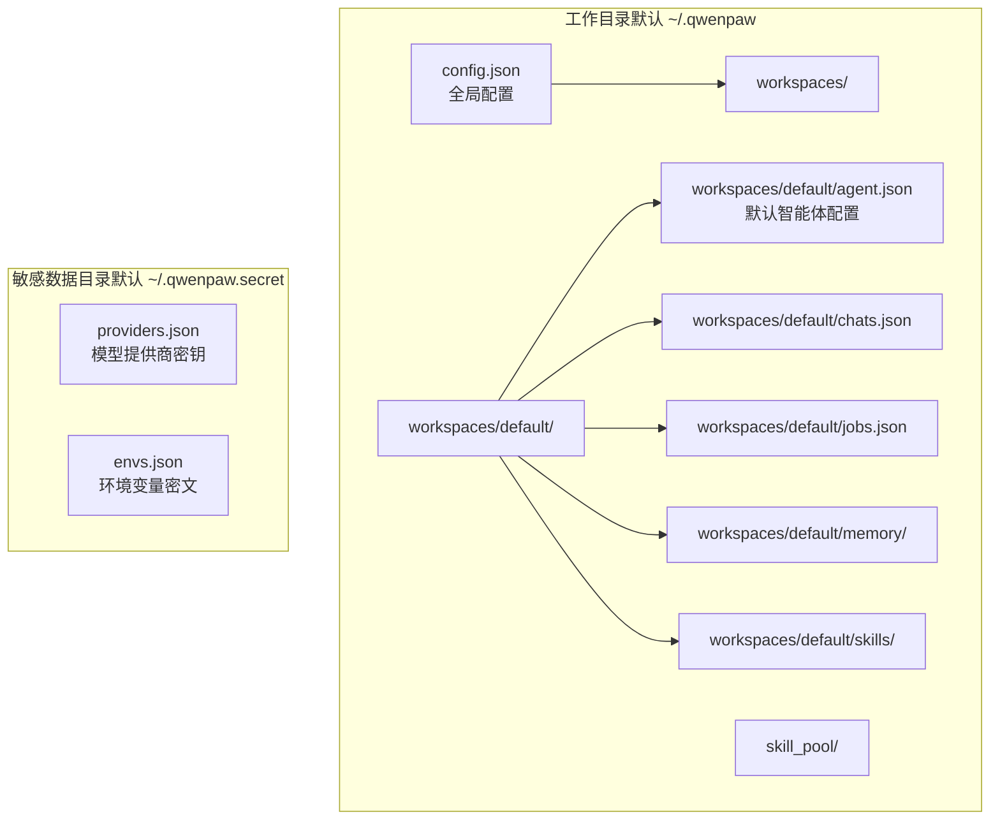
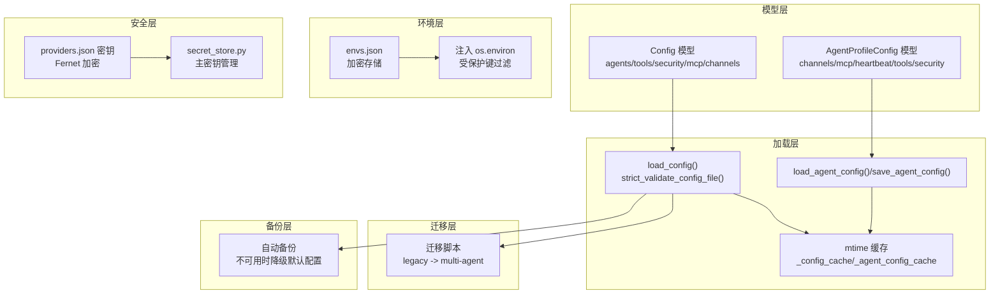
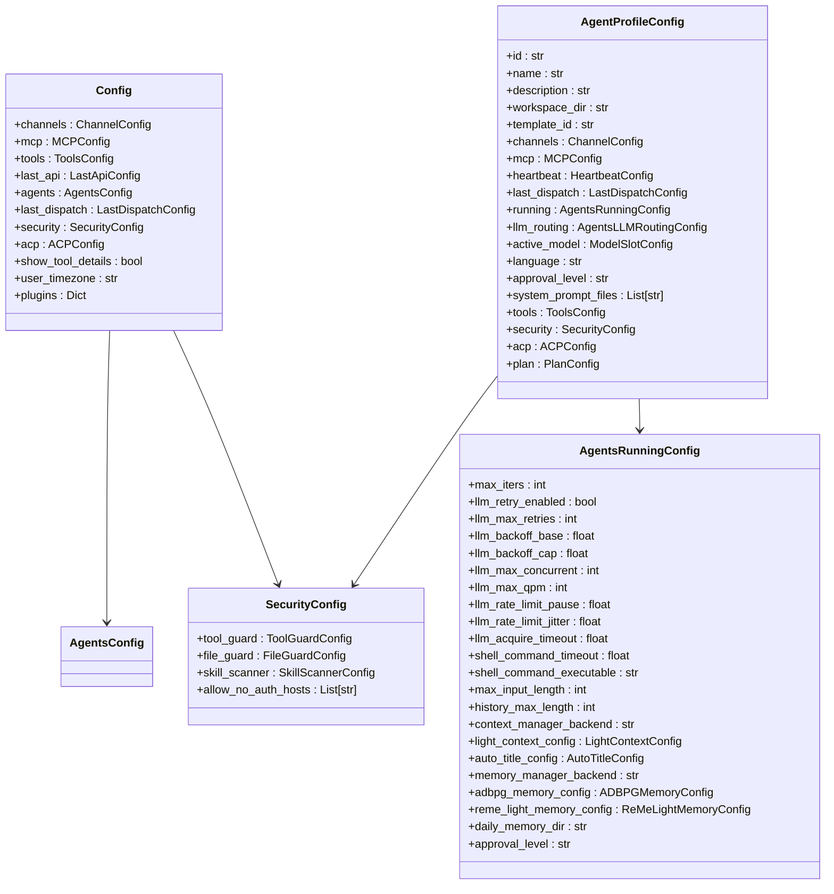
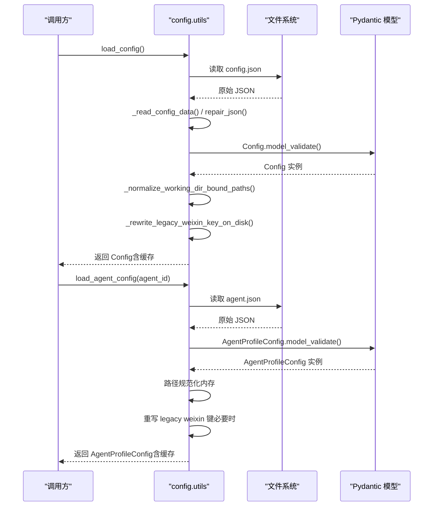
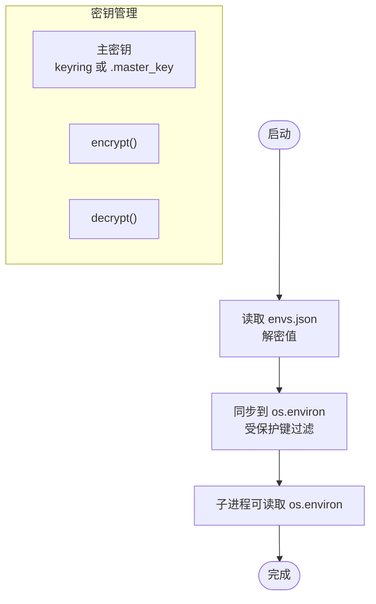
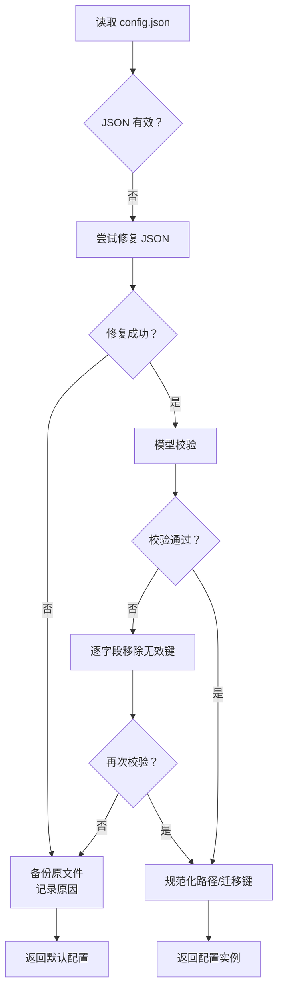
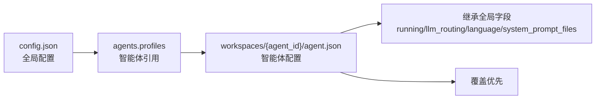
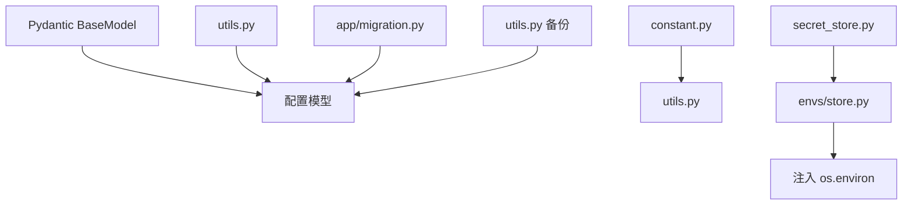

# 配置管理

<cite>
**本文引用的文件**
- [config.py](file://src/qwenpaw/config/config.py)
- [utils.py](file://src/qwenpaw/config/utils.py)
- [context.py](file://src/qwenpaw/config/context.py)
- [store.py](file://src/qwenpaw/envs/store.py)
- [constant.py](file://src/qwenpaw/constant.py)
- [migration.py](file://src/qwenpaw/app/migration.py)
- [config.zh.md](file://website/public/docs/config.zh.md)
- [secret_store.py](file://src/qwenpaw/security/secret_store.py)
</cite>

## 目录
1. [简介](#简介)
2. [项目结构](#项目结构)
3. [核心组件](#核心组件)
4. [架构总览](#架构总览)
5. [详细组件分析](#详细组件分析)
6. [依赖关系分析](#依赖关系分析)
7. [性能考量](#性能考量)
8. [故障排除指南](#故障排除指南)
9. [结论](#结论)
10. [附录](#附录)

## 简介
本文件系统性阐述 QwenPaw 的配置管理系统，涵盖配置文件结构、环境变量管理、动态配置更新、配置验证与迁移、配置备份与恢复、工作目录布局、配置优先级与继承关系、配置项清单与默认值、安全与权限控制、敏感信息保护、故障排除与性能优化建议。内容以源码为依据，并辅以官方文档说明，确保技术细节准确、可操作性强。

## 项目结构
QwenPaw 的配置体系围绕“工作目录”展开，采用“全局配置 + 多智能体独立配置”的双层结构：
- 全局配置（config.json）：模型提供商、智能体列表、全局设置
- 智能体配置（workspaces/{agent_id}/agent.json）：每个智能体的独立配置（频道、心跳、工具、MCP、安全等）

工作目录与敏感数据目录可通过环境变量定制，支持容器化部署与多平台路径解析。

**图示来源**
- [config.zh.md:18-47](file://website/public/docs/config.zh.md#L18-L47)

**章节来源**
- [config.zh.md:16-47](file://website/public/docs/config.zh.md#L16-L47)

## 核心组件
- 配置模型与验证：基于 Pydantic 的强类型模型，提供字段校验、别名映射、默认值与迁移逻辑
- 配置加载与缓存：带 mtime 的内存缓存，减少磁盘 IO
- 配置持久化：严格序列化，保持字段别名与兼容性
- 动态配置更新：按需热加载，支持频道与运行配置的即时生效
- 环境变量管理：安全存储与注入，支持密文透明解密
- 配置迁移：从单智能体到多智能体结构的平滑迁移
- 配置备份与恢复：自动备份、错误降级与恢复流程

**章节来源**
- [config.py:1734-1756](file://src/qwenpaw/config/config.py#L1734-L1756)
- [utils.py:586-686](file://src/qwenpaw/config/utils.py#L586-L686)
- [store.py:142-221](file://src/qwenpaw/envs/store.py#L142-L221)
- [migration.py:56-228](file://src/qwenpaw/app/migration.py#L56-L228)

## 架构总览
配置系统由“模型层 + 加载层 + 环境层 + 安全层 + 迁移层 + 备份层”构成，形成闭环的配置生命周期。

**图示来源**
- [config.py:1734-1756](file://src/qwenpaw/config/config.py#L1734-L1756)
- [utils.py:586-686](file://src/qwenpaw/config/utils.py#L586-L686)
- [store.py:142-221](file://src/qwenpaw/envs/store.py#L142-L221)
- [secret_store.py:293-327](file://src/qwenpaw/security/secret_store.py#L293-L327)
- [migration.py:56-228](file://src/qwenpaw/app/migration.py#L56-L228)

## 详细组件分析

### 配置模型与字段
- 全局配置（Config）：channels、mcp、tools、last_api、agents、last_dispatch、security、acp、show_tool_details、user_timezone、plugins
- 智能体配置（AgentProfileConfig）：id、name、description、workspace_dir、template_id、channels、mcp、heartbeat、last_dispatch、running、llm_routing、active_model、language、approval_level、system_prompt_files、tools、security、acp、plan
- 运行配置（AgentsRunningConfig）：max_iters、llm_retry_enabled、llm_max_retries、llm_backoff_base、llm_backoff_cap、llm_max_concurrent、llm_max_qpm、llm_rate_limit_pause、llm_rate_limit_jitter、llm_acquire_timeout、shell_command_timeout、shell_command_executable、max_input_length、history_max_length、context_manager_backend、light_context_config、auto_title_config、memory_manager_backend、adbpg_memory_config、reme_light_memory_config、daily_memory_dir、approval_level
- 安全配置（SecurityConfig）：tool_guard、file_guard、skill_scanner、allow_no_auth_hosts
- 环境变量（EnvVarLoader）：统一读取与类型转换，支持 COPAW/QWENPAW 兼容键

**图示来源**
- [config.py:1734-1756](file://src/qwenpaw/config/config.py#L1734-L1756)
- [config.py:1060-1141](file://src/qwenpaw/config/config.py#L1060-L1141)
- [config.py:818-1004](file://src/qwenpaw/config/config.py#L818-L1004)
- [config.py:1715-1732](file://src/qwenpaw/config/config.py#L1715-L1732)

**章节来源**
- [config.py:1734-1756](file://src/qwenpaw/config/config.py#L1734-L1756)
- [config.py:1060-1141](file://src/qwenpaw/config/config.py#L1060-L1141)
- [config.py:818-1004](file://src/qwenpaw/config/config.py#L818-L1004)
- [config.py:1715-1732](file://src/qwenpaw/config/config.py#L1715-L1732)

### 配置加载与缓存
- load_config：读取并解析 config.json，支持 JSON 修复、字段迁移、路径规范化、mtime 缓存
- strict_validate_config_file：严格校验，便于诊断
- load_agent_config/save_agent_config：按智能体粒度缓存与持久化
- get_config_path/get_heartbeat_query_path：路径解析与定位

**图示来源**
- [utils.py:586-686](file://src/qwenpaw/config/utils.py#L586-L686)
- [utils.py:1835-1944](file://src/qwenpaw/config/utils.py#L1835-L1944)

**章节来源**
- [utils.py:586-686](file://src/qwenpaw/config/utils.py#L586-L686)
- [utils.py:1835-1944](file://src/qwenpaw/config/utils.py#L1835-L1944)

### 环境变量管理与安全
- envs.json：加密存储敏感环境变量，启动时注入 os.environ
- load_envs_into_environ：受保护键不注入，避免覆盖系统/进程环境
- secret_store：Fernet 对称加密，主密钥可落盘或存 OS keyring，支持容器与无 GUI 环境

**图示来源**
- [store.py:242-270](file://src/qwenpaw/envs/store.py#L242-L270)
- [secret_store.py:293-327](file://src/qwenpaw/security/secret_store.py#L293-L327)

**章节来源**
- [store.py:142-221](file://src/qwenpaw/envs/store.py#L142-L221)
- [store.py:242-270](file://src/qwenpaw/envs/store.py#L242-L270)
- [secret_store.py:293-327](file://src/qwenpaw/security/secret_store.py#L293-L327)

### 配置验证、迁移与备份
- 验证：自动修复 JSON 语法问题，逐字段移除无效键后重试，失败则备份并降级默认配置
- 迁移：单智能体到多智能体结构，保留 legacy 字段以便降级；迁移工作区与技能
- 备份：不可用时自动备份原文件，记录原因并降级默认配置

**图示来源**
- [utils.py:467-584](file://src/qwenpaw/config/utils.py#L467-L584)

**章节来源**
- [utils.py:467-584](file://src/qwenpaw/config/utils.py#L467-L584)
- [migration.py:56-228](file://src/qwenpaw/app/migration.py#L56-L228)

### 工作目录结构与配置优先级
- 工作目录：QWENPAW_WORKING_DIR（默认 ~/.qwenpaw），敏感数据目录：QWENPAW_SECRET_DIR（默认 ~/.qwenpaw.secret）
- 优先级：智能体 agent.json 优先于全局 config.json；legacy 字段保留以兼容降级
- 继承关系：AgentProfileConfig 可继承全局 running、llm_routing、language、system_prompt_files 等

**图示来源**
- [config.py:1143-1187](file://src/qwenpaw/config/config.py#L1143-L1187)
- [config.py:1780-1832](file://src/qwenpaw/config/config.py#L1780-L1832)

**章节来源**
- [config.py:1143-1187](file://src/qwenpaw/config/config.py#L1143-L1187)
- [config.py:1780-1832](file://src/qwenpaw/config/config.py#L1780-L1832)
- [config.zh.md:159-164](file://website/public/docs/config.zh.md#L159-L164)

### 配置项清单与默认值（摘要）
- 全局配置（Config）
  - agents.active_agent: "default"
  - agents.profiles: 默认包含 "default" 引用
  - last_api.host/port: null
  - show_tool_details: true
  - user_timezone: 系统时区
  - security.allow_no_auth_hosts: ["127.0.0.1", "::1"]

- 运行配置（AgentsRunningConfig）
  - max_iters: 100
  - llm_retry_enabled: 基于全局 LLM_MAX_RETRIES
  - llm_max_retries: max(LLM_MAX_RETRIES, 1)
  - llm_backoff_base/cap: 1.0/10.0
  - llm_max_concurrent: 10
  - llm_max_qpm: 600
  - llm_rate_limit_pause/jitter: 5.0/1.0
  - llm_acquire_timeout: 300.0
  - shell_command_timeout: 60.0
  - shell_command_executable: ""
  - max_input_length: 131072
  - history_max_length: 10000
  - context_manager_backend: "light"
  - memory_manager_backend: "remelight"
  - daily_memory_dir: "memory"
  - approval_level: null

- 安全配置（SecurityConfig）
  - tool_guard.enabled: true
  - file_guard.enabled: true
  - skill_scanner.mode: "warn"
  - allow_no_auth_hosts: ["127.0.0.1", "::1"]

- 环境变量（EnvVarLoader）
  - 支持布尔/浮点/整数/字符串读取，COPAW/QWENPAW 兼容键

**章节来源**
- [config.py:818-1004](file://src/qwenpaw/config/config.py#L818-L1004)
- [config.py:1715-1732](file://src/qwenpaw/config/config.py#L1715-L1732)
- [constant.py:28-87](file://src/qwenpaw/constant.py#L28-L87)

### 动态配置更新与热加载
- 配置热加载：每 2 秒检测 mtime 变更，自动刷新缓存
- 频道配置：修改 agent.json 后即时生效，无需重启
- 运行配置：保存后对新请求生效

**章节来源**
- [utils.py:586-625](file://src/qwenpaw/config/utils.py#L586-L625)
- [config.zh.md:278](file://website/public/docs/config.zh.md#L278)

### 配置安全、权限控制与敏感信息保护
- providers.json：存储模型提供商凭据，加密存储于 QWENPAW_SECRET_DIR
- envs.json：环境变量密文存储，启动时注入 os.environ，受保护键过滤
- secret_store：Fernet 对称加密，主密钥可落盘或 OS keyring，容器/无 GUI 环境降级
- 访问控制：allow_no_auth_hosts 白名单仅允许本地回环地址

**章节来源**
- [secret_store.py:293-327](file://src/qwenpaw/security/secret_store.py#L293-L327)
- [store.py:142-221](file://src/qwenpaw/envs/store.py#L142-L221)
- [config.py:1715-1732](file://src/qwenpaw/config/config.py#L1715-L1732)

## 依赖关系分析
- 配置模型依赖 Pydantic（字段校验、别名、序列化）
- 加载层依赖常量（WORKING_DIR、文件名常量）、工具函数（路径规范化、迁移）
- 环境层依赖 secret_store（加密/解密）、os.environ 注入
- 迁移层依赖 agents/templates、workspace 目录结构
- 备份层依赖 shutil、uuid、logging

**图示来源**
- [config.py:9-19](file://src/qwenpaw/config/config.py#L9-L19)
- [utils.py:21-37](file://src/qwenpaw/config/utils.py#L21-L37)
- [secret_store.py:293-327](file://src/qwenpaw/security/secret_store.py#L293-L327)
- [store.py:142-221](file://src/qwenpaw/envs/store.py#L142-L221)
- [migration.py:16-29](file://src/qwenpaw/app/migration.py#L16-L29)

**章节来源**
- [config.py:9-19](file://src/qwenpaw/config/config.py#L9-L19)
- [utils.py:21-37](file://src/qwenpaw/config/utils.py#L21-L37)
- [secret_store.py:293-327](file://src/qwenpaw/security/secret_store.py#L293-L327)
- [store.py:142-221](file://src/qwenpaw/envs/store.py#L142-L221)
- [migration.py:16-29](file://src/qwenpaw/app/migration.py#L16-L29)

## 性能考量
- 缓存策略：mtime 基础的内存缓存显著降低磁盘 IO，建议合理设置配置变更频率
- 并发与限流：llm_max_concurrent、llm_max_qpm、llm_rate_limit_pause/jitter 控制 API 调用并发与突发
- 上下文与记忆：max_input_length、context_compact_config、reme_light_memory_config 影响上下文长度与索引规模
- 工具结果修剪：tool_result_pruning_config 的阈值与 offload_retention_days 控制磁盘占用
- Shell 执行：shell_command_timeout/executable 影响工具执行稳定性与资源占用

**章节来源**
- [utils.py:586-625](file://src/qwenpaw/config/utils.py#L586-L625)
- [config.py:818-1004](file://src/qwenpaw/config/config.py#L818-L1004)

## 故障排除指南
- 配置文件损坏：自动修复 JSON 语法问题；无法修复则备份并降级默认配置
- 字段校验失败：逐字段移除无效键后重试；仍失败则备份并降级
- 环境变量注入异常：检查 envs.json 加密状态与权限，确认受保护键未被注入
- 迁移失败：查看日志，确认 legacy 结构与新结构字段映射；必要时回滚备份
- 热加载不生效：确认 agent.json 未被锁定或权限不足；检查 mtime 是否变化

**章节来源**
- [utils.py:467-584](file://src/qwenpaw/config/utils.py#L467-L584)
- [store.py:142-221](file://src/qwenpaw/envs/store.py#L142-L221)
- [migration.py:56-228](file://src/qwenpaw/app/migration.py#L56-L228)

## 结论
QwenPaw 的配置管理系统以强类型模型为核心，结合严格的验证、迁移与备份机制，实现了稳定、可维护、可扩展的配置生命周期管理。通过工作目录与敏感数据目录分离、环境变量加密注入、mtime 缓存与热加载等设计，兼顾了易用性与安全性。建议在生产环境中启用加密存储、合理设置并发与限流参数、定期备份配置与工作区数据，并遵循最小权限原则管理敏感信息。

## 附录
- 环境变量一览（节选）
  - QWENPAW_WORKING_DIR、QWENPAW_SECRET_DIR、QWENPAW_CONFIG_FILE、QWENPAW_HEARTBEAT_FILE、QWENPAW_JOBS_FILE、QWENPAW_CHATS_FILE、QWENPAW_TOKEN_USAGE_FILE、QWENPAW_LOG_LEVEL、QWENPAW_MEMORY_COMPACT_THRESHOLD、QWENPAW_MEMORY_COMPACT_KEEP_RECENT、QWENPAW_MEMORY_COMPACT_RATIO、QWENPAW_CONSOLE_STATIC_DIR、QWENPAW_AUTH_ENABLED、QWENPAW_AUTH_USERNAME、QWENPAW_AUTH_PASSWORD、QWENPAW_TOOL_GUARD_ENABLED、QWENPAW_SKILL_SCAN_MODE、FTS_ENABLED、MEMORY_STORE_BACKEND
- 修改方法
  - 通过控制台界面或直接编辑 JSON 文件
  - 使用 API 更新 providers、envs、agents 等
  - 运行迁移脚本完成从单智能体到多智能体的结构升级

**章节来源**
- [config.zh.md:53-95](file://website/public/docs/config.zh.md#L53-L95)
- [config.zh.md:105-164](file://website/public/docs/config.zh.md#L105-L164)
- [config.zh.md:505-548](file://website/public/docs/config.zh.md#L505-L548)