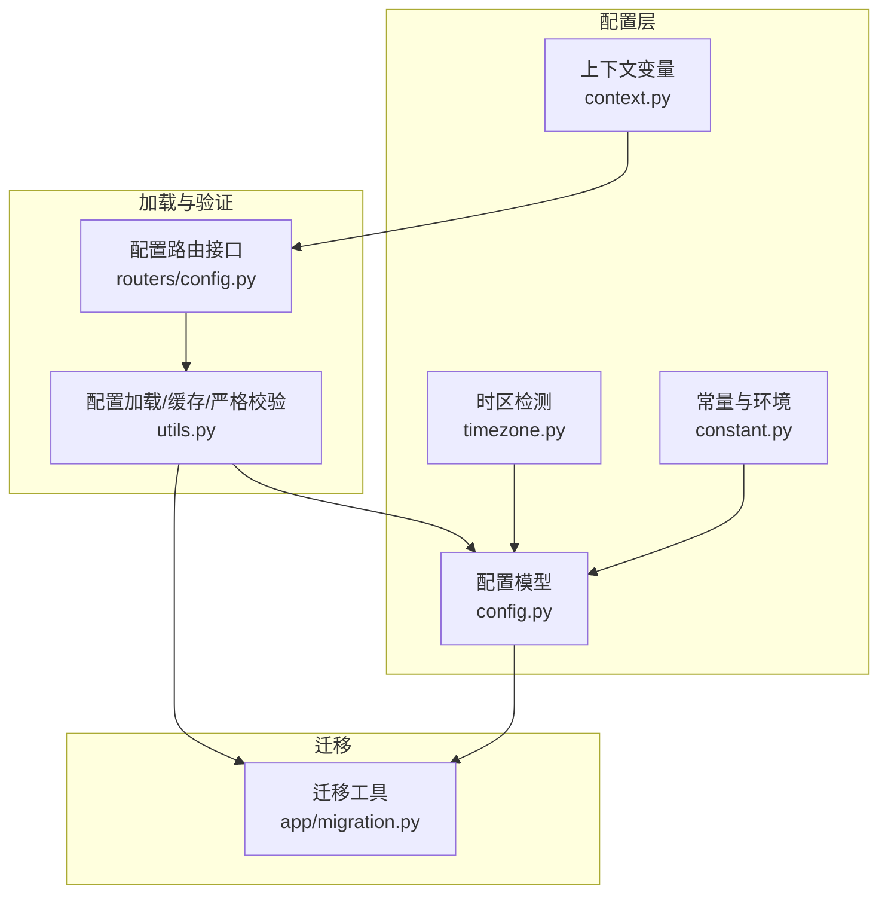
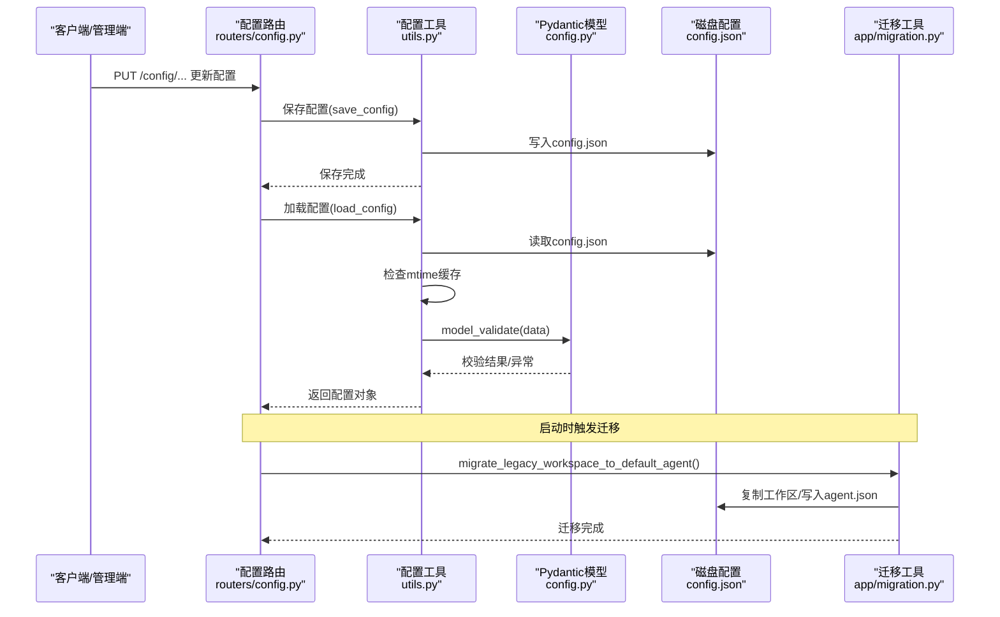
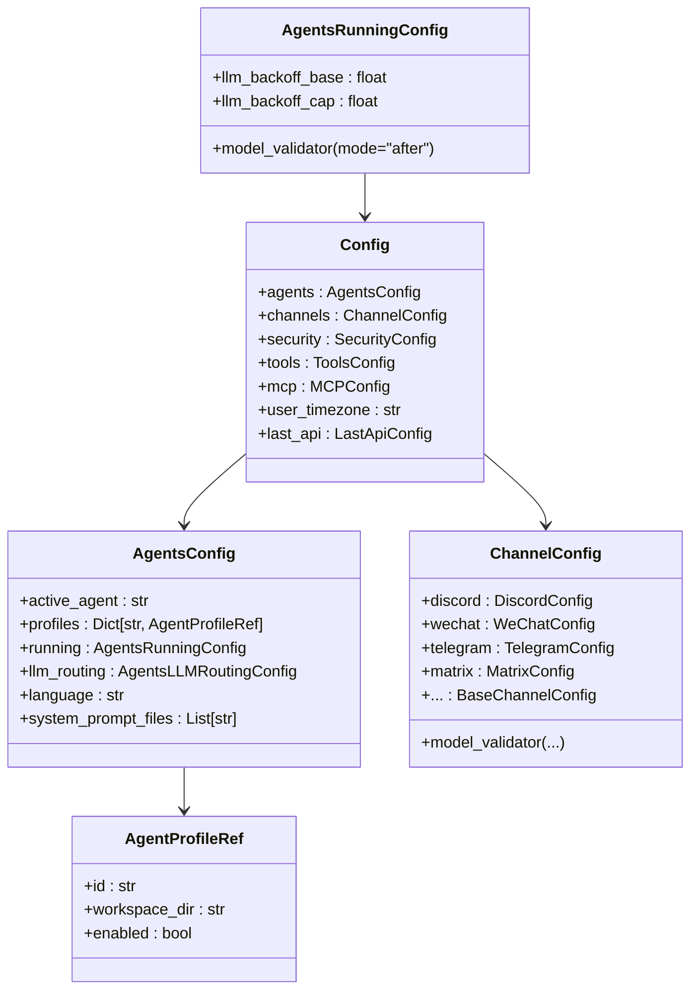
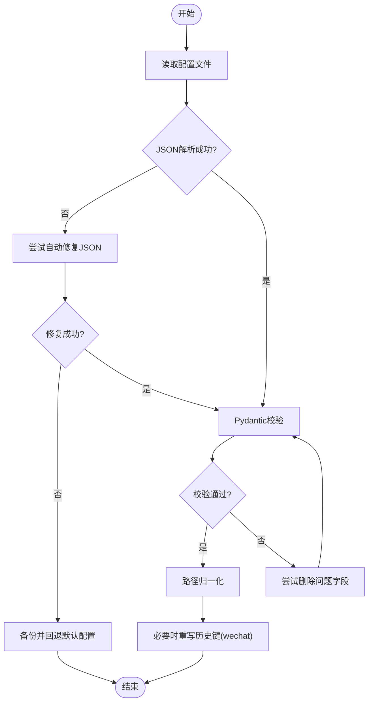
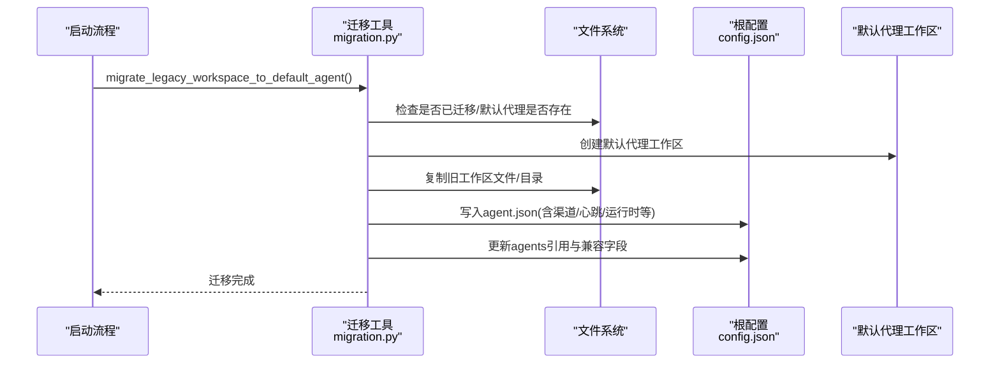
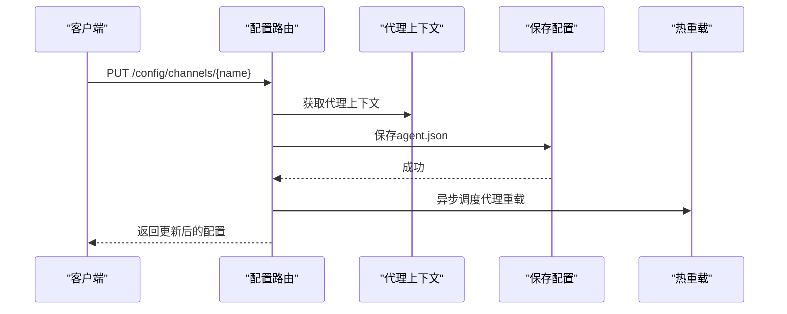
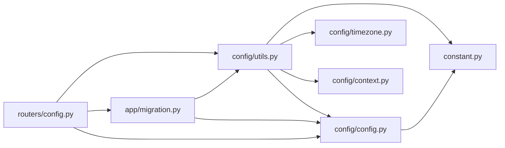

# 配置验证与迁移

<cite>
**本文引用的文件**
- [config.py](file://src/qwenpaw/config/config.py)
- [utils.py](file://src/qwenpaw/config/utils.py)
- [migration.py](file://src/qwenpaw/app/migration.py)
- [config.py（路由）](file://src/qwenpaw/app/routers/config.py)
- [timezone.py](file://src/qwenpaw/config/timezone.py)
- [context.py](file://src/qwenpaw/config/context.py)
- [constant.py](file://src/qwenpaw/constant.py)
- [schema.py（通道）](file://src/qwenpaw/app/channels/schema.py)
</cite>

## 目录
1. [简介](#简介)
2. [项目结构](#项目结构)
3. [核心组件](#核心组件)
4. [架构总览](#架构总览)
5. [详细组件分析](#详细组件分析)
6. [依赖关系分析](#依赖关系分析)
7. [性能考量](#性能考量)
8. [故障排查指南](#故障排查指南)
9. [结论](#结论)
10. [附录](#附录)

## 简介
本文件面向QwenPaw的配置验证与迁移系统，系统性阐述配置模型、验证规则、自动迁移策略、错误处理与回退机制，并提供诊断方法、测试策略与性能优化建议。目标是帮助开发者与运维人员在升级、迁移或修复配置问题时，快速定位并解决问题，同时确保系统的稳定性与向后兼容。

## 项目结构
配置验证与迁移涉及以下关键模块：
- 配置模型与验证：定义各类配置模型、字段约束与模型级校验器
- 配置加载与缓存：带mtime缓存的配置读取、严格校验与自动修复
- 迁移工具：从单代理到多代理结构的迁移、技能目录迁移、历史键迁移
- 路由接口：对外暴露配置读写与热更新能力
- 时区与上下文：系统时区检测、工作空间上下文传递
- 常量与环境：默认路径、并发与限流参数等

**图表来源**
- [config.py](file://src/qwenpaw/config/config.py)
- [utils.py](file://src/qwenpaw/config/utils.py)
- [migration.py](file://src/qwenpaw/app/migration.py)
- [config.py（路由）](file://src/qwenpaw/app/routers/config.py)
- [timezone.py](file://src/qwenpaw/config/timezone.py)
- [context.py](file://src/qwenpaw/config/context.py)
- [constant.py](file://src/qwenpaw/constant.py)

**章节来源**
- [config.py](file://src/qwenpaw/config/config.py)
- [utils.py](file://src/qwenpaw/config/utils.py)
- [migration.py](file://src/qwenpaw/app/migration.py)
- [config.py（路由）](file://src/qwenpaw/app/routers/config.py)
- [timezone.py](file://src/qwenpaw/config/timezone.py)
- [context.py](file://src/qwenpaw/config/context.py)
- [constant.py](file://src/qwenpaw/constant.py)

## 核心组件
- 配置模型与字段约束
  - 使用Pydantic模型定义配置结构，结合Field约束（如范围、别名、默认值）与model_validator进行跨字段/模型级校验
  - 示例：运行时配置中的重试与退避关系校验、上下文压缩阈值范围校验
- 配置加载与缓存
  - 基于文件mtime的缓存避免重复磁盘IO；支持读取失败回退默认配置
  - 严格模式(strict_validate_config_file)用于诊断，不进行自动修复
  - 自动修复：对JSON语法错误使用json_repair，对字段错误尝试删除并重试
- 迁移工具
  - 单代理到多代理结构迁移：复制旧工作区内容到新默认代理工作区，保留根配置兼容字段
  - 技能迁移：将legacy的active/customized技能目录合并到统一的skills目录，保持幂等与非破坏性
  - 历史键迁移：将channels.weixin重命名为channels.wechat并落盘
- 路由接口
  - 提供通道、ACP、心跳、安全策略等配置的GET/PUT接口，支持热更新与异步重载
- 时区与上下文
  - 检测系统IANA时区，规范化非标准名称
  - 上下文变量传递当前代理工作空间、近期最大字节限制、shell命令超时与可执行文件

**章节来源**
- [config.py](file://src/qwenpaw/config/config.py)
- [utils.py](file://src/qwenpaw/config/utils.py)
- [migration.py](file://src/qwenpaw/app/migration.py)
- [config.py（路由）](file://src/qwenpaw/app/routers/config.py)
- [timezone.py](file://src/qwenpaw/config/timezone.py)
- [context.py](file://src/qwenpaw/config/context.py)

## 架构总览
配置验证与迁移的整体流程如下：

**图表来源**
- [config.py（路由）](file://src/qwenpaw/app/routers/config.py)
- [utils.py](file://src/qwenpaw/config/utils.py)
- [config.py](file://src/qwenpaw/config/config.py)
- [migration.py](file://src/qwenpaw/app/migration.py)

## 详细组件分析

### 配置模型与验证规则
- 字段级约束
  - 数值范围：如上下文压缩阈值、近期消息最大字节数、最大并发等
  - 枚举与字面量：如渠道策略(open/allowlist)、ACP工具解析模式
  - 默认值与别名：如心跳配置的activeHours别名、媒体目录路径
- 模型级校验
  - 重试与退避关系校验：退避上限必须不小于基础值
  - 渠道键迁移：一次性将legacy weixin键迁移到wechat键并在内存中合并默认代理
- 数据类型检查
  - 使用Pydantic自动进行类型检查与转换，保证配置对象的强类型一致性
- 业务逻辑验证
  - 代理ID生成与校验：长度、字符集、保留词、唯一性
  - 工作空间路径归一化：将旧路径映射到新的WORKING_DIR根

**图表来源**
- [config.py](file://src/qwenpaw/config/config.py)

**章节来源**
- [config.py](file://src/qwenpaw/config/config.py)

### 配置加载与严格校验
- 缓存策略
  - 基于文件mtime的全局缓存，避免频繁磁盘读取
  - 并发锁保护缓存更新，防止竞态
- 自动修复
  - JSON语法错误通过json_repair自动修复
  - 对验证错误字段尝试删除并重试，提升容错
- 严格校验
  - 不进行自动修复，仅输出错误位置与信息，便于诊断
- 历史键迁移
  - 在写回磁盘前，将channels.weixin重命名为channels.wechat并备份原文件

**图表来源**
- [utils.py](file://src/qwenpaw/config/utils.py)
- [config.py](file://src/qwenpaw/config/config.py)

**章节来源**
- [utils.py](file://src/qwenpaw/config/utils.py)

### 迁移工具与向后兼容
- 单代理到多代理迁移
  - 创建默认代理工作区，复制旧工作区文件与目录
  - 将旧配置中的渠道、MCP、心跳、运行时设置等迁移到agent.json
  - 保留根config.json中的兼容字段，确保降级可用
- 技能迁移
  - 将legacy active/customized技能目录合并到统一skills目录
  - 冲突处理：同名不同内容时添加后缀以保留双方
  - 幂等与非破坏性：已存在目标不覆盖
- 历史键迁移
  - 一次性将channels.weixin重命名为channels.wechat并落盘

**图表来源**
- [migration.py](file://src/qwenpaw/app/migration.py)

**章节来源**
- [migration.py](file://src/qwenpaw/app/migration.py)

### 路由接口与热更新
- 通道配置
  - GET/PUT通道列表与单个通道配置，支持热重载
- ACP配置
  - 获取/更新ACP配置，限制工具解析模式
- 心跳配置
  - 获取/更新心跳周期、目标与活跃时段，支持后台重新调度
- 安全配置
  - 工具守卫、文件守卫、技能扫描器、免认证主机白名单等
- 用户时区
  - 获取/设置用户IANA时区，进行规范化

**图表来源**
- [config.py（路由）](file://src/qwenpaw/app/routers/config.py)

**章节来源**
- [config.py（路由）](file://src/qwenpaw/app/routers/config.py)

### 时区与上下文
- 时区检测
  - 优先使用IANA标准名称，映射非标准名称到标准名称
- 上下文变量
  - 当前代理工作空间目录、近期最大字节限制、shell命令超时与可执行文件

**章节来源**
- [timezone.py](file://src/qwenpaw/config/timezone.py)
- [context.py](file://src/qwenpaw/config/context.py)

## 依赖关系分析
- 组件耦合
  - 路由依赖配置工具进行读写与热重载
  - 配置工具依赖Pydantic模型进行验证
  - 迁移工具依赖配置模型与常量，读写磁盘
- 外部依赖
  - json_repair用于JSON修复
  - zoneinfo用于时区标准化
  - 文件系统操作用于迁移与备份

**图表来源**
- [config.py（路由）](file://src/qwenpaw/app/routers/config.py)
- [utils.py](file://src/qwenpaw/config/utils.py)
- [config.py](file://src/qwenpaw/config/config.py)
- [migration.py](file://src/qwenpaw/app/migration.py)
- [timezone.py](file://src/qwenpaw/config/timezone.py)
- [context.py](file://src/qwenpaw/config/context.py)
- [constant.py](file://src/qwenpaw/constant.py)

**章节来源**
- [config.py（路由）](file://src/qwenpaw/app/routers/config.py)
- [utils.py](file://src/qwenpaw/config/utils.py)
- [config.py](file://src/qwenpaw/config/config.py)
- [migration.py](file://src/qwenpaw/app/migration.py)
- [timezone.py](file://src/qwenpaw/config/timezone.py)
- [context.py](file://src/qwenpaw/config/context.py)
- [constant.py](file://src/qwenpaw/constant.py)

## 性能考量
- 配置缓存
  - 基于mtime的全局缓存减少磁盘IO，适合频繁读取场景
- 批量验证
  - 严格模式(strict_validate_config_file)用于一次性诊断所有配置文件，避免逐条修复带来的多次IO
- 迁移幂等
  - 技能迁移与工作区迁移均设计为幂等，避免重复迁移造成的额外开销
- 热重载异步化
  - 路由更新后采用异步任务触发重载，避免阻塞请求线程

[本节为通用指导，无需代码来源]

## 故障排查指南
- 配置文件不可用
  - 现象：配置无法加载或被回退默认值
  - 排查：使用严格校验(strict_validate_config_file)获取错误位置；检查JSON语法、字段类型与范围
  - 修复：修正错误字段或删除无效字段；必要时恢复备份
- 历史键问题
  - 现象：channels.weixin导致兼容性问题
  - 排查：确认迁移是否执行；检查磁盘上是否已重命名为channels.wechat
  - 修复：手动重命名或等待自动迁移
- 迁移失败
  - 现象：迁移日志报错或中断
  - 排查：检查工作区权限、磁盘空间、插件技能的YAML格式
  - 修复：修复技能YAML、清理临时文件后重试
- 热重载未生效
  - 现象：更新配置后行为未改变
  - 排查：确认异步重载任务是否执行；检查代理上下文是否正确获取
  - 修复：手动触发重载或重启相关服务

**章节来源**
- [utils.py](file://src/qwenpaw/config/utils.py)
- [migration.py](file://src/qwenpaw/app/migration.py)
- [config.py（路由）](file://src/qwenpaw/app/routers/config.py)

## 结论
QwenPaw的配置验证与迁移系统通过强类型的Pydantic模型、自动修复与严格校验相结合，提供了稳健的配置管理能力。迁移工具确保从旧版本平滑过渡到多代理结构，同时保留向后兼容性。配合路由接口的热重载与上下文变量，系统在功能扩展与维护方面具备良好的可演进性。

[本节为总结，无需代码来源]

## 附录

### 测试策略与回滚机制
- 测试策略
  - 单元测试：针对配置模型的字段范围与模型级校验
  - 集成测试：模拟配置文件损坏、历史键、迁移场景
  - 回归测试：验证迁移前后配置行为一致性
- 回滚机制
  - 自动备份：配置不可用时自动备份并回退默认配置
  - 迁移回滚：迁移失败时保留原状态，允许人工介入修复后重试

**章节来源**
- [utils.py](file://src/qwenpaw/config/utils.py)
- [migration.py](file://src/qwenpaw/app/migration.py)

### 配置验证失败的诊断清单
- JSON语法与结构
  - 使用严格校验定位字段错误与缺失
- 字段类型与范围
  - 检查数值范围、枚举值、路径合法性
- 历史键与兼容性
  - 确认channels.weixin是否已迁移为wechat
- 迁移状态
  - 检查默认代理工作区与agent.json是否存在
- 热重载
  - 确认异步重载任务执行情况

**章节来源**
- [utils.py](file://src/qwenpaw/config/utils.py)
- [migration.py](file://src/qwenpaw/app/migration.py)
- [config.py（路由）](file://src/qwenpaw/app/routers/config.py)