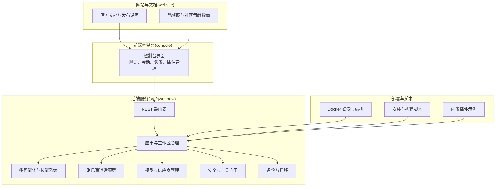
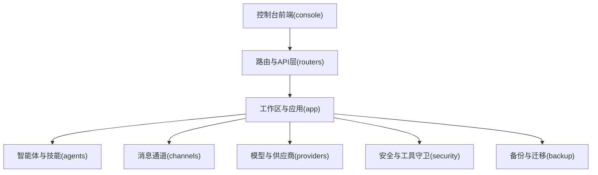
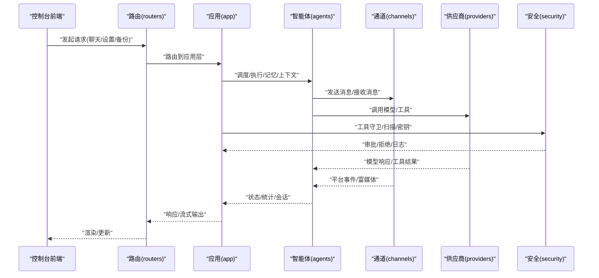
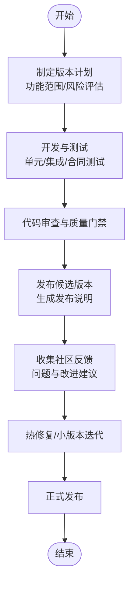
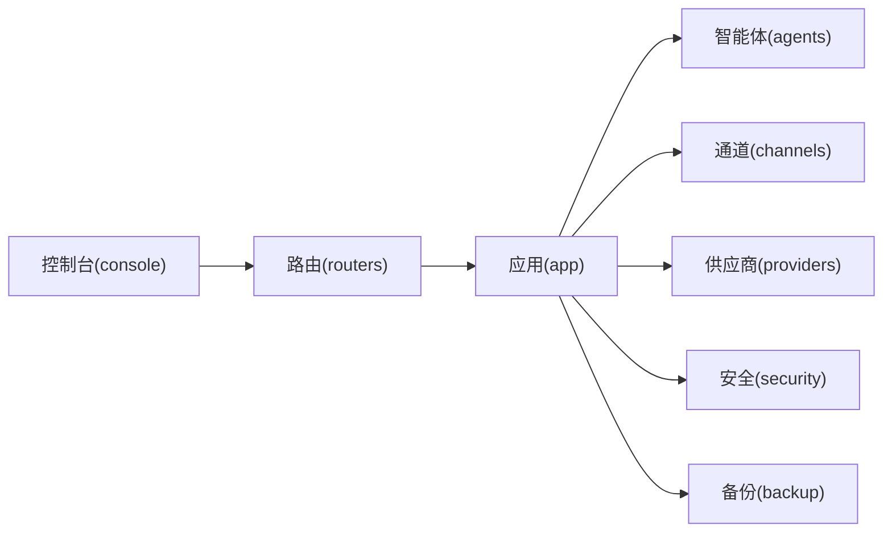

# 发展历程

<cite>
**本文引用的文件**
- [README.md](file://README.md)
- [CONTRIBUTING.md](file://CONTRIBUTING.md)
- [website/public/docs/roadmap.zh.md](file://website/public/docs/roadmap.zh.md)
- [website/public/release-notes/v1.1.7.md](file://website/public/release-notes/v1.1.7.md)
- [website/public/release-notes/v1.1.6.md](file://website/public/release-notes/v1.1.6.md)
- [website/public/release-notes/v1.1.5.md](file://website/public/release-notes/v1.1.5.md)
- [website/public/release-notes/v1.1.4.md](file://website/public/release-notes/v1.1.4.md)
- [website/public/release-notes/v1.1.3.md](file://website/public/release-notes/v1.1.3.md)
- [website/public/release-notes/v1.1.2.md](file://website/public/release-notes/v1.1.2.md)
- [website/public/release-notes/v1.1.1.md](file://website/public/release-notes/v1.1.1.md)
- [website/public/release-notes/v1.1.0.md](file://website/public/release-notes/v1.1.0.md)
- [website/public/release-notes/v1.0.2.md](file://website/public/release-notes/v1.0.2.md)
- [website/public/release-notes/v1.0.1.md](file://website/public/release-notes/v1.0.1.md)
- [website/public/release-notes/v1.0.0.md](file://website/public/release-notes/v1.0.0.md)
- [website/public/release-notes/v0.2.0.md](file://website/public/release-notes/v0.2.0.md)
- [website/public/release-notes/v0.1.0.md](file://website/public/release-notes/v0.1.0.md)
- [src/qwenpaw/__version__.py](file://src/qwenpaw/__version__.py)
</cite>

## 目录
1. [引言](#引言)
2. [项目结构](#项目结构)
3. [核心组件](#核心组件)
4. [架构总览](#架构总览)
5. [详细组件分析](#详细组件分析)
6. [依赖分析](#依赖分析)
7. [性能考量](#性能考量)
8. [故障排查指南](#故障排查指南)
9. [结论](#结论)
10. [附录](#附录)

## 引言
本文件系统性梳理 QwenPaw 的发展历程，重点覆盖从 CoPaw 到 QwenPaw 的品牌重塑、版本里程碑、功能演进、开源理念与社区建设、技术方向与路线图，以及项目透明度与参与方式。通过版本发布说明与路线图，读者可以清晰看到项目在“多智能体协作、上下文与记忆系统、模型层融合、安全与可运维性、渠道与插件生态”等方面的持续演进。

## 项目结构
- 代码库采用分层组织：Python 后端位于 src/qwenpaw，前端控制台位于 console，网站文档与发布说明位于 website，插件示例位于 plugins，脚本与部署资源位于 scripts 和 deploy。
- 前后端通过 REST API 交互，支持桌面应用、Docker 部署与本地模型运行，强调“本地可控、数据不出境”的隐私与安全原则。
- 社区文档与贡献指南位于 website/public/docs 与根目录 CONTRIBUTING.md，便于新老用户快速上手与参与。

**图表来源**
- [README.md: 362-384:362-384](file://README.md#L362-L384)
- [README.md: 418-442:418-442](file://README.md#L418-L442)

**章节来源**
- [README.md: 362-384:362-384](file://README.md#L362-L384)
- [README.md: 418-442:418-442](file://README.md#L418-L442)

## 核心组件
- 多智能体与协作：支持多智能体并行与异步任务，具备统一优先队列、停止命令与后台任务跟踪。
- 模型与供应商：内置多家云与本地模型供应商，支持自动探测与能力标签，提供速率限制与重试策略。
- 渠道与消息：覆盖主流 IM 平台，支持富媒体、语音转写、卡片渲染与心跳检查。
- 安全与工具守卫：多层次安全机制，包括危险命令检测、文件访问控制、技能扫描与密钥加密存储。
- 记忆与上下文：上下文压缩、记忆检索与主动推送，支持 CJK 查询分词与自适应模型重试。
- 插件与 MCP：控制台插件系统与 MCP 工具发现，支持远程认证与异步执行。
- 备份与迁移：支持按智能体/技能/会话的快照备份与导入，提供多版本/多设备迁移能力。

**章节来源**
- [README.md: 31-44:31-44](file://README.md#L31-L44)
- [website/public/release-notes/v1.1.7.md: 1-65:1-65](file://website/public/release-notes/v1.1.7.md#L1-L65)
- [website/public/release-notes/v1.1.6.md: 1-95:1-95](file://website/public/release-notes/v1.1.6.md#L1-L95)
- [website/public/release-notes/v1.1.5.md: 1-41:1-41](file://website/public/release-notes/v1.1.5.md#L1-L41)
- [website/public/release-notes/v1.1.4.md: 1-81:1-81](file://website/public/release-notes/v1.1.4.md#L1-L81)
- [website/public/release-notes/v1.1.3.md: 1-62:1-62](file://website/public/release-notes/v1.1.3.md#L1-L62)
- [website/public/release-notes/v1.1.2.md: 1-67:1-67](file://website/public/release-notes/v1.1.2.md#L1-L67)
- [website/public/release-notes/v1.1.1.md: 1-74:1-74](file://website/public/release-notes/v1.1.1.md#L1-L74)
- [website/public/release-notes/v1.1.0.md: 1-20:1-20](file://website/public/release-notes/v1.1.0.md#L1-L20)
- [website/public/release-notes/v1.0.2.md: 1-60:1-60](file://website/public/release-notes/v1.0.2.md#L1-L60)
- [website/public/release-notes/v1.0.1.md: 1-85:1-85](file://website/public/release-notes/v1.0.1.md#L1-L85)
- [website/public/release-notes/v1.0.0.md: 1-102:1-102](file://website/public/release-notes/v1.0.0.md#L1-L102)
- [website/public/release-notes/v0.2.0.md: 1-99:1-99](file://website/public/release-notes/v0.2.0.md#L1-L99)
- [website/public/release-notes/v0.1.0.md: 1-120:1-120](file://website/public/release-notes/v0.1.0.md#L1-L120)

## 架构总览
下图展示了 QwenPaw 的核心模块关系与交互路径，体现“控制台前端 → 应用与工作区 → 智能体/技能/通道/供应商/安全/备份”的分层架构。

**图表来源**
- [README.md: 362-384:362-384](file://README.md#L362-L384)

**章节来源**
- [README.md: 362-384:362-384](file://README.md#L362-L384)

## 详细组件分析

### 品牌重塑：从 CoPaw 到 QwenPaw
- 2026-04-12 正式宣布 CoPaw 重新命名为 QwenPaw，强调与 Qwen 开源生态的深度融合与“小大模型协同”的方向。
- 新名称承载“更深入的模型层集成、本地模型与智能体协作”的愿景，同时延续“陪伴用户、值得信任”的使命。
- 该阶段未改变开源愿景与目标，仍致力于“实用、安全、个性化”的 AI 助手与开放协作。

**章节来源**
- [website/public/release-notes/v1.1.0.md: 1-20:1-20](file://website/public/release-notes/v1.1.0.md#L1-L20)
- [README.md: 75-88:75-88](file://README.md#L75-L88)

### 版本里程碑与功能演进
以下以时间倒序梳理关键版本的新增、变更与修复，突出各阶段的技术重点与社区反馈闭环。

- v1.1.7（2026-05-14）
  - 新增：浏览器批量操作与文件下载、OAuth 2.1 远程 MCP 认证、外部代理异步执行、控制台插件管理、Qwen-Image 与 Wan 2.7 插件。
  - 变更：模型选择器改为可搜索平铺列表；浮动聊天按钮。
  - 性能：异步 FastAPI 依赖、文件读取上限与 Keyring 超时优化。
  - 修复：会话历史路由、火山引擎模型 ID、飞书 WebSocket 保活等。

- v1.1.6（2026-05-09）
  - 新增：Windows 诊断、Agent 状态 API、Cron 会话隔离、GPT Image 2 插件、配置驱动的代理名。
  - 新增：Whisper 语音输入、LLM 自动生成会话标题、令牌使用趋势图、批量技能操作、Mermaid 图表渲染、巴西葡萄牙语支持。
  - 新增：火山引擎供应商、阿里云 Token 计划、Anthropic 默认最大令牌数。
  - 新增：飞书交互审批卡片、企业微信群会话共享、WeCom 交互卡片。
  - 新增：静态文件路径穿越防护、规则级自动拒绝。
  - 新增：技能测试 CLI、技能安装/卸载 CLI。
  - 性能：控制台渲染去重、聊天历史导航优化、QR 轮询清理。
  - 修复：企业微信流保活、Telegram 网络重试、WeChat Cron 缓冲刷新、Markdown 表格拆分等。

- v1.1.5
  - 新增：CJK 敏感内存检索、上下文压缩回退、自适应模型重试、ACP 代理重命名与删除、QQ 语音与 ASR。
  - 变更：代理统计导航归位、Dockerfile 清理、聊天组件升级。
  - 性能：配置加载缓存、技能清单缓存、模型 API 去重、控制台聊天虚拟化。
  - 修复：渠道 /approve 与 /deny 命令、WeCom @提及命令、飞书反应事件、QQ WebSocket 重连等。

- v1.1.4
  - 新增：内存与上下文重构、计划模式、DeepSeek V4 模型、可配置 Shell 躲避检查、Auth-Bypass 主机白名单。
  - 新增：浏览器启动参数、Shell 命令超时、每代理模型分配、会话视图按钮与右键菜单、SIP 语音通道、钉钉语音识别、Telegram 命令菜单、QQ 引用消息、钉钉 Markdown 与 Cron 消息类型、WeChat 交互向导。
  - 变更：工具守卫审批系统重构、动态插件注册、Docker 构建改进、代理语言同步、代理选择持久化、令牌使用缓冲。
  - 修复：渠道过滤工具消息、文件 URL 编码、WeChat 发送响应、WeChat 图标映射、WeChat QR 登录超时等。

- v1.1.3
  - 新增：备份与恢复、ACP 服务器、主动代理消息、跨供应商消息标准化。
  - 新增：控制台插件系统、代理统计页面、内置技能语言切换、本地模型管理、OpenRouter 多模态检测、阿里云国际区支持。
  - 新增：QQ 即时确认、Telegram 打字指示器、钉钉 @提及回复、通道健康检查与重启 API。
  - 变更：调试页重设计、make_plan 技能更新、统一通道媒体目录。
  - 修复：预览 URL 前缀、Markdown 渲染与复制样式、表格滚动、WeCom 附件访问、文件上传阻塞、重复消息、截图文件名等。

- v1.1.2
  - 新增：任务模式（Mission）、文本优先自动继续、自定义代理 ID、ACP 外部代理委托、代理 CLI。
  - 新增：doctor 诊断命令、skills info 命令。
  - 新增：记忆梦（定期整理 MEMORY.md）、递归文件监听。
  - 新增：技能导入中心、调试页。
  - 变更：供应商排序、智能体通信工具拆分。
  - 修复：清空聊天历史、令牌使用排序、Cron ID 提示、消息历史导航、图像 MIME 规范化、多模态工具调用顺序、背景任务跟踪、WeCom Typing 指示器泄漏等。

- v1.1.1
  - 新增：OpenRouter 与 OpenCode 供应商、模型 ID 自动补全。
  - 新增：内置智能体协作工具、Matrix 重写、飞书引用消息、钉钉二维码认证。
  - 新增：扩展 Shell 命令守卫、ClawHub 技能需求、媒体 URL 预览。
  - 变更：多模态探测统一、消息标准化、钉钉 SDK 迁移、飞书 WebSocket 稳定性、WeChat 回复限制警告。
  - 修复：QQ WebSocket 关闭阻塞、聊天会话固定按钮对比度、Markdown 链接导航、本地模型下载失败、vLLM 兼容性等。

- v1.1.0（品牌重塑）
  - 发布说明聚焦 CoPaw 重命名为 QwenPaw 的意义与愿景，强调与 Qwen 生态融合与小大模型协同方向。

- v1.0.2
  - 新增：插件、copaw task、/model 命令。
  - 新增：SiliconFlow、CoPaw Local（含图像/视频能力与更可靠下载）。
  - 新增：更安全的保存密钥、聊天输入历史、搜索、置顶会话、每代理聊天、图标与提供商标识。
  - 新增：技能命令、池化技能标签、MCP 工具发现。
  - 新增：QQ 文件与富媒体、WeCom 引用上下文。
  - 变更：时区选择、文件大小显示、控制台启动优化、大技能列表交互优化、错误码一致性。
  - 修复：iMessage 私聊策略、Discord 代码块截断、飞书锁与事件循环问题、MCP 重连 CPU 泄漏、浏览器自动化选择器等。

- v1.0.1
  - 新增：Zhipu 模型供应商、多模态视频分析、模型特定生成参数、CoPaw Local 更新机制、宽松工具调用解析。
  - 新增：代理拖拽排序、会话状态指示器、首选会话优先、系统深色模式、默认代理自动切换。
  - 新增：批量技能操作、代理禁用停止服务、技能 requires 列表格式支持。
  - 新增：OneBot v11（NapCat/QQ）通道、钉钉 AI 卡、飞书 DONE 反应、统一无文本防抖。
  - 新增：WeCom 服务端二维码、WeChat 文件上传与打字指示器。
  - 变更：网站 UI 现代化、语言选择重排、国际化时间显示、技能卡片与列表视图增强、MCP 控制台 UI 刷新。
  - 修复：钉钉会话 Webhook 过期处理、允许白名单处理、WeCom 心跳重连、QQ 重连状态重置、控制台本地化、字体加载、Windows 工具兼容、浏览器空闲看门狗、工具守卫思考模型兼容等。

- v1.0.0
  - 新增：后台任务支持与任务跟踪、代理启用/禁用开关、统一优先队列与 /stop 命令。
  - 新增：CoPaw 本地模型、全局活动模型选择、全局 LLM 速率限制。
  - 新增：系统重启与服务保护、中文提示注入检测。
  - 新增：下载页面、多模态预览、会话标签、命令建议。
  - 新增：WeChat iLink Bot、自定义通道 HTTP 路由、Discord Bot 消息过滤、钉钉宽屏卡片、企业微信媒体上传。
  - 新增：异步工具执行、技能池架构、浏览器 CDP 支持、多工作区 Cookie 管理。
  - 新增：服务器端语言持久化、扩展多语言支持。
  - 变更：上下文管理 v2.0、改进截断逻辑、流式 grep 搜索、MCP None 配置处理、Himalaya 版本推荐。
  - 修复：企业微信心跳重连、飞书 WebSocket 重连与多实例消息路由、Discord 重复消息、Telegram 超时、QQ 语音转换、钉钉 Cron 提醒等。

- v0.2.0
  - 新增：智能体间通信（copaw agents/message）、内置 QA 代理、可配置 LLM 自动重试、配置自动修复。
  - 新增：文件访问守卫、工具守卫增强。
  - 新增：飞书/ Lark SDK 迁移、小艺文件与图片支持。
  - 新增：音频/视频/语音输入、流式重连、Web 账户管理、模型供应商搜索、聊天滚动条。
  - 新增：多模态能力探测、Gemini 工具图像支持。
  - 新增：增强的 grep/glob 搜索、工作区相对工具输出。
  - 变更：KV 缓存稳定提示、更快 CLI 启动、QQ 通道重构与智能文本分片、通道消息处理泄漏修复。
  - 修复：Windows 管道死锁、stderr 可见性、Windows 路径处理、macOS 桌面构建、Anthropic 过载重试、模型连接测试、通道消息处理泄漏、控制台静态文件、Swagger 文档路由、过期推送消息、控制台重连溢出、Mermaid 滚动跳转、令牌使用锁、记忆时区、空压缩结果、Cron 取消、任务跟踪初始化等。

- v0.1.0
  - 新增：多智能体/多工作区架构、上下文管理、安全扫描与破坏性命令检测、Web 认证。
  - 新增：WeCom、小艺通道、钉钉 AI 卡回复。
  - 新增：LobeHub 与 ModelScope 技能导入、版本感知内置技能同步、内置 Guidance 技能、Zip 技能导入、MCP 头部环境变量。
  - 新增：控制台多模态聊天、查看图片工具、非多模态 LLM 媒体回退、语音转写。
  - 新增：Gemini、DeepSeek、MiniMax、Kimi 供应商。
  - 新增：copaw update/shutdown 命令、Docker Compose、Docker 镜像附加依赖。
  - 新增：控制台深色模式、控制台聊天流式传输。
  - 新增：时区配置、系统提示中的 OS 信息。
  - 变更：优雅生命周期管理、自定义工作目录、动态令牌计数、配置加载保护。
  - 修复：Telegram 线程回复与媒体处理、Discord 通道合并、钉钉发送者信息缺失、飞书卡片限制与语音支持、WeCom WebSocket 事件循环冲突等。

**章节来源**
- [website/public/release-notes/v1.1.7.md: 1-65:1-65](file://website/public/release-notes/v1.1.7.md#L1-L65)
- [website/public/release-notes/v1.1.6.md: 1-95:1-95](file://website/public/release-notes/v1.1.6.md#L1-L95)
- [website/public/release-notes/v1.1.5.md: 1-41:1-41](file://website/public/release-notes/v1.1.5.md#L1-L41)
- [website/public/release-notes/v1.1.4.md: 1-81:1-81](file://website/public/release-notes/v1.1.4.md#L1-L81)
- [website/public/release-notes/v1.1.3.md: 1-62:1-62](file://website/public/release-notes/v1.1.3.md#L1-L62)
- [website/public/release-notes/v1.1.2.md: 1-67:1-67](file://website/public/release-notes/v1.1.2.md#L1-L67)
- [website/public/release-notes/v1.1.1.md: 1-74:1-74](file://website/public/release-notes/v1.1.1.md#L1-L74)
- [website/public/release-notes/v1.1.0.md: 1-20:1-20](file://website/public/release-notes/v1.1.0.md#L1-L20)
- [website/public/release-notes/v1.0.2.md: 1-60:1-60](file://website/public/release-notes/v1.0.2.md#L1-L60)
- [website/public/release-notes/v1.0.1.md: 1-85:1-85](file://website/public/release-notes/v1.0.1.md#L1-L85)
- [website/public/release-notes/v1.0.0.md: 1-102:1-102](file://website/public/release-notes/v1.0.0.md#L1-L102)
- [website/public/release-notes/v0.2.0.md: 1-99:1-99](file://website/public/release-notes/v0.2.0.md#L1-L99)
- [website/public/release-notes/v0.1.0.md: 1-120:1-120](file://website/public/release-notes/v0.1.0.md#L1-L120)

### 架构与数据流（代码级）

**图表来源**
- [README.md: 362-384:362-384](file://README.md#L362-L384)

**章节来源**
- [README.md: 362-384:362-384](file://README.md#L362-L384)

### 版本发布流程（概念流程）

[此图为概念流程，不直接映射具体源码文件]

## 依赖分析
- 内聚性：各模块职责清晰，如 channels 负责消息通道、providers 负责模型供应商、security 负责工具守卫与密钥管理。
- 耦合性：前端通过 REST API 与后端解耦；插件与 MCP 提供扩展点；备份模块独立于业务逻辑。
- 外部依赖：Docker、uv、Node/npm、第三方模型供应商与渠道 SDK。
- 潜在循环依赖：未发现明显循环导入；模块间通过接口与路由解耦。

**图表来源**
- [README.md: 362-384:362-384](file://README.md#L362-L384)

**章节来源**
- [README.md: 362-384:362-384](file://README.md#L362-L384)

## 性能考量
- 控制台渲染优化：去重渲染、虚拟化列表、缓存与懒加载，显著提升大会话与大技能集场景下的交互流畅度。
- 模型与供应商：异步依赖、并发请求去重、速率限制与抖动，降低抖动与拥塞。
- 文件与 I/O：文件读取上限与预分配、日志轮转、路径编码修复，减少异常与资源占用。
- 通道稳定性：指数回退重连、心跳保活、消息去重与序列化修复，提升长链路可靠性。

**章节来源**
- [website/public/release-notes/v1.1.6.md: 44-49:44-49](file://website/public/release-notes/v1.1.6.md#L44-L49)
- [website/public/release-notes/v1.1.5.md: 15-21:15-21](file://website/public/release-notes/v1.1.5.md#L15-L21)
- [website/public/release-notes/v1.1.4.md: 38-46:38-46](file://website/public/release-notes/v1.1.4.md#L38-L46)
- [website/public/release-notes/v1.1.3.md: 48-62:48-62](file://website/public/release-notes/v1.1.3.md#L48-L62)
- [website/public/release-notes/v1.1.2.md: 35-67:35-67](file://website/public/release-notes/v1.1.2.md#L35-L67)
- [website/public/release-notes/v1.1.1.md: 53-74:53-74](file://website/public/release-notes/v1.1.1.md#L53-L74)
- [website/public/release-notes/v1.1.0.md: 1-20:1-20](file://website/public/release-notes/v1.1.0.md#L1-L20)
- [website/public/release-notes/v1.0.2.md: 37-45:37-45](file://website/public/release-notes/v1.0.2.md#L37-L45)
- [website/public/release-notes/v1.0.1.md: 38-57:38-57](file://website/public/release-notes/v1.0.1.md#L38-L57)
- [website/public/release-notes/v1.0.0.md: 47-64:47-64](file://website/public/release-notes/v1.0.0.md#L47-L64)
- [website/public/release-notes/v0.2.0.md: 39-57:39-57](file://website/public/release-notes/v0.2.0.md#L39-L57)
- [website/public/release-notes/v0.1.0.md: 60-81:60-81](file://website/public/release-notes/v0.1.0.md#L60-L81)

## 故障排查指南
- 通道类问题
  - 飞书/企业微信：WebSocket 保活、心跳重连、多实例消息路由、反应事件处理。
  - 钉钉：会话 Webhook 路由、AI 卡布局、@提及回复。
  - Telegram/QQ：超时与重连、语音转换参数、重连状态管理。
- 控制台与 UI
  - 会话历史路由、标题持久化、Markdown 渲染、滚动条与对比度。
- 安全与工具守卫
  - Shell 躲避检测规则、文件访问控制、技能扫描与密钥加密。
- 模型与供应商
  - 模型 ID 修正、能力标签保留、流式解析过滤、多模态兼容性。
- 备份与迁移
  - Docker 卷挂载恢复、日志轮转、Conda 打包修复。

**章节来源**
- [website/public/release-notes/v1.1.7.md: 44-65:44-65](file://website/public/release-notes/v1.1.7.md#L44-L65)
- [website/public/release-notes/v1.1.6.md: 50-85:50-85](file://website/public/release-notes/v1.1.6.md#L50-L85)
- [website/public/release-notes/v1.1.5.md: 22-41:22-41](file://website/public/release-notes/v1.1.5.md#L22-L41)
- [website/public/release-notes/v1.1.4.md: 47-81:47-81](file://website/public/release-notes/v1.1.4.md#L47-L81)
- [website/public/release-notes/v1.1.3.md: 48-62:48-62](file://website/public/release-notes/v1.1.3.md#L48-L62)
- [website/public/release-notes/v1.1.2.md: 35-67:35-67](file://website/public/release-notes/v1.1.2.md#L35-L67)
- [website/public/release-notes/v1.1.1.md: 53-74:53-74](file://website/public/release-notes/v1.1.1.md#L53-L74)
- [website/public/release-notes/v1.0.2.md: 46-60:46-60](file://website/public/release-notes/v1.0.2.md#L46-L60)
- [website/public/release-notes/v1.0.1.md: 48-93:48-93](file://website/public/release-notes/v1.0.1.md#L48-L93)
- [website/public/release-notes/v1.0.0.md: 65-90:65-90](file://website/public/release-notes/v1.0.0.md#L65-L90)
- [website/public/release-notes/v0.2.0.md: 58-93:58-93](file://website/public/release-notes/v0.2.0.md#L58-L93)
- [website/public/release-notes/v0.1.0.md: 82-110:82-110](file://website/public/release-notes/v0.1.0.md#L82-L110)

## 结论
QwenPaw 的发展历程体现了从“个人助理”到“智能体工作站”的演进：在品牌重塑后，项目进一步强化了“小大模型协同、本地可控、安全可信”的定位。版本迭代围绕“多智能体协作、上下文与记忆系统、模型层融合、安全与可运维性、渠道与插件生态”展开，持续引入新功能、优化性能与稳定性，并保持开放协作与社区共建的活力。未来路线图将继续推进多租户协作、跨域合作、智能上下文压缩、版本迁移与自我更新等方向。

## 附录

### 项目透明度与社区参与
- 透明度：发布说明与路线图公开，版本号与变更记录清晰；社区贡献指南明确提交规范与质量门禁。
- 社区建设：GitHub Discussions、Issue 与 Projects、多语言文档与社区 QR 码。
- 参与方式：根据路线图选择贡献方向，遵循 Conventional Commits 与 PR 规范，先开 Issue 讨论再提交 PR。

**章节来源**
- [README.md: 418-442:418-442](file://README.md#L418-L442)
- [CONTRIBUTING.md: 11-236:11-236](file://CONTRIBUTING.md#L11-L236)
- [website/public/docs/roadmap.zh.md: 1-38:1-38](file://website/public/docs/roadmap.zh.md#L1-L38)

### 版本发布计划与当前状态
- 当前版本：1.1.8b1（预发布），后续将逐步进入稳定版发布节奏。
- 发布周期：以功能里程碑与社区反馈为导向，按季度或按需发布。

**章节来源**
- [src/qwenpaw/__version__.py: 1-3:1-3](file://src/qwenpaw/__version__.py#L1-L3)