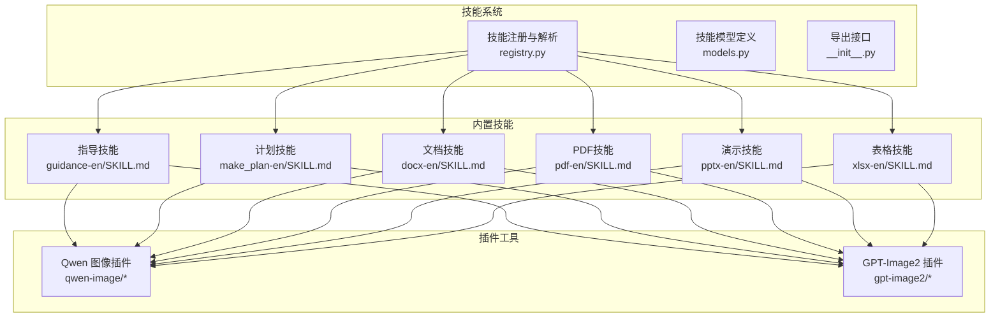
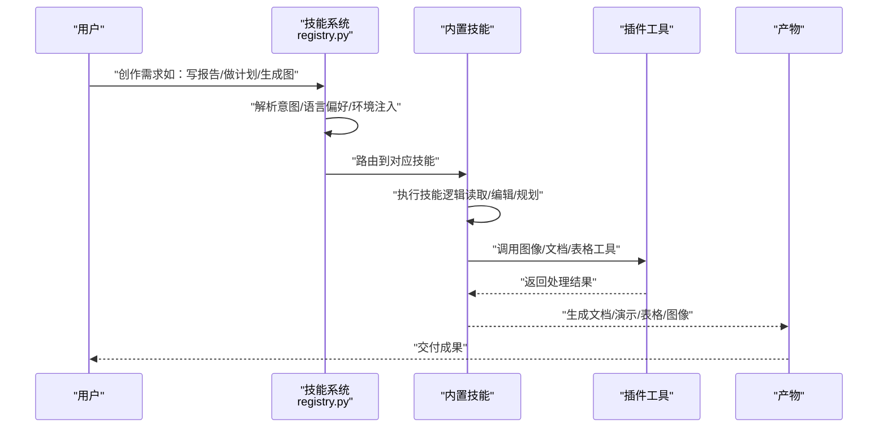
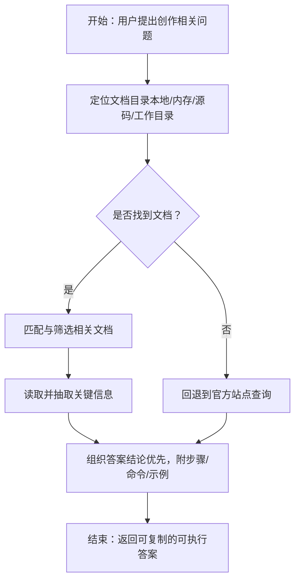
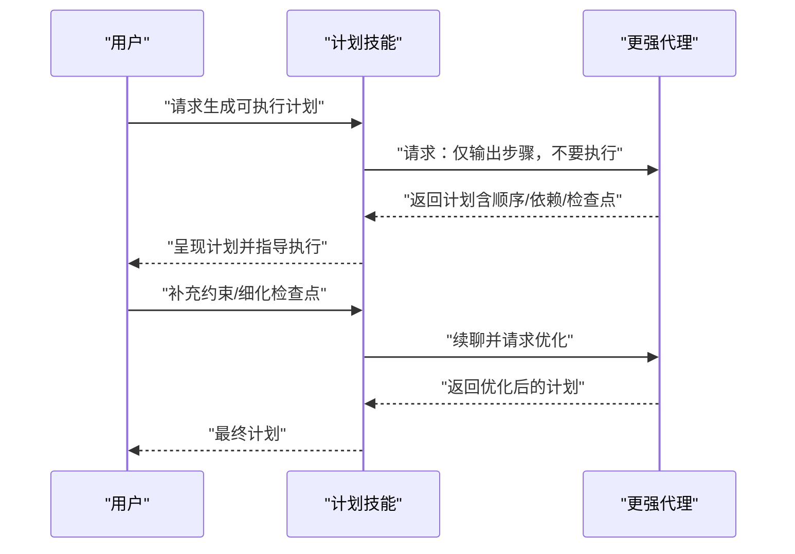
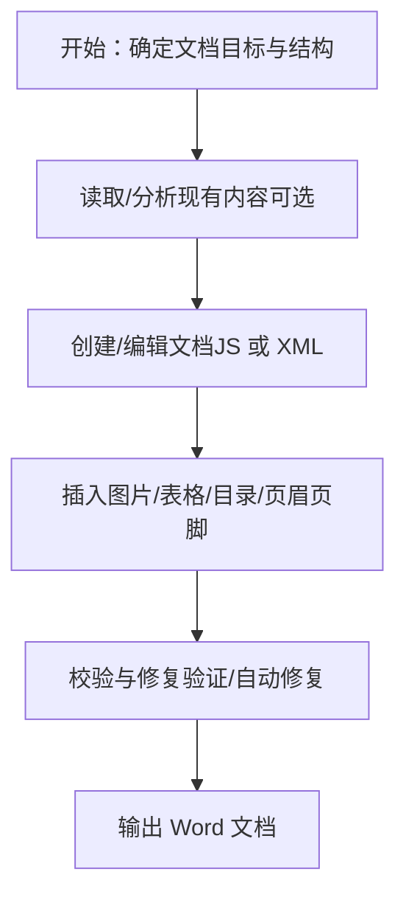
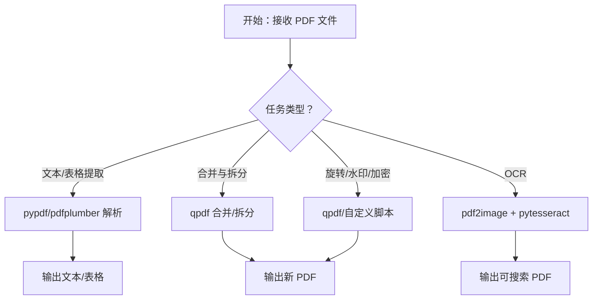
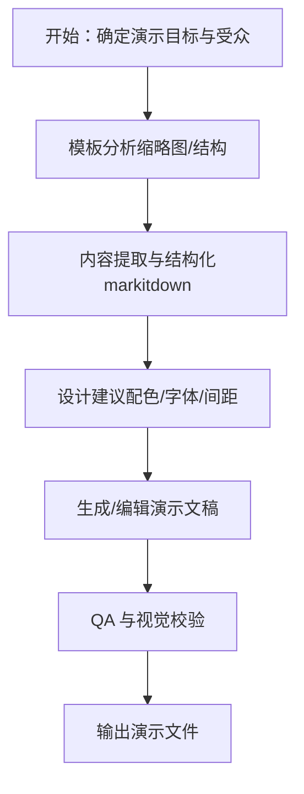
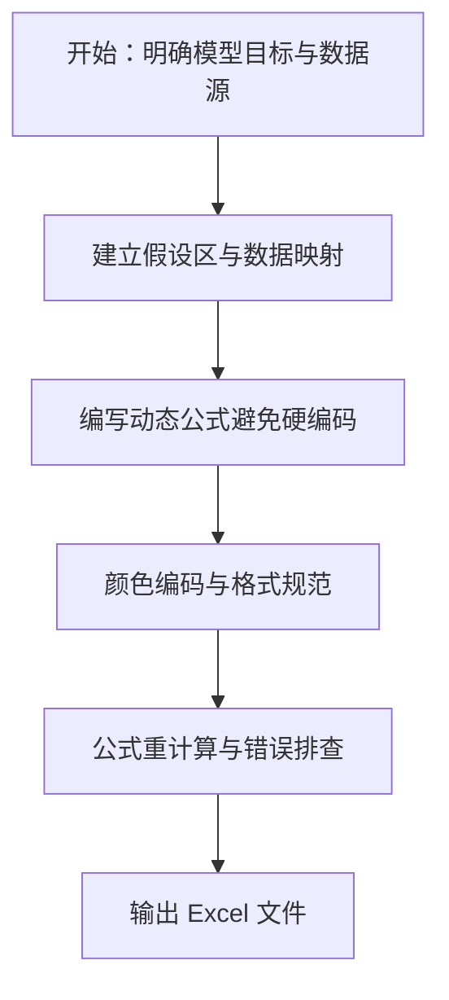
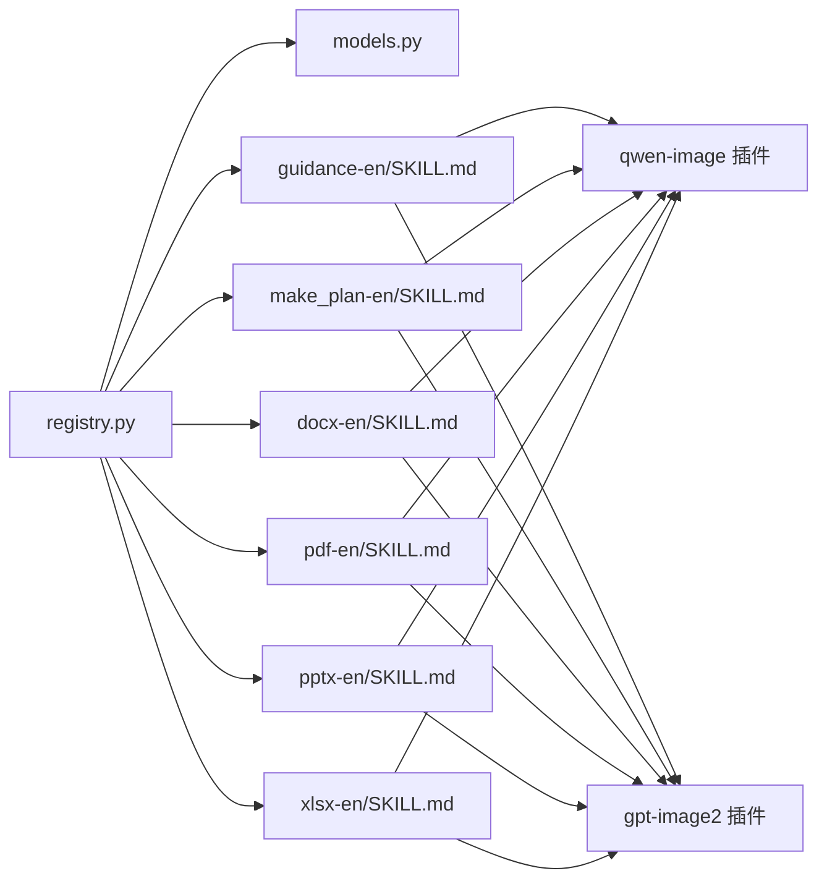

# 创意创作

<cite>
**本文引用的文件**
- [src/qwenpaw/agents/skill_system/__init__.py](file://src/qwenpaw/agents/skill_system/__init__.py)
- [src/qwenpaw/agents/skill_system/models.py](file://src/qwenpaw/agents/skill_system/models.py)
- [src/qwenpaw/agents/skill_system/registry.py](file://src/qwenpaw/agents/skill_system/registry.py)
- [src/qwenpaw/agents/skills/guidance-en/SKILL.md](file://src/qwenpaw/agents/skills/guidance-en/SKILL.md)
- [src/qwenpaw/agents/skills/make_plan-en/SKILL.md](file://src/qwenpaw/agents/skills/make_plan-en/SKILL.md)
- [src/qwenpaw/agents/skills/docx-en/SKILL.md](file://src/qwenpaw/agents/skills/docx-en/SKILL.md)
- [src/qwenpaw/agents/skills/pdf-en/SKILL.md](file://src/qwenpaw/agents/skills/pdf-en/SKILL.md)
- [src/qwenpaw/agents/skills/pptx-en/SKILL.md](file://src/qwenpaw/agents/skills/pptx-en/SKILL.md)
- [src/qwenpaw/agents/skills/xlsx-en/SKILL.md](file://src/qwenpaw/agents/skills/xlsx-en/SKILL.md)
- [plugins/tool/qwen-image/plugin.json](file://plugins/tool/qwen-image/plugin.json)
- [plugins/tool/qwen-image/qwen_image.py](file://plugins/tool/qwen-image/qwen_image.py)
- [plugins/tool/qwen-image/qwen_image_tool.py](file://plugins/tool/qwen-image/qwen_image_tool.py)
- [plugins/tool/gpt-image2/plugin.json](file://plugins/tool/gpt-image2/plugin.json)
- [plugins/tool/gpt-image2/gpt_image2.py](file://plugins/tool/gpt-image2/gpt_image2.py)
- [plugins/tool/gpt-image2/gpt_image2_tool.py](file://plugins/tool/gpt-image2/gpt_image2_tool.py)
</cite>

## 目录
1. [简介](#简介)
2. [项目结构](#项目结构)
3. [核心组件](#核心组件)
4. [架构总览](#架构总览)
5. [详细组件分析](#详细组件分析)
6. [依赖分析](#依赖分析)
7. [性能考虑](#性能考虑)
8. [故障排查指南](#故障排查指南)
9. [结论](#结论)
10. [附录](#附录)

## 简介
本文件面向“创意创作”场景，系统化阐述如何在 QwenPaw 中高效完成从“灵感到成品”的全流程创作：包括内容创作指导、项目计划制定、多媒体内容生成（图像与音频）、文档处理（Word/PDF/PowerPoint/Excel）以及素材整理归档。文档以技能体系为核心，结合内置技能与插件工具，给出可操作的工作流与最佳实践，并辅以可视化图示帮助不同背景用户快速上手。

## 项目结构
QwenPaw 的创意创作能力由“技能系统 + 内置技能 + 外部插件工具”三层构成：
- 技能系统：负责技能注册、语言偏好、环境变量注入、清单管理与版本协调。
- 内置技能：覆盖内容指导、计划制定、文档与多媒体处理等创意工作常用任务。
- 插件工具：提供图像生成等多模态能力，作为外部工具桥接。

图表来源
- [src/qwenpaw/agents/skill_system/registry.py](file://src/qwenpaw/agents/skill_system/registry.py)
- [src/qwenpaw/agents/skill_system/models.py](file://src/qwenpaw/agents/skill_system/models.py)
- [src/qwenpaw/agents/skill_system/__init__.py](file://src/qwenpaw/agents/skill_system/__init__.py)
- [src/qwenpaw/agents/skills/guidance-en/SKILL.md](file://src/qwenpaw/agents/skills/guidance-en/SKILL.md)
- [src/qwenpaw/agents/skills/make_plan-en/SKILL.md](file://src/qwenpaw/agents/skills/make_plan-en/SKILL.md)
- [src/qwenpaw/agents/skills/docx-en/SKILL.md](file://src/qwenpaw/agents/skills/docx-en/SKILL.md)
- [src/qwenpaw/agents/skills/pdf-en/SKILL.md](file://src/qwenpaw/agents/skills/pdf-en/SKILL.md)
- [src/qwenpaw/agents/skills/pptx-en/SKILL.md](file://src/qwenpaw/agents/skills/pptx-en/SKILL.md)
- [src/qwenpaw/agents/skills/xlsx-en/SKILL.md](file://src/qwenpaw/agents/skills/xlsx-en/SKILL.md)
- [plugins/tool/qwen-image/plugin.json](file://plugins/tool/qwen-image/plugin.json)
- [plugins/tool/gpt-image2/plugin.json](file://plugins/tool/gpt-image2/plugin.json)

章节来源
- [src/qwenpaw/agents/skill_system/__init__.py](file://src/qwenpaw/agents/skill_system/__init__.py)
- [src/qwenpaw/agents/skill_system/models.py](file://src/qwenpaw/agents/skill_system/models.py)
- [src/qwenpaw/agents/skill_system/registry.py](file://src/qwenpaw/agents/skill_system/registry.py)

## 核心组件
- 技能系统（Skill System）
  - 职责：统一管理内置技能清单、语言选择、环境变量注入、版本与冲突处理、工作区与池（pool/workspace）清单同步。
  - 关键点：支持按 UI 语言自动选择技能语言；通过环境变量注入技能配置；提供导入/更新/冲突提示等能力。
- 内置技能（Built-in Skills）
  - 指导技能：基于本地文档与官方站点进行问答，辅助创作前的知识准备与方向确认。
  - 计划技能：请求更强代理输出可执行步骤的计划，强调“你执行，他只给路径”。
  - 文档技能：Word 文档创建、编辑、图片插入、目录与页眉页脚、跟踪修订等。
  - PDF 技能：文本/表格提取、合并拆分、旋转、加水印、OCR、表单填充等。
  - 演示技能：PPTX 内容读取、模板分析、从零创建、缩略图生成、设计建议与质量检查。
  - 表格技能：Excel 动态公式、颜色编码、格式规范、公式重计算与错误排查。
- 插件工具（Plugins）
  - Qwen 图像与 GPT-Image2 提供图像生成能力，作为多模态创作的重要产出手段。

章节来源
- [src/qwenpaw/agents/skill_system/models.py](file://src/qwenpaw/agents/skill_system/models.py)
- [src/qwenpaw/agents/skill_system/registry.py](file://src/qwenpaw/agents/skill_system/registry.py)
- [src/qwenpaw/agents/skills/guidance-en/SKILL.md](file://src/qwenpaw/agents/skills/guidance-en/SKILL.md)
- [src/qwenpaw/agents/skills/make_plan-en/SKILL.md](file://src/qwenpaw/agents/skills/make_plan-en/SKILL.md)
- [src/qwenpaw/agents/skills/docx-en/SKILL.md](file://src/qwenpaw/agents/skills/docx-en/SKILL.md)
- [src/qwenpaw/agents/skills/pdf-en/SKILL.md](file://src/qwenpaw/agents/skills/pdf-en/SKILL.md)
- [src/qwenpaw/agents/skills/pptx-en/SKILL.md](file://src/qwenpaw/agents/skills/pptx-en/SKILL.md)
- [src/qwenpaw/agents/skills/xlsx-en/SKILL.md](file://src/qwenpaw/agents/skills/xlsx-en/SKILL.md)
- [plugins/tool/qwen-image/plugin.json](file://plugins/tool/qwen-image/plugin.json)
- [plugins/tool/gpt-image2/plugin.json](file://plugins/tool/gpt-image2/plugin.json)

## 架构总览
下图展示创意创作从“输入意图”到“多模态产物”的端到端流程：技能系统解析意图并路由到相应技能；技能调用内部工具或外部插件；最终形成文档、演示文稿、电子表格或图像等成果物。

图表来源
- [src/qwenpaw/agents/skill_system/registry.py](file://src/qwenpaw/agents/skill_system/registry.py)
- [src/qwenpaw/agents/skills/guidance-en/SKILL.md](file://src/qwenpaw/agents/skills/guidance-en/SKILL.md)
- [src/qwenpaw/agents/skills/make_plan-en/SKILL.md](file://src/qwenpaw/agents/skills/make_plan-en/SKILL.md)
- [src/qwenpaw/agents/skills/docx-en/SKILL.md](file://src/qwenpaw/agents/skills/docx-en/SKILL.md)
- [src/qwenpaw/agents/skills/pdf-en/SKILL.md](file://src/qwenpaw/agents/skills/pdf-en/SKILL.md)
- [src/qwenpaw/agents/skills/pptx-en/SKILL.md](file://src/qwenpaw/agents/skills/pptx-en/SKILL.md)
- [src/qwenpaw/agents/skills/xlsx-en/SKILL.md](file://src/qwenpaw/agents/skills/xlsx-en/SKILL.md)
- [plugins/tool/qwen-image/plugin.json](file://plugins/tool/qwen-image/plugin.json)
- [plugins/tool/gpt-image2/plugin.json](file://plugins/tool/gpt-image2/plugin.json)

## 详细组件分析

### 指导技能（内容创作前的灵感与知识准备）
- 适用场景
  - 需要快速定位安装配置、环境设置、依赖要求等前置信息时。
  - 在创作初期需要对主题、目标受众、风格范式进行方向性确认时。
- 工作流要点
  - 优先读取本地文档，再回退至官方站点。
  - 严格依据已读内容回答，避免臆测。
  - 保持与用户提问相同的语言。
- 实践建议
  - 将“创作主题/风格/交付形式”作为关键词，提升检索命中率。
  - 对于复杂问题，先用该技能梳理背景与边界，再进入具体创作阶段。

图表来源
- [src/qwenpaw/agents/skills/guidance-en/SKILL.md](file://src/qwenpaw/agents/skills/guidance-en/SKILL.md)

章节来源
- [src/qwenpaw/agents/skills/guidance-en/SKILL.md](file://src/qwenpaw/agents/skills/guidance-en/SKILL.md)

### 计划技能（制定可执行的创作流程）
- 适用场景
  - 需要将复杂创意分解为清晰、可验证的步骤。
  - 多模块/角色/文件协同，需要明确顺序、检查点与风险控制。
- 工作流要点
  - 明确“只请求计划，不外包执行”。
  - 强调步骤具体、顺序明确、包含依赖与验证方法。
  - 可通过会话 ID 迭代优化计划。
- 实践建议
  - 先列出候选更强代理，再针对性请求计划。
  - 接收计划后，结合自身环境进行落地调整与执行。

图表来源
- [src/qwenpaw/agents/skills/make_plan-en/SKILL.md](file://src/qwenpaw/agents/skills/make_plan-en/SKILL.md)

章节来源
- [src/qwenpaw/agents/skills/make_plan-en/SKILL.md](file://src/qwenpaw/agents/skills/make_plan-en/SKILL.md)

### 文档技能（Word 多媒体内容生成与排版）
- 适用场景
  - 生成/编辑 Word 报告、带目录/页眉页脚、插入图片、跟踪修订等。
- 关键能力
  - 新建文档：使用 JS 库构建段落、标题、列表、表格、分页等。
  - 编辑现有文档：解包 XML、修改后再打包，支持跟踪修订与评论。
  - 图片插入：指定类型与尺寸，确保可访问性属性齐全。
  - TOC 与样式：使用 HeadingLevel 并设置 outlineLevel，保证目录可用。
- 实践建议
  - 统一页面尺寸与边距，避免跨平台渲染差异。
  - 表格需同时设置“表宽+列宽”，并使用 CLEAR 遮罩避免黑底。
  - 使用智能引号实体，提升专业排版。

图表来源
- [src/qwenpaw/agents/skills/docx-en/SKILL.md](file://src/qwenpaw/agents/skills/docx-en/SKILL.md)

章节来源
- [src/qwenpaw/agents/skills/docx-en/SKILL.md](file://src/qwenpaw/agents/skills/docx-en/SKILL.md)

### PDF 技能（扫描件 OCR、表格提取与表单处理）
- 适用场景
  - 扫描 PDF 的文字识别与可搜索化。
  - 从 PDF 中提取文本与表格，用于二次加工。
  - 合并/拆分/旋转/加水印/加密/解密等基础操作。
- 关键能力
  - 文本与表格提取：pypdf、pdfplumber。
  - 命令行工具：pdftotext、qpdf、pdftoppm。
  - OCR：pdf2image + pytesseract。
- 实践建议
  - 先用 pdfplumber 提取表格，再转为 Excel 以便进一步处理。
  - 批量处理时，优先使用命令行工具提高吞吐。

图表来源
- [src/qwenpaw/agents/skills/pdf-en/SKILL.md](file://src/qwenpaw/agents/skills/pdf-en/SKILL.md)

章节来源
- [src/qwenpaw/agents/skills/pdf-en/SKILL.md](file://src/qwenpaw/agents/skills/pdf-en/SKILL.md)

### 演示技能（PPTX 内容读取、模板分析与设计建议）
- 适用场景
  - 从零创建高质量演示文稿，或对既有演示进行编辑与优化。
- 关键能力
  - 内容读取：markitdown 提取文本与结构。
  - 模板分析：缩略图生成，快速把握布局与配色。
  - 设计建议：色彩搭配、字体组合、间距与视觉元素。
  - 质量检查：QA 流程与视觉对比，确保无错字、错位、低对比度等问题。
- 实践建议
  - 先用缩略图审视整体结构，再逐页精修。
  - 采用“子代理”视角进行二次校验，避免“近墨者黑”。

图表来源
- [src/qwenpaw/agents/skills/pptx-en/SKILL.md](file://src/qwenpaw/agents/skills/pptx-en/SKILL.md)

章节来源
- [src/qwenpaw/agents/skills/pptx-en/SKILL.md](file://src/qwenpaw/agents/skills/pptx-en/SKILL.md)

### 表格技能（Excel 动态模型与公式重计算）
- 适用场景
  - 财务/预测/分析模型，需要动态公式、颜色编码与格式规范。
- 关键能力
  - 动态公式优先：严禁硬编码数值，确保可更新。
  - 颜色编码标准：区分假设、计算、链接与外部数据。
  - 数字格式规范：货币、百分比、倍数、负数显示。
  - 公式重计算与错误排查：使用脚本自动计算并定位错误。
- 实践建议
  - 先建立假设区，再串联公式，最后统一格式与注释。
  - 使用脚本批量重计算，确保所有单元格值最新。

图表来源
- [src/qwenpaw/agents/skills/xlsx-en/SKILL.md](file://src/qwenpaw/agents/skills/xlsx-en/SKILL.md)

章节来源
- [src/qwenpaw/agents/skills/xlsx-en/SKILL.md](file://src/qwenpaw/agents/skills/xlsx-en/SKILL.md)

### 多模态内容生成（图像与音频）
- 图像生成
  - 通过插件工具桥接外部图像生成服务，支持提示词驱动的图像创作。
  - 建议在提示词中明确风格、构图、色调与分辨率，以提升一致性。
- 音频生成
  - 可结合文本转语音或音频合成工具，实现旁白、音效与背景音乐的自动化生成。
- 实践建议
  - 先用“指导技能”明确风格与交付规格，再用“计划技能”制定生成与审核流程。
  - 将生成结果纳入“文档/演示/表格”工作流，统一归档与版本控制。

章节来源
- [plugins/tool/qwen-image/plugin.json](file://plugins/tool/qwen-image/plugin.json)
- [plugins/tool/qwen-image/qwen_image.py](file://plugins/tool/qwen-image/qwen_image.py)
- [plugins/tool/qwen-image/qwen_image_tool.py](file://plugins/tool/qwen-image/qwen_image_tool.py)
- [plugins/tool/gpt-image2/plugin.json](file://plugins/tool/gpt-image2/plugin.json)
- [plugins/tool/gpt-image2/gpt_image2.py](file://plugins/tool/gpt-image2/gpt_image2.py)
- [plugins/tool/gpt-image2/gpt_image2_tool.py](file://plugins/tool/gpt-image2/gpt_image2_tool.py)

## 依赖分析
- 技能系统与内置技能
  - registry.py 负责语言偏好、内置技能导入与版本协调，确保技能清单稳定一致。
  - models.py 定义技能元数据、依赖与冲突类型，支撑运行期决策。
- 技能与插件
  - 指导/计划/文档/PDF/演示/表格技能均可调用插件工具，形成“技能层 + 工具层”的协作模式。
- 外部依赖
  - 文档/演示/表格技能依赖第三方库（如 docx、pypdf、pdfplumber、pptxgenjs、openpyxl 等），需按技能文档安装。

图表来源
- [src/qwenpaw/agents/skill_system/registry.py](file://src/qwenpaw/agents/skill_system/registry.py)
- [src/qwenpaw/agents/skill_system/models.py](file://src/qwenpaw/agents/skill_system/models.py)
- [src/qwenpaw/agents/skills/guidance-en/SKILL.md](file://src/qwenpaw/agents/skills/guidance-en/SKILL.md)
- [src/qwenpaw/agents/skills/make_plan-en/SKILL.md](file://src/qwenpaw/agents/skills/make_plan-en/SKILL.md)
- [src/qwenpaw/agents/skills/docx-en/SKILL.md](file://src/qwenpaw/agents/skills/docx-en/SKILL.md)
- [src/qwenpaw/agents/skills/pdf-en/SKILL.md](file://src/qwenpaw/agents/skills/pdf-en/SKILL.md)
- [src/qwenpaw/agents/skills/pptx-en/SKILL.md](file://src/qwenpaw/agents/skills/pptx-en/SKILL.md)
- [src/qwenpaw/agents/skills/xlsx-en/SKILL.md](file://src/qwenpaw/agents/skills/xlsx-en/SKILL.md)
- [plugins/tool/qwen-image/plugin.json](file://plugins/tool/qwen-image/plugin.json)
- [plugins/tool/gpt-image2/plugin.json](file://plugins/tool/gpt-image2/plugin.json)

章节来源
- [src/qwenpaw/agents/skill_system/registry.py](file://src/qwenpaw/agents/skill_system/registry.py)
- [src/qwenpaw/agents/skill_system/models.py](file://src/qwenpaw/agents/skill_system/models.py)

## 性能考虑
- 依赖安装与缓存
  - 文档/演示/表格技能涉及较多外部库，建议一次性安装并缓存，减少重复开销。
- 批量处理
  - PDF 提取与图像生成适合批量化流水线，优先使用命令行工具与脚本。
- 公式重计算
  - Excel 公式重计算耗时较长，建议在变更后集中执行，避免频繁触发。
- 版本与冲突
  - 使用技能系统提供的版本与冲突检测机制，避免因技能升级导致的执行失败。

## 故障排查指南
- 技能语言与环境
  - 若技能未按预期语言返回，请检查 UI 语言设置与技能语言偏好缓存。
  - 环境变量注入失败时，查看技能配置中的 require_envs 是否缺失。
- 文档/演示/表格生成异常
  - 文档校验失败：使用内置修复流程，关注自动修复无法解决的结构性问题。
  - 表格公式错误：使用重计算脚本定位错误类型与位置，逐一修正。
- PDF 处理问题
  - OCR 失败：确认 poppler 与 tesseract 安装路径正确且权限充足。
  - 合并/拆分失败：检查 qpdf 参数与输入文件权限。
- 图像生成问题
  - 提示词不生效：核对插件参数与风格约束，必要时简化提示词并逐步迭代。

章节来源
- [src/qwenpaw/agents/skill_system/registry.py](file://src/qwenpaw/agents/skill_system/registry.py)
- [src/qwenpaw/agents/skills/docx-en/SKILL.md](file://src/qwenpaw/agents/skills/docx-en/SKILL.md)
- [src/qwenpaw/agents/skills/xlsx-en/SKILL.md](file://src/qwenpaw/agents/skills/xlsx-en/SKILL.md)
- [src/qwenpaw/agents/skills/pdf-en/SKILL.md](file://src/qwenpaw/agents/skills/pdf-en/SKILL.md)

## 结论
QwenPaw 的创意创作体系以“技能系统 + 内置技能 + 插件工具”为核心，覆盖从“灵感获取、计划制定、内容生成、文档与多媒体处理、表格建模”到“素材整理归档”的全链路。通过标准化工作流与严格的工具约束，既能保障创意效率，又能确保交付质量。建议在实际使用中，先用“指导技能”明确方向，再用“计划技能”固化步骤，随后结合“文档/演示/表格/图像”技能完成多模态创作，并以“PDF/表格重计算/演示 QA”闭环质量。

## 附录
- 快速参考
  - 指导技能：优先本地文档，再回退官方站点；答案语言与用户一致。
  - 计划技能：只请求计划，不外包执行；步骤需具体、有序、可验证。
  - 文档技能：统一页面尺寸与边距；表格需双宽一致；图片需指定类型与可访问属性。
  - PDF 技能：文本/表格提取优先 pypdf/pdfplumber；OCR 使用 pdf2image + pytesseract。
  - 演示技能：先模板分析，再设计建议，最后 QA 视觉校验。
  - 表格技能：动态公式优先；颜色编码与格式规范；公式重计算与错误排查。
  - 多模态：图像生成建议明确风格与分辨率；音频生成配合旁白与音效。