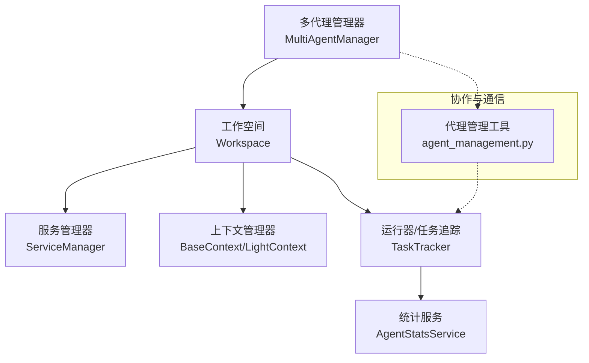
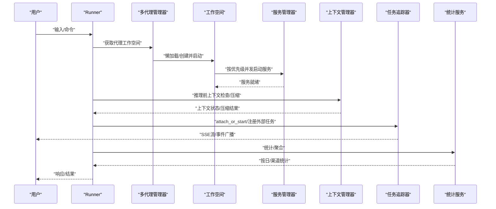
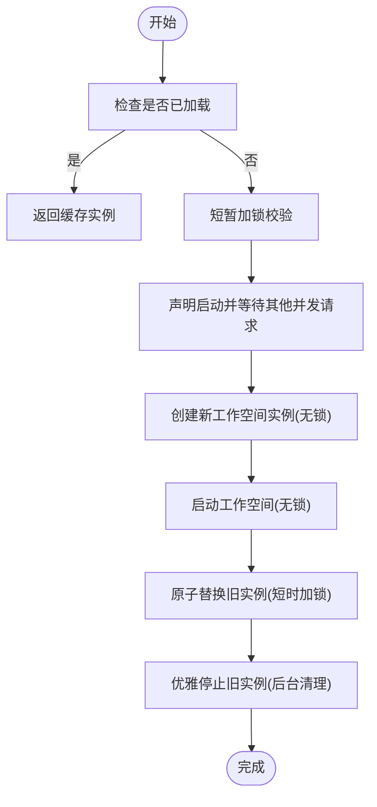
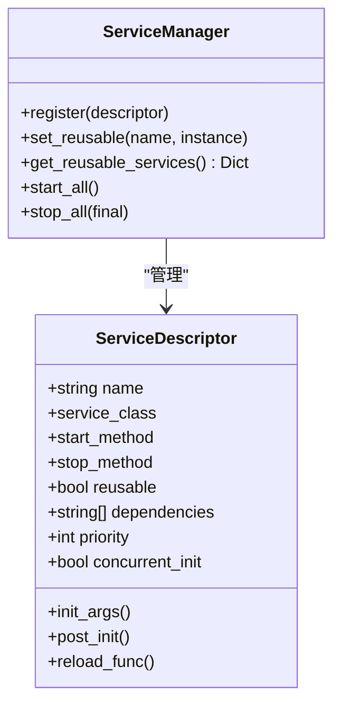
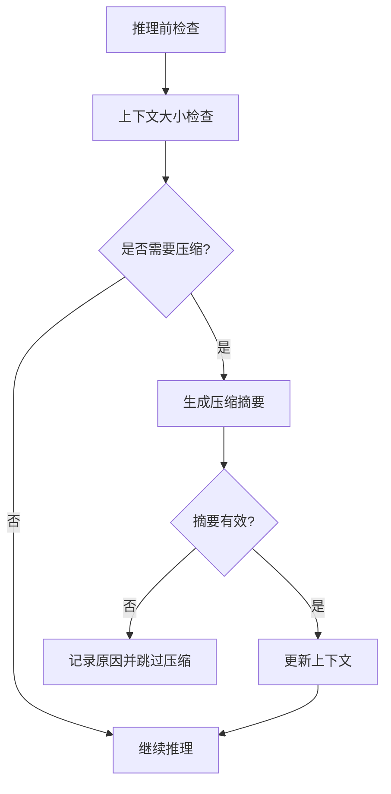
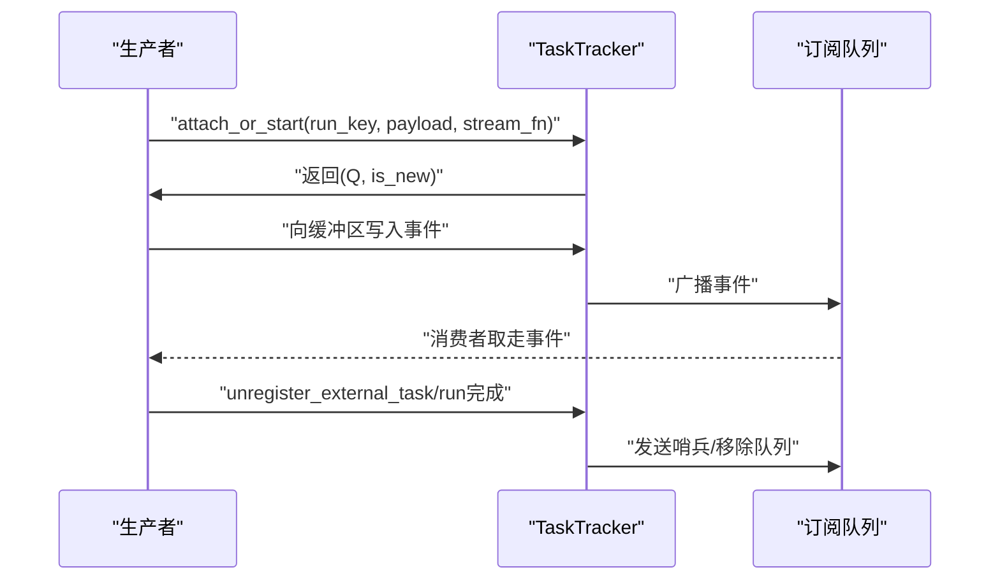
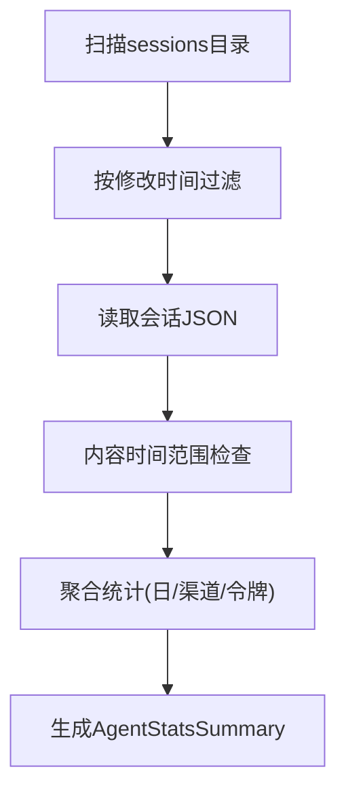
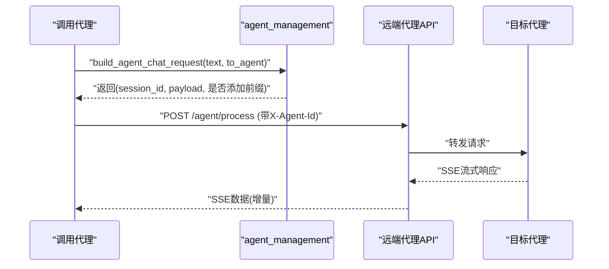
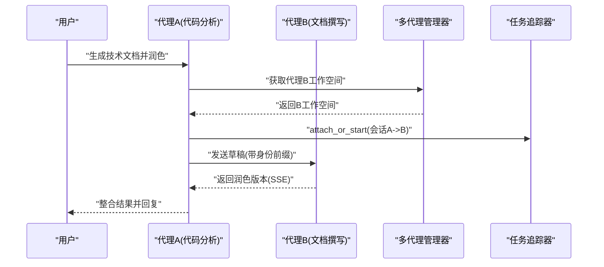
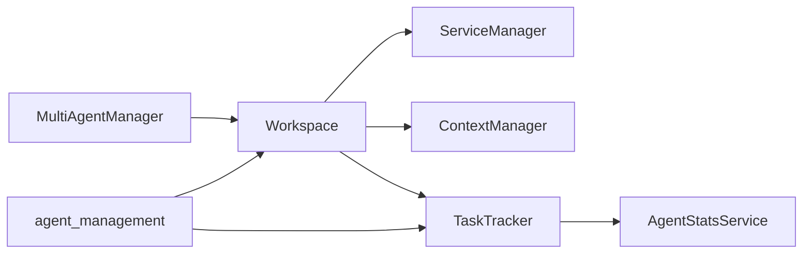

# 多代理协作

<cite>
**本文引用的文件**
- [src/qwenpaw/app/multi_agent_manager.py](file://src/qwenpaw/app/multi_agent_manager.py)
- [src/qwenpaw/app/workspace/service_manager.py](file://src/qwenpaw/app/workspace/service_manager.py)
- [src/qwenpaw/agents/context/base_context_manager.py](file://src/qwenpaw/agents/context/base_context_manager.py)
- [src/qwenpaw/agents/context/light_context_manager.py](file://src/qwenpaw/agents/context/light_context_manager.py)
- [src/qwenpaw/agents/tools/agent_management.py](file://src/qwenpaw/agents/tools/agent_management.py)
- [src/qwenpaw/app/runner/task_tracker.py](file://src/qwenpaw/app/runner/task_tracker.py)
- [src/qwenpaw/app/runner/mission_dispatch.py](file://src/qwenpaw/app/runner/mission_dispatch.py)
- [src/qwenpaw/agent_stats/service.py](file://src/qwenpaw/agent_stats/service.py)
- [src/qwenpaw/agent_stats/models.py](file://src/qwenpaw/agent_stats/models.py)
- [website/public/docs/multi-agent.en.md](file://website/public/docs/multi-agent.en.md)
- [console/src/pages/Settings/AgentStats/index.tsx](file://console/src/pages/Settings/AgentStats/index.tsx)
- [console/src/api/modules/agentStats.ts](file://console/src/api/modules/agentStats.ts)
</cite>

## 目录
1. [简介](#简介)
2. [项目结构](#项目结构)
3. [核心组件](#核心组件)
4. [架构总览](#架构总览)
5. [详细组件分析](#详细组件分析)
6. [依赖分析](#依赖分析)
7. [性能考虑](#性能考虑)
8. [故障排查指南](#故障排查指南)
9. [结论](#结论)
10. [附录](#附录)

## 简介
本文件面向“多代理协作”场景，系统性阐述QwenPaw在复杂任务处理中的应用与实现方式，覆盖以下主题：
- 多代理角色分配与生命周期管理
- 代理间通信与协作机制（含跨代理消息路由）
- 分布式任务执行与零停机热重载
- 团队协作模式与工作流编排（含任务分解、资源调度、结果整合）
- 监控与统计、负载均衡与故障恢复策略

目标是帮助读者从架构到落地，掌握如何在QwenPaw中创建、编排与运维多代理团队，并通过统一的管理器与服务框架实现高可用、可扩展的协作。

## 项目结构
围绕多代理协作的关键模块分布如下：
- 应用层管理：多代理管理器负责实例化、启动、停止、热重载与并发启动
- 工作空间与服务：工作空间内聚服务注册、生命周期与可复用组件
- 上下文与记忆：上下文管理器负责对话窗口压缩、工具结果裁剪与上下文健康检查
- 协作与通信：跨代理聊天请求构建与会话绑定
- 运行时与追踪：任务追踪器支持SSE流、外部任务挂接与全局状态查询
- 统计与监控：按日/渠道聚合统计，前端可视化展示

图表来源
- [src/qwenpaw/app/multi_agent_manager.py:22-537](file://src/qwenpaw/app/multi_agent_manager.py#L22-L537)
- [src/qwenpaw/app/workspace/service_manager.py:76-453](file://src/qwenpaw/app/workspace/service_manager.py#L76-L453)
- [src/qwenpaw/agents/context/base_context_manager.py:15-267](file://src/qwenpaw/agents/context/base_context_manager.py#L15-L267)
- [src/qwenpaw/agents/context/light_context_manager.py:47-800](file://src/qwenpaw/agents/context/light_context_manager.py#L47-L800)
- [src/qwenpaw/app/runner/task_tracker.py:37-350](file://src/qwenpaw/app/runner/task_tracker.py#L37-L350)
- [src/qwenpaw/agent_stats/service.py:180-375](file://src/qwenpaw/agent_stats/service.py#L180-L375)
- [src/qwenpaw/agents/tools/agent_management.py:192-235](file://src/qwenpaw/agents/tools/agent_management.py#L192-L235)

章节来源
- [src/qwenpaw/app/multi_agent_manager.py:22-537](file://src/qwenpaw/app/multi_agent_manager.py#L22-L537)
- [src/qwenpaw/app/workspace/service_manager.py:76-453](file://src/qwenpaw/app/workspace/service_manager.py#L76-L453)

## 核心组件
- 多代理管理器（MultiAgentManager）：集中管理多个代理工作空间，支持懒加载、并发启动、原子替换与零停机热重载；提供预加载、批量启动、停止与清理
- 服务管理器（ServiceManager）：统一注册、依赖解析、并发/顺序启动、可复用组件传递与优雅关闭
- 上下文管理器（BaseContext/LightContext）：上下文健康检查、消息压缩、工具结果裁剪、会话状态打印与安全压缩
- 任务追踪器（TaskTracker）：SSE流广播、外部任务挂接、全局状态查询、主动停止与缓冲回放
- 统计服务（AgentStatsService）：按日/渠道聚合统计、活跃会话数、消息与工具调用计数、令牌用量汇总
- 跨代理通信（agent_management）：构建跨代理聊天请求、会话ID解析与身份前缀注入

章节来源
- [src/qwenpaw/app/multi_agent_manager.py:22-537](file://src/qwenpaw/app/multi_agent_manager.py#L22-L537)
- [src/qwenpaw/app/workspace/service_manager.py:76-453](file://src/qwenpaw/app/workspace/service_manager.py#L76-L453)
- [src/qwenpaw/agents/context/base_context_manager.py:15-267](file://src/qwenpaw/agents/context/base_context_manager.py#L15-L267)
- [src/qwenpaw/agents/context/light_context_manager.py:47-800](file://src/qwenpaw/agents/context/light_context_manager.py#L47-L800)
- [src/qwenpaw/app/runner/task_tracker.py:37-350](file://src/qwenpaw/app/runner/task_tracker.py#L37-L350)
- [src/qwenpaw/agent_stats/service.py:180-375](file://src/qwenpaw/agent_stats/service.py#L180-L375)
- [src/qwenpaw/agents/tools/agent_management.py:192-235](file://src/qwenpaw/agents/tools/agent_management.py#L192-L235)

## 架构总览
下图展示了多代理协作的端到端路径：用户请求进入Runner后，由多代理管理器选择或创建目标代理工作空间；工作空间内的服务管理器按优先级并发启动；上下文管理器在推理前后进行上下文压缩与裁剪；任务追踪器支撑SSE流与外部任务；最终由统计服务汇总指标。

图表来源
- [src/qwenpaw/app/multi_agent_manager.py:42-137](file://src/qwenpaw/app/multi_agent_manager.py#L42-L137)
- [src/qwenpaw/app/workspace/service_manager.py:173-214](file://src/qwenpaw/app/workspace/service_manager.py#L173-L214)
- [src/qwenpaw/agents/context/light_context_manager.py:706-800](file://src/qwenpaw/agents/context/light_context_manager.py#L706-L800)
- [src/qwenpaw/app/runner/task_tracker.py:248-327](file://src/qwenpaw/app/runner/task_tracker.py#L248-L327)
- [src/qwenpaw/agent_stats/service.py:180-375](file://src/qwenpaw/agent_stats/service.py#L180-L375)

## 详细组件分析

### 多代理管理器（MultiAgentManager）
职责与能力
- 懒加载：首次访问时创建并启动工作空间，避免冷启动开销
- 并发启动：对多个代理同时初始化，锁仅在必要时持有，提升整体启动效率
- 原子替换与零停机热重载：新实例完全启动后原子替换旧实例，旧实例在后台完成活动任务后再停止
- 可靠停止：支持优雅停止与延迟清理，确保正在运行的任务不被中断
- 预加载与批量启动：支持启动时预加载与并发启动所有启用的代理

图表来源
- [src/qwenpaw/app/multi_agent_manager.py:42-137](file://src/qwenpaw/app/multi_agent_manager.py#L42-L137)
- [src/qwenpaw/app/multi_agent_manager.py:255-382](file://src/qwenpaw/app/multi_agent_manager.py#L255-L382)

章节来源
- [src/qwenpaw/app/multi_agent_manager.py:22-537](file://src/qwenpaw/app/multi_agent_manager.py#L22-L537)

### 服务管理器（ServiceManager）
职责与能力
- 描述符注册与生命周期：通过描述符定义服务类、初始化参数、后置初始化钩子、启动/停止方法、可复用性与依赖关系
- 启动策略：按优先级分组，同优先级并发启动；顺序服务串行启动；启动期间让出事件循环以服务HTTP请求
- 可复用组件：在热重载时将可复用服务从旧实例转移到新实例，减少重启成本
- 关闭策略：按优先级逆序关闭；可选择是否关闭可复用服务；错误记录但不影响整体关闭

图表来源
- [src/qwenpaw/app/workspace/service_manager.py:32-107](file://src/qwenpaw/app/workspace/service_manager.py#L32-L107)
- [src/qwenpaw/app/workspace/service_manager.py:173-453](file://src/qwenpaw/app/workspace/service_manager.py#L173-L453)

章节来源
- [src/qwenpaw/app/workspace/service_manager.py:76-453](file://src/qwenpaw/app/workspace/service_manager.py#L76-L453)

### 上下文管理器（BaseContext/LightContext）
职责与能力
- 推理前检查：根据阈值判断是否需要压缩，计算保留与待压缩消息数量
- 安全压缩：使用专用模型生成压缩摘要，失败时提供回退
- 工具结果裁剪：对超长工具输出进行截断或落盘，保留文件路径提示
- 生命周期钩子：在回复前检索记忆、在推理前后与回复后插入处理逻辑

图表来源
- [src/qwenpaw/agents/context/light_context_manager.py:706-800](file://src/qwenpaw/agents/context/light_context_manager.py#L706-L800)
- [src/qwenpaw/agents/context/light_context_manager.py:386-553](file://src/qwenpaw/agents/context/light_context_manager.py#L386-L553)

章节来源
- [src/qwenpaw/agents/context/base_context_manager.py:15-267](file://src/qwenpaw/agents/context/base_context_manager.py#L15-L267)
- [src/qwenpaw/agents/context/light_context_manager.py:47-800](file://src/qwenpaw/agents/context/light_context_manager.py#L47-L800)

### 任务追踪器（TaskTracker）
职责与能力
- SSE流：为每个run_key维护事件缓冲与订阅队列，支持断线重连与缓冲回放
- 外部任务：注册/注销外部任务，使其纳入活跃任务统计与等待完成
- 全局状态：提供运行/空闲状态、活跃任务计数与最近运行/结束时间
- 主动停止：取消指定run_key对应的运行任务

图表来源
- [src/qwenpaw/app/runner/task_tracker.py:248-327](file://src/qwenpaw/app/runner/task_tracker.py#L248-L327)
- [src/qwenpaw/app/runner/task_tracker.py:131-187](file://src/qwenpaw/app/runner/task_tracker.py#L131-L187)

章节来源
- [src/qwenpaw/app/runner/task_tracker.py:37-350](file://src/qwenpaw/app/runner/task_tracker.py#L37-L350)

### 统计服务（AgentStatsService）
职责与能力
- 数据源：读取chats.json与sessions目录，按日期/渠道聚合统计
- 计算维度：每日聊天数、活跃会话、用户/助手消息数、工具调用次数、令牌用量
- 输出模型：按日明细与渠道汇总的结构化数据

图表来源
- [src/qwenpaw/agent_stats/service.py:180-375](file://src/qwenpaw/agent_stats/service.py#L180-L375)
- [src/qwenpaw/agent_stats/models.py:9-43](file://src/qwenpaw/agent_stats/models.py#L9-L43)

章节来源
- [src/qwenpaw/agent_stats/service.py:180-375](file://src/qwenpaw/agent_stats/service.py#L180-L375)
- [src/qwenpaw/agent_stats/models.py:9-43](file://src/qwenpaw/agent_stats/models.py#L9-L43)

### 跨代理协作与通信（agent_management）
职责与能力
- 请求构建：为跨代理聊天构造payload，解析会话ID，注入调用方身份前缀
- 会话绑定：基于调用方与目标方生成稳定的会话ID，支持根会话ID用于审批路由
- HTTP交互：通过SSE接收远端代理的增量输出，支持超时与错误处理

图表来源
- [src/qwenpaw/agents/tools/agent_management.py:192-235](file://src/qwenpaw/agents/tools/agent_management.py#L192-L235)

章节来源
- [src/qwenpaw/agents/tools/agent_management.py:192-235](file://src/qwenpaw/agents/tools/agent_management.py#L192-L235)

### 多代理协作工作流示例
以下为典型协作场景的端到端流程（以“跨域协作+专业评审+数据共享”为例），展示任务分解、资源调度与结果整合：

图表来源
- [src/qwenpaw/app/multi_agent_manager.py:42-137](file://src/qwenpaw/app/multi_agent_manager.py#L42-L137)
- [src/qwenpaw/app/runner/task_tracker.py:248-327](file://src/qwenpaw/app/runner/task_tracker.py#L248-L327)
- [src/qwenpaw/agents/tools/agent_management.py:192-235](file://src/qwenpaw/agents/tools/agent_management.py#L192-L235)

章节来源
- [website/public/docs/multi-agent.en.md:256-417](file://website/public/docs/multi-agent.en.md#L256-L417)

## 依赖分析
- 多代理管理器依赖配置加载与工作空间生命周期；通过细粒度锁与事件协调并发启动
- 工作空间依赖服务管理器进行组件注册与启动；服务管理器内部按优先级与依赖关系组织
- 上下文管理器依赖记忆与令牌计数器；在推理前后插入上下文压缩与裁剪
- 任务追踪器为Runner提供SSE流与外部任务挂接；与统计服务共享数据源
- 统计服务依赖会话存储与令牌用量管理器；前端通过API拉取并展示

图表来源
- [src/qwenpaw/app/multi_agent_manager.py:22-537](file://src/qwenpaw/app/multi_agent_manager.py#L22-L537)
- [src/qwenpaw/app/workspace/service_manager.py:76-453](file://src/qwenpaw/app/workspace/service_manager.py#L76-L453)
- [src/qwenpaw/agents/context/light_context_manager.py:47-800](file://src/qwenpaw/agents/context/light_context_manager.py#L47-L800)
- [src/qwenpaw/app/runner/task_tracker.py:37-350](file://src/qwenpaw/app/runner/task_tracker.py#L37-L350)
- [src/qwenpaw/agent_stats/service.py:180-375](file://src/qwenpaw/agent_stats/service.py#L180-L375)
- [src/qwenpaw/agents/tools/agent_management.py:192-235](file://src/qwenpaw/agents/tools/agent_management.py#L192-L235)

章节来源
- [src/qwenpaw/app/multi_agent_manager.py:22-537](file://src/qwenpaw/app/multi_agent_manager.py#L22-L537)
- [src/qwenpaw/app/workspace/service_manager.py:76-453](file://src/qwenpaw/app/workspace/service_manager.py#L76-L453)
- [src/qwenpaw/agents/context/light_context_manager.py:47-800](file://src/qwenpaw/agents/context/light_context_manager.py#L47-L800)
- [src/qwenpaw/app/runner/task_tracker.py:37-350](file://src/qwenpaw/app/runner/task_tracker.py#L37-L350)
- [src/qwenpaw/agent_stats/service.py:180-375](file://src/qwenpaw/agent_stats/service.py#L180-L375)
- [src/qwenpaw/agents/tools/agent_management.py:192-235](file://src/qwenpaw/agents/tools/agent_management.py#L192-L235)

## 性能考虑
- 启动性能
  - 多代理并发启动：通过“锁仅持有一小段时间 + 慢启动阶段无锁”实现并行，显著缩短冷启动时间
  - 服务并发初始化：同优先级服务并发启动，不同优先级顺序启动，中间让出事件循环
- 运行性能
  - 上下文压缩：在接近阈值时进行压缩，避免频繁大消息导致超限
  - 工具结果裁剪：对超长输出进行截断或落盘，降低内存与令牌消耗
  - SSE流广播：订阅队列无界，断线重连自动回放缓冲，保证实时性
- 统计性能
  - 文件扫描与并发处理：使用信号量限制并发FD，按修改时间与内容范围快速跳过
  - 聚合计算：按日/渠道增量聚合，减少重复扫描

## 故障排查指南
- 启动失败
  - 检查配置中是否存在目标代理ID；若不存在会抛出配置异常
  - 查看多代理管理器日志，确认是否在并发启动时出现竞态
- 热重载异常
  - 新实例启动失败时会尝试停止新实例并保留旧实例；检查新实例启动日志
  - 若旧实例长时间未停止，查看延迟清理任务是否被取消或异常
- 上下文压缩失败
  - 检查模型可用性与格式化器；压缩失败会回退并记录原因
  - 确认工具结果裁剪配置（豁免工具/文件扩展名）是否合理
- SSE流异常
  - 检查订阅队列是否被正确移除；断线后应自动回放缓冲
  - 外部任务需显式注册/注销，否则无法纳入活跃任务统计
- 统计缺失
  - 确认sessions目录存在且有目标日期范围内的文件
  - 检查令牌用量管理器是否正常工作

章节来源
- [src/qwenpaw/app/multi_agent_manager.py:82-105](file://src/qwenpaw/app/multi_agent_manager.py#L82-L105)
- [src/qwenpaw/agent_stats/service.py:28-94](file://src/qwenpaw/agent_stats/service.py#L28-L94)
- [src/qwenpaw/app/runner/task_tracker.py:131-187](file://src/qwenpaw/app/runner/task_tracker.py#L131-L187)

## 结论
QwenPaw通过“多代理管理器 + 工作空间服务管理 + 上下文压缩 + 任务追踪 + 统计服务”的组合，提供了高可用、可扩展的多代理协作基础设施。借助零停机热重载、并发启动与SSE流，系统能够在复杂业务场景中稳定地进行任务分解、资源调度与结果整合；配合统计与监控，可实现可观测、可治理的团队协作体系。

## 附录
- 多代理协作文档（英文）：[multi-agent.en.md:256-417](file://website/public/docs/multi-agent.en.md#L256-L417)
- 前端统计页面：[AgentStatsPage:95-141](file://console/src/pages/Settings/AgentStats/index.tsx#L95-L141)
- 前端统计API：[agentStatsApi:9-16](file://console/src/api/modules/agentStats.ts#L9-L16)