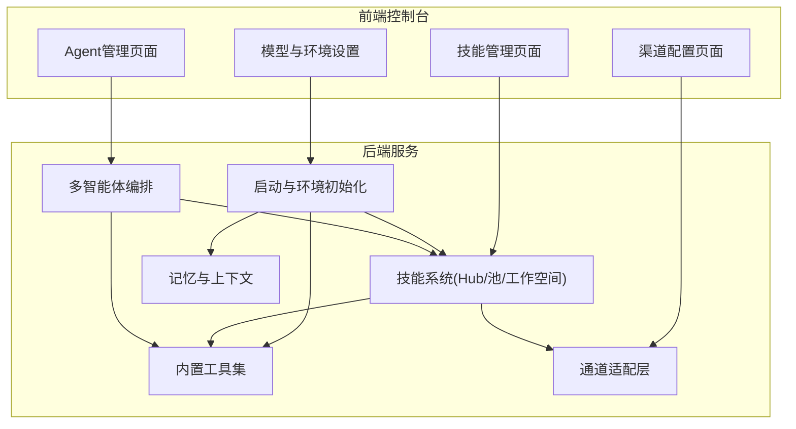
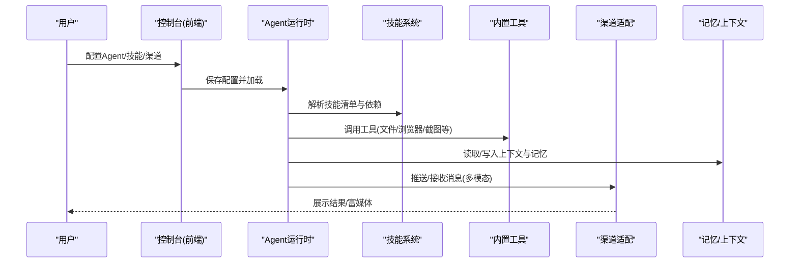
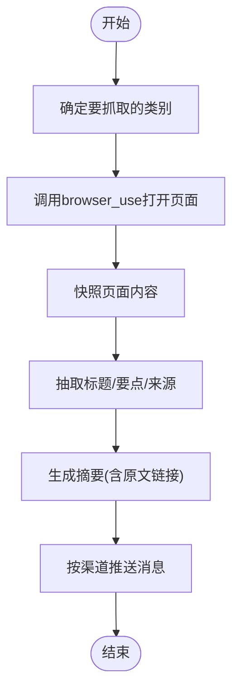
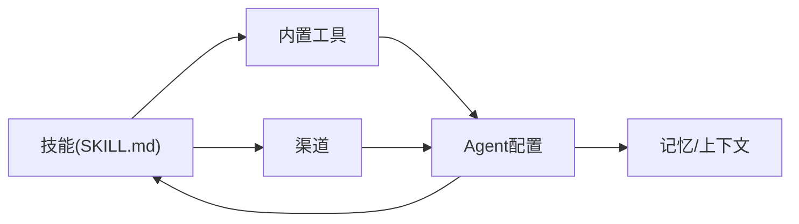

# 应用场景

<cite>
**本文引用的文件**
- [README.md](file://README.md)
- [src/qwenpaw/__init__.py](file://src/qwenpaw/__init__.py)
- [src/qwenpaw/agents/tools/__init__.py](file://src/qwenpaw/agents/tools/__init__.py)
- [src/qwenpaw/agents/tools/browser_control.py](file://src/qwenpaw/agents/tools/browser_control.py)
- [src/qwenpaw/config/config.py](file://src/qwenpaw/config/config.py)
- [src/qwenpaw/agents/skill_system/hub.py](file://src/qwenpaw/agents/skill_system/hub.py)
- [src/qwenpaw/agents/skills/news-en/SKILL.md](file://src/qwenpaw/agents/skills/news-en/SKILL.md)
- [src/qwenpaw/agents/skills/make_plan-en/SKILL.md](file://src/qwenpaw/agents/skills/make_plan-en/SKILL.md)
- [src/qwenpaw/agents/skills/file_reader-en/SKILL.md](file://src/qwenpaw/agents/skills/file_reader-en/SKILL.md)
- [src/qwenpaw/agents/skills/pdf-en/SKILL.md](file://src/qwenpaw/agents/skills/pdf-en/SKILL.md)
- [src/qwenpaw/agents/skills/docx-en/SKILL.md](file://src/qwenpaw/agents/skills/docx-en/SKILL.md)
- [website/public/docs/skills.en.md](file://website/public/docs/skills.en.md)
- [website/public/docs/channels.en.md](file://website/public/docs/channels.en.md)
- [website/public/docs/memory-evolving-and-proactive.en.md](file://website/public/docs/memory-evolving-and-proactive.en.md)
- [website/public/docs/multi-agent.en.md](file://website/public/docs/multi-agent.en.md)
- [console/src/pages/Settings/Agents/index.tsx](file://console/src/pages/Settings/Agents/index.tsx)
- [console/src/pages/Settings/Agents/components/AgentModal.tsx](file://console/src/pages/Settings/Agents/components/AgentModal.tsx)
- [console/src/pages/Control/Channels/components/ChannelDrawer.tsx](file://console/src/pages/Control/Channels/components/ChannelDrawer.tsx)
- [console/src/pages/Control/Channels/components/constants.ts](file://console/src/pages/Control/Channels/components/constants.ts)
</cite>

## 目录
1. [简介](#简介)
2. [项目结构](#项目结构)
3. [核心组件](#核心组件)
4. [架构总览](#架构总览)
5. [详细场景分析](#详细场景分析)
6. [依赖关系分析](#依赖关系分析)
7. [性能考量](#性能考量)
8. [故障排查指南](#故障排查指南)
9. [结论](#结论)
10. [附录](#附录)

## 简介
本文件面向QwenPaw在多场景下的落地应用，围绕“社交媒体管理、生产力提升、创意创作、研究学习、桌面文件管理”等典型领域，给出可操作的配置步骤、技能组合与最佳实践，并辅以流程图与架构图帮助快速上手。同时结合内置工具、技能系统与渠道能力，帮助用户按需选择Agent与技能，构建稳定、安全且可扩展的个人智能助理。

## 项目结构
- 后端服务与运行时：Python包与命令行入口负责启动、加载环境变量、初始化日志与工作目录；提供模型、通道、任务调度、内存与多智能体协作等能力。
- 技能系统：内置技能池与工作空间技能清单，支持从Hub导入、本地编辑与广播到工作空间；技能以Markdown描述与元数据声明依赖与渠道范围。
- 前端控制台：提供Agent管理、技能管理、渠道配置、模型与环境变量设置等界面，便于非技术用户快速配置与运维。
- 渠道生态：支持多种即时通讯与消息通道（如钉钉、飞书、微信、Discord、Telegram等），具备多模态收发能力差异说明。

图表来源
- [src/qwenpaw/__init__.py:1-33](file://src/qwenpaw/__init__.py#L1-L33)
- [src/qwenpaw/agents/tools/__init__.py:1-57](file://src/qwenpaw/agents/tools/__init__.py#L1-L57)
- [src/qwenpaw/agents/skill_system/hub.py:1-200](file://src/qwenpaw/agents/skill_system/hub.py#L1-L200)
- [console/src/pages/Settings/Agents/index.tsx:1-216](file://console/src/pages/Settings/Agents/index.tsx#L1-L216)
- [console/src/pages/Settings/Agents/components/AgentModal.tsx:1-123](file://console/src/pages/Settings/Agents/components/AgentModal.tsx#L1-L123)

章节来源
- [README.md:29-57](file://README.md#L29-L57)
- [src/qwenpaw/__init__.py:1-33](file://src/qwenpaw/__init__.py#L1-L33)
- [website/public/docs/skills.en.md:1-120](file://website/public/docs/skills.en.md#L1-L120)

## 核心组件
- 内置工具集：文件读写、搜索、终端执行、浏览器自动化、截图、媒体查看、时间与时区、令牌用量统计、代理外部Agent等，支撑桌面与网络场景。
- 技能系统：统一的技能池与工作空间技能清单，支持Hub导入、冲突处理、渠道范围与运行时配置注入。
- 渠道适配：多通道接入与多模态消息支持，按通道能力差异进行内容收发与富媒体呈现。
- 记忆与上下文：支持个人、程序性与知识型记忆的差异化创建与更新策略，强化长期交互体验。
- 多智能体协作：Agent间可互相查询、委托与协同，配合计划生成与任务分解，提升复杂任务完成度。

章节来源
- [src/qwenpaw/agents/tools/__init__.py:1-57](file://src/qwenpaw/agents/tools/__init__.py#L1-L57)
- [src/qwenpaw/config/config.py:1410-1451](file://src/qwenpaw/config/config.py#L1410-L1451)
- [website/public/docs/skills.en.md:1-120](file://website/public/docs/skills.en.md#L1-L120)
- [website/public/docs/channels.en.md:1328-1348](file://website/public/docs/channels.en.md#L1328-L1348)
- [website/public/docs/memory-evolving-and-proactive.en.md:208-228](file://website/public/docs/memory-evolving-and-proactive.en.md#L208-L228)
- [website/public/docs/multi-agent.en.md:367-417](file://website/public/docs/multi-agent.en.md#L367-L417)

## 架构总览
下图展示了从用户在控制台配置到技能执行与渠道交互的关键路径，以及工具与记忆系统的支撑作用。

图表来源
- [console/src/pages/Settings/Agents/index.tsx:1-216](file://console/src/pages/Settings/Agents/index.tsx#L1-L216)
- [console/src/pages/Settings/Agents/components/AgentModal.tsx:1-123](file://console/src/pages/Settings/Agents/components/AgentModal.tsx#L1-L123)
- [src/qwenpaw/agents/tools/__init__.py:1-57](file://src/qwenpaw/agents/tools/__init__.py#L1-L57)
- [website/public/docs/skills.en.md:1-120](file://website/public/docs/skills.en.md#L1-L120)

## 详细场景分析

### 社交媒体管理
- 场景目标：定时抓取热点内容、摘要生成、按频道推送、多模态富媒体展示。
- 关键技能与工具：
  - 新闻技能：基于浏览器自动化打开站点、快照提取、摘要输出。
  - 渠道适配：按通道能力差异选择文本/图片/文件发送。
- 实施步骤
  1) 在控制台启用“新闻”技能与“browser_use”工具。
  2) 配置渠道（如钉钉/飞书/微信）并确认多模态支持情况。
  3) 使用计划技能生成“每日热点”任务分解，按类别轮询抓取与汇总。
  4) 将摘要与原文链接推送到指定群组或私聊。
- 最佳实践
  - 对于结构易变站点，先尝试快照再抽取，失败时提示用户直接打开链接。
  - 控制并发与等待时间，避免触发站点限流。
  - 为不同频道设置不同的摘要长度与格式模板。

图表来源
- [src/qwenpaw/agents/skills/news-en/SKILL.md:1-48](file://src/qwenpaw/agents/skills/news-en/SKILL.md#L1-L48)
- [src/qwenpaw/agents/tools/browser_control.py:4048-4099](file://src/qwenpaw/agents/tools/browser_control.py#L4048-L4099)
- [website/public/docs/channels.en.md:1328-1348](file://website/public/docs/channels.en.md#L1328-L1348)

章节来源
- [src/qwenpaw/agents/skills/news-en/SKILL.md:1-48](file://src/qwenpaw/agents/skills/news-en/SKILL.md#L1-L48)
- [website/public/docs/channels.en.md:1328-1348](file://website/public/docs/channels.en.md#L1328-L1348)

### 生产力提升
- 场景目标：邮件/日历整理、会议纪要生成、跨渠道消息聚合与提醒。
- 关键技能与工具：
  - 邮件技能：通过IMAP/SMTP列出、搜索、归档邮件。
  - 日程与计划：利用计划技能生成可执行步骤，再由Agent执行。
  - 文件读取：对本地日志/配置进行快速摘要。
- 实施步骤
  1) 在控制台安装“himalaya”邮件技能与“file_reader”技能。
  2) 配置邮箱凭据与IMAP/SMTP参数。
  3) 设置定时任务抓取邮件并生成摘要，必要时转存为文档。
  4) 结合计划技能对复杂事项进行步骤拆解与跟踪。
- 最佳实践
  - 优先使用“AI优化”生成技能内容，但务必人工复核。
  - 对敏感凭据使用环境变量注入，避免硬编码。
  - 将常用模板固化为技能配置，提高复用效率。

章节来源
- [website/public/docs/skills.en.md:1-120](file://website/public/docs/skills.en.md#L1-L120)

### 创意创作
- 场景目标：从主题到初稿的全流程辅助，包括资料收集、结构规划、草稿撰写与格式化。
- 关键技能与工具：
  - 计划技能：请求更强Agent输出可执行步骤。
  - 文档技能：docx用于生成/编辑Word文档，含目录、表格、图片与样式。
  - PDF技能：读取/合并/拆分/水印/表单填充等。
- 实施步骤
  1) 使用计划技能生成“从选题到成稿”的步骤清单。
  2) 用PDF/文件读取技能收集参考资料，生成摘要。
  3) 用docx技能生成初稿，按章节逐步完善。
  4) 导出为PDF或Word，供审阅与修订。
- 最佳实践
  - 先定结构再填充内容，减少返工。
  - 使用目录与编号规范，确保文档一致性。
  - 图片与表格采用DXA宽度规范，避免跨平台渲染差异。

章节来源
- [src/qwenpaw/agents/skills/make_plan-en/SKILL.md:1-198](file://src/qwenpaw/agents/skills/make_plan-en/SKILL.md#L1-L198)
- [src/qwenpaw/agents/skills/docx-en/SKILL.md:1-120](file://src/qwenpaw/agents/skills/docx-en/SKILL.md#L1-L120)
- [src/qwenpaw/agents/skills/pdf-en/SKILL.md:1-120](file://src/qwenpaw/agents/skills/pdf-en/SKILL.md#L1-L120)

### 研究学习
- 场景目标：科技/行业动态追踪、知识库检索与复用、文献与报告摘要。
- 关键技能与工具：
  - 新闻技能：获取权威站点的时事摘要。
  - PDF技能：提取文本/表格、合并/拆分、OCR识别扫描件。
  - 文件读取：对日志/源码/笔记进行快速摘要。
- 实施步骤
  1) 定期抓取指定站点，生成摘要并归档。
  2) 对PDF报告进行结构化抽取，建立索引。
  3) 将关键信息写入知识库，便于后续检索与复用。
- 最佳实践
  - 对大文件采用尾窗/抽样摘要，避免全量解析。
  - 统一术语与标签体系，提升检索质量。
  - 定期清理过期内容，保持知识库新鲜度。

章节来源
- [src/qwenpaw/agents/skills/news-en/SKILL.md:1-48](file://src/qwenpaw/agents/skills/news-en/SKILL.md#L1-L48)
- [src/qwenpaw/agents/skills/pdf-en/SKILL.md:1-120](file://src/qwenpaw/agents/skills/pdf-en/SKILL.md#L1-L120)
- [src/qwenpaw/agents/skills/file_reader-en/SKILL.md:1-59](file://src/qwenpaw/agents/skills/file_reader-en/SKILL.md#L1-L59)

### 桌面文件管理
- 场景目标：本地文件组织、搜索、读取与摘要、截图与媒体查看。
- 关键技能与工具：
  - 文件读取：对文本类文件进行读取与摘要。
  - 浏览器截图：对网页/应用界面进行截图。
  - 媒体查看：对图片/视频进行加载与分析。
- 实施步骤
  1) 使用文件搜索技能定位目标文件，必要时先探测类型。
  2) 对大文件采用抽样摘要，避免内存压力。
  3) 对需要可视化的内容，使用截图与媒体查看工具辅助分析。
- 最佳实践
  - 对大日志采用尾窗方式，聚焦最近错误与异常。
  - 对图片/视频先加载到上下文，再进行分析，避免重复IO。
  - 合理设置缓存清理策略，释放磁盘空间。

章节来源
- [src/qwenpaw/agents/skills/file_reader-en/SKILL.md:1-59](file://src/qwenpaw/agents/skills/file_reader-en/SKILL.md#L1-L59)
- [src/qwenpaw/config/config.py:1410-1451](file://src/qwenpaw/config/config.py#L1410-L1451)
- [src/qwenpaw/agents/tools/browser_control.py:3536-3581](file://src/qwenpaw/agents/tools/browser_control.py#L3536-L3581)

### 多智能体协作
- 场景目标：多个Agent分工协作，互相查询、委托与协同，完成复杂任务。
- 关键机制：
  - Agent描述清晰：明确专业领域与职责，便于其他Agent识别与委托。
  - 协作规则：仅请求计划与建议，不转移执行责任。
  - 动态组合：根据任务需要灵活组合不同Agent的能力。
- 实施步骤
  1) 在控制台创建多个Agent，分别标注擅长领域。
  2) 使用“list_agents”查询可用Agent，通过“chat_with_agent”请求计划或建议。
  3) 根据收到的计划自行执行，必要时继续细化与回路迭代。
- 最佳实践
  - 描述应具体可执行，避免空泛建议。
  - 明确任务边界与交付标准，减少歧义。
  - 保持Agent间职责隔离，避免上下文混淆。

章节来源
- [website/public/docs/multi-agent.en.md:367-417](file://website/public/docs/multi-agent.en.md#L367-L417)
- [console/src/pages/Settings/Agents/index.tsx:1-216](file://console/src/pages/Settings/Agents/index.tsx#L1-L216)
- [console/src/pages/Settings/Agents/components/AgentModal.tsx:1-123](file://console/src/pages/Settings/Agents/components/AgentModal.tsx#L1-L123)

## 依赖关系分析
- 技能与工具：技能通过元数据声明依赖（如浏览器、图像处理、PDF库等），运行时由工具层提供能力。
- 渠道与技能：技能可限定生效渠道，避免无关渠道加载不必要能力。
- Agent与技能：Agent按配置启用技能，技能按工作空间manifest生效，支持广播与冲突处理。
- 记忆与上下文：Agent在对话中不断演化记忆，形成个人化与程序性知识，提升后续任务效率。

图表来源
- [website/public/docs/skills.en.md:1-120](file://website/public/docs/skills.en.md#L1-L120)
- [src/qwenpaw/agents/tools/__init__.py:1-57](file://src/qwenpaw/agents/tools/__init__.py#L1-L57)
- [website/public/docs/channels.en.md:1328-1348](file://website/public/docs/channels.en.md#L1328-L1348)
- [website/public/docs/memory-evolving-and-proactive.en.md:208-228](file://website/public/docs/memory-evolving-and-proactive.en.md#L208-L228)

章节来源
- [website/public/docs/skills.en.md:1-120](file://website/public/docs/skills.en.md#L1-L120)
- [src/qwenpaw/agents/tools/__init__.py:1-57](file://src/qwenpaw/agents/tools/__init__.py#L1-L57)

## 性能考量
- 浏览器自动化：合理设置等待时间与超时，避免长时间占用资源；定期清理缓存目录。
- 大文件处理：优先采用抽样/分页/分块策略，降低内存峰值与IO压力。
- 技能导入与缓存：利用Hub缓存与重试机制，合理设置超时与重试间隔，避免频繁网络抖动影响体验。
- 多Agent协作：避免上下文冗余与重复计算，按职责划分Agent，减少不必要的通信开销。

章节来源
- [src/qwenpaw/agents/tools/browser_control.py:3536-3581](file://src/qwenpaw/agents/tools/browser_control.py#L3536-L3581)
- [src/qwenpaw/agents/skill_system/hub.py:129-164](file://src/qwenpaw/agents/skill_system/hub.py#L129-L164)

## 故障排查指南
- 技能导入失败
  - 检查URL是否完整、域名是否受支持、网络可达性。
  - 若为GitHub请求受限，可在控制台设置GITHUB_TOKEN。
- 渠道消息异常
  - 查看通道多模态支持矩阵，确认发送/接收能力。
  - 对iMessage/语音等受限通道，优先使用文本或文件形式。
- 浏览器自动化报错
  - 检查浏览器可执行路径与端口占用，必要时清理缓存目录。
  - 调整headed/headless模式与CDP端口配置。
- 记忆与上下文问题
  - 确认记忆类型与更新策略，避免覆盖关键上下文。
  - 对个人偏好与程序性经验进行差异化管理。

章节来源
- [website/public/docs/skills.en.md:235-243](file://website/public/docs/skills.en.md#L235-L243)
- [website/public/docs/channels.en.md:1328-1348](file://website/public/docs/channels.en.md#L1328-L1348)
- [src/qwenpaw/agents/tools/browser_control.py:3536-3581](file://src/qwenpaw/agents/tools/browser_control.py#L3536-L3581)
- [website/public/docs/memory-evolving-and-proactive.en.md:208-228](file://website/public/docs/memory-evolving-and-proactive.en.md#L208-L228)

## 结论
通过将技能系统、内置工具、渠道适配与多智能体协作有机结合，QwenPaw能够在社交媒体管理、生产力提升、创意创作、研究学习与桌面文件管理等多个场景中提供稳定、可扩展的解决方案。建议用户从控制台入手，按需启用技能与工具，结合计划与协作机制，逐步沉淀个人化记忆与工作流，持续提升使用效率与体验。

## 附录
- 快速开始与模型配置：参考控制台设置与模型提供商配置，确保API密钥或本地模型可用。
- 渠道能力对照：按通道查看多模态支持矩阵，选择合适的富媒体展示方式。
- 技能管理：通过技能池与工作空间的广播/导入/编辑流程，实现技能的共享与定制。

章节来源
- [README.md:336-348](file://README.md#L336-L348)
- [website/public/docs/channels.en.md:1328-1348](file://website/public/docs/channels.en.md#L1328-L1348)
- [website/public/docs/skills.en.md:1-120](file://website/public/docs/skills.en.md#L1-L120)