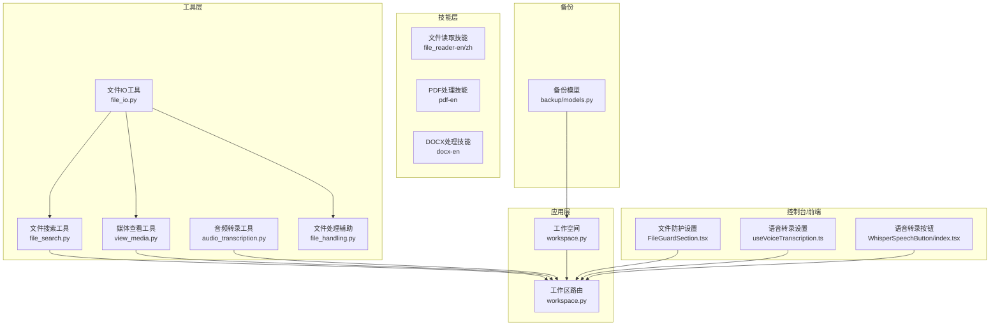
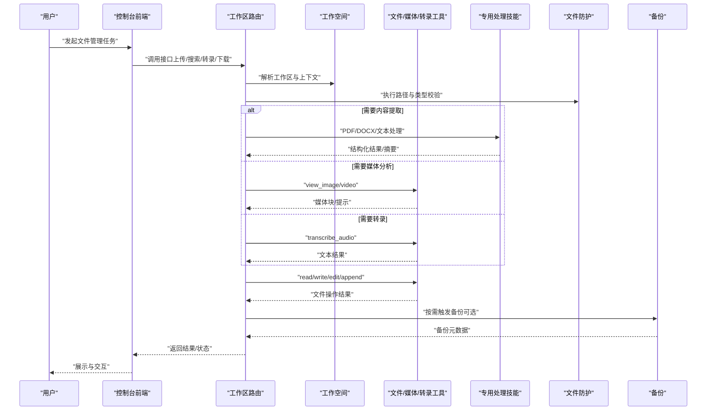
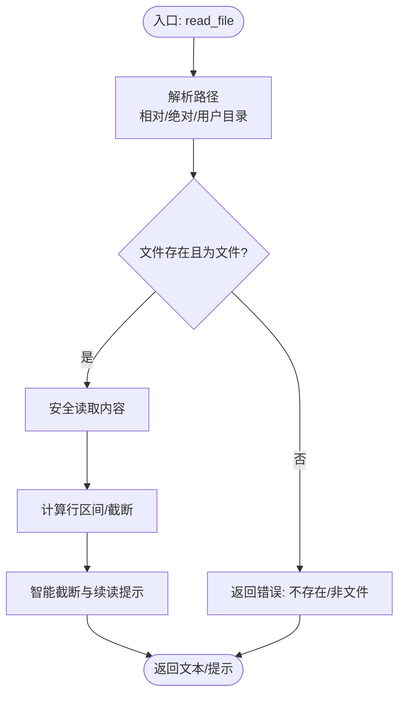
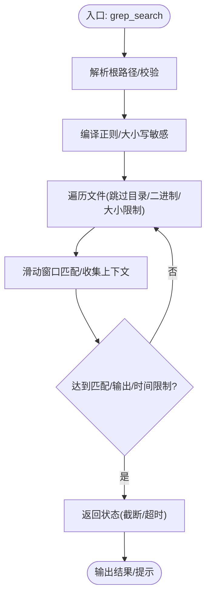
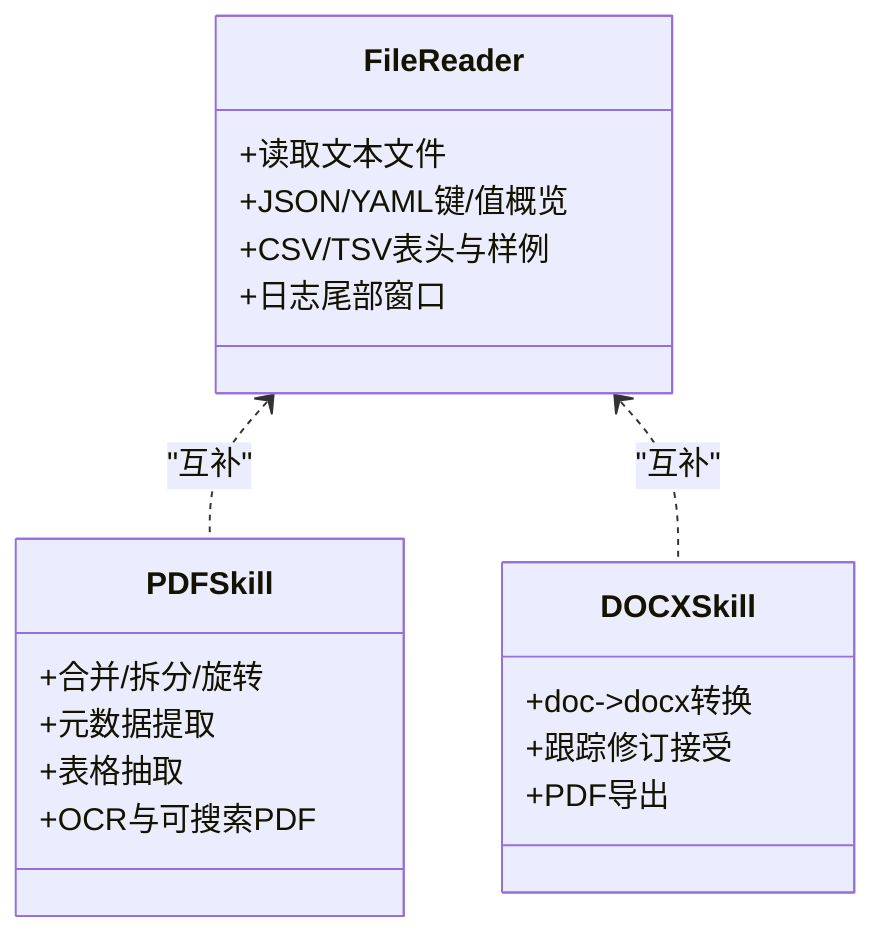
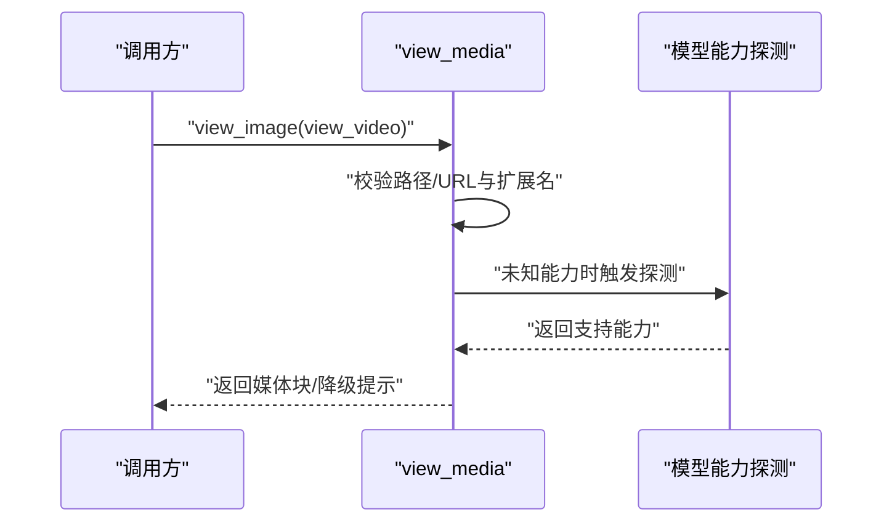
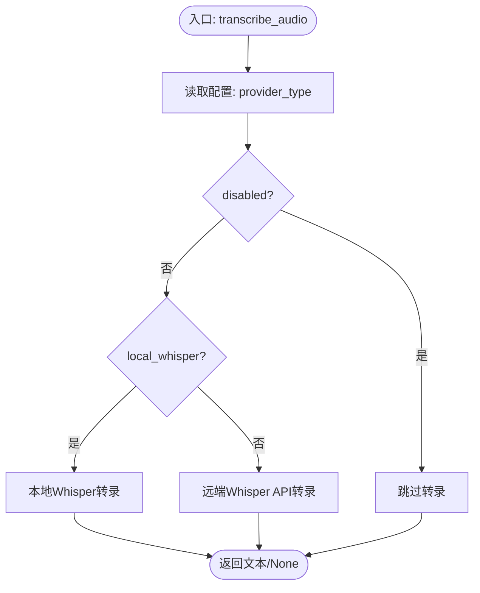
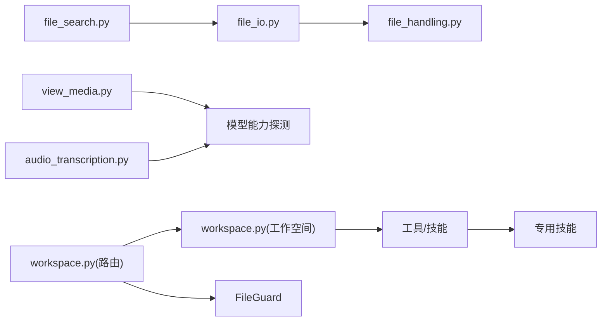

# 桌面文件管理

<cite>
**本文引用的文件**
- [src/qwenpaw/agents/tools/file_io.py](file://src/qwenpaw/agents/tools/file_io.py)
- [src/qwenpaw/agents/tools/file_search.py](file://src/qwenpaw/agents/tools/file_search.py)
- [src/qwenpaw/agents/utils/file_handling.py](file://src/qwenpaw/agents/utils/file_handling.py)
- [src/qwenpaw/agents/utils/audio_transcription.py](file://src/qwenpaw/agents/utils/audio_transcription.py)
- [src/qwenpaw/agents/tools/view_media.py](file://src/qwenpaw/agents/tools/view_media.py)
- [src/qwenpaw/agents/skills/file_reader-en/SKILL.md](file://src/qwenpaw/agents/skills/file_reader-en/SKILL.md)
- [src/qwenpaw/agents/skills/file_reader-zh/SKILL.md](file://src/qwenpaw/agents/skills/file_reader-zh/SKILL.md)
- [src/qwenpaw/agents/skills/pdf-en/SKILL.md](file://src/qwenpaw/agents/skills/pdf-en/SKILL.md)
- [src/qwenpaw/agents/skills/docx-en/SKILL.md](file://src/qwenpaw/agents/skills/docx-en/SKILL.md)
- [src/qwenpaw/app/routers/workspace.py](file://src/qwenpaw/app/routers/workspace.py)
- [src/qwenpaw/app/workspace/workspace.py](file://src/qwenpaw/app/workspace/workspace.py)
- [src/qwenpaw/backup/models.py](file://src/qwenpaw/backup/models.py)
- [console/src/pages/Settings/Security/components/FileGuardSection.tsx](file://console/src/pages/Settings/Security/components/FileGuardSection.tsx)
- [console/src/pages/Settings/VoiceTranscription/useVoiceTranscription.ts](file://console/src/pages/Settings/VoiceTranscription/useVoiceTranscription.ts)
- [console/src/pages/Chat/components/WhisperSpeechButton/index.tsx](file://console/src/pages/Chat/components/WhisperSpeechButton/index.tsx)
- [website/public/docs/security.en.md](file://website/public/docs/security.en.md)
- [tests/unit/agents/tools/test_file_search.py](file://tests/unit/agents/tools/test_file_search.py)
</cite>

## 目录
1. [简介](#简介)
2. [项目结构](#项目结构)
3. [核心组件](#核心组件)
4. [架构总览](#架构总览)
5. [详细组件分析](#详细组件分析)
6. [依赖关系分析](#依赖关系分析)
7. [性能考量](#性能考量)
8. [故障排查指南](#故障排查指南)
9. [结论](#结论)
10. [附录](#附录)

## 简介
本文件面向桌面文件管理场景，系统性阐述 QwenPaw 在本地文件管理中的能力与实践，覆盖文件组织与分类、智能搜索与索引、文档内容提取、媒体文件处理、文件传输与共享、文件安全保护、权限控制与备份策略等。文档同时给出可落地的工作流示例，帮助用户从“批量处理、智能归档、内容检索”到“安全与备份”的端到端实践。

## 项目结构
围绕桌面文件管理的关键模块与职责如下：
- 工具层：文件读写、搜索、媒体查看、下载与编码处理
- 技能层：针对不同文件类型的专用处理技能（如 PDF、DOCX、文本）
- 应用层：工作空间与路由接口，支撑文件上传、转录、媒体分析等
- 控制台与前端：安全策略配置、语音转录设置、文件管理界面
- 备份与恢复：数据模型与范围控制

**图表来源**
- [src/qwenpaw/agents/tools/file_io.py:1-396](file://src/qwenpaw/agents/tools/file_io.py#L1-L396)
- [src/qwenpaw/agents/tools/file_search.py:1-629](file://src/qwenpaw/agents/tools/file_search.py#L1-L629)
- [src/qwenpaw/agents/tools/view_media.py:1-439](file://src/qwenpaw/agents/tools/view_media.py#L1-L439)
- [src/qwenpaw/agents/utils/audio_transcription.py:1-318](file://src/qwenpaw/agents/utils/audio_transcription.py#L1-L318)
- [src/qwenpaw/agents/utils/file_handling.py:1-357](file://src/qwenpaw/agents/utils/file_handling.py#L1-L357)
- [src/qwenpaw/agents/skills/file_reader-en/SKILL.md:1-59](file://src/qwenpaw/agents/skills/file_reader-en/SKILL.md#L1-L59)
- [src/qwenpaw/agents/skills/pdf-en/SKILL.md:1-200](file://src/qwenpaw/agents/skills/pdf-en/SKILL.md#L1-L200)
- [src/qwenpaw/agents/skills/docx-en/SKILL.md:13-61](file://src/qwenpaw/agents/skills/docx-en/SKILL.md#L13-L61)
- [src/qwenpaw/app/workspace/workspace.py:1-467](file://src/qwenpaw/app/workspace/workspace.py#L1-L467)
- [src/qwenpaw/app/routers/workspace.py:491-529](file://src/qwenpaw/app/routers/workspace.py#L491-L529)
- [console/src/pages/Settings/Security/components/FileGuardSection.tsx:1-145](file://console/src/pages/Settings/Security/components/FileGuardSection.tsx#L1-L145)
- [console/src/pages/Settings/VoiceTranscription/useVoiceTranscription.ts:1-33](file://console/src/pages/Settings/VoiceTranscription/useVoiceTranscription.ts#L1-L33)
- [console/src/pages/Chat/components/WhisperSpeechButton/index.tsx:146-181](file://console/src/pages/Chat/components/WhisperSpeechButton/index.tsx#L146-L181)
- [src/qwenpaw/backup/models.py:1-133](file://src/qwenpaw/backup/models.py#L1-L133)

**章节来源**
- [src/qwenpaw/agents/tools/file_io.py:1-396](file://src/qwenpaw/agents/tools/file_io.py#L1-L396)
- [src/qwenpaw/agents/tools/file_search.py:1-629](file://src/qwenpaw/agents/tools/file_search.py#L1-L629)
- [src/qwenpaw/agents/utils/file_handling.py:1-357](file://src/qwenpaw/agents/utils/file_handling.py#L1-L357)
- [src/qwenpaw/agents/utils/audio_transcription.py:1-318](file://src/qwenpaw/agents/utils/audio_transcription.py#L1-L318)
- [src/qwenpaw/agents/tools/view_media.py:1-439](file://src/qwenpaw/agents/tools/view_media.py#L1-L439)
- [src/qwenpaw/agents/skills/file_reader-en/SKILL.md:1-59](file://src/qwenpaw/agents/skills/file_reader-en/SKILL.md#L1-L59)
- [src/qwenpaw/agents/skills/file_reader-zh/SKILL.md:1-59](file://src/qwenpaw/agents/skills/file_reader-zh/SKILL.md#L1-L59)
- [src/qwenpaw/agents/skills/pdf-en/SKILL.md:1-200](file://src/qwenpaw/agents/skills/pdf-en/SKILL.md#L1-L200)
- [src/qwenpaw/agents/skills/docx-en/SKILL.md:13-61](file://src/qwenpaw/agents/skills/docx-en/SKILL.md#L13-L61)
- [src/qwenpaw/app/workspace/workspace.py:1-467](file://src/qwenpaw/app/workspace/workspace.py#L1-L467)
- [src/qwenpaw/app/routers/workspace.py:491-529](file://src/qwenpaw/app/routers/workspace.py#L491-L529)
- [console/src/pages/Settings/Security/components/FileGuardSection.tsx:1-145](file://console/src/pages/Settings/Security/components/FileGuardSection.tsx#L1-L145)
- [console/src/pages/Settings/VoiceTranscription/useVoiceTranscription.ts:1-33](file://console/src/pages/Settings/VoiceTranscription/useVoiceTranscription.ts#L1-L33)
- [console/src/pages/Chat/components/WhisperSpeechButton/index.tsx:146-181](file://console/src/pages/Chat/components/WhisperSpeechButton/index.tsx#L146-L181)
- [src/qwenpaw/backup/models.py:1-133](file://src/qwenpaw/backup/models.py#L1-L133)

## 核心组件
- 文件读写与编辑
  - 支持相对路径解析、编码适配、行区间读取、追加写入、全文替换等
  - 提供安全读取与截断提示，避免大文件一次性输出
- 文件搜索与发现
  - 基于正则的递归内容搜索（grep）、基于通配符的文件发现（glob），支持上下文行输出、超时与限额控制
- 文档内容提取与摘要
  - 文本类文件优先使用专用读取技能；PDF/Office/图像/音视频由对应技能处理
- 媒体文件处理
  - 图像/视频加载与验证，支持 URL 与本地路径；多模态能力探测与降级提示
- 音频转录
  - 支持本地 Whisper 与远端 Whisper API，按配置启用/禁用
- 下载与传输
  - 支持 base64 与 URL 下载，自动推断扩展名，空文件检测与错误上报
- 安全与权限
  - 文件防护白名单/黑名单路径、相对路径解析规则、目录递归保护
- 备份与恢复
  - 可配置备份范围（工作区、全局配置、密钥、技能池等），支持全量/自定义恢复模式

**章节来源**
- [src/qwenpaw/agents/tools/file_io.py:66-206](file://src/qwenpaw/agents/tools/file_io.py#L66-L206)
- [src/qwenpaw/agents/tools/file_search.py:478-629](file://src/qwenpaw/agents/tools/file_search.py#L478-L629)
- [src/qwenpaw/agents/skills/file_reader-en/SKILL.md:1-59](file://src/qwenpaw/agents/skills/file_reader-en/SKILL.md#L1-L59)
- [src/qwenpaw/agents/skills/pdf-en/SKILL.md:1-200](file://src/qwenpaw/agents/skills/pdf-en/SKILL.md#L1-L200)
- [src/qwenpaw/agents/skills/docx-en/SKILL.md:13-61](file://src/qwenpaw/agents/skills/docx-en/SKILL.md#L13-L61)
- [src/qwenpaw/agents/tools/view_media.py:297-439](file://src/qwenpaw/agents/tools/view_media.py#L297-L439)
- [src/qwenpaw/agents/utils/audio_transcription.py:295-318](file://src/qwenpaw/agents/utils/audio_transcription.py#L295-L318)
- [src/qwenpaw/agents/utils/file_handling.py:246-357](file://src/qwenpaw/agents/utils/file_handling.py#L246-L357)
- [console/src/pages/Settings/Security/components/FileGuardSection.tsx:31-145](file://console/src/pages/Settings/Security/components/FileGuardSection.tsx#L31-L145)
- [src/qwenpaw/backup/models.py:13-109](file://src/qwenpaw/backup/models.py#L13-L109)

## 架构总览
下图展示桌面文件管理的端到端流程：用户通过控制台发起任务，后端根据配置选择工具/技能，完成文件读取、搜索、内容提取、媒体分析、转录与下载，并在必要时触发安全校验与备份。

**图表来源**
- [src/qwenpaw/app/routers/workspace.py:491-529](file://src/qwenpaw/app/routers/workspace.py#L491-L529)
- [src/qwenpaw/app/workspace/workspace.py:351-467](file://src/qwenpaw/app/workspace/workspace.py#L351-L467)
- [src/qwenpaw/agents/tools/file_io.py:66-206](file://src/qwenpaw/agents/tools/file_io.py#L66-L206)
- [src/qwenpaw/agents/tools/view_media.py:297-439](file://src/qwenpaw/agents/tools/view_media.py#L297-L439)
- [src/qwenpaw/agents/utils/audio_transcription.py:295-318](file://src/qwenpaw/agents/utils/audio_transcription.py#L295-L318)
- [src/qwenpaw/agents/skills/pdf-en/SKILL.md:1-200](file://src/qwenpaw/agents/skills/pdf-en/SKILL.md#L1-L200)
- [src/qwenpaw/agents/skills/docx-en/SKILL.md:13-61](file://src/qwenpaw/agents/skills/docx-en/SKILL.md#L13-L61)
- [src/qwenpaw/backup/models.py:58-109](file://src/qwenpaw/backup/models.py#L58-L109)

## 详细组件分析

### 文件读写与编辑（file_io）
- 路径解析：相对路径解析至当前工作区或默认工作目录，支持用户目录展开
- 编码策略：针对 CSV/TSV/TXT 强制 UTF-8-BOM 以兼容 Windows Excel；其他文件采用 UTF-8
- 安全读取：支持行区间读取与智能截断，避免大文件一次性输出
- 写入/追加：统一编码策略，失败时返回明确错误
- 替换：全文本替换并回写，失败时透传写入错误

**图表来源**
- [src/qwenpaw/agents/tools/file_io.py:23-206](file://src/qwenpaw/agents/tools/file_io.py#L23-L206)

**章节来源**
- [src/qwenpaw/agents/tools/file_io.py:23-206](file://src/qwenpaw/agents/tools/file_io.py#L23-L206)

### 文件搜索与发现（file_search）
- grep 搜索：递归遍历、跳过常见二进制与缓存目录、文件大小阈值、匹配条数与输出字符上限、上下文行、超时控制
- glob 发现：支持通配符与目录扫描，带取消信号与结果上限
- 输出格式：统一为“路径:行号:内容”，便于后续处理

**图表来源**
- [src/qwenpaw/agents/tools/file_search.py:274-435](file://src/qwenpaw/agents/tools/file_search.py#L274-L435)

**章节来源**
- [src/qwenpaw/agents/tools/file_search.py:478-629](file://src/qwenpaw/agents/tools/file_search.py#L478-L629)
- [tests/unit/agents/tools/test_file_search.py:519-549](file://tests/unit/agents/tools/test_file_search.py#L519-L549)

### 文档内容提取与摘要（file_reader、pdf、docx）
- 文本类文件：使用专用读取技能，支持 JSON/YAML 键/值概览、CSV/TSV 表头与首若干行、日志尾部窗口
- PDF：基于 pypdf/pdfplumber/reportlab 等库，支持合并/拆分/旋转/元数据提取/表格抽取/OCR 等
- DOCX：依赖 LibreOffice/pandoc 等工具链，支持转换、跟踪修订、导出 PDF/图像

**图表来源**
- [src/qwenpaw/agents/skills/file_reader-en/SKILL.md:1-59](file://src/qwenpaw/agents/skills/file_reader-en/SKILL.md#L1-L59)
- [src/qwenpaw/agents/skills/pdf-en/SKILL.md:1-200](file://src/qwenpaw/agents/skills/pdf-en/SKILL.md#L1-L200)
- [src/qwenpaw/agents/skills/docx-en/SKILL.md:13-61](file://src/qwenpaw/agents/skills/docx-en/SKILL.md#L13-L61)

**章节来源**
- [src/qwenpaw/agents/skills/file_reader-en/SKILL.md:1-59](file://src/qwenpaw/agents/skills/file_reader-en/SKILL.md#L1-L59)
- [src/qwenpaw/agents/skills/file_reader-zh/SKILL.md:1-59](file://src/qwenpaw/agents/skills/file_reader-zh/SKILL.md#L1-L59)
- [src/qwenpaw/agents/skills/pdf-en/SKILL.md:1-200](file://src/qwenpaw/agents/skills/pdf-en/SKILL.md#L1-L200)
- [src/qwenpaw/agents/skills/docx-en/SKILL.md:13-61](file://src/qwenpaw/agents/skills/docx-en/SKILL.md#L13-L61)

### 媒体文件处理（view_media）
- 图像/视频加载：支持本地路径与 HTTP(S) URL；对不支持多模态的模型提供降级提示
- 类型校验：基于扩展名与 MIME 判断；URL 动态端点可绕过严格校验
- 探测与缓存：按需探测模型多模态能力，后台异步持久化视频支持

**图表来源**
- [src/qwenpaw/agents/tools/view_media.py:297-439](file://src/qwenpaw/agents/tools/view_media.py#L297-L439)

**章节来源**
- [src/qwenpaw/agents/tools/view_media.py:297-439](file://src/qwenpaw/agents/tools/view_media.py#L297-L439)

### 音频转录（audio_transcription）
- 后端选择：本地 Whisper 或远端 Whisper API，按配置启用
- 依赖检查：ffmpeg 与 openai-whisper 是否可用
- 返回文本：失败时返回 None 并记录日志

**图表来源**
- [src/qwenpaw/agents/utils/audio_transcription.py:295-318](file://src/qwenpaw/agents/utils/audio_transcription.py#L295-L318)

**章节来源**
- [src/qwenpaw/agents/utils/audio_transcription.py:1-318](file://src/qwenpaw/agents/utils/audio_transcription.py#L1-L318)
- [src/qwenpaw/app/routers/workspace.py:491-529](file://src/qwenpaw/app/routers/workspace.py#L491-L529)
- [console/src/pages/Settings/VoiceTranscription/useVoiceTranscription.ts:1-33](file://console/src/pages/Settings/VoiceTranscription/useVoiceTranscription.ts#L1-L33)
- [console/src/pages/Chat/components/WhisperSpeechButton/index.tsx:146-181](file://console/src/pages/Chat/components/WhisperSpeechButton/index.tsx#L146-L181)

### 下载与传输（file_handling）
- base64 下载：解码后保存至工作区 downloads 目录，自动命名
- URL 下载：优先本地路径解析，否则尝试 wget/curl/urllib，失败抛错
- 扩展名修复：当平台返回 .file 时，通过 HEAD 或魔数推断真实扩展名

**章节来源**
- [src/qwenpaw/agents/utils/file_handling.py:246-357](file://src/qwenpaw/agents/utils/file_handling.py#L246-L357)

### 安全与权限（FileGuard）
- 配置项：启用开关、受保护路径列表（支持绝对/相对/用户家目录、目录递归保护）
- 规则：相对路径解析至工作区；~ 展开；标准化为绝对路径匹配；目录路径递归保护
- 控制台：在 Settings → Security → File Guard 中增删改查

**章节来源**
- [console/src/pages/Settings/Security/components/FileGuardSection.tsx:31-145](file://console/src/pages/Settings/Security/components/FileGuardSection.tsx#L31-L145)
- [website/public/docs/security.en.md:305-319](file://website/public/docs/security.en.md#L305-L319)

### 备份与恢复（backup）
- 范围控制：是否包含工作区、全局配置、密钥、技能池
- 元数据：备份 ID、名称、描述、时间戳、版本、系统信息
- 恢复模式：全量替换或自定义选择性恢复，支持指定代理 ID 列表

**章节来源**
- [src/qwenpaw/backup/models.py:13-109](file://src/qwenpaw/backup/models.py#L13-L109)

## 依赖关系分析
- 工具与技能解耦：文件 IO 与搜索独立于具体文件类型，通过技能实现领域能力
- 多模态能力探测：媒体工具在未知模型能力时按需探测，避免阻塞
- 路由与工作空间：路由层负责输入校验与类型限制，工作空间承载运行时组件
- 安全前置：所有工具调用前经文件防护策略校验

**图表来源**
- [src/qwenpaw/agents/tools/file_search.py:1-629](file://src/qwenpaw/agents/tools/file_search.py#L1-L629)
- [src/qwenpaw/agents/tools/file_io.py:1-396](file://src/qwenpaw/agents/tools/file_io.py#L1-L396)
- [src/qwenpaw/agents/utils/file_handling.py:1-357](file://src/qwenpaw/agents/utils/file_handling.py#L1-L357)
- [src/qwenpaw/agents/tools/view_media.py:1-439](file://src/qwenpaw/agents/tools/view_media.py#L1-L439)
- [src/qwenpaw/agents/utils/audio_transcription.py:1-318](file://src/qwenpaw/agents/utils/audio_transcription.py#L1-L318)
- [src/qwenpaw/app/routers/workspace.py:491-529](file://src/qwenpaw/app/routers/workspace.py#L491-L529)
- [src/qwenpaw/app/workspace/workspace.py:1-467](file://src/qwenpaw/app/workspace/workspace.py#L1-L467)

**章节来源**
- [src/qwenpaw/agents/tools/file_search.py:1-629](file://src/qwenpaw/agents/tools/file_search.py#L1-L629)
- [src/qwenpaw/agents/tools/file_io.py:1-396](file://src/qwenpaw/agents/tools/file_io.py#L1-L396)
- [src/qwenpaw/agents/utils/file_handling.py:1-357](file://src/qwenpaw/agents/utils/file_handling.py#L1-L357)
- [src/qwenpaw/agents/tools/view_media.py:1-439](file://src/qwenpaw/agents/tools/view_media.py#L1-L439)
- [src/qwenpaw/agents/utils/audio_transcription.py:1-318](file://src/qwenpaw/agents/utils/audio_transcription.py#L1-L318)
- [src/qwenpaw/app/routers/workspace.py:491-529](file://src/qwenpaw/app/routers/workspace.py#L491-L529)
- [src/qwenpaw/app/workspace/workspace.py:1-467](file://src/qwenpaw/app/workspace/workspace.py#L1-L467)

## 性能考量
- 搜索性能
  - 通过二进制扩展集与文件大小阈值过滤，减少无效 IO
  - 上下文行滑动窗口与批量输出，降低内存峰值
  - 超时与匹配/输出字符上限，避免长时间阻塞
- 大文件处理
  - 文件读取支持行区间与截断提示，避免一次性输出
  - 媒体与转录按需探测能力，避免重复探测
- I/O 与网络
  - 下载优先本地路径，远程下载采用多后端回退
  - 转录后端依赖外部工具，需确保环境可用

[本节为通用指导，无需特定文件分析]

## 故障排查指南
- 文件读取失败
  - 检查路径是否存在、是否为文件；确认编码策略与截断提示
- 搜索无结果或被截断
  - 缩小搜索范围/模式；检查二进制过滤与大小限制；关注超时与匹配上限提示
- 媒体无法感知
  - 检查模型多模态能力配置；若未知，等待探测完成或手动设置
- 转录失败
  - 确认转录提供者类型与凭据；检查本地 Whisper 依赖（ffmpeg/openai-whisper）
- 下载异常
  - 检查 URL/本地路径有效性；确认下载目录权限；留意空文件与扩展名修复
- 安全拦截
  - 核对受保护路径与相对路径解析规则；确认目录递归保护生效

**章节来源**
- [src/qwenpaw/agents/tools/file_io.py:112-206](file://src/qwenpaw/agents/tools/file_io.py#L112-L206)
- [src/qwenpaw/agents/tools/file_search.py:536-576](file://src/qwenpaw/agents/tools/file_search.py#L536-L576)
- [src/qwenpaw/agents/tools/view_media.py:119-215](file://src/qwenpaw/agents/tools/view_media.py#L119-L215)
- [src/qwenpaw/agents/utils/audio_transcription.py:122-148](file://src/qwenpaw/agents/utils/audio_transcription.py#L122-L148)
- [src/qwenpaw/agents/utils/file_handling.py:287-357](file://src/qwenpaw/agents/utils/file_handling.py#L287-L357)
- [console/src/pages/Settings/Security/components/FileGuardSection.tsx:31-145](file://console/src/pages/Settings/Security/components/FileGuardSection.tsx#L31-L145)

## 结论
QwenPaw 在桌面文件管理场景提供了从基础文件操作到高级内容提取与媒体分析的完整能力。通过工具层的稳健实现、技能层的领域专长、路由与工作空间的运行时支撑、以及安全与备份策略的完善，用户可以构建从“批量处理、智能归档、内容检索”到“安全与备份”的闭环工作流。

[本节为总结，无需特定文件分析]

## 附录

### 工作流示例（不含代码，仅流程）
- 批量处理
  - 步骤：定位根目录 → 使用 glob 发现目标文件 → 逐个调用 read_file/技能 → 输出汇总报告
  - 关键点：合理设置上下文行与超时，避免阻塞
- 智能归档
  - 步骤：识别文件类型（正则/glob）→ 分类到对应目录 → 记录元数据 → 可选触发备份
  - 关键点：利用二进制过滤与大小限制，避免误伤
- 内容检索
  - 步骤：输入关键词/正则 → 递归搜索 → 展示上下文行 → 导出结果
  - 关键点：结合文件类型与编码策略，提升命中率
- 媒体分析
  - 步骤：加载图像/视频 → 模型能力探测 → 返回媒体块/降级提示
  - 关键点：URL 与本地路径兼容；注意 MIME 校验
- 语音转录
  - 步骤：上传音频 → 校验类型与大小 → 选择本地/远端后端 → 获取文本
  - 关键点：提前检查依赖与配置
- 文件安全保护
  - 步骤：在控制台配置受保护路径 → 调用工具前经 FileGuard 校验
  - 关键点：相对路径解析与目录递归保护
- 备份策略
  - 步骤：选择范围（工作区/配置/密钥/技能池）→ 创建备份 → 恢复时选择模式
  - 关键点：区分全量与自定义恢复，谨慎选择代理 ID 列表

[本节为概念性工作流，无需特定文件分析]