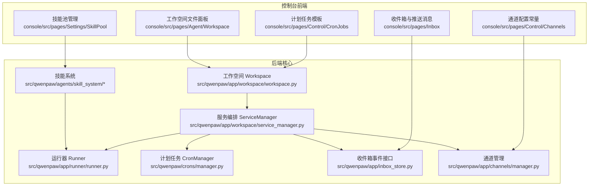
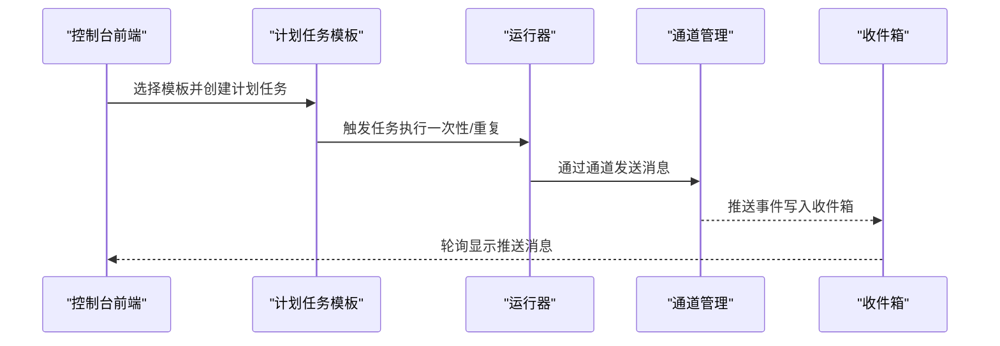
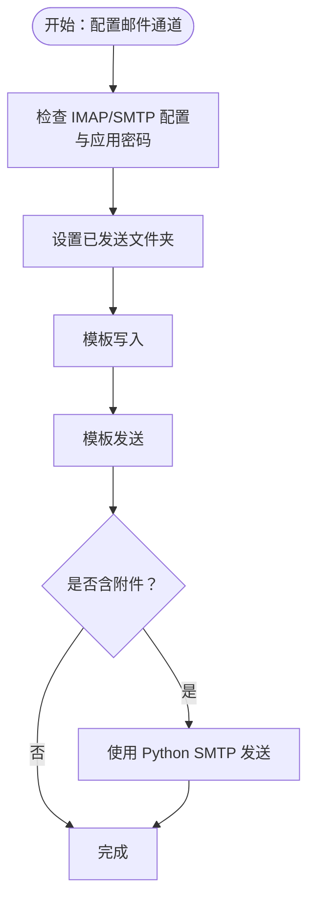
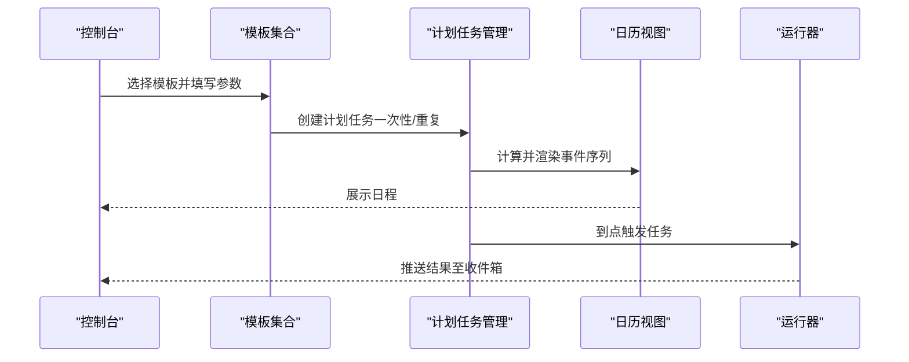
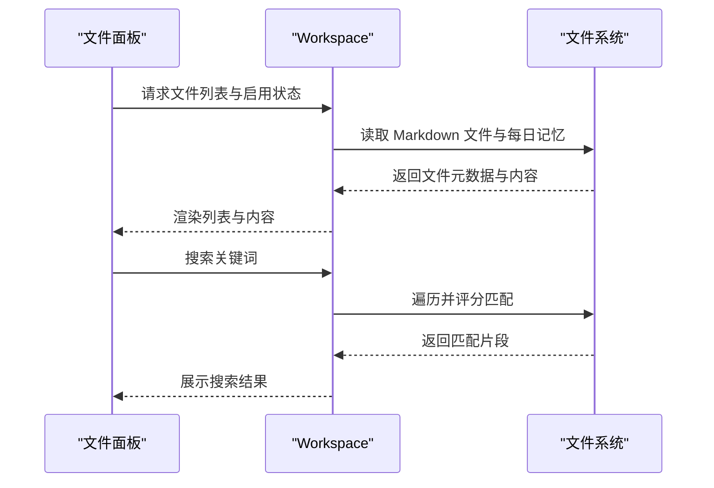
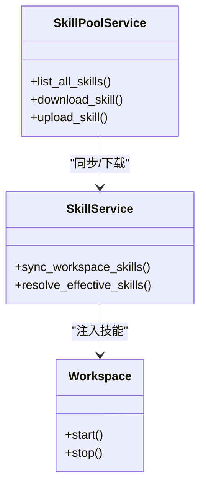
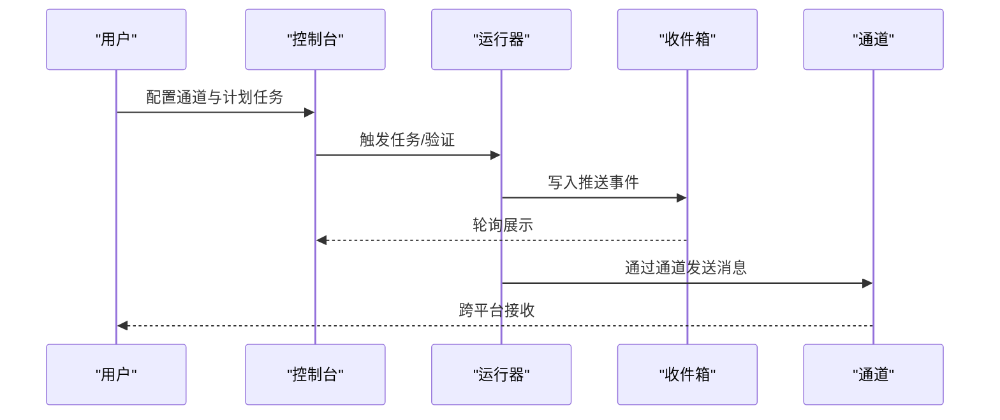
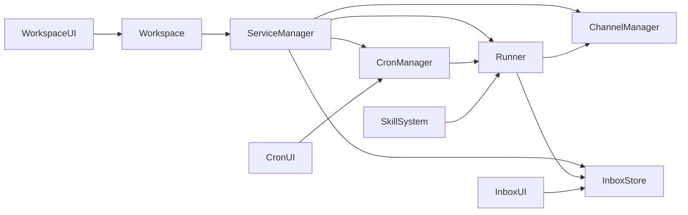

# 生产力提升

<cite>
**本文引用的文件**
- [README.md](file://README.md)
- [workspace.py](file://src/qwenpaw/app/workspace/workspace.py)
- [service_manager.py](file://src/qwenpaw/app/workspace/service_manager.py)
- [templates.ts](file://console/src/pages/Control/CronJobs/components/templates.ts)
- [index.tsx](file://console/src/pages/Control/CronJobs/index.tsx)
- [useInboxData.ts](file://console/src/pages/Inbox/hooks/useInboxData.ts)
- [index.tsx](file://console/src/pages/Inbox/index.tsx)
- [constants.ts](file://console/src/pages/Control/Channels/components/constants.ts)
- [channels_cmd.py](file://src/qwenpaw/cli/channels_cmd.py)
- [SKILL.md（himalaya 英文）](file://src/qwenpaw/agents/skills/himalaya-en/SKILL.md)
- [configuration.md（himalaya 英文）](file://src/qwenpaw/agents/skills/himalaya-en/references/configuration.md)
- [SKILL.md（file_reader 英文）](file://src/qwenpaw/agents/skills/file_reader-en/SKILL.md)
- [adbpg_memory_manager.py](file://src/qwenpaw/agents/memory/adbpg_memory_manager.py)
- [index.tsx（Workspace 文件面板）](file://console/src/pages/Agent/Workspace/index.tsx)
- [FileListPanel.tsx](file://console/src/pages/Agent/Workspace/components/FileListPanel.tsx)
- [FileItem.tsx](file://console/src/pages/Agent/Workspace/components/FileItem.tsx)
- [useAgentsData.ts](file://console/src/pages/Agent/Workspace/components/useAgentsData.ts)
- [__init__.py（技能系统）](file://src/qwenpaw/agents/skill_system/__init__.py)
- [pool_service.py](file://src/qwenpaw/agents/skill_system/pool_service.py)
- [useSkillPool.tsx](file://console/src/pages/Settings/SkillPool/useSkillPool.tsx)
- [commands.en.md](file://website/public/docs/commands.en.md)
- [handler.py（mission）](file://src/qwenpaw/agents/mission/handler.py)
- [mission_dispatch.py](file://src/qwenpaw/app/runner/mission_dispatch.py)
- [runner.py](file://src/qwenpaw/app/runner/runner.py)
</cite>

## 目录
1. [简介](#简介)
2. [项目结构](#项目结构)
3. [核心组件](#核心组件)
4. [架构总览](#架构总览)
5. [详细组件分析](#详细组件分析)
6. [依赖关系分析](#依赖关系分析)
7. [性能考虑](#性能考虑)
8. [故障排查指南](#故障排查指南)
9. [结论](#结论)
10. [附录](#附录)

## 简介
本文件面向“生产力提升”场景，围绕 QwenPaw 的邮件与新闻简报推送、日历与联系人管理、文件组织与搜索、任务自动化等能力，提供从系统架构到配置实践的完整指南。重点覆盖以下主题：
- 邮件通道与自动摘要推送：通过邮件通道与模板化任务，实现每日/每周新闻摘要与提醒的自动化分发。
- 日历与提醒：利用内置模板与日历视图，构建个人与团队的定时提醒、重复任务与一次性提醒。
- 文件系统智能化：本地 Markdown 记忆文件与每日记忆的组织、检索与可视化，结合文件列表面板实现高效管理。
- 技能协同：邮件处理、日历管理、文件读取等技能的组合使用，形成可复用的工作流。
- 工作流自动化与跨平台同步：通过任务调度、消息收件箱、通道配置与技能池，实现跨平台数据同步与智能提醒。

## 项目结构
QwenPaw 采用“工作空间（Workspace）+ 服务编排（ServiceManager）+ 技能系统（Skill System）+ 控制台前端（Console）”的分层设计。控制台提供可视化配置入口，后端通过工作空间统一管理运行时组件（运行器、通道、内存、MCP、计划任务等），并通过技能系统扩展能力。

图表来源
- [workspace.py:137-316](file://src/qwenpaw/app/workspace/workspace.py#L137-L316)
- [service_manager.py:76-161](file://src/qwenpaw/app/workspace/service_manager.py#L76-L161)
- [runner.py:443-468](file://src/qwenpaw/app/runner/runner.py#L443-L468)
- [templates.ts:181-323](file://console/src/pages/Control/CronJobs/components/templates.ts#L181-L323)
- [useInboxData.ts:126-179](file://console/src/pages/Inbox/hooks/useInboxData.ts#L126-L179)
- [constants.ts:7-24](file://console/src/pages/Control/Channels/components/constants.ts#L7-L24)
- [__init__.py（技能系统）:1-41](file://src/qwenpaw/agents/skill_system/__init__.py#L1-L41)

章节来源
- [workspace.py:38-125](file://src/qwenpaw/app/workspace/workspace.py#L38-L125)
- [service_manager.py:76-161](file://src/qwenpaw/app/workspace/service_manager.py#L76-L161)
- [README.md:45-57](file://README.md#L45-L57)

## 核心组件
- 工作空间（Workspace）：封装独立代理实例的完整运行环境，统一注册与启动运行器、通道、内存、MCP、计划任务等服务。
- 服务编排（ServiceManager）：按优先级与依赖关系启动/停止服务，支持组件热重载与复用。
- 计划任务（Cron）：内置模板与日历视图，支持一次性、重复次数、截止时间等多种调度策略。
- 收件箱（Inbox）：聚合来自计划任务与心跳事件的推送消息，支持标记已读、批量操作与轮询刷新。
- 通道（Channels）：多平台通道配置入口，支持 iMessage、DingTalk、Feishu、WeChat 等。
- 技能系统（Skill System）：技能池与工作空间技能管理，支持内置技能导入、冲突检测与版本管理。
- 文件面板（Workspace Files）：本地 Markdown 记忆文件与每日记忆的浏览、排序与启用/禁用。

章节来源
- [workspace.py:38-125](file://src/qwenpaw/app/workspace/workspace.py#L38-L125)
- [service_manager.py:76-161](file://src/qwenpaw/app/workspace/service_manager.py#L76-L161)
- [templates.ts:181-323](file://console/src/pages/Control/CronJobs/components/templates.ts#L181-L323)
- [useInboxData.ts:126-179](file://console/src/pages/Inbox/hooks/useInboxData.ts#L126-L179)
- [constants.ts:7-24](file://console/src/pages/Control/Channels/components/constants.ts#L7-L24)
- [__init__.py（技能系统）:1-41](file://src/qwenpaw/agents/skill_system/__init__.py#L1-L41)

## 架构总览
下图展示从控制台到后端服务的调用链路与数据流，体现“计划任务模板 → 运行器 → 通道/收件箱”的自动化推送路径，以及“文件面板 → Workspace → 技能系统”的内容检索与处理路径。

图表来源
- [templates.ts:181-323](file://console/src/pages/Control/CronJobs/components/templates.ts#L181-L323)
- [runner.py:443-468](file://src/qwenpaw/app/runner/runner.py#L443-L468)
- [useInboxData.ts:126-179](file://console/src/pages/Inbox/hooks/useInboxData.ts#L126-L179)

## 详细组件分析

### 组件A：邮件通道与自动摘要推送
目标：通过邮件通道实现每日/每周新闻摘要与提醒的自动化推送，支持附件与模板化发送。

- 配置要点
  - 使用邮件通道的配置参考，确保 IMAP/SMTP 后端、登录方式与文件夹别名正确。
  - 对于 Gmail、iCloud 等平台，需使用应用专用密码或系统钥匙串命令。
  - 发送失败常见问题：避免直接发送原始邮件，优先使用模板发送；大附件场景使用 Python SMTP 方案而非 MML。

- 自动化最佳实践
  - 使用“模板写入并发送”的管道，结合环境变量隐藏敏感信息。
  - 将“保存已发送”文件夹配置为已存在文件夹，避免“文件夹不存在”错误。
  - 避免在非交互环境中使用需要 TUI 选择的命令，防止阻塞。

- 可选：iMessage 等通道的交互式配置流程，便于桌面端快速启用。

图表来源
- [SKILL.md（himalaya 英文）:152-194](file://src/qwenpaw/agents/skills/himalaya-en/SKILL.md#L152-L194)
- [configuration.md（himalaya 英文）:55-118](file://src/qwenpaw/agents/skills/himalaya-en/references/configuration.md#L55-L118)
- [channels_cmd.py:195-208](file://src/qwenpaw/cli/channels_cmd.py#L195-L208)

章节来源
- [SKILL.md（himalaya 英文）:152-194](file://src/qwenpaw/agents/skills/himalaya-en/SKILL.md#L152-L194)
- [configuration.md（himalaya 英文）:55-118](file://src/qwenpaw/agents/skills/himalaya-en/references/configuration.md#L55-L118)
- [channels_cmd.py:195-208](file://src/qwenpaw/cli/channels_cmd.py#L195-L208)

### 组件B：日历与提醒（计划任务模板）
目标：通过内置模板与日历视图，构建个人与团队的定时提醒、重复任务与一次性提醒。

- 内置模板类别
  - 一次性任务：生日提醒、出差准备、一次性会议提醒等。
  - 重复任务：每日番茄钟提醒、每周总结、计数型服药提醒、截止型周会等。
  - 团队/个人标签：用于筛选与聚合。

- 日历视图与事件生成
  - 基于模板的运行时间、重复间隔与结束条件，生成日历事件序列。
  - 支持用户时区转换与事件排序，便于在日历中查看。

图表来源
- [templates.ts:103-323](file://console/src/pages/Control/CronJobs/components/templates.ts#L103-L323)
- [index.tsx:473-524](file://console/src/pages/Control/CronJobs/index.tsx#L473-L524)

章节来源
- [templates.ts:181-323](file://console/src/pages/Control/CronJobs/components/templates.ts#L181-L323)
- [index.tsx:473-524](file://console/src/pages/Control/CronJobs/index.tsx#L473-L524)

### 组件C：文件组织与搜索（Workspace 文件面板）
目标：对本地 Markdown 记忆文件与每日记忆进行组织、排序与检索，提升知识管理效率。

- 功能特性
  - 文件列表：支持拖拽排序、启用/禁用、刷新与打开。
  - 日常记忆：展开 MEMORY.md 后展示每日记忆子文件，支持快速跳转。
  - 搜索能力：基于关键词命中率的本地文件检索，返回相关片段。

- 数据流
  - 前端请求文件列表与内容，后端 Workspace 服务加载并返回。
  - 搜索逻辑遍历 MEMORY.md 与 memory 目录下的 Markdown 文件，计算命中分数并排序。

图表来源
- [index.tsx（Workspace 文件面板）:110-156](file://console/src/pages/Agent/Workspace/index.tsx#L110-L156)
- [FileListPanel.tsx:1-56](file://console/src/pages/Agent/Workspace/components/FileListPanel.tsx#L1-L56)
- [FileItem.tsx:120-144](file://console/src/pages/Agent/Workspace/components/FileItem.tsx#L120-L144)
- [useAgentsData.ts:115-203](file://console/src/pages/Agent/Workspace/components/useAgentsData.ts#L115-L203)
- [adbpg_memory_manager.py:466-508](file://src/qwenpaw/agents/memory/adbpg_memory_manager.py#L466-L508)

章节来源
- [index.tsx（Workspace 文件面板）:110-156](file://console/src/pages/Agent/Workspace/index.tsx#L110-L156)
- [FileListPanel.tsx:1-56](file://console/src/pages/Agent/Workspace/components/FileListPanel.tsx#L1-L56)
- [FileItem.tsx:120-144](file://console/src/pages/Agent/Workspace/components/FileItem.tsx#L120-L144)
- [useAgentsData.ts:115-203](file://console/src/pages/Agent/Workspace/components/useAgentsData.ts#L115-L203)
- [adbpg_memory_manager.py:466-508](file://src/qwenpaw/agents/memory/adbpg_memory_manager.py#L466-L508)

### 组件D：技能系统与工作流协同
目标：通过技能池与工作空间技能管理，实现邮件处理、日历提醒、文件读取等技能的协同组合，形成可复用的工作流。

- 技能池与工作空间
  - 技能池集中存放共享技能，支持内置技能导入、冲突检测与版本管理。
  - 工作空间技能与技能池关联，支持下载/上传与同步状态跟踪。

- 技能协同示例
  - 邮件处理技能：读取/解析邮件，提取正文与附件元信息。
  - 文件读取技能：对本地文本文件进行类型探测与摘要输出。
  - 日历提醒技能：结合计划任务模板，生成提醒内容并推送。

图表来源
- [pool_service.py:54-81](file://src/qwenpaw/agents/skill_system/pool_service.py#L54-L81)
- [__init__.py（技能系统）:1-41](file://src/qwenpaw/agents/skill_system/__init__.py#L1-L41)
- [workspace.py:351-392](file://src/qwenpaw/app/workspace/workspace.py#L351-L392)

章节来源
- [pool_service.py:54-81](file://src/qwenpaw/agents/skill_system/pool_service.py#L54-L81)
- [__init__.py（技能系统）:1-41](file://src/qwenpaw/agents/skill_system/__init__.py#L1-L41)
- [workspace.py:351-392](file://src/qwenpaw/app/workspace/workspace.py#L351-L392)

### 组件E：工作流自动化与跨平台数据同步
目标：通过任务调度、消息收件箱与通道配置，实现跨平台数据同步与智能提醒。

- 任务调度与执行
  - 通过“/mission”命令进入任务模式，两阶段执行：PRD 生成与自主执行。
  - 支持最大迭代次数与自定义验证命令，失败自动重试直至完成。

- 收件箱与轮询
  - 收件箱聚合来自计划任务与心跳事件的推送消息，支持标记已读、批量删除与页面分页。
  - 页面可见性变化时自动轮询刷新，保证消息实时性。

- 通道配置
  - 控制台提供通道名称映射与国际化标签，便于在不同语言环境下识别通道。
  - 交互式配置流程支持 iMessage 等通道的快速启用。

图表来源
- [commands.en.md:714-832](file://website/public/docs/commands.en.md#L714-L832)
- [handler.py（mission）:172-228](file://src/qwenpaw/agents/mission/handler.py#L172-L228)
- [mission_dispatch.py:44-84](file://src/qwenpaw/app/runner/mission_dispatch.py#L44-L84)
- [runner.py:443-468](file://src/qwenpaw/app/runner/runner.py#L443-L468)
- [useInboxData.ts:126-179](file://console/src/pages/Inbox/hooks/useInboxData.ts#L126-L179)
- [constants.ts:7-24](file://console/src/pages/Control/Channels/components/constants.ts#L7-L24)

章节来源
- [commands.en.md:714-832](file://website/public/docs/commands.en.md#L714-L832)
- [handler.py（mission）:172-228](file://src/qwenpaw/agents/mission/handler.py#L172-L228)
- [mission_dispatch.py:44-84](file://src/qwenpaw/app/runner/mission_dispatch.py#L44-L84)
- [runner.py:443-468](file://src/qwenpaw/app/runner/runner.py#L443-L468)
- [useInboxData.ts:126-179](file://console/src/pages/Inbox/hooks/useInboxData.ts#L126-L179)
- [constants.ts:7-24](file://console/src/pages/Control/Channels/components/constants.ts#L7-L24)

## 依赖关系分析
- 组件耦合
  - Workspace 通过 ServiceManager 统一注册与启动各服务，降低模块间耦合度。
  - 计划任务与运行器解耦，模板仅负责参数与调度策略，执行由运行器与通道共同完成。
  - 技能系统与 Workspace 解耦，通过技能池与工作空间技能管理实现松耦合扩展。

- 外部依赖
  - 通道依赖第三方平台 API（如钉钉、飞书、微信等），通过通道管理器统一封装。
  - 文件搜索依赖本地文件系统，避免远程网络访问，保障隐私与性能。

图表来源
- [workspace.py:137-316](file://src/qwenpaw/app/workspace/workspace.py#L137-L316)
- [service_manager.py:76-161](file://src/qwenpaw/app/workspace/service_manager.py#L76-L161)

章节来源
- [workspace.py:137-316](file://src/qwenpaw/app/workspace/workspace.py#L137-L316)
- [service_manager.py:76-161](file://src/qwenpaw/app/workspace/service_manager.py#L76-L161)

## 性能考虑
- 文件读取与搜索
  - 对超大日志文件采用尾窗截取与摘要输出，减少内存占用与传输开销。
  - 搜索评分基于关键词命中率，避免全量扫描，提升响应速度。

- 计划任务执行
  - 限制并发与超时时间，避免长时间任务阻塞其他作业。
  - 重复任务的事件生成采用增量计算，避免重复渲染与无效请求。

- 收件箱轮询
  - 页面不可见时停止轮询，可见时再启动，降低资源消耗。

章节来源
- [SKILL.md（file_reader 英文）:35-58](file://src/qwenpaw/agents/skills/file_reader-en/SKILL.md#L35-L58)
- [templates.ts:31-36](file://console/src/pages/Control/CronJobs/components/templates.ts#L31-L36)
- [useInboxData.ts:149-186](file://console/src/pages/Inbox/hooks/useInboxData.ts#L149-L186)

## 故障排查指南
- 邮件通道
  - 症状：发送失败或提示“无法解析 MML 消息”。
  - 处理：改用模板发送；对于附件场景，使用 Python SMTP 方案。
  - 参考：附件限制与模板发送注意事项。

- 文件夹不存在
  - 症状：发送后提示“文件夹不存在”。
  - 处理：在配置中设置“已发送”文件夹，确保文件夹名称与别名一致。

- iMessage 通道未启用
  - 症状：消息未送达。
  - 处理：通过交互式配置流程启用通道，并确认系统权限。

- 收件箱无消息
  - 症状：页面空白或消息延迟。
  - 处理：检查页面可见性轮询是否启动；确认计划任务是否按时触发。

章节来源
- [SKILL.md（himalaya 英文）:152-194](file://src/qwenpaw/agents/skills/himalaya-en/SKILL.md#L152-L194)
- [configuration.md（himalaya 英文）:108-118](file://src/qwenpaw/agents/skills/himalaya-en/references/configuration.md#L108-L118)
- [channels_cmd.py:195-208](file://src/qwenpaw/cli/channels_cmd.py#L195-L208)
- [useInboxData.ts:149-186](file://console/src/pages/Inbox/hooks/useInboxData.ts#L149-L186)

## 结论
QwenPaw 通过“工作空间 + 服务编排 + 技能系统 + 控制台”的架构，为生产力提升提供了可扩展、可复用的能力基座。邮件通道与计划任务模板实现了自动化推送与智能提醒；文件面板与本地搜索提升了知识管理效率；技能系统与工作流协同则让多技能组合成为可能。配合通道配置与收件箱轮询，可在多平台上实现跨设备的数据同步与即时提醒。

## 附录
- 快速上手
  - 安装与初始化：参考项目根目录文档，完成模型与通道配置。
  - 控制台入口：启动后在浏览器打开控制台，配置计划任务与通道。
- 常用技能
  - 邮件处理：基于 himalaya 技能的模板发送与附件处理。
  - 文件读取：针对文本类文件的类型探测与摘要输出。
  - 日历提醒：结合内置模板与日历视图，构建个人与团队提醒。

章节来源
- [README.md:118-133](file://README.md#L118-L133)
- [SKILL.md（himalaya 英文）:152-194](file://src/qwenpaw/agents/skills/himalaya-en/SKILL.md#L152-L194)
- [SKILL.md（file英文）:1-59](file://src/qwenpaw/agents/skills/file_reader-en/SKILL.md#L1-L59)