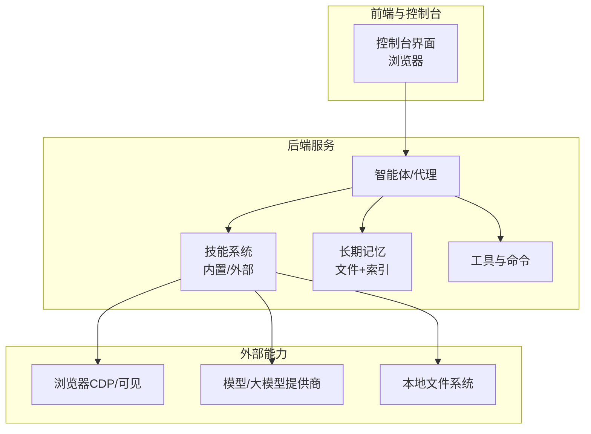
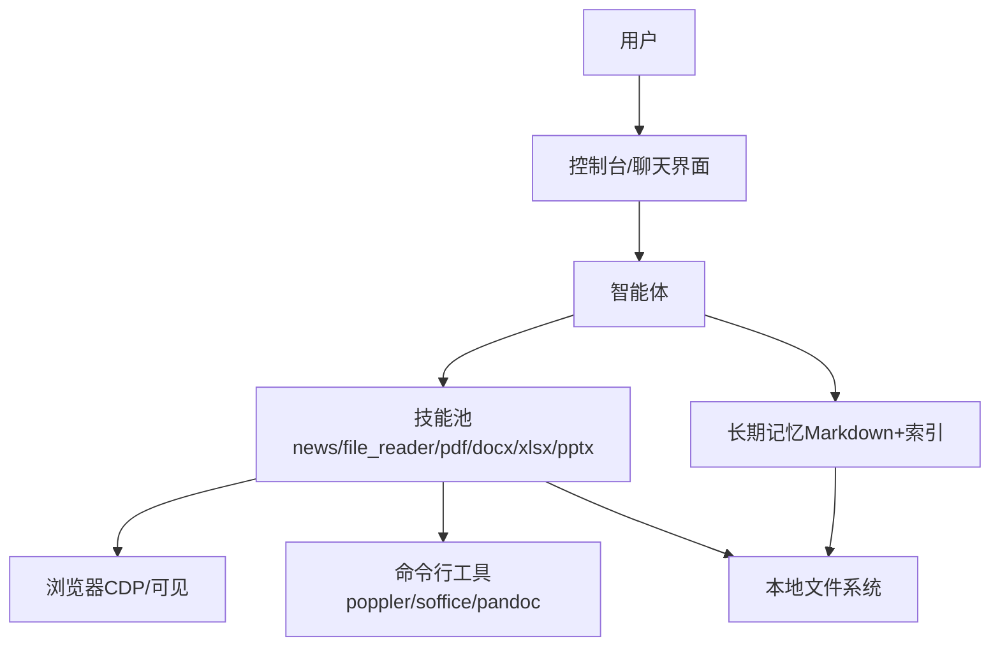
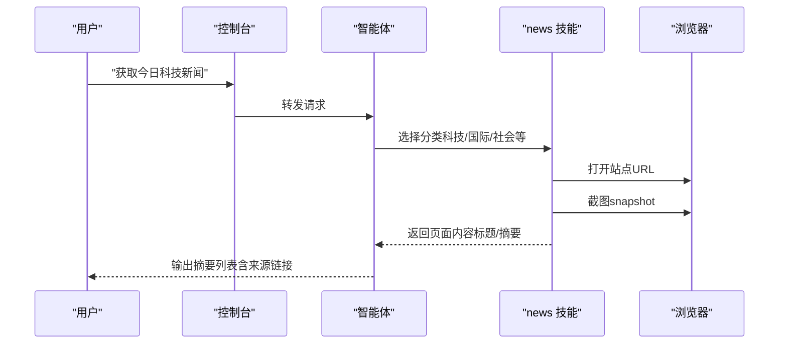
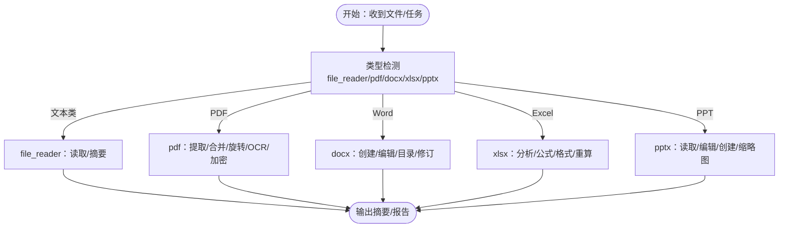
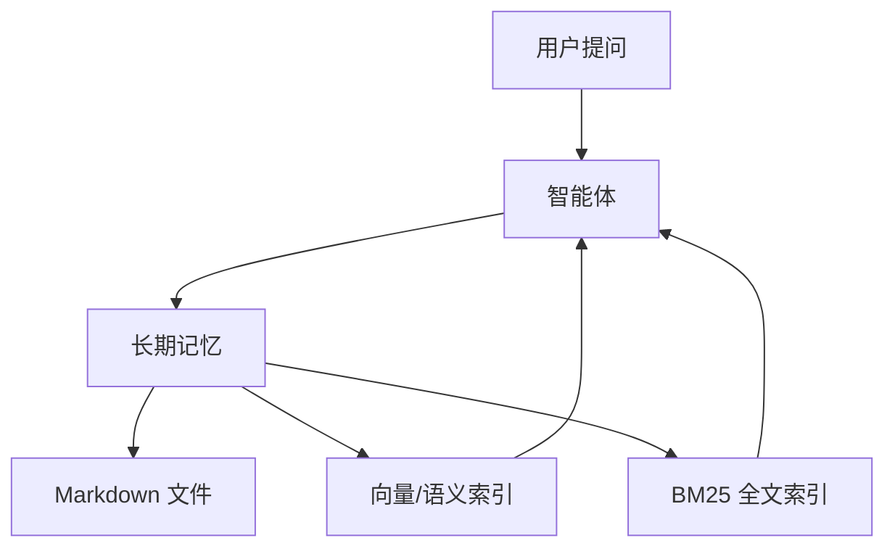
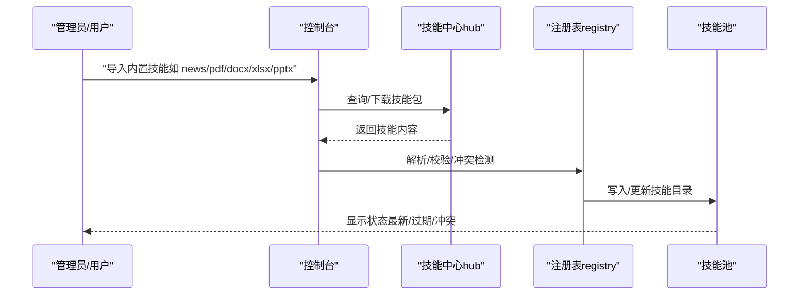
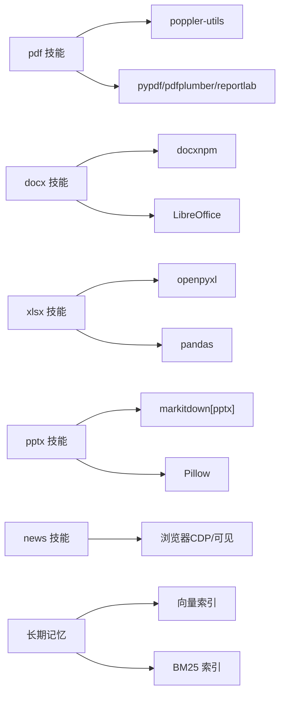
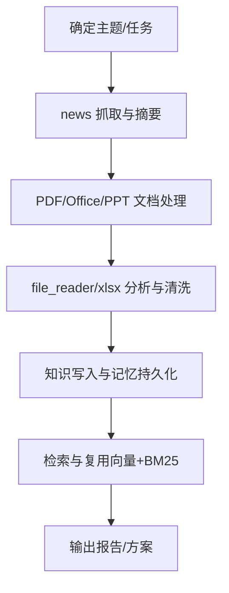

# 研究学习

<cite>
**本文引用的文件**
- [README.md](file://README.md)
- [skills.en.md](file://website/public/docs/skills.en.md)
- [skills.zh.md](file://website/public/docs/skills.zh.md)
- [news-en/SKILL.md](file://src/qwenpaw/agents/skills/news-en/SKILL.md)
- [file_reader-en/SKILL.md](file://src/qwenpaw/agents/skills/file_reader-en/SKILL.md)
- [pdf-en/SKILL.md](file://src/qwenpaw/agents/skills/pdf-en/SKILL.md)
- [pdf-en/reference.md](file://src/qwenpaw/agents/skills/pdf-en/reference.md)
- [docx-en/SKILL.md](file://src/qwenpaw/agents/skills/docx-en/SKILL.md)
- [xlsx-en/SKILL.md](file://src/qwenpaw/agents/skills/xlsx-en/SKILL.md)
- [pptx-en/SKILL.md](file://src/qwenpaw/agents/skills/pptx-en/SKILL.md)
- [memory.en.md](file://website/public/docs/memory.en.md)
- [memory.zh.md](file://website/public/docs/memory.zh.md)
- [memory-evolving-and-proactive.en.md](file://website/public/docs/memory-evolving-and-proactive.en.md)
- [adbpg_memory_manager.py](file://src/qwenpaw/agents/memory/adbpg_memory_manager.py)
- [adbpg_prompts.py](file://src/qwenpaw/agents/memory/adbpg_prompts.py)
- [hub.py](file://src/qwenpaw/agents/skill_system/hub.py)
- [registry.py](file://src/qwenpaw/agents/skill_system/registry.py)
- [compactor_prompts.py](file://src/qwenpaw/agents/context/compactor_prompts.py)
- [prompts.py](file://src/qwenpaw/agents/mission/prompts.py)
</cite>

## 目录
1. [简介](#简介)
2. [项目结构](#项目结构)
3. [核心组件](#核心组件)
4. [架构总览](#架构总览)
5. [详细组件分析](#详细组件分析)
6. [依赖关系分析](#依赖关系分析)
7. [性能考量](#性能考量)
8. [故障排查指南](#故障排查指南)
9. [结论](#结论)
10. [附录](#附录)

## 简介
本文件面向“研究学习”场景，系统化阐述如何在 QwenPaw 中开展科技新闻跟踪、文献资料处理、知识库构建与检索、学习资源管理与个人知识体系搭建。文档结合仓库内技能与能力说明，给出可落地的工作流与实操指引，帮助读者从“信息采集—整理分析—知识沉淀—检索复用”的闭环中提升科研与学习效率。

## 项目结构
QwenPaw 提供多语言技能与工具链，覆盖浏览器浏览、文件读取与解析、PDF/Office 文档处理、演示文稿生成与编辑、以及长期记忆与检索等能力。研究学习所需的“资料收集—整理分析—知识归纳—检索复用”全流程均可在现有技能与内存机制下实现。

图表来源
- [README.md: 31-58:31-58](file://README.md#L31-L58)
- [skills.en.md: 73-124:73-124](file://website/public/docs/skills.en.md#L73-L124)

章节来源
- [README.md: 31-58:31-58](file://README.md#L31-L58)
- [skills.en.md: 73-124:73-124](file://website/public/docs/skills.en.md#L73-L124)

## 核心组件
- 新闻技能（news）：按分类抓取权威站点，打开页面、截图、抽取标题与关键点并摘要回复。
- 文件读取技能（file_reader）：识别并读取纯文本类文件，支持类型探测、大日志尾部查看、摘要输出。
- PDF 技能（pdf）：文本/表格提取、合并/拆分、旋转、加水印、创建、表单填写、加密/解密、OCR 等。
- Word 技能（docx）：创建/编辑 .docx，目录、页眉页脚、表格、图片、修订与批注；支持转换与校验。
- Excel 技能（xlsx）：读取/编辑/创建 .xlsx/.xlsm/.csv/.tsv，数据清洗、公式构建、格式规范、公式重算。
- 演示文稿技能（pptx）：读取/编辑/创建 .pptx，模板/布局/讲稿备注/评论；支持缩略图与视觉校验。
- 长期记忆（memory）：Markdown 文件持久化、文件监听、向量+BM25 混合检索、自动优化。
- 技能系统（hub/registry）：内置技能导入、版本与冲突处理、环境变量注入、工作区/技能池管理。

章节来源
- [news-en/SKILL.md: 1-48:1-48](file://src/qwenpaw/agents/skills/news-en/SKILL.md#L1-L48)
- [file_reader-en/SKILL.md: 1-59:1-59](file://src/qwenpaw/agents/skills/file_reader-en/SKILL.md#L1-L59)
- [pdf-en/SKILL.md: 1-330:1-330](file://src/qwenpaw/agents/skills/pdf-en/SKILL.md#L1-L330)
- [docx-en/SKILL.md: 1-488:1-488](file://src/qwenpaw/agents/skills/docx-en/SKILL.md#L1-L488)
- [xlsx-en/SKILL.md: 1-306:1-306](file://src/qwenpaw/agents/skills/xlsx-en/SKILL.md#L1-L306)
- [pptx-en/SKILL.md: 1-240:1-240](file://src/qwenpaw/agents/skills/pptx-en/SKILL.md#L1-L240)
- [memory.en.md: 1-112:1-112](file://website/public/docs/memory.en.md#L1-L112)
- [memory.zh.md: 97-120:97-120](file://website/public/docs/memory.zh.md#L97-L120)
- [hub.py: 190-227:190-227](file://src/qwenpaw/agents/skill_system/hub.py#L190-L227)
- [registry.py: 554-574:554-574](file://src/qwenpaw/agents/skill_system/registry.py#L554-L574)

## 架构总览
QwenPaw 的“研究学习”能力由“技能驱动 + 记忆检索 + 工具链协同”构成。控制台作为入口，智能体根据任务动态调用相应技能；技能通过浏览器、命令行工具与文件系统完成资料采集与处理；长期记忆负责知识沉淀与检索。

图表来源
- [README.md: 31-58:31-58](file://README.md#L31-L58)
- [memory.en.md: 10-24:10-24](file://website/public/docs/memory.en.md#L10-L24)

章节来源
- [README.md: 31-58:31-58](file://README.md#L31-L58)
- [memory.en.md: 10-24:10-24](file://website/public/docs/memory.en.md#L10-L24)

## 详细组件分析

### 科技新闻跟踪与智能摘要
- 使用 news 技能按分类抓取权威站点，打开页面后截图并抽取标题、日期与摘要要点，形成简洁的摘要列表。
- 支持多类别并行抓取，避免跨页内容混杂；对不可达或超时站点给出替代建议。
- 可结合浏览器技能（browser_use）与快照（snapshot）抽取页面正文，再交由摘要模型生成摘要。

图表来源
- [news-en/SKILL.md: 27-47:27-47](file://src/qwenpaw/agents/skills/news-en/SKILL.md#L27-L47)

章节来源
- [news-en/SKILL.md: 1-48:1-48](file://src/qwenpaw/agents/skills/news-en/SKILL.md#L1-L48)

### 文献资料处理（PDF/Word/Excel/PPT）
- PDF 处理：支持文本/表格提取、合并/拆分、旋转、水印、创建、表单填写、加密/解密、OCR 等。可配合 poppler 工具与 pypdf/pdfplumber/reportlab 等库。
- Word 处理：支持 docx 创建与编辑、目录/页眉页脚/表格/图片、修订与批注、转换与校验。
- Excel 处理：支持 pandas 数据分析、openpyxl 公式与格式、模板遵循、颜色编码与数字格式标准、公式重算与错误检查。
- 演示文稿处理：支持 .pptx 读取/编辑/创建、模板/布局/讲稿备注/评论、缩略图生成与视觉校验。

图表来源
- [file_reader-en/SKILL.md: 14-59:14-59](file://src/qwenpaw/agents/skills/file_reader-en/SKILL.md#L14-L59)
- [pdf-en/SKILL.md: 15-330:15-330](file://src/qwenpaw/agents/skills/pdf-en/SKILL.md#L15-L330)
- [docx-en/SKILL.md: 15-488:15-488](file://src/qwenpaw/agents/skills/docx-en/SKILL.md#L15-L488)
- [xlsx-en/SKILL.md: 78-306:78-306](file://src/qwenpaw/agents/skills/xlsx-en/SKILL.md#L78-L306)
- [pptx-en/SKILL.md: 15-240:15-240](file://src/qwenpaw/agents/skills/pptx-en/SKILL.md#L15-L240)

章节来源
- [file_reader-en/SKILL.md: 1-59:1-59](file://src/qwenpaw/agents/skills/file_reader-en/SKILL.md#L1-L59)
- [pdf-en/SKILL.md: 1-330:1-330](file://src/qwenpaw/agents/skills/pdf-en/SKILL.md#L1-L330)
- [docx-en/SKILL.md: 1-488:1-488](file://src/qwenpaw/agents/skills/docx-en/SKILL.md#L1-L488)
- [xlsx-en/SKILL.md: 1-306:1-306](file://src/qwenpaw/agents/skills/xlsx-en/SKILL.md#L1-L306)
- [pptx-en/SKILL.md: 1-240:1-240](file://src/qwenpaw/agents/skills/pptx-en/SKILL.md#L1-L240)

### 知识库构建与检索
- 长期记忆：以 Markdown 文件为“事实来源”，文件监听异步更新本地数据库（向量+BM25），支持按语义与精确 token 检索。
- 记忆优化：定期自动优化 MEMORY.md，去除冗余，保留高质量记忆。
- 主动检索：遇到“过去做过什么/偏好/项目上下文”等问题时，优先使用 memory_search 工具确认，避免猜测。

图表来源
- [memory.en.md: 10-36:10-36](file://website/public/docs/memory.en.md#L10-L36)
- [memory.zh.md: 97-120:97-120](file://website/public/docs/memory.zh.md#L97-L120)
- [adbpg_memory_manager.py: 356-385:356-385](file://src/qwenpaw/agents/memory/adbpg_memory_manager.py#L356-L385)
- [adbpg_prompts.py: 38-70:38-70](file://src/qwenpaw/agents/memory/adbpg_prompts.py#L38-L70)

章节来源
- [memory.en.md: 1-112:1-112](file://website/public/docs/memory.en.md#L1-L112)
- [memory.zh.md: 97-120:97-120](file://website/public/docs/memory.zh.md#L97-L120)
- [adbpg_memory_manager.py: 356-385:356-385](file://src/qwenpaw/agents/memory/adbpg_memory_manager.py#L356-L385)
- [adbpg_prompts.py: 31-70:31-70](file://src/qwenpaw/agents/memory/adbpg_prompts.py#L31-L70)

### 技能系统与工作流
- 技能池与内置技能：可通过 Console 或 CLI 导入内置技能（news、pdf、docx、xlsx、pptx、file_reader 等），并支持更新与冲突处理。
- 环境变量注入：针对技能需求的环境变量可注入，便于在一次对话中隔离与生效。
- 上下文压缩与任务规划：提供结构化摘要与下一步计划模板，帮助在复杂研究任务中保持进度与关键上下文。

图表来源
- [skills.en.md: 73-124:73-124](file://website/public/docs/skills.en.md#L73-L124)
- [hub.py: 190-227:190-227](file://src/qwenpaw/agents/skill_system/hub.py#L190-L227)
- [registry.py: 554-574:554-574](file://src/qwenpaw/agents/skill_system/registry.py#L554-L574)

章节来源
- [skills.en.md: 68-116:68-116](file://website/public/docs/skills.en.md#L68-L116)
- [hub.py: 1-800:1-800](file://src/qwenpaw/agents/skill_system/hub.py#L1-L800)
- [registry.py: 1-800:1-800](file://src/qwenpaw/agents/skill_system/registry.py#L1-L800)

## 依赖关系分析
- 技能依赖：PDF/Office/图像/命令行工具（poppler、LibreOffice、pandoc、docx/pptxgenjs 等）是处理文档的关键依赖。
- 检索依赖：向量嵌入与 BM25 混合检索互补，分别擅长语义召回与精确 token 命中。
- 环境依赖：模型提供商（云/本地）与浏览器（CDP/可见）用于网页抓取与交互。

图表来源
- [pdf-en/SKILL.md: 15-23:15-23](file://src/qwenpaw/agents/skills/pdf-en/SKILL.md#L15-L23)
- [docx-en/SKILL.md: 15-22:15-22](file://src/qwenpaw/agents/skills/docx-en/SKILL.md#L15-L22)
- [xlsx-en/SKILL.md: 78-84:78-84](file://src/qwenpaw/agents/skills/xlsx-en/SKILL.md#L78-L84)
- [pptx-en/SKILL.md: 15-23:15-23](file://src/qwenpaw/agents/skills/pptx-en/SKILL.md#L15-L23)
- [news-en/SKILL.md: 13-13:13-13](file://src/qwenpaw/agents/skills/news-en/SKILL.md#L13-L13)
- [memory.en.md: 22-23:22-23](file://website/public/docs/memory.en.md#L22-L23)

章节来源
- [pdf-en/SKILL.md: 15-330:15-330](file://src/qwenpaw/agents/skills/pdf-en/SKILL.md#L15-L330)
- [docx-en/SKILL.md: 15-488:15-488](file://src/qwenpaw/agents/skills/docx-en/SKILL.md#L15-L488)
- [xlsx-en/SKILL.md: 78-306:78-306](file://src/qwenpaw/agents/skills/xlsx-en/SKILL.md#L78-L306)
- [pptx-en/SKILL.md: 15-240:15-240](file://src/qwenpaw/agents/skills/pptx-en/SKILL.md#L15-L240)
- [news-en/SKILL.md: 1-48:1-48](file://src/qwenpaw/agents/skills/news-en/SKILL.md#L1-L48)
- [memory.en.md: 10-36:10-36](file://website/public/docs/memory.en.md#L10-L36)

## 性能考量
- 文档读取：对大型 PDF/日志文件，优先使用分段读取与摘要策略，避免一次性加载全部内容。
- 检索效率：混合检索（向量+BM25）在不同场景互补，建议根据查询特征选择合适策略；定期优化 MEMORY.md 减少冗余。
- 工具链：合理选择工具（如 pdftotext 与 pdfplumber 的组合）以平衡速度与精度；公式重算（LibreOffice）耗时较长，建议批量执行并缓存结果。
- 浏览器：CDP 模式适合自动化，可见模式适合调试与演示；注意并发与稳定性。

## 故障排查指南
- 技能导入失败：检查网络与速率限制（GitHub API），设置 GITHUB_TOKEN；关注 Hub 返回的 429/5xx 错误。
- 依赖缺失：Windows 环境需确保 PATH 中包含 poppler/LibreOffice/docx/pptxgenjs 等；缺失时报错应停止重试并提示安装。
- 公式错误（Excel）：使用 scripts/recalc.py 扫描并修复 #REF!/#DIV/0!/#VALUE! 等错误，逐项验证引用与范围。
- 记忆检索异常：若向量搜索命中不足，尝试 BM25；若 BM25 命中过多噪音，调整查询词或过滤条件。
- 浏览器抓取失败：检查站点可用性与反爬策略，必要时切换可见模式或更换 UA/代理。

章节来源
- [hub.py: 325-429:325-429](file://src/qwenpaw/agents/skill_system/hub.py#L325-L429)
- [xlsx-en/SKILL.md: 221-277:221-277](file://src/qwenpaw/agents/skills/xlsx-en/SKILL.md#L221-L277)
- [memory.en.md: 26-37:26-37](file://website/public/docs/memory.en.md#L26-L37)

## 结论
QwenPaw 在“研究学习”场景下提供了从信息采集、资料处理到知识沉淀与检索的完整能力矩阵。通过 news 技能进行科技新闻跟踪，借助 PDF/Office/PPT 技能处理多样化文献与报告，结合长期记忆实现知识的持续积累与高效检索，能够显著提升科研与学习的自动化水平与产出质量。

## 附录

### 学习研究工作流示例（资料收集—整理分析—知识归纳）
- 资料收集
  - 使用 news 技能按“科技/国际/社会”等分类抓取权威站点，截图并抽取标题与摘要，形成每日摘要清单。
  - 对特定论文/报告，使用 PDF/Word/Excel/PPT 技能进行下载、提取、编辑与可视化。
- 整理分析
  - 使用 file_reader 对纯文本日志/配置/代码进行快速扫描与摘要；对表格数据使用 xlsx 技能进行清洗与建模。
  - 使用 pdf 技能进行 OCR 与表格提取，结合 pandas 进行统计分析。
- 知识归纳
  - 将关键结论与要点写入 Markdown 文件，触发长期记忆持久化；定期优化 MEMORY.md。
  - 使用向量+BM25 检索过往记忆，辅助撰写综述与方案设计。

图表来源
- [news-en/SKILL.md: 13-47:13-47](file://src/qwenpaw/agents/skills/news-en/SKILL.md#L13-L47)
- [file_reader-en/SKILL.md: 14-59:14-59](file://src/qwenpaw/agents/skills/file_reader-en/SKILL.md#L14-L59)
- [xlsx-en/SKILL.md: 90-164:90-164](file://src/qwenpaw/agents/skills/xlsx-en/SKILL.md#L90-L164)
- [memory.en.md: 26-37:26-37](file://website/public/docs/memory.en.md#L26-L37)

章节来源
- [news-en/SKILL.md: 1-48:1-48](file://src/qwenpaw/agents/skills/news-en/SKILL.md#L1-L48)
- [file_reader-en/SKILL.md: 1-59:1-59](file://src/qwenpaw/agents/skills/file_reader-en/SKILL.md#L1-L59)
- [xlsx-en/SKILL.md: 1-306:1-306](file://src/qwenpaw/agents/skills/xlsx-en/SKILL.md#L1-L306)
- [memory.en.md: 1-112:1-112](file://website/public/docs/memory.en.md#L1-L112)

### 技术细节与最佳实践
- PDF 高级处理：参考 pdf 技能的高级参考文档，了解 pypdfium2 渲染与 pdf-lib JS 库的使用场景。
- Word 编辑：严格遵循 docx-js 的 DXA 宽度规则、表格双宽度约束、ShadingType.CLEAR 等关键规则，避免渲染差异。
- Excel 规范：颜色编码、数字格式、公式构造与重算流程必须严格执行，确保零公式错误。
- 演示文稿：采用统一配色与排版风格，避免文本-only 幻灯片；使用缩略图进行视觉校验。

章节来源
- [pdf-en/reference.md: 1-50:1-50](file://src/qwenpaw/agents/skills/pdf-en/reference.md#L1-L50)
- [docx-en/SKILL.md: 285-301:285-301](file://src/qwenpaw/agents/skills/docx-en/SKILL.md#L285-L301)
- [xlsx-en/SKILL.md: 28-71:28-71](file://src/qwenpaw/agents/skills/xlsx-en/SKILL.md#L28-L71)
- [pptx-en/SKILL.md: 67-154:67-154](file://src/qwenpaw/agents/skills/pptx-en/SKILL.md#L67-L154)