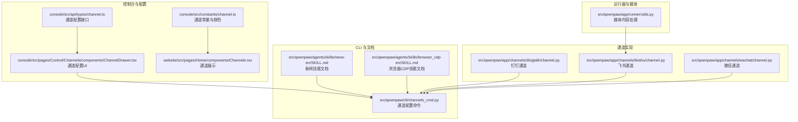
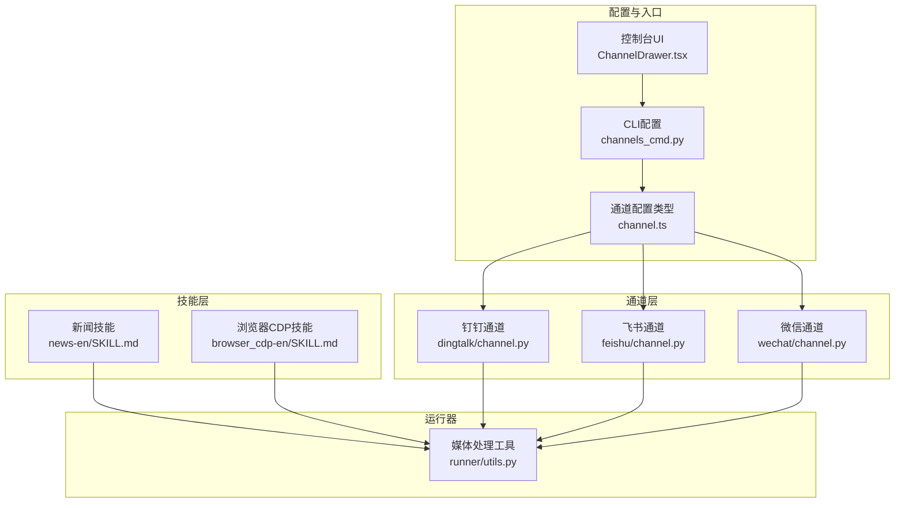
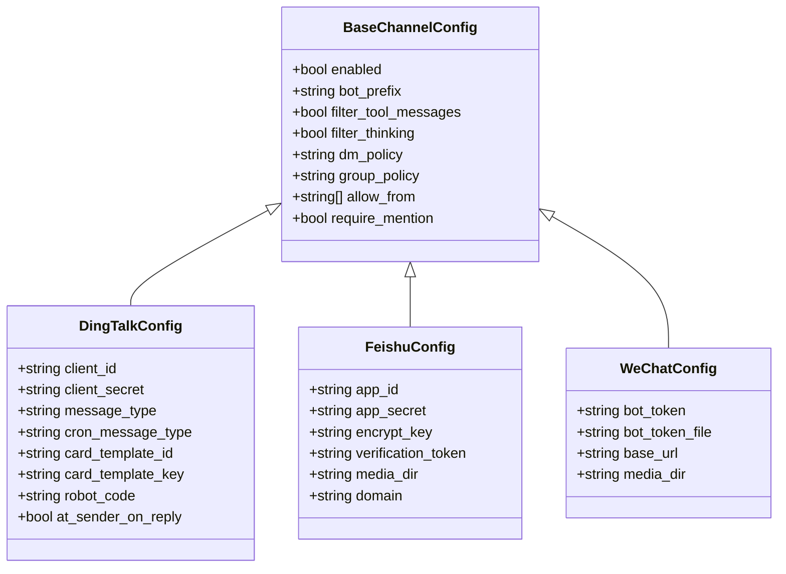
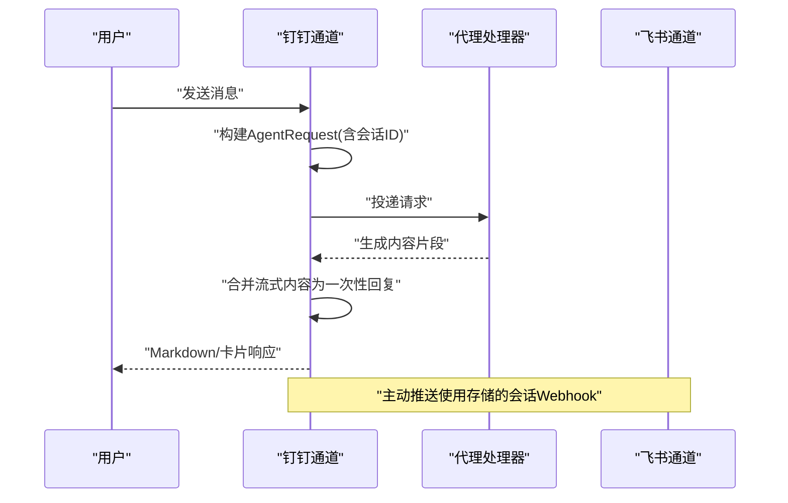
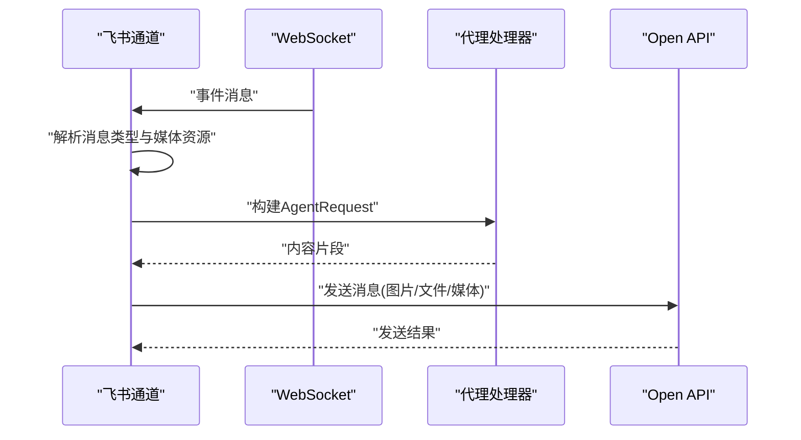
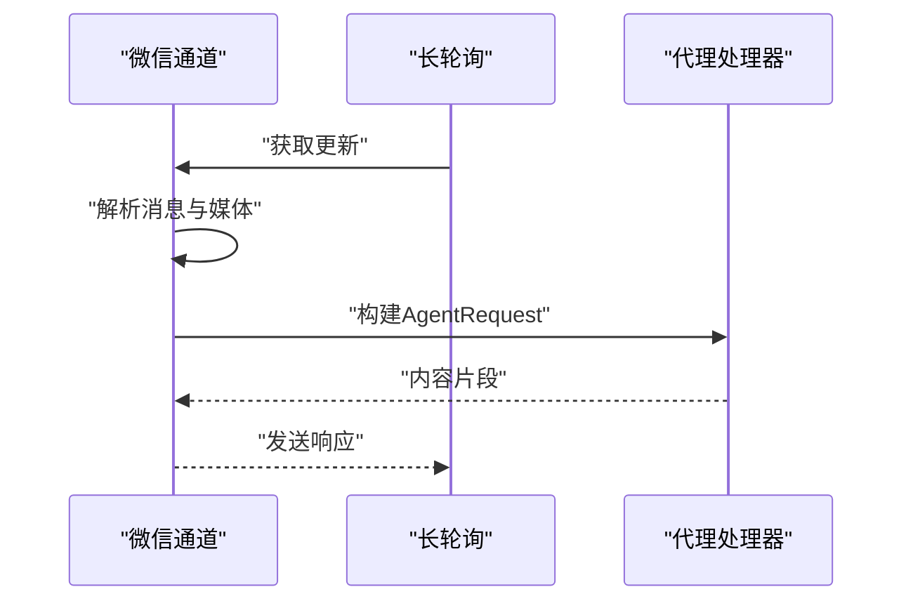
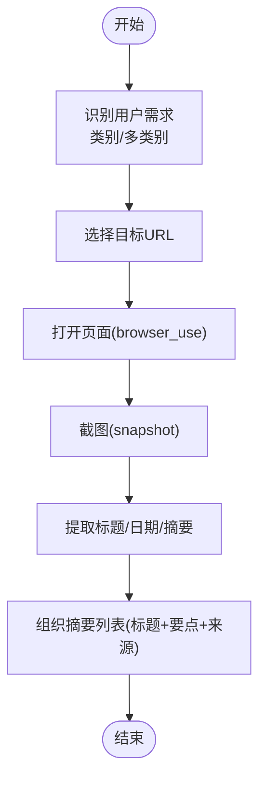
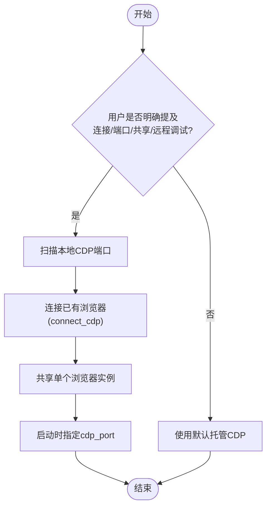
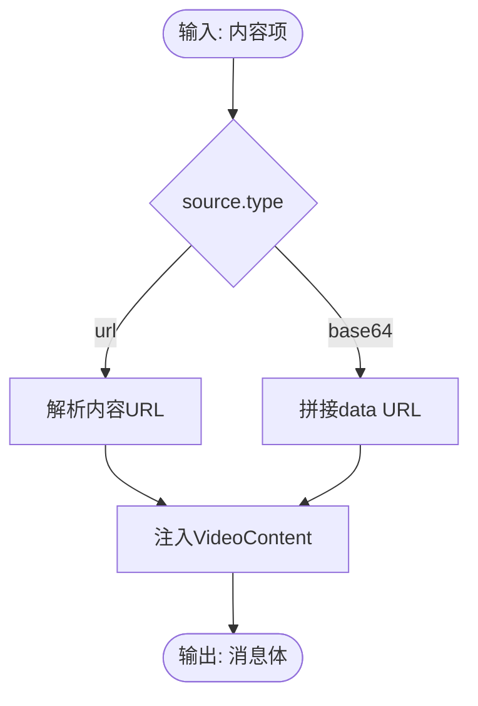
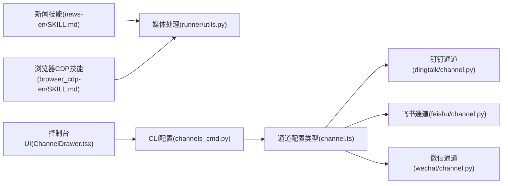

# 社交媒体管理

<cite>
**本文引用的文件**
- [README.md](file://README.md)
- [news-en/SKILL.md](file://src/qwenpaw/agents/skills/news-en/SKILL.md)
- [news-zh/SKILL.md](file://src/qwenpaw/agents/skills/news-zh/SKILL.md)
- [browser_cdp-en/SKILL.md](file://src/qwenpaw/agents/skills/browser_cdp-en/SKILL.md)
- [channel.ts](file://console/src/api/types/channel.ts)
- [channels_cmd.py](file://src/qwenpaw/cli/channels_cmd.py)
- [ChannelDrawer.tsx](file://console/src/pages/Control/Channels/components/ChannelDrawer.tsx)
- [channel.ts](file://console/src/constants/channel.ts)
- [dingtalk/channel.py](file://src/qwenpaw/app/channels/dingtalk/channel.py)
- [feishu/channel.py](file://src/qwenpaw/app/channels/feishu/channel.py)
- [wechat/channel.py](file://src/qwenpaw/app/channels/wechat/channel.py)
- [runner/utils.py](file://src/qwenpaw/app/runner/utils.py)
- [Channels.tsx](file://website/src/pages/Home/components/Channels.tsx)
</cite>

## 目录
1. [简介](#简介)
2. [项目结构](#项目结构)
3. [核心组件](#核心组件)
4. [架构总览](#架构总览)
5. [详细组件分析](#详细组件分析)
6. [依赖关系分析](#依赖关系分析)
7. [性能考量](#性能考量)
8. [故障排查指南](#故障排查指南)
9. [结论](#结论)
10. [附录](#附录)

## 简介
本文件面向“社交媒体管理”场景，系统化阐述 QwenPaw 在该领域的应用能力与实践路径，包括：
- 热点内容聚合：覆盖小红书、知乎、Reddit 等平台的聚合与摘要（基于现有新闻技能与浏览器自动化能力扩展）
- 视频内容摘要：针对 Bilibili、YouTube 等视频平台的内容抓取与摘要（结合浏览器自动化与媒体处理）
- 内容分发与推送：通过多通道（钉钉、飞书、微信、Discord、Telegram 等）进行定时与事件驱动的推送
- 技能配置与使用：新闻聚合技能、浏览器自动化技能的使用方法与最佳实践
- 高级功能：内容过滤、定时推送、个性化推荐（策略设计与实现建议）

QwenPaw 提供统一的技能体系与通道适配层，使上述能力可按需组合、灵活配置，并通过控制台与命令行完成部署与运维。

## 项目结构
围绕社交媒体管理，关键模块与文件如下：
- 控制台类型定义：通道配置接口与字段
- CLI 交互：通道配置向导
- 通道实现：钉钉、飞书、微信等通道的接入与消息编解码
- 技能文档：新闻聚合与浏览器 CDP 使用指南
- 运行器工具：媒体内容（视频）解析与渲染辅助
- 网站与控制台：通道展示与配置入口

**图表来源**
- [channel.ts:1-195](file://console/src/api/types/channel.ts#L1-L195)
- [ChannelDrawer.tsx:34-87](file://console/src/pages/Control/Channels/components/ChannelDrawer.tsx#L34-L87)
- [channel.ts:1-33](file://console/src/constants/channel.ts#L1-L33)
- [Channels.tsx:1-51](file://website/src/pages/Home/components/Channels.tsx#L1-L51)
- [channels_cmd.py:304-353](file://src/qwenpaw/cli/channels_cmd.py#L304-L353)
- [news-en/SKILL.md:1-48](file://src/qwenpaw/agents/skills/news-en/SKILL.md#L1-L48)
- [browser_cdp-en/SKILL.md:1-205](file://src/qwenpaw/agents/skills/browser_cdp-en/SKILL.md#L1-L205)
- [dingtalk/channel.py:1-800](file://src/qwenpaw/app/channels/dingtalk/channel.py#L1-L800)
- [feishu/channel.py:1-800](file://src/qwenpaw/app/channels/feishu/channel.py#L1-L800)
- [wechat/channel.py:1-800](file://src/qwenpaw/app/channels/wechat/channel.py#L1-L800)
- [runner/utils.py:249-277](file://src/qwenpaw/app/runner/utils.py#L249-L277)

**章节来源**
- [README.md:48-56](file://README.md#L48-L56)
- [channel.ts:1-195](file://console/src/api/types/channel.ts#L1-L195)
- [channels_cmd.py:304-353](file://src/qwenpaw/cli/channels_cmd.py#L304-L353)
- [ChannelDrawer.tsx:34-87](file://console/src/pages/Control/Channels/components/ChannelDrawer.tsx#L34-L87)
- [channel.ts:1-33](file://console/src/constants/channel.ts#L1-L33)
- [Channels.tsx:1-51](file://website/src/pages/Home/components/Channels.tsx#L1-L51)

## 核心组件
- 通道配置接口：定义各通道通用与特有参数（启用开关、前缀、过滤策略、消息类型、轮询间隔等），用于统一配置与序列化
- 通道实现：钉钉、飞书、微信等通道分别封装接收、去重、媒体下载、发送等流程，支持会话管理与主动推送
- 技能系统：新闻技能提供多站点聚合与摘要；浏览器 CDP 技能提供显式连接、端口扫描、共享浏览器实例等能力
- 运行器工具：媒体内容解析（视频 URL 或 base64 数据）并注入消息体，便于通道渲染
- 控制台与 CLI：提供通道配置界面与命令行交互，简化部署与运维

**章节来源**
- [channel.ts:1-195](file://console/src/api/types/channel.ts#L1-L195)
- [dingtalk/channel.py:1-800](file://src/qwenpaw/app/channels/dingtalk/channel.py#L1-L800)
- [feishu/channel.py:1-800](file://src/qwenpaw/app/channels/feishu/channel.py#L1-L800)
- [wechat/channel.py:1-800](file://src/qwenpaw/app/channels/wechat/channel.py#L1-L800)
- [news-en/SKILL.md:1-48](file://src/qwenpaw/agents/skills/news-en/SKILL.md#L1-L48)
- [browser_cdp-en/SKILL.md:1-205](file://src/qwenpaw/agents/skills/browser_cdp-en/SKILL.md#L1-L205)
- [runner/utils.py:249-277](file://src/qwenpaw/app/runner/utils.py#L249-L277)

## 架构总览
下图展示了社交媒体管理的端到端架构：控制台与 CLI 用于配置与下发任务；通道层负责消息收发与会话管理；技能层提供内容抓取与摘要；运行器负责媒体内容解析与注入。

**图表来源**
- [ChannelDrawer.tsx:34-87](file://console/src/pages/Control/Channels/components/ChannelDrawer.tsx#L34-L87)
- [channels_cmd.py:304-353](file://src/qwenpaw/cli/channels_cmd.py#L304-L353)
- [channel.ts:1-195](file://console/src/api/types/channel.ts#L1-L195)
- [dingtalk/channel.py:1-800](file://src/qwenpaw/app/channels/dingtalk/channel.py#L1-L800)
- [feishu/channel.py:1-800](file://src/qwenpaw/app/channels/feishu/channel.py#L1-L800)
- [wechat/channel.py:1-800](file://src/qwenpaw/app/channels/wechat/channel.py#L1-L800)
- [news-en/SKILL.md:1-48](file://src/qwenpaw/agents/skills/news-en/SKILL.md#L1-L48)
- [browser_cdp-en/SKILL.md:1-205](file://src/qwenpaw/agents/skills/browser_cdp-en/SKILL.md#L1-L205)
- [runner/utils.py:249-277](file://src/qwenpaw/app/runner/utils.py#L249-L277)

## 详细组件分析

### 通道配置与管理
- 通用配置项：启用开关、机器人前缀、是否过滤工具消息与思考过程、私聊/群聊策略、允许来源白名单、是否需要@提及等
- 平台特有项：如钉钉的消息类型、卡片模板、机器人编码；飞书的应用标识、加密密钥、校验令牌、媒体目录；微信的令牌文件、基础地址等
- 配置方式：控制台 UI 与 CLI 命令行交互，支持逐项确认与默认值提示

**图表来源**
- [channel.ts:1-195](file://console/src/api/types/channel.ts#L1-L195)

**章节来源**
- [channel.ts:1-195](file://console/src/api/types/channel.ts#L1-L195)
- [channels_cmd.py:304-353](file://src/qwenpaw/cli/channels_cmd.py#L304-L353)
- [ChannelDrawer.tsx:34-87](file://console/src/pages/Control/Channels/components/ChannelDrawer.tsx#L34-L87)

### 钉钉通道（消息收发与卡片）
- 接收：通过流回调接收消息，合并流式内容为一次性回复；支持会话 Webhook 主动推送
- 发送：支持文本、Markdown、图片、文件等；支持卡片布局与自动刷新
- 会话管理：存储会话 Webhook，基于会话 ID 查找目标；支持去重与消息 ID 管理
- 安全与策略：支持白名单、@提及策略、消息过滤与工具详情显示控制

**图表来源**
- [dingtalk/channel.py:1-800](file://src/qwenpaw/app/channels/dingtalk/channel.py#L1-L800)

**章节来源**
- [dingtalk/channel.py:1-800](file://src/qwenpaw/app/channels/dingtalk/channel.py#L1-L800)

### 飞书通道（WebSocket 接收与 Open API 发送）
- 接收：WebSocket 长连接接收事件，解析文本、富文本、图片、文件、媒体等消息类型
- 发送：通过 Open API 发送消息，支持图片、文件、媒体等
- 会话与去重：基于 chat_id/open_id 生成会话 ID；维护消息 ID 去重队列
- 安全与稳定性：支持时钟偏移修正、过期消息丢弃、重试风暴防护

**图表来源**
- [feishu/channel.py:1-800](file://src/qwenpaw/app/channels/feishu/channel.py#L1-L800)

**章节来源**
- [feishu/channel.py:1-800](file://src/qwenpaw/app/channels/feishu/channel.py#L1-L800)

### 微信通道（iLink Bot）
- 接收：长轮询拉取消息，解析文本、图片、语音（ASR）、文件、视频等
- 发送：HTTP API 发送消息，支持文本、图片、文件、视频
- 会话与上下文：基于 from_user_id/group_id 生成会话 ID；缓存 context_token 支持主动推送
- 登录与持久化：支持二维码登录与令牌文件持久化

**图表来源**
- [wechat/channel.py:1-800](file://src/qwenpaw/app/channels/wechat/channel.py#L1-L800)

**章节来源**
- [wechat/channel.py:1-800](file://src/qwenpaw/app/channels/wechat/channel.py#L1-L800)

### 新闻技能（热点聚合与摘要）
- 适用场景：为用户从指定新闻站点查找最新新闻，提供权威链接与摘要
- 使用方式：结合浏览器自动化工具打开页面、截图、提取标题与要点，再组织回复
- 注意事项：站点结构可能变化，必要时提示用户直接打开链接

**图表来源**
- [news-en/SKILL.md:1-48](file://src/qwenpaw/agents/skills/news-en/SKILL.md#L1-L48)
- [news-zh/SKILL.md:1-41](file://src/qwenpaw/agents/skills/news-zh/SKILL.md#L1-L41)

**章节来源**
- [news-en/SKILL.md:1-48](file://src/qwenpaw/agents/skills/news-en/SKILL.md#L1-L48)
- [news-zh/SKILL.md:1-41](file://src/qwenpaw/agents/skills/news-zh/SKILL.md#L1-L41)

### 浏览器 CDP 技能（显式连接与共享）
- 场景：需要连接已有浏览器、扫描本地端口、固定调试端口、共享浏览器实例
- 行为：默认由工具内部托管 CDP；当用户明确要求时才进入显式 CDP 场景
- 安全与隐私：建议在不暴露历史、Cookie、会话数据的前提下使用私有模式
- 端口冲突：同一工作空间仅允许一个浏览器实例；显式端口需确保未被占用

**图表来源**
- [browser_cdp-en/SKILL.md:1-205](file://src/qwenpaw/agents/skills/browser_cdp-en/SKILL.md#L1-L205)

**章节来源**
- [browser_cdp-en/SKILL.md:1-205](file://src/qwenpaw/agents/skills/browser_cdp-en/SKILL.md#L1-L205)

### 媒体内容处理（视频）
- 功能：根据内容来源类型（URL/base64）解析视频数据，注入消息体
- 应用：通道渲染视频内容，提升推送体验

**图表来源**
- [runner/utils.py:249-277](file://src/qwenpaw/app/runner/utils.py#L249-L277)

**章节来源**
- [runner/utils.py:249-277](file://src/qwenpaw/app/runner/utils.py#L249-L277)

## 依赖关系分析
- 控制台类型定义与通道实现解耦：类型定义独立于具体通道实现，便于扩展新通道
- 通道实现依赖运行器工具：媒体内容解析与注入在通道发送前完成
- 技能依赖工具链：新闻技能依赖浏览器自动化工具；浏览器 CDP 技能依赖显式 CDP 能力
- CLI 与控制台协同：CLI 提供快速配置，控制台提供可视化与文档链接

**图表来源**
- [channel.ts:1-195](file://console/src/api/types/channel.ts#L1-L195)
- [dingtalk/channel.py:1-800](file://src/qwenpaw/app/channels/dingtalk/channel.py#L1-L800)
- [feishu/channel.py:1-800](file://src/qwenpaw/app/channels/feishu/channel.py#L1-L800)
- [wechat/channel.py:1-800](file://src/qwenpaw/app/channels/wechat/channel.py#L1-L800)
- [news-en/SKILL.md:1-48](file://src/qwenpaw/agents/skills/news-en/SKILL.md#L1-L48)
- [browser_cdp-en/SKILL.md:1-205](file://src/qwenpaw/agents/skills/browser_cdp-en/SKILL.md#L1-L205)
- [runner/utils.py:249-277](file://src/qwenpaw/app/runner/utils.py#L249-L277)
- [channels_cmd.py:304-353](file://src/qwenpaw/cli/channels_cmd.py#L304-L353)
- [ChannelDrawer.tsx:34-87](file://console/src/pages/Control/Channels/components/ChannelDrawer.tsx#L34-L87)

**章节来源**
- [channel.ts:1-195](file://console/src/api/types/channel.ts#L1-L195)
- [channels_cmd.py:304-353](file://src/qwenpaw/cli/channels_cmd.py#L304-L353)
- [ChannelDrawer.tsx:34-87](file://console/src/pages/Control/Channels/components/ChannelDrawer.tsx#L34-L87)

## 性能考量
- 通道去重与会话管理：通过消息 ID 去重与会话 Webhook 存储，避免重复处理与无效推送
- 媒体下载与缓存：通道侧对图片/文件/视频进行下载与本地化存储，减少外部依赖抖动
- 流式处理与合并：通道将流式内容合并为一次性回复，降低往返次数与平台限流风险
- 资源限制：通道实现中对处理集合大小进行上限控制，防止内存膨胀

[本节为通用指导，无需特定文件引用]

## 故障排查指南
- 通道配置问题
  - 确认配置项是否正确：启用开关、机器人前缀、策略（白名单/开放）、消息类型等
  - 参考：通道配置类型定义与 CLI 配置命令
- 钉钉通道
  - 关注会话 Webhook 存储与失效处理；检查去重机制与消息 ID 管理
- 飞书通道
  - 关注 WebSocket 事件路由与跨实例分发；检查时钟偏移与过期消息丢弃逻辑
- 微信通道
  - 关注二维码登录与令牌文件持久化；长轮询异常与重试策略
- 媒体内容
  - 检查视频 URL/base64 解析与注入是否成功；确认通道渲染支持相应类型

**章节来源**
- [channel.ts:1-195](file://console/src/api/types/channel.ts#L1-L195)
- [channels_cmd.py:304-353](file://src/qwenpaw/cli/channels_cmd.py#L304-L353)
- [dingtalk/channel.py:1-800](file://src/qwenpaw/app/channels/dingtalk/channel.py#L1-L800)
- [feishu/channel.py:1-800](file://src/qwenpaw/app/channels/feishu/channel.py#L1-L800)
- [wechat/channel.py:1-800](file://src/qwenpaw/app/channels/wechat/channel.py#L1-L800)
- [runner/utils.py:249-277](file://src/qwenpaw/app/runner/utils.py#L249-L277)

## 结论
QwenPaw 在社交媒体管理场景下，通过统一的通道抽象与技能体系，实现了从内容抓取、摘要生成到多渠道分发的闭环。依托新闻技能与浏览器 CDP 技能，可灵活扩展至小红书、知乎、Reddit 等平台；结合钉钉、飞书、微信等通道，满足企业与团队的日常运营与推送需求。配合控制台与 CLI 的配置能力，用户可在本地或云端安全地部署与运维。

[本节为总结，无需特定文件引用]

## 附录
- 快速开始与文档入口：参见项目自述文件中的“快速开始”与“文档”部分
- 通道展示与入口：控制台与网站首页均提供通道入口与文档链接

**章节来源**
- [README.md:118-133](file://README.md#L118-L133)
- [README.md:362-384](file://README.md#L362-L384)
- [Channels.tsx:1-51](file://website/src/pages/Home/components/Channels.tsx#L1-L51)
- [ChannelDrawer.tsx:34-87](file://console/src/pages/Control/Channels/components/ChannelDrawer.tsx#L34-L87)