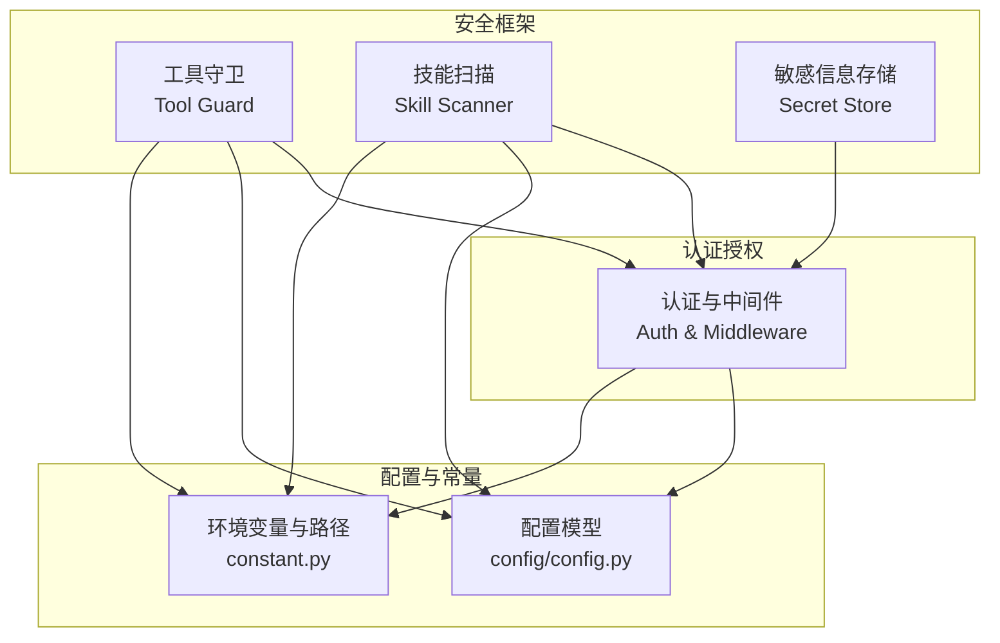
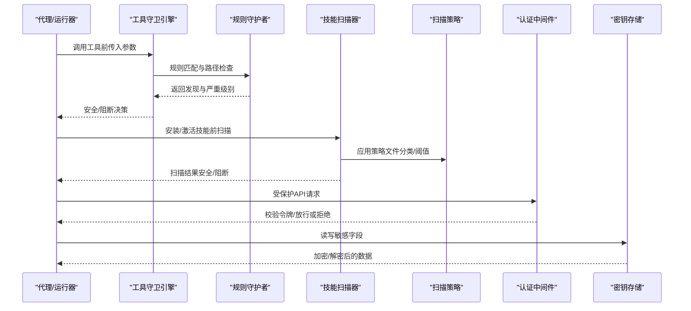
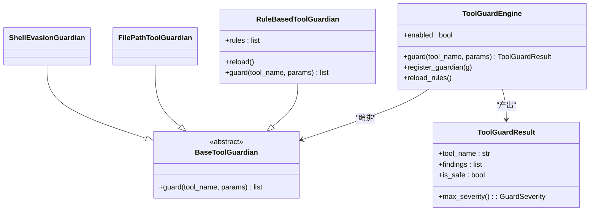
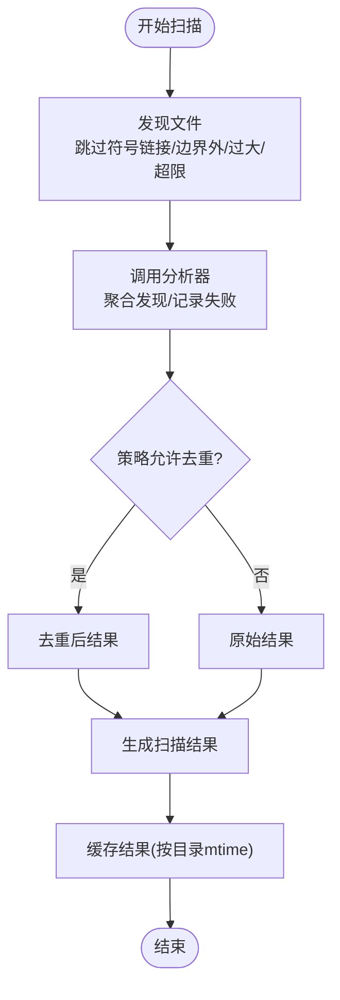
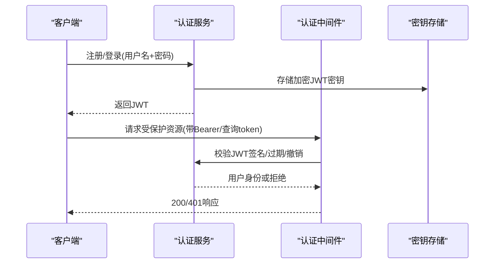
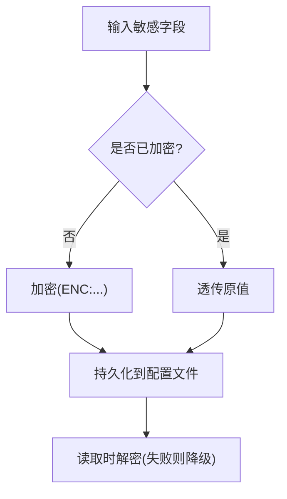
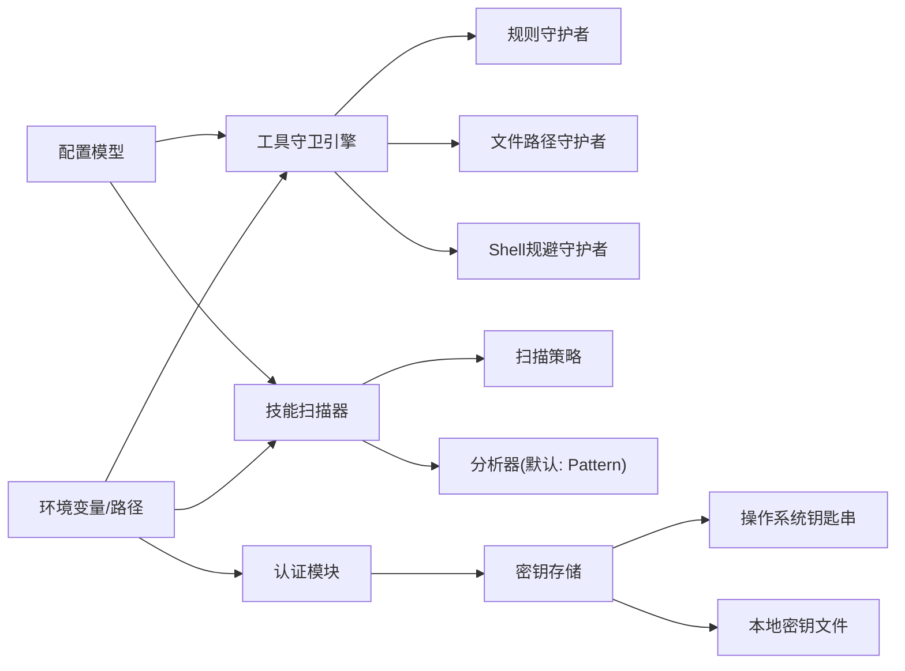

# 安全架构

<cite>
**本文引用的文件**
- [security/__init__.py](file://src/qwenpaw/security/__init__.py)
- [security/tool_guard/__init__.py](file://src/qwenpaw/security/tool_guard/__init__.py)
- [security/tool_guard/engine.py](file://src/qwenpaw/security/tool_guard/engine.py)
- [security/tool_guard/guardians/rule_guardian.py](file://src/qwenpaw/security/tool_guard/guardians/rule_guardian.py)
- [security/tool_guard/models.py](file://src/qwenpaw/security/tool_guard/models.py)
- [security/tool_guard/utils.py](file://src/qwenpaw/security/tool_guard/utils.py)
- [security/skill_scanner/__init__.py](file://src/qwenpaw/security/skill_scanner/__init__.py)
- [security/skill_scanner/models.py](file://src/qwenpaw/security/skill_scanner/models.py)
- [security/skill_scanner/scanner.py](file://src/qwenpaw/security/skill_scanner/scanner.py)
- [security/skill_scanner/scan_policy.py](file://src/qwenpaw/security/skill_scanner/scan_policy.py)
- [security/secret_store.py](file://src/qwenpaw/security/secret_store.py)
- [app/auth.py](file://src/qwenpaw/app/auth.py)
- [constant.py](file://src/qwenpaw/constant.py)
- [config/config.py](file://src/qwenpaw/config/config.py)
- [SECURITY.md](file://SECURITY.md)
</cite>

## 目录
1. [引言](#引言)
2. [项目结构](#项目结构)
3. [核心组件](#核心组件)
4. [架构总览](#架构总览)
5. [详细组件分析](#详细组件分析)
6. [依赖关系分析](#依赖关系分析)
7. [性能考量](#性能考量)
8. [故障排查指南](#故障排查指南)
9. [结论](#结论)
10. [附录](#附录)

## 引言
本文件面向QwenPaw的安全架构，系统化阐述其安全防护体系与运行机制，覆盖工具守卫（预执行参数扫描）、技能安全扫描（安装/激活前静态分析）、认证授权系统（登录态与中间件）以及敏感信息保护（磁盘透明加密）。文档同时给出威胁模型、攻击面分析、防护措施、最佳实践、审计与漏洞管理流程，并通过架构图与威胁分析矩阵展示安全控制点的分布与数据保护策略。

## 项目结构
QwenPaw在src/qwenpaw/security下集中实现三大安全子系统：
- 工具守卫（Tool Guard）：在工具调用前对参数进行规则匹配与路径边界检查，识别命令注入、敏感文件访问等高危模式。
- 技能扫描（Skill Scanner）：在技能安装/激活前对目录进行静态扫描，基于签名规则发现硬编码密钥、提示词注入、越权工具使用等风险。
- 敏感信息存储（Secret Store）：以Fernet对称加密提供磁盘透明加密，主密钥来自操作系统钥匙串或本地密钥文件，支持自动迁移与降级容错。

认证授权系统位于src/qwenpaw/app/auth.py，采用单用户注册、密码哈希、HMAC-SHA256签名JWT、可撤销令牌与FastAPI中间件实现受控访问。

图表来源
- [security/__init__.py:1-21](file://src/qwenpaw/security/__init__.py#L1-L21)
- [app/auth.py:1-641](file://src/qwenpaw/app/auth.py#L1-L641)
- [config/config.py:1-200](file://src/qwenpaw/config/config.py#L1-L200)
- [constant.py:1-200](file://src/qwenpaw/constant.py#L1-L200)

章节来源
- [security/__init__.py:1-21](file://src/qwenpaw/security/__init__.py#L1-L21)
- [app/auth.py:1-641](file://src/qwenpaw/app/auth.py#L1-L641)
- [config/config.py:1-200](file://src/qwenpaw/config/config.py#L1-L200)
- [constant.py:1-200](file://src/qwenpaw/constant.py#L1-L200)

## 核心组件
- 工具守卫引擎（ToolGuardEngine）
  - 统一编排多个守护者（Guardian），按配置决定是否拦截、自动拒绝与记录结果；支持规则热加载与守护范围动态调整。
- 规则型工具守护者（RuleBasedToolGuardian）
  - 基于YAML签名规则对参数字符串进行正则匹配；内置危险shell命令、路径越界、rm工作区外文件等规则；支持排除模式与增强提示。
- 技能扫描器（SkillScanner）
  - 遍历技能目录，按策略过滤文件类型与大小，调用分析器聚合结果；默认使用PatternAnalyzer进行签名匹配。
- 扫描策略（ScanPolicy）
  - 支持隐藏文件处理、规则作用域、凭证占位符、文件分类、阈值与严重性覆盖；可从YAML加载并叠加默认策略。
- 敏感信息存储（SecretStore）
  - Fernet对称加密（AES-128-CBC + HMAC-SHA256），主密钥优先来自操作系统钥匙串，回退至本地只读密钥文件；提供透明加解密与字段级加密。
- 认证授权（Auth）
  - 单用户注册、盐值SHA-256密码存储、HMAC-SHA256签名JWT、令牌撤销列表、中间件白名单与允许主机豁免。

章节来源
- [security/tool_guard/engine.py:54-269](file://src/qwenpaw/security/tool_guard/engine.py#L54-L269)
- [security/tool_guard/guardians/rule_guardian.py:559-758](file://src/qwenpaw/security/tool_guard/guardians/rule_guardian.py#L559-L758)
- [security/skill_scanner/scanner.py:76-319](file://src/qwenpaw/security/skill_scanner/scanner.py#L76-L319)
- [security/skill_scanner/scan_policy.py:156-476](file://src/qwenpaw/security/skill_scanner/scan_policy.py#L156-L476)
- [security/secret_store.py:1-414](file://src/qwenpaw/security/secret_store.py#L1-L414)
- [app/auth.py:1-641](file://src/qwenpaw/app/auth.py#L1-L641)

## 架构总览
下图展示了QwenPaw安全架构的关键交互：工具调用前经由工具守卫引擎进行参数扫描；技能安装/激活前经由技能扫描器进行静态分析；认证授权模块通过中间件保护API；敏感信息通过SecretStore统一加密存储。

图表来源
- [security/tool_guard/engine.py:200-258](file://src/qwenpaw/security/tool_guard/engine.py#L200-L258)
- [security/tool_guard/guardians/rule_guardian.py:608-758](file://src/qwenpaw/security/tool_guard/guardians/rule_guardian.py#L608-L758)
- [security/skill_scanner/scanner.py:148-242](file://src/qwenpaw/security/skill_scanner/scanner.py#L148-L242)
- [security/skill_scanner/scan_policy.py:236-282](file://src/qwenpaw/security/skill_scanner/scan_policy.py#L236-L282)
- [app/auth.py:567-641](file://src/qwenpaw/app/auth.py#L567-L641)
- [security/secret_store.py:293-322](file://src/qwenpaw/security/secret_store.py#L293-L322)

## 详细组件分析

### 工具守卫（Tool Guard）
- 设计要点
  - 分层接口：BaseToolGuardian抽象、RuleBasedToolGuardian规则匹配、FilePathToolGuardian路径边界、ShellEvasionGuardian规避检测。
  - 环境与配置：支持环境变量开关、守护工具集、自动拒绝规则集；守护范围可为空（全量）或集合限定。
  - 结果聚合：ToolGuardResult汇总发现、严重级别、耗时与失败守护者列表。
- 关键流程
  - 参数扫描：遍历参数值转字符串后逐条规则匹配；支持排除模式与上下文片段截取。
  - 路径边界：针对rm等危险命令解析目标路径，判断是否越出工作区根目录，生成结构化提示。
  - 自动拒绝：命中配置中的自动拒绝规则ID时直接阻断。
- 性能与健壮性
  - 正则预编译、线程安全缓存、失败降级记录、超时保护与失败容忍。

图表来源
- [security/tool_guard/engine.py:54-176](file://src/qwenpaw/security/tool_guard/engine.py#L54-L176)
- [security/tool_guard/guardians/rule_guardian.py:559-594](file://src/qwenpaw/security/tool_guard/guardians/rule_guardian.py#L559-L594)
- [security/tool_guard/models.py:103-185](file://src/qwenpaw/security/tool_guard/models.py#L103-L185)

章节来源
- [security/tool_guard/engine.py:36-176](file://src/qwenpaw/security/tool_guard/engine.py#L36-L176)
- [security/tool_guard/guardians/rule_guardian.py:559-758](file://src/qwenpaw/security/tool_guard/guardians/rule_guardian.py#L559-L758)
- [security/tool_guard/models.py:25-185](file://src/qwenpaw/security/tool_guard/models.py#L25-L185)
- [security/tool_guard/utils.py:64-157](file://src/qwenpaw/security/tool_guard/utils.py#L64-L157)

### 技能扫描（Skill Scanner）
- 设计要点
  - 扫描策略：隐藏文件、规则作用域、凭证占位符、文件分类（惰性/结构化/归档/代码）、文件数量与大小限制、阈值与严重性覆盖。
  - 文件发现：递归遍历，跳过符号链接与超出边界的路径，按扩展名与大小过滤。
  - 分析器编排：默认PatternAnalyzer，支持注册自定义分析器；聚合去重与失败记录。
- 关键流程
  - 目录扫描：收集可扫描文件，调用各分析器，合并结果并去重。
  - 白名单/黑名单：支持内容哈希白名单、阻断历史持久化与查询。
  - 缓存与超时：基于目录修改时间的轻量缓存，线程池执行与超时保护。
- 安全收益
  - 在技能启用前阻断硬编码密钥、提示词注入、越权工具使用等高危模式；支持组织定制策略。

图表来源
- [security/skill_scanner/scanner.py:148-242](file://src/qwenpaw/security/skill_scanner/scanner.py#L148-L242)
- [security/skill_scanner/scan_policy.py:236-282](file://src/qwenpaw/security/skill_scanner/scan_policy.py#L236-L282)

章节来源
- [security/skill_scanner/scanner.py:76-319](file://src/qwenpaw/security/skill_scanner/scanner.py#L76-L319)
- [security/skill_scanner/scan_policy.py:156-476](file://src/qwenpaw/security/skill_scanner/scan_policy.py#L156-L476)
- [security/skill_scanner/models.py:19-235](file://src/qwenpaw/security/skill_scanner/models.py#L19-L235)
- [security/skill_scanner/__init__.py:82-514](file://src/qwenpaw/security/skill_scanner/__init__.py#L82-L514)

### 认证授权系统（Auth）
- 设计要点
  - 登录态：通过环境变量开启，单用户注册；密码以盐值SHA-256存储，不落明文。
  - 令牌：HMAC-SHA256签名JWT，默认7天有效期，最大100年；支持永久令牌（特殊有效期）。
  - 撤销：基于jti的黑名单（字典O(1)查询）与过期清理；支持整体轮换密钥撤销所有会话。
  - 中间件：保护API路由，跳过公共路径/前缀与允许主机豁免；支持WebSocket查询参数令牌。
- 安全收益
  - 降低凭据泄露风险；细粒度访问控制与会话撤销能力；最小暴露面的公共路径设计。

图表来源
- [app/auth.py:469-560](file://src/qwenpaw/app/auth.py#L469-L560)
- [app/auth.py:567-641](file://src/qwenpaw/app/auth.py#L567-L641)
- [security/secret_store.py:293-322](file://src/qwenpaw/security/secret_store.py#L293-L322)

章节来源
- [app/auth.py:1-641](file://src/qwenpaw/app/auth.py#L1-L641)
- [constant.py:102-111](file://src/qwenpaw/constant.py#L102-L111)

### 敏感信息保护（Secret Store）
- 设计要点
  - 透明加密：对auth.json等敏感字段进行字段级加密；首次访问自动迁移明文字段。
  - 主密钥管理：优先使用操作系统钥匙串（keyring），容器/无显示环境自动降级；密钥文件仅600权限。
  - Fernet对称加密：AES-128-CBC + HMAC-SHA256，带前缀标识加密值；解密失败优雅降级返回原文。
- 安全收益
  - 降低磁盘上敏感信息泄露风险；跨进程/恢复场景的密钥同步与缓存一致性。

图表来源
- [security/secret_store.py:293-322](file://src/qwenpaw/security/secret_store.py#L293-L322)
- [security/secret_store.py:383-414](file://src/qwenpaw/security/secret_store.py#L383-L414)

章节来源
- [security/secret_store.py:1-414](file://src/qwenpaw/security/secret_store.py#L1-L414)

## 依赖关系分析
- 组件内聚与耦合
  - 工具守卫与技能扫描均采用“守护者/分析器”接口抽象，便于扩展新引擎而无需改动编排器。
  - SecretStore与Auth紧密协作，确保认证数据的机密性与完整性。
- 外部依赖与集成点
  - keyring用于系统钥匙串；cryptography用于Fernet；yaml用于规则与策略；pydantic用于配置模型。
- 配置与环境变量
  - 通过EnvVarLoader统一读取QWENPAW_*与兼容的COPAW_*键，支持运行时动态调整行为。

图表来源
- [security/tool_guard/engine.py:85-110](file://src/qwenpaw/security/tool_guard/engine.py#L85-L110)
- [security/skill_scanner/scanner.py:100-134](file://src/qwenpaw/security/skill_scanner/scanner.py#L100-L134)
- [app/auth.py:32-38](file://src/qwenpaw/app/auth.py#L32-L38)
- [constant.py:28-87](file://src/qwenpaw/constant.py#L28-L87)

章节来源
- [config/config.py:1-200](file://src/qwenpaw/config/config.py#L1-L200)
- [constant.py:1-200](file://src/qwenpaw/constant.py#L1-L200)

## 性能考量
- 工具守卫
  - 正则预编译与规则缓存；守护者失败不影响整体流程；建议合理设置守护工具集与自动拒绝规则，避免过度扫描。
- 技能扫描
  - 文件发现阶段严格过滤扩展名与大小；默认策略限制文件数量与大小；扫描结果按目录mtime缓存，减少重复开销。
- 认证授权
  - JWT签发/校验为纯CPU计算；撤销列表使用字典O(1)查询；建议定期清理过期撤销项。
- 密钥存储
  - 主密钥缓存与Fernet实例缓存；钥匙串访问带超时保护，避免阻塞。

## 故障排查指南
- 工具守卫
  - 症状：工具调用被阻断但未提示具体原因。
  - 排查：检查守护工具集与自动拒绝规则配置；查看日志中“TOOL GUARD”摘要与详细发现；必要时临时关闭守护验证问题定位。
  - 参考路径：[security/tool_guard/engine.py:200-258](file://src/qwenpaw/security/tool_guard/engine.py#L200-L258)、[security/tool_guard/utils.py:159-194](file://src/qwenpaw/security/tool_guard/utils.py#L159-L194)
- 技能扫描
  - 症状：扫描超时或阻断。
  - 排查：检查扫描策略阈值、文件大小限制与跳过扩展名；查看阻断历史记录；确认目录边界与符号链接处理。
  - 参考路径：[security/skill_scanner/__init__.py:424-514](file://src/qwenpaw/security/skill_scanner/__init__.py#L424-L514)、[security/skill_scanner/scanner.py:148-242](file://src/qwenpaw/security/skill_scanner/scanner.py#L148-L242)
- 认证授权
  - 症状：登录成功但无法访问受保护资源。
  - 排查：确认中间件是否跳过公共路径；检查令牌格式与过期；核对允许主机白名单；必要时撤销令牌或轮换密钥。
  - 参考路径：[app/auth.py:567-641](file://src/qwenpaw/app/auth.py#L567-L641)、[app/auth.py:498-560](file://src/qwenpaw/app/auth.py#L498-L560)
- 密钥存储
  - 症状：解密失败或密钥不同步。
  - 排查：确认钥匙串可用性与超时设置；执行主密钥重载；检查密钥文件权限与内容。
  - 参考路径：[security/secret_store.py:329-370](file://src/qwenpaw/security/secret_store.py#L329-L370)

章节来源
- [security/tool_guard/engine.py:200-258](file://src/qwenpaw/security/tool_guard/engine.py#L200-L258)
- [security/tool_guard/utils.py:159-194](file://src/qwenpaw/security/tool_guard/utils.py#L159-L194)
- [security/skill_scanner/__init__.py:424-514](file://src/qwenpaw/security/skill_scanner/__init__.py#L424-L514)
- [security/skill_scanner/scanner.py:148-242](file://src/qwenpaw/security/skill_scanner/scanner.py#L148-L242)
- [app/auth.py:498-560](file://src/qwenpaw/app/auth.py#L498-L560)
- [security/secret_store.py:329-370](file://src/qwenpaw/security/secret_store.py#L329-L370)

## 结论
QwenPaw通过“工具守卫+技能扫描+认证授权+敏感信息保护”的多层安全体系，在代理工具调用前与技能启用前两个关键入口实施前置防护；结合可配置的扫描策略与严格的令牌撤销机制，形成从策略到执行的闭环安全控制。建议在生产环境中启用认证、最小化守护工具集、定期审查扫描策略与阻断历史，并遵循安全策略文档中的部署与运营指导。

## 附录

### 安全威胁模型与攻击面
- 威胁模型
  - 单操作员边界：同一实例内的已认证调用被视为可信；不推荐共享实例承载互不信任的多用户。
  - 技能作为可信计算基：安装/启用的技能与本地代码同权，仅安装可信任技能。
- 攻击面
  - 工具调用：命令注入、路径穿越、敏感文件读取、数据外泄。
  - 技能包：硬编码密钥、提示词注入、越权工具使用、供应链攻击。
  - 认证：令牌伪造/重放、凭据泄露、会话劫持。
  - 存储：磁盘密钥泄露、配置文件明文。

章节来源
- [SECURITY.md:65-158](file://SECURITY.md#L65-L158)

### 威胁分析矩阵（示例）
- 工具调用
  - 命令注入：规则匹配与路径边界检查
  - 路径穿越：rm工作区外文件检测与提示
  - 数据外泄：参数扫描与自动拒绝规则
- 技能包
  - 硬编码密钥：签名规则与凭证占位符抑制
  - 提示词注入：规则作用域与文档路径跳过
  - 越权工具使用：策略禁用与白名单控制
- 认证
  - 令牌撤销：jti黑名单与过期清理
  - 中间件豁免：允许主机白名单
- 存储
  - 透明加密：Fernet + 主密钥钥匙串/文件
  - 字段级加密：敏感字段自动加解密

章节来源
- [security/tool_guard/guardians/rule_guardian.py:645-750](file://src/qwenpaw/security/tool_guard/guardians/rule_guardian.py#L645-L750)
- [security/skill_scanner/scan_policy.py:82-140](file://src/qwenpaw/security/skill_scanner/scan_policy.py#L82-L140)
- [app/auth.py:567-641](file://src/qwenpaw/app/auth.py#L567-L641)
- [security/secret_store.py:293-322](file://src/qwenpaw/security/secret_store.py#L293-L322)

### 安全配置最佳实践
- 工具守卫
  - 明确守护工具集与自动拒绝规则；在开发/测试环境适度放宽，生产环境收紧。
  - 定期更新规则库并启用热加载。
- 技能扫描
  - 使用组织定制扫描策略；限制文件数量与大小；启用内容哈希白名单。
  - 定期审查阻断历史与规则误报。
- 认证授权
  - 启用认证并限制公共路径；使用短有效期令牌；定期轮换JWT密钥。
  - 严格控制允许主机白名单。
- 敏感信息
  - 将密钥保存在操作系统钥匙串；禁止将密钥放入工作目录或技能可达路径。
  - 恢复后执行主密钥重载以同步钥匙串与文件。

章节来源
- [security/tool_guard/utils.py:64-157](file://src/qwenpaw/security/tool_guard/utils.py#L64-L157)
- [security/skill_scanner/scan_policy.py:236-282](file://src/qwenpaw/security/skill_scanner/scan_policy.py#L236-L282)
- [app/auth.py:329-420](file://src/qwenpaw/app/auth.py#L329-L420)
- [security/secret_store.py:329-370](file://src/qwenpaw/security/secret_store.py#L329-L370)

### 安全审计与漏洞管理
- 审计
  - 工具守卫日志结构化输出；技能扫描阻断历史持久化；认证中间件访问日志。
- 漏洞管理
  - 私有渠道报告；明确报告要素与接受门槛；区分边界绕过与仅内部风险。
  - 信任模型与部署假设清晰界定，避免误报与重复修复。

章节来源
- [SECURITY.md:1-158](file://SECURITY.md#L1-L158)
- [security/tool_guard/utils.py:159-194](file://src/qwenpaw/security/tool_guard/utils.py#L159-L194)
- [security/skill_scanner/__init__.py:240-312](file://src/qwenpaw/security/skill_scanner/__init__.py#L240-L312)
- [app/auth.py:567-641](file://src/qwenpaw/app/auth.py#L567-L641)