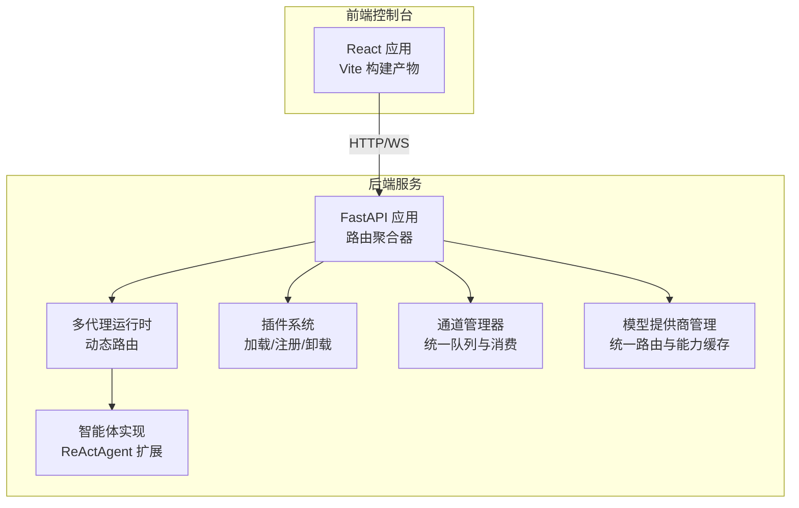
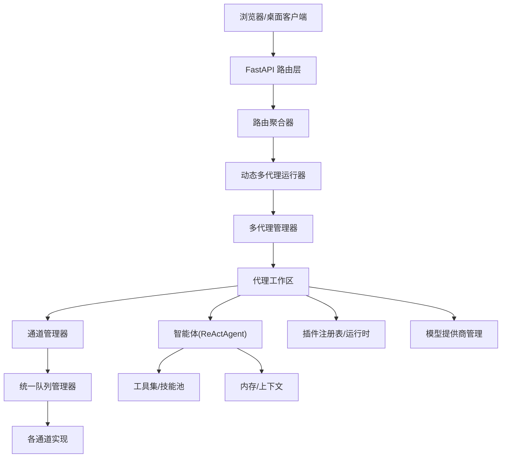
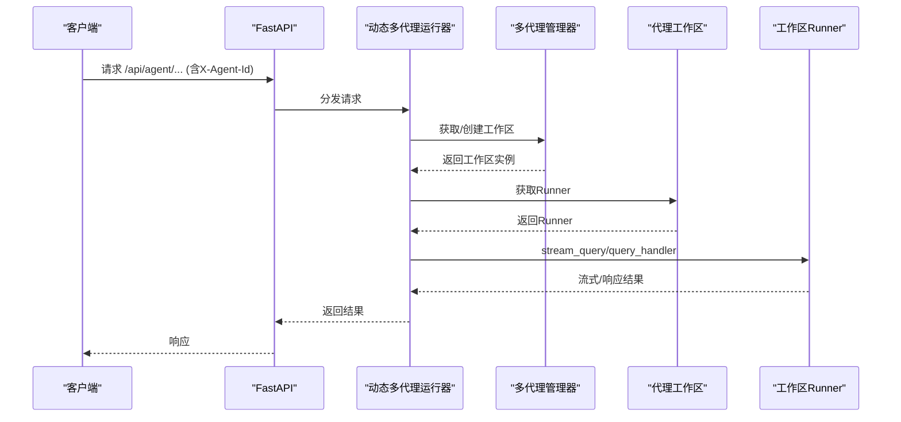
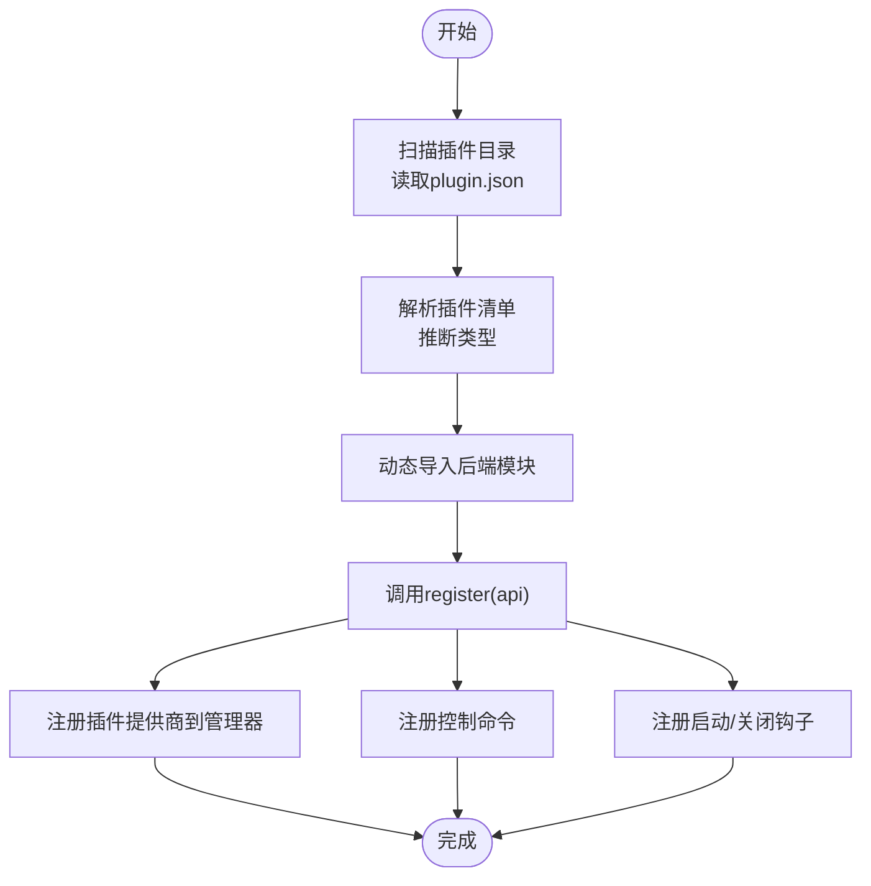
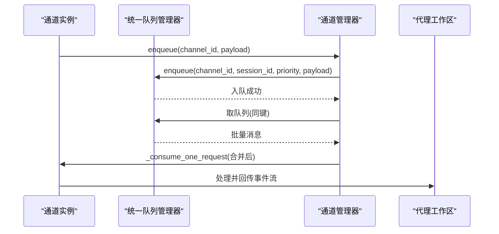
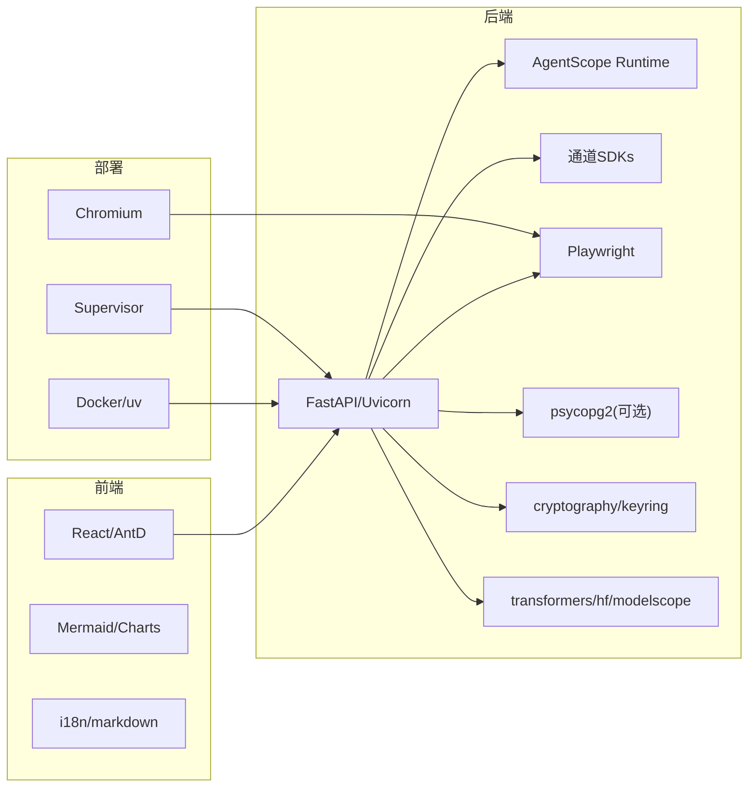
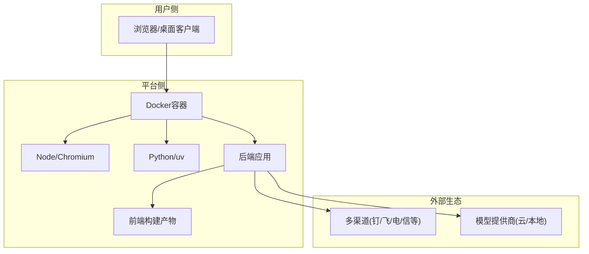

# 技术架构

<cite>
**本文引用的文件**
- [README.md](file://README.md)
- [pyproject.toml](file://pyproject.toml)
- [console/package.json](file://console/package.json)
- [deploy/Dockerfile](file://deploy/Dockerfile)
- [src/qwenpaw/__main__.py](file://src/qwenpaw/__main__.py)
- [src/qwenpaw/app/_app.py](file://src/qwenpaw/app/_app.py)
- [src/qwenpaw/app/routers/__init__.py](file://src/qwenpaw/app/routers/__init__.py)
- [src/qwenpaw/plugins/architecture.py](file://src/qwenpaw/plugins/architecture.py)
- [src/qwenpaw/plugins/loader.py](file://src/qwenpaw/plugins/loader.py)
- [src/qwenpaw/app/multi_agent_manager.py](file://src/qwenpaw/app/multi_agent_manager.py)
- [src/qwenpaw/app/channels/manager.py](file://src/qwenpaw/app/channels/manager.py)
- [src/qwenpaw/providers/provider_manager.py](file://src/qwenpaw/providers/provider_manager.py)
- [src/qwenpaw/agents/react_agent.py](file://src/qwenpaw/agents/react_agent.py)
- [src/qwenpaw/config/config.py](file://src/qwenpaw/config/config.py)
</cite>

## 目录
1. [引言](#引言)
2. [项目结构](#项目结构)
3. [核心组件](#核心组件)
4. [架构总览](#架构总览)
5. [详细组件分析](#详细组件分析)
6. [依赖分析](#依赖分析)
7. [性能考量](#性能考量)
8. [故障排查指南](#故障排查指南)
9. [结论](#结论)
10. [附录](#附录)

## 引言
本文件面向QwenPaw的技术架构，系统化阐述其整体设计与实现：前后端分离架构、插件化架构、多代理运行时架构与消息路由机制；解释核心组件间的交互关系、数据流向与集成模式；给出技术决策、权衡与约束；覆盖基础设施要求、可扩展性与部署拓扑；并提供系统上下文图与组件分解图，涵盖安全、监控与灾备等横切关注点，以及技术栈、第三方依赖与版本兼容性。

## 项目结构
QwenPaw采用“后端Python + 前端React”的分层架构：
- 后端（Python）：基于FastAPI构建REST API与事件流接口，承载多代理运行时、通道管理、插件系统、模型提供商管理与工作区服务。
- 前端（React/Vite）：独立构建产物注入到后端包内，作为静态资源提供控制台界面与聊天体验。
- 部署（Docker）：单容器镜像内置Node与Python环境，打包前端构建产物与后端应用，支持Supervisor进程管理与容器内Chromium运行。

图表来源
- [src/qwenpaw/app/_app.py:547-719](file://src/qwenpaw/app/_app.py#L547-L719)
- [src/qwenpaw/app/routers/__init__.py:1-69](file://src/qwenpaw/app/routers/__init__.py#L1-L69)
- [src/qwenpaw/plugins/loader.py:23-628](file://src/qwenpaw/plugins/loader.py#L23-L628)
- [src/qwenpaw/app/channels/manager.py:68-800](file://src/qwenpaw/app/channels/manager.py#L68-L800)
- [src/qwenpaw/providers/provider_manager.py:1-800](file://src/qwenpaw/providers/provider_manager.py#L1-L800)
- [src/qwenpaw/agents/react_agent.py:80-200](file://src/qwenpaw/agents/react_agent.py#L80-L200)

章节来源
- [README.md:118-384](file://README.md#L118-L384)
- [deploy/Dockerfile:1-105](file://deploy/Dockerfile#L1-L105)
- [console/package.json:1-79](file://console/package.json#L1-L79)

## 核心组件
- 应用入口与生命周期
  - 入口脚本通过命令行入口调用后端主程序，后端以FastAPI应用为核心，挂载路由、中间件与静态资源，并在生命周期中完成后台启动、插件加载、通道初始化与关闭清理。
- 多代理运行时
  - 动态多代理运行器根据请求头选择目标代理工作区，代理工作区由多代理管理器按需懒加载、并发启动与零停机热重载。
- 插件系统
  - 插件发现与加载、清单解析、后端模块动态导入、控制命令注册、启动/关闭钩子执行与依赖安装。
- 通道与消息路由
  - 统一队列管理器对来自不同通道的消息进行优先级分类、会话去抖与批合并，再交由对应通道实例消费处理。
- 模型提供商管理
  - 内置多家云/本地模型提供商，统一配置、能力探测与速率限制，支持本地模型服务重启与恢复。
- 智能体实现
  - 基于ReActAgent扩展，集成工具集、技能系统、内存与上下文管理、系统提示构建与命令处理。

章节来源
- [src/qwenpaw/__main__.py:1-7](file://src/qwenpaw/__main__.py#L1-L7)
- [src/qwenpaw/app/_app.py:220-545](file://src/qwenpaw/app/_app.py#L220-L545)
- [src/qwenpaw/app/multi_agent_manager.py:22-537](file://src/qwenpaw/app/multi_agent_manager.py#L22-L537)
- [src/qwenpaw/plugins/loader.py:23-628](file://src/qwenpaw/plugins/loader.py#L23-L628)
- [src/qwenpaw/app/channels/manager.py:68-800](file://src/qwenpaw/app/channels/manager.py#L68-L800)
- [src/qwenpaw/providers/provider_manager.py:1-800](file://src/qwenpaw/providers/provider_manager.py#L1-L800)
- [src/qwenpaw/agents/react_agent.py:80-200](file://src/qwenpaw/agents/react_agent.py#L80-L200)

## 架构总览
下图展示系统上下文与组件交互：前端通过HTTP/WS访问后端API；后端路由到多代理运行时；运行时按代理ID选择工作区；工作区内部协调通道、插件与模型提供商；智能体负责推理与工具调用。

图表来源
- [src/qwenpaw/app/_app.py:547-719](file://src/qwenpaw/app/_app.py#L547-L719)
- [src/qwenpaw/app/routers/__init__.py:1-69](file://src/qwenpaw/app/routers/__init__.py#L1-L69)
- [src/qwenpaw/app/multi_agent_manager.py:22-537](file://src/qwenpaw/app/multi_agent_manager.py#L22-L537)
- [src/qwenpaw/app/channels/manager.py:68-800](file://src/qwenpaw/app/channels/manager.py#L68-L800)
- [src/qwenpaw/plugins/loader.py:23-628](file://src/qwenpaw/plugins/loader.py#L23-L628)
- [src/qwenpaw/providers/provider_manager.py:1-800](file://src/qwenpaw/providers/provider_manager.py#L1-L800)
- [src/qwenpaw/agents/react_agent.py:80-200](file://src/qwenpaw/agents/react_agent.py#L80-L200)

## 详细组件分析

### 多代理运行时与工作区
- 动态多代理运行器
  - 通过请求头识别目标代理，委托给对应工作区的Runner；在外部任务注册/注销中保障优雅停机与任务追踪。
- 多代理管理器
  - 支持并发懒加载、原子替换与零停机热重载；后台清理任务集合，确保旧实例在活动任务完成后回收。
- 工作区
  - 封装代理生命周期、服务复用与任务跟踪；与通道、插件、模型提供商协作。

图表来源
- [src/qwenpaw/app/_app.py:72-205](file://src/qwenpaw/app/_app.py#L72-L205)
- [src/qwenpaw/app/multi_agent_manager.py:42-137](file://src/qwenpaw/app/multi_agent_manager.py#L42-L137)

章节来源
- [src/qwenpaw/app/_app.py:72-205](file://src/qwenpaw/app/_app.py#L72-L205)
- [src/qwenpaw/app/multi_agent_manager.py:22-537](file://src/qwenpaw/app/multi_agent_manager.py#L22-L537)

### 插件化架构
- 插件清单与类型
  - 定义插件类型（工具、提供商、钩子、命令、前端、通用），支持从元信息推断类型。
- 插件加载流程
  - 发现插件目录中的plugin.json，动态导入后端模块，调用register方法注册；支持控制命令注册与启动/关闭钩子执行；必要时安装Python依赖。
- 运行时集成
  - 注册插件提供商到模型管理器；设置插件HTTP应用；暴露控制命令至命令注册表。

图表来源
- [src/qwenpaw/plugins/architecture.py:10-142](file://src/qwenpaw/plugins/architecture.py#L10-L142)
- [src/qwenpaw/plugins/loader.py:36-262](file://src/qwenpaw/plugins/loader.py#L36-L262)
- [src/qwenpaw/app/_app.py:322-432](file://src/qwenpaw/app/_app.py#L322-L432)

章节来源
- [src/qwenpaw/plugins/architecture.py:10-142](file://src/qwenpaw/plugins/architecture.py#L10-L142)
- [src/qwenpaw/plugins/loader.py:23-628](file://src/qwenpaw/plugins/loader.py#L23-L628)
- [src/qwenpaw/app/_app.py:322-432](file://src/qwenpaw/app/_app.py#L322-L432)

### 通道与消息路由
- 统一队列管理器
  - 对同一会话键（通道+会话+优先级）建立队列，支持超时保护与清理循环；消费者循环对快速消息进行批合并后再交给通道实例处理。
- 通道实例
  - 从环境或配置创建，注入统一处理函数；支持健康检查、重启与事件发送。
- 优先级与会话键
  - 基于命令注册表对查询文本进行优先级判定；会话键用于去抖与批合并，保证同一会话内的消息有序处理。

图表来源
- [src/qwenpaw/app/channels/manager.py:258-461](file://src/qwenpaw/app/channels/manager.py#L258-L461)

章节来源
- [src/qwenpaw/app/channels/manager.py:68-800](file://src/qwenpaw/app/channels/manager.py#L68-L800)

### 模型提供商管理
- 内置提供商
  - 包含多家云/本地提供商（DashScope、OpenAI、Gemini、Ollama、LM Studio等），定义默认模型列表与URL选项。
- 统一接口
  - 提供者管理器负责注册、连接检查、能力缓存与速率限制；支持本地模型服务重启与恢复。
- 配置与密钥
  - 通过配置对象与密钥存储进行加密/解密管理，避免明文泄露。

章节来源
- [src/qwenpaw/providers/provider_manager.py:1-800](file://src/qwenpaw/providers/provider_manager.py#L1-L800)
- [src/qwenpaw/config/config.py:1-200](file://src/qwenpaw/config/config.py#L1-L200)

### 智能体实现与工具系统
- ReActAgent扩展
  - 集成工具集、技能系统、内存与上下文管理；支持系统提示构建、多模态提示与命令处理。
- 工具与技能
  - 内置多种工具（文件、浏览器、桌面截图、时间、代理协作等）；技能池动态加载与环境变量覆盖。
- 安全与合规
  - 工具守卫混入拦截高危命令；文件访问控制与安全扫描降低风险。

章节来源
- [src/qwenpaw/agents/react_agent.py:80-200](file://src/qwenpaw/agents/react_agent.py#L80-L200)

## 依赖分析
- 后端依赖
  - 核心框架：FastAPI、Uvicorn、AgentScope Runtime；调度：APScheduler；浏览器自动化：Playwright；通道SDK：钉钉、飞书、Telegram、Discord、MQTT等；数据库与ORM：psycopg2-binary（可选）；加密与密钥：cryptography、keyring；YAML与JSON修复：pyyaml、json-repair；模型生态：transformers、huggingface_hub、modelscope；音频：openai-whisper（可选）。
- 前端依赖
  - UI框架：Ant Design、Ant Design Charts；Markdown渲染：react-markdown、remark-gfm；状态管理：zustand；国际化：i18next；可视化：mermaid；拖拽：@dnd-kit；时间库：dayjs；类型：react、react-dom、typescript。
- 部署与构建
  - Docker镜像包含Node与Python运行时，使用uv加速Python包安装；Supervisor管理进程；Chromium用于无头浏览器场景。

图表来源
- [pyproject.toml:1-152](file://pyproject.toml#L1-L152)
- [console/package.json:21-76](file://console/package.json#L21-L76)
- [deploy/Dockerfile:1-105](file://deploy/Dockerfile#L1-L105)

章节来源
- [pyproject.toml:1-152](file://pyproject.toml#L1-L152)
- [console/package.json:1-79](file://console/package.json#L1-L79)
- [deploy/Dockerfile:1-105](file://deploy/Dockerfile#L1-L105)

## 性能考量
- 启动与并发
  - 后台异步启动：服务器快速就绪，后台并行启动多个代理与插件；多代理管理器并发懒加载，减少冷启动延迟。
- 流式处理
  - 动态多代理运行器支持流式任务，结合任务追踪与外部任务注册，保障长连接稳定性。
- 队列与批处理
  - 统一队列管理器对高频消息进行批合并，降低通道实例压力；超时保护避免阻塞。
- 本地模型优化
  - 本地模型管理器支持服务重启与恢复，减少中断影响。
- 前端静态资源
  - 构建产物直接打包进后端包，减少CDN依赖与跨域复杂度。

## 故障排查指南
- 启动失败
  - 检查恢复工件清理是否完成；确认Telemetry上传与配置迁移逻辑未阻塞；查看后台启动日志。
- 插件问题
  - 确认plugin.json存在且格式正确；检查后端模块导出plugin对象与register方法；依赖安装失败时查看uv/pip输出。
- 代理不可用
  - 使用多代理管理器的reload_agent进行零停机重载；检查任务追踪是否有活动任务导致延迟清理。
- 通道异常
  - 使用通道健康检查接口定位问题；必要时通过重启通道实例恢复；检查会话键与批合并逻辑。
- 模型提供商错误
  - 核对API Key与Base URL；检查提供商能力缓存与速率限制；尝试切换提供商或调整模型。

章节来源
- [src/qwenpaw/app/_app.py:220-545](file://src/qwenpaw/app/_app.py#L220-L545)
- [src/qwenpaw/plugins/loader.py:295-405](file://src/qwenpaw/plugins/loader.py#L295-L405)
- [src/qwenpaw/app/multi_agent_manager.py:138-382](file://src/qwenpaw/app/multi_agent_manager.py#L138-L382)
- [src/qwenpaw/app/channels/manager.py:549-665](file://src/qwenpaw/app/channels/manager.py#L549-L665)
- [src/qwenpaw/providers/provider_manager.py:1-800](file://src/qwenpaw/providers/provider_manager.py#L1-L800)

## 结论
QwenPaw以“前后端分离 + 插件化 + 多代理运行时 + 统一通道路由”为核心架构，实现了可扩展、可观测、可维护的个人AI助手平台。通过动态多代理运行时与统一队列管理，系统在高并发与多通道场景下保持稳定；通过插件系统与提供商管理，实现能力扩展与生态兼容；通过安全与灾备机制，保障生产可用性与数据安全。

## 附录

### 系统上下文图（概念）

[此图为概念示意，不直接映射具体源码文件]

### 技术栈与版本兼容性
- Python：3.10–3.14（项目要求）
- FastAPI/Uvicorn：现代ASGI服务栈
- React/Vite：前端构建与开发体验
- Docker/uv：镜像构建与包管理加速
- 第三方SDK：钉钉、飞书、Telegram、Discord、MQTT等通道SDK
- 数据与安全：psycopg2（可选）、cryptography、keyring、pyyaml、json-repair

章节来源
- [pyproject.toml:6-49](file://pyproject.toml#L6-L49)
- [console/package.json:21-76](file://console/package.json#L21-L76)
- [deploy/Dockerfile:1-105](file://deploy/Dockerfile#L1-L105)