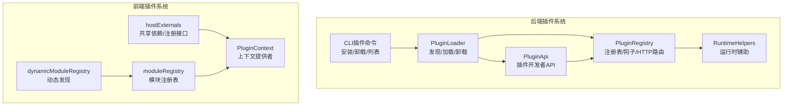
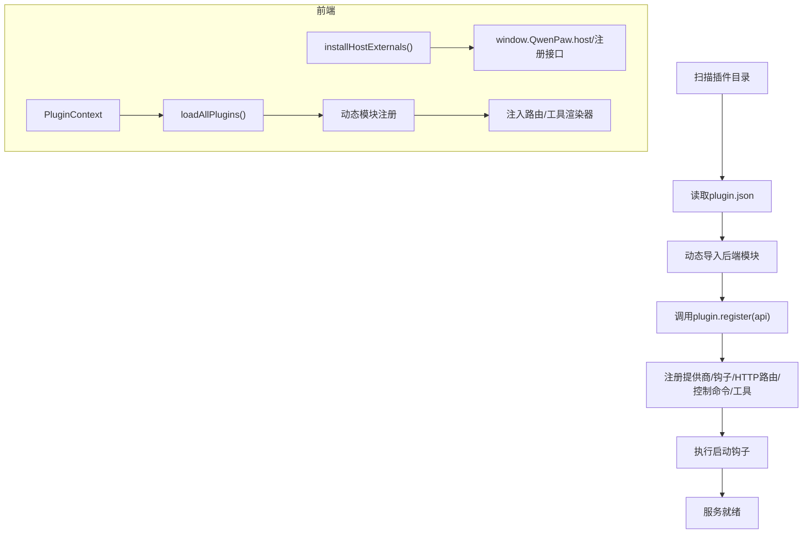
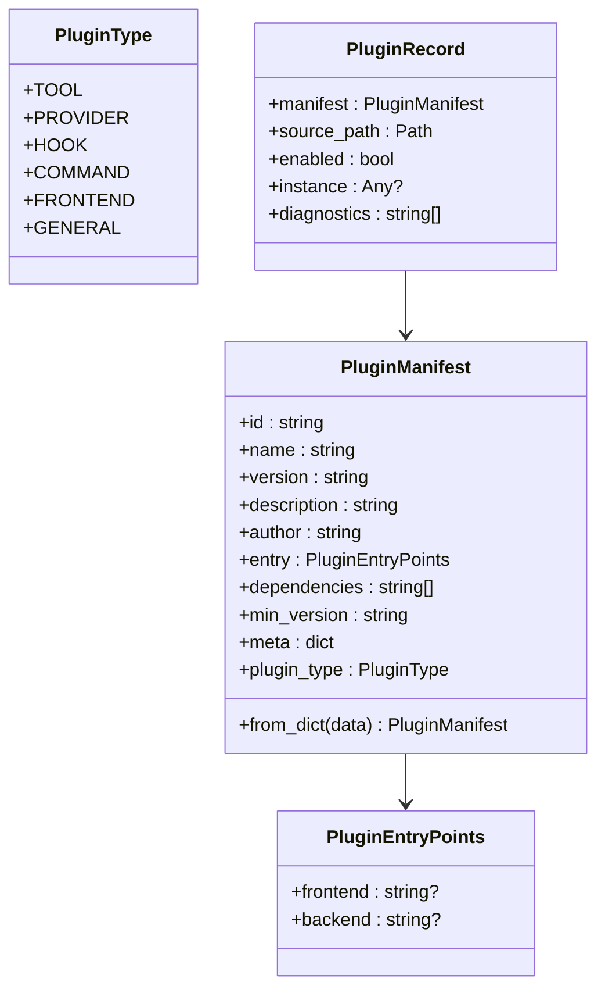
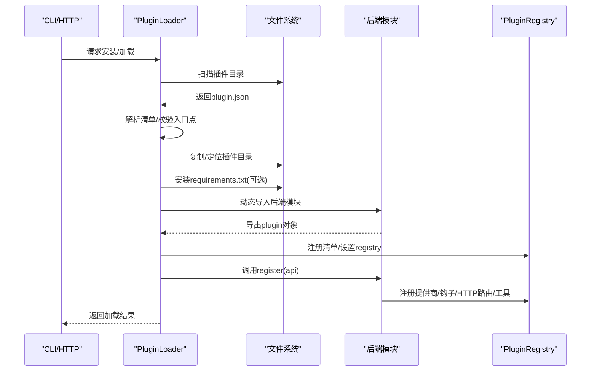
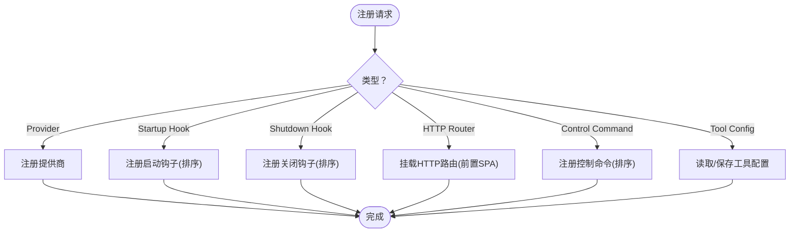
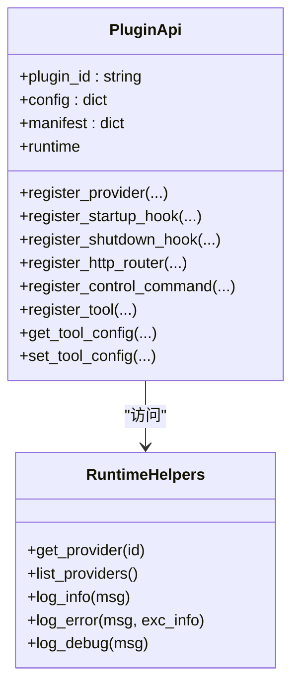
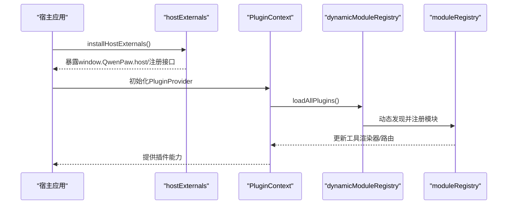
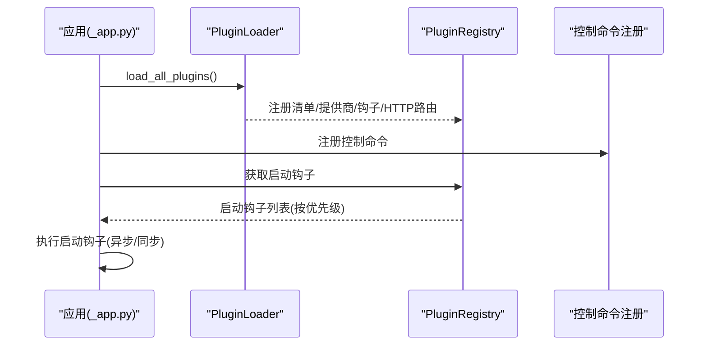
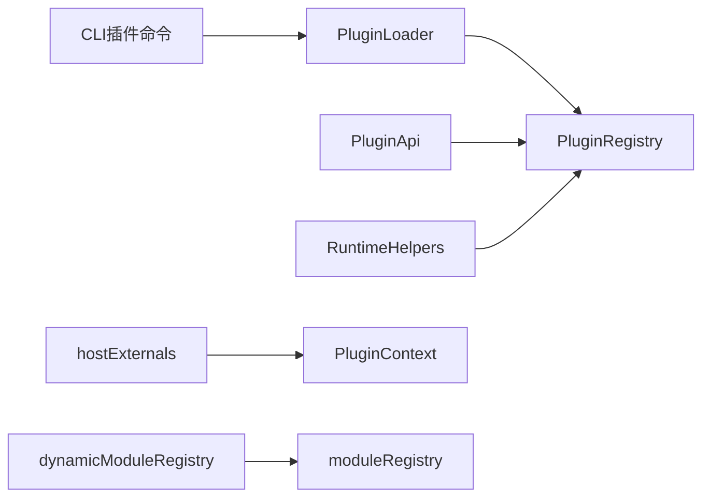

# 插件系统架构

<cite>
**本文档引用的文件**
- [src/qwenpaw/plugins/__init__.py](file://src/qwenpaw/plugins/__init__.py)
- [src/qwenpaw/plugins/architecture.py](file://src/qwenpaw/plugins/architecture.py)
- [src/qwenpaw/plugins/loader.py](file://src/qwenpaw/plugins/loader.py)
- [src/qwenpaw/plugins/registry.py](file://src/qwenpaw/plugins/registry.py)
- [src/qwenpaw/plugins/runtime.py](file://src/qwenpaw/plugins/runtime.py)
- [src/qwenpaw/plugins/api.py](file://src/qwenpaw/plugins/api.py)
- [src/qwenpaw/cli/plugin_commands.py](file://src/qwenpaw/cli/plugin_commands.py)
- [src/qwenpaw/app/_app.py](file://src/qwenpaw/app/_app.py)
- [src/qwenpaw/app/routers/plugins.py](file://src/qwenpaw/app/routers/plugins.py)
- [plugins/tool/qwen-image/plugin.json](file://plugins/tool/qwen-image/plugin.json)
- [plugins/tool/qwen-image/qwen_image.py](file://plugins/tool/qwen-image/qwen_image.py)
- [console/src/plugins/dynamicModuleRegistry.ts](file://console/src/plugins/dynamicModuleRegistry.ts)
- [console/src/plugins/moduleRegistry.ts](file://console/src/plugins/moduleRegistry.ts)
- [console/src/plugins/hostExternals.ts](file://console/src/plugins/hostExternals.ts)
- [console/src/plugins/PluginContext.tsx](file://console/src/plugins/PluginContext.tsx)
</cite>

## 目录
1. [简介](#简介)
2. [项目结构](#项目结构)
3. [核心组件](#核心组件)
4. [架构总览](#架构总览)
5. [详细组件分析](#详细组件分析)
6. [依赖关系分析](#依赖关系分析)
7. [性能考量](#性能考量)
8. [故障排查指南](#故障排查指南)
9. [结论](#结论)
10. [附录](#附录)

## 简介
本文件面向QwenPaw插件系统，提供从架构设计到实现细节的全景式说明。重点覆盖以下方面：
- 插件发现与动态加载流程
- 插件注册表与生命周期管理（启动/关闭钩子）
- 运行时环境与安全隔离策略
- 插件开发框架、清单格式与API暴露机制
- 前端插件系统（模块注册、共享依赖、路由与工具渲染器）
- 插件间通信与资源共享机制
- 架构图与加载时序图，展示从发现到运行的完整流程

## 项目结构
QwenPaw的插件系统由后端Python插件框架与前端React插件生态两部分组成：
- 后端：负责插件发现、动态加载、依赖安装、注册表管理、生命周期钩子执行与HTTP路由挂载
- 前端：通过模块注册表与共享依赖，支持插件在UI侧注册页面路由与工具渲染器

图表来源
- [src/qwenpaw/plugins/loader.py:23-628](file://src/qwenpaw/plugins/loader.py#L23-L628)
- [src/qwenpaw/plugins/registry.py:95-598](file://src/qwenpaw/plugins/registry.py#L95-L598)
- [src/qwenpaw/plugins/api.py:48-401](file://src/qwenpaw/plugins/api.py#L48-L401)
- [src/qwenpaw/plugins/runtime.py:10-68](file://src/qwenpaw/plugins/runtime.py#L10-L68)
- [src/qwenpaw/cli/plugin_commands.py:495-800](file://src/qwenpaw/cli/plugin_commands.py#L495-L800)
- [console/src/plugins/hostExternals.ts:57-192](file://console/src/plugins/hostExternals.ts#L57-L192)
- [console/src/plugins/moduleRegistry.ts:39-138](file://console/src/plugins/moduleRegistry.ts#L39-L138)
- [console/src/plugins/dynamicModuleRegistry.ts:22-117](file://console/src/plugins/dynamicModuleRegistry.ts#L22-L117)
- [console/src/plugins/PluginContext.tsx:47-96](file://console/src/plugins/PluginContext.tsx#L47-L96)

章节来源
- [src/qwenpaw/plugins/__init__.py:1-17](file://src/qwenpaw/plugins/__init__.py#L1-L17)
- [src/qwenpaw/plugins/architecture.py:10-142](file://src/qwenpaw/plugins/architecture.py#L10-L142)
- [src/qwenpaw/plugins/loader.py:23-628](file://src/qwenpaw/plugins/loader.py#L23-L628)
- [src/qwenpaw/plugins/registry.py:95-598](file://src/qwenpaw/plugins/registry.py#L95-L598)
- [src/qwenpaw/plugins/api.py:48-401](file://src/qwenpaw/plugins/api.py#L48-L401)
- [src/qwenpaw/plugins/runtime.py:10-68](file://src/qwenpaw/plugins/runtime.py#L10-L68)
- [src/qwenpaw/cli/plugin_commands.py:495-800](file://src/qwenpaw/cli/plugin_commands.py#L495-L800)
- [console/src/plugins/hostExternals.ts:57-192](file://console/src/plugins/hostExternals.ts#L57-L192)
- [console/src/plugins/moduleRegistry.ts:39-138](file://console/src/plugins/moduleRegistry.ts#L39-L138)
- [console/src/plugins/dynamicModuleRegistry.ts:22-117](file://console/src/plugins/dynamicModuleRegistry.ts#L22-L117)
- [console/src/plugins/PluginContext.tsx:47-96](file://console/src/plugins/PluginContext.tsx#L47-L96)

## 核心组件
- 插件清单与类型定义：定义插件清单字段、入口点、类型枚举与记录结构
- 插件加载器：扫描目录、读取清单、动态导入后端模块、调用注册方法、安装依赖
- 插件注册表：集中管理提供商、启动/关闭钩子、控制命令、HTTP路由、工具配置
- 插件API：为插件开发者提供注册接口（提供商、钩子、HTTP路由、控制命令、工具）
- 运行时助手：提供日志、提供商查询等能力
- CLI插件命令：支持离线/在线安装、卸载、列表、信息查询
- 前端插件系统：共享依赖、模块注册表、动态模块发现、插件上下文

章节来源
- [src/qwenpaw/plugins/architecture.py:10-142](file://src/qwenpaw/plugins/architecture.py#L10-L142)
- [src/qwenpaw/plugins/loader.py:23-628](file://src/qwenpaw/plugins/loader.py#L23-L628)
- [src/qwenpaw/plugins/registry.py:95-598](file://src/qwenpaw/plugins/registry.py#L95-L598)
- [src/qwenpaw/plugins/api.py:48-401](file://src/qwenpaw/plugins/api.py#L48-L401)
- [src/qwenpaw/plugins/runtime.py:10-68](file://src/qwenpaw/plugins/runtime.py#L10-L68)
- [src/qwenpaw/cli/plugin_commands.py:495-800](file://src/qwenpaw/cli/plugin_commands.py#L495-L800)
- [console/src/plugins/hostExternals.ts:57-192](file://console/src/plugins/hostExternals.ts#L57-L192)
- [console/src/plugins/moduleRegistry.ts:39-138](file://console/src/plugins/moduleRegistry.ts#L39-L138)
- [console/src/plugins/dynamicModuleRegistry.ts:22-117](file://console/src/plugins/dynamicModuleRegistry.ts#L22-L117)
- [console/src/plugins/PluginContext.tsx:47-96](file://console/src/plugins/PluginContext.tsx#L47-L96)

## 架构总览
后端插件系统围绕“发现—加载—注册—运行”闭环构建，前端插件系统通过共享依赖与模块注册表实现UI扩展。

图表来源
- [src/qwenpaw/plugins/loader.py:36-262](file://src/qwenpaw/plugins/loader.py#L36-L262)
- [src/qwenpaw/plugins/api.py:81-244](file://src/qwenpaw/plugins/api.py#L81-L244)
- [src/qwenpaw/plugins/registry.py:141-214](file://src/qwenpaw/plugins/registry.py#L141-L214)
- [console/src/plugins/hostExternals.ts:152-192](file://console/src/plugins/hostExternals.ts#L152-L192)
- [console/src/plugins/PluginContext.tsx:47-71](file://console/src/plugins/PluginContext.tsx#L47-L71)
- [console/src/plugins/dynamicModuleRegistry.ts:22-71](file://console/src/plugins/dynamicModuleRegistry.ts#L22-L71)

## 详细组件分析

### 插件清单与类型定义
- 清单字段：id、name、version、description、author、entry（前端/后端）、dependencies、min_version、meta、type
- 类型枚举：TOOL、PROVIDER、HOOK、COMMAND、FRONTEND、GENERAL
- 记录结构：包含清单、源路径、启用状态、实例与诊断信息

图表来源
- [src/qwenpaw/plugins/architecture.py:10-142](file://src/qwenpaw/plugins/architecture.py#L10-L142)

章节来源
- [src/qwenpaw/plugins/architecture.py:10-142](file://src/qwenpaw/plugins/architecture.py#L10-L142)

### 插件加载器（发现/加载/卸载）
- 发现：遍历插件目录，定位plugin.json并解析清单
- 加载：动态导入后端模块，校验导出对象，构造PluginApi并调用register
- 卸载：执行关闭钩子、清理sys.modules、注销注册表项、移除工具、可选删除磁盘文件
- 依赖安装：优先使用pip，若不可用则尝试uv；支持异步线程执行避免阻塞事件循环

图表来源
- [src/qwenpaw/plugins/loader.py:36-262](file://src/qwenpaw/plugins/loader.py#L36-L262)
- [src/qwenpaw/plugins/loader.py:406-486](file://src/qwenpaw/plugins/loader.py#L406-L486)
- [src/qwenpaw/plugins/registry.py:431-466](file://src/qwenpaw/plugins/registry.py#L431-L466)

章节来源
- [src/qwenpaw/plugins/loader.py:23-628](file://src/qwenpaw/plugins/loader.py#L23-L628)
- [src/qwenpaw/cli/plugin_commands.py:500-670](file://src/qwenpaw/cli/plugin_commands.py#L500-L670)

### 插件注册表与生命周期
- 提供商注册：唯一性校验、标签与元数据存储
- 钩子注册：启动/关闭钩子按优先级排序执行
- 控制命令：注册命令处理器与优先级
- HTTP路由：在FastAPI应用中挂载，并确保在SPA捕获路由之前生效
- 工具配置：按agent维度读写工具配置

图表来源
- [src/qwenpaw/plugins/registry.py:249-598](file://src/qwenpaw/plugins/registry.py#L249-L598)

章节来源
- [src/qwenpaw/plugins/registry.py:95-598](file://src/qwenpaw/plugins/registry.py#L95-L598)

### 插件API与开发框架
- 提供商注册：合并清单meta与自定义元数据
- 钩子注册：支持同步/异步回调，可指定优先级
- HTTP路由：以APIRouter挂载，自动处理前缀与标签
- 控制命令：注册命令处理器
- 工具注册：延迟到启动钩子执行，自动注入agent工具配置

图表来源
- [src/qwenpaw/plugins/api.py:48-401](file://src/qwenpaw/plugins/api.py#L48-L401)
- [src/qwenpaw/plugins/runtime.py:10-68](file://src/qwenpaw/plugins/runtime.py#L10-L68)

章节来源
- [src/qwenpaw/plugins/api.py:48-401](file://src/qwenpaw/plugins/api.py#L48-L401)
- [src/qwenpaw/plugins/runtime.py:10-68](file://src/qwenpaw/plugins/runtime.py#L10-L68)

### 前端插件系统
- 共享依赖：通过window.QwenPaw.host暴露React、antd、API工具，避免重复打包
- 模块注册表：安全复制模块导出，支持动态访问与修改
- 动态模块发现：基于Vite import.meta.glob按需懒加载
- 插件上下文：订阅插件系统变更，聚合工具渲染器与页面路由

图表来源
- [console/src/plugins/hostExternals.ts:152-192](file://console/src/plugins/hostExternals.ts#L152-L192)
- [console/src/plugins/PluginContext.tsx:47-71](file://console/src/plugins/PluginContext.tsx#L47-L71)
- [console/src/plugins/dynamicModuleRegistry.ts:22-71](file://console/src/plugins/dynamicModuleRegistry.ts#L22-L71)
- [console/src/plugins/moduleRegistry.ts:39-118](file://console/src/plugins/moduleRegistry.ts#L39-L118)

章节来源
- [console/src/plugins/hostExternals.ts:57-192](file://console/src/plugins/hostExternals.ts#L57-L192)
- [console/src/plugins/moduleRegistry.ts:39-138](file://console/src/plugins/moduleRegistry.ts#L39-L138)
- [console/src/plugins/dynamicModuleRegistry.ts:22-117](file://console/src/plugins/dynamicModuleRegistry.ts#L22-L117)
- [console/src/plugins/PluginContext.tsx:47-96](file://console/src/plugins/PluginContext.tsx#L47-L96)

### 应用启动与插件集成
- 应用生命周期：在应用启动阶段加载所有插件，注册控制命令与执行启动钩子
- 插件热重载：通过API路由器为新插件注册控制命令并触发启动钩子

图表来源
- [src/qwenpaw/app/_app.py:390-419](file://src/qwenpaw/app/_app.py#L390-L419)
- [src/qwenpaw/app/routers/plugins.py:171-205](file://src/qwenpaw/app/routers/plugins.py#L171-L205)

章节来源
- [src/qwenpaw/app/_app.py:390-419](file://src/qwenpaw/app/_app.py#L390-L419)
- [src/qwenpaw/app/routers/plugins.py:171-205](file://src/qwenpaw/app/routers/plugins.py#L171-L205)

## 依赖关系分析
- 组件内聚与耦合
  - PluginLoader与PluginRegistry强耦合（通过set_registry传递），便于注册与卸载时的双向清理
  - PluginApi持有PluginRegistry引用，简化插件开发者调用
  - 前端hostExternals与PluginContext弱耦合，通过window命名空间交互
- 外部依赖
  - 后端依赖FastAPI进行HTTP路由挂载
  - CLI依赖urllib与subprocess进行远程安装与依赖安装
  - 前端依赖Vite的import.meta.glob进行模块动态发现

图表来源
- [src/qwenpaw/plugins/loader.py:33-34](file://src/qwenpaw/plugins/loader.py#L33-L34)
- [src/qwenpaw/plugins/api.py:73-79](file://src/qwenpaw/plugins/api.py#L73-L79)
- [src/qwenpaw/plugins/registry.py:130-140](file://src/qwenpaw/plugins/registry.py#L130-L140)
- [console/src/plugins/hostExternals.ts:152-192](file://console/src/plugins/hostExternals.ts#L152-L192)
- [console/src/plugins/PluginContext.tsx:47-71](file://console/src/plugins/PluginContext.tsx#L47-L71)
- [console/src/plugins/dynamicModuleRegistry.ts:22-71](file://console/src/plugins/dynamicModuleRegistry.ts#L22-L71)

章节来源
- [src/qwenpaw/plugins/loader.py:33-34](file://src/qwenpaw/plugins/loader.py#L33-L34)
- [src/qwenpaw/plugins/api.py:73-79](file://src/qwenpaw/plugins/api.py#L73-L79)
- [src/qwenpaw/plugins/registry.py:130-140](file://src/qwenpaw/plugins/registry.py#L130-L140)
- [console/src/plugins/hostExternals.ts:152-192](file://console/src/plugins/hostExternals.ts#L152-L192)
- [console/src/plugins/PluginContext.tsx:47-71](file://console/src/plugins/PluginContext.tsx#L47-L71)
- [console/src/plugins/dynamicModuleRegistry.ts:22-71](file://console/src/plugins/dynamicModuleRegistry.ts#L22-L71)

## 性能考量
- 异步与并发
  - 依赖安装通过to_thread避免阻塞事件循环
  - 启动钩子支持异步回调，按优先级顺序执行
- I/O与缓存
  - 清单解析与文件系统扫描采用增量策略，避免重复读取
  - FastAPI路由挂载后清空OpenAPI缓存，确保schema及时更新
- 前端懒加载
  - Vite动态模块发现配合懒加载，减少初始包体与首屏时间

## 故障排查指南
- 插件未加载
  - 检查plugin.json是否存在且字段完整
  - 确认后端入口点文件存在且可导入
  - 查看加载器日志中的异常堆栈
- 依赖安装失败
  - 若pip缺失，检查uv是否可用；或手动安装requirements.txt
  - 注意超时限制（默认300秒）
- 卸载失败
  - 确认插件已加载；检查关闭钩子是否有异常
  - 如需强制删除磁盘文件，确认delete_files参数
- 前端模块未生效
  - 检查dynamicModuleRegistry是否正确注册
  - 确认moduleRegistry.getModule返回预期模块
  - 核对window.QwenPaw.modules代理是否生效

章节来源
- [src/qwenpaw/plugins/loader.py:295-404](file://src/qwenpaw/plugins/loader.py#L295-L404)
- [src/qwenpaw/plugins/loader.py:487-560](file://src/qwenpaw/plugins/loader.py#L487-L560)
- [console/src/plugins/dynamicModuleRegistry.ts:22-71](file://console/src/plugins/dynamicModuleRegistry.ts#L22-L71)
- [console/src/plugins/moduleRegistry.ts:104-118](file://console/src/plugins/moduleRegistry.ts#L104-L118)

## 结论
QwenPaw插件系统通过清晰的职责划分与强解耦设计，实现了后端与前端的协同扩展。后端以清单驱动的动态加载与注册表为中心，结合生命周期钩子与HTTP路由挂载，提供稳定的运行时环境；前端通过共享依赖与模块注册表，实现UI层面的灵活扩展。整体架构兼顾易用性、安全性与可维护性，适合持续演进与生态扩展。

## 附录

### 插件清单格式要点
- 必填字段：id、name、version、entry.backend（或entry.frontend）
- 可选字段：description、author、dependencies、min_version、meta、type
- 元数据：工具清单、提供商信息、命令定义、前端资源路径等

章节来源
- [plugins/tool/qwen-image/plugin.json:1-129](file://plugins/tool/qwen-image/plugin.json#L1-L129)
- [src/qwenpaw/plugins/architecture.py:44-131](file://src/qwenpaw/plugins/architecture.py#L44-L131)

### 示例插件结构
- 后端入口类实现register方法，通过PluginApi注册工具函数
- 使用importlib从同目录动态导入工具模块，避免硬编码依赖

章节来源
- [plugins/tool/qwen-image/qwen_image.py:27-63](file://plugins/tool/qwen-image/qwen_image.py#L27-L63)