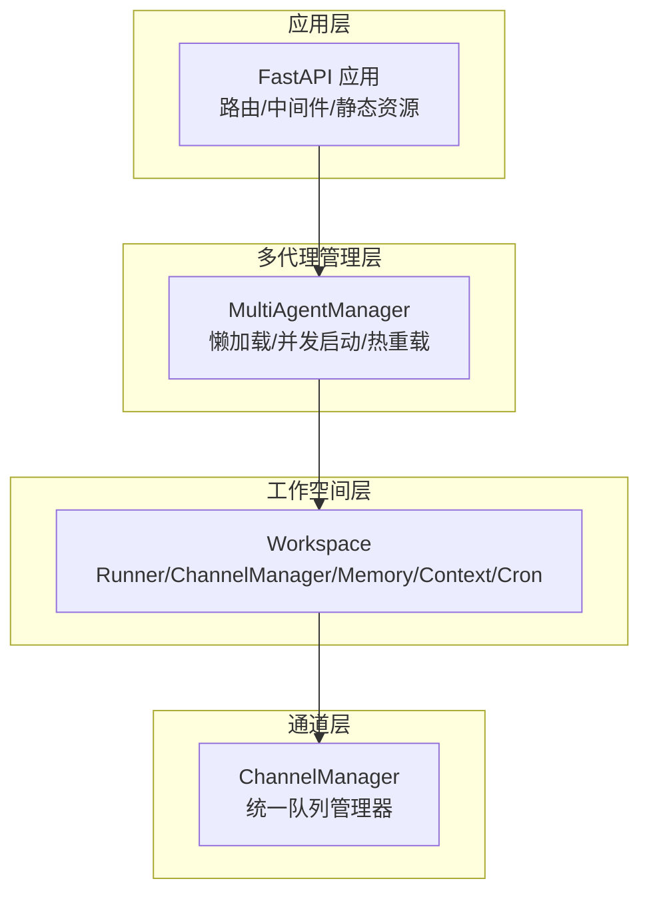
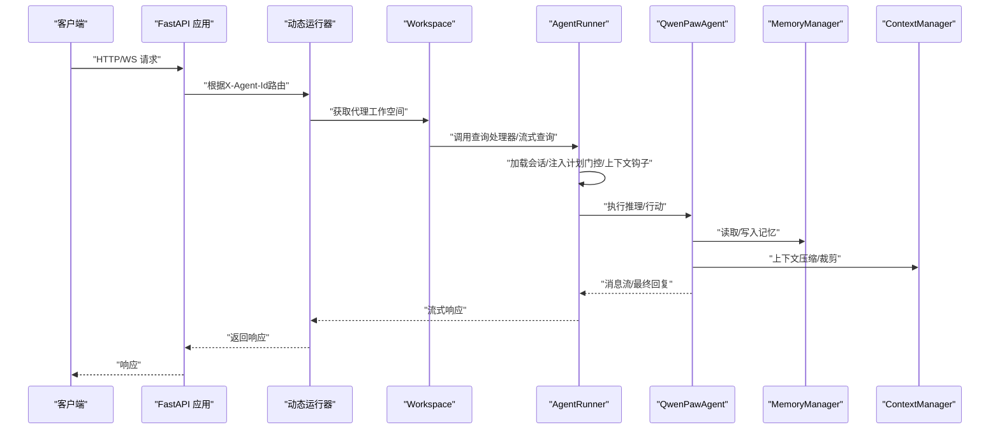
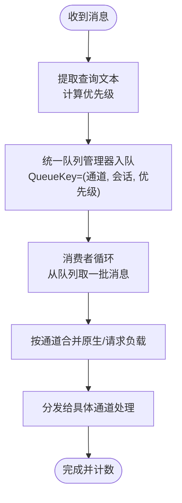
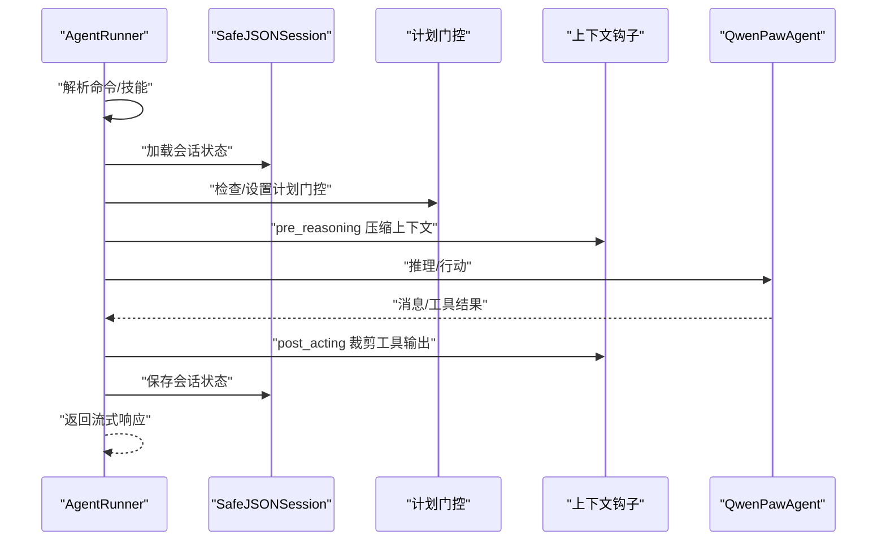
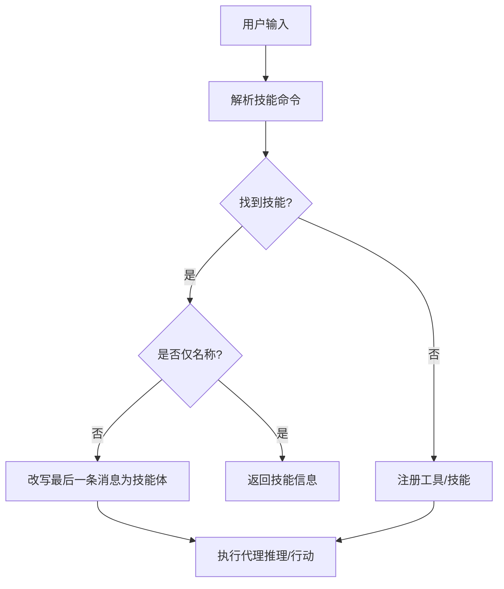
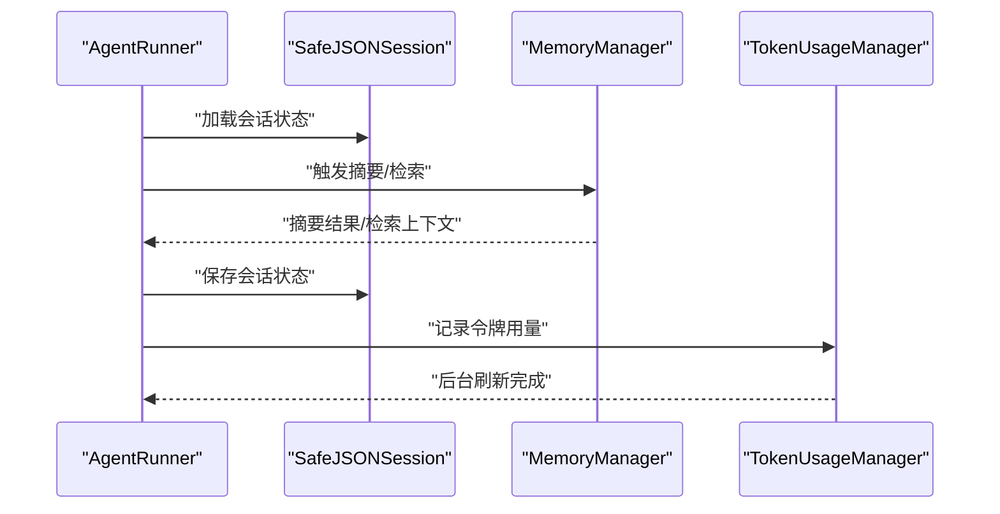
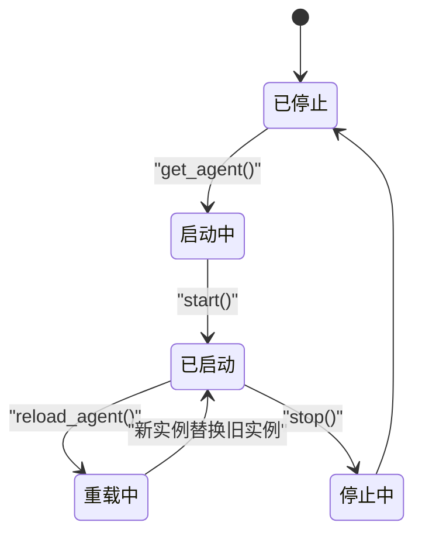
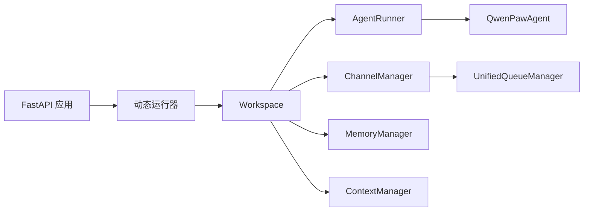

# 数据流架构

<cite>
**本文引用的文件**
- [src/qwenpaw/app/_app.py](file://src/qwenpaw/app/_app.py)
- [src/qwenpaw/app/runner/runner.py](file://src/qwenpaw/app/runner/runner.py)
- [src/qwenpaw/app/multi_agent_manager.py](file://src/qwenpaw/app/multi_agent_manager.py)
- [src/qwenpaw/app/workspace/workspace.py](file://src/qwenpaw/app/workspace/workspace.py)
- [src/qwenpaw/app/channels/manager.py](file://src/qwenpaw/app/channels/manager.py)
- [src/qwenpaw/app/channels/unified_queue_manager.py](file://src/qwenpaw/app/channels/unified_queue_manager.py)
- [src/qwenpaw/agents/react_agent.py](file://src/qwenpaw/agents/react_agent.py)
- [src/qwenpaw/agents/memory/base_memory_manager.py](file://src/qwenpaw/agents/memory/base_memory_manager.py)
- [src/qwenpaw/agents/context/base_context_manager.py](file://src/qwenpaw/agents/context/base_context_manager.py)
- [src/qwenpaw/app/runner/session.py](file://src/qwenpaw/app/runner/session.py)
- [src/qwenpaw/token_usage/manager.py](file://src/qwenpaw/token_usage/manager.py)
</cite>

## 目录
1. [简介](#简介)
2. [项目结构](#项目结构)
3. [核心组件](#核心组件)
4. [架构总览](#架构总览)
5. [详细组件分析](#详细组件分析)
6. [依赖分析](#依赖分析)
7. [性能考虑](#性能考虑)
8. [故障排查指南](#故障排查指南)
9. [结论](#结论)
10. [附录](#附录)

## 简介
本文件面向QwenPaw的数据流架构，系统性梳理从请求进入、消息处理、代理执行、技能调用到数据持久化的完整链路，重点说明：
- 请求与消息在多通道、多会话、多优先级下的排队与消费机制
- 代理运行器如何组织工具、技能、上下文与记忆
- 会话状态与计划门控、任务跟踪与零停机热重载
- 异步数据处理、事件驱动与消息队列的使用
- 缓存策略、内存管理、并发控制与数据一致性保障

## 项目结构
QwenPaw采用“工作空间（Workspace）+ 多代理管理（MultiAgentManager）+ 应用入口（FastAPI）”三层结构：
- 应用层：FastAPI应用负责路由、中间件与静态资源，动态选择工作空间运行器
- 工作空间层：封装Runner、ChannelManager、MemoryManager、ContextManager、CronManager等服务
- 多代理管理层：按需加载、并发启动、零停机热重载单个代理实例
- 通道层：统一队列管理器对不同通道/会话/优先级进行隔离与串行化

图表来源
- [src/qwenpaw/app/_app.py:210-217](file://src/qwenpaw/app/_app.py#L210-L217)
- [src/qwenpaw/app/multi_agent_manager.py:42-127](file://src/qwenpaw/app/multi_agent_manager.py#L42-L127)
- [src/qwenpaw/app/workspace/workspace.py:38-118](file://src/qwenpaw/app/workspace/workspace.py#L38-L118)
- [src/qwenpaw/app/channels/manager.py:68-110](file://src/qwenpaw/app/channels/manager.py#L68-L110)

章节来源
- [src/qwenpaw/app/_app.py:210-217](file://src/qwenpaw/app/_app.py#L210-L217)
- [src/qwenpaw/app/multi_agent_manager.py:42-127](file://src/qwenpaw/app/multi_agent_manager.py#L42-L127)
- [src/qwenpaw/app/workspace/workspace.py:38-118](file://src/qwenpaw/app/workspace/workspace.py#L38-L118)
- [src/qwenpaw/app/channels/manager.py:68-110](file://src/qwenpaw/app/channels/manager.py#L68-L110)

## 核心组件
- 动态运行器（DynamicMultiAgentRunner）：根据请求头选择具体代理的工作空间，并代理流式查询与查询处理器
- 代理运行器（AgentRunner）：解析命令/技能、注入计划门控、加载会话状态、调用QwenPawAgent执行
- QwenPawAgent：基于ReActAgent，集成工具、技能、内存与上下文钩子
- 通道管理器（ChannelManager）：统一入队、批量合并、按通道/会话/优先级分发
- 统一队列管理器（UnifiedQueueManager）：按QueueKey（通道, 会话, 优先级）创建消费者，支持自动清理空闲队列
- 工作空间（Workspace）：服务编排容器，注册Runner、Memory/Context、Channel、Cron等服务
- 多代理管理器（MultiAgentManager）：懒加载、并发启动、零停机热重载
- 会话（SafeJSONSession）：跨平台安全文件名、异步I/O、容错加载
- 记忆管理器抽象（BaseMemoryManager）：后台摘要任务、检索接口
- 上下文管理器抽象（BaseContextManager）：预推理压缩、后工具裁剪、上下文钩子
- 令牌用量管理器（TokenUsageManager）：缓冲区聚合、后台刷新、汇总查询

章节来源
- [src/qwenpaw/app/_app.py:73-208](file://src/qwenpaw/app/_app.py#L73-L208)
- [src/qwenpaw/app/runner/runner.py:109-800](file://src/qwenpaw/app/runner/runner.py#L109-L800)
- [src/qwenpaw/agents/react_agent.py:80-800](file://src/qwenpaw/agents/react_agent.py#L80-L800)
- [src/qwenpaw/app/channels/manager.py:68-110](file://src/qwenpaw/app/channels/manager.py#L68-L110)
- [src/qwenpaw/app/channels/unified_queue_manager.py:60-118](file://src/qwenpaw/app/channels/unified_queue_manager.py#L60-L118)
- [src/qwenpaw/app/workspace/workspace.py:38-118](file://src/qwenpaw/app/workspace/workspace.py#L38-L118)
- [src/qwenpaw/app/multi_agent_manager.py:22-127](file://src/qwenpaw/app/multi_agent_manager.py#L22-L127)
- [src/qwenpaw/app/runner/session.py:196-469](file://src/qwenpaw/app/runner/session.py#L196-L469)
- [src/qwenpaw/agents/memory/base_memory_manager.py:18-181](file://src/qwenpaw/agents/memory/base_memory_manager.py#L18-L181)
- [src/qwenpaw/agents/context/base_context_manager.py:15-81](file://src/qwenpaw/agents/context/base_context_manager.py#L15-L81)
- [src/qwenpaw/token_usage/manager.py:61-136](file://src/qwenpaw/token_usage/manager.py#L61-L136)

## 架构总览
QwenPaw采用事件驱动与异步数据流：
- 入口通过FastAPI接收请求，动态路由至对应代理的工作空间
- 通道层将消息入队，统一队列管理器按QueueKey串行消费，支持批合并
- 运行器加载会话状态、注入计划门控与上下文钩子，调用代理执行
- 代理通过工具与技能扩展能力，记忆与上下文管理器参与上下文压缩与检索
- 令牌用量、会话状态、聊天记录等持久化到磁盘，具备跨平台文件名兼容与容错

图表来源
- [src/qwenpaw/app/_app.py:88-170](file://src/qwenpaw/app/_app.py#L88-L170)
- [src/qwenpaw/app/runner/runner.py:304-762](file://src/qwenpaw/app/runner/runner.py#L304-L762)
- [src/qwenpaw/agents/react_agent.py:80-800](file://src/qwenpaw/agents/react_agent.py#L80-L800)
- [src/qwenpaw/agents/memory/base_memory_manager.py:66-76](file://src/qwenpaw/agents/memory/base_memory_manager.py#L66-L76)
- [src/qwenpaw/agents/context/base_context_manager.py:82-176](file://src/qwenpaw/agents/context/base_context_manager.py#L82-L176)

## 详细组件分析

### 消息处理流程（通道与队列）
- 入队与优先级：通道管理器根据命令注册表提取查询文本，计算优先级，再由统一队列管理器入队
- 队列键与串行化：QueueKey=(通道, 会话, 优先级)，同一键严格串行；不同键并发
- 批量合并：消费者循环从队列取出一批消息，按通道实现合并逻辑后再处理
- 自动清理：空闲队列定时清理，避免资源泄漏

图表来源
- [src/qwenpaw/app/channels/manager.py:258-351](file://src/qwenpaw/app/channels/manager.py#L258-L351)
- [src/qwenpaw/app/channels/unified_queue_manager.py:119-164](file://src/qwenpaw/app/channels/unified_queue_manager.py#L119-L164)
- [src/qwenpaw/app/channels/unified_queue_manager.py:214-273](file://src/qwenpaw/app/channels/unified_queue_manager.py#L214-L273)

章节来源
- [src/qwenpaw/app/channels/manager.py:39-66](file://src/qwenpaw/app/channels/manager.py#L39-L66)
- [src/qwenpaw/app/channels/manager.py:258-351](file://src/qwenpaw/app/channels/manager.py#L258-L351)
- [src/qwenpaw/app/channels/unified_queue_manager.py:60-118](file://src/qwenpaw/app/channels/unified_queue_manager.py#L60-L118)
- [src/qwenpaw/app/channels/unified_queue_manager.py:165-213](file://src/qwenpaw/app/channels/unified_queue_manager.py#L165-L213)

### 代理执行流程（Runner与Agent）
- 命令与技能解析：识别命令与技能调用，必要时短路返回技能信息或改写用户消息
- 计划门控：在计划工具调用前后设置门禁，防止非计划相关工具在计划未确认前执行
- 会话状态：加载/保存会话状态，确保重启/热重载后上下文连续
- 上下文钩子：在推理前压缩上下文，在行动后裁剪工具结果，避免上下文溢出
- 取消与中断：支持取消当前任务，自动拒绝待审批项，中断代理执行

图表来源
- [src/qwenpaw/app/runner/runner.py:170-278](file://src/qwenpaw/app/runner/runner.py#L170-L278)
- [src/qwenpaw/app/runner/runner.py:447-593](file://src/qwenpaw/app/runner/runner.py#L447-L593)
- [src/qwenpaw/app/runner/runner.py:694-724](file://src/qwenpaw/app/runner/runner.py#L694-L724)
- [src/qwenpaw/app/runner/runner.py:758-762](file://src/qwenpaw/app/runner/runner.py#L758-L762)
- [src/qwenpaw/app/runner/session.py:300-346](file://src/qwenpaw/app/runner/session.py#L300-L346)
- [src/qwenpaw/agents/context/base_context_manager.py:82-176](file://src/qwenpaw/agents/context/base_context_manager.py#L82-L176)

章节来源
- [src/qwenpaw/app/runner/runner.py:170-278](file://src/qwenpaw/app/runner/runner.py#L170-L278)
- [src/qwenpaw/app/runner/runner.py:447-593](file://src/qwenpaw/app/runner/runner.py#L447-L593)
- [src/qwenpaw/app/runner/runner.py:694-724](file://src/qwenpaw/app/runner/runner.py#L694-L724)
- [src/qwenpaw/app/runner/runner.py:758-762](file://src/qwenpaw/app/runner/runner.py#L758-L762)
- [src/qwenpaw/app/runner/session.py:300-346](file://src/qwenpaw/app/runner/session.py#L300-L346)
- [src/qwenpaw/agents/context/base_context_manager.py:82-176](file://src/qwenpaw/agents/context/base_context_manager.py#L82-L176)

### 技能调用流程（工具与技能）
- 技能解析：支持“/名称 输入”与“/[带空格名称] 输入”两种形式，按目录名匹配有效技能
- 技能信息：当仅提供名称不带输入时，返回技能描述短路
- 工具注册：内置工具与插件工具统一注册，支持异步执行与后台任务管理工具
- MCP客户端：支持HTTP/STDIO两类状态客户端，断线自动恢复与重建

图表来源
- [src/qwenpaw/app/runner/runner.py:170-278](file://src/qwenpaw/app/runner/runner.py#L170-L278)
- [src/qwenpaw/agents/react_agent.py:217-371](file://src/qwenpaw/agents/react_agent.py#L217-L371)
- [src/qwenpaw/agents/react_agent.py:515-581](file://src/qwenpaw/agents/react_agent.py#L515-L581)

章节来源
- [src/qwenpaw/app/runner/runner.py:170-278](file://src/qwenpaw/app/runner/runner.py#L170-L278)
- [src/qwenpaw/agents/react_agent.py:217-371](file://src/qwenpaw/agents/react_agent.py#L217-L371)
- [src/qwenpaw/agents/react_agent.py:515-581](file://src/qwenpaw/agents/react_agent.py#L515-L581)

### 数据持久化流程（会话、记忆、计划）
- 会话状态：安全文件名、异步读写、容错解析、迁移兼容（微信历史前缀）
- 记忆摘要：后台队列串行执行摘要任务，支持状态查询
- 计划门控：通过会话状态字典确保计划变更后下一回合仅允许文本推理
- 令牌用量：缓冲聚合、后台刷新、汇总查询

图表来源
- [src/qwenpaw/app/runner/session.py:300-346](file://src/qwenpaw/app/runner/session.py#L300-L346)
- [src/qwenpaw/agents/memory/base_memory_manager.py:182-234](file://src/qwenpaw/agents/memory/base_memory_manager.py#L182-L234)
- [src/qwenpaw/token_usage/manager.py:92-136](file://src/qwenpaw/token_usage/manager.py#L92-L136)

章节来源
- [src/qwenpaw/app/runner/session.py:196-469](file://src/qwenpaw/app/runner/session.py#L196-L469)
- [src/qwenpaw/agents/memory/base_memory_manager.py:18-181](file://src/qwenpaw/agents/memory/base_memory_manager.py#L18-L181)
- [src/qwenpaw/token_usage/manager.py:61-136](file://src/qwenpaw/token_usage/manager.py#L61-L136)

### 多代理与零停机热重载
- 懒加载：首次访问才创建工作空间，避免冷启动阻塞
- 并发启动：多代理同时初始化，锁仅用于关键字典操作
- 零停机重载：新实例完全启动后原子替换旧实例，若有活跃任务则延后清理

图表来源
- [src/qwenpaw/app/multi_agent_manager.py:42-127](file://src/qwenpaw/app/multi_agent_manager.py#L42-L127)
- [src/qwenpaw/app/multi_agent_manager.py:255-382](file://src/qwenpaw/app/multi_agent_manager.py#L255-L382)

章节来源
- [src/qwenpaw/app/multi_agent_manager.py:22-127](file://src/qwenpaw/app/multi_agent_manager.py#L22-L127)
- [src/qwenpaw/app/multi_agent_manager.py:255-382](file://src/qwenpaw/app/multi_agent_manager.py#L255-L382)

## 依赖分析
- 组件耦合
  - 应用层通过动态运行器解耦代理实例，运行器持有工作空间引用
  - 工作空间通过服务管理器注册Runner、Channel、Memory/Context、Cron等，降低模块间直接依赖
  - 通道层与统一队列管理器解耦具体通道实现，仅依赖统一接口
- 关键依赖链
  - FastAPI → DynamicMultiAgentRunner → Workspace → AgentRunner → QwenPawAgent
  - ChannelManager → UnifiedQueueManager → 各通道实现
  - Workspace → ServiceManager → 各服务工厂

图表来源
- [src/qwenpaw/app/_app.py:210-217](file://src/qwenpaw/app/_app.py#L210-L217)
- [src/qwenpaw/app/workspace/workspace.py:137-317](file://src/qwenpaw/app/workspace/workspace.py#L137-L317)
- [src/qwenpaw/app/channels/manager.py:68-110](file://src/qwenpaw/app/channels/manager.py#L68-L110)
- [src/qwenpaw/app/channels/unified_queue_manager.py:60-118](file://src/qwenpaw/app/channels/unified_queue_manager.py#L60-L118)

章节来源
- [src/qwenpaw/app/_app.py:210-217](file://src/qwenpaw/app/_app.py#L210-L217)
- [src/qwenpaw/app/workspace/workspace.py:137-317](file://src/qwenpaw/app/workspace/workspace.py#L137-L317)
- [src/qwenpaw/app/channels/manager.py:68-110](file://src/qwenpaw/app/channels/manager.py#L68-L110)
- [src/qwenpaw/app/channels/unified_queue_manager.py:60-118](file://src/qwenpaw/app/channels/unified_queue_manager.py#L60-L118)

## 性能考虑
- 异步I/O与非阻塞：会话状态、通道入队均采用异步文件I/O与线程安全回调，避免阻塞事件循环
- 并发与隔离：统一队列按QueueKey隔离，不同会话/优先级并发，减少争用
- 背景任务：记忆摘要、令牌用量刷新、清理任务均在后台执行，不影响主请求路径
- 缓存与压缩：上下文压缩、工具结果裁剪减少上下文占用，提升吞吐
- 零停机热重载：替换旧实例时保留活跃任务，最小化服务中断时间

## 故障排查指南
- 通道健康检查：通过ChannelManager的健康检查接口定位通道异常
- 队列堆积：通过统一队列管理器指标查看队列数量、积压与处理计数
- 会话文件损坏：SafeJSONSession具备容错解析，若损坏可回退为空状态并记录警告
- 取消与中断：运行器捕获取消异常，自动拒绝待审批并中断代理，确保一致性
- 令牌用量异常：TokenUsageManager后台刷新失败时会记录错误，可在汇总查询中观察差异

章节来源
- [src/qwenpaw/app/channels/manager.py:549-578](file://src/qwenpaw/app/channels/manager.py#L549-L578)
- [src/qwenpaw/app/channels/unified_queue_manager.py:430-471](file://src/qwenpaw/app/channels/unified_queue_manager.py#L430-L471)
- [src/qwenpaw/app/runner/session.py:25-62](file://src/qwenpaw/app/runner/session.py#L25-L62)
- [src/qwenpaw/app/runner/runner.py:764-791](file://src/qwenpaw/app/runner/runner.py#L764-L791)
- [src/qwenpaw/token_usage/manager.py:88-91](file://src/qwenpaw/token_usage/manager.py#L88-L91)

## 结论
QwenPaw以“工作空间+多代理管理+事件驱动队列”的架构实现了高并发、可扩展、可观测的数据流体系。通过严格的队列隔离、会话状态容错、上下文压缩与计划门控，系统在复杂交互场景下仍能保持稳定与一致。配合零停机热重载与后台任务，满足生产环境的可用性与可维护性要求。

## 附录
- 关键流程图与类图请参考上述各节的Mermaid示意图
- 若需进一步了解具体实现细节，请参阅相应文件的源码路径标注