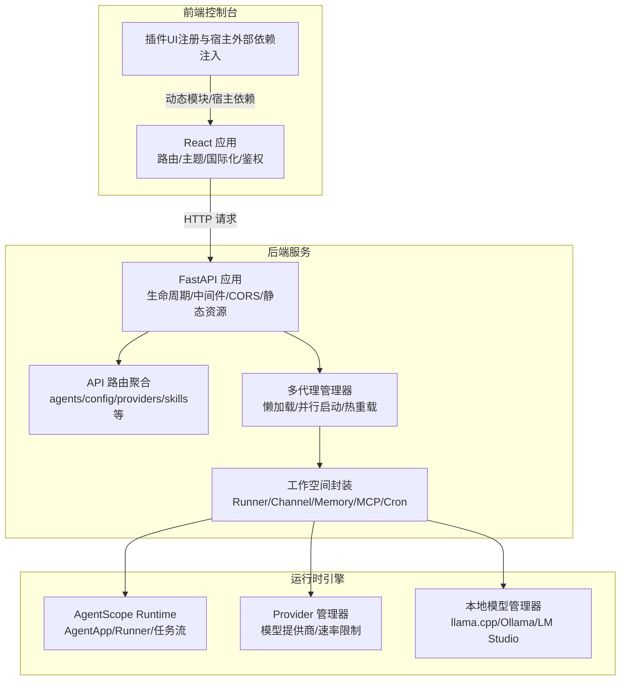
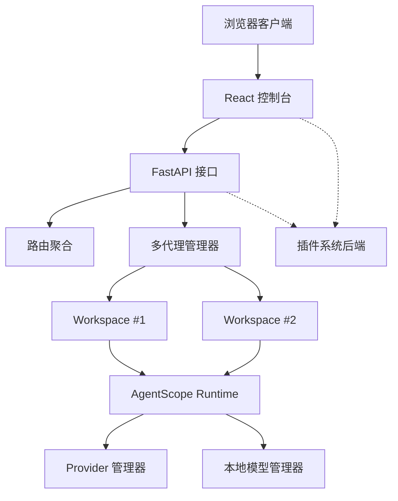
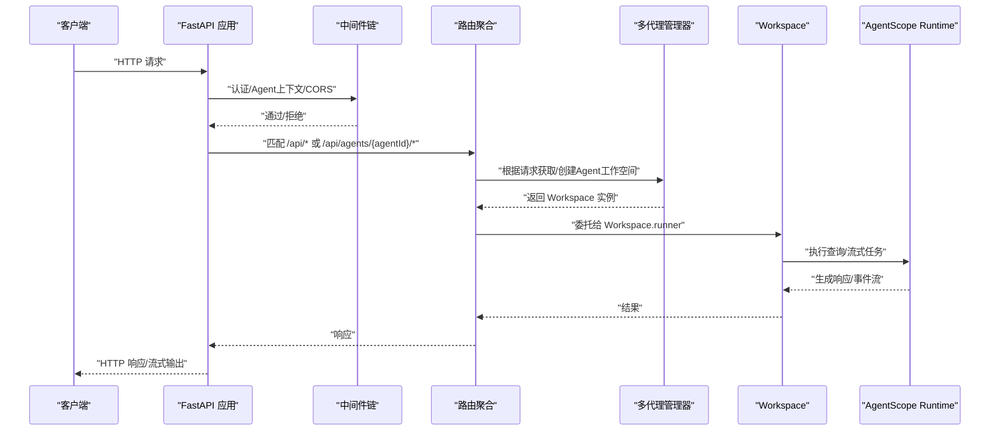
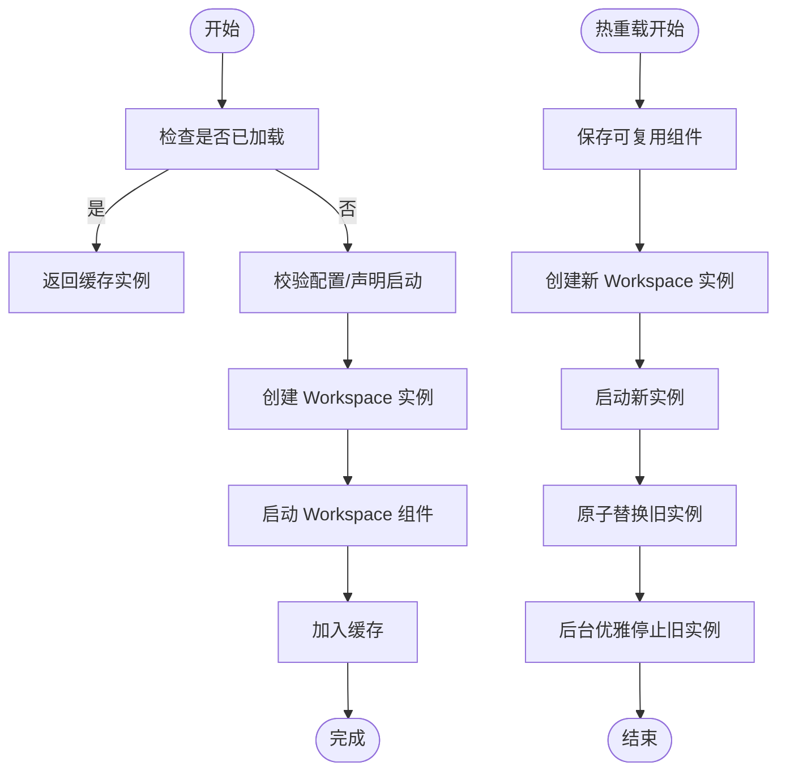
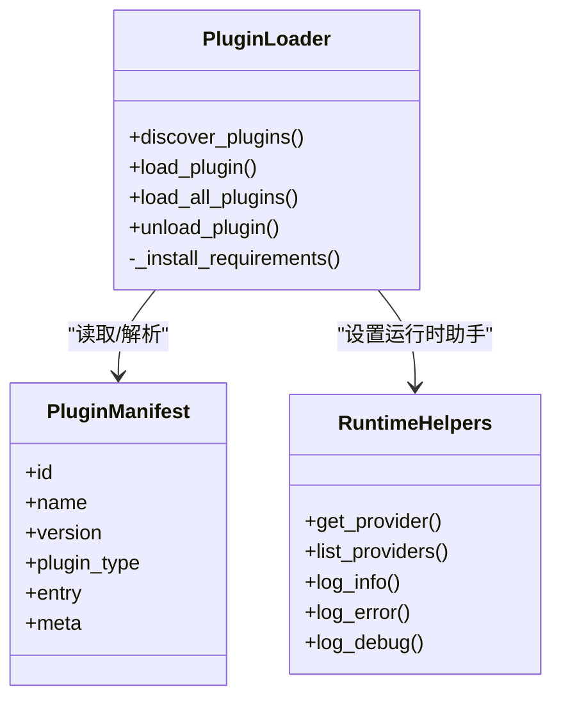
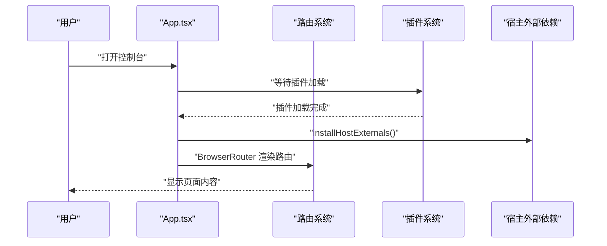
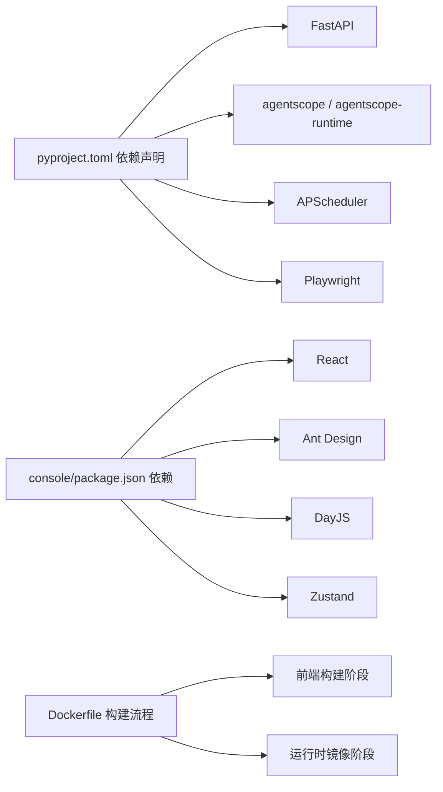

# 整体架构设计

<cite>
**本文档引用的文件**
- [README.md](file://README.md)
- [src/qwenpaw/__init__.py](file://src/qwenpaw/__init__.py)
- [src/qwenpaw/app/_app.py](file://src/qwenpaw/app/_app.py)
- [src/qwenpaw/app/routers/__init__.py](file://src/qwenpaw/app/routers/__init__.py)
- [src/qwenpaw/constant.py](file://src/qwenpaw/constant.py)
- [deploy/Dockerfile](file://deploy/Dockerfile)
- [src/qwenpaw/app/multi_agent_manager.py](file://src/qwenpaw/app/multi_agent_manager.py)
- [src/qwenpaw/plugins/architecture.py](file://src/qwenpaw/plugins/architecture.py)
- [src/qwenpaw/plugins/loader.py](file://src/qwenpaw/plugins/loader.py)
- [src/qwenpaw/plugins/runtime.py](file://src/qwenpaw/plugins/runtime.py)
- [src/qwenpaw/app/workspace/workspace.py](file://src/qwenpaw/app/workspace/workspace.py)
- [console/package.json](file://console/package.json)
- [console/src/App.tsx](file://console/src/App.tsx)
- [console/src/main.tsx](file://console/src/main.tsx)
- [pyproject.toml](file://pyproject.toml)
</cite>

## 目录
1. [引言](#引言)
2. [项目结构](#项目结构)
3. [核心组件](#核心组件)
4. [架构总览](#架构总览)
5. [详细组件分析](#详细组件分析)
6. [依赖关系分析](#依赖关系分析)
7. [性能考虑](#性能考虑)
8. [故障排查指南](#故障排查指南)
9. [结论](#结论)
10. [附录](#附录)

## 引言
本架构文档面向QwenPaw的整体设计，聚焦其“前后端分离 + 微服务化 + 多代理运行时 + 插件化”的系统架构。文档从系统边界、组件职责与依赖关系出发，结合FastAPI后端框架、React前端架构以及AgentScope Runtime的集成方式，系统阐述了核心设计理念、技术决策与性能优化策略，并通过多种架构图展示各层组织结构与数据流。

## 项目结构
QwenPaw采用典型的三层架构：前端控制台（React）、后端服务（FastAPI）、运行时引擎（AgentScope Runtime）。项目以Python包形式分发，内置构建好的前端静态资源；同时提供Docker镜像打包方案，支持容器化部署。

**图表来源**
- [src/qwenpaw/app/_app.py:547-719](file://src/qwenpaw/app/_app.py#L547-L719)
- [src/qwenpaw/app/routers/__init__.py:1-69](file://src/qwenpaw/app/routers/__init__.py#L1-L69)
- [src/qwenpaw/app/multi_agent_manager.py:22-537](file://src/qwenpaw/app/multi_agent_manager.py#L22-L537)
- [src/qwenpaw/app/workspace/workspace.py:38-467](file://src/qwenpaw/app/workspace/workspace.py#L38-L467)

**章节来源**
- [README.md:118-133](file://README.md#L118-L133)
- [deploy/Dockerfile:1-105](file://deploy/Dockerfile#L1-L105)
- [pyproject.toml:1-152](file://pyproject.toml#L1-L152)

## 核心组件
- 后端应用与生命周期
  - FastAPI应用负责路由注册、中间件装配、静态资源托管与SPA回退；通过lifespan实现启动/关闭阶段的后台初始化与清理。
- 多代理运行时
  - MultiAgentManager提供按需懒加载、并发启动、零停机热重载能力；每个Agent在独立Workspace中运行，拥有独立Runner、Channel、Memory、MCP、Cron等组件。
- 插件系统
  - 插件通过manifest声明类型（工具/提供方/钩子/命令/前端），支持动态发现、安装依赖、注册到后端与前端；提供RuntimeHelpers访问Provider等运行时能力。
- 前端控制台
  - React应用基于BrowserRouter，提供主题、国际化、鉴权守卫与页面布局；通过宿主外部依赖注入与动态模块注册，支持插件UI扩展。

**章节来源**
- [src/qwenpaw/app/_app.py:220-546](file://src/qwenpaw/app/_app.py#L220-L546)
- [src/qwenpaw/app/multi_agent_manager.py:22-537](file://src/qwenpaw/app/multi_agent_manager.py#L22-L537)
- [src/qwenpaw/app/workspace/workspace.py:38-467](file://src/qwenpaw/app/workspace/workspace.py#L38-L467)
- [src/qwenpaw/plugins/loader.py:23-628](file://src/qwenpaw/plugins/loader.py#L23-L628)
- [src/qwenpaw/plugins/architecture.py:10-142](file://src/qwenpaw/plugins/architecture.py#L10-L142)
- [console/src/App.tsx:1-227](file://console/src/App.tsx#L1-L227)
- [console/src/main.tsx:1-41](file://console/src/main.tsx#L1-L41)

## 架构总览
QwenPaw采用“单体后端 + 多代理工作空间 + 插件化扩展”的混合架构。后端以FastAPI为核心，统一暴露REST接口与AgentApp路由；每个Agent在Workspace内形成独立运行单元，共享Provider与本地模型能力；前端通过React控制台提供统一入口与插件UI扩展点。

**图表来源**
- [src/qwenpaw/app/_app.py:646-719](file://src/qwenpaw/app/_app.py#L646-L719)
- [src/qwenpaw/app/multi_agent_manager.py:42-137](file://src/qwenpaw/app/multi_agent_manager.py#L42-L137)
- [src/qwenpaw/app/workspace/workspace.py:38-351](file://src/qwenpaw/app/workspace/workspace.py#L38-L351)
- [src/qwenpaw/plugins/loader.py:240-262](file://src/qwenpaw/plugins/loader.py#L240-L262)

## 详细组件分析

### 后端应用与路由体系
- 应用初始化
  - FastAPI实例配置CORS、认证中间件、Agent上下文中间件；在lifespan中完成环境变量加载、迁移、后台启动（插件加载、Provider/本地模型启动、TokenUsage后台任务）。
- 路由组织
  - 路由器聚合模块化API（agents/config/providers/skills/tools/workspace/envs/mcp等），并通过Agent作用域路由支持多代理请求路由。
- 静态资源与SPA
  - 动态解析控制台静态目录，挂载assets与SPA回退，确保前端路由与后端API不冲突。

**图表来源**
- [src/qwenpaw/app/_app.py:547-719](file://src/qwenpaw/app/_app.py#L547-L719)
- [src/qwenpaw/app/routers/__init__.py:1-69](file://src/qwenpaw/app/routers/__init__.py#L1-L69)
- [src/qwenpaw/app/multi_agent_manager.py:42-137](file://src/qwenpaw/app/multi_agent_manager.py#L42-L137)
- [src/qwenpaw/app/workspace/workspace.py:351-392](file://src/qwenpaw/app/workspace/workspace.py#L351-L392)

**章节来源**
- [src/qwenpaw/app/_app.py:220-546](file://src/qwenpaw/app/_app.py#L220-L546)
- [src/qwenpaw/app/routers/__init__.py:1-69](file://src/qwenpaw/app/routers/__init__.py#L1-L69)

### 多代理运行时与零停机热重载
- 懒加载与并发启动
  - MultiAgentManager对Agent进行懒加载与并发启动，避免阻塞；首次请求才创建Workspace，随后并行启动多个Agent。
- 零停机热重载
  - 通过原子替换旧实例与后台延迟清理策略，在新实例完全就绪后平滑切换，保证流式/长连接任务不中断。
- 工作空间封装
  - Workspace以ServiceManager统一管理Runner、Memory、Context、MCP、Channel、Cron等组件，支持可复用组件的热重载。

**图表来源**
- [src/qwenpaw/app/multi_agent_manager.py:42-382](file://src/qwenpaw/app/multi_agent_manager.py#L42-L382)
- [src/qwenpaw/app/workspace/workspace.py:318-392](file://src/qwenpaw/app/workspace/workspace.py#L318-L392)

**章节来源**
- [src/qwenpaw/app/multi_agent_manager.py:22-537](file://src/qwenpaw/app/multi_agent_manager.py#L22-L537)
- [src/qwenpaw/app/workspace/workspace.py:38-467](file://src/qwenpaw/app/workspace/workspace.py#L38-L467)

### 插件化架构与运行时集成
- 插件类型与清单
  - 支持工具、提供方、钩子、命令、前端等类型；通过plugin.json声明元数据与入口点。
- 动态加载与依赖安装
  - 发现插件目录中的plugin.json，动态导入后端模块，调用register方法注册；必要时安装requirements.txt依赖。
- 运行时辅助
  - RuntimeHelpers提供Provider查询、日志等能力，供插件在运行期使用。

**图表来源**
- [src/qwenpaw/plugins/architecture.py:44-142](file://src/qwenpaw/plugins/architecture.py#L44-L142)
- [src/qwenpaw/plugins/loader.py:23-262](file://src/qwenpaw/plugins/loader.py#L23-L262)
- [src/qwenpaw/plugins/runtime.py:10-68](file://src/qwenpaw/plugins/runtime.py#L10-L68)

**章节来源**
- [src/qwenpaw/plugins/architecture.py:10-142](file://src/qwenpaw/plugins/architecture.py#L10-L142)
- [src/qwenpaw/plugins/loader.py:240-486](file://src/qwenpaw/plugins/loader.py#L240-L486)
- [src/qwenpaw/plugins/runtime.py:10-68](file://src/qwenpaw/plugins/runtime.py#L10-L68)

### 前端控制台与插件UI扩展
- 应用入口
  - 主应用通过ThemeProvider与PluginProvider提供主题与插件上下文；AppInner根据语言与主题配置渲染路由。
- 鉴权与路由守卫
  - AuthGuard在加载时验证登录状态，未登录则跳转至登录页。
- 宿主外部依赖与动态模块
  - installHostExternals将React/antd等注入window，供插件UI直接使用；registerHostModulesEager预注册页面模块，减少运行时开销。

**图表来源**
- [console/src/App.tsx:123-214](file://console/src/App.tsx#L123-L214)
- [console/src/main.tsx:1-41](file://console/src/main.tsx#L1-L41)

**章节来源**
- [console/src/App.tsx:1-227](file://console/src/App.tsx#L1-L227)
- [console/src/main.tsx:1-41](file://console/src/main.tsx#L1-L41)
- [console/package.json:1-79](file://console/package.json#L1-L79)

## 依赖关系分析
- 后端依赖
  - 使用agentscope与agentscope-runtime作为核心运行时框架；集成Uvicorn、FastAPI、APScheduler、Playwright等；通过pyproject.toml声明依赖与可选特性。
- 前端依赖
  - React 18、Ant Design、i18n、Mermaid、Zustand等；构建脚本通过Vite与TypeScript。
- 部署与容器化
  - Dockerfile分两阶段构建：前端构建与运行时镜像；Supervisor管理进程；通过环境变量控制通道启用/禁用、日志级别等。

**图表来源**
- [pyproject.toml:1-152](file://pyproject.toml#L1-L152)
- [console/package.json:1-79](file://console/package.json#L1-L79)
- [deploy/Dockerfile:1-105](file://deploy/Dockerfile#L1-L105)

**章节来源**
- [pyproject.toml:1-152](file://pyproject.toml#L1-L152)
- [console/package.json:1-79](file://console/package.json#L1-L79)
- [deploy/Dockerfile:1-105](file://deploy/Dockerfile#L1-L105)

## 性能考虑
- 启动性能
  - FastAPI应用在lifespan中分阶段初始化：同步快速路径与异步后台路径；后台启动任务在应用Ready后继续，缩短首包响应时间。
- 并发与限流
  - LLM并发与QPM限制通过环境变量配置；提供速率限制暂停与抖动参数，避免突发流量导致429。
- 内存与磁盘
  - 内存压缩比例与保留最近条目数可配置；备份/媒体/模型目录位置可自定义，便于资源隔离。
- 浏览器与渲染
  - 前端通过Suspense与懒加载减少首屏负担；Mermaid等组件按需渲染。

[本节为通用性能建议，无需特定文件引用]

## 故障排查指南
- 启动失败
  - 检查restore artifact清理、telemetry收集、配置迁移与默认Agent创建是否成功；查看应用日志定位异常。
- 插件问题
  - 确认plugin.json存在且格式正确；检查requirements.txt安装是否成功；查看插件注册与卸载过程的日志。
- 多代理相关
  - 若Agent未找到或启动失败，检查配置文件中的agent profiles；关注MultiAgentManager的并发启动与错误传播。
- 停机与清理
  - 关闭时会执行插件shutdown hooks、停止本地模型服务器、停止所有Agent与TaskTracker、关闭浏览器实例；若出现卡顿，检查是否有活动任务未完成。

**章节来源**
- [src/qwenpaw/app/_app.py:220-546](file://src/qwenpaw/app/_app.py#L220-L546)
- [src/qwenpaw/plugins/loader.py:487-560](file://src/qwenpaw/plugins/loader.py#L487-L560)
- [src/qwenpaw/app/multi_agent_manager.py:138-234](file://src/qwenpaw/app/multi_agent_manager.py#L138-L234)

## 结论
QwenPaw通过“前后端分离 + 微服务化 + 多代理运行时 + 插件化”的架构设计，实现了高可用、可扩展与易维护的个人智能助理平台。后端以FastAPI为核心，配合AgentScope Runtime与多代理管理器，提供稳定的任务处理与流式能力；前端React控制台与插件系统共同构成开放的用户体验扩展面。该架构在部署、安全、性能与可观测性方面均具备良好工程实践基础。

[本节为总结性内容，无需特定文件引用]

## 附录
- 系统边界
  - 后端：提供REST API、AgentApp路由、多代理管理与静态资源；不直接处理业务逻辑，交由Workspace与Runtime。
  - 前端：控制台界面、国际化、主题、鉴权与插件UI；不直接访问后端数据库，仅通过HTTP接口交互。
  - 插件：后端插件扩展工具/提供方/钩子/命令；前端插件扩展UI模块。
- 关键环境变量
  - 日志级别、容器运行标记、CORS来源、内存压缩参数、LLM并发与QPM限制、工具守卫超时等，详见常量与配置模块。

**章节来源**
- [src/qwenpaw/constant.py:195-368](file://src/qwenpaw/constant.py#L195-L368)
- [src/qwenpaw/app/_app.py:547-719](file://src/qwenpaw/app/_app.py#L547-L719)