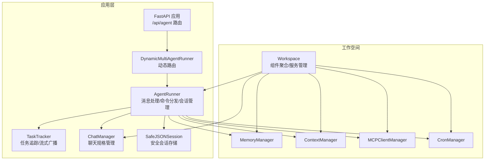
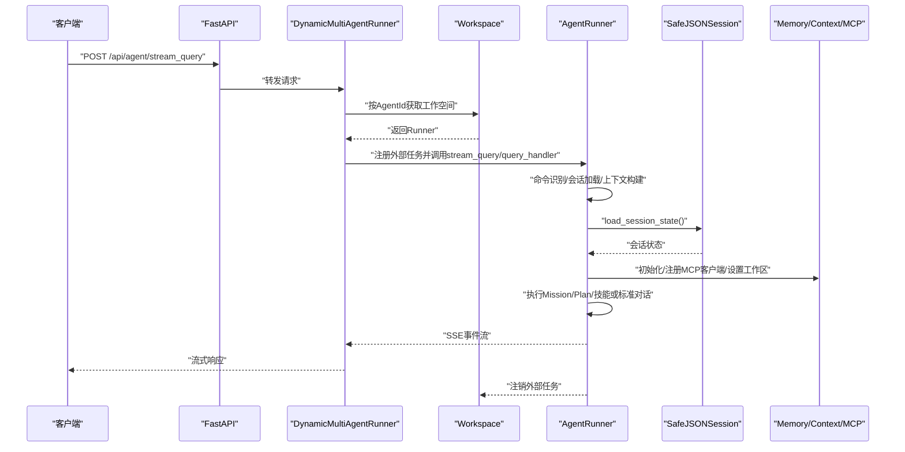
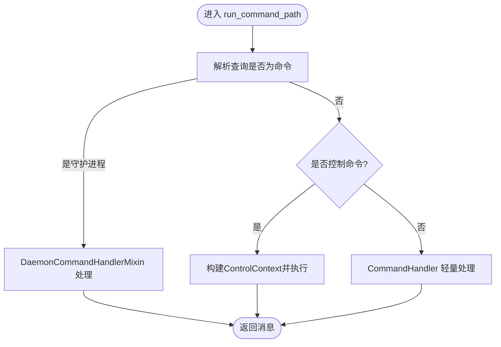
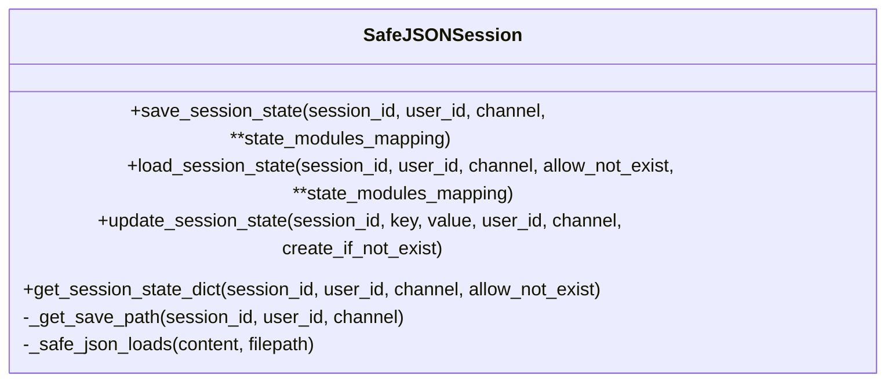
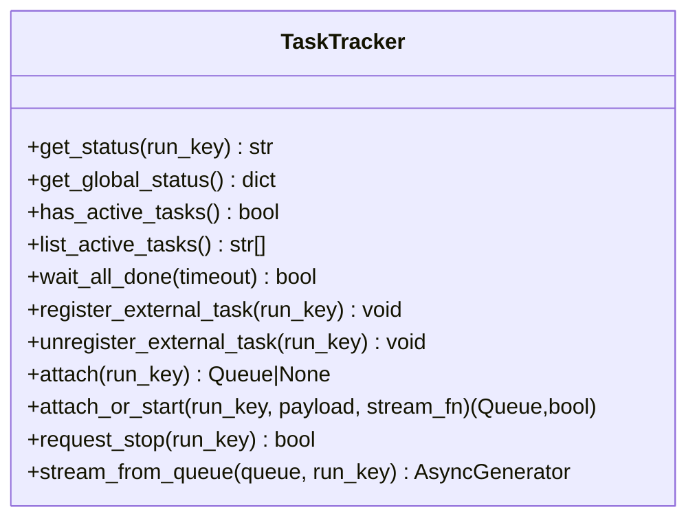
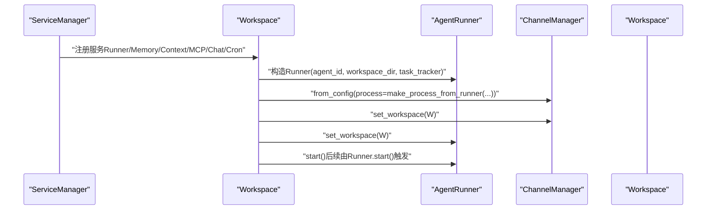
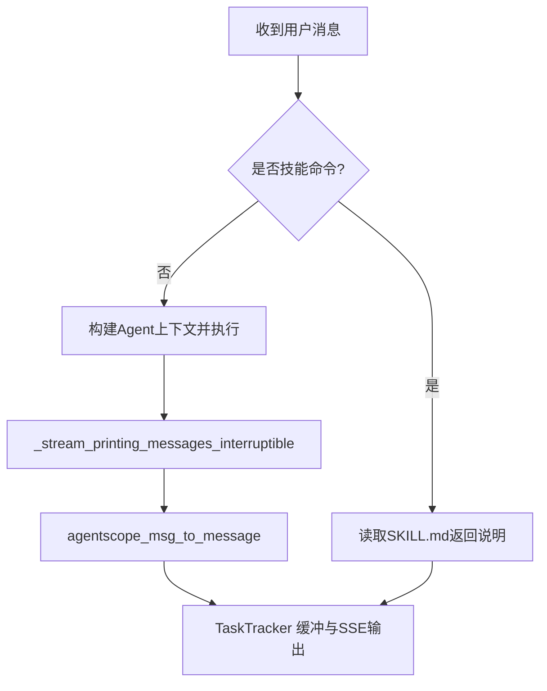
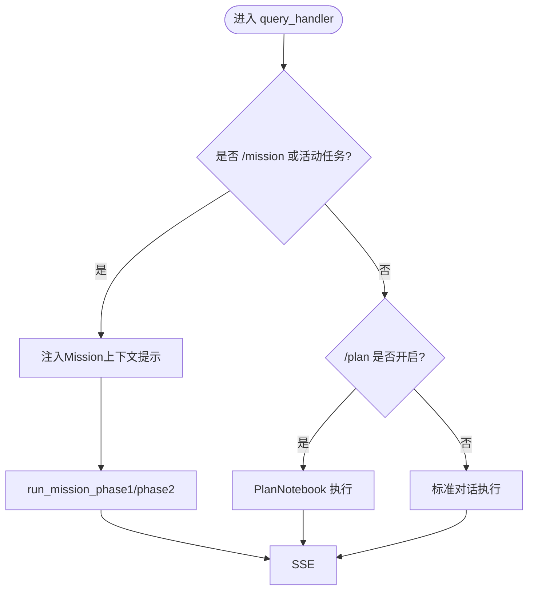
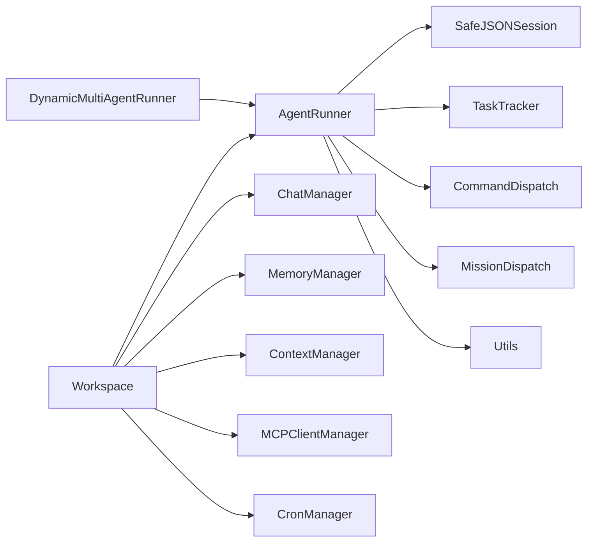

# 代理运行器

<cite>
**本文引用的文件**
- [runner.py](file://src/qwenpaw/app/runner/runner.py)
- [session.py](file://src/qwenpaw/app/runner/session.py)
- [task_tracker.py](file://src/qwenpaw/app/runner/task_tracker.py)
- [models.py](file://src/qwenpaw/app/runner/models.py)
- [manager.py](file://src/qwenpaw/app/runner/manager.py)
- [command_dispatch.py](file://src/qwenpaw/app/runner/command_dispatch.py)
- [mission_dispatch.py](file://src/qwenpaw/app/runner/mission_dispatch.py)
- [utils.py](file://src/qwenpaw/app/runner/utils.py)
- [workspace.py](file://src/qwenpaw/app/workspace/workspace.py)
- [_app.py](file://src/qwenpaw/app/_app.py)
- [service_factories.py](file://src/qwenpaw/app/workspace/service_factories.py)
- [executor.py](file://src/qwenpaw/app/crons/executor.py)
</cite>

## 目录
1. [简介](#简介)
2. [项目结构](#项目结构)
3. [核心组件](#核心组件)
4. [架构总览](#架构总览)
5. [详细组件分析](#详细组件分析)
6. [依赖分析](#依赖分析)
7. [性能考虑](#性能考虑)
8. [故障排查指南](#故障排查指南)
9. [结论](#结论)
10. [附录](#附录)

## 简介
本文件面向“代理运行器（AgentRunner）”的技术文档，系统性阐述其消息处理机制、会话管理、任务调度、启动流程、消息路由、技能执行与响应生成、会话状态管理、任务跟踪、错误恢复策略、与工作空间的集成、并发处理模型、性能监控与调试支持，并提供配置示例与扩展开发指导。目标读者包括后端工程师、平台集成者与高级用户。

## 项目结构
AgentRunner位于应用层运行时子系统中，负责接收请求、解析命令、加载会话状态、构建Agent上下文、执行技能或标准对话流程，并通过统一的流式接口返回结果。其与工作空间（Workspace）紧密耦合：每个工作空间包含独立的Runner、ChannelManager、MemoryManager、MCPClientManager、CronManager等组件；动态多代理运行器（DynamicMultiAgentRunner）在FastAPI生命周期内按请求路由到对应工作空间的Runner。

图示来源
- [_app.py:72-205](file://src/qwenpaw/app/_app.py#L72-L205)
- [runner.py:109-168](file://src/qwenpaw/app/runner/runner.py#L109-L168)
- [workspace.py:38-119](file://src/qwenpaw/app/workspace/workspace.py#L38-L119)

章节来源
- [_app.py:72-205](file://src/qwenpaw/app/_app.py#L72-L205)
- [workspace.py:38-119](file://src/qwenpaw/app/workspace/workspace.py#L38-L119)

## 核心组件
- AgentRunner：消息入口与处理中枢，负责命令识别、会话加载、Agent实例化、任务追踪、错误转换与取消处理。
- SafeJSONSession：跨平台安全的JSON会话存储，异步读写，具备容错与迁移能力。
- TaskTracker：后台任务与外部任务注册、订阅、缓冲与停止控制，支持SSE事件流。
- ChatManager：聊天规格（ChatSpec）持久化与查询，自动注册会话对应的聊天记录。
- CommandDispatch：命令路径解析与执行，覆盖守护进程命令、控制命令与会话命令。
- MissionDispatch：Mission模式命令检测与活动任务注入，驱动阶段化执行。
- Utils：环境上下文构建、消息格式转换、媒体内容解析等工具。
- Workspace：工作空间聚合器，统一管理Runner与各子系统，提供服务注册与生命周期管理。
- 动态多代理运行器：根据请求头选择Agent并进行任务注册，确保优雅重启期间可感知后台任务。

章节来源
- [runner.py:109-168](file://src/qwenpaw/app/runner/runner.py#L109-L168)
- [session.py:196-270](file://src/qwenpaw/app/runner/session.py#L196-L270)
- [task_tracker.py:37-110](file://src/qwenpaw/app/runner/task_tracker.py#L37-L110)
- [manager.py:17-41](file://src/qwenpaw/app/runner/manager.py#L17-L41)
- [command_dispatch.py:87-152](file://src/qwenpaw/app/runner/command_dispatch.py#L87-L152)
- [mission_dispatch.py:33-73](file://src/qwenpaw/app/runner/mission_dispatch.py#L33-L73)
- [utils.py:32-108](file://src/qwenpaw/app/runner/utils.py#L32-L108)
- [workspace.py:38-119](file://src/qwenpaw/app/workspace/workspace.py#L38-L119)
- [_app.py:72-205](file://src/qwenpaw/app/_app.py#L72-L205)

## 架构总览
AgentRunner采用“请求-命令-执行-响应”的流水线架构：
- 请求进入：DynamicMultiAgentRunner按AgentId路由至对应Workspace的Runner。
- 命令优先：识别守护进程命令、控制命令与会话命令，分别走不同分支。
- 会话与计划：加载/预热会话状态，注入Mission/Plan上下文提示。
- 执行：构建Agent上下文（内存、上下文、MCP客户端、工作区目录），执行技能或标准对话。
- 响应：通过TaskTracker进行SSE事件流输出，支持重连与缓冲。
- 错误与取消：捕获异常并转换，支持任务取消与审批自动拒绝。

图示来源
- [_app.py:128-194](file://src/qwenpaw/app/_app.py#L128-L194)
- [runner.py:304-800](file://src/qwenpaw/app/runner/runner.py#L304-L800)
- [session.py:300-346](file://src/qwenpaw/app/runner/session.py#L300-L346)
- [workspace.py:351-392](file://src/qwenpaw/app/workspace/workspace.py#L351-L392)

## 详细组件分析

### 消息处理与命令路由
- 命令判定优先级：守护进程命令 > 控制命令 > 会话命令；/plan <描述>不视为普通会话命令，而是激活Plan模式。
- 守护进程命令：通过DaemonCommandHandlerMixin处理，支持零停机重载与重启提示。
- 控制命令：需要工作空间注入，从ChannelManager获取通道实例，构建ControlContext并执行。
- 会话命令：轻量内存加载，交由CommandHandler处理，支持/compact、/new、/clear等。

图示来源
- [command_dispatch.py:73-85](file://src/qwenpaw/app/runner/command_dispatch.py#L73-L85)
- [command_dispatch.py:110-152](file://src/qwenpaw/app/runner/command_dispatch.py#L110-L152)
- [command_dispatch.py:154-248](file://src/qwenpaw/app/runner/command_dispatch.py#L154-L248)
- [command_dispatch.py:249-333](file://src/qwenpaw/app/runner/command_dispatch.py#L249-L333)

章节来源
- [command_dispatch.py:73-333](file://src/qwenpaw/app/runner/command_dispatch.py#L73-L333)

### 会话管理与状态持久化
- SafeJSONSession：对session_id/user_id/channel进行跨平台安全转义，异步读写，具备JSON损坏恢复与历史weixin->wechat迁移逻辑。
- 加载/保存/更新：load_session_state/load_state_dict、save_session_state/update_session_state/get_session_state_dict。
- 计划状态预热：在Mission/Plan模式下，确保plan_notebook键存在，避免TypeError/KeyError。

图示来源
- [session.py:196-469](file://src/qwenpaw/app/runner/session.py#L196-L469)

章节来源
- [session.py:196-469](file://src/qwenpaw/app/runner/session.py#L196-L469)

### 任务调度与流式输出
- TaskTracker：为每个run_key维护RunState（任务Future、队列列表、事件缓冲、时间戳），支持attach/attach_or_start/stream_from_queue，以及request_stop与外部任务注册/注销。
- DynamicMultiAgentRunner：在AgentApp中作为统一Runner，按请求注册外部任务，确保优雅重启期间可感知后台任务。

图示来源
- [task_tracker.py:37-350](file://src/qwenpaw/app/runner/task_tracker.py#L37-L350)
- [_app.py:128-194](file://src/qwenpaw/app/_app.py#L128-L194)

章节来源
- [task_tracker.py:37-350](file://src/qwenpaw/app/runner/task_tracker.py#L37-L350)
- [_app.py:128-194](file://src/qwenpaw/app/_app.py#L128-L194)

### 启动流程与工作空间集成
- Workspace：统一注册Runner、MemoryManager、ContextManager、MCPClientManager、ChatManager、CronManager等服务，按优先级顺序启动，支持热重载复用组件。
- ServiceFactories：在工作空间启动时注入ChannelManager与Workspace引用到Runner，便于控制命令处理。
- 启动迁移：启动前执行weixin->wechat数据迁移，保证会话与聊天文件布局一致。

图示来源
- [workspace.py:137-317](file://src/qwenpaw/app/workspace/workspace.py#L137-L317)
- [service_factories.py:93-108](file://src/qwenpaw/app/workspace/service_factories.py#L93-L108)

章节来源
- [workspace.py:137-317](file://src/qwenpaw/app/workspace/workspace.py#L137-L317)
- [service_factories.py:93-108](file://src/qwenpaw/app/workspace/service_factories.py#L93-L108)

### 技能执行与响应生成
- 技能查询解析：支持“/name [输入]”与“/[名称] [输入]”，读取SKILL.md生成信息或改写最后一条用户消息为技能体。
- 响应格式转换：agentscope_msg_to_message将AgentScope消息转换为运行时Message对象，支持文本、推理、插件调用、工具结果与多媒体内容。
- 环境上下文：build_env_context注入会话、用户、通道、OS、Shell、工作目录、当前日期等上下文，辅助LLM决策。

图示来源
- [runner.py:169-278](file://src/qwenpaw/app/runner/runner.py#L169-L278)
- [utils.py:32-108](file://src/qwenpaw/app/runner/utils.py#L32-L108)
- [utils.py:316-664](file://src/qwenpaw/app/runner/utils.py#L316-L664)

章节来源
- [runner.py:169-278](file://src/qwenpaw/app/runner/runner.py#L169-L278)
- [utils.py:32-108](file://src/qwenpaw/app/runner/utils.py#L32-L108)
- [utils.py:316-664](file://src/qwenpaw/app/runner/utils.py#L316-L664)

### Mission模式与计划模式
- Mission模式：/mission命令解析与活动任务检测，自动注入阶段上下文提示，支持Phase1（PRD评审）与Phase2（执行）。
- 计划模式：/plan <描述>激活PlanNotebook，注册变更钩子并通过广播通知前端更新。

图示来源
- [runner.py:447-762](file://src/qwenpaw/app/runner/runner.py#L447-L762)
- [mission_dispatch.py:33-118](file://src/qwenpaw/app/runner/mission_dispatch.py#L33-L118)
- [utils.py:512-592](file://src/qwenpaw/app/runner/utils.py#L512-L592)

章节来源
- [runner.py:447-762](file://src/qwenpaw/app/runner/runner.py#L447-L762)
- [mission_dispatch.py:33-118](file://src/qwenpaw/app/runner/mission_dispatch.py#L33-L118)
- [utils.py:512-592](file://src/qwenpaw/app/runner/utils.py#L512-L592)

### 与工作空间的集成与并发模型
- 工作空间服务：Runner、MemoryManager、ContextManager、MCPClientManager、ChatManager、CronManager均通过ServiceDescriptor注册，支持并发初始化与可复用组件。
- 并发模型：TaskTracker使用asyncio.Queue与Future，支持多订阅者事件缓冲与断线重连；DynamicMultiAgentRunner在AgentApp中注册外部任务，保障优雅重启期间后台任务可见。
- Cron集成：CronManager在工作空间启动时注入Runner与ChannelManager，执行周期任务时可复用会话消息读取与Trace创建。

章节来源
- [workspace.py:137-317](file://src/qwenpaw/app/workspace/workspace.py#L137-L317)
- [task_tracker.py:37-110](file://src/qwenpaw/app/runner/task_tracker.py#L37-L110)
- [_app.py:128-194](file://src/qwenpaw/app/_app.py#L128-L194)
- [executor.py:89-121](file://src/qwenpaw/app/crons/executor.py#L89-L121)

## 依赖分析
- Runner依赖：AgentRunner依赖SafeJSONSession进行状态持久化，依赖TaskTracker进行任务追踪与SSE输出，依赖CommandDispatch进行命令分流，依赖MissionDispatch进行Mission/Plan上下文注入，依赖Utils进行环境上下文与消息格式转换。
- Workspace依赖：Workspace统一注册与启动Runner及各子系统，通过ServiceFactories将ChannelManager与Workspace注入Runner，便于控制命令处理。
- 动态路由：DynamicMultiAgentRunner在AgentApp中作为统一Runner，按请求头选择Agent并注册外部任务，确保后台任务在重启期间可被感知。

图示来源
- [runner.py:109-168](file://src/qwenpaw/app/runner/runner.py#L109-L168)
- [workspace.py:137-317](file://src/qwenpaw/app/workspace/workspace.py#L137-L317)
- [_app.py:72-205](file://src/qwenpaw/app/_app.py#L72-L205)

章节来源
- [runner.py:109-168](file://src/qwenpaw/app/runner/runner.py#L109-L168)
- [workspace.py:137-317](file://src/qwenpaw/app/workspace/workspace.py#L137-L317)
- [_app.py:72-205](file://src/qwenpaw/app/_app.py#L72-L205)

## 性能考虑
- 异步I/O：SafeJSONSession使用aiofiles进行异步读写，避免阻塞事件循环。
- 事件缓冲：TaskTracker为每个run_key维护事件缓冲，支持断线重连与重复播放，减少客户端重试成本。
- 并发初始化：Workspace通过ServiceDescriptor声明式注册服务，支持并发初始化关键组件（如MemoryManager、ContextManager、MCPClientManager、ChatManager）。
- 取消与中断：_stream_printing_messages_interruptible在外部流关闭时及时取消Agent任务，避免资源泄露。
- 环境上下文最小化：build_env_context仅注入必要字段，降低提示词长度与Token消耗。

## 故障排查指南
- 会话状态损坏：SafeJSONSession具备JSON损坏恢复逻辑，若文件完全不可解析则返回空字典并记录警告，避免崩溃。
- 会话Schema不匹配：load_session_state在KeyError时跳过加载并保存新状态以恢复文件。
- 任务取消：query_handler捕获CancelledError，自动取消审批并抛出AgentException，便于上层感知。
- 命令失败：控制命令处理捕获AppBaseException与ValueError并返回友好错误消息；非预期异常记录详细日志。
- Cron任务会话：CronExecutor在共享会话场景下生成稳定的session_id，结合baseline消息读取与Trace创建，便于问题定位。

章节来源
- [session.py:25-62](file://src/qwenpaw/app/runner/session.py#L25-L62)
- [session.py:700-705](file://src/qwenpaw/app/runner/session.py#L700-L705)
- [runner.py:764-791](file://src/qwenpaw/app/runner/runner.py#L764-L791)
- [command_dispatch.py:231-247](file://src/qwenpaw/app/runner/command_dispatch.py#L231-L247)
- [executor.py:89-121](file://src/qwenpaw/app/crons/executor.py#L89-L121)

## 结论
AgentRunner通过清晰的命令分发、稳健的会话管理、灵活的任务追踪与工作空间集成，实现了高可用、可观测、可扩展的代理运行时。其异步I/O、事件缓冲与取消机制确保了良好的并发性能与用户体验；Mission/Plan模式进一步增强了复杂任务的可控性。配合Workspace的服务化管理与DynamicMultiAgentRunner的路由能力，系统可在多代理场景下保持一致性与可维护性。

## 附录

### 配置示例与最佳实践
- 环境上下文：通过build_env_context注入会话ID、用户ID、用户名、通道、操作系统、默认Shell、工作目录与当前日期，建议保留默认提示以提升安全性与可操作性。
- 会话迁移：首次启动会自动迁移历史weixin会话文件至wechat规范命名，无需手动干预。
- 计划模式：/plan <描述>用于临时开启计划门控，执行完成后可通过clear_plan清理会话中的计划状态并广播清空事件。
- 控制命令：需在工作空间已注入ChannelManager后方可使用，否则返回“工作空间未初始化”错误。

章节来源
- [utils.py:32-108](file://src/qwenpaw/app/runner/utils.py#L32-L108)
- [session.py:91-194](file://src/qwenpaw/app/runner/session.py#L91-L194)
- [command_dispatch.py:288-325](file://src/qwenpaw/app/runner/command_dispatch.py#L288-L325)
- [workspace.py:375-392](file://src/qwenpaw/app/workspace/workspace.py#L375-L392)

### 扩展开发指导
- 新增控制命令：通过插件注册控制命令处理器，使用register_command将其加入命令优先级表，确保DynamicMultiAgentRunner可发现。
- 自定义命令路径：在CommandHandler中扩展会话命令处理逻辑，注意与现有命令优先级保持一致。
- 任务追踪：对外部任务使用register_external_task/unregister_external_task进行生命周期管理，确保优雅停机。
- 会话状态：遵循SafeJSONSession的键路径约定（如agent.memory、agent.plan_notebook），避免Schema不匹配导致的KeyError。
- Mission/Plan：通过MissionDispatch与PlanNotebook钩子扩展阶段化流程，确保上下文注入与状态同步。

章节来源
- [_app.py:375-403](file://src/qwenpaw/app/_app.py#L375-L403)
- [command_dispatch.py:375-403](file://src/qwenpaw/app/runner/command_dispatch.py#L375-L403)
- [task_tracker.py:131-188](file://src/qwenpaw/app/runner/task_tracker.py#L131-L188)
- [session.py:347-407](file://src/qwenpaw/app/runner/session.py#L347-L407)
- [mission_dispatch.py:33-118](file://src/qwenpaw/app/runner/mission_dispatch.py#L33-L118)