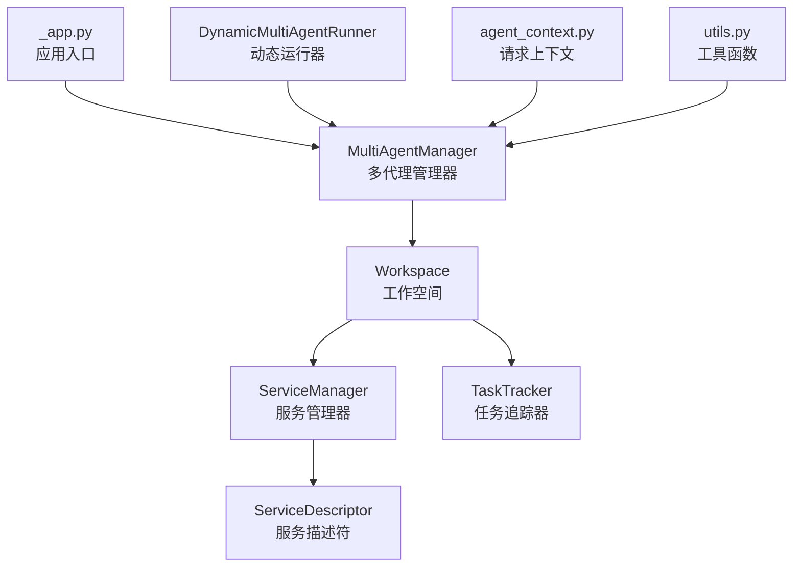
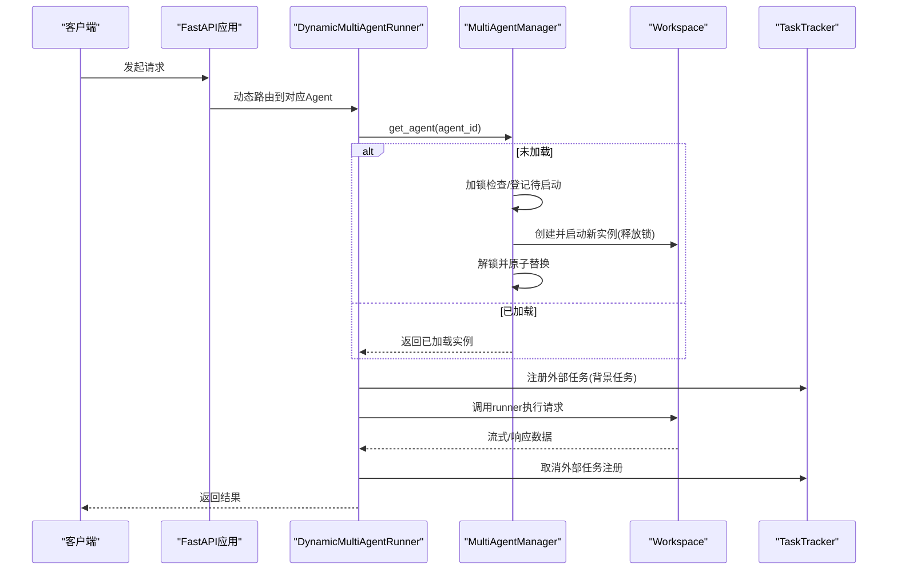
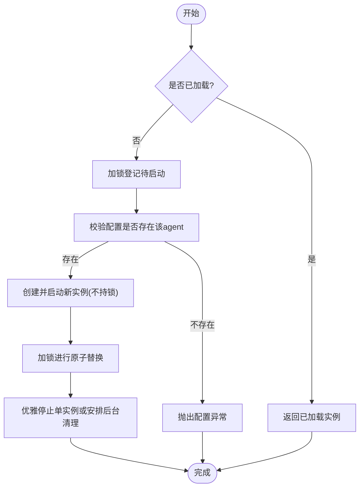
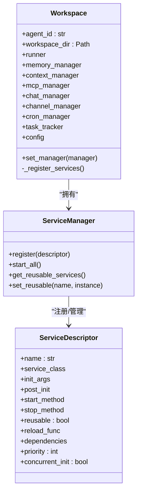
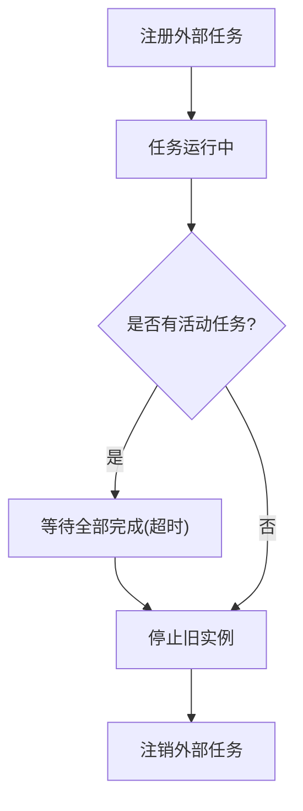
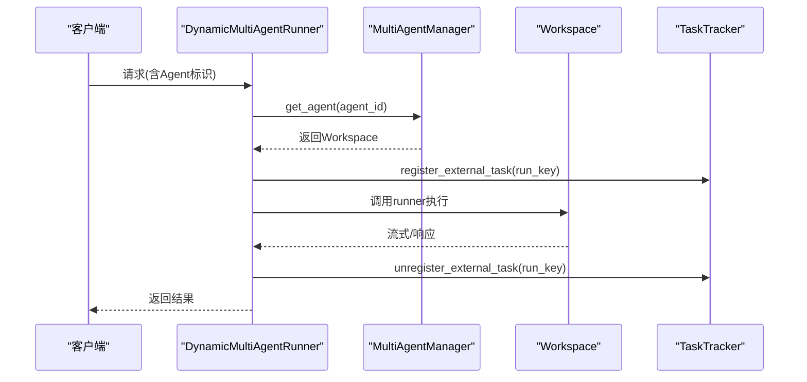
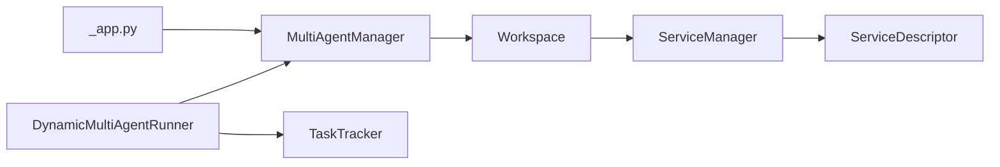

# 多代理管理器

<cite>
**本文引用的文件**
- [multi_agent_manager.py](file://src/qwenpaw/app/multi_agent_manager.py)
- [workspace.py](file://src/qwenpaw/app/workspace/workspace.py)
- [service_manager.py](file://src/qwenpaw/app/workspace/service_manager.py)
- [_app.py](file://src/qwenpaw/app/_app.py)
- [task_tracker.py](file://src/qwenpaw/app/runner/task_tracker.py)
- [agent_context.py](file://src/qwenpaw/app/agent_context.py)
- [utils.py](file://src/qwenpaw/app/utils.py)
- [test_reload_background_task_killed.py](file://tests/unit/app/test_reload_background_task_killed.py)
</cite>

## 目录
1. [简介](#简介)
2. [项目结构](#项目结构)
3. [核心组件](#核心组件)
4. [架构总览](#架构总览)
5. [详细组件分析](#详细组件分析)
6. [依赖分析](#依赖分析)
7. [性能考虑](#性能考虑)
8. [故障排查指南](#故障排查指南)
9. [结论](#结论)
10. [附录：使用示例与最佳实践](#附录使用示例与最佳实践)

## 简介
本文件面向MultiAgentManager（多代理管理器）的技术文档，系统性阐述其核心架构与关键能力，包括：
- 懒加载机制与并发去重
- 并发控制与细粒度锁
- 零停机热重载（hot reload）
- 异步锁与事件协调
- 资源清理与后台任务管理
- 组件间交互模式与错误处理策略
- 性能优化与可扩展性建议

文档同时提供关键方法的调用流程图与时序图，并给出在实际业务中如何进行代理生命周期管理的示例路径。

## 项目结构
MultiAgentManager位于应用层，负责统一管理多个Workspace实例。其直接依赖如下模块：
- Workspace：单个代理工作空间封装
- ServiceManager/ServiceDescriptor：组件注册与生命周期编排
- TaskTracker：运行中任务追踪与优雅停机判断
- 应用启动与上下文：FastAPI应用初始化、动态路由与请求上下文

**图表来源**
- [multi_agent_manager.py:22-537](file://src/qwenpaw/app/multi_agent_manager.py#L22-L537)
- [workspace.py:38-200](file://src/qwenpaw/app/workspace/workspace.py#L38-L200)
- [service_manager.py:76-200](file://src/qwenpaw/app/workspace/service_manager.py#L76-L200)
- [_app.py:72-200](file://src/qwenpaw/app/_app.py#L72-L200)
- [task_tracker.py:37-200](file://src/qwenpaw/app/runner/task_tracker.py#L37-L200)

**章节来源**
- [multi_agent_manager.py:22-537](file://src/qwenpaw/app/multi_agent_manager.py#L22-L537)
- [workspace.py:38-200](file://src/qwenpaw/app/workspace/workspace.py#L38-L200)
- [service_manager.py:76-200](file://src/qwenpaw/app/workspace/service_manager.py#L76-L200)
- [_app.py:72-200](file://src/qwenpaw/app/_app.py#L72-L200)
- [task_tracker.py:37-200](file://src/qwenpaw/app/runner/task_tracker.py#L37-L200)

## 核心组件
- MultiAgentManager：集中式多代理生命周期与热重载控制器
- Workspace：单个代理的完整运行时环境（Runner、ChannelManager、MemoryManager、MCPClientManager、CronManager等）
- ServiceManager/ServiceDescriptor：声明式服务注册与并发/顺序启动编排
- TaskTracker：内部流式/后台任务追踪，用于零停机重载的“是否仍在运行”判定
- DynamicMultiAgentRunner：按请求动态选择工作空间的运行器，并在AgentApp背景任务中注册/注销外部任务

**章节来源**
- [multi_agent_manager.py:22-537](file://src/qwenpaw/app/multi_agent_manager.py#L22-L537)
- [workspace.py:38-200](file://src/qwenpaw/app/workspace/workspace.py#L38-L200)
- [service_manager.py:32-161](file://src/qwenpaw/app/workspace/service_manager.py#L32-L161)
- [task_tracker.py:37-200](file://src/qwenpaw/app/runner/task_tracker.py#L37-L200)
- [_app.py:72-200](file://src/qwenpaw/app/_app.py#L72-L200)

## 架构总览
MultiAgentManager通过懒加载与并发去重确保首次访问的快速返回；通过细粒度异步锁与事件协调避免阻塞；通过零停机热重载保证新旧实例无缝切换；通过TaskTracker与后台清理任务保障长连接/流式任务的连续性。

**图表来源**
- [_app.py:128-194](file://src/qwenpaw/app/_app.py#L128-L194)
- [multi_agent_manager.py:42-137](file://src/qwenpaw/app/multi_agent_manager.py#L42-L137)
- [task_tracker.py:131-188](file://src/qwenpaw/app/runner/task_tracker.py#L131-L188)

## 详细组件分析

### MultiAgentManager：多代理生命周期与热重载
- 懒加载与并发去重
  - 使用字典缓存已加载实例，避免重复创建
  - 使用异步锁与事件对象协调并发首次加载，仅在极短时间持有锁
  - 在慢启动阶段（Workspace创建/启动）释放锁，允许其他代理并行初始化
- 零停机热重载
  - 先创建并启动新实例，再进行原子替换，最后对旧实例进行优雅停机
  - 若旧实例存在活动任务，则创建后台清理任务，等待任务完成后停止
  - 支持从旧实例迁移可复用组件（如MemoryManager等），减少重启成本
- 停止与批量停止
  - 单个停止：移除缓存并立即停止
  - 批量停止：取消所有延迟清理任务后逐一停止
- 启动所有已启用代理
  - 过滤enabled=true的代理，真正并行启动，提升冷启动效率

**图表来源**
- [multi_agent_manager.py:42-137](file://src/qwenpaw/app/multi_agent_manager.py#L42-L137)
- [multi_agent_manager.py:255-382](file://src/qwenpaw/app/multi_agent_manager.py#L255-L382)

**章节来源**
- [multi_agent_manager.py:42-137](file://src/qwenpaw/app/multi_agent_manager.py#L42-L137)
- [multi_agent_manager.py:138-234](file://src/qwenpaw/app/multi_agent_manager.py#L138-L234)
- [multi_agent_manager.py:255-382](file://src/qwenpaw/app/multi_agent_manager.py#L255-L382)
- [multi_agent_manager.py:409-433](file://src/qwenpaw/app/multi_agent_manager.py#L409-L433)
- [multi_agent_manager.py:470-531](file://src/qwenpaw/app/multi_agent_manager.py#L470-L531)

### Workspace：单代理工作空间
- 统一封装Runner、ChannelManager、MemoryManager、MCPClientManager、CronManager等
- 通过ServiceManager统一注册与生命周期管理
- 提供task_tracker属性用于长连接/流式任务追踪
- 提供set_manager用于注入MultiAgentManager引用

**图表来源**
- [workspace.py:38-200](file://src/qwenpaw/app/workspace/workspace.py#L38-L200)
- [service_manager.py:76-200](file://src/qwenpaw/app/workspace/service_manager.py#L76-L200)
- [service_manager.py:32-74](file://src/qwenpaw/app/workspace/service_manager.py#L32-L74)

**章节来源**
- [workspace.py:38-200](file://src/qwenpaw/app/workspace/workspace.py#L38-L200)
- [service_manager.py:76-200](file://src/qwenpaw/app/workspace/service_manager.py#L76-L200)
- [service_manager.py:32-74](file://src/qwenpaw/app/workspace/service_manager.py#L32-L74)

### TaskTracker：任务追踪与优雅停机
- 记录每个run_key的任务状态、队列与缓冲区
- 提供has_active_tasks/list_active_tasks/wait_all_done等接口
- 支持外部任务注册/注销，使AgentApp背景任务也能被重载检测到

**图表来源**
- [task_tracker.py:131-188](file://src/qwenpaw/app/runner/task_tracker.py#L131-L188)
- [task_tracker.py:86-129](file://src/qwenpaw/app/runner/task_tracker.py#L86-L129)

**章节来源**
- [task_tracker.py:37-200](file://src/qwenpaw/app/runner/task_tracker.py#L37-L200)
- [test_reload_background_task_killed.py:132-162](file://tests/unit/app/test_reload_background_task_killed.py#L132-L162)

### DynamicMultiAgentRunner：动态路由与外部任务注册
- 根据请求头或上下文动态选择目标agent的工作空间
- 在AgentApp背景任务中通过TaskTracker注册/注销外部任务，确保重载时不会中断正在运行的任务

**图表来源**
- [_app.py:128-194](file://src/qwenpaw/app/_app.py#L128-L194)
- [task_tracker.py:131-188](file://src/qwenpaw/app/runner/task_tracker.py#L131-L188)

**章节来源**
- [_app.py:72-200](file://src/qwenpaw/app/_app.py#L72-L200)
- [task_tracker.py:131-188](file://src/qwenpaw/app/runner/task_tracker.py#L131-L188)

## 依赖分析
- MultiAgentManager依赖Workspace与配置加载器
- Workspace依赖ServiceManager/ServiceDescriptor进行组件编排
- DynamicMultiAgentRunner依赖MultiAgentManager与TaskTracker
- 应用启动时在状态中注入MultiAgentManager，并在后台并行启动已启用的代理

**图表来源**
- [multi_agent_manager.py:16-17](file://src/qwenpaw/app/multi_agent_manager.py#L16-L17)
- [workspace.py:20-33](file://src/qwenpaw/app/workspace/workspace.py#L20-L33)
- [_app.py:270-320](file://src/qwenpaw/app/_app.py#L270-L320)

**章节来源**
- [multi_agent_manager.py:16-17](file://src/qwenpaw/app/multi_agent_manager.py#L16-L17)
- [workspace.py:20-33](file://src/qwenpaw/app/workspace/workspace.py#L20-L33)
- [_app.py:270-320](file://src/qwenpaw/app/_app.py#L270-L320)

## 性能考虑
- 懒加载与并发去重：首次访问快速返回，避免重复初始化
- 细粒度锁：仅在必要时持锁（字典检查/原子替换），其余时间释放锁以支持并行
- 真并行启动：启动所有已启用代理时使用gather并行，显著缩短冷启动时间
- 可复用组件：重载时迁移可复用服务（如MemoryManager），降低重启成本
- 优雅停机：对有活动任务的旧实例采用后台清理，避免阻塞新请求

[本节为通用性能讨论，无需列出具体文件来源]

## 故障排查指南
- 配置异常
  - 当agent_id不在配置中时，懒加载会抛出配置异常；检查配置文件agents.profiles是否包含目标agent
- 重载失败
  - 新实例启动失败时会尝试停止新实例并返回False；检查日志定位失败原因
  - 若旧实例无法停止，查看后台清理任务状态与异常
- 背景任务被中断
  - 若AgentApp背景任务在重载时被中断，需确认DynamicMultiAgentRunner是否正确注册/注销外部任务
- 停止所有代理
  - stop_all会先取消所有延迟清理任务，再逐一停止；若出现悬挂实例，检查清理任务集合

**章节来源**
- [multi_agent_manager.py:82-105](file://src/qwenpaw/app/multi_agent_manager.py#L82-L105)
- [multi_agent_manager.py:349-359](file://src/qwenpaw/app/multi_agent_manager.py#L349-L359)
- [test_reload_background_task_killed.py:191-200](file://tests/unit/app/test_reload_background_task_killed.py#L191-L200)
- [multi_agent_manager.py:409-433](file://src/qwenpaw/app/multi_agent_manager.py#L409-L433)

## 结论
MultiAgentManager通过懒加载、细粒度锁、并发去重与零停机热重载，实现了高可用、高性能的多代理生命周期管理。结合TaskTracker与后台清理机制，确保长连接/流式任务与AgentApp背景任务在重载过程中得到妥善处理。配合ServiceManager的声明式组件编排，系统具备良好的可扩展性与维护性。

[本节为总结性内容，无需列出具体文件来源]

## 附录：使用示例与最佳实践
以下提供在实际工程中使用MultiAgentManager进行代理生命周期管理的参考路径（请根据自身项目调整）：

- 获取代理实例（懒加载）
  - 路径参考：[multi_agent_manager.py:get_agent:42-137](file://src/qwenpaw/app/multi_agent_manager.py#L42-L137)
  - 应用集成参考：[_app.py:292-299](file://src/qwenpaw/app/_app.py#L292-L299)
  - 请求上下文参考：[agent_context.py:92-119](file://src/qwenpaw/app/agent_context.py#L92-L119)

- 零停机热重载
  - 路径参考：[multi_agent_manager.py:reload_agent:255-382](file://src/qwenpaw/app/multi_agent_manager.py#L255-L382)
  - 后台调度参考：[utils.py:49-58](file://src/qwenpaw/app/utils.py#L49-L58)

- 停止单个代理
  - 路径参考：[multi_agent_manager.py:stop_agent:235-254](file://src/qwenpaw/app/multi_agent_manager.py#L235-L254)

- 停止所有代理
  - 路径参考：[multi_agent_manager.py:stop_all:409-433](file://src/qwenpaw/app/multi_agent_manager.py#L409-L433)

- 预加载与并行启动
  - 预加载：[multi_agent_manager.py:preload_agent:453-469](file://src/qwenpaw/app/multi_agent_manager.py#L453-L469)
  - 并行启动：[multi_agent_manager.py:start_all_configured_agents:470-531](file://src/qwenpaw/app/multi_agent_manager.py#L470-L531)

- 动态路由与外部任务注册
  - 路径参考：[_app.py:128-194](file://src/qwenpaw/app/_app.py#L128-L194)
  - TaskTracker注册/注销：[task_tracker.py:131-188](file://src/qwenpaw/app/runner/task_tracker.py#L131-L188)

- 背景任务不被中断的验证
  - 测试参考：[test_reload_background_task_killed.py:191-200](file://tests/unit/app/test_reload_background_task_killed.py#L191-L200)