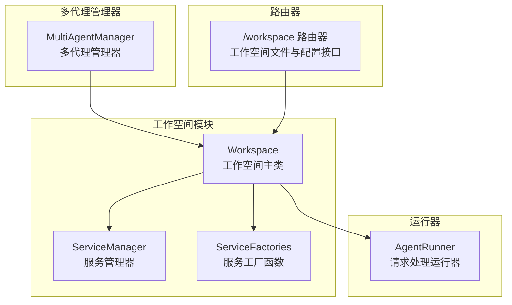
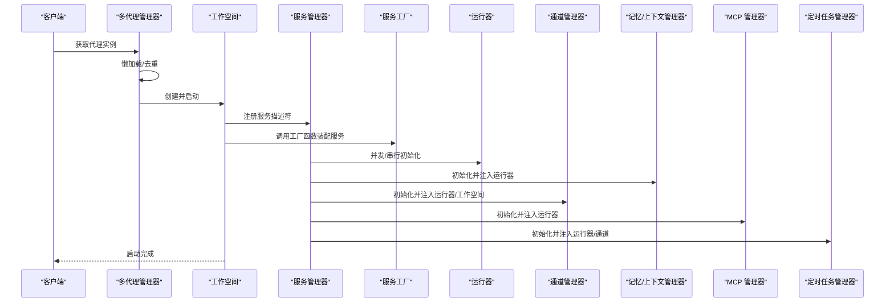
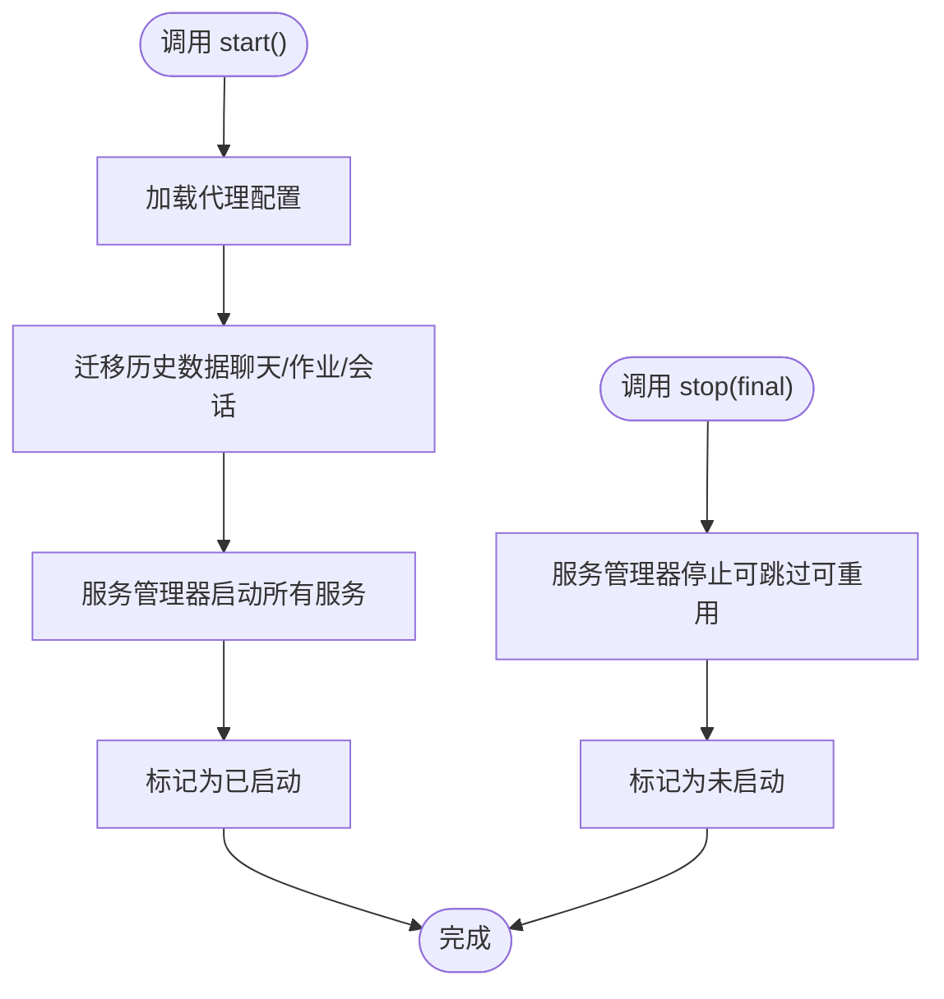
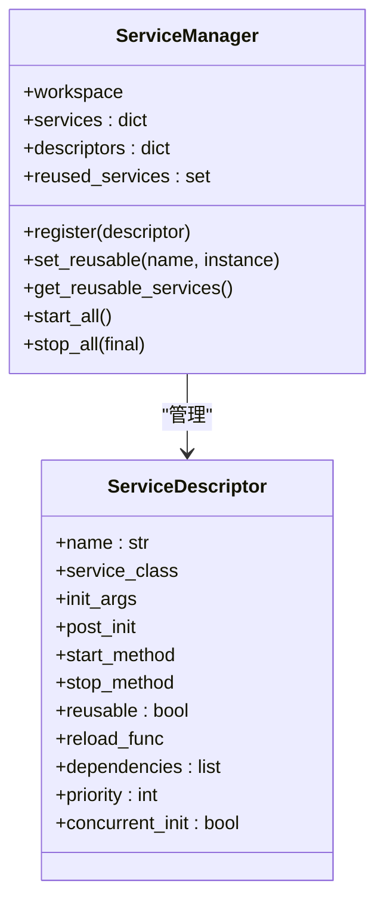
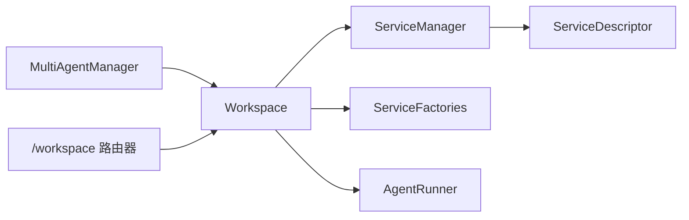

# 工作空间

<cite>
**本文引用的文件列表**
- [workspace.py](file://src/qwenpaw/app/workspace/workspace.py)
- [service_manager.py](file://src/qwenpaw/app/workspace/service_manager.py)
- [service_factories.py](file://src/qwenpaw/app/workspace/service_factories.py)
- [multi_agent_manager.py](file://src/qwenpaw/app/multi_agent_manager.py)
- [runner.py](file://src/qwenpaw/app/runner/runner.py)
- [workspace.py（路由器）](file://src/qwenpaw/app/routers/workspace.py)
- [test_workspace.py](file://tests/unit/workspace/test_workspace.py)
</cite>

## 目录
1. [简介](#简介)
2. [项目结构](#项目结构)
3. [核心组件](#核心组件)
4. [架构总览](#架构总览)
5. [详细组件分析](#详细组件分析)
6. [依赖关系分析](#依赖关系分析)
7. [性能考量](#性能考量)
8. [故障排查指南](#故障排查指南)
9. [结论](#结论)
10. [附录](#附录)

## 简介
本文件面向“工作空间”组件，系统性阐述其作为代理独立运行环境的设计理念与实现架构。工作空间以“单代理实例”的完整运行时为核心，封装并统一管理以下关键子系统：
- 请求处理运行器（Runner）
- 通信渠道管理（ChannelManager）
- 对话记忆管理（BaseMemoryManager）
- MCP 工具客户端管理（MCPClientManager）
- 定时任务管理（CronManager）

工作空间通过声明式服务描述与服务工厂模式，实现了组件注册、生命周期管理、可重用组件机制、零停机热重载、以及与多代理管理器的协作关系。同时，工作空间在启动阶段执行数据迁移、配置加载与并发初始化，确保高可用与高性能。

## 项目结构
工作空间相关代码位于应用层的 workspace 子模块，并与多代理管理器、运行器、路由器等模块协同工作。

图表来源
- [workspace.py:38-467](file://src/qwenpaw/app/workspace/workspace.py#L38-L467)
- [service_manager.py:76-453](file://src/qwenpaw/app/workspace/service_manager.py#L76-L453)
- [service_factories.py:1-176](file://src/qwenpaw/app/workspace/service_factories.py#L1-L176)
- [multi_agent_manager.py:22-537](file://src/qwenpaw/app/multi_agent_manager.py#L22-L537)
- [runner.py:109-200](file://src/qwenpaw/app/runner/runner.py#L109-L200)
- [workspace.py（路由器）:1-804](file://src/qwenpaw/app/routers/workspace.py#L1-L804)

章节来源
- [workspace.py:1-467](file://src/qwenpaw/app/workspace/workspace.py#L1-L467)
- [service_manager.py:1-453](file://src/qwenpaw/app/workspace/service_manager.py#L1-L453)
- [service_factories.py:1-176](file://src/qwenpaw/app/workspace/service_factories.py#L1-L176)
- [multi_agent_manager.py:1-537](file://src/qwenpaw/app/multi_agent_manager.py#L1-L537)
- [runner.py:1-200](file://src/qwenpaw/app/runner/runner.py#L1-L200)
- [workspace.py（路由器）:1-804](file://src/qwenpaw/app/routers/workspace.py#L1-L804)

## 核心组件
- Workspace：单个代理的工作空间，负责服务注册、启动/停止、可重用组件设置、配置加载与数据迁移。
- ServiceManager：统一的服务生命周期管理器，支持优先级分组、并发/串行初始化、可重用组件标记与迁移、优雅停止。
- ServiceDescriptor：服务描述符，定义服务类、初始化参数、后置初始化钩子、启动/停止方法、是否可重用、依赖关系与并发策略。
- ServiceFactories：服务工厂函数集合，用于创建/装配具体服务（如聊天管理、通道管理、MCP 管理等），并注入到运行器。
- MultiAgentManager：多代理管理器，负责懒加载、并发启动、零停机热重载、延迟清理旧实例、全局停止。
- AgentRunner：请求处理运行器，承载聊天管理、内存/上下文管理、MCP 管理、工作空间注入、任务跟踪等能力。
- 路由器（/workspace）：提供工作空间打包下载、上传合并、文件读写、语言与音频配置、运行配置更新等接口。

章节来源
- [workspace.py:38-467](file://src/qwenpaw/app/workspace/workspace.py#L38-L467)
- [service_manager.py:32-453](file://src/qwenpaw/app/workspace/service_manager.py#L32-L453)
- [service_factories.py:18-176](file://src/qwenpaw/app/workspace/service_factories.py#L18-L176)
- [multi_agent_manager.py:22-537](file://src/qwenpaw/app/multi_agent_manager.py#L22-L537)
- [runner.py:109-200](file://src/qwenpaw/app/runner/runner.py#L109-L200)
- [workspace.py（路由器）:1-804](file://src/qwenpaw/app/routers/workspace.py#L1-L804)

## 架构总览
工作空间采用“声明式服务注册 + 工厂装配 + 生命周期编排”的架构，结合多代理管理器实现零停机热重载与资源隔离。

图表来源
- [multi_agent_manager.py:42-137](file://src/qwenpaw/app/multi_agent_manager.py#L42-L137)
- [workspace.py:137-317](file://src/qwenpaw/app/workspace/workspace.py#L137-L317)
- [service_manager.py:173-251](file://src/qwenpaw/app/workspace/service_manager.py#L173-L251)
- [service_factories.py:18-176](file://src/qwenpaw/app/workspace/service_factories.py#L18-L176)

## 详细组件分析

### 组件一：Workspace（工作空间）
- 设计目标：封装单个代理的完整运行时，提供统一的生命周期入口与资源隔离。
- 关键职责：
  - 初始化工作目录与服务管理器
  - 声明式注册所有服务（Runner、MemoryManager、ContextManager、MCP、ChatManager、ChannelManager、CronManager、配置监视器等）
  - 可重用组件设置（在启动前注入可复用的内存/上下文/聊天管理器等）
  - 启动/停止流程编排（含配置加载、数据迁移、异常回滚）
  - 与多代理管理器协作（设置管理器引用、任务跟踪）
- 生命周期：
  - start：加载配置、迁移历史数据、启动服务管理器、标记已启动
  - stop：停止服务管理器（可选择是否停止可重用组件）、标记未启动
  - set_reusable_components：在启动前设置可重用组件，避免重建
- 数据迁移：启动时迁移历史 weixin 到 wechat 的聊天、作业与会话文件，失败不阻塞启动
- 配置访问：按需加载代理配置，支持运行配置与系统提示文件管理

图表来源
- [workspace.py:351-458](file://src/qwenpaw/app/workspace/workspace.py#L351-L458)
- [workspace.py:393-437](file://src/qwenpaw/app/workspace/workspace.py#L393-L437)

章节来源
- [workspace.py:51-125](file://src/qwenpaw/app/workspace/workspace.py#L51-L125)
- [workspace.py:137-317](file://src/qwenpaw/app/workspace/workspace.py#L137-L317)
- [workspace.py:351-458](file://src/qwenpaw/app/workspace/workspace.py#L351-L458)
- [workspace.py:393-437](file://src/qwenpaw/app/workspace/workspace.py#L393-L437)

### 组件二：ServiceManager（服务管理器）
- 设计目标：统一管理服务的注册、生命周期、依赖解析与可重用组件迁移。
- 关键特性：
  - 服务描述符（ServiceDescriptor）：定义服务类、初始化参数、后置初始化钩子、启动/停止方法、是否可重用、依赖关系、优先级、并发策略
  - 分组与排序：按优先级分组，同优先级内并发或串行初始化；停止时逆序执行
  - 可重用组件：支持在热重载时保留并迁移可重用组件（如内存/上下文/聊天管理器）
  - 异步与线程池：构造与启动方法异步化，避免阻塞事件循环
  - 错误处理：启动失败记录异常并抛出；停止失败记录警告但不中断流程
- 典型流程：
  - start_all：按优先级分组，先并发再串行，期间让出事件循环
  - stop_all：按逆序优先级并发停止，捕获异常并记录

图表来源
- [service_manager.py:32-161](file://src/qwenpaw/app/workspace/service_manager.py#L32-L161)
- [service_manager.py:173-453](file://src/qwenpaw/app/workspace/service_manager.py#L173-L453)

章节来源
- [service_manager.py:32-161](file://src/qwenpaw/app/workspace/service_manager.py#L32-L161)
- [service_manager.py:173-453](file://src/qwenpaw/app/workspace/service_manager.py#L173-L453)

### 组件三：ServiceFactories（服务工厂）
- 设计目标：将服务创建与装配逻辑从 Workspace 中解耦，提升可测试性与组织性。
- 主要工厂：
  - create_mcp_service：根据配置初始化 MCP 管理器并注入运行器
  - create_chat_service：创建或复用聊天管理器并注入运行器
  - create_channel_service：根据配置创建通道管理器并注入工作空间与运行器
  - create_agent_config_watcher：条件创建代理配置监视器
  - create_mcp_config_watcher：条件创建 MCP 配置监视器
- 作用：在服务注册阶段通过 post_init 钩子完成复杂装配与注入，保证运行器与各管理器之间的连接正确。

章节来源
- [service_factories.py:18-176](file://src/qwenpaw/app/workspace/service_factories.py#L18-L176)

### 组件四：MultiAgentManager（多代理管理器）
- 设计目标：集中管理多个工作空间实例，提供懒加载、并发启动、零停机热重载与延迟清理。
- 关键能力：
  - 懒加载与去重：同一代理并发请求时仅创建一次，其他等待
  - 并发启动：锁仅在必要时持有，启动过程释放锁以允许其他代理并行
  - 零停机热重载：新实例完全启动后再原子替换旧实例，旧实例在后台延迟清理
  - 延迟清理：若旧实例仍有活跃任务，则等待任务完成后停止
  - 全局停止：取消延迟清理任务并停止所有代理
- 协作方式：向工作空间注入管理器引用，以便 /daemon 重启命令等场景使用

章节来源
- [multi_agent_manager.py:42-137](file://src/qwenpaw/app/multi_agent_manager.py#L42-L137)
- [multi_agent_manager.py:255-382](file://src/qwenpaw/app/multi_agent_manager.py#L255-L382)
- [multi_agent_manager.py:409-432](file://src/qwenpaw/app/multi_agent_manager.py#L409-L432)

### 组件五：AgentRunner（运行器）
- 设计目标：承载代理请求处理的核心逻辑，与工作空间、聊天管理、MCP 管理、上下文/记忆管理紧密协作。
- 关键职责：
  - 设置聊天管理器、MCP 管理器、工作空间引用
  - 提供任务跟踪能力，支持延迟清理旧实例时的任务等待
  - 支持控制命令处理、消息流中断与取消
- 与工作空间的关系：工作空间在服务装配阶段将运行器注入到聊天/通道/MCP 等管理器中

章节来源
- [runner.py:109-200](file://src/qwenpaw/app/runner/runner.py#L109-L200)
- [workspace.py:155-290](file://src/qwenpaw/app/workspace/workspace.py#L155-L290)

### 组件六：/workspace 路由器
- 设计目标：提供工作空间文件管理、语言与音频配置、运行配置更新、打包下载/上传合并等接口。
- 主要功能：
  - 文件管理：列出/读取/写入工作目录与记忆目录中的 Markdown 文件
  - 语言设置：获取/更新代理语言，并可复制模板文件
  - 音频与转录：查询/设置音频模式、转录提供者类型与提供者、本地 Whisper 可用性检查、音频转录
  - 运行配置：获取/更新代理运行配置，并触发重载
  - 工作空间打包：将整个工作空间打包为 zip 流式下载
  - 工作空间上传：校验 zip 安全性并合并到工作空间（覆盖/合并策略）
- 安全性：上传 zip 校验路径遍历风险，失败返回错误

章节来源
- [workspace.py（路由器）:91-804](file://src/qwenpaw/app/routers/workspace.py#L91-L804)

## 依赖关系分析
- Workspace 依赖 ServiceManager 与 ServiceFactories 完成服务注册与装配
- ServiceManager 依赖 ServiceDescriptor 描述服务元信息，并在启动/停止时按优先级与并发策略调度
- MultiAgentManager 依赖 Workspace 实现懒加载、并发启动与热重载
- AgentRunner 由 Workspace 注入到聊天/通道/MCP 管理器中，形成运行时闭环
- /workspace 路由器依赖工作空间目录进行文件操作与配置更新

图表来源
- [workspace.py:20-34](file://src/qwenpaw/app/workspace/workspace.py#L20-L34)
- [service_manager.py:76-93](file://src/qwenpaw/app/workspace/service_manager.py#L76-L93)
- [service_factories.py:18-34](file://src/qwenpaw/app/workspace/service_factories.py#L18-L34)
- [multi_agent_manager.py:22-41](file://src/qwenpaw/app/multi_agent_manager.py#L22-L41)
- [runner.py:109-128](file://src/qwenpaw/app/runner/runner.py#L109-L128)
- [workspace.py（路由器）:37-37](file://src/qwenpaw/app/routers/workspace.py#L37-L37)

章节来源
- [workspace.py:20-34](file://src/qwenpaw/app/workspace/workspace.py#L20-L34)
- [service_manager.py:76-93](file://src/qwenpaw/app/workspace/service_manager.py#L76-L93)
- [service_factories.py:18-34](file://src/qwenpaw/app/workspace/service_factories.py#L18-L34)
- [multi_agent_manager.py:22-41](file://src/qwenpaw/app/multi_agent_manager.py#L22-L41)
- [runner.py:109-128](file://src/qwenpaw/app/runner/runner.py#L109-L128)
- [workspace.py（路由器）:37-37](file://src/qwenpaw/app/routers/workspace.py#L37-L37)

## 性能考量
- 并发初始化：ServiceManager 将同优先级服务并发启动，显著缩短启动时间
- 事件循环让出：在优先级组之间与服务启动过程中让出事件循环，保证服务器在后台启动时仍可响应请求
- 线程池离散化：同步构造与启动方法通过线程池执行，避免阻塞异步事件循环
- 零停机热重载：新实例完全启动后再替换旧实例，旧实例在后台延迟清理，最大化服务可用性
- 资源隔离：每个 Workspace 拥有独立的工作目录与服务实例，避免跨代理资源污染

[本节为通用性能讨论，无需特定文件来源]

## 故障排查指南
- 启动失败回滚：Workspace 在启动失败时会尝试停止已部分启动的服务并抛出异常，便于定位问题
- 停止失败容忍：ServiceManager 在停止阶段捕获异常并记录警告，确保整体关闭流程不被中断
- 历史数据迁移失败：工作空间启动时对 weixin 到 wechat 的迁移采取“失败不阻塞”的策略，记录警告并继续启动
- 配置变更生效：/workspace 路由器更新运行配置后会触发代理重载，确保新配置立即生效
- 上传 zip 安全性：上传合并前进行 zip 校验与路径遍历检查，发现不安全条目直接拒绝

章节来源
- [workspace.py:385-391](file://src/qwenpaw/app/workspace/workspace.py#L385-L391)
- [service_manager.py:362-453](file://src/qwenpaw/app/workspace/service_manager.py#L362-L453)
- [workspace.py:403-436](file://src/qwenpaw/app/workspace/workspace.py#L403-L436)
- [workspace.py（路由器）:659-708](file://src/qwenpaw/app/routers/workspace.py#L659-L708)

## 结论
工作空间通过声明式服务注册、工厂装配与统一生命周期管理，构建了高内聚、低耦合且可扩展的代理独立运行环境。配合多代理管理器的懒加载与零停机热重载，工作空间在保证稳定性的同时兼顾了性能与可维护性。其可重用组件机制与资源隔离策略，使得在多代理场景下能够高效地进行配置变更与升级，满足生产级部署需求。

[本节为总结性内容，无需特定文件来源]

## 附录

### A. 初始化流程与关键步骤
- Workspace.__init__：创建工作目录、初始化服务管理器、注册服务描述符
- Workspace.start：加载配置、迁移历史数据、启动服务管理器
- ServiceManager.start_all：按优先级分组并发/串行启动服务
- ServiceFactories：装配运行器、聊天/通道/MCP 管理器并注入工作空间

章节来源
- [workspace.py:51-125](file://src/qwenpaw/app/workspace/workspace.py#L51-L125)
- [workspace.py:351-381](file://src/qwenpaw/app/workspace/workspace.py#L351-L381)
- [service_manager.py:173-251](file://src/qwenpaw/app/workspace/service_manager.py#L173-L251)
- [service_factories.py:18-108](file://src/qwenpaw/app/workspace/service_factories.py#L18-L108)

### B. 服务工厂模式与可重用组件机制
- 服务工厂：将复杂装配逻辑抽取为独立函数，便于测试与维护
- 可重用组件：在热重载前设置可重用组件，避免重建；ServiceManager 记录可重用集合并在停止时按需跳过

章节来源
- [service_factories.py:18-176](file://src/qwenpaw/app/workspace/service_factories.py#L18-L176)
- [service_manager.py:108-158](file://src/qwenpaw/app/workspace/service_manager.py#L108-L158)

### C. 与多代理管理器的协作关系
- 懒加载：首次请求时创建并启动工作空间，避免不必要的资源占用
- 并发启动：锁仅在必要时持有，启动过程释放锁以允许其他代理并行
- 零停机热重载：新实例启动成功后原子替换旧实例，旧实例延迟清理

章节来源
- [multi_agent_manager.py:42-137](file://src/qwenpaw/app/multi_agent_manager.py#L42-L137)
- [multi_agent_manager.py:255-382](file://src/qwenpaw/app/multi_agent_manager.py#L255-L382)

### D. 状态管理与生命周期控制
- Workspace：启动/停止状态标记、任务跟踪、配置缓存
- ServiceManager：服务字典、描述符集合、可重用集合、停止策略
- MultiAgentManager：代理实例映射、延迟清理任务集合、全局停止

章节来源
- [workspace.py:66-76](file://src/qwenpaw/app/workspace/workspace.py#L66-L76)
- [service_manager.py:83-93](file://src/qwenpaw/app/workspace/service_manager.py#L83-L93)
- [multi_agent_manager.py:36-40](file://src/qwenpaw/app/multi_agent_manager.py#L36-L40)

### E. 资源隔离策略
- 工作目录隔离：每个代理拥有独立工作目录，避免文件冲突
- 服务实例隔离：每个 Workspace 拥有独立的服务实例集合
- 配置隔离：按代理 ID 加载配置，避免共享状态干扰

章节来源
- [workspace.py:59-60](file://src/qwenpaw/app/workspace/workspace.py#L59-L60)
- [workspace.py（路由器）:729-752](file://src/qwenpaw/app/routers/workspace.py#L729-L752)

### F. 配置示例与扩展开发指南
- 配置示例：通过 /workspace 路由器提供的接口更新运行配置、语言设置、音频模式与转录提供者
- 扩展开发：
  - 新增服务：在 Workspace._register_services 中注册 ServiceDescriptor，并在需要时提供 post_init 工厂函数
  - 可重用组件：在 ServiceDescriptor 中启用 reusable，并在 reload 时提供 reload_func
  - 监视器：根据业务需要添加配置监视器（如代理配置监视器、MCP 配置监视器），仅在存在相关服务时创建
  - 接口扩展：通过 /workspace 路由器新增文件管理或配置接口，注意安全性校验与错误处理

章节来源
- [workspace.py（路由器）:574-612](file://src/qwenpaw/app/routers/workspace.py#L574-L612)
- [workspace.py（路由器）:621-651](file://src/qwenpaw/app/routers/workspace.py#L621-L651)
- [workspace.py（路由器）:715-766](file://src/qwenpaw/app/routers/workspace.py#L715-L766)
- [workspace.py:137-317](file://src/qwenpaw/app/workspace/workspace.py#L137-L317)
- [service_manager.py:108-158](file://src/qwenpaw/app/workspace/service_manager.py#L108-L158)

### G. 单元测试参考
- 工作空间创建与属性：验证工作空间实例、目录创建、初始状态
- 组件访问：验证启动前组件为 None，启动后组件可用
- 表示形式：验证字符串表示包含状态信息

章节来源
- [test_workspace.py:8-97](file://tests/unit/workspace/test_workspace.py#L8-L97)