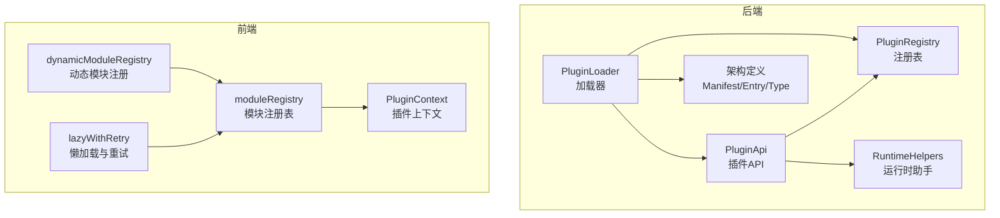
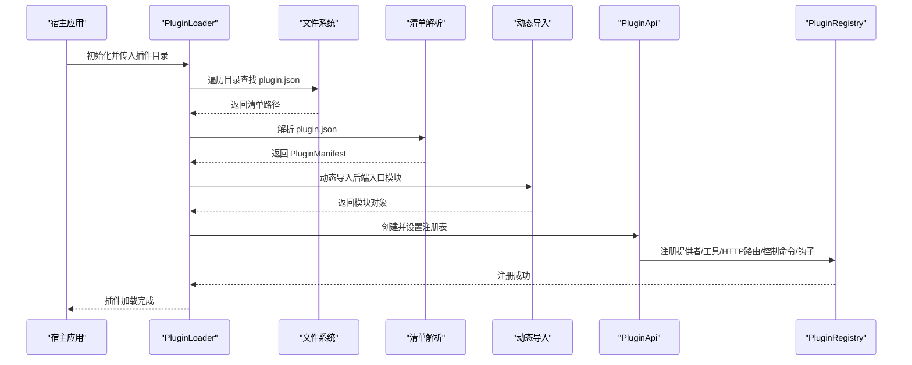
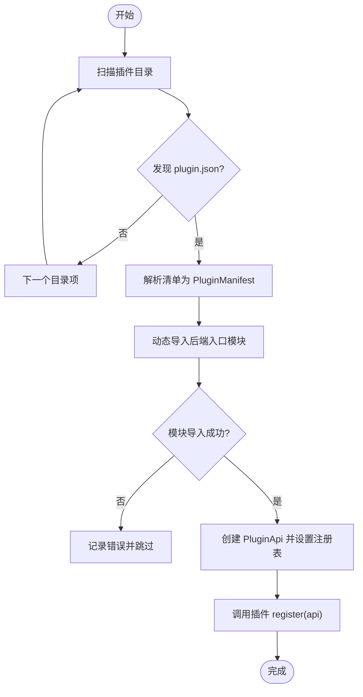
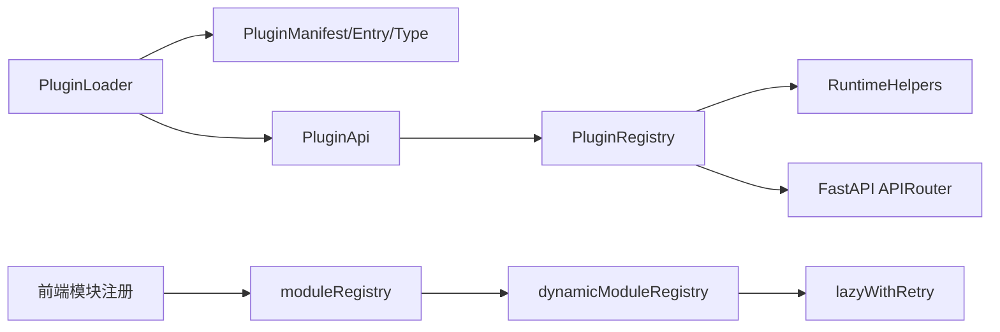

# 插件加载器

<cite>
**本文引用的文件**
- [loader.py](file://src/qwenpaw/plugins/loader.py)
- [registry.py](file://src/qwenpaw/plugins/registry.py)
- [runtime.py](file://src/qwenpaw/plugins/runtime.py)
- [architecture.py](file://src/qwenpaw/plugins/architecture.py)
- [api.py](file://src/qwenpaw/plugins/api.py)
- [plugins.py](file://src/qwenpaw/app/routers/plugins.py)
- [plugin_commands.py](file://src/qwenpaw/cli/plugin_commands.py)
- [gpt_image2.py](file://plugins/tool/gpt-image2/gpt_image2.py)
- [gpt-image2/plugin.json](file://plugins/tool/gpt-image2/plugin.json)
- [qwen-image/plugin.json](file://plugins/tool/qwen-image/plugin.json)
- [wan27/plugin.json](file://plugins/tool/wan27/plugin.json)
- [dynamicModuleRegistry.ts](file://console/src/plugins/dynamicModuleRegistry.ts)
- [moduleRegistry.ts](file://console/src/plugins/moduleRegistry.ts)
- [PluginContext.tsx](file://console/src/plugins/PluginContext.tsx)
- [lazyWithRetry.ts](file://console/src/utils/lazyWithRetry.ts)
</cite>

## 目录
1. [简介](#简介)
2. [项目结构](#项目结构)
3. [核心组件](#核心组件)
4. [架构总览](#架构总览)
5. [详细组件分析](#详细组件分析)
6. [依赖分析](#依赖分析)
7. [性能考虑](#性能考虑)
8. [故障排查指南](#故障排查指南)
9. [结论](#结论)
10. [附录](#附录)

## 简介
本技术文档围绕 PluginLoader 插件加载器展开，系统性阐述插件系统的架构设计、动态加载机制与运行时集成方式。内容涵盖插件发现流程、清单解析、动态导入与 API 注册过程；解释插件注册表的管理、运行时环境隔离、依赖安装与版本兼容策略；并给出生命周期管理、热重载机制、错误处理与安全控制的关键实现要点。最后提供插件开发框架与集成示例，帮助开发者快速上手。

## 项目结构
插件系统由后端 Python 加载器与前端模块注册体系共同组成：
- 后端：插件清单解析、动态导入、API 注册、依赖安装、生命周期钩子与 HTTP 路由挂载
- 前端：模块注册表、动态模块发现、页面懒加载与重试、插件上下文与路由注入

图表来源
- [loader.py:23-628](file://src/qwenpaw/plugins/loader.py#L23-L628)
- [registry.py:95-598](file://src/qwenpaw/plugins/registry.py#L95-L598)
- [api.py:48-401](file://src/qwenpaw/plugins/api.py#L48-L401)
- [runtime.py:10-68](file://src/qwenpaw/plugins/runtime.py#L10-L68)
- [architecture.py:10-142](file://src/qwenpaw/plugins/architecture.py#L10-L142)
- [moduleRegistry.ts:39-138](file://console/src/plugins/moduleRegistry.ts#L39-L138)
- [dynamicModuleRegistry.ts:22-71](file://console/src/plugins/dynamicModuleRegistry.ts#L22-L71)
- [PluginContext.tsx:47-80](file://console/src/plugins/PluginContext.tsx#L47-L80)
- [lazyWithRetry.ts:77-92](file://console/src/utils/lazyWithRetry.ts#L77-L92)

章节来源
- [loader.py:23-628](file://src/qwenpaw/plugins/loader.py#L23-L628)
- [registry.py:95-598](file://src/qwenpaw/plugins/registry.py#L95-L598)
- [architecture.py:10-142](file://src/qwenpaw/plugins/architecture.py#L10-L142)
- [moduleRegistry.ts:39-138](file://console/src/plugins/moduleRegistry.ts#L39-L138)
- [dynamicModuleRegistry.ts:22-71](file://console/src/plugins/dynamicModuleRegistry.ts#L22-L71)
- [PluginContext.tsx:47-80](file://console/src/plugins/PluginContext.tsx#L47-L80)
- [lazyWithRetry.ts:77-92](file://console/src/utils/lazyWithRetry.ts#L77-L92)

## 核心组件
- PluginLoader：负责扫描插件目录、解析清单、动态导入后端模块、调用插件注册方法、安装依赖、热加载/卸载插件
- PluginRegistry：集中式注册表，管理提供者、启动/关闭钩子、控制命令、HTTP 路由、插件清单与工具配置
- PluginApi：插件开发 API，提供注册提供者、工具、HTTP 路由、控制命令、启动/关闭钩子与运行时助手访问
- RuntimeHelpers：运行时助手，提供日志、提供者查询与列表等能力
- 架构定义：插件类型、入口点、清单模型与记录模型
- 前端模块注册：模块注册表、动态模块发现、懒加载与重试、插件上下文

章节来源
- [loader.py:23-628](file://src/qwenpaw/plugins/loader.py#L23-L628)
- [registry.py:95-598](file://src/qwenpaw/plugins/registry.py#L95-L598)
- [api.py:48-401](file://src/qwenpaw/plugins/api.py#L48-L401)
- [runtime.py:10-68](file://src/qwenpaw/plugins/runtime.py#L10-L68)
- [architecture.py:10-142](file://src/qwenpaw/plugins/architecture.py#L10-L142)

## 架构总览
后端通过 PluginLoader 扫描插件目录，读取 plugin.json 清单，动态导入后端入口模块，调用插件的 register 方法完成 API 注册（提供者、工具、HTTP 路由、控制命令、钩子）。前端通过 moduleRegistry 与 dynamicModuleRegistry 实现模块的动态注册与覆盖，结合 lazyWithRetry 提供懒加载与重试能力，PluginContext 将插件注册的路由与工具渲染器暴露给应用。

图表来源
- [loader.py:36-262](file://src/qwenpaw/plugins/loader.py#L36-L262)
- [architecture.py:92-130](file://src/qwenpaw/plugins/architecture.py#L92-L130)
- [api.py:48-244](file://src/qwenpaw/plugins/api.py#L48-L244)
- [registry.py:130-214](file://src/qwenpaw/plugins/registry.py#L130-L214)

## 详细组件分析

### 组件A：PluginLoader（插件加载器）
职责与流程
- 发现插件：遍历配置的插件目录，定位包含 plugin.json 的目录
- 清单解析：读取并解析 plugin.json，生成 PluginManifest
- 动态导入：基于清单中的后端入口点，使用 importlib.spec_from_file_location 动态导入模块，避免污染全局 sys.path
- 注册 API：构造 PluginApi 并设置到注册表，调用插件的 register 方法完成能力注册
- 依赖安装：支持 requirements.txt 安装，优先使用当前 Python 的 pip，若不可用则回退到 uv
- 热加载/卸载：支持从路径加载、复制到目标目录、安装依赖、注册与清理；卸载时执行关闭钩子、移除模块、清理注册表与工具

关键特性
- 运行时环境隔离：通过 unique 模块名与 __package__/__path__ 设置，确保相对导入与模块隔离
- 异步支持：register 支持同步与异步回调
- 错误处理：对缺失入口点、模块导出异常、依赖安装失败等情况进行捕获与日志输出
- 版本兼容：清单中 min_version 字段用于版本约束（在加载前可扩展校验）

图表来源
- [loader.py:36-262](file://src/qwenpaw/plugins/loader.py#L36-L262)

章节来源
- [loader.py:23-628](file://src/qwenpaw/plugins/loader.py#L23-L628)

### 组件B：PluginRegistry（插件注册表）
职责与能力
- 提供者注册：注册自定义 LLM Provider，并去重与冲突检测
- 钩子注册：启动/关闭钩子按优先级排序执行
- 控制命令注册：注册 /slash 控制命令处理器
- HTTP 路由注册：将插件 APIRouter 挂载到 /api 前缀，保证在 SPA 路由之前匹配
- 工具配置：提供工具配置的读写接口，支持按 agent_id 存取
- 清单管理：维护插件清单字典，便于 UI 展示与诊断
- 运行时助手：持有 RuntimeHelpers 以供插件访问

HTTP 路由挂载细节
- 在 FastAPI 应用中定位 SPA catch-all 路由位置，将插件路由插入其前，避免被 SPA 捕获
- 注册时校验前缀唯一性，防止冲突
- 注销时移除对应路由并刷新 OpenAPI 缓存

章节来源
- [registry.py:95-598](file://src/qwenpaw/plugins/registry.py#L95-L598)

### 组件C：PluginApi（插件开发 API）
能力概览
- 注册提供者：register_provider，合并元数据与清单 meta
- 注册工具：register_tool，延迟到启动钩子执行，向 qwenpaw.agents.tools 注册函数与 __all__，并写入 agent 配置
- 注册 HTTP 路由：register_http_router，委托给注册表挂载 APIRouter
- 注册控制命令：register_control_command
- 注册钩子：register_startup_hook/register_shutdown_hook
- 访问运行时助手：runtime 属性返回 RuntimeHelpers

工具注册流程
- 将工具函数动态注入到 qwenpaw.agents.tools 模块
- 更新 agent 的 builtin_tools 配置，默认禁用，等待用户启用
- 使用启动钩子确保在应用与 agent 上下文初始化完成后执行

章节来源
- [api.py:48-401](file://src/qwenpaw/plugins/api.py#L48-L401)

### 组件D：RuntimeHelpers（运行时助手）
能力概览
- 获取提供者实例与列出可用提供者
- 日志接口：info/debug/error

章节来源
- [runtime.py:10-68](file://src/qwenpaw/plugins/runtime.py#L10-L68)

### 组件E：架构定义（PluginManifest/PluginEntryPoints/PluginType）
- PluginType：枚举型插件类型（tool/provider/hook/command/frontend/general）
- PluginEntryPoints：前后端入口点
- PluginManifest：从 plugin.json 反序列化而来，支持从 meta 推断类型，兼容旧版清单
- PluginRecord：已加载插件记录，包含清单、源路径、启用状态与实例

章节来源
- [architecture.py:10-142](file://src/qwenpaw/plugins/architecture.py#L10-L142)

### 组件F：前端模块注册与插件上下文
- moduleRegistry：统一的模块注册表，提供 register/get/call/keys/getModule 等能力，支持代理暴露 window.QwenPaw.modules
- dynamicModuleRegistry：使用 import.meta.glob 动态发现并注册模块，排除测试文件，支持惰性与急切两种模式
- lazyWithRetry：基于 React.lazy 的懒加载与重试封装，支持从模块注册表获取覆盖后的组件
- PluginContext：订阅插件系统变化，聚合工具渲染配置与插件路由，提供 usePlugins hook

章节来源
- [moduleRegistry.ts:39-138](file://console/src/plugins/moduleRegistry.ts#L39-L138)
- [dynamicModuleRegistry.ts:22-71](file://console/src/plugins/dynamicModuleRegistry.ts#L22-L71)
- [lazyWithRetry.ts:77-92](file://console/src/utils/lazyWithRetry.ts#L77-L92)
- [PluginContext.tsx:47-80](file://console/src/plugins/PluginContext.tsx#L47-L80)

## 依赖分析
- 后端依赖
  - Python 标准库：json、importlib、inspect、subprocess、shutil、asyncio、logging
  - 第三方：FastAPI（APIRouter）用于 HTTP 路由挂载
- 前端依赖
  - Vite import.meta.glob 用于模块发现
  - React lazy 与自定义重试逻辑
- 插件示例
  - gpt-image2：展示工具类插件的后端入口与清单字段
  - qwen-image：多工具清单与配置字段
  - wan27：多工具与长耗时请求超时建议

图表来源
- [loader.py:16-18](file://src/qwenpaw/plugins/loader.py#L16-L18)
- [api.py:31-32](file://src/qwenpaw/plugins/api.py#L31-L32)
- [registry.py:9-11](file://src/qwenpaw/plugins/registry.py#L9-L11)
- [moduleRegistry.ts:12-13](file://console/src/plugins/moduleRegistry.ts#L12-L13)
- [dynamicModuleRegistry.ts:24-39](file://console/src/plugins/dynamicModuleRegistry.ts#L24-L39)
- [lazyWithRetry.ts:40-43](file://console/src/utils/lazyWithRetry.ts#L40-L43)

章节来源
- [loader.py:1-20](file://src/qwenpaw/plugins/loader.py#L1-L20)
- [api.py:1-7](file://src/qwenpaw/plugins/api.py#L1-L7)
- [registry.py:1-11](file://src/qwenpaw/plugins/registry.py#L1-L11)
- [moduleRegistry.ts:1-13](file://console/src/plugins/moduleRegistry.ts#L1-L13)
- [dynamicModuleRegistry.ts:1-12](file://console/src/plugins/dynamicModuleRegistry.ts#L1-L12)
- [lazyWithRetry.ts:1-3](file://console/src/utils/lazyWithRetry.ts#L1-L3)

## 性能考虑
- 动态导入与模块缓存：Python sys.modules 缓存已加载模块，卸载时需清理子模块前缀，避免重复使用旧模块
- 事件循环与阻塞：依赖安装通过 asyncio.to_thread 非阻塞执行，避免阻塞主事件循环
- HTTP 路由挂载：FastAPI 路由插入与 OpenAPI 缓存失效仅在注册时触发，减少后续请求开销
- 前端懒加载：React.lazy 与重试机制降低首屏压力，动态模块注册避免构建期静态绑定
- 工具注册延迟：工具注册放入启动钩子，避免在应用未就绪时访问 agent 配置

## 故障排查指南
常见问题与处理
- 插件未加载
  - 检查插件目录是否存在与权限
  - 确认 plugin.json 是否存在且格式正确
  - 查看后端日志中“Failed to load manifest”或“Failed to load plugin”信息
- 入口点缺失
  - 后端/前端入口点必须在清单中声明，否则抛出 FileNotFoundError
- 模块导入失败
  - 确保后端入口模块导出 plugin 对象或类
  - 检查相对导入路径与 __package__/__path__ 设置
- 依赖安装失败
  - 当前 Python 环境缺少 pip 时会尝试 uv，若仍失败请手动安装 requirements.txt
- 卸载后残留
  - 卸载会清理 sys.modules、注册表与工具，如 UI 仍显示，请检查是否需要刷新页面或重启服务
- 前端模块覆盖无效
  - 确认模块键与路径映射正确，lazyWithRetry 会从 moduleRegistry 获取覆盖后的组件

章节来源
- [loader.py:126-144](file://src/qwenpaw/plugins/loader.py#L126-L144)
- [loader.py:220-225](file://src/qwenpaw/plugins/loader.py#L220-L225)
- [loader.py:353-404](file://src/qwenpaw/plugins/loader.py#L353-L404)
- [registry.py:163-186](file://src/qwenpaw/plugins/registry.py#L163-L186)
- [lazyWithRetry.ts:77-92](file://console/src/utils/lazyWithRetry.ts#L77-L92)

## 结论
PluginLoader 通过清晰的发现-解析-导入-注册流程，实现了插件系统的高扩展性与热插拔能力。配合 PluginRegistry 的集中管理与 FastAPI 的路由挂载，后端能力得以无缝集成。前端通过模块注册表与动态模块发现，提供了强大的运行时覆盖与懒加载能力。整体设计兼顾了安全性（路径校验、Zip Slip 防护）、稳定性（异步与重试）与易用性（插件开发 API），为构建可演进的插件生态奠定了坚实基础。

## 附录

### 插件开发框架与清单字段
- 清单字段
  - id/name/version/description/author/type/entry/backend/frontend/dependencies/min_version/meta
  - type 可省略，将根据 meta 或 entry 自动推断
- 后端入口
  - 导出 plugin 对象或类，实现 register(api) 方法
- 前端入口
  - 若存在 frontend，将在 UI 中动态加载（由前端插件系统负责）

章节来源
- [architecture.py:92-130](file://src/qwenpaw/plugins/architecture.py#L92-L130)
- [gpt-image2/plugin.json:1-89](file://plugins/tool/gpt-image2/plugin.json#L1-L89)
- [qwen-image/plugin.json:1-129](file://plugins/tool/qwen-image/plugin.json#L1-L129)
- [wan27/plugin.json:1-122](file://plugins/tool/wan27/plugin.json#L1-L122)

### 集成示例（后端）
- 后端入口示例：参考 gpt-image2 后端入口，导出 plugin 实例并在 register 中调用 api.register_tool
- 清单示例：参考 gpt-image2/plugin.json，声明后端入口与工具元数据

章节来源
- [gpt_image2.py:27-64](file://plugins/tool/gpt-image2/gpt_image2.py#L27-L64)
- [gpt-image2/plugin.json:1-89](file://plugins/tool/gpt-image2/plugin.json#L1-L89)

### 集成示例（前端）
- 动态模块注册：使用 dynamicModuleRegistry 在宿主应用启动时自动发现并注册页面模块
- 懒加载与重试：使用 lazyWithRetry 包装页面组件，支持从模块注册表获取覆盖后的组件
- 插件上下文：使用 PluginContext 暴露插件注册的路由与工具渲染器

章节来源
- [dynamicModuleRegistry.ts:22-71](file://console/src/plugins/dynamicModuleRegistry.ts#L22-L71)
- [lazyWithRetry.ts:77-92](file://console/src/utils/lazyWithRetry.ts#L77-L92)
- [PluginContext.tsx:47-80](file://console/src/plugins/PluginContext.tsx#L47-L80)

### 生命周期与热重载
- 后端热重载
  - 通过 /plugins/install、/plugins/upload、/plugins/{id} 接口实现热安装/卸载
  - 卸载时执行关闭钩子、清理模块与注册表、移除工具
  - 安装后同步工具到所有 agent 配置并调度后台重载
- 前端热重载
  - 模块注册表支持覆盖，lazyWithRetry 从注册表获取最新组件
  - 动态模块注册在宿主启动时完成，插件可随时覆盖

章节来源
- [plugins.py:497-604](file://src/qwenpaw/app/routers/plugins.py#L497-L604)
- [plugins.py:725-775](file://src/qwenpaw/app/routers/plugins.py#L725-L775)
- [loader.py:487-560](file://src/qwenpaw/plugins/loader.py#L487-L560)
- [moduleRegistry.ts:122-137](file://console/src/plugins/moduleRegistry.ts#L122-L137)