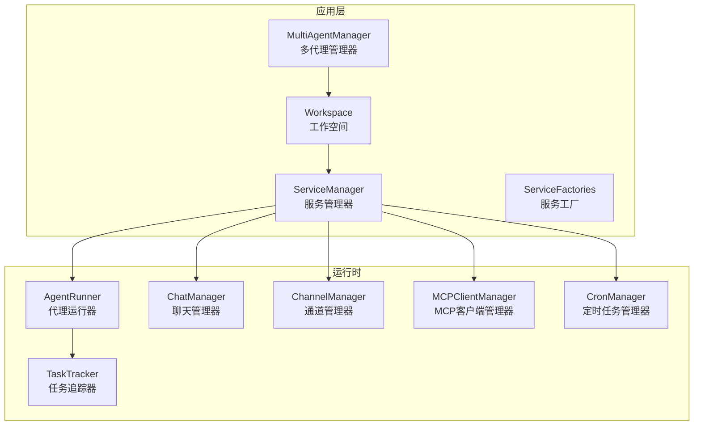
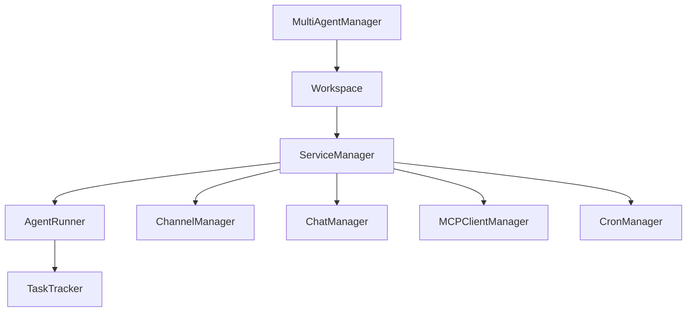
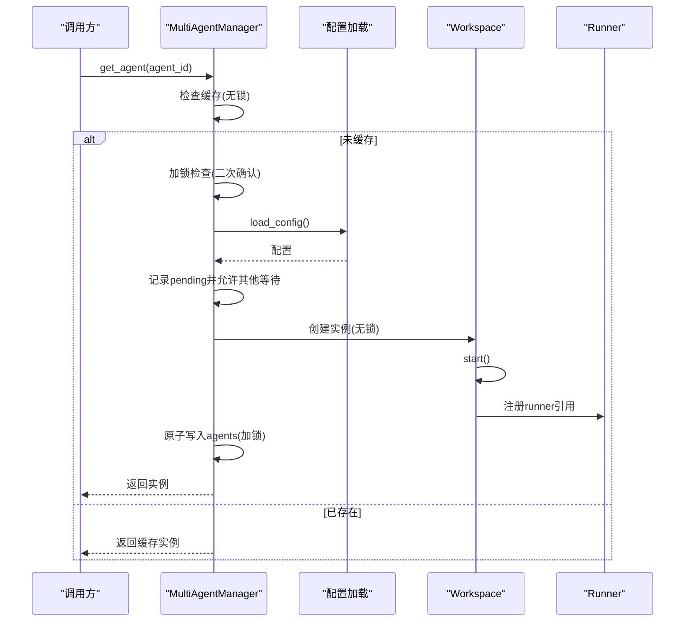
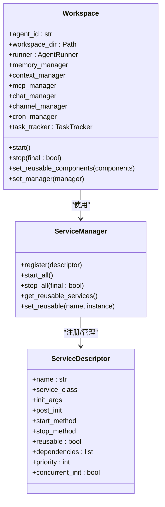
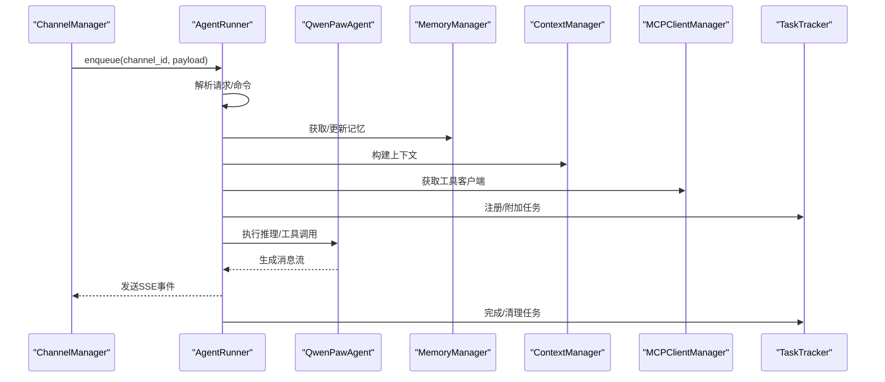
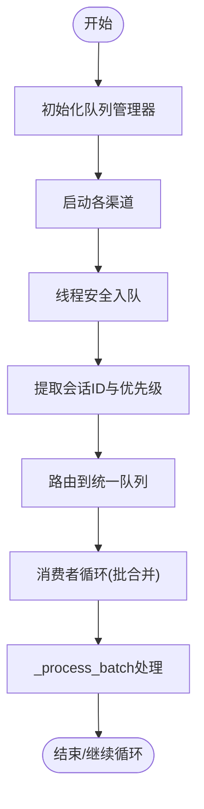
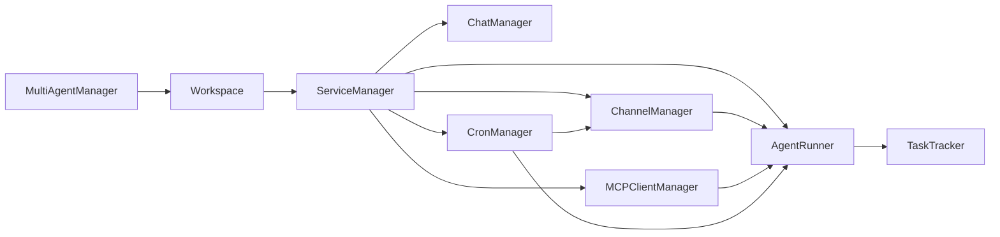

# 核心组件架构

<cite>
**本文档引用的文件**
- [multi_agent_manager.py](file://src/qwenpaw/app/multi_agent_manager.py)
- [workspace.py](file://src/qwenpaw/app/workspace/workspace.py)
- [service_manager.py](file://src/qwenpaw/app/workspace/service_manager.py)
- [service_factories.py](file://src/qwenpaw/app/workspace/service_factories.py)
- [runner.py](file://src/qwenpaw/app/runner/runner.py)
- [task_tracker.py](file://src/qwenpaw/app/runner/task_tracker.py)
- [manager.py](file://src/qwenpaw/app/runner/manager.py)
- [channels_manager.py](file://src/qwenpaw/app/channels/manager.py)
- [mcp_manager.py](file://src/qwenpaw/app/mcp/manager.py)
- [cron_manager.py](file://src/qwenpaw/app/crons/manager.py)
</cite>

## 目录
1. [简介](#简介)
2. [项目结构](#项目结构)
3. [核心组件](#核心组件)
4. [架构总览](#架构总览)
5. [详细组件分析](#详细组件分析)
6. [依赖分析](#依赖分析)
7. [性能考虑](#性能考虑)
8. [故障排查指南](#故障排查指南)
9. [结论](#结论)

## 简介
本文件面向QwenPaw多智能体系统的“核心组件架构”，聚焦以下关键模块：
- MultiAgentManager 多代理管理器：负责多个Agent工作空间的懒加载、生命周期管理与热重载。
- Workspace 工作空间：封装单个Agent的完整运行时环境（Runner、ChannelManager、MemoryManager、MCPClientManager、CronManager等）。
- AgentRunner 代理运行器：统一处理请求、会话、计划与任务执行，并通过TaskTracker管理后台任务。
- ChannelManager 通道管理器：统一调度与消费来自不同渠道的消息，支持队列化与优先级合并。

文档将从职责边界、内部结构、状态管理与生命周期、组件交互、数据传递机制、错误处理策略等方面进行系统性说明，并提供关系图与时序图以帮助理解协作流程。

## 项目结构
QwenPaw采用“工作空间”为中心的架构组织方式：每个Agent对应一个独立的Workspace，内部通过ServiceManager统一注册与启动各类服务；MultiAgentManager负责跨Agent的生命周期与热重载。

图表来源
- [multi_agent_manager.py:22-537](file://src/qwenpaw/app/multi_agent_manager.py#L22-L537)
- [workspace.py:38-467](file://src/qwenpaw/app/workspace/workspace.py#L38-L467)
- [service_manager.py:76-453](file://src/qwenpaw/app/workspace/service_manager.py#L76-L453)
- [service_factories.py:18-176](file://src/qwenpaw/app/workspace/service_factories.py#L18-L176)
- [runner.py:109-800](file://src/qwenpaw/app/runner/runner.py#L109-L800)
- [task_tracker.py:37-350](file://src/qwenpaw/app/runner/task_tracker.py#L37-L350)
- [manager.py:17-286](file://src/qwenpaw/app/runner/manager.py#L17-L286)
- [channels_manager.py:68-844](file://src/qwenpaw/app/channels/manager.py#L68-L844)
- [mcp_manager.py:23-287](file://src/qwenpaw/app/mcp/manager.py#L23-L287)
- [cron_manager.py:42-631](file://src/qwenpaw/app/crons/manager.py#L42-L631)

章节来源
- [multi_agent_manager.py:22-537](file://src/qwenpaw/app/multi_agent_manager.py#L22-L537)
- [workspace.py:38-467](file://src/qwenpaw/app/workspace/workspace.py#L38-L467)

## 核心组件
本节概述四大核心组件的职责与边界：
- MultiAgentManager：集中式管理多个Workspace实例，提供懒加载、并发启动、原子替换与零停机热重载。
- Workspace：单Agent的独立运行时容器，统一注册并启动Runner、ChannelManager、ChatManager、MCPClientManager、CronManager等服务。
- AgentRunner：请求入口与执行中枢，负责命令解析、会话加载、计划/任务执行、消息流输出与异常转换。
- ChannelManager：统一入队、合并、分发消息到各渠道，支持优先级队列与通道替换。

章节来源
- [multi_agent_manager.py:22-537](file://src/qwenpaw/app/multi_agent_manager.py#L22-L537)
- [workspace.py:38-467](file://src/qwenpaw/app/workspace/workspace.py#L38-L467)
- [runner.py:109-800](file://src/qwenpaw/app/runner/runner.py#L109-L800)
- [channels_manager.py:68-844](file://src/qwenpaw/app/channels/manager.py#L68-L844)

## 架构总览
下图展示了MultiAgentManager、Workspace与各子系统之间的关系与交互路径：

图表来源
- [multi_agent_manager.py:22-537](file://src/qwenpaw/app/multi_agent_manager.py#L22-L537)
- [workspace.py:38-467](file://src/qwenpaw/app/workspace/workspace.py#L38-L467)
- [service_manager.py:76-453](file://src/qwenpaw/app/workspace/service_manager.py#L76-L453)
- [runner.py:109-800](file://src/qwenpaw/app/runner/runner.py#L109-L800)
- [task_tracker.py:37-350](file://src/qwenpaw/app/runner/task_tracker.py#L37-L350)
- [channels_manager.py:68-844](file://src/qwenpaw/app/channels/manager.py#L68-L844)
- [mcp_manager.py:23-287](file://src/qwenpaw/app/mcp/manager.py#L23-L287)
- [cron_manager.py:42-631](file://src/qwenpaw/app/crons/manager.py#L42-L631)

## 详细组件分析

### MultiAgentManager 多代理管理器
- 职责边界
  - 维护agent_id到Workspace实例的映射表。
  - 提供懒加载、并发启动、原子替换与零停机热重载。
  - 协调并发请求，避免重复初始化。
- 内部结构
  - 字典缓存：agents
  - 并发控制：asyncio.Lock、pending_starts事件
  - 后台清理：cleanup_tasks集合
- 生命周期
  - get_agent：首次访问时创建并启动，支持并发去重。
  - reload_agent：新实例全量启动后原子替换旧实例，旧实例在有无活动任务情况下分别处理。
  - stop_agent/stop_all：优雅停止指定或全部实例。
- 错误处理
  - 配置校验失败抛出配置异常。
  - 启动失败清理部分已启动组件。
  - 热重载失败回滚并保留旧实例。
- 初始化与销毁
  - 初始化仅建立空容器与锁。
  - 停机前取消并等待所有延迟清理任务完成。

图表来源
- [multi_agent_manager.py:42-137](file://src/qwenpaw/app/multi_agent_manager.py#L42-L137)

章节来源
- [multi_agent_manager.py:22-537](file://src/qwenpaw/app/multi_agent_manager.py#L22-L537)

### Workspace 工作空间
- 职责边界
  - 封装单Agent的完整运行时：Runner、ChannelManager、ChatManager、MCPClientManager、CronManager。
  - 通过ServiceManager声明式注册与启动服务，支持可复用组件与并发初始化。
- 内部结构
  - 服务注册：ServiceDescriptor列表，定义优先级、并发、依赖与生命周期钩子。
  - 可复用组件：memory_manager、context_manager、chat_manager等。
  - TaskTracker：统一追踪后台任务状态。
- 生命周期
  - start：迁移历史数据、加载配置、启动服务（按优先级并发/串行）。
  - stop：停止服务（可选择是否停止可复用组件）。
  - set_reusable_components：在reload场景中注入可复用组件。
- 错误处理
  - 启动失败自动清理已启动组件。
  - 迁移失败记录警告但不阻塞启动。
- 初始化与销毁
  - 通过ServiceFactories创建并注入各子系统。
  - 与MultiAgentManager互相持有引用以便控制命令与热重载。

图表来源
- [workspace.py:38-467](file://src/qwenpaw/app/workspace/workspace.py#L38-L467)
- [service_manager.py:76-453](file://src/qwenpaw/app/workspace/service_manager.py#L76-L453)
- [service_factories.py:18-176](file://src/qwenpaw/app/workspace/service_factories.py#L18-L176)

章节来源
- [workspace.py:38-467](file://src/qwenpaw/app/workspace/workspace.py#L38-L467)
- [service_manager.py:76-453](file://src/qwenpaw/app/workspace/service_manager.py#L76-L453)
- [service_factories.py:18-176](file://src/qwenpaw/app/workspace/service_factories.py#L18-L176)

### AgentRunner 代理运行器
- 职责边界
  - 接收AgentRequest，解析命令与技能，构建Agent上下文，驱动会话与计划执行。
  - 输出SSE流，支持中断与清理。
- 内部结构
  - 与MemoryManager、BaseContextManager协作。
  - 与ChatManager集成实现自动注册与标题生成。
  - 与MCPClientManager协作注入工具客户端。
  - 与TaskTracker协作管理后台任务。
- 生命周期
  - start：由ServiceManager在Workspace启动时调用。
  - query_handler：统一处理查询，支持命令、计划、任务与标准对话。
- 错误处理
  - 将模型异常转换为应用层异常。
  - 取消时清理审批与中断Agent。
- 初始化与销毁
  - 通过ServiceDescriptor注入依赖并在start阶段启动。
  - 通过ServiceManager停止。

图表来源
- [runner.py:304-800](file://src/qwenpaw/app/runner/runner.py#L304-L800)
- [task_tracker.py:248-350](file://src/qwenpaw/app/runner/task_tracker.py#L248-L350)
- [channels_manager.py:365-461](file://src/qwenpaw/app/channels/manager.py#L365-L461)

章节来源
- [runner.py:109-800](file://src/qwenpaw/app/runner/runner.py#L109-L800)
- [task_tracker.py:37-350](file://src/qwenpaw/app/runner/task_tracker.py#L37-L350)

### ChannelManager 通道管理器
- 职责边界
  - 统一接收来自不同渠道的消息，进行去抖、合并与路由。
  - 支持优先级队列、批量合并、通道替换与健康检查。
- 内部结构
  - UnifiedQueueManager：统一队列与消费者循环。
  - CommandRegistry：基于查询文本的优先级判定。
  - per-channel锁：防止并发重启导致资源泄漏。
- 生命周期
  - start_all：初始化队列管理器、设置回调、启动各渠道。
  - stop_all：取消待处理入队任务、停止队列管理器与各渠道。
  - replace_channel/restart_channel：原子替换或重启单个渠道。
- 错误处理
  - 入队超时保护与取消处理。
  - 消费者异常日志记录但不中断整体循环。
- 初始化与销毁
  - 通过ServiceFactories注入Runner进程处理器与工作目录。
  - set_workspace将Workspace注入各渠道。

图表来源
- [channels_manager.py:365-461](file://src/qwenpaw/app/channels/manager.py#L365-L461)
- [channels_manager.py:258-351](file://src/qwenpaw/app/channels/manager.py#L258-L351)

章节来源
- [channels_manager.py:68-844](file://src/qwenpaw/app/channels/manager.py#L68-L844)

### 服务工厂与依赖注入
- ServiceFactories
  - create_mcp_service：从配置初始化MCPClientManager并注入Runner。
  - create_chat_service：创建或复用ChatManager并注入Runner。
  - create_channel_service：从配置创建ChannelManager并注入Workspace与Runner。
  - create_agent_config_watcher/create_mcp_config_watcher：条件性创建配置监视器。
- 作用
  - 将Workspace的初始化逻辑解耦为可测试的服务工厂函数。
  - 支持热重载时的可复用组件传递。

章节来源
- [service_factories.py:18-176](file://src/qwenpaw/app/workspace/service_factories.py#L18-L176)

## 依赖分析
- 组件耦合
  - MultiAgentManager与Workspace：一对多关系，前者管理后者生命周期。
  - Workspace与ServiceManager：强依赖，通过描述符声明式管理服务。
  - AgentRunner与TaskTracker：Runner持有TaskTracker用于后台任务追踪。
  - ChannelManager与Runner：ChannelManager通过process回调将消息交由Runner处理。
  - MCPClientManager与Runner：Runner在每次查询时动态获取最新客户端列表。
  - CronManager与Runner/ChannelManager：通过调度器触发任务并回传结果。
- 外部依赖
  - 异步并发：大量使用asyncio.Lock、asyncio.gather、asyncio.Queue。
  - APScheduler：CronManager使用异步调度器管理定时任务。
  - 配置系统：通过load_config/load_agent_config加载全局与Agent配置。

图表来源
- [multi_agent_manager.py:22-537](file://src/qwenpaw/app/multi_agent_manager.py#L22-L537)
- [workspace.py:38-467](file://src/qwenpaw/app/workspace/workspace.py#L38-L467)
- [service_manager.py:76-453](file://src/qwenpaw/app/workspace/service_manager.py#L76-L453)
- [runner.py:109-800](file://src/qwenpaw/app/runner/runner.py#L109-L800)
- [channels_manager.py:68-844](file://src/qwenpaw/app/channels/manager.py#L68-L844)
- [mcp_manager.py:23-287](file://src/qwenpaw/app/mcp/manager.py#L23-L287)
- [cron_manager.py:42-631](file://src/qwenpaw/app/crons/manager.py#L42-L631)

章节来源
- [multi_agent_manager.py:22-537](file://src/qwenpaw/app/multi_agent_manager.py#L22-L537)
- [workspace.py:38-467](file://src/qwenpaw/app/workspace/workspace.py#L38-L467)
- [service_manager.py:76-453](file://src/qwenpaw/app/workspace/service_manager.py#L76-L453)
- [runner.py:109-800](file://src/qwenpaw/app/runner/runner.py#L109-L800)
- [channels_manager.py:68-844](file://src/qwenpaw/app/channels/manager.py#L68-L844)
- [mcp_manager.py:23-287](file://src/qwenpaw/app/mcp/manager.py#L23-L287)
- [cron_manager.py:42-631](file://src/qwenpaw/app/crons/manager.py#L42-L631)

## 性能考虑
- 并发启动与懒加载
  - MultiAgentManager在get_agent中仅短暂持锁，其余时间释放锁让慢启动的Workspace并行初始化。
  - ServiceManager按优先级分组并发启动，同一组内可并发，不同组间yield让出事件循环。
- 零停机热重载
  - reload_agent通过“先启动新实例、再原子替换、最后优雅停止旧实例”的策略，最小化请求中断。
  - 旧实例若存在活动任务，采用后台延迟清理，避免阻塞新实例。
- 队列与批处理
  - ChannelManager使用统一队列与批合并逻辑，减少频繁I/O与上下文切换。
  - TaskTracker为每个run_key维护缓冲区与订阅队列，支持断点重连与事件回放。
- 资源回收
  - ServiceManager在stop_all时区分可复用组件与非可复用组件，避免重复关闭。
  - MCPClientManager在替换客户端时采用原子交换，确保查询期间客户端可用。

## 故障排查指南
- 启动失败
  - MultiAgentManager：检查配置键是否存在，查看配置异常日志；启动失败会自动清理部分组件。
  - Workspace：查看服务启动顺序与依赖，确认迁移脚本是否报错。
- 热重载问题
  - 若新实例启动失败，旧实例保持运行；检查新实例日志中的初始化错误。
  - 若旧实例仍有活动任务，延迟清理可能因超时而强制停止，需检查任务完成情况。
- 渠道异常
  - ChannelManager：入队超时、消费者异常会被记录但不影响整体；检查队列长度与消费者状态。
  - 通道替换：使用replace_channel/restart_channel时注意并发重启锁，避免资源泄漏。
- 任务追踪
  - TaskTracker：可通过has_active_tasks/list_active_tasks/wait_all_done监控后台任务；外部任务需显式注册/注销。
- MCP客户端
  - MCPClientManager：连接超时会强制清理；检查OAuth令牌有效性与传输参数。

章节来源
- [multi_agent_manager.py:138-234](file://src/qwenpaw/app/multi_agent_manager.py#L138-L234)
- [workspace.py:351-392](file://src/qwenpaw/app/workspace/workspace.py#L351-L392)
- [channels_manager.py:305-351](file://src/qwenpaw/app/channels/manager.py#L305-L351)
- [task_tracker.py:86-129](file://src/qwenpaw/app/runner/task_tracker.py#L86-L129)
- [mcp_manager.py:90-152](file://src/qwenpaw/app/mcp/manager.py#L90-L152)

## 结论
MultiAgentManager、Workspace、AgentRunner与ChannelManager共同构成了QwenPaw的多智能体核心架构。通过声明式服务管理、并发启动与原子替换、统一队列与批处理、以及完善的错误处理与资源回收策略，系统实现了高可用、可扩展与可观测的多Agent运行时。建议在生产环境中结合配置监视器与健康检查接口，进一步提升系统的自愈能力与运维效率。