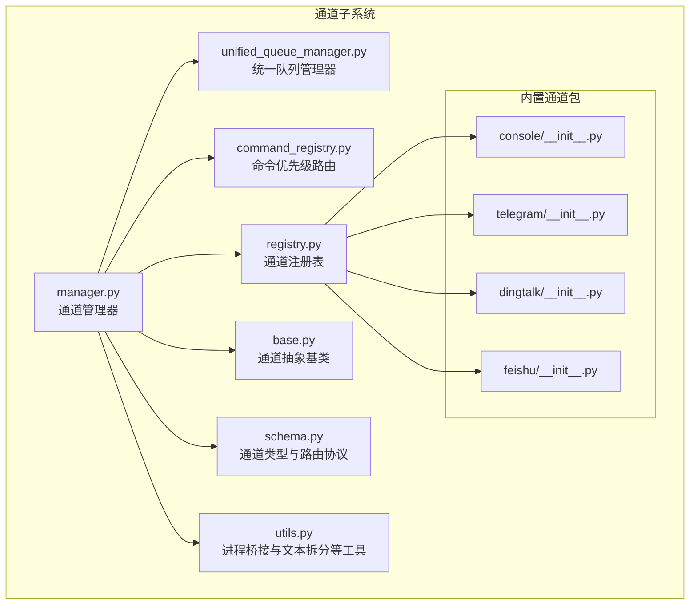
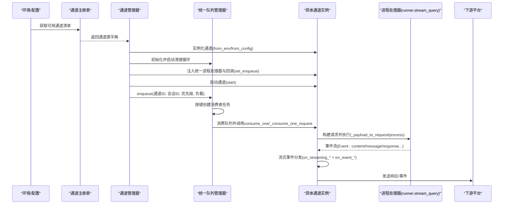
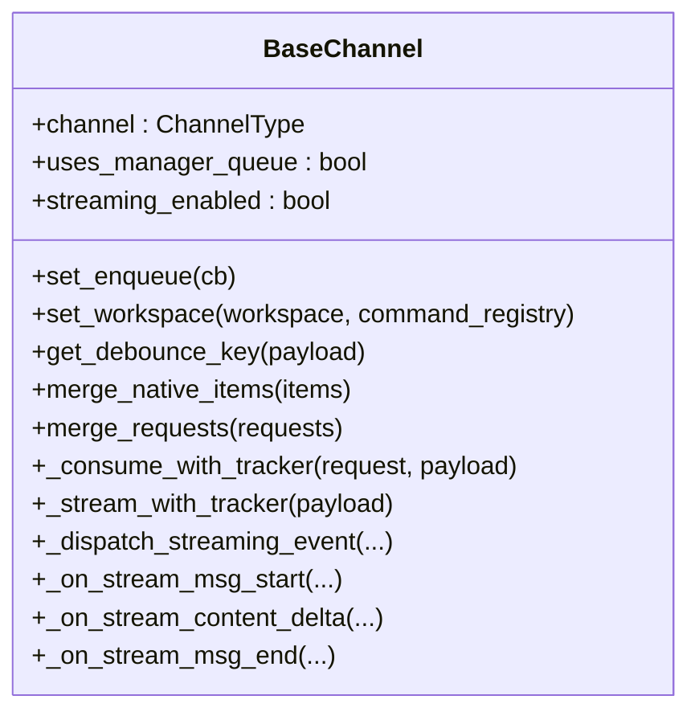
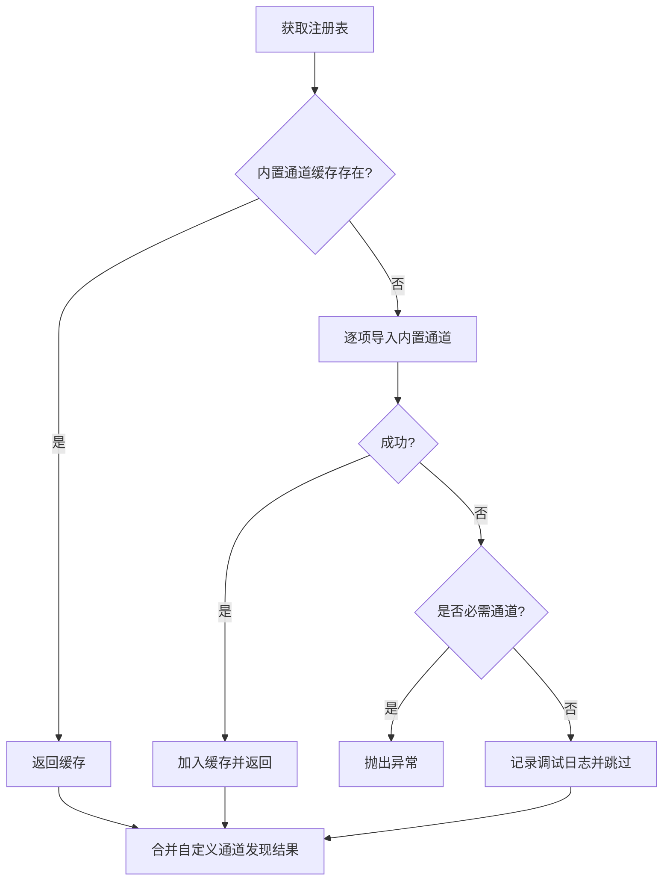
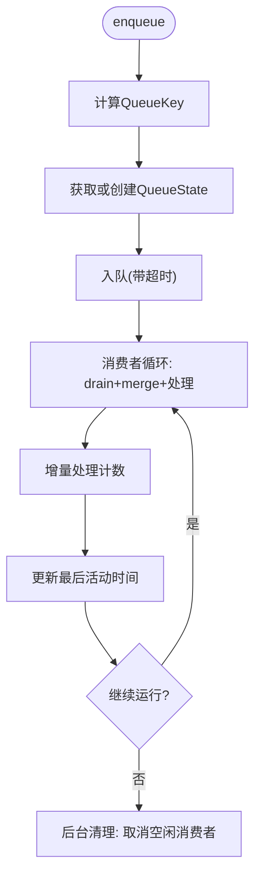
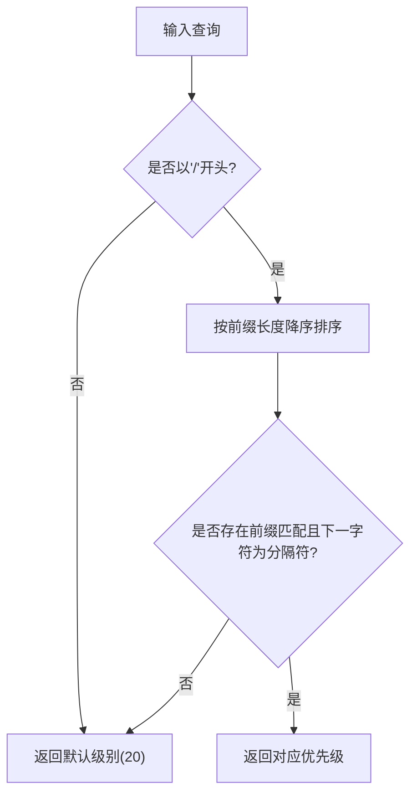
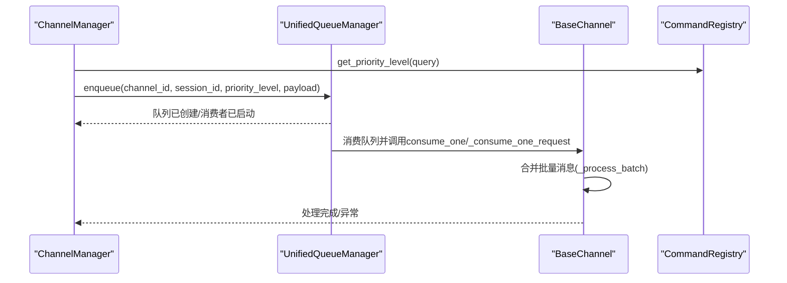
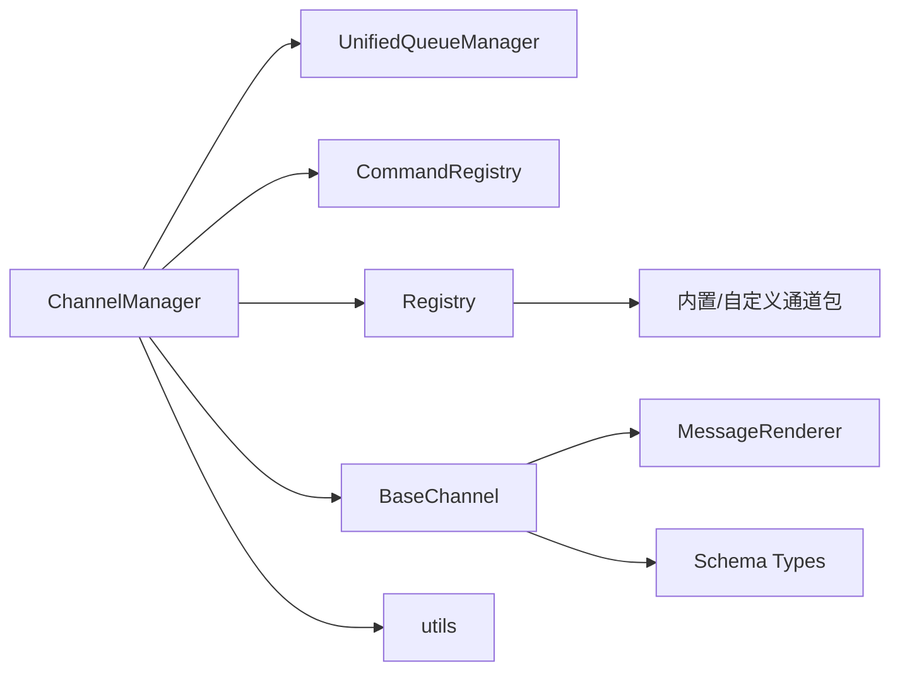

# 通道管理器

<cite>
**本文引用的文件**
- [src/qwenpaw/app/channels/manager.py](file://src/qwenpaw/app/channels/manager.py)
- [src/qwenpaw/app/channels/base.py](file://src/qwenpaw/app/channels/base.py)
- [src/qwenpaw/app/channels/registry.py](file://src/qwenpaw/app/channels/registry.py)
- [src/qwenpaw/app/channels/schema.py](file://src/qwenpaw/app/channels/schema.py)
- [src/qwenpaw/app/channels/unified_queue_manager.py](file://src/qwenpaw/app/channels/unified_queue_manager.py)
- [src/qwenpaw/app/channels/command_registry.py](file://src/qwenpaw/app/channels/command_registry.py)
- [src/qwenpaw/app/channels/utils.py](file://src/qwenpaw/app/channels/utils.py)
- [src/qwenpaw/app/channels/console/__init__.py](file://src/qwenpaw/app/channels/console/__init__.py)
- [src/qwenpaw/app/channels/telegram/__init__.py](file://src/qwenpaw/app/channels/telegram/__init__.py)
- [src/qwenpaw/app/channels/dingtalk/__init__.py](file://src/qwenpaw/app/channels/dingtalk/__init__.py)
- [src/qwenpaw/app/channels/feishu/__init__.py](file://src/qwenpaw/app/channels/feishu/__init__.py)
</cite>

## 目录
1. [简介](#简介)
2. [项目结构](#项目结构)
3. [核心组件](#核心组件)
4. [架构总览](#架构总览)
5. [详细组件分析](#详细组件分析)
6. [依赖分析](#依赖分析)
7. [性能考虑](#性能考虑)
8. [故障排查指南](#故障排查指南)
9. [结论](#结论)
10. [附录：新通道开发指南与集成示例](#附录新通道开发指南与集成示例)

## 简介
本文件面向“通道管理器（ChannelManager）”的全面技术文档，聚焦于其在多平台消息通道上的统一接入、消息路由与分发、生命周期管理、健康检查与重启策略、以及适配器模式下的平台特定实现。文档同时覆盖通道抽象基类的设计理念、通道注册表的管理方式、统一队列管理器的并发隔离与清理机制、命令优先级路由、以及安全与权限控制等关键主题，并提供新通道开发指南与集成示例。

## 项目结构
通道子系统位于应用层的 channels 包中，采用“抽象基类 + 注册表 + 统一队列”的架构组织，辅以命令优先级路由与工具函数桥接 Runner 流程。典型目录关系如下：

图表来源
- [src/qwenpaw/app/channels/manager.py:68-110](file://src/qwenpaw/app/channels/manager.py#L68-L110)
- [src/qwenpaw/app/channels/base.py:78-138](file://src/qwenpaw/app/channels/base.py#L78-L138)
- [src/qwenpaw/app/channels/registry.py:20-37](file://src/qwenpaw/app/channels/registry.py#L20-L37)
- [src/qwenpaw/app/channels/schema.py:12-46](file://src/qwenpaw/app/channels/schema.py#L12-L46)
- [src/qwenpaw/app/channels/unified_queue_manager.py:60-78](file://src/qwenpaw/app/channels/unified_queue_manager.py#L60-L78)
- [src/qwenpaw/app/channels/command_registry.py:23-41](file://src/qwenpaw/app/channels/command_registry.py#L23-L41)
- [src/qwenpaw/app/channels/utils.py:261-274](file://src/qwenpaw/app/channels/utils.py#L261-L274)
- [src/qwenpaw/app/channels/console/__init__.py:1-6](file://src/qwenpaw/app/channels/console/__init__.py#L1-L6)
- [src/qwenpaw/app/channels/telegram/__init__.py:1-6](file://src/qwenpaw/app/channels/telegram/__init__.py#L1-L6)
- [src/qwenpaw/app/channels/dingtalk/__init__.py:1-6](file://src/qwenpaw/app/channels/dingtalk/__init__.py#L1-L6)
- [src/qwenpaw/app/channels/feishu/__init__.py:1-6](file://src/qwenpaw/app/channels/feishu/__init__.py#L1-L6)

章节来源
- [src/qwenpaw/app/channels/manager.py:68-110](file://src/qwenpaw/app/channels/manager.py#L68-L110)
- [src/qwenpaw/app/channels/registry.py:20-37](file://src/qwenpaw/app/channels/registry.py#L20-L37)

## 核心组件
- 通道抽象基类 BaseChannel：定义统一的消息消费契约、会话去抖、内容合并、流式事件分发、渲染与序列化、权限与提及策略等通用能力。
- 通道注册表 Registry：集中加载内置通道与自定义通道，支持缓存与动态发现，提供路由钩子注册。
- 统一队列管理器 UnifiedQueueManager：基于三元键（通道ID、会话ID、优先级）的按需消费者模型，支持并发隔离、自动清理与指标采集。
- 命令优先级路由 CommandRegistry：将用户查询映射到优先级级别，用于统一队列的路由与调度。
- 通道管理器 ChannelManager：负责从环境或配置创建通道实例、注入统一进程处理器、启动/停止通道、替换通道、发送事件与文本、健康检查与重启。
- 工具模块 utils：提供进程桥接工厂、文本拆分、本地文件URL解析等辅助能力。

章节来源
- [src/qwenpaw/app/channels/base.py:78-138](file://src/qwenpaw/app/channels/base.py#L78-L138)
- [src/qwenpaw/app/channels/registry.py:191-196](file://src/qwenpaw/app/channels/registry.py#L191-L196)
- [src/qwenpaw/app/channels/unified_queue_manager.py:60-78](file://src/qwenpaw/app/channels/unified_queue_manager.py#L60-L78)
- [src/qwenpaw/app/channels/command_registry.py:23-41](file://src/qwenpaw/app/channels/command_registry.py#L23-L41)
- [src/qwenpaw/app/channels/manager.py:68-110](file://src/qwenpaw/app/channels/manager.py#L68-L110)
- [src/qwenpaw/app/channels/utils.py:261-274](file://src/qwenpaw/app/channels/utils.py#L261-L274)

## 架构总览
通道管理器通过统一的进程处理器（Runner 的流式查询接口）将平台原生消息转换为统一请求，再经由统一队列进行按会话与优先级的并发隔离处理，最终调用各通道的具体实现完成发送与事件分发。

图表来源
- [src/qwenpaw/app/channels/manager.py:90-110](file://src/qwenpaw/app/channels/manager.py#L90-L110)
- [src/qwenpaw/app/channels/manager.py:462-493](file://src/qwenpaw/app/channels/manager.py#L462-L493)
- [src/qwenpaw/app/channels/unified_queue_manager.py:119-164](file://src/qwenpaw/app/channels/unified_queue_manager.py#L119-L164)
- [src/qwenpaw/app/channels/unified_queue_manager.py:214-273](file://src/qwenpaw/app/channels/unified_queue_manager.py#L214-L273)
- [src/qwenpaw/app/channels/base.py:630-747](file://src/qwenpaw/app/channels/base.py#L630-L747)
- [src/qwenpaw/app/channels/utils.py:261-274](file://src/qwenpaw/app/channels/utils.py#L261-L274)

## 详细组件分析

### 通道抽象基类 BaseChannel
设计理念
- 统一契约：所有通道实现必须提供 consume_one 或 _consume_one_request 的消费入口；通道生命周期由管理器托管。
- 会话与去抖：通过 get_debounce_key 与时间窗口内的合并策略，保证同一会话内消息有序处理。
- 内容与流式：支持多类型内容块、流式事件（reasoning/message）分发，以及非流式回退路径。
- 渲染与序列化：统一消息渲染风格与 SSE 序列化，确保跨通道一致性。
- 安全与权限：支持 DM/群组策略、白名单/黑名单、是否需要被提及等策略。

关键职责
- 消息合并：merge_native_items、merge_requests，支持原生负载与请求的合并。
- 会话去抖：_apply_no_text_debounce、_content_has_text 等，避免空文本消息的重复处理。
- 流式事件分发：_dispatch_streaming_event、_on_stream_msg_start/delta/end，支持思考与消息两类可流式事件。
- 任务跟踪：_consume_with_tracker、_stream_with_tracker，结合工作区的任务追踪器实现取消与幂等。
- 权限与策略：_check_allowlist、_check_group_mention，支持开放/白名单/拒绝提示等策略。

图表来源
- [src/qwenpaw/app/channels/base.py:78-138](file://src/qwenpaw/app/channels/base.py#L78-L138)
- [src/qwenpaw/app/channels/base.py:169-250](file://src/qwenpaw/app/channels/base.py#L169-L250)
- [src/qwenpaw/app/channels/base.py:415-535](file://src/qwenpaw/app/channels/base.py#L415-L535)
- [src/qwenpaw/app/channels/base.py:630-747](file://src/qwenpaw/app/channels/base.py#L630-L747)

章节来源
- [src/qwenpaw/app/channels/base.py:78-138](file://src/qwenpaw/app/channels/base.py#L78-L138)
- [src/qwenpaw/app/channels/base.py:169-250](file://src/qwenpaw/app/channels/base.py#L169-L250)
- [src/qwenpaw/app/channels/base.py:415-535](file://src/qwenpaw/app/channels/base.py#L415-L535)
- [src/qwenpaw/app/channels/base.py:630-747](file://src/qwenpaw/app/channels/base.py#L630-L747)

### 通道注册表 Registry
职责
- 内置通道：通过模块名与类名映射，安全加载，失败仅记录日志（除非是必需通道）。
- 自定义通道：扫描自定义目录，动态导入并注册实现类，支持模块级路由注册钩子。
- 缓存与发现：进程级缓存内置通道，避免重复导入；自定义通道按需发现。

图表来源
- [src/qwenpaw/app/channels/registry.py:82-89](file://src/qwenpaw/app/channels/registry.py#L82-L89)
- [src/qwenpaw/app/channels/registry.py:46-79](file://src/qwenpaw/app/channels/registry.py#L46-L79)
- [src/qwenpaw/app/channels/registry.py:98-131](file://src/qwenpaw/app/channels/registry.py#L98-L131)
- [src/qwenpaw/app/channels/registry.py:191-196](file://src/qwenpaw/app/channels/registry.py#L191-L196)

章节来源
- [src/qwenpaw/app/channels/registry.py:20-37](file://src/qwenpaw/app/channels/registry.py#L20-L37)
- [src/qwenpaw/app/channels/registry.py:82-89](file://src/qwenpaw/app/channels/registry.py#L82-L89)
- [src/qwenpaw/app/channels/registry.py:98-131](file://src/qwenpaw/app/channels/registry.py#L98-L131)
- [src/qwenpaw/app/channels/registry.py:136-190](file://src/qwenpaw/app/channels/registry.py#L136-L190)

### 统一队列管理器 UnifiedQueueManager
特性
- 键隔离：QueueKey=(channel_id, session_id, priority_level)，严格保证同键串行、跨键并发。
- 按需消费者：首次入队时创建队列与消费者任务，避免固定池开销。
- 自动清理：后台清理任务周期扫描空闲队列，超时后取消消费者并回收资源。
- 指标采集：提供队列数量、大小、处理计数、年龄与空闲时长等监控信息。

图表来源
- [src/qwenpaw/app/channels/unified_queue_manager.py:119-164](file://src/qwenpaw/app/channels/unified_queue_manager.py#L119-L164)
- [src/qwenpaw/app/channels/unified_queue_manager.py:165-213](file://src/qwenpaw/app/channels/unified_queue_manager.py#L165-L213)
- [src/qwenpaw/app/channels/unified_queue_manager.py:214-273](file://src/qwenpaw/app/channels/unified_queue_manager.py#L214-L273)
- [src/qwenpaw/app/channels/unified_queue_manager.py:376-428](file://src/qwenpaw/app/channels/unified_queue_manager.py#L376-L428)

章节来源
- [src/qwenpaw/app/channels/unified_queue_manager.py:60-78](file://src/qwenpaw/app/channels/unified_queue_manager.py#L60-L78)
- [src/qwenpaw/app/channels/unified_queue_manager.py:119-164](file://src/qwenpaw/app/channels/unified_queue_manager.py#L119-L164)
- [src/qwenpaw/app/channels/unified_queue_manager.py:214-273](file://src/qwenpaw/app/channels/unified_queue_manager.py#L214-L273)
- [src/qwenpaw/app/channels/unified_queue_manager.py:376-428](file://src/qwenpaw/app/channels/unified_queue_manager.py#L376-L428)

### 命令优先级路由 CommandRegistry
功能
- 将用户输入的查询字符串匹配到预定义或自定义的命令前缀，并返回对应的优先级级别（0/10/20/30 或扩展区间）。
- 默认注册控制命令（如 /stop、/daemon 系列），支持短命令别名。
- 提供查询匹配、名称到级别的映射、注册/注销与查询等功能。

图表来源
- [src/qwenpaw/app/channels/command_registry.py:179-222](file://src/qwenpaw/app/channels/command_registry.py#L179-L222)
- [src/qwenpaw/app/channels/command_registry.py:64-93](file://src/qwenpaw/app/channels/command_registry.py#L64-L93)

章节来源
- [src/qwenpaw/app/channels/command_registry.py:23-41](file://src/qwenpaw/app/channels/command_registry.py#L23-L41)
- [src/qwenpaw/app/channels/command_registry.py:64-93](file://src/qwenpaw/app/channels/command_registry.py#L64-L93)
- [src/qwenpaw/app/channels/command_registry.py:179-222](file://src/qwenpaw/app/channels/command_registry.py#L179-L222)

### 通道管理器 ChannelManager
职责
- 创建：from_env/from_config 从注册表与配置生成通道实例，支持启用开关、过滤策略、工作区注入等。
- 路由：使用 CommandRegistry 对查询提取优先级，结合统一队列进行路由与入队。
- 生命周期：start_all/stop_all 启停通道与队列管理器；支持替换通道与单通道重启。
- 健康检查：get_channel_health；事件/文本发送：send_event/send_text。
- 队列操作：clear_queue 清理指定队列。

图表来源
- [src/qwenpaw/app/channels/manager.py:28-66](file://src/qwenpaw/app/channels/manager.py#L28-L66)
- [src/qwenpaw/app/channels/manager.py:286-304](file://src/qwenpaw/app/channels/manager.py#L286-L304)
- [src/qwenpaw/app/channels/manager.py:352-364](file://src/qwenpaw/app/channels/manager.py#L352-L364)
- [src/qwenpaw/app/channels/manager.py:365-461](file://src/qwenpaw/app/channels/manager.py#L365-L461)
- [src/qwenpaw/app/channels/unified_queue_manager.py:119-164](file://src/qwenpaw/app/channels/unified_queue_manager.py#L119-L164)

章节来源
- [src/qwenpaw/app/channels/manager.py:68-110](file://src/qwenpaw/app/channels/manager.py#L68-L110)
- [src/qwenpaw/app/channels/manager.py:111-216](file://src/qwenpaw/app/channels/manager.py#L111-L216)
- [src/qwenpaw/app/channels/manager.py:286-351](file://src/qwenpaw/app/channels/manager.py#L286-L351)
- [src/qwenpaw/app/channels/manager.py:352-461](file://src/qwenpaw/app/channels/manager.py#L352-L461)
- [src/qwenpaw/app/channels/manager.py:462-541](file://src/qwenpaw/app/channels/manager.py#L462-L541)
- [src/qwenpaw/app/channels/manager.py:542-666](file://src/qwenpaw/app/channels/manager.py#L542-L666)
- [src/qwenpaw/app/channels/manager.py:667-703](file://src/qwenpaw/app/channels/manager.py#L667-L703)
- [src/qwenpaw/app/channels/manager.py:704-791](file://src/qwenpaw/app/channels/manager.py#L704-L791)
- [src/qwenpaw/app/channels/manager.py:792-844](file://src/qwenpaw/app/channels/manager.py#L792-L844)

### 工具模块 utils
- 进程桥接：make_process_from_runner 将 Runner 的流式查询作为通道的统一进程处理器。
- 文本拆分：split_text 支持代码围栏与表格的跨块渲染，保障长文本在通道侧的可读性。
- 文件URL解析：file_url_to_local_path 解析 file:// 与本地路径，兼容 Windows 驱动器与 UNC。

章节来源
- [src/qwenpaw/app/channels/utils.py:261-274](file://src/qwenpaw/app/channels/utils.py#L261-L274)
- [src/qwenpaw/app/channels/utils.py:163-211](file://src/qwenpaw/app/channels/utils.py#L163-L211)
- [src/qwenpaw/app/channels/utils.py:214-258](file://src/qwenpaw/app/channels/utils.py#L214-L258)

## 依赖分析
- 组件耦合
  - ChannelManager 依赖 UnifiedQueueManager、CommandRegistry、Registry、BaseChannel 抽象与工具模块。
  - BaseChannel 依赖 MessageRenderer、Schema 中的类型与协议，以及 Workspace 的任务追踪与聊天管理。
  - Registry 与自定义通道模块之间为弱耦合，通过约定的类属性与可选钩子实现扩展。
- 外部依赖
  - Runner 的流式查询接口作为统一进程处理器，贯穿消息从原生到响应的全过程。
  - 平台 SDK/HTTP 客户端由具体通道实现封装，ChannelManager 不直接依赖。

图表来源
- [src/qwenpaw/app/channels/manager.py:21-25](file://src/qwenpaw/app/channels/manager.py#L21-L25)
- [src/qwenpaw/app/channels/base.py:37-39](file://src/qwenpaw/app/channels/base.py#L37-L39)
- [src/qwenpaw/app/channels/registry.py:12-13](file://src/qwenpaw/app/channels/registry.py#L12-L13)
- [src/qwenpaw/app/channels/utils.py:261-274](file://src/qwenpaw/app/channels/utils.py#L261-L274)

章节来源
- [src/qwenpaw/app/channels/manager.py:21-25](file://src/qwenpaw/app/channels/manager.py#L21-L25)
- [src/qwenpaw/app/channels/base.py:37-39](file://src/qwenpaw/app/channels/base.py#L37-L39)
- [src/qwenpaw/app/channels/registry.py:12-13](file://src/qwenpaw/app/channels/registry.py#L12-L13)

## 性能考虑
- 并发隔离：通过三元键隔离，避免跨会话/跨优先级阻塞；同键串行保证一致性。
- 按需消费者：减少固定线程池的资源占用，提升弹性与低负载效率。
- 批量合并：_process_batch 在通道侧对原生/请求进行合并，降低调用次数与网络开销。
- 超时保护：入队与清理均设置超时与取消处理，防止阻塞导致资源泄漏。
- 文本拆分：split_text 保持代码围栏与表格完整性，减少长文本传输失败与重试成本。

## 故障排查指南
常见问题与定位建议
- 通道未初始化/未启动
  - 现象：enqueue 无响应或队列未创建。
  - 排查：确认已调用 start_all；检查注册表可用通道与配置 enabled 开关。
- 入队超时
  - 现象：日志出现“Queue full timeout (30s)”。
  - 排查：检查消费者是否卡住、队列积压、或通道处理耗时过长。
- 通道替换失败
  - 现象：替换通道后旧通道仍在运行或新通道未生效。
  - 排查：确认 replace_channel 的顺序（先 set_enqueue/start，再锁内交换与停止旧通道）。
- 健康检查异常
  - 现象：get_channel_health 返回异常详情。
  - 排查：查看通道内部 health_check 实现与外部依赖（网络/鉴权/令牌）。
- 流式事件缺失
  - 现象：仅看到完整消息，未见流式增量。
  - 排查：确认通道 streaming_enabled 为 True，且 on_streaming_* 钩子正确实现。

章节来源
- [src/qwenpaw/app/channels/unified_queue_manager.py:145-156](file://src/qwenpaw/app/channels/unified_queue_manager.py#L145-L156)
- [src/qwenpaw/app/channels/manager.py:704-762](file://src/qwenpaw/app/channels/manager.py#L704-L762)
- [src/qwenpaw/app/channels/manager.py:549-578](file://src/qwenpaw/app/channels/manager.py#L549-L578)
- [src/qwenpaw/app/channels/base.py:112-118](file://src/qwenpaw/app/channels/base.py#L112-L118)

## 结论
通道管理器通过“抽象基类 + 注册表 + 统一队列 + 命令优先级”的组合，实现了多平台消息通道的统一接入与高效调度。其设计强调：
- 明确的契约与生命周期管理；
- 严格的会话与优先级隔离；
- 可扩展的平台适配与自定义通道；
- 健壮的错误处理与可观测性。

该架构既满足了高并发场景下的吞吐需求，又提供了清晰的扩展点，便于新增平台与增强功能。

## 附录：新通道开发指南与集成示例

### 设计理念与适配器模式
- 适配器模式：每个平台通道实现 BaseChannel 的 consume_one/_consume_one_request 与必要的转换方法，统一接入统一队列与进程处理器。
- 最小接口：遵循“原生消息 → AgentRequest → 流式事件 → 平台回复”的最小闭环。
- 可选能力：根据平台支持选择性实现流式事件、去抖合并、权限策略等。

章节来源
- [src/qwenpaw/app/channels/base.py:78-138](file://src/qwenpaw/app/channels/base.py#L78-L138)
- [src/qwenpaw/app/channels/base.py:630-747](file://src/qwenpaw/app/channels/base.py#L630-L747)

### 开发步骤
- 新建通道类
  - 继承 BaseChannel，实现构造参数与必要方法（如 from_config/from_env、start/stop、consume_one/_consume_one_request、send_content_parts/send_event 等）。
  - 设置 channel 字段与 uses_manager_queue（若使用统一队列）。
- 注册与发现
  - 若为内置通道，完善 registry 中的模块与类映射；若为自定义通道，放置于自定义通道目录，确保模块导出类继承 BaseChannel 且具备 channel 属性。
- 配置与启用
  - 在配置中启用该通道并设置必要参数；ChannelManager 会自动加载。
- 集成测试
  - 使用统一队列与进程处理器验证消息流转、流式事件、去抖与合并逻辑。

章节来源
- [src/qwenpaw/app/channels/registry.py:20-37](file://src/qwenpaw/app/channels/registry.py#L20-L37)
- [src/qwenpaw/app/channels/registry.py:98-131](file://src/qwenpaw/app/channels/registry.py#L98-L131)
- [src/qwenpaw/app/channels/manager.py:111-216](file://src/qwenpaw/app/channels/manager.py#L111-L216)

### 平台特定实现要点
- 会话与去抖
  - 正确实现 get_debounce_key，确保同一会话的消息在时间窗口内合并。
- 权限与策略
  - 实现 DM/群组策略、白名单/黑名单、是否需要被提及等策略。
- 流式事件
  - 若平台支持实时增量，开启 streaming_enabled 并实现 on_streaming_* 钩子。
- 健康检查
  - 实现 health_check 以便 ChannelManager 进行健康评估。

章节来源
- [src/qwenpaw/app/channels/base.py:173-187](file://src/qwenpaw/app/channels/base.py#L173-L187)
- [src/qwenpaw/app/channels/base.py:324-358](file://src/qwenpaw/app/channels/base.py#L324-L358)
- [src/qwenpaw/app/channels/base.py:112-118](file://src/qwenpaw/app/channels/base.py#L112-L118)
- [src/qwenpaw/app/channels/base.py:89-111](file://src/qwenpaw/app/channels/base.py#L89-L111)

### 安全与认证机制
- 认证：通道实现应自行处理平台的鉴权（如 Token、OAuth、二维码登录等），并在健康检查中体现。
- 权限：通过 BaseChannel 的策略接口限制来源与消息类型。
- 事件安全：统一事件序列化与转义，避免注入风险。

章节来源
- [src/qwenpaw/app/channels/base.py:415-535](file://src/qwenpaw/app/channels/base.py#L415-L535)
- [src/qwenpaw/app/channels/base.py:778-799](file://src/qwenpaw/app/channels/base.py#L778-L799)

### 集成示例（概念流程）
- 控制命令优先级
  - 用户输入“/stop”，CommandRegistry 匹配为 critical(0)，统一队列优先处理。
- 文本拆分与发送
  - 长文本经 split_text 拆分为多块，逐块发送至平台。
- 事件分发
  - 流式事件与完成事件分别进入流式与非流式路径，确保 UI 与客户端一致体验。

章节来源
- [src/qwenpaw/app/channels/command_registry.py:179-222](file://src/qwenpaw/app/channels/command_registry.py#L179-L222)
- [src/qwenpaw/app/channels/utils.py:163-211](file://src/qwenpaw/app/channels/utils.py#L163-L211)
- [src/qwenpaw/app/channels/base.py:630-747](file://src/qwenpaw/app/channels/base.py#L630-L747)