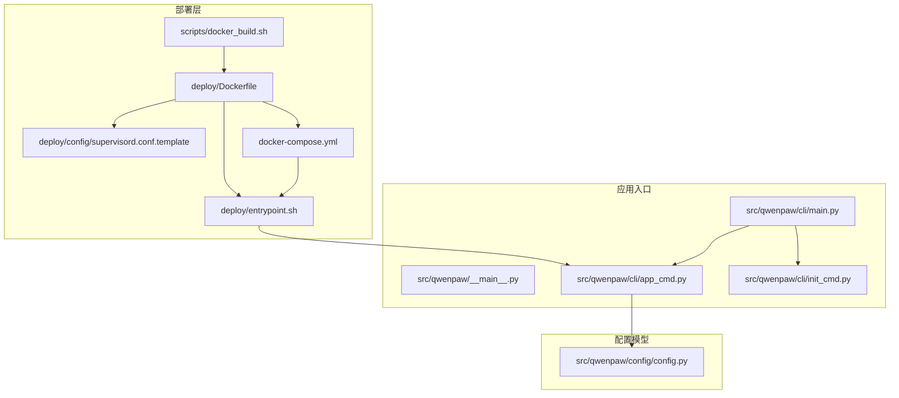
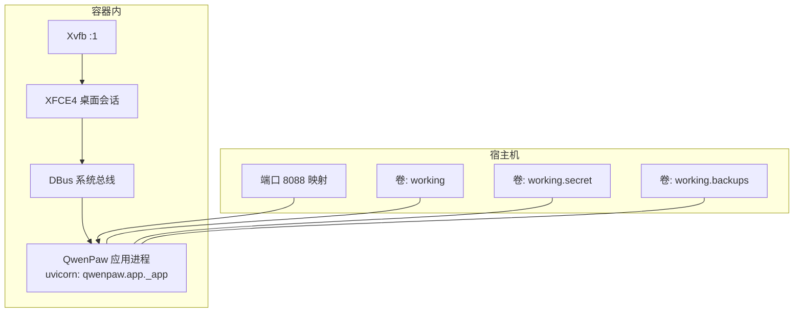
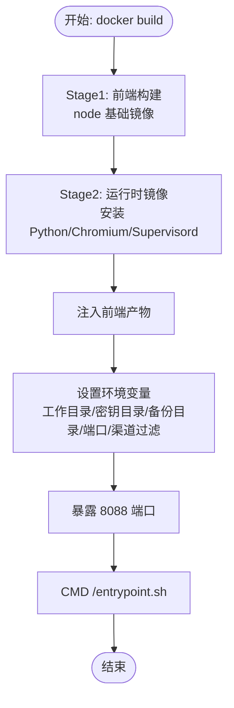
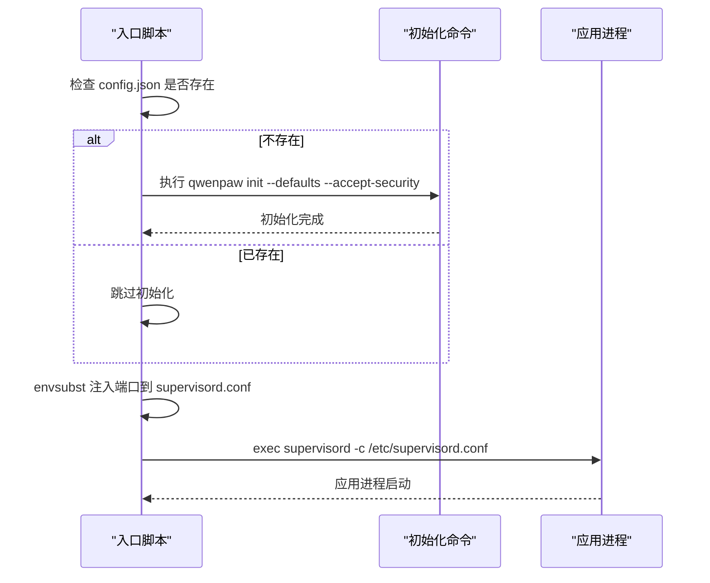
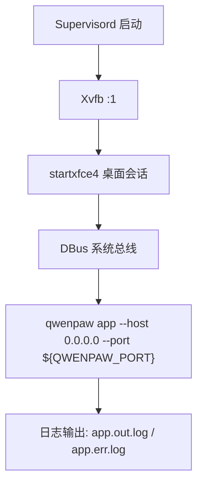
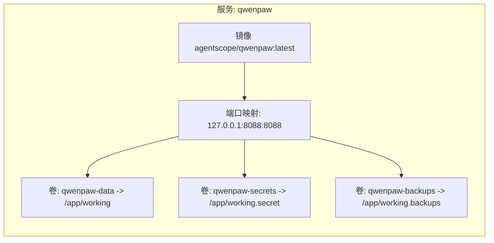
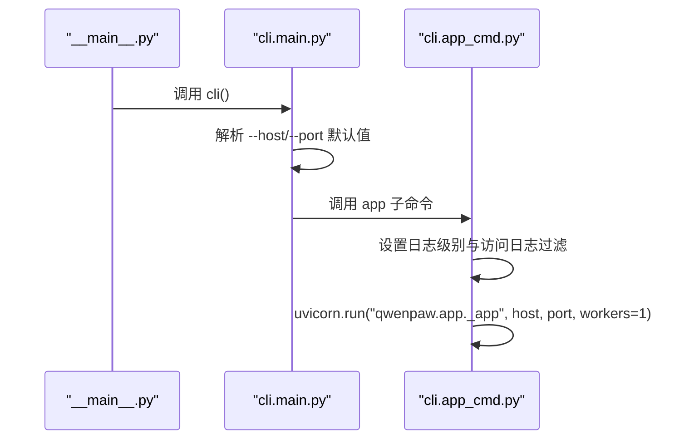
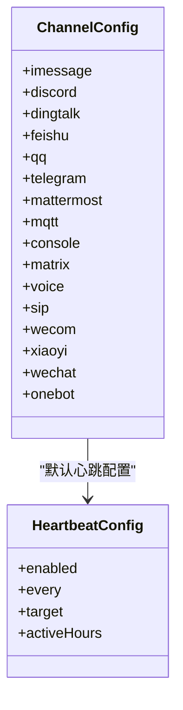
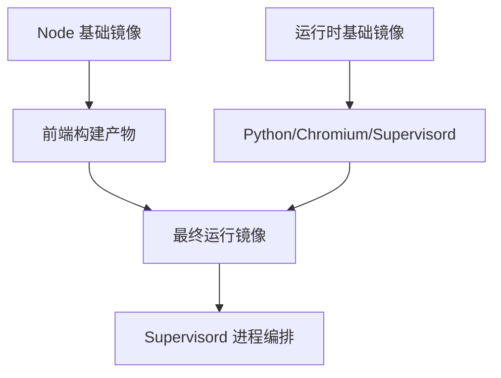
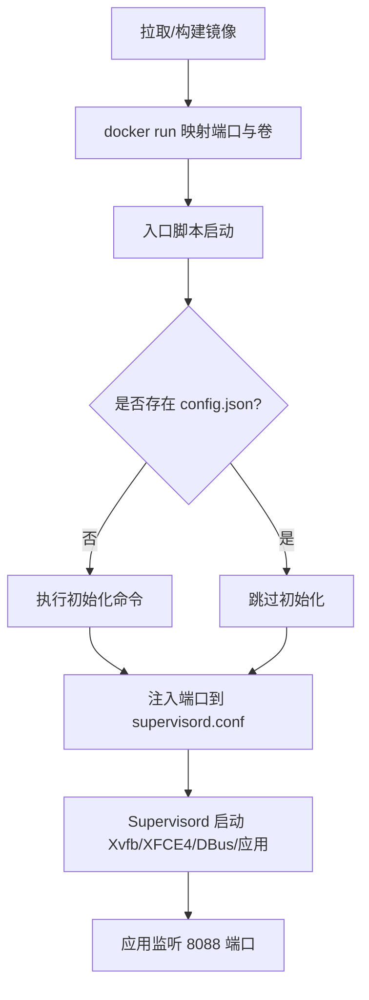

# 部署架构

<cite>
**本文引用的文件**
- [Dockerfile](file://deploy/Dockerfile)
- [docker-compose.yml](file://docker-compose.yml)
- [supervisord.conf.template](file://deploy/config/supervisord.conf.template)
- [entrypoint.sh](file://deploy/entrypoint.sh)
- [scripts/docker_build.sh](file://scripts/docker_build.sh)
- [src/qwenpaw/cli/main.py](file://src/qwenpaw/cli/main.py)
- [src/qwenpaw/cli/app_cmd.py](file://src/qwenpaw/cli/app_cmd.py)
- [src/qwenpaw/cli/init_cmd.py](file://src/qwenpaw/cli/init_cmd.py)
- [src/qwenpaw/config/config.py](file://src/qwenpaw/config/config.py)
- [src/qwenpaw/__main__.py](file://src/qwenpaw/__main__.py)
</cite>

## 目录
1. [简介](#简介)
2. [项目结构](#项目结构)
3. [核心组件](#核心组件)
4. [架构总览](#架构总览)
5. [详细组件分析](#详细组件分析)
6. [依赖分析](#依赖分析)
7. [性能考虑](#性能考虑)
8. [故障排查指南](#故障排查指南)
9. [结论](#结论)
10. [附录](#附录)

## 简介
本文件面向运维与平台工程团队，系统性阐述 QwenPaw 的部署架构与实施路径，覆盖容器化单机部署、基于 Compose 的本地编排以及可扩展到集群的部署模式建议。重点说明以下方面：
- 容器化策略：多阶段构建、运行时依赖、环境变量与端口暴露
- 服务编排：Supervisord 启动顺序与进程管理、桌面虚拟化支持
- 资源配置：工作目录、密钥目录、备份目录与持久化卷
- 高可用与灾难恢复：单实例稳定性与数据保护建议
- 监控与告警：访问日志过滤、健康检查与日志采集
- 部署流程图与架构图：映射到实际源码与脚本

## 项目结构
下图展示与部署相关的核心文件及其在整体中的位置关系。

**图表来源**
- [Dockerfile:1-105](file://deploy/Dockerfile#L1-L105)
- [entrypoint.sh:1-21](file://deploy/entrypoint.sh#L1-L21)
- [supervisord.conf.template:1-40](file://deploy/config/supervisord.conf.template#L1-L40)
- [docker-compose.yml:1-26](file://docker-compose.yml#L1-L26)
- [scripts/docker_build.sh:1-32](file://scripts/docker_build.sh#L1-L32)
- [src/qwenpaw/__main__.py:1-7](file://src/qwenpaw/__main__.py#L1-L7)
- [src/qwenpaw/cli/main.py:1-173](file://src/qwenpaw/cli/main.py#L1-L173)
- [src/qwenpaw/cli/app_cmd.py:1-112](file://src/qwenpaw/cli/app_cmd.py#L1-L112)
- [src/qwenpaw/cli/init_cmd.py:1-523](file://src/qwenpaw/cli/init_cmd.py#L1-L523)
- [src/qwenpaw/config/config.py:1-800](file://src/qwenpaw/config/config.py#L1-L800)

**章节来源**
- [Dockerfile:1-105](file://deploy/Dockerfile#L1-L105)
- [docker-compose.yml:1-26](file://docker-compose.yml#L1-L26)

## 核心组件
- 容器镜像与多阶段构建
  - 前端构建阶段：使用 Node 基础镜像构建控制台前端产物，并注入到最终运行镜像中
  - 运行时阶段：安装 Python、Chromium、Supervisord 等依赖，启用无头浏览器与桌面虚拟化支持
  - 环境变量：定义工作目录、密钥目录、备份目录与默认端口
  - 渠道过滤：通过环境变量支持白名单或黑名单方式控制渠道启用
- 入口脚本与初始化
  - 启动前检测配置文件是否存在，缺失时自动执行初始化流程（生成配置、技能、心跳任务等）
  - 使用 envsubst 将端口注入模板，启动 Supervisord
- Supervisord 编排
  - 启动顺序：Xvfb → XFCE4 → DBus → 应用进程
  - 应用进程：调用 qwenpaw app 子命令，绑定 0.0.0.0 与指定端口
  - 日志与优先级：按顺序输出日志，便于问题定位
- Compose 编排
  - 默认仅映射回环地址，便于本地安全访问
  - 绑定三个命名卷：工作区、密钥区、备份区
- CLI 与应用启动
  - CLI 支持 --host/--port 参数，默认回环地址与 8088 端口
  - app 子命令以 uvicorn 运行 FastAPI 应用，支持日志级别与访问日志过滤

**章节来源**
- [Dockerfile:1-105](file://deploy/Dockerfile#L1-L105)
- [entrypoint.sh:1-21](file://deploy/entrypoint.sh#L1-L21)
- [supervisord.conf.template:1-40](file://deploy/config/supervisord.conf.template#L1-L40)
- [docker-compose.yml:1-26](file://docker-compose.yml#L1-L26)
- [src/qwenpaw/cli/main.py:148-173](file://src/qwenpaw/cli/main.py#L148-L173)
- [src/qwenpaw/cli/app_cmd.py:55-112](file://src/qwenpaw/cli/app_cmd.py#L55-L112)
- [src/qwenpaw/cli/init_cmd.py:138-523](file://src/qwenpaw/cli/init_cmd.py#L138-L523)

## 架构总览
下图展示容器内进程编排与外部访问路径，映射到实际的模板与脚本。

**图表来源**
- [supervisord.conf.template:14-40](file://deploy/config/supervisord.conf.template#L14-L40)
- [docker-compose.yml:11-26](file://docker-compose.yml#L11-L26)
- [entrypoint.sh:16-20](file://deploy/entrypoint.sh#L16-L20)

## 详细组件分析

### 容器化与镜像构建
- 多阶段构建
  - 前端构建阶段：复制 console 目录，执行依赖安装与打包，产物注入运行镜像
  - 运行镜像：安装 Python、Chromium、Supervisord、Xvfb、XFCE4 及相关字体与依赖；禁用浏览器沙箱标志；设置 PLAYWRIGHT_* 环境变量以复用系统浏览器
- 环境变量与端口
  - 工作目录、密钥目录、备份目录均通过环境变量定义
  - 默认监听 8088 端口，可通过环境变量覆盖
  - 渠道过滤：支持 QWENPAW_DISABLED_CHANNELS 或 QWENPAW_ENABLED_CHANNELS
- 构建脚本
  - 提供 docker_build.sh，支持自定义渠道白/黑名单与额外构建参数

**图表来源**
- [Dockerfile:1-105](file://deploy/Dockerfile#L1-L105)

**章节来源**
- [Dockerfile:1-105](file://deploy/Dockerfile#L1-L105)
- [scripts/docker_build.sh:1-32](file://scripts/docker_build.sh#L1-L32)

### 启动流程与初始化
- 入口脚本
  - 若工作目录缺少配置文件，则自动执行初始化命令，生成默认配置、技能与心跳任务
  - 将端口注入 Supervisord 模板并启动 supervisord
- 初始化命令
  - 交互式/默认模式创建配置、选择语言、音频模式、转录提供商
  - 配置渠道、LLM 提供者与技能集合
  - 复制多语言 MD 文件至工作区，生成 HEARTBEAT.md

**图表来源**
- [entrypoint.sh:6-20](file://deploy/entrypoint.sh#L6-L20)
- [src/qwenpaw/cli/init_cmd.py:138-523](file://src/qwenpaw/cli/init_cmd.py#L138-L523)

**章节来源**
- [entrypoint.sh:1-21](file://deploy/entrypoint.sh#L1-L21)
- [src/qwenpaw/cli/init_cmd.py:138-523](file://src/qwenpaw/cli/init_cmd.py#L138-L523)

### 进程编排与桌面虚拟化
- Supervisord 程序顺序
  - Xvfb → XFCE4 → DBus → 应用
  - 应用进程绑定 0.0.0.0 与指定端口，设置 DISPLAY 环境变量
- 日志与可观测性
  - 每个程序输出独立日志文件，便于定位启动失败与异常
- 浏览器与桌面支持
  - Chromium 以无沙箱模式运行，Playwright 使用系统浏览器
  - 通过 Xvfb 提供虚拟显示，XFCE4 提供桌面会话

**图表来源**
- [supervisord.conf.template:14-40](file://deploy/config/supervisord.conf.template#L14-L40)

**章节来源**
- [supervisord.conf.template:1-40](file://deploy/config/supervisord.conf.template#L1-L40)

### Compose 编排与持久化
- 单节点编排
  - 默认仅映射回环地址，避免外网暴露
  - 绑定三个命名卷：工作区、密钥区、备份区
- 端口与环境
  - 端口映射示例：127.0.0.1:8088:8088
  - 可选开启认证与自定义凭据（注释示例）

**图表来源**
- [docker-compose.yml:11-26](file://docker-compose.yml#L11-L26)

**章节来源**
- [docker-compose.yml:1-26](file://docker-compose.yml#L1-L26)

### CLI 与应用启动
- CLI 入口
  - 通过 __main__.py 调用 CLI 主函数，支持 --host/--port 参数
- 应用子命令
  - app 子命令以 uvicorn 运行 FastAPI 应用，支持日志级别与访问日志过滤
  - 写入最近一次 API 地址，兼容浏览器控制逻辑

**图表来源**
- [src/qwenpaw/__main__.py:1-7](file://src/qwenpaw/__main__.py#L1-L7)
- [src/qwenpaw/cli/main.py:148-173](file://src/qwenpaw/cli/main.py#L148-L173)
- [src/qwenpaw/cli/app_cmd.py:55-112](file://src/qwenpaw/cli/app_cmd.py#L55-L112)

**章节来源**
- [src/qwenpaw/__main__.py:1-7](file://src/qwenpaw/__main__.py#L1-L7)
- [src/qwenpaw/cli/main.py:148-173](file://src/qwenpaw/cli/main.py#L148-L173)
- [src/qwenpaw/cli/app_cmd.py:55-112](file://src/qwenpaw/cli/app_cmd.py#L55-L112)

### 配置模型与渠道能力
- 配置模型
  - 包含 ACP、通道配置、心跳、记忆与上下文压缩、工具结果修剪等
  - 通道配置覆盖 Discord、钉钉、飞书、QQ、Telegram、MQTT、Console、Matrix、语音/SIP、企业微信、小艺、微信、OneBot 等
- 渠道过滤
  - 通过环境变量实现白/黑名单，便于裁剪渠道能力

**图表来源**
- [src/qwenpaw/config/config.py:431-470](file://src/qwenpaw/config/config.py#L431-L470)

**章节来源**
- [src/qwenpaw/config/config.py:191-470](file://src/qwenpaw/config/config.py#L191-L470)

## 依赖分析
- 容器镜像依赖
  - Node 基础镜像用于前端构建
  - 运行时基础镜像包含 Python、Chromium、Supervisord、Xvfb、XFCE4
- 进程依赖
  - Xvfb → XFCE4 → DBus → 应用，严格顺序保证桌面与浏览器可用
- 外部集成
  - Playwright 使用系统 Chromium，避免重复下载
  - 通过环境变量控制渠道启用范围

**图表来源**
- [Dockerfile:1-105](file://deploy/Dockerfile#L1-L105)
- [supervisord.conf.template:14-40](file://deploy/config/supervisord.conf.template#L14-L40)

**章节来源**
- [Dockerfile:1-105](file://deploy/Dockerfile#L1-L105)
- [supervisord.conf.template:1-40](file://deploy/config/supervisord.conf.template#L1-L40)

## 性能考虑
- 进程与并发
  - 应用始终以单进程运行，避免多进程带来的状态共享复杂度
- 浏览器与桌面
  - Chromium 无沙箱模式提升容器内可用性；如需更高安全性，可在宿主侧限制网络与权限
- 日志与可观测性
  - 访问日志可隐藏特定路径，降低噪音；独立日志文件便于定位问题
- 资源规划
  - 单机部署建议至少 2C4G，推荐 4C8G 以支持更多并发与工具调用

[本节为通用指导，不直接分析具体文件]

## 故障排查指南
- 启动失败
  - 检查 supervisord 日志：Xvfb、DBus、应用进程的日志文件
  - 确认 DISPLAY 环境变量与端口映射正确
- 配置缺失
  - 入口脚本会在工作目录缺少配置时自动初始化；若未触发，请确认挂载卷与权限
- 渠道不可用
  - 检查渠道过滤环境变量与对应凭据配置
- 访问日志噪声
  - 使用 app 子命令的访问日志过滤选项，隐藏敏感路径

**章节来源**
- [entrypoint.sh:1-21](file://deploy/entrypoint.sh#L1-L21)
- [supervisord.conf.template:1-40](file://deploy/config/supervisord.conf.template#L1-L40)
- [src/qwenpaw/cli/app_cmd.py:98-102](file://src/qwenpaw/cli/app_cmd.py#L98-L102)

## 结论
QwenPaw 的部署架构以“容器 + Supervisord + uvicorn”为核心，结合多阶段构建与桌面虚拟化，满足本地开发与生产单实例稳定运行的需求。通过卷管理保障数据持久化，通过环境变量灵活控制渠道与端口。建议在生产环境中配合反向代理、健康检查与集中日志采集，进一步增强可观测性与安全性。

[本节为总结性内容，不直接分析具体文件]

## 附录

### 部署流程图（容器化单机）

**图表来源**
- [docker-compose.yml:11-26](file://docker-compose.yml#L11-L26)
- [entrypoint.sh:6-20](file://deploy/entrypoint.sh#L6-L20)
- [supervisord.conf.template:14-40](file://deploy/config/supervisord.conf.template#L14-L40)

### 集群部署模式建议
- 当前仓库提供 Compose 单实例编排；若需扩展到集群，建议：
  - 使用官方镜像与 Compose 文件作为基线
  - 在集群入口处添加反向代理与 TLS 终止
  - 采用持久卷或对象存储对接备份目录
  - 通过环境变量与配置文件分环境管理（开发/测试/生产）
  - 配置健康检查与滚动更新策略

[本节为概念性建议，不直接分析具体文件]