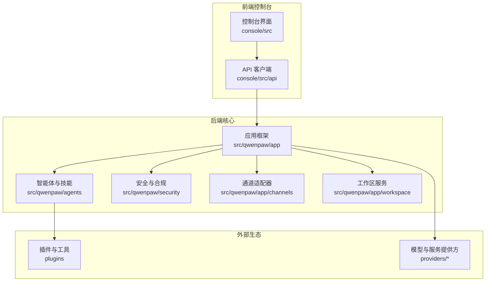
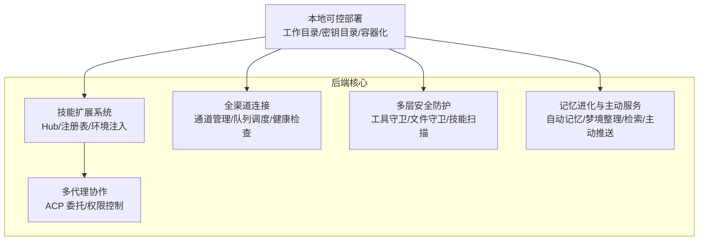
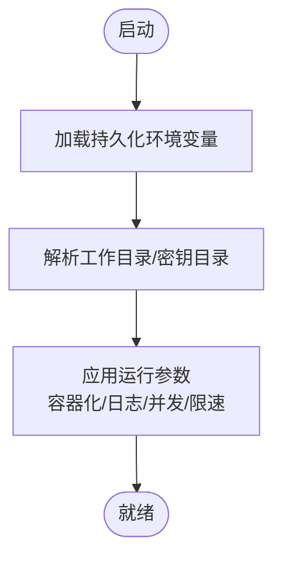
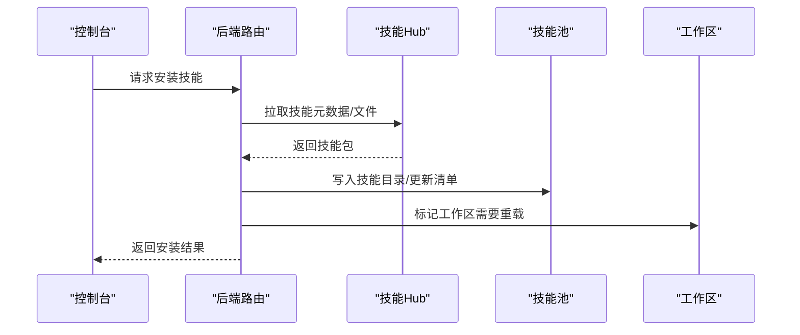
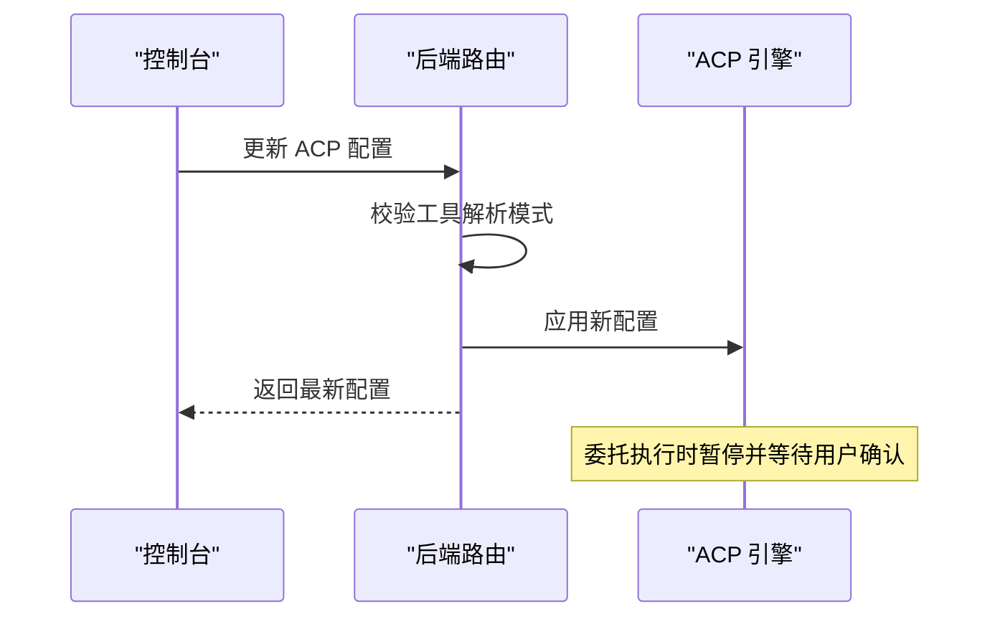
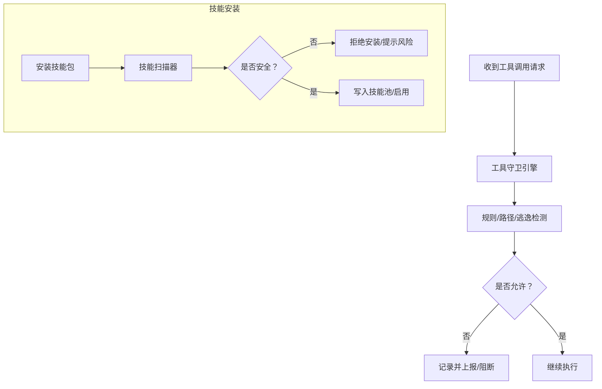
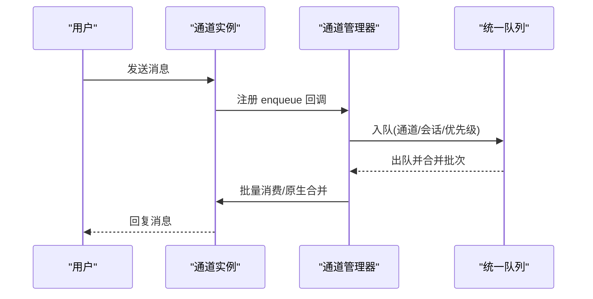
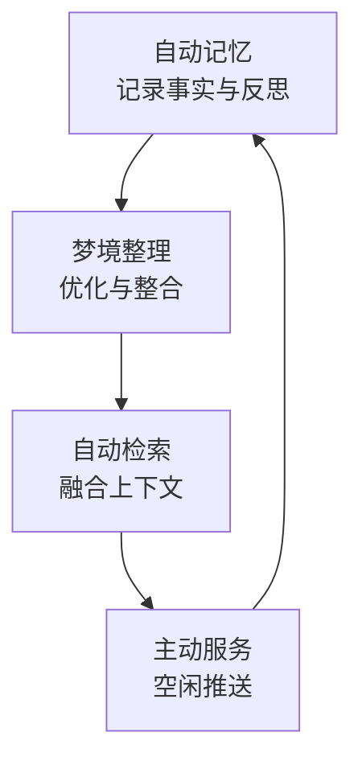
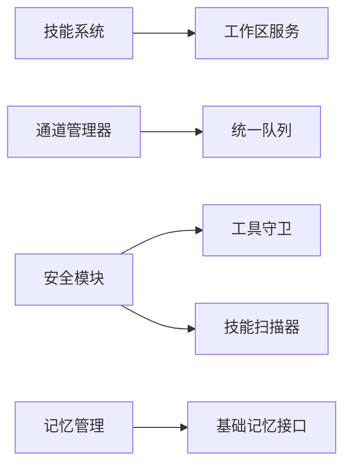

# 核心特性

<cite>
**本文引用的文件**
- [README.md](file://README.md)
- [__init__.py](file://src/qwenpaw/__init__.py)
- [constant.py](file://src/qwenpaw/constant.py)
- [hub.py](file://src/qwenpaw/agents/skill_system/hub.py)
- [registry.py](file://src/qwenpaw/agents/skill_system/registry.py)
- [base_memory_manager.py](file://src/qwenpaw/agents/memory/base_memory_manager.py)
- [engine.py](file://src/qwenpaw/security/tool_guard/engine.py)
- [scanner.py](file://src/qwenpaw/security/skill_scanner/scanner.py)
- [manager.py](file://src/qwenpaw/app/channels/manager.py)
- [service_manager.py](file://src/qwenpaw/app/workspace/service_manager.py)
- [acp.ts](file://console/src/api/modules/acp.ts)
- [config.py](file://src/qwenpaw/app/routers/config.py)
- [skills.py](file://src/qwenpaw/app/routers/skills.py)
- [agents.py](file://src/qwenpaw/app/routers/agents.py)
- [memory-evolving-and-proactive.en.md](file://website/public/docs/memory-evolving-and-proactive.en.md)
</cite>

## 目录
1. [简介](#简介)
2. [项目结构](#项目结构)
3. [核心组件](#核心组件)
4. [架构总览](#架构总览)
5. [详细组件分析](#详细组件分析)
6. [依赖关系分析](#依赖关系分析)
7. [性能考量](#性能考量)
8. [故障排查指南](#故障排查指南)
9. [结论](#结论)
10. [附录](#附录)

## 简介
本文件围绕 QwenPaw 的六大核心能力展开：本地可控部署、技能扩展系统、多代理协作、多层安全防护、全渠道连接、记忆进化与主动服务。我们将从系统架构、组件关系、数据流、处理逻辑、集成点、错误处理与性能特征等维度进行深入解析，并结合仓库中的真实实现路径，给出可操作的配置与使用建议，帮助读者快速构建个性化 AI 助手解决方案。

## 项目结构
QwenPaw 采用“后端 Python 包 + 前端控制台 + 插件生态 + 多通道适配”的分层设计：
- 后端核心位于 src/qwenpaw，包含应用框架、工作区管理、通道管理、安全扫描、技能系统、内存管理等模块。
- 控制台前端位于 console，提供 Web 界面与 API 调用。
- 插件与工具位于 plugins，支持第三方能力扩展。
- 文档与网站资源位于 website/public/docs，提供特性说明与最佳实践。

图示来源
- [__init__.py](file://src/qwenpaw/__init__.py)
- [constant.py](file://src/qwenpaw/constant.py)

章节来源
- [README.md](file://README.md)
- [__init__.py](file://src/qwenpaw/__init__.py)
- [constant.py](file://src/qwenpaw/constant.py)

## 核心组件
- 技能扩展系统：内置技能池、云端技能 Hub、安装与冲突处理、运行时注入环境变量。
- 多代理协作：基于 ACP（Agent Collaboration Protocol）的委托执行与权限控制。
- 多层安全防护：工具调用守卫、文件访问控制、技能安全扫描、认证与授权。
- 全渠道连接：统一通道管理器、队列调度、健康检查与动态重启。
- 记忆进化与主动服务：自动记忆、梦境整理、检索增强、主动推送。
- 本地可控部署：工作目录与密钥目录、容器化、日志与运行参数。

章节来源
- [hub.py](file://src/qwenpaw/agents/skill_system/hub.py)
- [registry.py](file://src/qwenpaw/agents/skill_system/registry.py)
- [engine.py](file://src/qwenpaw/security/tool_guard/engine.py)
- [scanner.py](file://src/qwenpaw/security/skill_scanner/scanner.py)
- [manager.py](file://src/qwenpaw/app/channels/manager.py)
- [base_memory_manager.py](file://src/qwenpaw/agents/memory/base_memory_manager.py)
- [service_manager.py](file://src/qwenpaw/app/workspace/service_manager.py)

## 架构总览
下图展示了六大核心能力在系统中的位置与交互关系：

图示来源
- [constant.py](file://src/qwenpaw/constant.py)
- [hub.py](file://src/qwenpaw/agents/skill_system/hub.py)
- [registry.py](file://src/qwenpaw/agents/skill_system/registry.py)
- [engine.py](file://src/qwenpaw/security/tool_guard/engine.py)
- [scanner.py](file://src/qwenpaw/security/skill_scanner/scanner.py)
- [manager.py](file://src/qwenpaw/app/channels/manager.py)
- [base_memory_manager.py](file://src/qwenpaw/agents/memory/base_memory_manager.py)

## 详细组件分析

### 本地可控部署
- 工作目录与密钥目录：通过环境变量与默认路径解析，确保数据持久化与隔离。
- 运行参数与日志：支持容器化运行标记、日志级别、并发与限速等参数。
- 配置入口：初始化阶段加载环境变量，设置日志等级，保证启动一致性。

图示来源
- [__init__.py](file://src/qwenpaw/__init__.py)
- [constant.py](file://src/qwenpaw/constant.py)

章节来源
- [__init__.py](file://src/qwenpaw/__init__.py)
- [constant.py](file://src/qwenpaw/constant.py)

### 技能扩展系统
- 技能池与注册表：内置技能语言偏好、变体选择、导入候选构建与冲突检测。
- Hub 安装：支持从云端 Hub 拉取技能包，带超时、重试、回退策略与大小限制。
- 运行时注入：按技能配置生成环境变量，避免硬编码与泄露风险。
- 安装流程：下载/校验/解包/写入清单/启用/重载工作区。

图示来源
- [hub.py](file://src/qwenpaw/agents/skill_system/hub.py)
- [registry.py](file://src/qwenpaw/agents/skill_system/registry.py)
- [skills.py](file://src/qwenpaw/app/routers/skills.py)
- [agents.py](file://src/qwenpaw/app/routers/agents.py)

章节来源
- [hub.py](file://src/qwenpaw/agents/skill_system/hub.py)
- [registry.py](file://src/qwenpaw/agents/skill_system/registry.py)
- [skills.py](file://src/qwenpaw/app/routers/skills.py)
- [agents.py](file://src/qwenpaw/app/routers/agents.py)

### 多代理协作
- ACP 配置：支持全局 ACP 配置与单个 ACP 代理配置，包含工具解析模式等。
- 前端 API：提供获取/更新 ACP 配置的接口封装。
- 委托执行：在需要时暂停外部执行，等待用户确认后再继续，保持与平台一致的安全模型。

图示来源
- [config.py](file://src/qwenpaw/app/routers/config.py)
- [acp.ts](file://console/src/api/modules/acp.ts)

章节来源
- [config.py](file://src/qwenpaw/app/routers/config.py)
- [acp.ts](file://console/src/api/modules/acp.ts)

### 多层安全防护
- 工具守卫引擎：聚合多种守卫器（规则、路径、逃逸检测），对工具调用参数进行拦截与告警。
- 技能扫描器：遍历技能包文件，基于策略与规则进行静态分析，输出扫描结果。
- 文件访问控制：在工具调用中限制敏感路径访问，降低越权风险。
- Web 认证：可选的登录保护，提升控制台访问安全性。

图示来源
- [engine.py](file://src/qwenpaw/security/tool_guard/engine.py)
- [scanner.py](file://src/qwenpaw/security/skill_scanner/scanner.py)

章节来源
- [engine.py](file://src/qwenpaw/security/tool_guard/engine.py)
- [scanner.py](file://src/qwenpaw/security/skill_scanner/scanner.py)

### 全渠道连接
- 通道管理器：统一管理各渠道实例，负责启动、停止、替换、健康检查与事件发送。
- 队列与批处理：按会话键合并消息，支持优先级与超时保护，保障高并发下的稳定性。
- 配置驱动：从配置或环境读取可用通道，按需实例化并注入处理回调。

图示来源
- [manager.py](file://src/qwenpaw/app/channels/manager.py)

章节来源
- [manager.py](file://src/qwenpaw/app/channels/manager.py)

### 记忆进化与主动服务
- 自动记忆：在对话间隙定期抽取经验，形成可复用的认知框架。
- 梦境整理：后台轻量 Agent 对冗余/过期记忆进行优化与整合。
- 检索增强：在回复前自动检索相关记忆，提升上下文贴合度。
- 主动服务：空闲时根据用户画像与知识库主动推送有价值信息。

图示来源
- [base_memory_manager.py](file://src/qwenpaw/agents/memory/base_memory_manager.py)
- [memory-evolving-and-proactive.en.md](file://website/public/docs/memory-evolving-and-proactive.en.md)

章节来源
- [base_memory_manager.py](file://src/qwenpaw/agents/memory/base_memory_manager.py)
- [memory-evolving-and-proactive.en.md](file://website/public/docs/memory-evolving-and-proactive.en.md)

## 依赖关系分析
- 组件内聚与耦合：技能系统与工作区服务紧密耦合；通道管理器与统一队列弱耦合；安全模块独立于业务逻辑但被广泛调用。
- 外部依赖：模型提供方、通道 SDK、文件系统、网络请求（Hub/通道）、浏览器 SSE（审批心跳）。
- 循环依赖规避：通过服务描述符与启动顺序控制，避免服务间相互依赖导致的初始化问题。

图示来源
- [service_manager.py](file://src/qwenpaw/app/workspace/service_manager.py)
- [manager.py](file://src/qwenpaw/app/channels/manager.py)
- [engine.py](file://src/qwenpaw/security/tool_guard/engine.py)
- [scanner.py](file://src/qwenpaw/security/skill_scanner/scanner.py)
- [base_memory_manager.py](file://src/qwenpaw/agents/memory/base_memory_manager.py)

章节来源
- [service_manager.py](file://src/qwenpaw/app/workspace/service_manager.py)
- [manager.py](file://src/qwenpaw/app/channels/manager.py)
- [engine.py](file://src/qwenpaw/security/tool_guard/engine.py)
- [scanner.py](file://src/qwenpaw/security/skill_scanner/scanner.py)
- [base_memory_manager.py](file://src/qwenpaw/agents/memory/base_memory_manager.py)

## 性能考量
- 并发与限速：通过最大并发与 QPM 限制、指数回退与抖动，避免上游限流与拥塞。
- 上下文压缩：提供最近保留数量与压缩比例配置，平衡召回与成本。
- 启动与重载：服务管理器按优先级与并发策略启动，减少冷启动时间；可复用服务在重载时直接迁移。
- I/O 保护：Hub 下载设置最大字节数与条目数，通道队列设置超时与清理循环，避免阻塞与泄漏。

章节来源
- [constant.py](file://src/qwenpaw/constant.py)
- [service_manager.py](file://src/qwenpaw/app/workspace/service_manager.py)
- [manager.py](file://src/qwenpaw/app/channels/manager.py)
- [hub.py](file://src/qwenpaw/agents/skill_system/hub.py)

## 故障排查指南
- 技能安装失败
  - 检查 Hub 可达性与速率限制，必要时配置 GITHUB_TOKEN。
  - 查看扫描结果与冲突提示，按建议重命名或覆盖。
  - 参考路径：[skills.py](file://src/qwenpaw/app/routers/skills.py)，[scanner.py](file://src/qwenpaw/security/skill_scanner/scanner.py)
- 工具调用被阻断
  - 检查工具守卫规则与自动阻断规则，确认是否误报。
  - 调整环境变量或配置以放宽策略。
  - 参考路径：[engine.py](file://src/qwenpaw/security/tool_guard/engine.py)
- 通道异常
  - 使用健康检查接口定位具体通道问题，必要时动态重启。
  - 关注队列超时与批处理合并逻辑。
  - 参考路径：[manager.py](file://src/qwenpaw/app/channels/manager.py)
- 记忆相关问题
  - 检查自动记忆间隔、梦境整理时间与检索开关。
  - 参考路径：[base_memory_manager.py](file://src/qwenpaw/agents/memory/base_memory_manager.py)，[memory-evolving-and-proactive.en.md](file://website/public/docs/memory-evolving-and-proactive.en.md)

章节来源
- [skills.py](file://src/qwenpaw/app/routers/skills.py)
- [scanner.py](file://src/qwenpaw/security/skill_scanner/scanner.py)
- [engine.py](file://src/qwenpaw/security/tool_guard/engine.py)
- [manager.py](file://src/qwenpaw/app/channels/manager.py)
- [base_memory_manager.py](file://src/qwenpaw/agents/memory/base_memory_manager.py)
- [memory-evolving-and-proactive.en.md](file://website/public/docs/memory-evolving-and-proactive.en.md)

## 结论
QwenPaw 通过六大核心能力实现了“可控、可扩展、可协作、可安全、可连接、可进化”的个人智能助理平台。其模块化架构与清晰的职责边界，使得开发者既能快速落地定制化方案，也能在复杂场景中保持系统的稳定与安全。建议在生产环境中结合本文提供的配置要点与排障建议，逐步完善工作区与通道策略，持续迭代记忆与协作能力，构建真正“随你成长”的智能助手。

## 附录
- 快速开始与安装参考：[README.md](file://README.md)
- 环境变量与默认路径：[constant.py](file://src/qwenpaw/constant.py)
- ACP 配置接口封装：[acp.ts](file://console/src/api/modules/acp.ts)