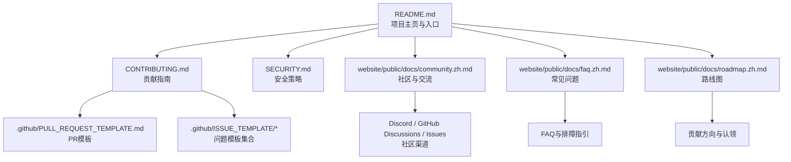
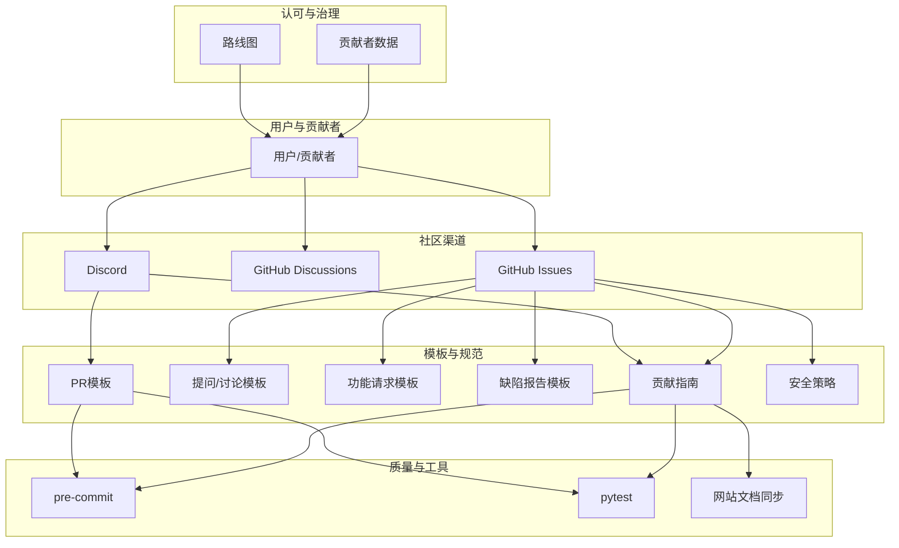
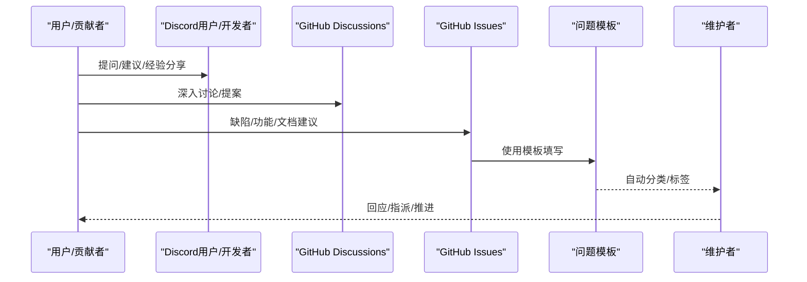
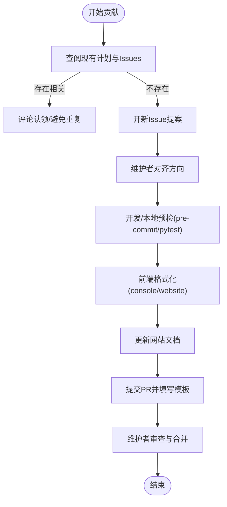
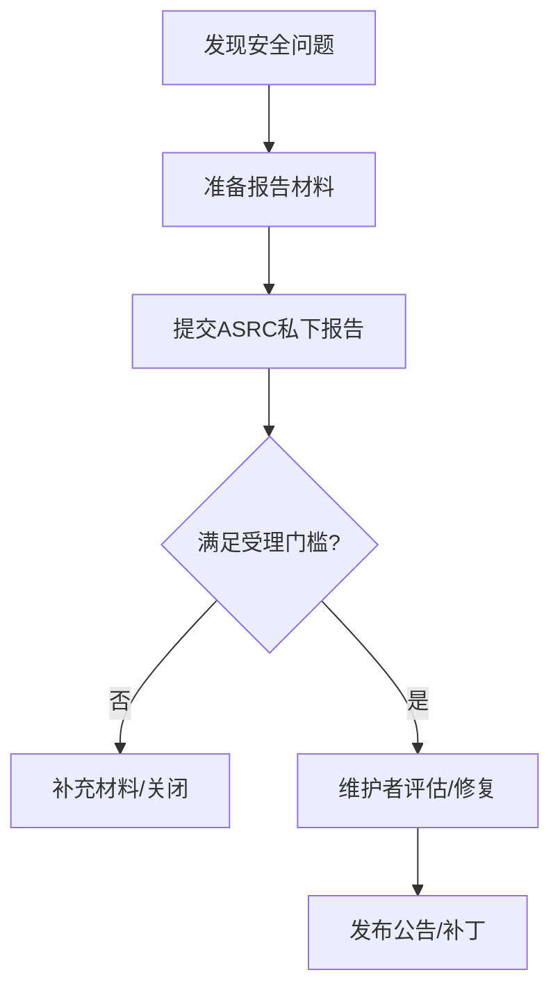
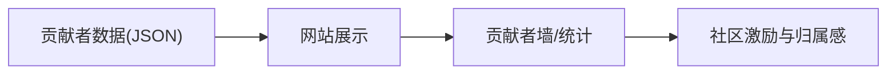
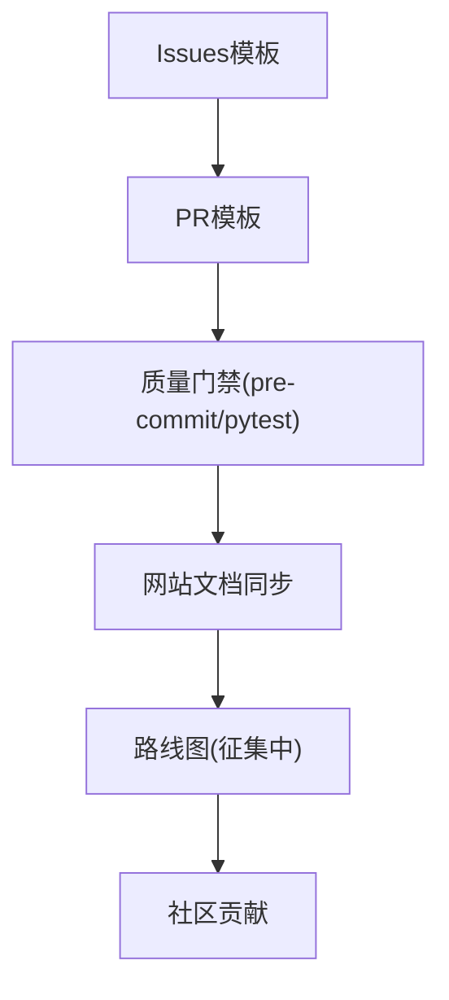
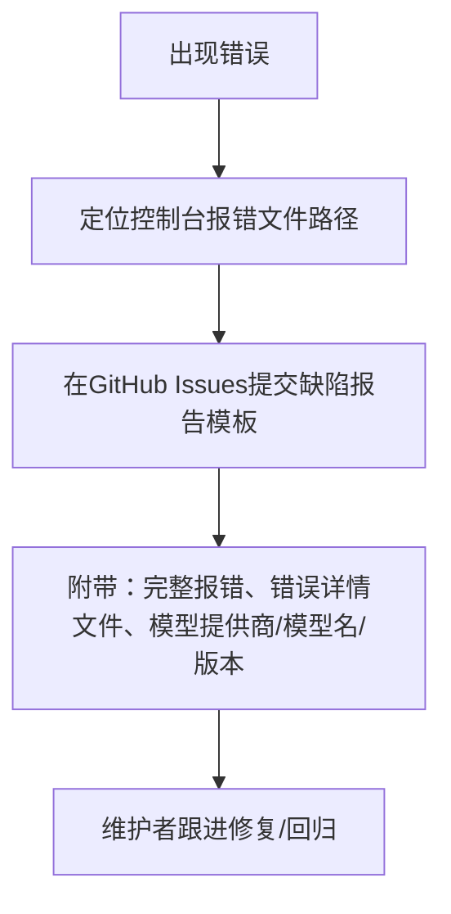

# 社区支持

<cite>
**本文引用的文件**
- [README.md](file://README.md)
- [CONTRIBUTING.md](file://CONTRIBUTING.md)
- [SECURITY.md](file://SECURITY.md)
- [.github/PULL_REQUEST_TEMPLATE.md](file://.github/PULL_REQUEST_TEMPLATE.md)
- [.github/ISSUE_TEMPLATE/1-question.md](file://.github/ISSUE_TEMPLATE/1-question.md)
- [.github/ISSUE_TEMPLATE/2-feature_request.md](file://.github/ISSUE_TEMPLATE/2-feature_request.md)
- [.github/ISSUE_TEMPLATE/4-bug_report.md](file://.github/ISSUE_TEMPLATE/4-bug_report.md)
- [website/public/docs/community.zh.md](file://website/public/docs/community.zh.md)
- [website/public/docs/contributing.zh.md](file://website/public/docs/contributing.zh.md)
- [website/public/docs/faq.zh.md](file://website/public/docs/faq.zh.md)
- [website/public/docs/roadmap.zh.md](file://website/public/docs/roadmap.zh.md)
- [website/public/contributors_data.json](file://website/public/contributors_data.json)
</cite>

## 目录
1. [简介](#简介)
2. [项目结构](#项目结构)
3. [核心组件](#核心组件)
4. [架构总览](#架构总览)
5. [详细组件分析](#详细组件分析)
6. [依赖分析](#依赖分析)
7. [性能考虑](#性能考虑)
8. [故障排除指南](#故障排除指南)
9. [结论](#结论)
10. [附录](#附录)

## 简介
本文件面向QwenPaw社区用户与贡献者，系统化梳理社区生态、贡献方式、支持渠道与行为规范，帮助你高效参与项目共建、获取技术支持与解答常见问题。QwenPaw是一个开源个人AI助手，支持本地/云端部署、多通道连接、技能扩展与多智能体协作，社区通过Discord、GitHub Discussions、GitHub Issues等渠道提供交流与协作空间。

## 项目结构
围绕社区支持的关键文档与模板分布如下：
- 顶层文档与入口
  - 项目主页与安装/贡献/安全/FAQ等入口：[README.md](file://README.md)
  - 贡献指南与规范：[CONTRIBUTING.md](file://CONTRIBUTING.md)
  - 安全策略与披露流程：[SECURITY.md](file://SECURITY.md)
- GitHub社区模板
  - PR模板：[PULL_REQUEST_TEMPLATE.md](file://.github/PULL_REQUEST_TEMPLATE.md)
  - 问题模板：提问/讨论、功能请求、缺陷报告
    - [1-question.md](file://.github/ISSUE_TEMPLATE/1-question.md)
    - [2-feature_request.md](file://.github/ISSUE_TEMPLATE/2-feature_request.md)
    - [4-bug_report.md](file://.github/ISSUE_TEMPLATE/4-bug_report.md)
- 网站文档（中文）
  - 社区与交流：[community.zh.md](file://website/public/docs/community.zh.md)
  - 贡献指南（中文）：[contributing.zh.md](file://website/public/docs/contributing.zh.md)
  - 常见问题（中文）：[faq.zh.md](file://website/public/docs/faq.zh.md)
  - 路线图（中文）：[roadmap.zh.md](file://website/public/docs/roadmap.zh.md)
- 贡献者数据
  - 贡献者统计与展示：[contributors_data.json](file://website/public/contributors_data.json)

**图表来源**
- [README.md](file://README.md)
- [CONTRIBUTING.md](file://CONTRIBUTING.md)
- [SECURITY.md](file://SECURITY.md)
- [website/public/docs/community.zh.md](file://website/public/docs/community.zh.md)
- [website/public/docs/faq.zh.md](file://website/public/docs/faq.zh.md)
- [website/public/docs/roadmap.zh.md](file://website/public/docs/roadmap.zh.md)
- [.github/PULL_REQUEST_TEMPLATE.md](file://.github/PULL_REQUEST_TEMPLATE.md)
- [.github/ISSUE_TEMPLATE/1-question.md](file://.github/ISSUE_TEMPLATE/1-question.md)
- [.github/ISSUE_TEMPLATE/2-feature_request.md](file://.github/ISSUE_TEMPLATE/2-feature_request.md)
- [.github/ISSUE_TEMPLATE/4-bug_report.md](file://.github/ISSUE_TEMPLATE/4-bug_report.md)

**章节来源**
- [README.md](file://README.md)
- [CONTRIBUTING.md](file://CONTRIBUTING.md)
- [SECURITY.md](file://SECURITY.md)
- [website/public/docs/community.zh.md](file://website/public/docs/community.zh.md)
- [website/public/docs/faq.zh.md](file://website/public/docs/faq.zh.md)
- [website/public/docs/roadmap.zh.md](file://website/public/docs/roadmap.zh.md)
- [.github/PULL_REQUEST_TEMPLATE.md](file://.github/PULL_REQUEST_TEMPLATE.md)
- [.github/ISSUE_TEMPLATE/1-question.md](file://.github/ISSUE_TEMPLATE/1-question.md)
- [.github/ISSUE_TEMPLATE/2-feature_request.md](file://.github/ISSUE_TEMPLATE/2-feature_request.md)
- [.github/ISSUE_TEMPLATE/4-bug_report.md](file://.github/ISSUE_TEMPLATE/4-bug_report.md)

## 核心组件
- 社区渠道
  - Discord：用户社区与开发者社区双通道，便于提问、经验分享、功能建议与开发协作
  - GitHub Discussions：深入技术讨论、功能提案、教程与最佳实践
  - GitHub Issues：缺陷报告、功能请求与文档改进建议
- 贡献流程
  - 贡献前准备：查阅现有计划与Issues，避免重复劳动
  - 提交规范：Conventional Commits与PR标题格式
  - 质量门禁：本地预检（pre-commit、pytest）、前端格式化、文档同步
- 安全与合规
  - 私有漏洞披露：通过阿里安全响应中心（ASRC）私下报告
  - 信任模型与边界：单操作员边界、通道/用户白名单、最小权限与沙箱
- 贡献者认可
  - 贡献者统计数据与展示，激励社区协作与长期贡献

**章节来源**
- [README.md](file://README.md)
- [CONTRIBUTING.md](file://CONTRIBUTING.md)
- [SECURITY.md](file://SECURITY.md)
- [website/public/docs/community.zh.md](file://website/public/docs/community.zh.md)
- [website/public/contributors_data.json](file://website/public/contributors_data.json)

## 架构总览
社区支持的协作与沟通架构由“渠道—模板—流程—工具”构成，形成从问题发现到修复闭环的协作体系。

**图表来源**
- [README.md](file://README.md)
- [CONTRIBUTING.md](file://CONTRIBUTING.md)
- [SECURITY.md](file://SECURITY.md)
- [.github/PULL_REQUEST_TEMPLATE.md](file://.github/PULL_REQUEST_TEMPLATE.md)
- [.github/ISSUE_TEMPLATE/1-question.md](file://.github/ISSUE_TEMPLATE/1-question.md)
- [.github/ISSUE_TEMPLATE/2-feature_request.md](file://.github/ISSUE_TEMPLATE/2-feature_request.md)
- [.github/ISSUE_TEMPLATE/4-bug_report.md](file://.github/ISSUE_TEMPLATE/4-bug_report.md)
- [website/public/docs/community.zh.md](file://website/public/docs/community.zh.md)
- [website/public/docs/contributing.zh.md](file://website/public/docs/contributing.zh.md)
- [website/public/docs/roadmap.zh.md](file://website/public/docs/roadmap.zh.md)
- [website/public/contributors_data.json](file://website/public/contributors_data.json)

## 详细组件分析

### 社区渠道与支持流程
- 用户社区
  - 适用场景：安装/配置/使用问题、经验分享、功能建议、Bug反馈、获取最新动态
  - 渠道入口：Discord、X（Twitter）、钉钉群
- 开发者社区
  - 适用场景：技术实现细节、协作与任务认领、测试与质量、路线图讨论
  - 入群条件：需在入群备注中提供已提交PR、已认领功能或期望参与的开发项
- GitHub渠道
  - Discussions：技术问答、功能提案、教程与最佳实践、投票与意见征集
  - Issues：缺陷报告（使用缺陷模板）、功能请求（使用功能请求模板）、文档改进建议

**图表来源**
- [website/public/docs/community.zh.md](file://website/public/docs/community.zh.md)
- [.github/ISSUE_TEMPLATE/1-question.md](file://.github/ISSUE_TEMPLATE/1-question.md)
- [.github/ISSUE_TEMPLATE/2-feature_request.md](file://.github/ISSUE_TEMPLATE/2-feature_request.md)
- [.github/ISSUE_TEMPLATE/4-bug_report.md](file://.github/ISSUE_TEMPLATE/4-bug_report.md)

**章节来源**
- [website/public/docs/community.zh.md](file://website/public/docs/community.zh.md)
- [.github/ISSUE_TEMPLATE/1-question.md](file://.github/ISSUE_TEMPLATE/1-question.md)
- [.github/ISSUE_TEMPLATE/2-feature_request.md](file://.github/ISSUE_TEMPLATE/2-feature_request.md)
- [.github/ISSUE_TEMPLATE/4-bug_report.md](file://.github/ISSUE_TEMPLATE/4-bug_report.md)

### 贡献流程与质量门禁
- 贡献前检查
  - 查阅开放Issues与路线图，避免重复劳动；无相关Issue时先开提案
- 提交规范
  - Conventional Commits与PR标题格式统一历史与审查体验
- 质量门禁
  - 本地预检：安装开发依赖、安装并运行pre-commit、pytest
  - 前端格式化：针对console/website目录运行格式化工具
  - 文档同步：用户可见行为变更需同步更新网站文档
- PR模板要点
  - 组件影响面、测试验证、本地证据、渠道安全注意事项

**图表来源**
- [CONTRIBUTING.md](file://CONTRIBUTING.md)
- [.github/PULL_REQUEST_TEMPLATE.md](file://.github/PULL_REQUEST_TEMPLATE.md)

**章节来源**
- [CONTRIBUTING.md](file://CONTRIBUTING.md)
- [.github/PULL_REQUEST_TEMPLATE.md](file://.github/PULL_REQUEST_TEMPLATE.md)

### 安全策略与漏洞披露
- 报告渠道
  - 通过阿里安全响应中心（ASRC）私下披露
- 报告要素
  - 标题、严重性评估、影响、受影响组件、技术复现步骤、影响证明、环境、修复建议
- 受理门槛
  - 明确脆弱路径/函数/行号、版本/提交SHA、可复现PoC、影响边界说明、范围说明
- 常见误区
  - 仅注入类攻击（无越界）不计入；操作员授权动作不视为提权；暴露第三方凭据不计
- 信任模型
  - 单操作员边界、共享实例的允许列表、最小权限与沙箱、限制凭据存放位置、定期审查

**图表来源**
- [SECURITY.md](file://SECURITY.md)

**章节来源**
- [SECURITY.md](file://SECURITY.md)

### 贡献者认可与社区成就
- 贡献者数据
  - 通过JSON统计贡献次数，用于社区展示与激励
- 成就与认可
  - 路线图中标注“征集中”的方向欢迎社区贡献
  - README与网站文档展示贡献者头像墙与贡献者链接

**图表来源**
- [website/public/contributors_data.json](file://website/public/contributors_data.json)
- [website/public/docs/roadmap.zh.md](file://website/public/docs/roadmap.zh.md)
- [README.md](file://README.md)

**章节来源**
- [website/public/contributors_data.json](file://website/public/contributors_data.json)
- [website/public/docs/roadmap.zh.md](file://website/public/docs/roadmap.zh.md)
- [README.md](file://README.md)

## 依赖分析
- 贡献流程依赖
  - Issues模板与PR模板作为协作契约，约束信息完整性与审查效率
  - 质量门禁（pre-commit、pytest）保障代码一致性与稳定性
- 社区渠道依赖
  - Discord与GitHub Discussions承担不同层次的沟通职责，Issues承载正式需求与缺陷
- 文档与路线图依赖
  - 路线图明确“征集中”方向，引导贡献者聚焦价值点
  - 网站文档与贡献指南联动，确保用户可见行为变更得到同步

**图表来源**
- [.github/ISSUE_TEMPLATE/1-question.md](file://.github/ISSUE_TEMPLATE/1-question.md)
- [.github/ISSUE_TEMPLATE/2-feature_request.md](file://.github/ISSUE_TEMPLATE/2-feature_request.md)
- [.github/ISSUE_TEMPLATE/4-bug_report.md](file://.github/ISSUE_TEMPLATE/4-bug_report.md)
- [.github/PULL_REQUEST_TEMPLATE.md](file://.github/PULL_REQUEST_TEMPLATE.md)
- [CONTRIBUTING.md](file://CONTRIBUTING.md)
- [website/public/docs/roadmap.zh.md](file://website/public/docs/roadmap.zh.md)

**章节来源**
- [.github/ISSUE_TEMPLATE/1-question.md](file://.github/ISSUE_TEMPLATE/1-question.md)
- [.github/ISSUE_TEMPLATE/2-feature_request.md](file://.github/ISSUE_TEMPLATE/2-feature_request.md)
- [.github/ISSUE_TEMPLATE/4-bug_report.md](file://.github/ISSUE_TEMPLATE/4-bug_report.md)
- [.github/PULL_REQUEST_TEMPLATE.md](file://.github/PULL_REQUEST_TEMPLATE.md)
- [CONTRIBUTING.md](file://CONTRIBUTING.md)
- [website/public/docs/roadmap.zh.md](file://website/public/docs/roadmap.zh.md)

## 性能考虑
- 贡献效率
  - 使用模板标准化信息，减少来回澄清成本
  - 本地预检前置，降低CI失败率与审查成本
- 社区协作
  - 明确“征集中”方向，集中资源提升交付速度
  - 安全披露流程避免公开面扩大，降低修复成本

## 故障排除指南
- 常见问题与排障
  - 端口冲突（Windows 8088）：更换端口或调整系统保留范围
  - WSL2 MTU超限导致超时：降低WSL2网络接口MTU至1350
  - 定时任务未触发：核查服务运行、启用状态、分发通道与目标ID、Cron表达式
  - 模型配置错误：核对API Key、Base URL、模型名大小写
- 报错获取修复帮助
  - 首选在GitHub Issues提交，附带完整报错与错误详情文件路径、当前模型提供商/模型名与版本

**图表来源**
- [website/public/docs/faq.zh.md](file://website/public/docs/faq.zh.md)
- [.github/ISSUE_TEMPLATE/4-bug_report.md](file://.github/ISSUE_TEMPLATE/4-bug_report.md)

**章节来源**
- [website/public/docs/faq.zh.md](file://website/public/docs/faq.zh.md)
- [.github/ISSUE_TEMPLATE/4-bug_report.md](file://.github/ISSUE_TEMPLATE/4-bug_report.md)

## 结论
QwenPaw社区以清晰的渠道、规范的模板与严格的质量门禁构建高效协作生态。通过遵循贡献指南、利用安全披露流程与充分利用FAQ/路线图，用户与贡献者可以共同推动项目稳健演进，打造更实用、安全、个性化的个人AI助手。

## 附录
- 快速入口
  - 社区与交流：[community.zh.md](file://website/public/docs/community.zh.md)
  - 贡献指南（中文）：[contributing.zh.md](file://website/public/docs/contributing.zh.md)
  - 常见问题（中文）：[faq.zh.md](file://website/public/docs/faq.zh.md)
  - 路线图（中文）：[roadmap.zh.md](file://website/public/docs/roadmap.zh.md)
- 顶层入口
  - 项目主页与安装/贡献/安全/FAQ等入口：[README.md](file://README.md)
  - 贡献指南与规范：[CONTRIBUTING.md](file://CONTRIBUTING.md)
  - 安全策略与披露流程：[SECURITY.md](file://SECURITY.md)