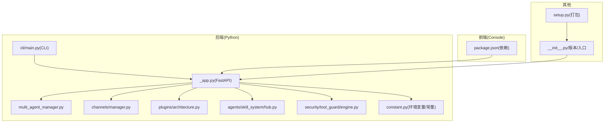
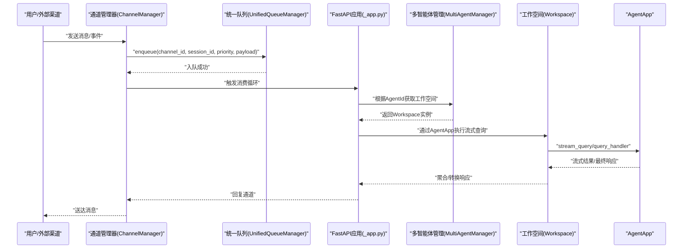
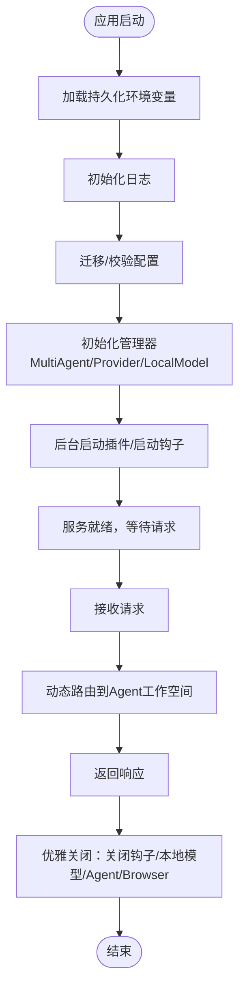
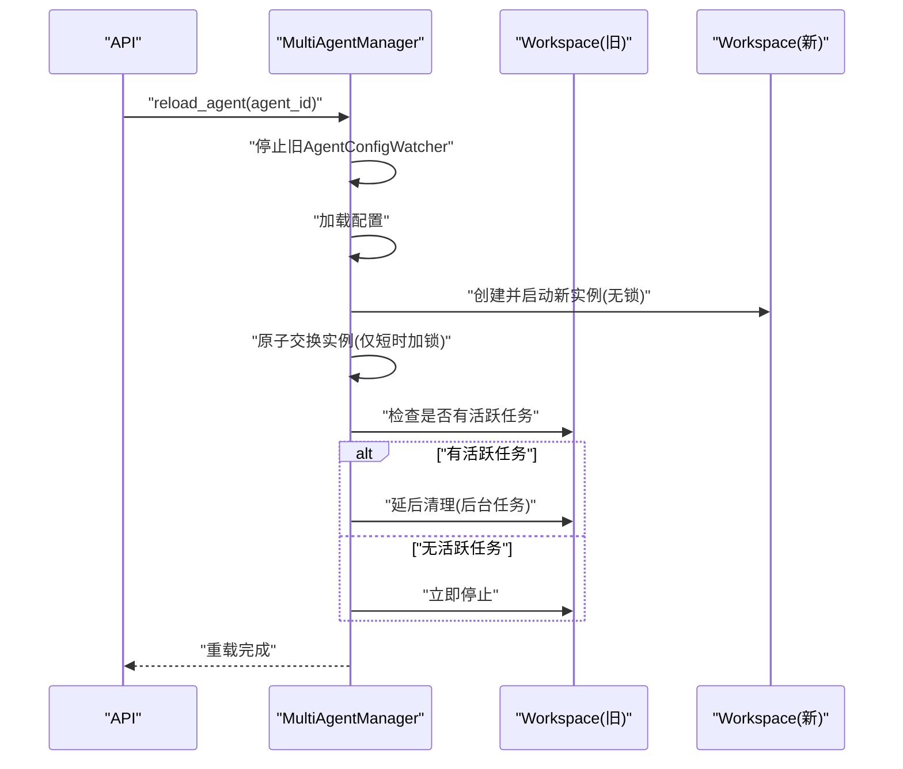
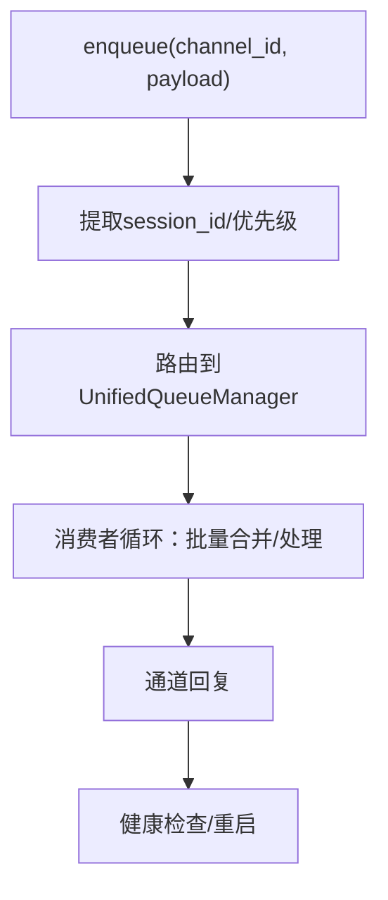
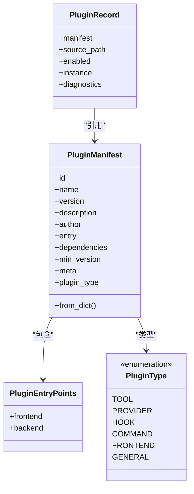
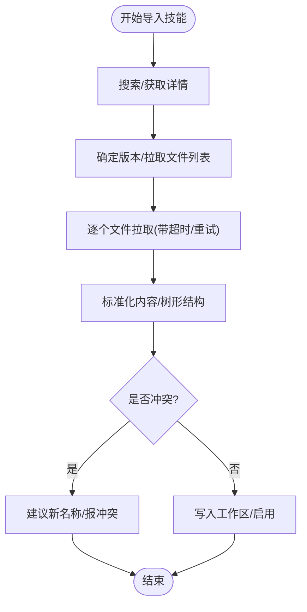
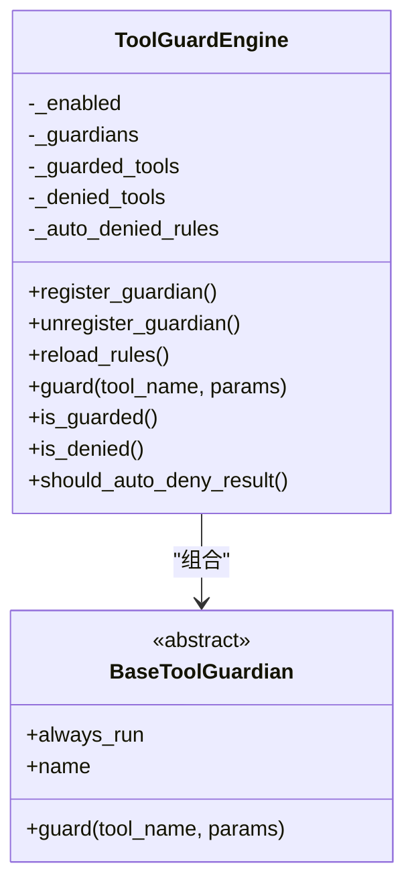
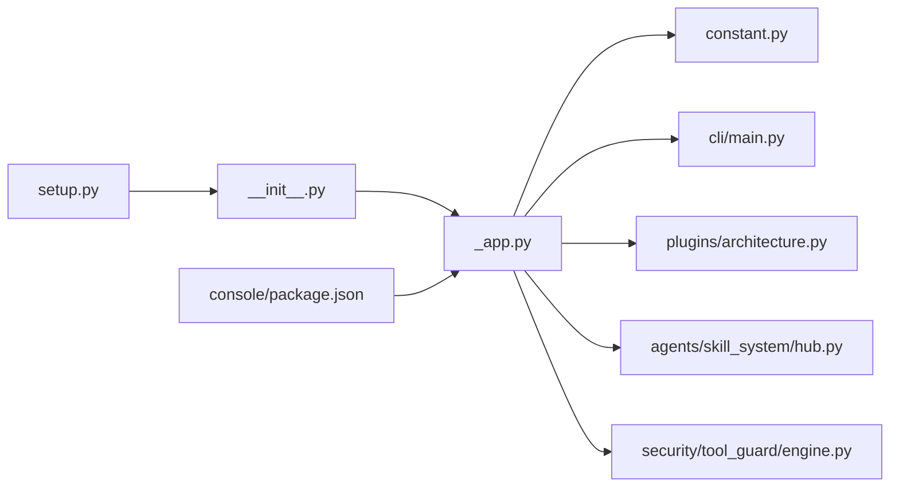

# 项目概述

<cite>
**本文引用的文件**
- [README.md](file://README.md)
- [website/public/docs/intro.en.md](file://website/public/docs/intro.en.md)
- [website/public/docs/roadmap.en.md](file://website/public/docs/roadmap.en.md)
- [src/qwenpaw/__init__.py](file://src/qwenpaw/__init__.py)
- [src/qwenpaw/__version__.py](file://src/qwenpaw/__version__.py)
- [src/qwenpaw/app/_app.py](file://src/qwenpaw/app/_app.py)
- [src/qwenpaw/cli/main.py](file://src/qwenpaw/cli/main.py)
- [src/qwenpaw/constant.py](file://src/qwenpaw/constant.py)
- [src/qwenpaw/app/multi_agent_manager.py](file://src/qwenpaw/app/multi_agent_manager.py)
- [src/qwenpaw/app/channels/manager.py](file://src/qwenpaw/app/channels/manager.py)
- [src/qwenpaw/plugins/architecture.py](file://src/qwenpaw/plugins/architecture.py)
- [src/qwenpaw/agents/skill_system/hub.py](file://src/qwenpaw/agents/skill_system/hub.py)
- [src/qwenpaw/security/tool_guard/engine.py](file://src/qwenpaw/security/tool_guard/engine.py)
- [console/package.json](file://console/package.json)
- [setup.py](file://setup.py)
</cite>

## 目录
1. [引言](#引言)
2. [项目结构](#项目结构)
3. [核心组件](#核心组件)
4. [架构总览](#架构总览)
5. [详细组件分析](#详细组件分析)
6. [依赖关系分析](#依赖关系分析)
7. [性能考量](#性能考量)
8. [故障排查指南](#故障排查指南)
9. [结论](#结论)
10. [附录](#附录)

## 引言
QwenPaw 是一个可本地部署的个人智能体助手平台，强调“你的掌控、你的成长”。它支持多渠道通信、多智能体协作、技能扩展、本地模型运行与多层安全防护，帮助用户在私有环境中构建个性化、可演进的AI助理生态。

- 核心定位：个人AI助手工作站，既可本地部署也可云端运行；数据与记忆完全可控。
- 主要特性：多渠道聊天、多智能体协作、技能池扩展、本地模型、内存演化与主动服务、多层安全。
- 技术优势：模块化插件体系、统一通道队列管理、动态多智能体运行器、前端静态资源内嵌、可观测与可诊断能力。
- 生态价值：开放安装方式（pip、脚本、Docker、桌面应用）、文档与路线图公开、社区贡献导向。

**章节来源**
- [README.md:1-533](file://README.md#L1-L533)
- [website/public/docs/intro.en.md:1-115](file://website/public/docs/intro.en.md#L1-L115)

## 项目结构
项目采用前后端分离与模块化组织：
- 后端（Python）：FastAPI 应用、多智能体管理、通道管理、技能系统、安全引擎、插件架构等。
- 前端（React/Vite）：控制台界面，打包后内嵌到Python包中，提供聊天、配置、技能管理等功能。
- 部署与工具：Docker镜像、桌面应用、安装脚本、构建脚本等。

**图表来源**
- [src/qwenpaw/app/_app.py:547-719](file://src/qwenpaw/app/_app.py#L547-L719)
- [src/qwenpaw/app/multi_agent_manager.py:22-537](file://src/qwenpaw/app/multi_agent_manager.py#L22-L537)
- [src/qwenpaw/app/channels/manager.py:68-800](file://src/qwenpaw/app/channels/manager.py#L68-L800)
- [src/qwenpaw/plugins/architecture.py:10-142](file://src/qwenpaw/plugins/architecture.py#L10-L142)
- [src/qwenpaw/agents/skill_system/hub.py:1-800](file://src/qwenpaw/agents/skill_system/hub.py#L1-L800)
- [src/qwenpaw/security/tool_guard/engine.py:54-269](file://src/qwenpaw/security/tool_guard/engine.py#L54-L269)
- [src/qwenpaw/constant.py:1-368](file://src/qwenpaw/constant.py#L1-L368)
- [src/qwenpaw/cli/main.py:58-173](file://src/qwenpaw/cli/main.py#L58-L173)
- [console/package.json:1-79](file://console/package.json#L1-L79)
- [src/qwenpaw/__init__.py:1-33](file://src/qwenpaw/__init__.py#L1-L33)
- [setup.py:1-5](file://setup.py#L1-L5)

**章节来源**
- [src/qwenpaw/app/_app.py:547-719](file://src/qwenpaw/app/_app.py#L547-L719)
- [console/package.json:1-79](file://console/package.json#L1-L79)
- [setup.py:1-5](file://setup.py#L1-L5)

## 核心组件
- 应用入口与生命周期：FastAPI 应用、启动/关闭钩子、日志与静态资源、路由注册、AgentApp 集成。
- 多智能体管理：按需加载、零停机热重载、并行启动、任务追踪与优雅停止。
- 通道系统：统一队列管理、优先级调度、批量合并、健康检查与单通道重启。
- 插件体系：类型化清单、前后端入口点、启动/关闭钩子、命令注册。
- 技能系统：技能仓库访问、冲突检测、下载与安装、超时/重试策略。
- 安全机制：工具调用守卫（路径、规则、逃逸检测）、文件访问控制、技能扫描。
- 环境与常量：工作目录、密钥目录、备份/媒体目录、CORS、并发与限流参数、日志级别等。
- CLI：延迟加载子命令、主机/端口解析、版本输出。

**章节来源**
- [src/qwenpaw/app/_app.py:220-546](file://src/qwenpaw/app/_app.py#L220-L546)
- [src/qwenpaw/app/multi_agent_manager.py:22-537](file://src/qwenpaw/app/multi_agent_manager.py#L22-L537)
- [src/qwenpaw/app/channels/manager.py:68-800](file://src/qwenpaw/app/channels/manager.py#L68-L800)
- [src/qwenpaw/plugins/architecture.py:10-142](file://src/qwenpaw/plugins/architecture.py#L10-L142)
- [src/qwenpaw/agents/skill_system/hub.py:1-800](file://src/qwenpaw/agents/skill_system/hub.py#L1-L800)
- [src/qwenpaw/security/tool_guard/engine.py:54-269](file://src/qwenpaw/security/tool_guard/engine.py#L54-L269)
- [src/qwenpaw/constant.py:1-368](file://src/qwenpaw/constant.py#L1-L368)
- [src/qwenpaw/cli/main.py:58-173](file://src/qwenpaw/cli/main.py#L58-L173)

## 架构总览
下图展示从请求进入、通道入队、统一队列消费、到多智能体工作空间处理的整体流程。

**图表来源**
- [src/qwenpaw/app/_app.py:88-205](file://src/qwenpaw/app/_app.py#L88-L205)
- [src/qwenpaw/app/multi_agent_manager.py:42-137](file://src/qwenpaw/app/multi_agent_manager.py#L42-L137)
- [src/qwenpaw/app/channels/manager.py:352-461](file://src/qwenpaw/app/channels/manager.py#L352-L461)

## 详细组件分析

### 组件A：应用生命周期与控制台集成
- 动态多智能体运行器：根据请求头选择AgentId，动态路由至对应工作空间，支持外部任务注册与取消清理。
- 生命周期钩子：启动阶段迁移旧工作区、预加载默认智能体、后台插件加载与启动钩子、关闭阶段执行插件关闭钩子、停止本地模型服务、停止所有Agent与浏览器实例。
- 控制台静态资源：优先读取打包的前端dist，回退到仓库或当前目录，SPA回退保证路由兼容。

**图表来源**
- [src/qwenpaw/app/_app.py:220-546](file://src/qwenpaw/app/_app.py#L220-L546)

**章节来源**
- [src/qwenpaw/app/_app.py:220-546](file://src/qwenpaw/app/_app.py#L220-L546)

### 组件B：多智能体管理（零停机热重载）
- 按需加载：首次请求才创建并启动工作空间，避免冷启动阻塞。
- 并行启动：并发初始化多个Agent，减少整体启动时间。
- 零停机重载：新实例先启动，原子替换旧实例，若有活跃任务则延后清理旧实例，确保不中断流式任务。
- 任务追踪：跟踪外部任务并在重载/关闭时进行清理。

**图表来源**
- [src/qwenpaw/app/multi_agent_manager.py:255-382](file://src/qwenpaw/app/multi_agent_manager.py#L255-L382)

**章节来源**
- [src/qwenpaw/app/multi_agent_manager.py:22-537](file://src/qwenpaw/app/multi_agent_manager.py#L22-L537)

### 组件C：通道系统与统一队列
- 统一队列：按通道/会话/优先级分发，支持批量合并与去抖键提取，保障高吞吐与一致性。
- 优先级与命令注册：基于命令注册表对消息进行优先级分类，实现重要命令快速处理。
- 单通道重启：带锁的替换流程，确保资源不泄漏；支持注入工作空间与命令注册表。

**图表来源**
- [src/qwenpaw/app/channels/manager.py:258-461](file://src/qwenpaw/app/channels/manager.py#L258-L461)

**章节来源**
- [src/qwenpaw/app/channels/manager.py:68-800](file://src/qwenpaw/app/channels/manager.py#L68-L800)

### 组件D：插件架构与清单
- 类型化插件清单：支持工具、提供方、钩子、命令、前端等类型，自动推断类型以兼容旧清单。
- 前后端入口点：前端JS包与后端入口，便于动态加载与扩展。
- 运行时注册：启动时注册插件提供的命令与提供方，注入运行时辅助对象。

**图表来源**
- [src/qwenpaw/plugins/architecture.py:36-142](file://src/qwenpaw/plugins/architecture.py#L36-L142)

**章节来源**
- [src/qwenpaw/plugins/architecture.py:10-142](file://src/qwenpaw/plugins/architecture.py#L10-L142)

### 组件E：技能系统与仓库交互
- 仓库访问：支持自定义基础URL、搜索/详情/文件路径、超时与重试策略、GitHub令牌支持。
- 冲突检测与命名建议：当存在同名技能时提供冲突提示与建议名称。
- 下载与解包：限制ZIP条目数量与大小，提取SKILL.md与相关文件树，标准化内容。

**图表来源**
- [src/qwenpaw/agents/skill_system/hub.py:190-800](file://src/qwenpaw/agents/skill_system/hub.py#L190-L800)

**章节来源**
- [src/qwenpaw/agents/skill_system/hub.py:1-800](file://src/qwenpaw/agents/skill_system/hub.py#L1-L800)

### 组件F：工具调用守卫与安全
- 多守护者协同：路径检查、规则匹配、逃逸检测等，统一聚合结果并记录耗时。
- 可配置开关与规则：支持环境变量与配置覆盖，支持自动拒绝规则与受保护工具集合。
- 延迟单例：懒加载守护引擎，避免不必要的初始化成本。

**图表来源**
- [src/qwenpaw/security/tool_guard/engine.py:54-269](file://src/qwenpaw/security/tool_guard/engine.py#L54-L269)

**章节来源**
- [src/qwenpaw/security/tool_guard/engine.py:54-269](file://src/qwenpaw/security/tool_guard/engine.py#L54-L269)

### 组件G：CLI与版本
- 延迟加载：Click Group 按需导入子命令，降低启动开销。
- 版本与入口：读取版本号，支持主机/端口参数，默认回退到上次运行记录。

**章节来源**
- [src/qwenpaw/cli/main.py:58-173](file://src/qwenpaw/cli/main.py#L58-L173)
- [src/qwenpaw/__version__.py:1-3](file://src/qwenpaw/__version__.py#L1-L3)

## 依赖关系分析
- 包装与入口：setup.py 调用 setuptools；__init__.py 初始化日志与环境变量。
- 前端依赖：console/package.json 管理 React、Ant Design、Mermaid 等依赖。
- 运行时常量：constant.py 提供工作目录、密钥目录、备份目录、CORS、并发与限流等配置项。

**图表来源**
- [setup.py:1-5](file://setup.py#L1-L5)
- [src/qwenpaw/__init__.py:1-33](file://src/qwenpaw/__init__.py#L1-L33)
- [src/qwenpaw/app/_app.py:547-719](file://src/qwenpaw/app/_app.py#L547-L719)
- [src/qwenpaw/constant.py:1-368](file://src/qwenpaw/constant.py#L1-L368)
- [src/qwenpaw/cli/main.py:58-173](file://src/qwenpaw/cli/main.py#L58-L173)
- [src/qwenpaw/plugins/architecture.py:10-142](file://src/qwenpaw/plugins/architecture.py#L10-L142)
- [src/qwenpaw/agents/skill_system/hub.py:1-800](file://src/qwenpaw/agents/skill_system/hub.py#L1-L800)
- [src/qwenpaw/security/tool_guard/engine.py:54-269](file://src/qwenpaw/security/tool_guard/engine.py#L54-L269)
- [console/package.json:1-79](file://console/package.json#L1-L79)

**章节来源**
- [setup.py:1-5](file://setup.py#L1-L5)
- [src/qwenpaw/__init__.py:1-33](file://src/qwenpaw/__init__.py#L1-L33)
- [src/qwenpaw/constant.py:1-368](file://src/qwenpaw/constant.py#L1-L368)

## 性能考量
- 启动优化：同步阶段最小化，后台异步启动插件与Agent，显著缩短首包响应时间。
- 并发与限流：统一的并发信号量、QPM滑动窗口、指数退避与抖动，避免上游限流导致的拥塞。
- 队列与批处理：统一队列按会话与优先级分发，批量合并减少重复处理与网络往返。
- 零停机重载：新旧实例原子切换，后台清理活跃任务，避免服务中断。
- 日志与可观测：统一日志初始化、文件句柄、启动横幅打印，便于问题定位。

[本节为通用性能讨论，无需特定文件引用]

## 故障排查指南
- 启动失败：检查恢复工件清理、持久化环境变量加载、遥测收集状态。
- 插件问题：查看插件加载与启动/关闭钩子日志，确认注册的控制命令与提供方。
- 通道异常：使用健康检查接口与单通道重启，结合队列清理与会话维度重试。
- 工具调用被拒：检查工具守卫配置、自动拒绝规则与受保护工具集合，必要时调整策略。
- 版本与升级：遵循更新说明，重建前端、重新安装Python包、清理浏览器缓存。

**章节来源**
- [src/qwenpaw/app/_app.py:232-290](file://src/qwenpaw/app/_app.py#L232-L290)
- [src/qwenpaw/app/channels/manager.py:549-665](file://src/qwenpaw/app/channels/manager.py#L549-L665)
- [src/qwenpaw/security/tool_guard/engine.py:36-52](file://src/qwenpaw/security/tool_guard/engine.py#L36-L52)

## 结论
QwenPaw 以“本地可控、多渠道、多智能体、可扩展、多层安全”为核心，通过模块化的后端架构、统一的通道与队列、灵活的插件与技能系统，以及完善的生命周期与可观测性，为个人与团队提供了可演进的智能体助手平台。其开源理念与社区驱动的路线图，将持续推动生态繁荣与技术创新。

[本节为总结性内容，无需特定文件引用]

## 附录

### 发展历程与版本演进
- v1.1.7：新增收件箱审批、计划增强、浏览器批量动作、远程MCP OAuth、控制台插件管理、图像插件、外部代理异步执行；界面与性能优化。
- v1.1.6、v1.1.5：持续迭代与修复。
- 2026-04-12：CoPaw 正式更名 QwenPaw，体现与Qwen生态的深度融合与更清晰的使命。

**章节来源**
- [README.md:61-88](file://README.md#L61-L88)

### 路线图与未来规划
- 横向扩展：更多渠道、模型、技能、MCP。
- 现有功能增强：显示优化、下载提示、Windows路径兼容等。
- 多智能体：HiClaw集成、Agent Swarm/Team。
- 小大模型协同：设备与云模型智能切换。
- 记忆系统：上下文感知的主动交付。
- 版本与迁移：一键打包、多版本/多设备迁移。
- 自运维：自更新、失败回滚。
- 安全：细粒度规则控制、基于LLM的安全控制。

**章节来源**
- [website/public/docs/roadmap.en.md:1-38](file://website/public/docs/roadmap.en.md#L1-L38)

### 使用场景示例（概念性）
- 社交媒体摘要：每日热点聚合、视频摘要。
- 生产力：邮件/新闻推送、日程与联系人整理。
- 创作与搭建：睡前设定目标，次日原型产出。
- 学习研究：科技/AI追踪、知识库检索复用。
- 文件与桌面：本地文件组织与检索、文档阅读与摘要。
- 计划与心跳：定时检查与摘要推送。

**章节来源**
- [README.md:46-57](file://README.md#L46-L57)